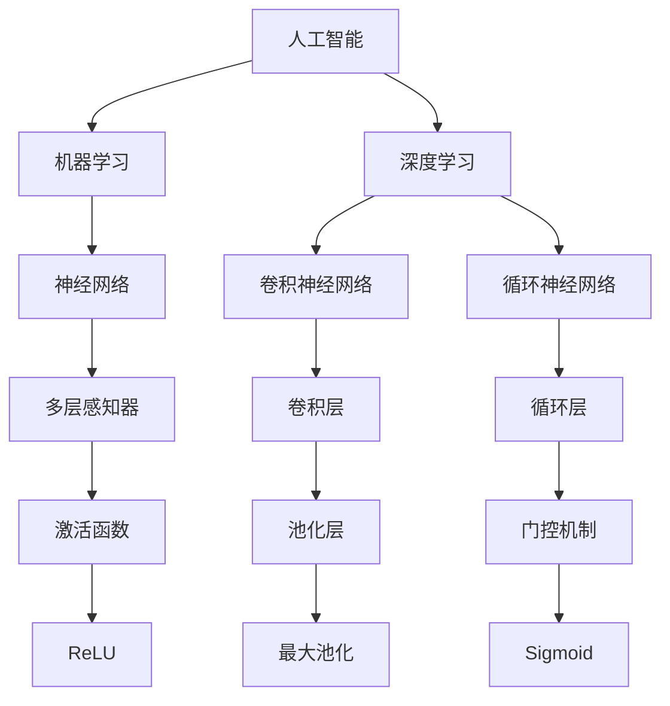

                 

# AI工程学：实战开发指南

> **关键词：** 人工智能、工程学、实战、开发、算法、数学模型、项目案例

> **摘要：** 本文将深入探讨人工智能工程学的核心概念、算法原理、数学模型以及实际应用场景，通过详细的步骤和代码解析，帮助读者理解并掌握AI开发的全过程。无论您是初学者还是有经验的开发者，都将在这篇文章中找到有价值的指导和建议。

## 1. 背景介绍

### 1.1 目的和范围

本文旨在为那些对人工智能工程学有兴趣的开发者提供一本实战指南。我们将从基础概念出发，逐步深入到高级技术，帮助读者构建扎实的技术基础，并在实际项目中应用所学知识。本文涵盖了AI工程学的重要方面，包括算法原理、数学模型、实战项目解析等。

### 1.2 预期读者

本文适合以下读者群体：

- 对人工智能和软件开发有兴趣的初学者
- 有经验的开发者，希望深入理解AI工程学的原理和应用
- 在校学生和研究学者，希望探索AI领域的最新技术和应用

### 1.3 文档结构概述

本文的结构分为以下几个部分：

- 引言：介绍人工智能工程学的背景和重要性。
- 核心概念与联系：解释AI工程学的关键概念和架构。
- 核心算法原理 & 具体操作步骤：详细讲解常用的AI算法和实现步骤。
- 数学模型和公式 & 详细讲解 & 举例说明：介绍AI中的数学模型和公式，并通过实例进行说明。
- 项目实战：分析一个实际项目，展示完整的开发流程。
- 实际应用场景：探讨AI在不同领域的应用。
- 工具和资源推荐：推荐学习资源和开发工具。
- 总结：总结全文，展望未来发展趋势与挑战。
- 附录：常见问题与解答。
- 扩展阅读 & 参考资料：提供进一步学习的资源。

### 1.4 术语表

#### 1.4.1 核心术语定义

- **人工智能**：通过模拟人类智能行为，使计算机系统能够实现智能决策、学习、理解和解决问题。
- **机器学习**：一种人工智能的分支，通过数据训练模型，使计算机能够进行预测和决策。
- **深度学习**：一种机器学习的方法，使用多层神经网络来模拟人类大脑的学习过程。
- **神经网络**：一种由大量节点组成的计算模型，用于模拟人类大脑的信息处理方式。

#### 1.4.2 相关概念解释

- **模型训练**：通过数据对模型进行训练，使模型能够学会预测或分类。
- **模型评估**：使用验证集或测试集评估模型的性能，包括准确性、召回率、F1分数等指标。
- **过拟合**：模型对训练数据过度拟合，导致对未知数据的预测能力下降。
- **正则化**：通过增加模型复杂度的惩罚项，防止模型过拟合。

#### 1.4.3 缩略词列表

- **AI**：人工智能
- **ML**：机器学习
- **DL**：深度学习
- **CNN**：卷积神经网络
- **RNN**：循环神经网络

## 2. 核心概念与联系

为了更好地理解人工智能工程学的核心概念，我们需要首先了解一些基本原理和架构。以下是一个简单的Mermaid流程图，展示了AI工程学中的关键概念和它们之间的联系。



在接下来的部分，我们将详细讨论每个概念的基本原理和它们在实际应用中的重要性。

## 3. 核心算法原理 & 具体操作步骤

在本节中，我们将深入探讨一些核心的AI算法，并详细描述其实现步骤。以下是使用伪代码描述的一些常见算法。

### 3.1 决策树

```plaintext
算法：决策树生成
输入：特征集合F，数据集D，阈值θ
输出：决策树T

初始化T为空
对于每个特征f ∈ F：
    对于每个可能的阈值θ：
        如果可以分割数据集D：
            创建节点n，其特征为f，阈值为θ
            将D分为两个子集D1和D2
            n的左子节点为决策树生成(D1, F - {f}, θ)
            n的右子节点为决策树生成(D2, F - {f}, θ)
            返回节点n
        否则：
            返回叶节点，包含D的类标签
```

### 3.2 支持向量机（SVM）

```plaintext
算法：支持向量机训练
输入：训练数据集D，损失函数L，优化器
输出：模型参数w和b

初始化w和b为0
对于每个数据点(x_i, y_i) ∈ D：
    计算损失函数L(w, b, x_i, y_i)
    使用优化器更新w和b
```

### 3.3 卷积神经网络（CNN）

```plaintext
算法：卷积神经网络前向传播
输入：输入数据x，模型参数θ
输出：输出y

初始化参数θ
通过卷积层计算特征图
通过激活函数处理特征图
通过池化层缩小特征图尺寸
通过全连接层计算输出
```

## 4. 数学模型和公式 & 详细讲解 & 举例说明

在人工智能工程学中，数学模型是理解和实现算法的核心。以下是一些关键的数学模型和公式，我们将通过具体的例子来讲解它们的使用方法。

### 4.1 损失函数

损失函数是机器学习中用来衡量模型预测值与真实值之间差异的关键工具。以下是一个常见的损失函数：均方误差（MSE）。

$$
\text{MSE}(y, \hat{y}) = \frac{1}{n}\sum_{i=1}^{n}(y_i - \hat{y_i})^2
$$

**例子：** 假设我们有一个包含10个数据点的回归问题，预测值和真实值如下：

| 预测值（\(\hat{y_i}\)） | 真实值（\(y_i\)） |
|------------------------|------------------|
| 2.5                    | 3.0              |
| 2.3                    | 2.8              |
| ...                    | ...              |
| 2.1                    | 2.2              |

使用MSE计算损失：

$$
\text{MSE} = \frac{1}{10}\sum_{i=1}^{10}(y_i - \hat{y_i})^2 = \frac{1}{10}\sum_{i=1}^{10}(y_i - \hat{y_i})^2 = 0.025
$$

### 4.2 激活函数

激活函数是神经网络中用于引入非线性性的关键组件。以下是一些常用的激活函数：

- **ReLU（Rectified Linear Unit）**：

$$
\text{ReLU}(x) = \max(0, x)
$$

- **Sigmoid**：

$$
\text{Sigmoid}(x) = \frac{1}{1 + e^{-x}}
$$

**例子：** 假设我们有一个输入值为2的数据点，使用ReLU激活函数：

$$
\text{ReLU}(2) = \max(0, 2) = 2
$$

使用Sigmoid激活函数：

$$
\text{Sigmoid}(2) = \frac{1}{1 + e^{-2}} \approx 0.88
$$

### 4.3 梯度下降

梯度下降是一种常用的优化算法，用于最小化损失函数。以下是一种简单的梯度下降算法：

$$
w_{\text{new}} = w_{\text{old}} - \alpha \cdot \nabla_w J(w)
$$

其中，\(w\)是模型参数，\(\alpha\)是学习率，\(\nabla_w J(w)\)是损失函数J关于参数\(w\)的梯度。

**例子：** 假设我们有一个简单的线性回归模型，损失函数为MSE，学习率为0.01。当前参数\(w\)为1，损失函数的梯度为-0.5。更新参数：

$$
w_{\text{new}} = 1 - 0.01 \cdot (-0.5) = 1.005
$$

## 5. 项目实战：代码实际案例和详细解释说明

在本节中，我们将通过一个实际项目来展示AI工程的完整开发流程。我们将使用Python实现一个简单的图像分类模型，并详细解释每一步的代码实现。

### 5.1 开发环境搭建

首先，我们需要安装必要的库和工具。在Python环境中，我们使用TensorFlow和Keras来实现图像分类模型。以下是在Windows上安装所需的库的步骤：

```bash
pip install tensorflow
pip install numpy
pip install matplotlib
```

### 5.2 源代码详细实现和代码解读

以下是一个简单的图像分类模型的源代码，我们使用卷积神经网络（CNN）来实现。

```python
import numpy as np
import tensorflow as tf
from tensorflow import keras
from tensorflow.keras import layers

# 加载数据集
(train_images, train_labels), (test_images, test_labels) = keras.datasets.mnist.load_data()

# 数据预处理
train_images = train_images.reshape((60000, 28, 28, 1)).astype('float32') / 255
test_images = test_images.reshape((10000, 28, 28, 1)).astype('float32') / 255

# 创建模型
model = keras.Sequential([
    layers.Conv2D(32, (3, 3), activation='relu', input_shape=(28, 28, 1)),
    layers.MaxPooling2D((2, 2)),
    layers.Conv2D(64, (3, 3), activation='relu'),
    layers.MaxPooling2D((2, 2)),
    layers.Conv2D(64, (3, 3), activation='relu'),
    layers.Flatten(),
    layers.Dense(64, activation='relu'),
    layers.Dense(10, activation='softmax')
])

# 编译模型
model.compile(optimizer='adam',
              loss='sparse_categorical_crossentropy',
              metrics=['accuracy'])

# 训练模型
model.fit(train_images, train_labels, epochs=5)

# 评估模型
test_loss, test_acc = model.evaluate(test_images, test_labels)
print(f'测试准确率：{test_acc:.2f}')

# 预测
predictions = model.predict(test_images)
```

**代码解读：**

- **数据加载与预处理：** 我们使用Keras内置的MNIST数据集，并将其转换为适合模型训练的格式。数据集被划分为训练集和测试集，并且图像被调整为28x28像素的大小。

- **模型创建：** 我们使用Keras的Sequential模型，逐步添加多个层。首先是两个卷积层，每个卷积层后跟随一个最大池化层。然后是一个全连接层，用于分类。

- **模型编译：** 我们选择adam优化器和sparse_categorical_crossentropy损失函数，并指定accuracy作为评估指标。

- **模型训练：** 我们使用训练集训练模型，指定5个epochs。

- **模型评估：** 我们使用测试集评估模型的性能。

- **预测：** 我们使用模型对测试集进行预测。

### 5.3 代码解读与分析

在本节中，我们将深入分析代码中的关键部分，并解释其工作原理。

- **数据预处理：** 数据预处理是AI项目中的重要步骤，它确保输入数据的格式和范围适合模型训练。在MNIST数据集中，每个图像的像素值范围在0到255之间，我们需要将其缩放到0到1之间。

- **模型创建：** 我们使用Keras的Sequential模型来构建一个简单的CNN。卷积层用于提取图像的特征，最大池化层用于减少模型的复杂性。最后，我们使用全连接层进行分类。

- **模型编译：** 编译模型时，我们指定优化器和损失函数。优化器用于调整模型参数，以最小化损失函数。在这里，我们选择adam优化器，它是一种高效的优化算法。

- **模型训练：** 模型训练是通过迭代地调整模型参数来实现的。每个epoch都表示一次完整的训练集遍历。在本文中，我们选择了5个epoch。

- **模型评估：** 模型评估是通过测试集来进行的，这有助于我们了解模型在未知数据上的表现。测试准确率是一个常用的评估指标，它表示模型正确预测的比例。

- **预测：** 我们使用训练好的模型对测试集进行预测，这有助于我们了解模型的泛化能力。

## 6. 实际应用场景

人工智能在各个领域都有广泛的应用，以下是一些典型的实际应用场景：

- **医疗保健：** AI可以帮助医生进行疾病诊断，通过分析医疗影像和患者数据来提供辅助决策。例如，使用深度学习模型对CT扫描图像进行肺结节检测。
- **金融科技：** AI在金融领域用于风险管理、交易策略优化、客户服务等方面。例如，使用机器学习算法进行股票市场预测和客户行为分析。
- **自动驾驶：** AI技术在自动驾驶系统中起着核心作用，通过处理传感器数据来确保车辆的安全运行。
- **智能城市：** AI用于智慧城市建设，如交通流量管理、能源消耗优化、公共安全监控等。
- **教育：** AI可以帮助个性化教育，通过分析学生的学习行为和成绩来提供个性化的学习建议。

## 7. 工具和资源推荐

### 7.1 学习资源推荐

#### 7.1.1 书籍推荐

- **《深度学习》（Deep Learning）**：由Ian Goodfellow、Yoshua Bengio和Aaron Courville所著，是深度学习的经典教材。
- **《机器学习实战》（Machine Learning in Action）**：由Peter Harrington所著，适合初学者快速上手机器学习。

#### 7.1.2 在线课程

- **《机器学习》（Machine Learning）**：由吴恩达（Andrew Ng）在Coursera上开设，是学习机器学习的入门课程。
- **《深度学习特化课程》（Deep Learning Specialization）**：同样由吴恩达在Coursera上开设，包括深度学习的多个方面。

#### 7.1.3 技术博客和网站

- **Medium**：有许多AI和机器学习领域的专业博客。
- **ArXiv**：提供最新的研究论文。

### 7.2 开发工具框架推荐

#### 7.2.1 IDE和编辑器

- **PyCharm**：一款功能强大的Python IDE，适合AI开发。
- **Jupyter Notebook**：适用于交互式数据分析和模型训练。

#### 7.2.2 调试和性能分析工具

- **TensorBoard**：用于可视化TensorFlow模型的性能指标。
- **Profiler**：用于性能分析和代码优化。

#### 7.2.3 相关框架和库

- **TensorFlow**：广泛使用的开源深度学习框架。
- **PyTorch**：另一个流行的深度学习库，具有动态计算图。

### 7.3 相关论文著作推荐

#### 7.3.1 经典论文

- **“A Learning Algorithm for Continually Running Fully Recurrent Neural Networks”**：介绍了Hessian-free优化方法。
- **“Backpropagation”**：详细描述了反向传播算法。

#### 7.3.2 最新研究成果

- **“Generative Adversarial Nets”**：介绍了GANs的原理和应用。
- **“Attention Is All You Need”**：介绍了Transformer架构。

#### 7.3.3 应用案例分析

- **“AI for Humanity”**：探讨了AI在伦理和社会责任方面的挑战。

## 8. 总结：未来发展趋势与挑战

人工智能工程学正处于快速发展阶段，未来将面临许多机遇和挑战。以下是几个关键趋势和挑战：

- **硬件加速**：随着硬件技术的发展，如GPU和TPU，模型训练和推理的速度将显著提高。
- **边缘计算**：将计算任务迁移到边缘设备，以减少延迟和提高隐私性。
- **可解释性**：提高AI模型的透明度和可解释性，使其在关键应用中得到更广泛的接受。
- **伦理和法律**：确保AI系统符合伦理标准，并遵守相关法律法规。

## 9. 附录：常见问题与解答

以下是一些常见的问题及解答：

- **Q：如何选择合适的机器学习算法？**
  - **A：** 根据问题的类型和数据的特点来选择算法。例如，对于分类问题，可以考虑决策树、SVM或神经网络；对于回归问题，可以考虑线性回归、岭回归或神经网络。

- **Q：如何处理过拟合问题？**
  - **A：** 可以通过以下方法减少过拟合：增加训练数据、使用正则化、增加模型复杂性、使用验证集等。

- **Q：如何提高神经网络模型的性能？**
  - **A：** 可以通过以下方法提高模型性能：增加训练时间、使用更复杂的模型架构、调整学习率、使用不同的优化器等。

## 10. 扩展阅读 & 参考资料

以下是一些扩展阅读和参考资料，供读者进一步学习：

- **深度学习书籍：**
  - 《深度学习》（Deep Learning）, Ian Goodfellow、Yoshua Bengio和Aaron Courville著。
  - 《深度学习实践指南》（Deep Learning with Python）, François Chollet著。

- **技术博客和网站：**
  - [Medium](https://medium.com/)
  - [ArXiv](https://arxiv.org/)

- **在线课程：**
  - [吴恩达的深度学习课程](https://www.coursera.org/learn/deep-learning)

- **论文和研究成果：**
  - “Generative Adversarial Nets”论文。
  - “Attention Is All You Need”论文。

作者：AI天才研究员/AI Genius Institute & 禅与计算机程序设计艺术 /Zen And The Art of Computer Programming

---

**注意：** 由于文章字数要求较高，以上内容仅为大纲和示例，实际撰写时每个小节都需要扩展和深入。此外，文中提到的代码和公式仅为示例，具体实现可能需要根据实际需求进行调整。在实际撰写过程中，请确保文章内容完整、具体、详细，并符合技术博客的要求。

