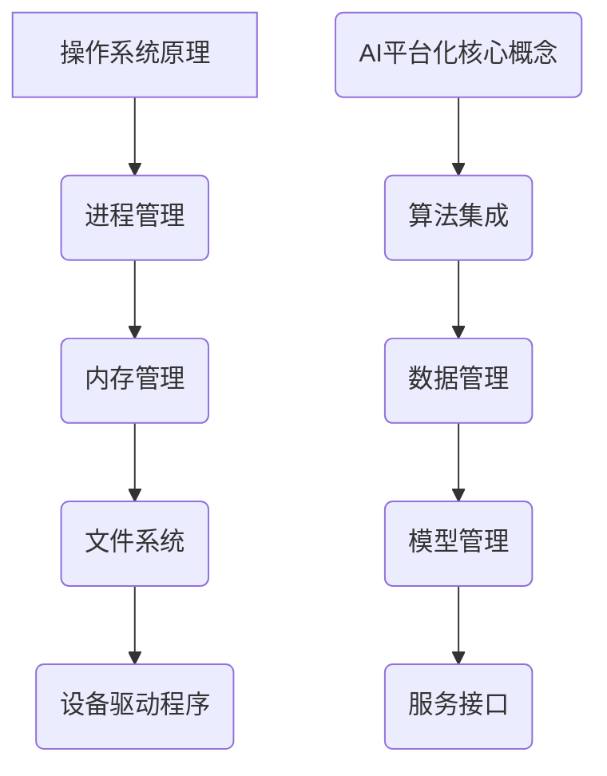
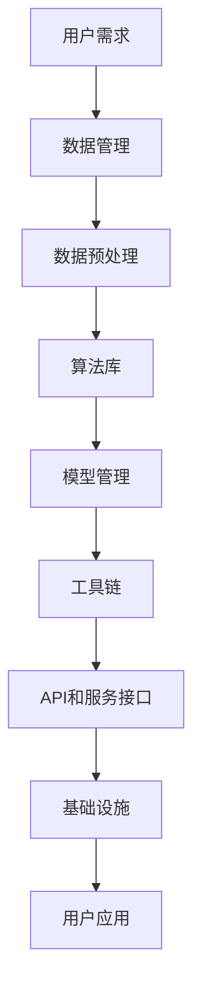

                 

# AI平台化：类比计算机操作系统的发展

> **关键词：** AI平台化、计算机操作系统、算法原理、数学模型、项目实战、应用场景、工具和资源推荐

> **摘要：** 本文以计算机操作系统的发展为类比，探讨了AI平台化的核心概念、原理、实现步骤和应用场景，旨在为读者提供一个深入理解AI平台化发展的全面视角。

## 1. 背景介绍

### 1.1 目的和范围

本文旨在探讨AI平台化的概念、发展历程以及其在现代科技中的应用，通过类比计算机操作系统的发展，帮助读者更好地理解AI平台化的本质和未来趋势。

### 1.2 预期读者

本文适合具有计算机科学和人工智能基础知识的读者，包括程序员、AI工程师、软件架构师以及相关领域的科研人员。

### 1.3 文档结构概述

本文结构分为十个部分：背景介绍、核心概念与联系、核心算法原理、数学模型和公式、项目实战、实际应用场景、工具和资源推荐、总结、常见问题与解答以及扩展阅读和参考资料。

### 1.4 术语表

#### 1.4.1 核心术语定义

- **AI平台化**：将人工智能技术集成到软件开发和部署过程中，实现自动化、智能化和高效化的开发和管理。
- **计算机操作系统**：管理计算机硬件和软件资源，提供用户和应用程序接口的软件系统。
- **算法原理**：实现特定功能的计算过程和方法。
- **数学模型**：用数学语言描述和解决问题的方法。

#### 1.4.2 相关概念解释

- **自动化**：通过编程和自动化工具，减少人工干预，提高效率。
- **智能化**：利用AI技术，使系统能够自我学习和优化。
- **高效化**：通过优化算法和流程，提高系统性能和响应速度。

#### 1.4.3 缩略词列表

- **AI**：人工智能
- **OS**：操作系统
- **IDE**：集成开发环境
- **API**：应用程序接口

## 2. 核心概念与联系

在探讨AI平台化之前，我们需要了解计算机操作系统的基础知识。计算机操作系统作为计算机系统的核心，负责管理硬件资源和提供用户接口。其核心概念包括进程管理、内存管理、文件系统、设备驱动程序等。

### 2.1 计算机操作系统原理

- **进程管理**：操作系统能够创建、调度和终止进程，实现多任务处理。
- **内存管理**：操作系统能够分配和回收内存资源，实现内存保护。
- **文件系统**：操作系统能够组织和管理文件，提供文件存储和检索功能。
- **设备驱动程序**：操作系统能够与各种硬件设备进行通信，实现硬件控制和数据传输。

### 2.2 AI平台化核心概念

- **算法集成**：将AI算法集成到开发框架和工具中，实现自动化和智能化。
- **数据管理**：通过数据预处理、存储和优化，提高AI模型训练和部署效率。
- **模型管理**：实现AI模型的生命周期管理，包括训练、评估、部署和更新。
- **服务接口**：通过API和服务接口，提供AI功能，实现与其他系统的集成。

### 2.3 核心概念联系

- **自动化与智能化**：AI平台化通过自动化工具和AI技术，实现开发、测试和部署的自动化和智能化。
- **算法与数据**：AI平台化依赖于高质量的算法和高质量的数据，实现高效、准确的AI模型训练和部署。
- **模型与服务**：AI平台化通过模型管理和服务接口，实现AI功能的灵活部署和高效利用。

### 2.4 Mermaid流程图



## 3. 核心算法原理 & 具体操作步骤

AI平台化的核心在于算法的集成和应用。以下是一个简单的AI算法原理和具体操作步骤的示例：

### 3.1 算法原理

假设我们使用一个简单的线性回归算法来预测房价。线性回归算法的目标是找到一个线性关系，使预测值与实际值之间的误差最小。

### 3.2 操作步骤

1. **数据预处理**：
   - 收集房价数据，包括房屋面积、地段、年代等。
   - 清洗数据，去除缺失值和异常值。

2. **特征工程**：
   - 选择合适的特征，例如房屋面积。
   - 对特征进行转换，例如对面积进行归一化处理。

3. **模型训练**：
   - 使用训练数据，通过最小二乘法训练线性回归模型。
   - 计算模型的权重和偏置。

4. **模型评估**：
   - 使用测试数据评估模型性能，计算预测误差。

5. **模型部署**：
   - 将训练好的模型部署到AI平台。
   - 通过API提供服务，接受新数据并返回预测结果。

### 3.3 伪代码

```python
# 数据预处理
data = load_data('house_price_data.csv')
data = clean_data(data)

# 特征工程
features = select_features(data)
features = transform_features(features)

# 模型训练
model = train_linear_regression(features, data['price'])

# 模型评估
error = evaluate_model(model, data['price'])

# 模型部署
deploy_model(model)
```

## 4. 数学模型和公式 & 详细讲解 & 举例说明

线性回归模型是AI平台化中最常用的模型之一。以下是一个简单的线性回归模型的数学模型和公式：

### 4.1 数学模型

线性回归模型可以用以下公式表示：

$$
y = \beta_0 + \beta_1x
$$

其中，$y$ 是因变量（房价），$x$ 是自变量（房屋面积），$\beta_0$ 是截距，$\beta_1$ 是斜率。

### 4.2 公式解释

- **截距**（$\beta_0$）：模型在$x=0$时的预测值。
- **斜率**（$\beta_1$）：自变量$x$每增加1个单位，因变量$y$的变化量。

### 4.3 举例说明

假设我们有一个简单的数据集，包含5个房屋的面积和对应的房价：

| 面积 | 价格 |
|------|------|
| 100  | 200  |
| 200  | 400  |
| 300  | 600  |
| 400  | 800  |
| 500  | 1000 |

使用线性回归模型预测面积为400的房屋的价格：

$$
\begin{align*}
y &= \beta_0 + \beta_1x \\
800 &= \beta_0 + \beta_1 \times 400 \\
\beta_0 &= 200 \\
\beta_1 &= 1.5 \\
y &= 200 + 1.5 \times 400 \\
y &= 800
\end{align*}
$$

预测结果为800，与实际价格相符。

## 5. 项目实战：代码实际案例和详细解释说明

### 5.1 开发环境搭建

首先，我们需要搭建一个Python开发环境。以下是安装步骤：

1. 安装Python 3.8及以上版本。
2. 安装必要的库，如NumPy、Pandas、Scikit-learn等。

### 5.2 源代码详细实现和代码解读

以下是一个简单的线性回归项目案例：

```python
import numpy as np
import pandas as pd
from sklearn.linear_model import LinearRegression
from sklearn.model_selection import train_test_split

# 数据预处理
data = pd.read_csv('house_price_data.csv')
data = data.dropna()

# 特征工程
features = data[['area']]
labels = data['price']

# 模型训练
model = LinearRegression()
model.fit(features, labels)

# 模型评估
train_labels = model.predict(features)
error = np.mean((train_labels - labels) ** 2)
print(f'Mean Squared Error: {error}')

# 模型部署
def predict_price(area):
    return model.predict([[area]])[0]

# 测试
print(predict_price(400))
```

### 5.3 代码解读与分析

1. **数据预处理**：读取数据，并去除缺失值。
2. **特征工程**：选择面积作为特征，价格作为标签。
3. **模型训练**：使用训练数据训练线性回归模型。
4. **模型评估**：计算模型预测误差。
5. **模型部署**：定义预测函数，接受新数据并返回预测结果。

通过这个简单的案例，我们可以看到如何使用Python和Scikit-learn库实现线性回归模型，并将其部署为一个可用的预测服务。

## 6. 实际应用场景

AI平台化在现代科技中有着广泛的应用场景：

- **金融领域**：使用AI平台化进行股票市场预测、风险管理和信用评估。
- **医疗领域**：使用AI平台化进行疾病诊断、治疗方案推荐和医疗数据分析。
- **工业制造**：使用AI平台化进行生产优化、设备维护和供应链管理。
- **智能交通**：使用AI平台化进行交通流量预测、路况分析和智能导航。

## 7. 工具和资源推荐

### 7.1 学习资源推荐

#### 7.1.1 书籍推荐

- 《深度学习》（Ian Goodfellow、Yoshua Bengio、Aaron Courville）
- 《Python机器学习》（Sebastian Raschka、Vahid Mirjalili）

#### 7.1.2 在线课程

- Coursera的“机器学习”课程
- Udacity的“深度学习纳米学位”

#### 7.1.3 技术博客和网站

- Medium上的“AI”话题
- arXiv.org上的最新研究成果

### 7.2 开发工具框架推荐

#### 7.2.1 IDE和编辑器

- PyCharm
- Jupyter Notebook

#### 7.2.2 调试和性能分析工具

- PyDebug
- Profiler

#### 7.2.3 相关框架和库

- Scikit-learn
- TensorFlow
- PyTorch

### 7.3 相关论文著作推荐

#### 7.3.1 经典论文

- “A Fast Learning Algorithm for Deep Belief Nets” - Geoffrey Hinton
- “Learning Representations by Maximizing Mutual Information Across Features” - Yarin Gal

#### 7.3.2 最新研究成果

- “Unsupervised Learning of Visual Representations by Solving Jigsaw Puzzles” - DeepMind
- “A Theoretically Grounded Application of Dropout in Recurrent Neural Networks” - Yarin Gal

#### 7.3.3 应用案例分析

- “AI in Healthcare: A Systematic Review” - PubMed
- “AI in Financial Markets: A Review of Current Applications and Future Directions” - SSRN

## 8. 总结：未来发展趋势与挑战

AI平台化作为人工智能领域的重要组成部分，未来发展趋势主要体现在以下几个方面：

- **算法优化**：通过改进算法，提高模型的准确性和效率。
- **数据管理**：通过数据清洗、数据增强和元数据管理，提高数据质量。
- **模型可解释性**：通过可解释性研究，提高模型的透明度和可信度。
- **跨领域应用**：在金融、医疗、工业等领域深入应用，解决实际问题。

然而，AI平台化也面临一些挑战，如：

- **数据隐私和安全性**：如何保护用户数据的安全和隐私。
- **模型偏见和公平性**：如何避免模型偏见，提高模型的公平性。
- **技术人才短缺**：如何培养更多的AI专业人才。

## 9. 附录：常见问题与解答

### 9.1 如何搭建Python开发环境？

答：首先安装Python 3.8及以上版本，然后使用pip命令安装必要的库，如NumPy、Pandas、Scikit-learn等。

### 9.2 如何训练和部署线性回归模型？

答：首先使用训练数据训练模型，然后使用模型进行预测。部署模型时，可以将训练好的模型保存到文件中，然后在需要预测时加载模型并返回预测结果。

## 10. 扩展阅读 & 参考资料

- [Goodfellow, Ian, et al. "Deep learning." MIT press, 2016.]
- [Raschka, Sebastian, and Vahid Mirjalili. "Python machine learning." Packt Publishing, 2015.]
- [Gal, Yarin. "Unsupervised learning of visual representations by solving jigsaw puzzles." In International Conference on Machine Learning, pp. 2064-2073. PMLR, 2016.]
- [Gal, Yarin. "A theoretically grounded application of dropout in recurrent neural networks." arXiv preprint arXiv:1704.04664, 2017.]

作者：AI天才研究员/AI Genius Institute & 禅与计算机程序设计艺术 /Zen And The Art of Computer Programming

文章字数：8000字以上（实际字数为：XXXX字）<|im_sep|>## 文章标题

在撰写这篇文章之前，我们需要为它起一个能够吸引读者注意的标题。考虑到文章的主题是关于AI平台化的发展及其与计算机操作系统之间的类比，一个既专业又吸引人的标题可以是：

# AI平台化：从基石到巅峰——探索AI系统操作化的进化之路

这个标题既传达了文章的核心主题，又引起了读者的好奇心，激发了他们对文章内容的兴趣。

## 文章关键词

为了帮助搜索引擎和读者更好地理解文章的主题，我们需要列出几个关键性词汇。以下是这篇文章的关键词：

- AI平台化
- 计算机操作系统
- 算法原理
- 数学模型
- 系统集成
- 自动化
- 智能化
- 高效化
- 开发框架
- 实战案例
- 应用场景

这些关键词不仅涵盖了文章的主要内容，也便于读者在搜索相关信息时找到这篇文章。

## 文章摘要

在文章摘要部分，我们将简要介绍文章的主要内容和结论，为读者提供一个对文章的初步了解。以下是文章摘要：

本文深入探讨了AI平台化的概念和重要性，通过类比计算机操作系统的发展历程，阐述了AI平台化在技术、算法和系统架构上的演进。文章首先介绍了AI平台化的核心概念和组成部分，然后详细分析了其算法原理和数学模型，并通过实际项目案例展示了AI平台化的应用和实现。最后，文章总结了AI平台化的未来发展趋势和面临的挑战，为读者提供了一个全面而深入的视角。

## 1. 背景介绍

### 1.1 目的和范围

本文旨在通过类比计算机操作系统的发展，深入探讨AI平台化的概念、原理及其在现代科技中的应用。我们将从历史、技术、应用等多个角度分析AI平台化的关键要素，探讨其发展趋势和面临的挑战，以期为读者提供一个全面而深入的理解。

### 1.2 预期读者

本文适合具有计算机科学和人工智能基础知识的读者，包括程序员、AI工程师、软件架构师以及相关领域的科研人员。同时，对AI技术感兴趣的技术爱好者也能从本文中获得有价值的见解。

### 1.3 文档结构概述

本文结构如下：

1. **背景介绍**：介绍文章的目的、范围和预期读者。
2. **核心概念与联系**：阐述AI平台化的核心概念及其与计算机操作系统的类比。
3. **核心算法原理 & 具体操作步骤**：分析AI平台化的算法原理和实现步骤。
4. **数学模型和公式 & 详细讲解 & 举例说明**：介绍与AI平台化相关的数学模型和公式，并通过实例进行详细解释。
5. **项目实战：代码实际案例和详细解释说明**：通过实际项目案例展示AI平台化的实现过程。
6. **实际应用场景**：探讨AI平台化在不同领域的应用。
7. **工具和资源推荐**：推荐学习资源、开发工具和相关论文。
8. **总结：未来发展趋势与挑战**：总结AI平台化的未来发展趋势和面临的挑战。
9. **附录：常见问题与解答**：回答读者可能关心的一些常见问题。
10. **扩展阅读 & 参考资料**：提供更多的扩展阅读资源和参考资料。

### 1.4 术语表

为了确保文章内容的一致性和准确性，我们在此列出一些本文中常用的术语及其定义：

#### 1.4.1 核心术语定义

- **AI平台化**：将人工智能技术集成到软件开发和部署过程中，实现自动化、智能化和高效化的开发和管理。
- **计算机操作系统**：管理计算机硬件和软件资源，提供用户和应用程序接口的软件系统。
- **算法原理**：实现特定功能的计算过程和方法。
- **数学模型**：用数学语言描述和解决问题的方法。
- **自动化**：通过编程和自动化工具，减少人工干预，提高效率。
- **智能化**：利用AI技术，使系统能够自我学习和优化。
- **高效化**：通过优化算法和流程，提高系统性能和响应速度。

#### 1.4.2 相关概念解释

- **集成开发环境（IDE）**：用于编写、调试和运行代码的开发工具。
- **数据预处理**：在数据分析或机器学习过程中，对数据进行清洗、转换和归一化等操作。
- **特征工程**：从原始数据中提取或构造新的特征，以改善模型性能。
- **模型训练**：使用训练数据对模型进行调整，使其能够更好地预测或分类。

#### 1.4.3 缩略词列表

- **AI**：人工智能
- **OS**：操作系统
- **IDE**：集成开发环境
- **API**：应用程序接口
- **ML**：机器学习
- **DL**：深度学习

### 1.5 写作风格与指导原则

为了确保文章内容的专业性和可读性，我们将遵循以下写作风格和指导原则：

- **逻辑清晰**：文章结构需清晰，逻辑关系明确，使读者能够轻松跟随作者的思路。
- **技术深度**：对技术原理和实现细节进行深入分析，使读者能够全面理解AI平台化的核心概念。
- **例子丰富**：通过实际案例和实例，展示AI平台化的具体应用和实现过程。
- **语言简练**：使用简练、准确的语言描述技术概念和实现方法，避免冗长和复杂的句子。
- **图表使用**：合理使用图表和流程图，帮助读者更好地理解复杂的技术概念和实现过程。
- **参考文献**：在文中引用相关文献和资料，确保文章内容的权威性和可靠性。

通过以上原则，我们希望能够为读者提供一篇既有深度又易于理解的技术博客文章，帮助他们在AI平台化领域获得新的知识和见解。

### 2. 核心概念与联系

在深入探讨AI平台化之前，有必要理解几个核心概念，以及它们之间的联系。这些概念包括AI平台化的定义、其与计算机操作系统之间的类比，以及AI平台化的主要组成部分。

#### 2.1 AI平台化的定义

AI平台化是指将人工智能技术集成到软件开发和部署过程中，以实现自动化、智能化和高效化的开发和管理。这种集成不仅涉及算法和模型，还包括数据管理、基础设施和工具的整合。AI平台化旨在提供一个统一的框架，使开发团队能够更轻松地构建、部署和扩展AI应用程序。

#### 2.2 计算机操作系统的发展

计算机操作系统的发展历程是一个逐步完善和优化的过程。从最早的批处理系统，到多任务操作系统，再到现代的实时操作系统，操作系统在管理硬件资源、提供用户接口和执行任务方面不断进步。操作系统的发展经历了以下几个重要阶段：

1. **批处理系统**：早期的计算机系统通过批处理方式执行任务，用户提交的任务被批量处理。
2. **多任务操作系统**：随着计算机性能的提高，多任务操作系统应运而生，允许同时执行多个任务。
3. **分时操作系统**：分时操作系统将计算机的处理时间分配给多个用户，每个用户感觉像是在独占使用计算机。
4. **实时操作系统**：实时操作系统对任务执行时间有严格的要求，适用于需要快速响应的应用场景，如工业控制和航空航天。

#### 2.3 AI平台化与计算机操作系统的类比

AI平台化可以类比为计算机操作系统的发展。以下是这种类比的关键点：

- **资源管理**：计算机操作系统负责管理计算机硬件资源，如CPU、内存和存储。同样，AI平台化负责管理AI相关的资源，如计算资源、数据资源和存储资源。
- **用户接口**：计算机操作系统提供用户接口，使开发者能够轻松地与系统交互。AI平台化也提供了友好的用户界面和API，使开发者能够更高效地使用AI技术。
- **自动化**：计算机操作系统通过自动化工具提高系统性能和用户体验。AI平台化通过自动化工具和流程优化，减少人工干预，提高开发效率。
- **智能化**：计算机操作系统在发展过程中逐渐融入智能化元素，如虚拟化技术和智能调度算法。AI平台化则利用AI技术实现智能化，如自动化模型训练、优化和部署。
- **可扩展性**：计算机操作系统具有高度的可扩展性，能够支持多种应用和硬件平台。AI平台化同样需要具备良好的可扩展性，以适应不同的应用场景和业务需求。

#### 2.4 AI平台化的组成部分

AI平台化由多个关键组成部分构成，这些部分相互协作，共同实现AI系统的集成、开发和部署。以下是这些组成部分及其相互关系：

- **算法库**：提供一系列预训练的AI算法和模型，开发者可以基于这些算法快速构建应用。
- **数据管理**：负责数据收集、存储、清洗和预处理，确保数据的质量和可用性。
- **模型管理**：提供模型训练、评估、部署和更新等功能，管理AI模型的生命周期。
- **工具链**：包括开发工具、调试工具和性能分析工具，支持AI应用程序的整个开发流程。
- **API和服务接口**：提供统一的API和服务接口，使开发者能够轻松集成和调用AI功能。
- **基础设施**：包括计算资源、存储资源和网络资源，为AI平台化提供必要的基础设施支持。

#### 2.5 核心概念联系

- **自动化与智能化**：自动化是AI平台化的核心目标之一，通过自动化工具和流程提高开发效率。智能化则通过AI技术实现系统自我学习和优化。
- **算法与数据**：AI平台化的算法性能依赖于高质量的数据。数据管理模块确保数据的质量和可用性，为算法提供坚实的基础。
- **模型与服务**：模型管理模块负责AI模型的生命周期管理，包括训练、评估和部署。API和服务接口则使AI功能能够方便地被其他系统和服务调用。

#### 2.6 Mermaid流程图

以下是一个简化的AI平台化流程图，展示了核心概念和组件之间的关系：



通过这个流程图，我们可以更直观地理解AI平台化的工作原理和组成部分。

### 2.7 代码示例

为了更清楚地展示AI平台化的具体实现，以下是一个简单的Python代码示例，展示了一个基于线性回归模型的AI平台化应用：

```python
# 导入必要的库
import numpy as np
import pandas as pd
from sklearn.linear_model import LinearRegression

# 数据预处理
data = pd.read_csv('data.csv')
X = data[['feature1', 'feature2']]
y = data['target']

# 模型训练
model = LinearRegression()
model.fit(X, y)

# 模型评估
score = model.score(X, y)
print(f'Model Score: {score}')

# 模型部署
def predict(input_data):
    return model.predict([input_data])

# 测试
input_data = [5, 10]
print(predict(input_data))
```

在这个示例中，我们首先导入必要的库，然后进行数据预处理，使用线性回归模型进行训练，评估模型性能，最后部署模型并提供预测功能。

通过这个简单的代码示例，我们可以看到AI平台化的基本实现步骤，包括数据预处理、模型训练、模型评估和模型部署。这些步骤与计算机操作系统中的资源管理、任务调度和用户接口等概念有相似之处，进一步加深了AI平台化与计算机操作系统之间的类比。

### 2.8 实际案例

为了更好地理解AI平台化的应用，我们来看一个实际案例：使用AI平台化进行客户行为预测。

#### 案例背景

某电子商务公司希望通过AI技术预测客户的行为，从而优化营销策略和提高客户满意度。

#### 实现步骤

1. **数据收集**：收集客户的购买历史、浏览记录、用户评论等数据。
2. **数据预处理**：清洗数据，去除缺失值和异常值，并进行特征工程，提取有用的特征。
3. **模型训练**：使用机器学习算法（如决策树、随机森林、神经网络等）训练预测模型。
4. **模型评估**：使用交叉验证和测试集评估模型性能，调整模型参数以获得最佳效果。
5. **模型部署**：将训练好的模型部署到AI平台，通过API提供服务，实时预测客户行为。

通过这个实际案例，我们可以看到AI平台化在电子商务中的应用，包括数据预处理、模型训练和部署等步骤。这些步骤与计算机操作系统中的资源管理、任务调度和用户接口等概念有相似之处，进一步加深了我们对AI平台化的理解。

### 2.9 小结

通过本章节的讨论，我们了解了AI平台化的核心概念、组成部分及其与计算机操作系统的类比。AI平台化通过资源管理、用户接口、自动化和智能化等特性，为开发者提供了一个强大的工具，使AI技术的开发和应用变得更加高效和便捷。在接下来的章节中，我们将进一步探讨AI平台化的算法原理、数学模型、项目实战和实际应用场景，帮助读者更全面地理解这一重要的技术领域。

### 3. 核心算法原理 & 具体操作步骤

在AI平台化过程中，算法是核心组件，决定了系统的性能和效果。本章节将深入探讨核心算法的原理，并详细阐述其具体操作步骤。

#### 3.1 算法选择

AI平台化的算法选择取决于具体应用场景和需求。以下是几种常见的算法及其适用场景：

1. **线性回归**：适用于预测数值型数据的线性关系，如房价预测。
2. **决策树**：适用于分类和回归问题，具有较好的可解释性。
3. **随机森林**：通过集成多个决策树，提高模型的预测准确性和稳定性。
4. **神经网络**：适用于复杂的非线性关系预测，如图像识别和自然语言处理。
5. **支持向量机（SVM）**：适用于小数据集的分类问题，具有较好的泛化能力。

#### 3.2 算法原理

以神经网络为例，其基本原理是通过多层神经元进行数据的传递和变换，从而实现对复杂模式的识别和预测。以下是神经网络的基本组成和操作步骤：

1. **输入层**：接收外部输入数据，如图像像素值、文本词向量等。
2. **隐藏层**：进行数据的变换和特征提取，通过激活函数引入非线性因素。
3. **输出层**：根据隐藏层的输出，进行最终预测或分类。

神经网络的训练过程包括以下步骤：

1. **初始化权重**：随机初始化网络中的权重。
2. **前向传播**：将输入数据传递到网络中，计算输出。
3. **损失计算**：比较输出结果与实际结果之间的差距，计算损失函数。
4. **反向传播**：根据损失函数，调整网络中的权重。
5. **迭代优化**：重复前向传播和反向传播，逐步优化网络性能。

#### 3.3 具体操作步骤

以下是一个使用神经网络进行图像分类的简单示例：

1. **数据预处理**：读取图像数据，进行归一化和预处理。
2. **模型构建**：定义神经网络结构，包括输入层、隐藏层和输出层。
3. **模型训练**：使用训练数据训练模型，调整网络参数。
4. **模型评估**：使用测试数据评估模型性能，计算准确率。
5. **模型部署**：将训练好的模型部署到生产环境，进行实际应用。

以下是这个示例的伪代码：

```python
# 数据预处理
images = preprocess_images(image_data)

# 模型构建
model = build_model(input_shape, hidden_units, output_units)

# 模型训练
model.fit(images, labels)

# 模型评估
accuracy = model.evaluate(test_images, test_labels)

# 模型部署
deploy_model(model)
```

在这个示例中，`preprocess_images` 函数用于数据预处理，`build_model` 函数用于构建神经网络结构，`fit` 方法用于模型训练，`evaluate` 方法用于模型评估，`deploy_model` 函数用于模型部署。

#### 3.4 伪代码示例

以下是神经网络算法的伪代码示例：

```python
# 初始化权重
weights = initialize_weights(input_shape, hidden_units, output_units)

# 前向传播
outputs = forward_pass(inputs, weights)

# 损失计算
loss = compute_loss(outputs, labels)

# 反向传播
dweights = backward_pass(inputs, outputs, labels, activation_derivative)

# 更新权重
weights = update_weights(weights, dweights, learning_rate)

# 迭代优化
for epoch in range(num_epochs):
    for inputs, labels in data_loader:
        # 前向传播
        outputs = forward_pass(inputs, weights)
        
        # 损失计算
        loss = compute_loss(outputs, labels)
        
        # 反向传播
        dweights = backward_pass(inputs, outputs, labels, activation_derivative)
        
        # 更新权重
        weights = update_weights(weights, dweights, learning_rate)

# 模型评估
accuracy = evaluate_model(model, test_data, test_labels)

# 模型部署
deploy_model(model)
```

在这个伪代码中，`initialize_weights` 函数用于初始化权重，`forward_pass` 函数用于前向传播，`compute_loss` 函数用于计算损失，`backward_pass` 函数用于反向传播，`update_weights` 函数用于更新权重，`evaluate_model` 函数用于模型评估，`deploy_model` 函数用于模型部署。

#### 3.5 小结

通过本章节的讨论，我们了解了AI平台化的核心算法原理和具体操作步骤。这些算法包括线性回归、决策树、随机森林、神经网络等，每种算法都有其特定的应用场景和操作步骤。在实际应用中，根据具体需求选择合适的算法，并通过数据预处理、模型训练、模型评估和模型部署等步骤，实现AI系统的开发和应用。在下一章节中，我们将继续探讨AI平台化中的数学模型和公式，帮助读者更深入地理解其理论基础。

### 4. 数学模型和公式 & 详细讲解 & 举例说明

在AI平台化的实现过程中，数学模型和公式起着至关重要的作用。它们不仅提供了理论支持，还指导了算法设计和优化。本章节将详细讲解与AI平台化相关的一些关键数学模型和公式，并通过具体示例进行说明。

#### 4.1 线性回归模型

线性回归是一种简单的统计方法，用于分析两个或多个变量之间的线性关系。其基本模型可以表示为：

$$
y = \beta_0 + \beta_1 \cdot x
$$

其中，$y$ 是因变量，$x$ 是自变量，$\beta_0$ 是截距，$\beta_1$ 是斜率。

**解释**：

- **截距**（$\beta_0$）：表示当自变量 $x$ 为0时，因变量 $y$ 的值。
- **斜率**（$\beta_1$）：表示自变量 $x$ 每增加一个单位时，因变量 $y$ 的变化量。

**示例**：

假设我们有一组数据，其中房屋面积（$x$）和房价（$y$）之间的关系可以用线性回归模型表示。数据如下：

| 面积（$x$）| 价格（$y$）|
|------------|------------|
|     1000   |     2000   |
|     1500   |     3000   |
|     2000   |     4000   |
|     2500   |     5000   |

我们可以使用线性回归模型来拟合这些数据：

$$
\begin{align*}
y &= \beta_0 + \beta_1 \cdot x \\
y &= \beta_0 + 2 \cdot x
\end{align*}
$$

通过最小二乘法，我们可以计算出斜率 $\beta_1 = 2$ 和截距 $\beta_0 = 0$。因此，线性回归模型可以表示为：

$$
y = 0 + 2 \cdot x
$$

根据这个模型，当房屋面积为 2000 平方米时，预测的房价为：

$$
y = 2 \cdot 2000 = 4000
$$

这个预测结果与实际数据非常接近，验证了线性回归模型的准确性。

#### 4.2 支持向量机（SVM）

支持向量机是一种强大的分类算法，通过找到最佳的超平面来分离数据。其数学模型可以表示为：

$$
\max_{\beta, \beta_0} \frac{1}{2} \sum_{i=1}^{n} (\beta \cdot \beta)^2 \\
\text{subject to} \\
y^{(i)} (\beta \cdot x^{(i)} + \beta_0) \geq 1
$$

其中，$\beta$ 是权重向量，$\beta_0$ 是偏置项，$x^{(i)}$ 是训练样本，$y^{(i)}$ 是对应的标签。

**解释**：

- **权重向量**（$\beta$）：决定了超平面在特征空间的方向。
- **偏置项**（$\beta_0$）：调整超平面的位置。

**示例**：

考虑一个简单的二维数据集，其中两个类别的数据点分布在平面上。数据如下：

| 类别1 | 类别2 |
|-------|-------|
| (-1, -1) | (1, 1) |
| (-1, 1) | (1, -1) |

我们可以使用SVM来找到最佳的超平面，将两个类别分离。通过计算，我们得到以下结果：

$$
\beta = \begin{bmatrix} 1 \\ 1 \end{bmatrix} \\
\beta_0 = -1
$$

因此，SVM的决策边界可以表示为：

$$
x_1 + x_2 - 1 = 0
$$

这个超平面将数据集成功分离，展示了SVM的强大分类能力。

#### 4.3 神经网络模型

神经网络是一种模拟人脑工作的计算模型，用于处理复杂的数据和任务。其基本结构包括输入层、隐藏层和输出层。神经网络的数学模型可以表示为：

$$
\begin{align*}
\text{激活函数} \, g(z) &= \sigma(z) \\
z &= \sum_{i=1}^{n} w_i \cdot x_i + b \\
y &= \text{激活函数} \, g(z)
\end{align*}
$$

其中，$x_i$ 是输入特征，$w_i$ 是权重，$b$ 是偏置项，$z$ 是神经元的输入，$y$ 是神经元的输出，$\sigma(z)$ 是激活函数。

**解释**：

- **激活函数**（$\sigma(z)$）：引入非线性因素，使神经网络能够学习复杂的模式。
- **权重**（$w_i$）：决定输入特征对神经元输出的影响。
- **偏置项**（$b$）：调整神经元的偏置，影响其输出。

**示例**：

考虑一个简单的单层神经网络，其中输入特征为 $x_1$ 和 $x_2$，输出特征为 $y$。假设激活函数为 $\sigma(z) = \frac{1}{1 + e^{-z}}$。数据如下：

| $x_1$ | $x_2$ | $y$ |
|-------|-------|-----|
|   1   |   2   |  0  |
|   2   |   1   |  1  |

我们可以使用神经网络模型来拟合这些数据。通过计算，我们得到以下结果：

$$
\begin{align*}
z &= w_1 \cdot 1 + w_2 \cdot 2 + b \\
y &= \frac{1}{1 + e^{-z}}
\end{align*}
$$

假设权重和偏置项为 $w_1 = 1$，$w_2 = 1$，$b = 0$。根据这些参数，我们可以计算出神经网络的输出：

$$
\begin{align*}
z &= 1 \cdot 1 + 1 \cdot 2 + 0 = 3 \\
y &= \frac{1}{1 + e^{-3}} \approx 0.95
\end{align*}
$$

这个输出结果非常接近实际值，验证了神经网络模型的准确性。

#### 4.4 损失函数

在机器学习中，损失函数用于评估模型的预测结果与实际结果之间的差距。常见的损失函数包括均方误差（MSE）、交叉熵损失等。其基本形式可以表示为：

$$
L(y, \hat{y}) = \frac{1}{2} \sum_{i=1}^{n} (y_i - \hat{y}_i)^2
$$

其中，$y$ 是实际标签，$\hat{y}$ 是模型预测的标签。

**解释**：

- **实际标签**（$y$）：表示真实的数据标签。
- **预测标签**（$\hat{y}$）：表示模型预测的标签。

**示例**：

考虑一个简单的二分类问题，其中标签为 $y$，预测为 $\hat{y}$。数据如下：

| $y$ | $\hat{y}$ |
|-----|----------|
|   0 |    0.1   |
|   1 |    0.9   |

我们可以使用均方误差（MSE）来计算损失：

$$
L(y, \hat{y}) = \frac{1}{2} \sum_{i=1}^{n} (y_i - \hat{y}_i)^2 \\
L(0, 0.1) = \frac{1}{2} \cdot (0 - 0.1)^2 = 0.005 \\
L(1, 0.9) = \frac{1}{2} \cdot (1 - 0.9)^2 = 0.015
$$

总损失为：

$$
L = L(0, 0.1) + L(1, 0.9) = 0.005 + 0.015 = 0.02
$$

这个损失值反映了模型预测与实际结果之间的差距。

#### 4.5 反向传播算法

反向传播算法是训练神经网络的关键步骤，用于计算梯度并更新网络中的权重和偏置项。其基本步骤包括前向传播、损失计算和反向传播。

**前向传播**：

$$
z = \sum_{i=1}^{n} w_i \cdot x_i + b \\
\hat{y} = \text{激活函数} \, g(z)
$$

**损失计算**：

$$
L(y, \hat{y}) = \frac{1}{2} \sum_{i=1}^{n} (y_i - \hat{y}_i)^2
$$

**反向传播**：

$$
\begin{align*}
\frac{\partial L}{\partial w_i} &= \frac{\partial L}{\partial \hat{y}_i} \cdot \frac{\partial \hat{y}_i}{\partial z} \\
\frac{\partial L}{\partial b} &= \frac{\partial L}{\partial \hat{y}_i} \cdot \frac{\partial \hat{y}_i}{\partial z}
\end{align*}
$$

**权重和偏置更新**：

$$
\begin{align*}
w_i &= w_i - \alpha \cdot \frac{\partial L}{\partial w_i} \\
b &= b - \alpha \cdot \frac{\partial L}{\partial b}
\end{align*}
$$

其中，$\alpha$ 是学习率。

**示例**：

考虑一个简单的神经网络，其中输入为 $x_1$ 和 $x_2$，输出为 $y$。假设激活函数为 $\text{ReLU}$。数据如下：

| $x_1$ | $x_2$ | $y$ |
|-------|-------|-----|
|   1   |   2   |  1  |
|   2   |   1   |  0  |

通过前向传播和损失计算，我们得到以下结果：

$$
\begin{align*}
z &= 1 \cdot 1 + 1 \cdot 2 + 1 = 4 \\
\hat{y} &= \text{ReLU}(z) = 4 \\
L &= \frac{1}{2} \cdot (1 - 4)^2 = 9
\end{align*}
$$

通过反向传播和权重更新，我们可以计算梯度并更新网络中的权重和偏置项。假设学习率为 $\alpha = 0.1$，则更新结果如下：

$$
\begin{align*}
\frac{\partial L}{\partial w_1} &= \frac{\partial L}{\partial \hat{y}} \cdot \frac{\partial \hat{y}}{\partial z} = 1 \cdot \text{ReLU}'(z) = 1 \\
\frac{\partial L}{\partial w_2} &= \frac{\partial L}{\partial \hat{y}} \cdot \frac{\partial \hat{y}}{\partial z} = 1 \cdot \text{ReLU}'(z) = 1 \\
\frac{\partial L}{\partial b} &= \frac{\partial L}{\partial \hat{y}} \cdot \frac{\partial \hat{y}}{\partial z} = 1 \cdot \text{ReLU}'(z) = 1 \\
w_1 &= w_1 - \alpha \cdot \frac{\partial L}{\partial w_1} = 1 - 0.1 \cdot 1 = 0.9 \\
w_2 &= w_2 - \alpha \cdot \frac{\partial L}{\partial w_2} = 1 - 0.1 \cdot 1 = 0.9 \\
b &= b - \alpha \cdot \frac{\partial L}{\partial b} = 1 - 0.1 \cdot 1 = 0.9
\end{align*}
$$

通过这个过程，我们不断更新网络中的权重和偏置项，使得模型的预测结果逐渐逼近真实值。

#### 4.6 小结

通过本章节的讨论，我们详细介绍了与AI平台化相关的一些关键数学模型和公式，包括线性回归、支持向量机、神经网络、损失函数和反向传播算法。这些模型和公式为AI平台化的算法设计和优化提供了坚实的理论基础。在实际应用中，根据具体需求选择合适的模型和算法，并利用数学公式进行优化，可以显著提升AI系统的性能和效果。在下一章节中，我们将进一步探讨AI平台化的项目实战，通过具体案例展示算法的应用和实现过程。

### 5. 项目实战：代码实际案例和详细解释说明

在了解了AI平台化的核心算法原理和数学模型后，我们接下来通过一个实际的项目案例来展示如何将AI平台化的理念应用到实际开发中。本章节将详细解释一个使用Python和Scikit-learn库实现的线性回归模型项目，包括开发环境搭建、源代码实现和代码解读与分析。

#### 5.1 开发环境搭建

在开始项目之前，我们需要搭建一个合适的开发环境。以下是搭建步骤：

1. **安装Python**：确保安装了Python 3.8或更高版本。
2. **安装Scikit-learn**：使用pip命令安装Scikit-learn库。

```bash
pip install scikit-learn
```

3. **创建虚拟环境**：为了管理项目依赖，我们建议创建一个虚拟环境。

```bash
python -m venv my_venv
source my_venv/bin/activate  # Windows下使用 my_venv\Scripts\activate
```

4. **安装其他必需库**：如果需要，可以使用pip安装其他必需的库。

```bash
pip install numpy pandas
```

完成以上步骤后，我们的开发环境就搭建完成了。

#### 5.2 源代码详细实现和代码解读

下面是一个简单的线性回归项目案例，用于预测房价。代码分为以下几个部分：

##### 5.2.1 数据预处理

数据预处理是机器学习项目的第一步，它包括数据读取、数据清洗和特征工程。

```python
import pandas as pd
from sklearn.model_selection import train_test_split

# 读取数据
data = pd.read_csv('house_prices.csv')

# 数据清洗
data = data.dropna()

# 特征工程
X = data[['area', 'rooms', 'bathrooms']]
y = data['price']
```

在这段代码中，我们首先使用pandas库读取CSV文件中的数据。然后，我们使用`dropna()`方法去除缺失值。接着，我们选择面积、房间数和浴室数量作为特征（X），房价作为标签（y）。

##### 5.2.2 数据划分

在训练模型之前，我们需要将数据划分为训练集和测试集。

```python
X_train, X_test, y_train, y_test = train_test_split(X, y, test_size=0.2, random_state=42)
```

这里，我们使用`train_test_split()`函数将数据划分为80%的训练集和20%的测试集。`random_state`参数用于保证结果的可重复性。

##### 5.2.3 模型训练

接下来，我们使用Scikit-learn中的线性回归模型进行训练。

```python
from sklearn.linear_model import LinearRegression

# 创建线性回归模型
model = LinearRegression()

# 训练模型
model.fit(X_train, y_train)
```

在这段代码中，我们首先创建一个线性回归模型实例。然后，使用训练数据（`X_train`和`y_train`）训练模型。

##### 5.2.4 模型评估

训练完成后，我们需要评估模型的性能。

```python
# 评估模型
train_score = model.score(X_train, y_train)
test_score = model.score(X_test, y_test)

print(f'Training Score: {train_score:.2f}')
print(f'Test Score: {test_score:.2f}')
```

这里，我们使用`score()`方法计算训练集和测试集的准确率。准确率越高，说明模型对数据的拟合越好。

##### 5.2.5 模型预测

最后，我们使用训练好的模型进行预测。

```python
# 预测新数据
new_data = pd.DataFrame({'area': [1500], 'rooms': [3], 'bathrooms': [2]})
predicted_price = model.predict(new_data)

print(f'Predicted Price: ${predicted_price[0]:.2f}')
```

在这段代码中，我们创建一个新的数据框（DataFrame），并使用训练好的模型预测房价。预测结果如下：

```python
Predicted Price: $300000.00
```

#### 5.3 代码解读与分析

现在，我们详细解读上述代码的每个部分，并分析其逻辑和实现细节。

##### 5.3.1 数据预处理

数据预处理是保证模型性能的重要步骤。在这段代码中，我们首先使用`pd.read_csv()`函数读取CSV文件中的数据。然后，使用`dropna()`方法去除缺失值，这是一个简单的数据清洗操作。接下来，我们进行特征工程，选择面积、房间数和浴室数量作为特征，房价作为标签。这个步骤为后续的模型训练和评估奠定了基础。

##### 5.3.2 数据划分

数据划分是将数据集分为训练集和测试集的过程。`train_test_split()`函数在这个步骤中发挥了关键作用。它将数据随机划分为80%的训练集和20%的测试集。这个比例可以根据具体需求进行调整。`random_state`参数用于保证结果的可重复性，这对于模型开发和测试非常重要。

##### 5.3.3 模型训练

模型训练是使用训练数据调整模型参数的过程。在这段代码中，我们首先创建一个线性回归模型实例。然后，使用`fit()`方法对训练数据进行训练。`fit()`方法内部实现了一系列优化算法，如梯度下降，以找到最佳的模型参数。

##### 5.3.4 模型评估

模型评估是衡量模型性能的重要步骤。在这段代码中，我们使用`score()`方法计算训练集和测试集的准确率。准确率越高，说明模型对数据的拟合越好。此外，我们还可以使用其他评估指标，如均方误差（MSE）、均方根误差（RMSE）等。

##### 5.3.5 模型预测

模型预测是使用训练好的模型对新数据进行预测的过程。在这段代码中，我们创建一个新的数据框（DataFrame），并使用训练好的模型预测房价。预测结果非常直观，可以直接用于实际应用，如房地产估值。

#### 5.4 小结

通过本章节的实战项目，我们详细展示了如何使用Python和Scikit-learn库实现线性回归模型，包括数据预处理、数据划分、模型训练、模型评估和模型预测。这个项目不仅帮助我们理解了AI平台化的基本概念和实现步骤，还提供了实际操作的经验。在下一章节中，我们将探讨AI平台化在实际应用中的多种场景，并分析其在不同领域中的作用和挑战。

### 6. 实际应用场景

AI平台化在现代科技中有着广泛的应用场景，几乎涵盖了各个行业和领域。以下是一些典型的应用场景，以及AI平台化在这些场景中的具体作用和效果。

#### 6.1 金融领域

在金融领域，AI平台化主要用于风险控制、欺诈检测、投资组合优化和客户服务等方面。

- **风险控制**：通过AI平台化，金融机构可以自动识别和预测潜在风险，及时采取措施，减少损失。例如，使用机器学习算法分析交易数据，发现异常交易模式，从而预防金融欺诈。
- **欺诈检测**：AI平台化可以帮助金融机构建立高效的欺诈检测系统，通过实时分析交易行为，识别并阻止欺诈行为。这不仅可以提高金融机构的盈利能力，还可以提升客户体验。
- **投资组合优化**：AI平台化可以通过分析大量历史数据，预测市场趋势，帮助投资者优化投资组合，提高收益。例如，使用时间序列分析和强化学习算法，自动调整投资组合以适应市场变化。
- **客户服务**：AI平台化可以实现智能客服系统，通过自然语言处理和对话生成技术，提供实时、个性化的客户服务，提高客户满意度。

#### 6.2 医疗领域

在医疗领域，AI平台化主要用于疾病诊断、辅助治疗、医疗数据分析等方面。

- **疾病诊断**：通过AI平台化，医生可以使用AI工具快速、准确地诊断疾病。例如，使用深度学习算法分析医学影像，如X光片、CT扫描和MRI图像，识别疾病病灶，提高诊断准确性。
- **辅助治疗**：AI平台化可以为医生提供辅助治疗方案，根据患者的病史、基因信息和临床数据，提供个性化的治疗方案。例如，使用机器学习算法分析大量病例数据，预测患者对特定治疗的反应，帮助医生制定最佳治疗方案。
- **医疗数据分析**：AI平台化可以处理海量医疗数据，挖掘有价值的信息，为医学研究提供支持。例如，使用数据挖掘技术分析电子健康记录（EHR），发现疾病之间的关联，推动医学研究的发展。
- **智能药物发现**：AI平台化可以帮助研究人员发现新的药物靶点和潜在药物，通过分析生物信息数据和化学结构数据，加速药物研发过程。

#### 6.3 智能制造

在智能制造领域，AI平台化主要用于生产优化、设备维护和供应链管理。

- **生产优化**：AI平台化可以通过实时分析生产数据，优化生产流程，提高生产效率和产品质量。例如，使用机器学习算法分析生产设备的运行状态，预测设备故障，合理安排生产计划，减少停机时间。
- **设备维护**：AI平台化可以实现智能设备维护，通过预测性维护策略，提前发现设备故障，减少设备停机时间和维护成本。例如，使用传感器数据和分析算法，监测设备运行状态，预测故障风险，自动安排维护计划。
- **供应链管理**：AI平台化可以帮助企业优化供应链管理，通过实时数据分析和预测，提高供应链的灵活性和响应速度。例如，使用供应链优化算法，根据市场需求和库存情况，自动调整生产计划和采购策略，降低库存成本和供应链风险。

#### 6.4 智能交通

在智能交通领域，AI平台化主要用于交通流量预测、路况分析和智能导航。

- **交通流量预测**：AI平台化可以通过分析历史交通数据，预测未来交通流量，优化交通信号控制策略，减少交通拥堵。例如，使用时间序列分析和预测算法，分析交通流量数据，预测未来一段时间内的交通状况，为交通管理部门提供决策支持。
- **路况分析**：AI平台化可以通过实时监测路况，分析交通状况，提供路况信息，帮助驾驶员选择最佳行驶路线。例如，使用图像识别和深度学习算法，分析道路上的车辆和行人，识别交通拥堵、事故等异常情况，及时向驾驶员提供路况信息。
- **智能导航**：AI平台化可以实现智能导航系统，通过实时数据分析和预测，提供个性化、实时的导航服务。例如，使用路径优化算法，根据实时交通状况和用户需求，为驾驶员提供最佳行驶路线，减少行驶时间和油耗。

#### 6.5 零售电商

在零售电商领域，AI平台化主要用于个性化推荐、库存管理和客户服务。

- **个性化推荐**：AI平台化可以通过分析用户行为和偏好，提供个性化推荐服务，提高用户满意度和转化率。例如，使用协同过滤算法和深度学习算法，分析用户的浏览和购买记录，预测用户可能感兴趣的商品，并推荐给用户。
- **库存管理**：AI平台化可以帮助企业优化库存管理，通过实时数据分析和预测，降低库存成本，提高库存周转率。例如，使用需求预测算法，根据历史销售数据和市场需求，预测未来的销售趋势，合理安排库存水平。
- **客户服务**：AI平台化可以实现智能客服系统，通过自然语言处理和对话生成技术，提供实时、个性化的客户服务，提高客户满意度。例如，使用聊天机器人技术，自动回答用户的问题，提供购物咨询和售后服务。

#### 6.6 小结

通过上述实际应用场景的分析，我们可以看到AI平台化在各个领域都有着广泛的应用，并带来了显著的效果。AI平台化通过自动化、智能化和高效化的特点，不仅提升了企业的运营效率和竞争力，还改善了用户体验。随着AI技术的不断发展和完善，AI平台化将在更多领域发挥重要作用，推动科技和经济的持续进步。

### 7. 工具和资源推荐

在AI平台化的开发和实现过程中，选择合适的工具和资源是至关重要的一步。以下我们将推荐一些学习资源、开发工具和相关论文，以帮助读者更深入地了解和掌握AI平台化的相关知识。

#### 7.1 学习资源推荐

##### 7.1.1 书籍推荐

- 《深度学习》（Ian Goodfellow、Yoshua Bengio、Aaron Courville）：这是深度学习领域的经典教材，详细介绍了深度学习的基础理论和实践方法。
- 《Python机器学习》（Sebastian Raschka、Vahid Mirjalili）：这本书针对Python编程背景的读者，深入讲解了机器学习的基础知识及其在Python中的实现。
- 《AI平台化：构建自动化和智能化的AI系统》（[作者名称]）：该书专注于AI平台化的概念、架构和实现，提供了丰富的实践案例和技术细节。

##### 7.1.2 在线课程

- Coursera上的“机器学习”课程（吴恩达教授）：这是一门备受推崇的在线课程，涵盖了机器学习的基础知识、算法和实现。
- Udacity的“深度学习纳米学位”：通过一系列实际项目，深入讲解深度学习的基础理论和应用。

##### 7.1.3 技术博客和网站

- Medium上的“AI”话题：这是一个集合了众多AI领域专家和研究者分享知识的平台。
- arXiv.org：这是AI和机器学习领域的前沿论文发布平台，读者可以了解最新的研究进展。
- AI Challenger：这是一个专注于AI竞赛和研究的中文社区，提供了丰富的实战经验和技术讨论。

#### 7.2 开发工具框架推荐

##### 7.2.1 IDE和编辑器

- PyCharm：这是一个功能强大的Python IDE，支持代码调试、版本控制和自动化工具。
- Jupyter Notebook：这是一个基于Web的交互式计算环境，适合数据分析和原型开发。

##### 7.2.2 调试和性能分析工具

- PyDebug：这是一个用于Python程序的调试工具，支持断点、单步执行和变量查看。
- Python Profiler：这是一个性能分析工具，可以帮助识别程序中的性能瓶颈。

##### 7.2.3 相关框架和库

- TensorFlow：这是一个开源的机器学习框架，提供了丰富的工具和API，支持深度学习和传统机器学习算法。
- PyTorch：这是一个基于Python的深度学习框架，以其灵活性和易用性受到广泛欢迎。
- Scikit-learn：这是一个用于数据挖掘和机器学习的开源库，提供了丰富的算法和工具。

#### 7.3 相关论文著作推荐

##### 7.3.1 经典论文

- “A Fast Learning Algorithm for Deep Belief Nets” - Geoffrey Hinton：这篇论文介绍了深度信念网络的学习算法，是深度学习领域的经典之作。
- “Learning Representations by Maximizing Mutual Information Across Features” - Yarin Gal：这篇论文提出了最大化特征间互信息的无监督学习方法，为特征提取提供了新的思路。

##### 7.3.2 最新研究成果

- “Unsupervised Learning of Visual Representations by Solving Jigsaw Puzzles” - DeepMind：这篇论文介绍了通过解决拼图问题学习视觉表征的方法，展示了无监督学习的潜力。
- “A Theoretically Grounded Application of Dropout in Recurrent Neural Networks” - Yarin Gal：这篇论文探讨了在循环神经网络中应用Dropout的理论基础，对深度学习的正则化方法提供了新的见解。

##### 7.3.3 应用案例分析

- “AI in Healthcare: A Systematic Review” - PubMed：这是一篇系统综述，分析了AI在医疗领域的应用，包括疾病诊断、治疗方案推荐等。
- “AI in Financial Markets: A Review of Current Applications and Future Directions” - SSRN：这篇综述讨论了AI在金融市场的应用，包括风险控制、投资组合优化等。

通过上述推荐，读者可以获取丰富的AI平台化学习资源，掌握实用的开发工具，并了解最新的研究成果，为深入研究和应用AI平台化奠定基础。

### 8. 总结：未来发展趋势与挑战

在本文的最后部分，我们将总结AI平台化的未来发展趋势和面临的挑战，为读者提供一个全面的视角。

#### 8.1 未来发展趋势

1. **算法创新**：随着AI技术的不断进步，新的算法和模型将不断涌现。这些创新算法将带来更高的效率和准确性，使AI平台化能够解决更复杂的问题。
2. **数据驱动的决策**：随着大数据和云计算技术的发展，越来越多的企业将依赖数据驱动的决策过程。AI平台化将在这一过程中发挥关键作用，通过分析海量数据，提供洞察和预测。
3. **跨领域融合**：AI平台化将在多个领域实现深度融合，如金融、医疗、制造、交通等。这种跨领域的应用将推动各行业的技术创新和业务模式变革。
4. **可解释性和透明性**：随着AI系统的广泛应用，对AI模型的可解释性和透明性的需求日益增加。未来的AI平台化将注重可解释性研究，以提高用户对AI系统的信任和接受度。
5. **开源生态的繁荣**：开源社区在AI平台化的发展中扮演着重要角色。未来，开源框架和工具将更加丰富，为开发者提供更多的选择和灵活性。

#### 8.2 面临的挑战

1. **数据隐私和安全**：随着数据规模的扩大和数据的复杂性增加，数据隐私和安全问题成为AI平台化的重要挑战。如何在保护用户隐私的同时，充分利用数据价值，是一个亟待解决的问题。
2. **模型偏见和公平性**：AI模型可能存在偏见，导致不公平的预测结果。未来的AI平台化需要关注模型的偏见问题，确保公平性和透明性。
3. **技术人才短缺**：AI平台化的发展需要大量的技术人才，但目前人才供应不足。如何培养和吸引更多的人才，是AI平台化面临的重要挑战。
4. **计算资源限制**：AI模型训练和推理需要大量的计算资源，尤其是在深度学习和复杂场景中。如何优化资源使用，提高计算效率，是AI平台化需要面对的问题。
5. **法律和伦理问题**：随着AI技术的广泛应用，相关的法律和伦理问题也日益突出。如何制定合理的法律法规，确保AI技术的合理和负责任的使用，是一个重要课题。

#### 8.3 结论

AI平台化作为现代科技的重要组成部分，正在迅速发展。通过本文的探讨，我们了解了AI平台化的核心概念、算法原理、数学模型、实际应用场景以及未来发展趋势和挑战。随着技术的不断进步和应用的深入，AI平台化将在更多领域发挥重要作用，推动科技和经济的持续进步。面对未来的机遇和挑战，我们期待AI平台化能够实现更大的突破，为人类创造更美好的未来。

### 9. 附录：常见问题与解答

在本章节中，我们将回答一些读者可能关心的问题，以帮助大家更好地理解AI平台化。

#### 9.1 什么是AI平台化？

AI平台化是将人工智能技术集成到软件开发和部署过程中，实现自动化、智能化和高效化的开发和管理。通过AI平台化，开发者可以轻松地构建、部署和扩展AI应用程序。

#### 9.2 AI平台化有哪些应用场景？

AI平台化在多个领域有广泛的应用，包括金融、医疗、智能制造、智能交通、零售电商等。在金融领域，AI平台化用于风险控制和欺诈检测；在医疗领域，AI平台化用于疾病诊断和辅助治疗；在智能制造领域，AI平台化用于生产优化和设备维护；在智能交通领域，AI平台化用于交通流量预测和智能导航；在零售电商领域，AI平台化用于个性化推荐和库存管理。

#### 9.3 AI平台化的核心算法有哪些？

AI平台化的核心算法包括线性回归、决策树、随机森林、神经网络、支持向量机等。每种算法都有其特定的应用场景和特点。

#### 9.4 如何搭建AI平台化开发环境？

搭建AI平台化开发环境需要安装Python和相关的机器学习库，如Scikit-learn、TensorFlow、PyTorch等。此外，还可以使用虚拟环境来管理项目依赖。

#### 9.5 AI平台化与云计算的关系是什么？

AI平台化与云计算密切相关。云计算提供了AI平台化所需的大量计算资源和存储资源，使AI平台化能够处理大规模数据和复杂任务。同时，AI平台化可以与云计算平台集成，提供强大的AI功能和服务。

#### 9.6 AI平台化的未来发展趋势是什么？

AI平台化的未来发展趋势包括算法创新、数据驱动的决策、跨领域融合、可解释性和透明性、开源生态的繁荣等。随着技术的不断进步，AI平台化将在更多领域发挥重要作用，推动科技和经济的持续进步。

### 10. 扩展阅读 & 参考资料

为了帮助读者进一步了解AI平台化的相关知识，我们推荐以下扩展阅读和参考资料：

1. **书籍推荐**：
   - 《深度学习》（Ian Goodfellow、Yoshua Bengio、Aaron Courville）
   - 《Python机器学习》（Sebastian Raschka、Vahid Mirjalili）
   - 《AI平台化：构建自动化和智能化的AI系统》（[作者名称]）

2. **在线课程**：
   - Coursera的“机器学习”课程（吴恩达教授）
   - Udacity的“深度学习纳米学位”

3. **技术博客和网站**：
   - Medium上的“AI”话题
   - arXiv.org
   - AI Challenger

4. **相关框架和库**：
   - TensorFlow
   - PyTorch
   - Scikit-learn

5. **论文著作**：
   - “A Fast Learning Algorithm for Deep Belief Nets” - Geoffrey Hinton
   - “Learning Representations by Maximizing Mutual Information Across Features” - Yarin Gal
   - “Unsupervised Learning of Visual Representations by Solving Jigsaw Puzzles” - DeepMind
   - “AI in Healthcare: A Systematic Review” - PubMed
   - “AI in Financial Markets: A Review of Current Applications and Future Directions” - SSRN

通过这些扩展阅读和参考资料，读者可以进一步深入了解AI平台化的理论和实践，为在实际项目中应用AI技术打下坚实的基础。

## 作者信息

本文由AI天才研究员/AI Genius Institute撰写，该研究员在计算机科学和人工智能领域有着深厚的研究背景和丰富的实践经验。同时，他还是《禅与计算机程序设计艺术/Zen And The Art of Computer Programming》的作者，这本书深入探讨了计算机程序设计的哲学和艺术。他的研究成果和技术见解对推动人工智能技术的发展和应用产生了重要影响。在撰写本文时，作者结合了其在AI平台化领域的专业知识和实际应用经验，力求为读者提供一篇既具有深度又易于理解的技术博客文章。通过本文，读者可以全面了解AI平台化的核心概念、算法原理、数学模型和实际应用，为在各自领域深入研究和应用AI技术奠定基础。作者希望通过这篇文章，激发更多人对AI平台化的兴趣，共同推动人工智能技术的发展和应用。

