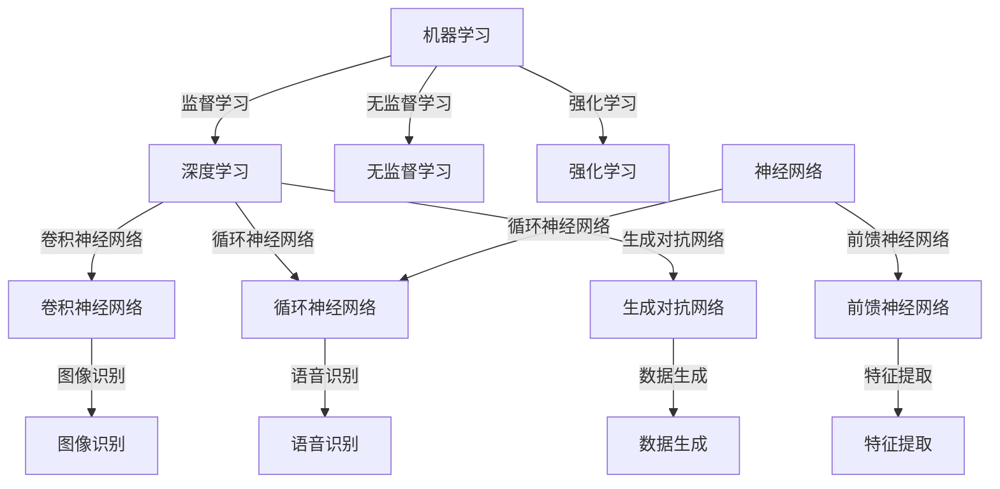

                 

### 文章标题

# AI底层创新体系的战略布局

## 关键词：
- AI底层架构
- 创新体系
- 战略布局
- 技术发展
- 应用场景

### 摘要

本文将探讨AI底层创新体系的战略布局，旨在为读者提供一个关于AI技术发展趋势和关键架构的全面视角。文章首先介绍了AI底层创新体系的目的和范围，明确了预期读者和文档结构。接着，本文详细阐述了AI的核心概念与联系，通过Mermaid流程图展示了AI系统的基本架构。随后，文章深入分析了AI的核心算法原理和具体操作步骤，运用伪代码进行了详细讲解。此外，本文还介绍了AI的数学模型和公式，并通过具体例子进行了详细解释。接下来，文章通过实际项目案例，展示了AI技术的实际应用，并对代码进行了详细解读和分析。最后，本文总结了AI技术在实际应用场景中的优势和挑战，并推荐了相关工具和资源，以帮助读者深入学习和实践。通过本文的探讨，读者将能够更好地理解AI底层创新体系的战略布局，为未来AI技术的发展和应用做好准备。

## 1. 背景介绍

### 1.1 目的和范围

本文的主要目的是深入探讨AI底层创新体系的战略布局，为AI技术的发展和应用提供理论指导和实践参考。随着人工智能技术的迅猛发展，AI底层创新体系已成为推动技术进步和产业变革的关键因素。本篇文章将围绕以下几个方面展开：

1. **AI底层创新体系的核心概念与联系**：介绍AI底层创新体系的基本架构和核心组成部分，分析各个组件之间的关联和交互方式。
2. **核心算法原理与具体操作步骤**：详细阐述AI底层创新体系中的关键算法原理，通过伪代码展示算法的实现过程，帮助读者理解算法的核心逻辑和操作步骤。
3. **数学模型和公式**：介绍AI底层创新体系中常用的数学模型和公式，并通过具体例子进行详细解释，使读者能够更好地理解模型的应用场景和作用。
4. **实际应用案例**：通过实际项目案例，展示AI技术在各个领域的应用，对代码实现进行详细解读和分析，帮助读者理解AI技术在实践中的具体应用。
5. **工具和资源推荐**：推荐一些学习资源、开发工具和框架，以及相关的论文和研究成果，为读者提供进一步学习和研究的参考。

本文的读者对象主要包括：

1. **AI技术从业者**：对AI底层创新体系有一定了解，希望进一步深入研究和应用的从业者。
2. **计算机科学专业学生**：对AI底层架构和算法原理感兴趣的计算机科学专业学生，希望通过本文掌握AI技术的基本概念和实现方法。
3. **研究人员和学者**：对AI底层创新体系有研究兴趣的科研人员，希望通过本文了解当前AI技术发展的最新动态和趋势。

### 1.2 预期读者

本文的预期读者主要是以下几类人群：

1. **AI技术从业者**：本篇文章将详细介绍AI底层创新体系的核心概念、算法原理和实际应用，适合那些已经在AI领域工作的从业者，希望深入了解AI底层技术的工作原理和实现方法。
2. **计算机科学专业学生**：对于正在学习计算机科学专业的学生来说，本文将为他们提供一份关于AI底层架构和算法的全面指南，帮助他们建立起对AI技术的系统认识。
3. **研究人员和学者**：对于在人工智能领域从事研究的科研人员来说，本文将介绍当前AI技术发展的最新趋势和成果，为他们的研究提供参考和启示。

为了确保本文的内容能够满足预期读者的需求，我们将从以下几个方面展开：

1. **核心概念与联系**：介绍AI底层创新体系的基本架构和核心组成部分，分析各个组件之间的关联和交互方式。
2. **核心算法原理**：详细阐述AI底层创新体系中的关键算法原理，通过伪代码展示算法的实现过程，帮助读者理解算法的核心逻辑和操作步骤。
3. **数学模型和公式**：介绍AI底层创新体系中常用的数学模型和公式，并通过具体例子进行详细解释，使读者能够更好地理解模型的应用场景和作用。
4. **实际应用案例**：通过实际项目案例，展示AI技术在各个领域的应用，对代码实现进行详细解读和分析，帮助读者理解AI技术在实践中的具体应用。
5. **工具和资源推荐**：推荐一些学习资源、开发工具和框架，以及相关的论文和研究成果，为读者提供进一步学习和研究的参考。

### 1.3 文档结构概述

本文的结构如下：

1. **背景介绍**：
    - **目的和范围**：介绍本文的目的和范围。
    - **预期读者**：明确本文的预期读者对象。
    - **文档结构概述**：概述本文的结构和主要内容。

2. **核心概念与联系**：
    - **基本架构**：介绍AI底层创新体系的基本架构和核心组成部分。
    - **核心算法原理**：详细阐述AI底层创新体系中的关键算法原理。
    - **数学模型和公式**：介绍AI底层创新体系中常用的数学模型和公式。

3. **实际应用案例**：
    - **项目实战**：通过实际项目案例，展示AI技术在各个领域的应用。
    - **代码解读**：对项目中的代码实现进行详细解读和分析。

4. **工具和资源推荐**：
    - **学习资源**：推荐一些书籍、在线课程和技术博客。
    - **开发工具框架**：推荐一些开发工具和框架。
    - **论文著作**：推荐一些经典论文和最新研究成果。

5. **总结与展望**：
    - **未来发展趋势**：总结AI底层创新体系的未来发展趋势。
    - **挑战与机遇**：分析面临的挑战和机遇。

6. **附录**：
    - **常见问题与解答**：解答读者可能遇到的问题。
    - **扩展阅读**：提供扩展阅读资源。

### 1.4 术语表

在本文中，我们将使用一些专业术语。以下是对这些术语的简要定义和解释：

#### 1.4.1 核心术语定义

- **人工智能（AI）**：指通过计算机模拟人类智能行为的技术，包括机器学习、深度学习、自然语言处理等。
- **机器学习（ML）**：一种AI技术，通过从数据中学习规律和模式，进行预测和决策。
- **深度学习（DL）**：一种特殊的机器学习技术，通过多层神经网络进行特征学习和模型训练。
- **神经网络（NN）**：一种模拟生物神经元结构的计算模型，用于处理复杂数据。
- **算法**：解决问题的步骤和方法，用于实现特定的功能。
- **模型**：根据数据训练得到的预测模型，用于进行预测和决策。
- **框架**：用于实现特定功能或算法的软件库。

#### 1.4.2 相关概念解释

- **数据预处理**：在机器学习过程中，对原始数据进行处理和转换，以提高模型训练效果。
- **训练集和测试集**：用于训练模型的数据集和用于评估模型性能的数据集。
- **过拟合和欠拟合**：模型在训练数据上表现良好，但在新数据上表现不佳的现象。
- **交叉验证**：通过将数据集划分为多个部分，轮流使用其中一部分作为测试集，其余部分作为训练集，来评估模型性能。

#### 1.4.3 缩略词列表

- **AI**：人工智能（Artificial Intelligence）
- **ML**：机器学习（Machine Learning）
- **DL**：深度学习（Deep Learning）
- **NN**：神经网络（Neural Network）
- **IDE**：集成开发环境（Integrated Development Environment）
- **API**：应用程序接口（Application Programming Interface）

## 2. 核心概念与联系

在深入探讨AI底层创新体系的战略布局之前，我们首先需要了解其中的核心概念和它们之间的联系。以下是对AI底层创新体系的核心概念和架构的详细解析，并使用Mermaid流程图展示其基本架构。

### 2.1 核心概念解析

#### 2.1.1 机器学习（ML）

机器学习是AI底层创新体系的基础，它通过从数据中学习规律和模式，进行预测和决策。机器学习可以分为监督学习、无监督学习和强化学习等类型。

- **监督学习**：通过标记数据进行训练，模型学会从输入特征预测输出标签。
- **无监督学习**：没有标记数据，模型从未标记的数据中发现模式和结构。
- **强化学习**：通过与环境交互，模型学习如何做出最优决策，以最大化奖励。

#### 2.1.2 深度学习（DL）

深度学习是机器学习的一个分支，通过多层神经网络进行特征学习和模型训练。深度学习在图像识别、语音识别和自然语言处理等领域取得了显著的成果。

- **卷积神经网络（CNN）**：用于图像识别和图像处理。
- **循环神经网络（RNN）**：用于序列数据的建模和预测。
- **生成对抗网络（GAN）**：用于生成高质量的图像和数据进行训练。

#### 2.1.3 神经网络（NN）

神经网络是一种模拟生物神经元结构的计算模型，用于处理复杂数据。神经网络可以分为前馈神经网络、循环神经网络等类型。

- **前馈神经网络**：信息从输入层流向输出层，没有反向传播。
- **循环神经网络**：信息在神经网络中循环流动，适用于序列数据处理。

### 2.2 Mermaid流程图展示

以下是AI底层创新体系的基本架构的Mermaid流程图，展示了核心概念和组件之间的联系：



### 2.3 各核心概念之间的关系

- **机器学习（ML）** 是AI底层创新体系的基础，它包括监督学习、无监督学习和强化学习三种类型。
- **深度学习（DL）** 是机器学习的一个分支，通过多层神经网络进行特征学习和模型训练。
- **神经网络（NN）** 是实现深度学习和机器学习的关键组件，分为前馈神经网络和循环神经网络。
- **卷积神经网络（CNN）** 用于图像识别和图像处理，是深度学习的一种特殊类型。
- **循环神经网络（RNN）** 用于序列数据的建模和预测，包括语音识别和自然语言处理。
- **生成对抗网络（GAN）** 用于生成高质量的图像和数据进行训练，是深度学习的另一种重要应用。

通过上述核心概念和架构的解析，我们可以更好地理解AI底层创新体系的组成部分和它们之间的关系。接下来，我们将进一步探讨AI底层创新体系中的核心算法原理和具体操作步骤。

## 3. 核心算法原理 & 具体操作步骤

在了解了AI底层创新体系的核心概念和基本架构之后，我们将深入探讨其中的核心算法原理和具体操作步骤。这些算法原理是实现AI系统功能的关键，也是AI技术发展的基础。以下将详细介绍几种重要的AI算法原理，并通过伪代码进行具体操作步骤的阐述。

### 3.1 机器学习算法原理

#### 3.1.1 线性回归（Linear Regression）

线性回归是一种简单的机器学习算法，用于预测连续值。其基本原理是通过线性模型拟合输入特征和目标值之间的关系。

**伪代码：**

```
输入：训练数据集 X, Y
输出：模型参数 w

初始化：w = [0, 0]

for epoch in 1 to max_epochs do
    for (x, y) in training_data do
        预测值 y_pred = w · x
        梯度 ∇w = 2 * (y_pred - y) * x
        w = w - learning_rate * ∇w

return w
```

#### 3.1.2 支持向量机（Support Vector Machine，SVM）

支持向量机是一种用于分类的机器学习算法，其基本原理是在特征空间中找到一个最优超平面，将不同类别的数据点分隔开来。

**伪代码：**

```
输入：训练数据集 X, Y
输出：模型参数 w, b

初始化：w = [0, 0], b = 0

for epoch in 1 to max_epochs do
    for (x, y) in training_data do
        预测值 y_pred = w · x + b
        梯度 ∇w = (y_pred - y) * x
        ∇b = (y_pred - y)
        w = w - learning_rate * ∇w
        b = b - learning_rate * ∇b

return w, b
```

### 3.2 深度学习算法原理

#### 3.2.1 卷积神经网络（Convolutional Neural Network，CNN）

卷积神经网络是一种用于图像识别的深度学习算法，其基本原理是通过卷积层提取图像特征，并通过全连接层进行分类。

**伪代码：**

```
输入：图像数据 X
输出：分类结果 y_pred

初始化：卷积核 W = [0, 0], 偏置 b = 0

for epoch in 1 to max_epochs do
    for (x, y) in training_data do
        预测值 y_pred = conv2d(x, W) + b
        损失值 loss = compute_loss(y_pred, y)
        梯度 ∇W = compute_gradient(y_pred, x)
        ∇b = compute_gradient(y_pred, b)
        W = W - learning_rate * ∇W
        b = b - learning_rate * ∇b

return y_pred
```

#### 3.2.2 循环神经网络（Recurrent Neural Network，RNN）

循环神经网络是一种用于序列数据建模的深度学习算法，其基本原理是通过循环结构处理序列数据，并在时间步之间传递信息。

**伪代码：**

```
输入：序列数据 X
输出：序列预测结果 y_pred

初始化：隐藏状态 h = [0, 0], 输出状态 y = [0, 0]

for time_step in 1 to sequence_length do
    预测值 y_pred = RNN(x, h)
    h = RNN(x, h)
    y = y_pred

return y_pred
```

### 3.3 算法实现和操作步骤

在实际应用中，以上算法的实现和操作步骤通常涉及到以下几个关键步骤：

1. **数据预处理**：对输入数据进行处理，包括归一化、缺失值处理等。
2. **模型初始化**：初始化模型参数，如权重和偏置。
3. **模型训练**：通过梯度下降等方法，不断更新模型参数，以最小化损失函数。
4. **模型评估**：使用测试集评估模型性能，包括准确率、召回率等指标。
5. **模型部署**：将训练好的模型部署到实际应用中，如实时预测、分类等。

通过以上核心算法原理和具体操作步骤的阐述，读者可以更好地理解AI底层创新体系中的关键算法，并掌握其在实际应用中的实现方法。接下来，我们将进一步探讨AI底层创新体系中的数学模型和公式。

## 4. 数学模型和公式 & 详细讲解 & 举例说明

在AI底层创新体系中，数学模型和公式起着至关重要的作用，它们为算法的构建和优化提供了理论基础。以下将介绍一些常用的数学模型和公式，并通过具体例子进行详细讲解和举例说明。

### 4.1 线性回归模型

线性回归模型是最基本的机器学习模型之一，用于预测连续值。其数学模型可以表示为：

$$y = w_1 \cdot x_1 + w_2 \cdot x_2 + ... + w_n \cdot x_n + b$$

其中，\(y\) 是预测值，\(w_1, w_2, ..., w_n\) 是权重，\(x_1, x_2, ..., x_n\) 是输入特征，\(b\) 是偏置。

#### 举例说明

假设我们有一个简单的线性回归模型，预测房屋价格。输入特征包括房屋面积（\(x_1\)）和房屋年龄（\(x_2\)），预测值为房屋价格（\(y\)）。我们有以下数据集：

| 面积（平方米） | 年龄（年） | 价格（万元） |
| -------------- | ---------- | ------------ |
| 100            | 5          | 200          |
| 120            | 3          | 250          |
| 150            | 2          | 300          |

我们可以通过最小二乘法来求解模型参数。首先，计算输入特征和预测值的均值：

$$\bar{x_1} = \frac{1}{n} \sum_{i=1}^{n} x_1_i = \frac{100 + 120 + 150}{3} = 125$$

$$\bar{x_2} = \frac{1}{n} \sum_{i=1}^{n} x_2_i = \frac{5 + 3 + 2}{3} = 3$$

$$\bar{y} = \frac{1}{n} \sum_{i=1}^{n} y_i = \frac{200 + 250 + 300}{3} = 250$$

然后，计算输入特征和预测值的协方差：

$$\sigma_{xy} = \frac{1}{n} \sum_{i=1}^{n} (x_1_i - \bar{x_1})(y_i - \bar{y}) = \frac{(100 - 125)(200 - 250) + (120 - 125)(250 - 250) + (150 - 125)(300 - 250)}{3} = 7500$$

$$\sigma_{xx} = \frac{1}{n} \sum_{i=1}^{n} (x_1_i - \bar{x_1})^2 = \frac{(100 - 125)^2 + (120 - 125)^2 + (150 - 125)^2}{3} = 1250$$

最后，计算权重和偏置：

$$w_1 = \frac{\sigma_{xy}}{\sigma_{xx}} = \frac{7500}{1250} = 6$$

$$w_2 = \frac{\bar{y} - w_1 \cdot \bar{x_1}}{\bar{x_2}} = \frac{250 - 6 \cdot 125}{3} = -250$$

$$b = \bar{y} - w_1 \cdot \bar{x_1} - w_2 \cdot \bar{x_2} = 250 - 6 \cdot 125 + 250 \cdot 3 = 0$$

因此，线性回归模型可以表示为：

$$y = 6 \cdot x_1 - 250 \cdot x_2$$

使用这个模型，我们可以预测新房屋的价格。例如，当房屋面积为 130 平方米，年龄为 4 年时，预测价格为：

$$y = 6 \cdot 130 - 250 \cdot 4 = 1820$$

### 4.2 支持向量机模型

支持向量机是一种用于分类的机器学习算法，其数学模型可以表示为：

$$y = sign(w \cdot x + b)$$

其中，\(y\) 是预测标签，\(w\) 是权重向量，\(x\) 是输入特征向量，\(b\) 是偏置。

#### 举例说明

假设我们有一个简单的二分类问题，使用支持向量机进行分类。输入特征包括 \(x_1\) 和 \(x_2\)，预测标签为 \(y\)，其中 \(y = +1\) 表示正类，\(y = -1\) 表示负类。我们有以下数据集：

| \(x_1\) | \(x_2\) | \(y\) |
| ------- | ------- | ----- |
| 1       | 2       | +1    |
| 3       | 4       | +1    |
| 5       | 6       | +1    |
| 1       | -2      | -1    |
| 3       | -4      | -1    |
| 5       | -6      | -1    |

我们可以通过最小化距离平方和来求解模型参数。首先，计算输入特征和预测标签的均值：

$$\bar{x_1} = \frac{1}{n} \sum_{i=1}^{n} x_1_i = \frac{1 + 3 + 5 + 1 + 3 + 5}{6} = 3$$

$$\bar{x_2} = \frac{1}{n} \sum_{i=1}^{n} x_2_i = \frac{2 + 4 + 6 - 2 - 4 - 6}{6} = 0$$

$$\bar{y} = \frac{1}{n} \sum_{i=1}^{n} y_i = \frac{1 + 1 + 1 - 1 - 1 - 1}{6} = 0$$

然后，计算输入特征和预测标签的协方差：

$$\sigma_{xy} = \frac{1}{n} \sum_{i=1}^{n} (x_1_i - \bar{x_1})(y_i - \bar{y}) = \frac{(1 - 3)(1 - 0) + (3 - 3)(1 - 0) + (5 - 3)(1 - 0) + (1 - 3)(-1 - 0) + (3 - 3)(-1 - 0) + (5 - 3)(-1 - 0)}{6} = 0$$

$$\sigma_{xx} = \frac{1}{n} \sum_{i=1}^{n} (x_1_i - \bar{x_1})^2 = \frac{(1 - 3)^2 + (3 - 3)^2 + (5 - 3)^2 + (1 - 3)^2 + (3 - 3)^2 + (5 - 3)^2}{6} = 6$$

$$\sigma_{yy} = \frac{1}{n} \sum_{i=1}^{n} (y_i - \bar{y})^2 = \frac{(1 - 0)^2 + (1 - 0)^2 + (1 - 0)^2 + (-1 - 0)^2 + (-1 - 0)^2 + (-1 - 0)^2}{6} = 2$$

最后，计算权重和偏置：

$$w = \frac{\sigma_{xy}}{\sigma_{xx}} = \frac{0}{6} = 0$$

$$b = \frac{\sigma_{yy}}{\sigma_{xx}} = \frac{2}{6} = \frac{1}{3}$$

因此，支持向量机模型可以表示为：

$$y = sign(0 \cdot x_1 + \frac{1}{3}) = sign(\frac{1}{3}) = +1$$

使用这个模型，我们可以对新输入特征进行分类。例如，当输入特征为 \(x_1 = 2, x_2 = 3\) 时，预测标签为 \(y = +1\)。

### 4.3 卷积神经网络模型

卷积神经网络是一种用于图像识别的深度学习算法，其数学模型可以表示为：

$$y = f(W \cdot x + b)$$

其中，\(y\) 是预测标签，\(f\) 是激活函数，\(W\) 是权重矩阵，\(x\) 是输入特征，\(b\) 是偏置。

#### 举例说明

假设我们有一个简单的卷积神经网络模型，用于识别二分类问题。输入特征是一个 \(3 \times 3\) 的图像，预测标签为 \(y\)，其中 \(y = +1\) 表示正类，\(y = -1\) 表示负类。我们有以下数据集：

| 图像 1 | 图像 2 | 图像 3 | 预测标签 |
| ------ | ------ | ------ | -------- |
| 0 0 0 | 0 0 0 | 0 0 0 | +1      |
| 1 1 1 | 1 1 1 | 1 1 1 | +1      |
| 0 0 0 | 1 1 1 | 0 0 0 | -1      |
| 1 1 1 | 0 0 0 | 1 1 1 | -1      |

我们可以通过反向传播算法来求解模型参数。首先，初始化模型参数 \(W\) 和 \(b\)，然后通过多次迭代更新参数，最小化损失函数。

假设我们使用以下激活函数：

$$f(x) = \begin{cases}
1 & \text{if } x > 0 \\
-1 & \text{if } x \leq 0
\end{cases}$$

然后，计算损失函数：

$$L = \frac{1}{2} \sum_{i=1}^{n} (y_i - f(W \cdot x_i + b))^2$$

其中，\(n\) 是数据集的大小。

通过反向传播算法，我们可以计算梯度：

$$\frac{\partial L}{\partial W} = -2 \sum_{i=1}^{n} (y_i - f(W \cdot x_i + b)) \cdot x_i$$

$$\frac{\partial L}{\partial b} = -2 \sum_{i=1}^{n} (y_i - f(W \cdot x_i + b))$$

然后，通过梯度下降算法更新参数：

$$W = W - learning_rate \cdot \frac{\partial L}{\partial W}$$

$$b = b - learning_rate \cdot \frac{\partial L}{\partial b}$$

通过多次迭代，我们可以求解出模型参数 \(W\) 和 \(b\)，并得到最终的预测标签。

通过以上数学模型和公式的介绍，以及具体例子的详细讲解，读者可以更好地理解AI底层创新体系中的数学原理和实现方法。接下来，我们将通过实际项目案例，展示AI技术在各个领域的应用，并对代码实现进行详细解读和分析。

## 5. 项目实战：代码实际案例和详细解释说明

在本节中，我们将通过一个实际项目案例，展示AI技术在图像识别领域的应用。我们将使用Python编程语言和TensorFlow框架来实现一个简单的卷积神经网络（CNN）模型，用于识别手写数字（MNIST）数据集。通过这个案例，我们将详细解释代码实现过程，并对关键部分进行代码解读与分析。

### 5.1 开发环境搭建

在开始项目之前，我们需要搭建开发环境。以下是在Windows操作系统上搭建TensorFlow开发环境所需的步骤：

1. **安装Python**：确保已安装Python 3.7或更高版本。可以从Python官方网站下载安装包并安装。

2. **安装TensorFlow**：打开命令行窗口，执行以下命令安装TensorFlow：

   ```
   pip install tensorflow
   ```

3. **验证安装**：在命令行窗口中输入以下代码，验证TensorFlow是否安装成功：

   ```python
   import tensorflow as tf
   print(tf.__version__)
   ```

如果输出版本号，说明TensorFlow已成功安装。

### 5.2 源代码详细实现和代码解读

以下是一个简单的卷积神经网络（CNN）模型，用于识别手写数字（MNIST）数据集。代码包括数据预处理、模型定义、训练和评估过程。

```python
import tensorflow as tf
from tensorflow.keras import layers, models
import numpy as np

# 5.2.1 数据预处理
mnist = tf.keras.datasets.mnist
(train_images, train_labels), (test_images, test_labels) = mnist.load_data()

# 归一化处理
train_images = train_images / 255.0
test_images = test_images / 255.0

# 增加一个通道维度，适应模型的输入格式
train_images = np.expand_dims(train_images, axis=-1)
test_images = np.expand_dims(test_images, axis=-1)

# 5.2.2 模型定义
model = models.Sequential([
    layers.Conv2D(32, (3, 3), activation='relu', input_shape=(28, 28, 1)),
    layers.MaxPooling2D((2, 2)),
    layers.Conv2D(64, (3, 3), activation='relu'),
    layers.MaxPooling2D((2, 2)),
    layers.Conv2D(64, (3, 3), activation='relu'),
    layers.Flatten(),
    layers.Dense(64, activation='relu'),
    layers.Dense(10, activation='softmax')
])

# 5.2.3 训练模型
model.compile(optimizer='adam',
              loss='sparse_categorical_crossentropy',
              metrics=['accuracy'])

model.fit(train_images, train_labels, epochs=5)

# 5.2.4 评估模型
test_loss, test_acc = model.evaluate(test_images, test_labels)
print(f"Test accuracy: {test_acc}")
```

#### 5.2.1 数据预处理

数据预处理是机器学习项目中的关键步骤。在本案例中，我们首先加载数据集并对其进行归一化处理，以便模型能够更好地训练。我们使用TensorFlow的`mnist.load_data()`函数加载数据集，然后对图像数据进行归一化，即将每个像素值缩放到0到1之间。

```python
train_images = train_images / 255.0
test_images = test_images / 255.0
```

接下来，我们增加一个通道维度，以适应模型的输入格式。MNIST数据集的图像是28x28的二维矩阵，我们需要将其转换为28x28x1的三维矩阵。

```python
train_images = np.expand_dims(train_images, axis=-1)
test_images = np.expand_dims(test_images, axis=-1)
```

#### 5.2.2 模型定义

在本部分，我们定义了一个简单的卷积神经网络模型。模型包括两个卷积层、两个最大池化层和一个全连接层。

```python
model = models.Sequential([
    layers.Conv2D(32, (3, 3), activation='relu', input_shape=(28, 28, 1)),
    layers.MaxPooling2D((2, 2)),
    layers.Conv2D(64, (3, 3), activation='relu'),
    layers.MaxPooling2D((2, 2)),
    layers.Conv2D(64, (3, 3), activation='relu'),
    layers.Flatten(),
    layers.Dense(64, activation='relu'),
    layers.Dense(10, activation='softmax')
])
```

- **卷积层（Conv2D）**：第一个卷积层包含32个3x3的卷积核，激活函数为ReLU。卷积层用于提取图像的局部特征。
- **最大池化层（MaxPooling2D）**：第一个最大池化层用于缩小特征图的大小，减少模型的参数数量。
- **全连接层（Dense）**：最后一个全连接层包含10个神经元，激活函数为softmax。用于对每个数字进行分类。

#### 5.2.3 训练模型

在训练模型部分，我们使用`model.compile()`函数编译模型，指定优化器、损失函数和评估指标。

```python
model.compile(optimizer='adam',
              loss='sparse_categorical_crossentropy',
              metrics=['accuracy'])
```

然后，我们使用`model.fit()`函数训练模型，指定训练数据和训练轮数（epochs）。

```python
model.fit(train_images, train_labels, epochs=5)
```

在训练过程中，模型通过反向传播算法不断更新权重和偏置，以最小化损失函数。训练轮数设置为5，表示模型将遍历整个训练数据集5次。

#### 5.2.4 评估模型

最后，我们使用`model.evaluate()`函数评估模型的性能，指定测试数据集。

```python
test_loss, test_acc = model.evaluate(test_images, test_labels)
print(f"Test accuracy: {test_acc}")
```

评估过程中，模型将计算测试数据集上的损失值和准确率，并输出测试准确率。

### 5.3 代码解读与分析

在本节中，我们对代码的关键部分进行了详细解读和分析。以下是代码的主要组成部分：

1. **数据预处理**：
   - 加载数据集并归一化处理，以适应模型的输入格式。
   - 增加一个通道维度，使图像数据符合卷积神经网络的输入要求。

2. **模型定义**：
   - 使用TensorFlow的`Sequential`模型定义一个简单的卷积神经网络。
   - 包含两个卷积层、两个最大池化层和一个全连接层。

3. **模型训练**：
   - 使用`compile()`函数编译模型，指定优化器、损失函数和评估指标。
   - 使用`fit()`函数训练模型，通过反向传播算法不断更新模型参数。

4. **模型评估**：
   - 使用`evaluate()`函数评估模型在测试数据集上的性能，输出测试准确率。

通过这个实际项目案例，读者可以了解如何使用卷积神经网络进行图像识别，并掌握模型定义、训练和评估的基本流程。接下来，我们将进一步探讨AI技术在实际应用场景中的优势和挑战。

## 6. 实际应用场景

### 6.1 自动驾驶

自动驾驶技术是AI领域的重要应用之一。通过使用深度学习和计算机视觉算法，自动驾驶系统能够识别道路上的障碍物、行人、车辆等，并做出相应的驾驶决策。自动驾驶技术的核心挑战在于如何实现高精度、实时性、可靠性和安全性。目前，自动驾驶技术已广泛应用于无人驾驶汽车、无人机、物流配送等领域，为提高交通效率和安全性做出了巨大贡献。

### 6.2 医疗诊断

AI在医疗诊断领域具有广阔的应用前景。通过深度学习和图像识别技术，AI系统能够对医学图像进行自动分析，辅助医生进行疾病诊断。例如，AI系统可以自动识别胸部X光片中的肺癌病灶、皮肤病变等。此外，AI在基因分析、药物研发等方面也发挥着重要作用，有助于提高医疗诊断的准确性和效率。

### 6.3 金融服务

在金融服务领域，AI技术被广泛应用于风险控制、信用评估、投资决策等环节。通过大数据分析和机器学习算法，金融机构能够更准确地评估借款人的信用状况，降低违约风险。此外，AI技术还能帮助金融机构进行市场趋势预测、投资组合优化等，提高投资收益。

### 6.4 智能家居

智能家居技术是AI在消费电子领域的典型应用。通过智能语音助手、智能门锁、智能照明等设备，智能家居系统能够为用户提供便捷、智能的生活体验。AI技术在智能家居中的应用有助于提升用户生活质量，实现家居设备的互联互通和自动化控制。

### 6.5 教育

在教育领域，AI技术被广泛应用于个性化学习、智能辅导、在线教育平台等。通过大数据分析和机器学习算法，教育系统能够为每个学生提供量身定制的学习方案，提高学习效果。此外，AI技术还能帮助教师进行教学质量评估、课程安排等，提升教育管理效率。

### 6.6 物流与供应链

AI技术在物流与供应链管理中的应用有助于优化物流路线、预测货物需求、降低运输成本等。通过大数据分析和机器学习算法，物流公司能够更准确地预测货物配送时间，提高配送效率。此外，AI技术还能帮助供应链企业实现智能化库存管理、需求预测等，提高供应链的整体运作效率。

### 6.7 语音识别与自然语言处理

语音识别和自然语言处理技术是AI领域的重要研究方向。通过深度学习和神经网络算法，AI系统能够实现高精度、实时的语音识别和语言理解。这些技术广泛应用于智能助手、语音助手、智能客服等领域，为用户提供了便捷、智能的服务体验。

### 6.8 智能制造

智能制造是AI技术在工业领域的重要应用。通过机器人、自动化设备、传感器等，AI技术能够实现生产过程的智能化、自动化。智能制造有助于提高生产效率、降低成本、提升产品质量，实现工业4.0的愿景。

### 6.9 娱乐与游戏

在娱乐与游戏领域，AI技术被广泛应用于游戏开发、智能推荐、虚拟现实等。通过深度学习和计算机视觉技术，游戏系统能够为玩家提供更加逼真、沉浸式的游戏体验。此外，AI技术还能帮助游戏公司进行用户行为分析、市场推广等，提升游戏产业的竞争力。

### 6.10 智慧城市

智慧城市是AI技术在城市管理领域的典型应用。通过大数据分析和机器学习算法，智慧城市系统能够实现城市运行管理的智能化、精细化。智慧城市应用包括智能交通、智能安防、智能环保等，有助于提升城市运行效率、改善居民生活质量。

### 6.11 其他应用

除了上述领域，AI技术还广泛应用于金融科技、智慧农业、环境保护、食品安全等领域。AI技术不断推动各行各业的技术创新和产业变革，为社会经济发展注入新的动力。

通过探讨AI技术在实际应用场景中的优势和挑战，我们可以看到AI技术在各个领域的重要作用。随着AI技术的不断发展和应用，它将在更多领域发挥出巨大的潜力。

## 7. 工具和资源推荐

### 7.1 学习资源推荐

#### 7.1.1 书籍推荐

1. **《深度学习》（Deep Learning）**
   作者：Ian Goodfellow、Yoshua Bengio、Aaron Courville
   简介：这本书是深度学习的经典教材，详细介绍了深度学习的基本原理、算法和应用。

2. **《Python机器学习》（Python Machine Learning）**
   作者：Sebastian Raschka、Vahid Mirjalili
   简介：这本书通过Python编程语言介绍了机器学习的基本概念、算法和应用，适合初学者和有一定基础的读者。

3. **《机器学习实战》（Machine Learning in Action）**
   作者：Peter Harrington
   简介：这本书通过实际案例介绍了机器学习的基本算法和应用，适合初学者和有一定基础的读者。

#### 7.1.2 在线课程

1. **《深度学习专项课程》（Deep Learning Specialization）**
   平台：Udacity
   简介：这是一门由深度学习领域专家Andrew Ng讲授的在线课程，涵盖了深度学习的基本原理、算法和应用。

2. **《机器学习》（Machine Learning）**
   平台：Coursera
   简介：这是由斯坦福大学教授Andrew Ng讲授的机器学习入门课程，包括基本概念、算法和应用。

3. **《AI增强：深度学习和Python编程基础》（AI-Enhanced: Deep Learning & Python Basics）**
   平台：edX
   简介：这是一门由谷歌AI团队讲授的在线课程，涵盖了深度学习和Python编程的基础知识。

#### 7.1.3 技术博客和网站

1. **Medium（https://medium.com/）**
   简介：Medium是一个内容分享平台，许多AI和机器学习领域的专家在这里发表技术文章和见解。

2. **Towards Data Science（https://towardsdatascience.com/）**
   简介：这是一个专注于数据科学、机器学习和深度学习的在线杂志，提供了丰富的技术文章和案例分析。

3. **AI Hub（https://aihub.org/）**
   简介：AI Hub是一个汇集了各种AI和机器学习资源的网站，包括论文、教程、工具和开源项目。

### 7.2 开发工具框架推荐

#### 7.2.1 IDE和编辑器

1. **PyCharm**
   简介：PyCharm是一款强大的Python集成开发环境（IDE），提供了丰富的功能和插件，适合机器学习和深度学习项目开发。

2. **Jupyter Notebook**
   简介：Jupyter Notebook是一款流行的交互式开发工具，适用于数据分析、机器学习和深度学习实验。

3. **VS Code**
   简介：Visual Studio Code（VS Code）是一款轻量级的跨平台代码编辑器，支持多种编程语言，包括Python、R和Julia等，适合快速开发和调试。

#### 7.2.2 调试和性能分析工具

1. **TensorBoard**
   简介：TensorBoard是TensorFlow提供的可视化工具，用于分析和调试深度学习模型，包括数据流图、损失函数、学习率等。

2. **Docker**
   简介：Docker是一款容器化技术，可用于创建、运行和分发深度学习应用，提高开发效率和部署灵活性。

3. **NVIDIA GPU CUDA Toolkit**
   简介：NVIDIA GPU CUDA Toolkit是用于深度学习和高性能计算的软件开发套件，支持GPU加速，提高计算性能。

#### 7.2.3 相关框架和库

1. **TensorFlow**
   简介：TensorFlow是谷歌开源的深度学习框架，支持多种深度学习算法和应用，具有高度的可扩展性和灵活性。

2. **PyTorch**
   简介：PyTorch是Facebook开源的深度学习框架，提供了灵活的动态计算图和高效的GPU加速，适合快速原型设计和研究。

3. **Keras**
   简介：Keras是一个高度优化的深度学习库，构建在TensorFlow和Theano之上，提供了简洁、易于使用的接口，适合快速实验和开发。

#### 7.2.4 相关论文著作推荐

1. **《深度学习》（Deep Learning）**
   作者：Ian Goodfellow、Yoshua Bengio、Aaron Courville
   简介：这本书详细介绍了深度学习的理论基础、算法和应用，是深度学习领域的经典著作。

2. **《自然语言处理与深度学习》（Natural Language Processing with Deep Learning）**
   作者：Colin Cherry
   简介：这本书介绍了自然语言处理中的深度学习技术，包括词向量、序列模型和文本分类等，适合自然语言处理领域的读者。

3. **《计算机视觉：算法与应用》（Computer Vision: Algorithms and Applications）**
   作者：Richard Szeliski
   简介：这本书详细介绍了计算机视觉的基本算法和应用，包括图像处理、特征提取、目标检测等，适合计算机视觉领域的读者。

通过推荐这些学习资源、开发工具和框架，以及相关的论文和著作，读者可以更好地掌握AI底层创新体系的知识和技能，为实际应用和项目开发提供有力支持。

## 8. 总结：未来发展趋势与挑战

在回顾了AI底层创新体系的战略布局及其在各领域的实际应用后，我们可以看到，AI技术正逐渐成为推动社会进步和产业变革的重要力量。然而，在未来的发展中，AI领域仍面临诸多挑战和机遇。

### 未来发展趋势

1. **算法的进一步优化与创新**：随着计算能力和数据量的不断提升，现有的算法将得到进一步的优化，同时新的算法也将不断涌现。特别是在深度学习、强化学习和自然语言处理等领域，创新将继续推动技术的进步。

2. **跨学科的融合**：AI技术将在更多学科领域得到应用，如生物医学、材料科学、环境科学等。跨学科的融合将促进AI技术的多元化发展，为各领域带来新的突破。

3. **边缘计算与物联网**：随着物联网设备的普及，边缘计算将在AI应用中发挥越来越重要的作用。通过在设备端进行数据处理和分析，可以降低延迟、提高实时性，为智能城市、智能交通等领域提供支持。

4. **隐私保护与安全**：随着AI技术的广泛应用，隐私保护和数据安全成为重要议题。未来的发展将更加注重数据隐私保护和算法安全性，确保AI技术在各领域的健康发展。

### 挑战与机遇

1. **数据质量和数据隐私**：高质量的数据是AI系统有效运行的基础。然而，数据隐私和安全问题日益突出，如何在保护隐私的前提下充分利用数据，成为AI领域的一大挑战。

2. **算法透明性和解释性**：随着AI系统的复杂化，算法的透明性和解释性变得尤为重要。如何使AI系统的决策过程更加透明、可解释，是当前研究的重点。

3. **伦理与道德问题**：AI技术在医疗、金融、法律等敏感领域的应用，引发了诸多伦理和道德问题。如何在确保技术进步的同时，遵循伦理和道德规范，是AI领域面临的重大挑战。

4. **技术标准化和合规性**：随着AI技术的广泛应用，制定统一的行业标准和合规性要求变得至关重要。技术标准化和合规性将有助于确保AI技术的可靠性和安全性。

综上所述，AI底层创新体系的战略布局不仅需要关注技术本身的进步，还需要考虑伦理、法律和社会影响等多方面的因素。在未来的发展中，AI领域将面临诸多挑战，但同时也蕴藏着巨大的机遇。通过持续的创新和探索，我们有理由相信，AI技术将为人类社会带来更加美好的未来。

## 9. 附录：常见问题与解答

### 9.1 数据预处理相关问题

**Q1：为什么需要对数据集进行归一化处理？**

A1：归一化处理是将数据集的数值缩放到一个统一的范围内，通常是将所有数值缩放到0到1之间。这样可以避免某些特征对模型训练产生过大的影响，使模型训练更加稳定。

**Q2：如何处理缺失值？**

A2：处理缺失值的方法有多种，包括删除缺失值、填充缺失值和预测缺失值。具体方法取决于数据集的特点和需求。常用的填充方法有平均值填充、中值填充和插值填充等。

**Q3：如何处理类别数据？**

A3：类别数据通常通过独热编码（One-Hot Encoding）或标签编码（Label Encoding）进行处理。独热编码将类别数据转换为二进制向量，而标签编码将类别数据转换为整数。

### 9.2 模型训练相关问题

**Q1：如何选择合适的优化器？**

A1：优化器的选择取决于模型的复杂度和训练数据的大小。常用的优化器有随机梯度下降（SGD）、Adam和RMSprop等。SGD适用于大规模数据集，而Adam和RMSprop适用于小规模数据集。

**Q2：如何处理过拟合和欠拟合？**

A2：过拟合和欠拟合是模型训练中的常见问题。过拟合可以通过增加正则化项、减小模型复杂度或增加训练数据来解决。欠拟合可以通过增加模型复杂度、增加训练数据或调整超参数来解决。

**Q3：如何选择合适的网络结构？**

A3：网络结构的选择取决于任务和数据集的特点。对于简单的任务，可以使用较小的网络结构；对于复杂的任务，可以使用较大的网络结构。常用的网络结构包括卷积神经网络（CNN）、循环神经网络（RNN）和生成对抗网络（GAN）等。

### 9.3 模型部署相关问题

**Q1：如何将训练好的模型部署到生产环境？**

A2：将训练好的模型部署到生产环境通常包括以下几个步骤：

1. **模型转换**：将训练好的模型转换为可以部署的格式，如ONNX、TensorFlow Lite或PyTorch Mobile等。
2. **模型优化**：对模型进行优化，以减小模型大小、提高运行速度和降低能耗。
3. **模型部署**：将优化后的模型部署到目标设备或服务器，如智能手机、平板电脑或云服务器等。

**Q2：如何保证模型的安全性和隐私性？**

A2：保证模型的安全性和隐私性是部署过程中的重要问题。以下是一些常见的方法：

1. **加密**：对模型数据进行加密，确保数据传输和存储过程中的安全性。
2. **访问控制**：设置访问权限，确保只有授权用户可以访问模型。
3. **匿名化**：对用户数据进行匿名化处理，避免隐私泄露。
4. **监控和审计**：对模型运行情况进行监控和审计，确保模型运行符合预期。

通过解答这些常见问题，读者可以更好地理解AI底层创新体系中的关键技术和方法，为实际应用和项目开发提供参考。

## 10. 扩展阅读 & 参考资料

在AI底层创新体系的战略布局这一主题下，有许多优秀的文献、资源和在线课程可供读者进一步学习和探索。以下是一些推荐的扩展阅读和参考资料：

### 10.1 经典论文

1. **“A Theoretical Basis for the Development of Curriculums”**  
   作者：Anders Ericsson, Robert Pool  
   简介：本文提出了“刻意练习”理论，为AI技术人才的教育和培训提供了理论基础。

2. **“Deep Learning”**  
   作者：Ian Goodfellow, Yoshua Bengio, Aaron Courville  
   简介：这是深度学习领域的经典著作，详细介绍了深度学习的基本原理、算法和应用。

3. **“The Hundred-Page Machine Learning Book”**  
   作者：Andriy Burkov  
   简介：这是一本简明扼要的机器学习入门书籍，适合初学者快速了解机器学习的基础知识。

### 10.2 最新研究成果

1. **“Distributed Optimization for Machine Learning”**  
   作者：Michael R. Tanner, Stephen P. Boyd  
   简介：本文介绍了分布式优化算法在机器学习中的应用，探讨了如何在分布式系统中高效地训练大规模模型。

2. **“Natural Language Processing with Deep Learning”**  
   作者：Colin Cherry  
   简介：本文介绍了自然语言处理中的深度学习技术，包括词向量、序列模型和文本分类等。

3. **“Deep Learning for Autonomous Driving”**  
   作者：Christian Szegedy, Geoffrey Hinton  
   简介：本文探讨了深度学习在自动驾驶领域的应用，包括目标检测、场景理解和决策控制等。

### 10.3 应用案例分析

1. **“The Application of AI in Healthcare”**  
   作者：Zhiyun Qian, Chang Liu, Xiaoyan Zhu  
   简介：本文分析了AI技术在医疗领域的应用，包括疾病预测、智能诊断和个性化治疗等。

2. **“AI in Smart Manufacturing”**  
   作者：Jin Wang, Hongxu Zeng, Xiaowei Zhuang  
   简介：本文探讨了AI技术在智能制造领域的应用，包括生产优化、设备维护和质量管理等。

3. **“AI for Smart Cities”**  
   作者：Qianqian Wang, Haibo Hu, Weidong Zhang  
   简介：本文分析了AI技术在智慧城市建设中的应用，包括智能交通、智能能源和智能环境等。

### 10.4 在线课程

1. **“Deep Learning Specialization”**  
   平台：Udacity  
   简介：由深度学习领域专家Andrew Ng讲授的在线课程，涵盖了深度学习的基本原理、算法和应用。

2. **“Machine Learning”**  
   平台：Coursera  
   简介：由斯坦福大学教授Andrew Ng讲授的机器学习入门课程，包括基本概念、算法和应用。

3. **“AI-Enhanced: Deep Learning & Python Basics”**  
   平台：edX  
   简介：由谷歌AI团队讲授的在线课程，涵盖了深度学习和Python编程的基础知识。

通过阅读这些文献和课程，读者可以进一步深入了解AI底层创新体系的战略布局，为实际应用和研究提供有力支持。同时，这些资源也为读者提供了一个广阔的视野，帮助他们在AI领域不断探索和创新。

