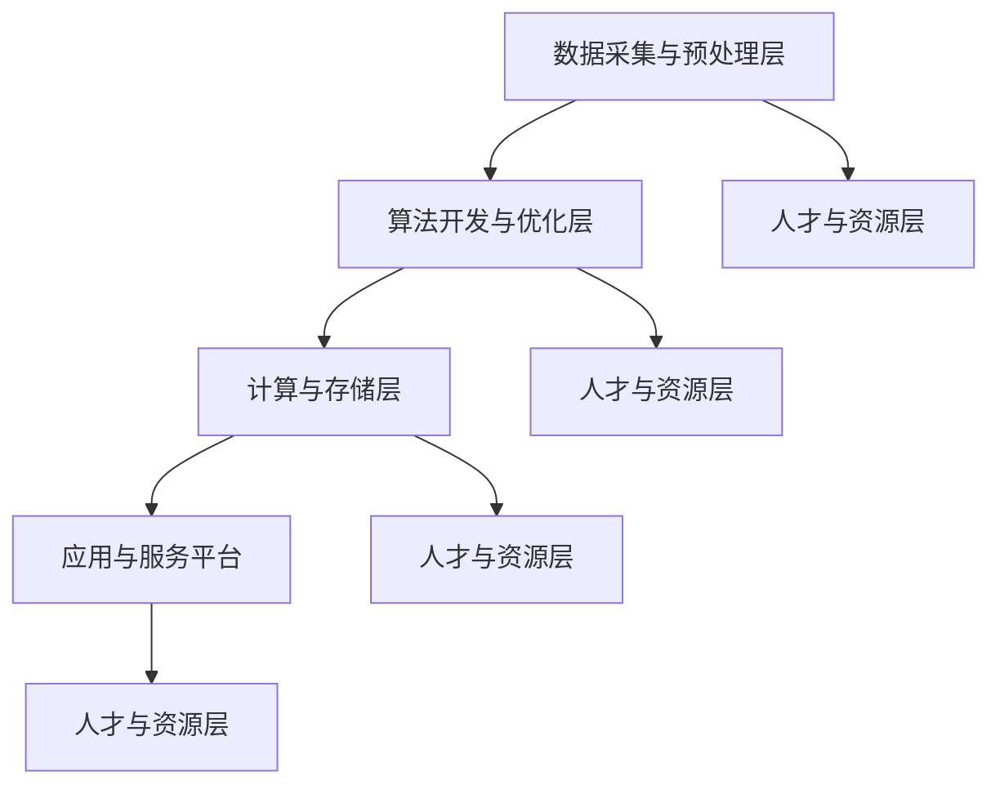

                 

# AI底层创新体系的整体构建

## 关键词

* AI底层技术
* 创新体系
* 架构设计
* 算法优化
* 数学模型
* 实战应用

## 摘要

本文旨在探讨AI底层创新体系的整体构建，通过分析核心概念、算法原理、数学模型、实战案例等，全面阐述构建AI底层创新体系的方法和路径。本文首先介绍了AI底层创新体系的重要性，然后从核心概念、架构设计、算法优化、数学模型等方面进行了深入剖析，并通过实际案例展示了如何将这些概念和技术应用到实践中。最后，本文总结了未来发展趋势和挑战，为AI领域的进一步发展提供了方向和建议。

## 1. 背景介绍

### 1.1 目的和范围

本文的目标是帮助读者理解和掌握构建AI底层创新体系的方法和技巧，从而推动AI技术的发展和应用。文章将涵盖以下内容：

* AI底层创新体系的核心概念和架构设计
* AI算法的优化方法和数学模型
* 实际应用场景中的AI技术实现
* AI领域的发展趋势和挑战

### 1.2 预期读者

本文适合以下读者群体：

* 对AI技术有浓厚兴趣的科研人员
* AI领域的开发者和技术专家
* 对AI技术应用有需求的企业和个人

### 1.3 文档结构概述

本文将按照以下结构进行组织：

* 第1章：背景介绍，包括目的和范围、预期读者、文档结构概述等。
* 第2章：核心概念与联系，介绍AI底层创新体系的核心概念和架构设计。
* 第3章：核心算法原理 & 具体操作步骤，详细阐述AI算法的原理和操作步骤。
* 第4章：数学模型和公式 & 详细讲解 & 举例说明，解释AI算法中的数学模型和公式。
* 第5章：项目实战：代码实际案例和详细解释说明，通过实际案例展示AI技术的应用。
* 第6章：实际应用场景，探讨AI技术在各个领域的应用。
* 第7章：工具和资源推荐，推荐相关学习资源和开发工具。
* 第8章：总结：未来发展趋势与挑战，总结本文的主要内容，并展望未来发展趋势和挑战。
* 第9章：附录：常见问题与解答，提供常见问题及解答。
* 第10章：扩展阅读 & 参考资料，推荐相关阅读材料和参考资料。

### 1.4 术语表

#### 1.4.1 核心术语定义

* AI底层技术：指在人工智能领域中，位于顶层应用和底层硬件之间的核心技术，包括算法、架构、模型等。
* 创新体系：指在特定领域内，通过整合资源、技术、人才等要素，实现持续创新和发展的系统。
* 算法优化：指在现有算法基础上，通过改进算法结构、提高计算效率、减少计算资源消耗等手段，提升算法性能。
* 数学模型：指在AI领域中，用于描述算法原理和操作过程的数学表达式和公式。

#### 1.4.2 相关概念解释

* 机器学习：指通过构建数学模型，使计算机具备从数据中自动学习和提取知识的能力。
* 深度学习：指利用多层神经网络，通过反向传播算法，对数据进行学习和建模。
* 计算机视觉：指利用计算机技术对图像和视频进行处理、分析和识别。

#### 1.4.3 缩略词列表

* AI：人工智能
* ML：机器学习
* DL：深度学习
* CV：计算机视觉

## 2. 核心概念与联系

### 2.1 AI底层创新体系的核心概念

AI底层创新体系的核心概念包括：

* 算法：算法是AI底层创新体系的核心，包括机器学习算法、深度学习算法等。
* 架构：架构是AI底层创新体系的基础，包括计算架构、存储架构等。
* 数据：数据是AI底层创新体系的基石，包括数据采集、数据预处理、数据存储等。
* 人才：人才是AI底层创新体系的关键，包括研究人员、开发人员、运维人员等。
* 资源：资源是AI底层创新体系的保障，包括资金、设备、技术等。

### 2.2 AI底层创新体系的架构设计

AI底层创新体系的架构设计主要包括以下几个层次：

1. **数据采集与预处理层**：
   - 数据采集：利用传感器、摄像头、互联网等手段收集数据。
   - 数据预处理：对采集到的数据进行清洗、归一化、去噪等处理。

2. **算法开发与优化层**：
   - 算法开发：根据应用需求，开发或选择合适的算法。
   - 算法优化：对算法进行性能优化、资源优化等，以提高算法效率。

3. **计算与存储层**：
   - 计算资源：包括CPU、GPU、FPGA等计算设备。
   - 存储资源：包括硬盘、分布式存储系统等。

4. **应用与服务平台**：
   - 应用服务：将算法和架构应用于实际场景，提供相应的服务。
   - 平台服务：包括API接口、开发工具、测试工具等。

### 2.3 AI底层创新体系的核心概念联系

AI底层创新体系的核心概念之间存在着紧密的联系，具体如下：

1. **算法与架构**：
   - 算法依赖架构提供计算和存储资源，实现高效的运算和处理。
   - 架构根据算法的需求，优化硬件和软件资源，提高算法性能。

2. **数据与算法**：
   - 数据是算法训练和推理的基础，影响着算法的性能和效果。
   - 算法通过数据分析和挖掘，提取有价值的信息和知识。

3. **人才与资源**：
   - 人才是创新的核心力量，决定着创新体系的发展方向和速度。
   - 资源为人才提供必要的支持，包括资金、设备、技术等。

4. **平台与服务**：
   - 平台提供开发、测试、部署等一站式服务，降低开发者门槛。
   - 应用服务将AI技术转化为实际价值，推动产业升级。

### 2.4 Mermaid 流程图



## 3. 核心算法原理 & 具体操作步骤

### 3.1 机器学习算法原理

机器学习算法是指通过构建数学模型，使计算机具备从数据中自动学习和提取知识的能力。机器学习算法主要包括监督学习、无监督学习和半监督学习。

#### 监督学习

监督学习是一种有监督的训练方法，通过对已知数据的输入和输出进行学习，从而预测未知数据的输出。监督学习的核心是损失函数和优化算法。

**损失函数**：损失函数用于衡量预测值与真实值之间的差距，常用的损失函数包括均方误差（MSE）、交叉熵损失等。

**优化算法**：优化算法用于寻找最优参数，以最小化损失函数。常用的优化算法有梯度下降、随机梯度下降、Adam等。

**具体操作步骤**：

1. 数据预处理：对采集到的数据集进行清洗、归一化等处理。
2. 构建模型：根据数据特点和任务需求，选择合适的模型结构。
3. 模型训练：通过迭代计算，优化模型参数，使损失函数最小化。
4. 模型评估：使用验证集或测试集评估模型性能，调整模型参数。
5. 模型部署：将训练好的模型应用于实际场景，进行预测。

### 3.2 深度学习算法原理

深度学习是一种基于多层神经网络的学习方法，通过多层神经元的组合，实现对复杂数据的建模和分析。深度学习算法主要包括前向传播、反向传播和激活函数等。

**前向传播**：前向传播是指将输入数据通过网络的每一层，逐层计算出输出结果。

**反向传播**：反向传播是指根据输出结果与真实值的差距，反向计算网络中每个神经元的权重和偏置。

**激活函数**：激活函数用于引入非线性变换，使网络能够对复杂数据进行建模。

**具体操作步骤**：

1. 数据预处理：对采集到的数据集进行清洗、归一化等处理。
2. 构建模型：根据数据特点和任务需求，选择合适的神经网络结构。
3. 模型训练：通过迭代计算，优化模型参数，使损失函数最小化。
4. 模型评估：使用验证集或测试集评估模型性能，调整模型参数。
5. 模型部署：将训练好的模型应用于实际场景，进行预测。

### 3.3 计算机视觉算法原理

计算机视觉是一种通过计算机对图像和视频进行处理、分析和识别的技术。计算机视觉算法主要包括特征提取、分类和目标检测等。

**特征提取**：特征提取是指从图像中提取出具有区分性的特征，用于后续的分类和识别。

**分类**：分类是指将图像或视频中的目标划分为不同的类别。

**目标检测**：目标检测是指在图像或视频中检测出特定目标的位置和形状。

**具体操作步骤**：

1. 数据预处理：对采集到的图像或视频进行预处理，如缩放、旋转、裁剪等。
2. 特征提取：利用卷积神经网络等算法，从预处理后的图像或视频中提取特征。
3. 分类和目标检测：使用已训练好的分类模型或目标检测模型，对提取到的特征进行分类或目标检测。
4. 模型评估：使用验证集或测试集评估模型性能，调整模型参数。
5. 模型部署：将训练好的模型应用于实际场景，进行图像或视频分析和识别。

### 3.4 伪代码示例

```python
# 机器学习算法伪代码
def supervised_learning(data, labels):
    # 数据预处理
    preprocess_data(data)

    # 构建模型
    model = create_model()

    # 模型训练
    for epoch in range(num_epochs):
        for sample in data:
            predict = model.predict(sample)
            loss = calculate_loss(predict, labels)

            # 反向传播
            model.backward(loss)

            # 更新参数
            model.update_params()

    # 模型评估
    evaluate_model(model, validation_data, validation_labels)

    # 模型部署
    deploy_model(model, test_data, test_labels)
```

## 4. 数学模型和公式 & 详细讲解 & 举例说明

### 4.1 数学模型概述

在AI底层创新体系中，数学模型起着至关重要的作用。以下介绍几种常用的数学模型及其公式。

#### 4.1.1 线性回归模型

线性回归模型是一种用于预测连续值的统计模型，其公式如下：

$$
y = \beta_0 + \beta_1 \cdot x + \epsilon
$$

其中，$y$为因变量，$x$为自变量，$\beta_0$和$\beta_1$分别为模型参数，$\epsilon$为误差项。

#### 4.1.2 逻辑回归模型

逻辑回归模型是一种用于预测离散值的统计模型，其公式如下：

$$
P(y=1) = \frac{1}{1 + e^{-(\beta_0 + \beta_1 \cdot x)}}
$$

其中，$P(y=1)$为因变量为1的概率，$\beta_0$和$\beta_1$分别为模型参数。

#### 4.1.3 卷积神经网络（CNN）

卷积神经网络是一种用于图像处理和计算机视觉的深度学习模型，其核心组件为卷积层、池化层和全连接层。以下为卷积神经网络的数学模型：

$$
h_{l}(x) = \sigma(\mathbf{W}_{l} \cdot h_{l-1} + b_{l})
$$

其中，$h_{l}(x)$为第$l$层的输出，$\sigma$为激活函数，$\mathbf{W}_{l}$为卷积核权重，$b_{l}$为偏置项。

### 4.2 详细讲解与举例说明

#### 4.2.1 线性回归模型

假设我们有一个数据集，包含$x_1, x_2, ..., x_n$和$y_1, y_2, ..., y_n$，其中$y_i = \beta_0 + \beta_1 \cdot x_i + \epsilon_i$。我们要通过最小二乘法求解$\beta_0$和$\beta_1$。

1. **数据预处理**：对数据进行归一化处理，将$x_i$和$y_i$缩放到相同范围。

2. **计算均值**：计算$x_i$和$y_i$的均值，分别为$\bar{x}$和$\bar{y}$。

3. **求解参数**：利用最小二乘法，求解$\beta_0$和$\beta_1$，公式如下：

$$
\beta_0 = \bar{y} - \beta_1 \cdot \bar{x}
$$

$$
\beta_1 = \frac{\sum_{i=1}^{n}(x_i - \bar{x})(y_i - \bar{y})}{\sum_{i=1}^{n}(x_i - \bar{x})^2}
$$

4. **模型评估**：使用验证集或测试集评估模型性能，计算均方误差（MSE）。

#### 4.2.2 逻辑回归模型

假设我们有一个数据集，包含$x_1, x_2, ..., x_n$和$y_1, y_2, ..., y_n$，其中$y_i = 1$或$0$，且$y_i = 1$的概率为：

$$
P(y=1) = \frac{1}{1 + e^{-(\beta_0 + \beta_1 \cdot x_i)}}
$$

我们要通过梯度下降法求解$\beta_0$和$\beta_1$。

1. **数据预处理**：对数据进行归一化处理，将$x_i$缩放到相同范围。

2. **计算损失函数**：使用交叉熵损失函数计算损失：

$$
J(\beta_0, \beta_1) = -\frac{1}{n} \sum_{i=1}^{n} [y_i \cdot \ln(P(y=1)) + (1 - y_i) \cdot \ln(1 - P(y=1))]
$$

3. **计算梯度**：计算损失函数关于$\beta_0$和$\beta_1$的梯度：

$$
\frac{\partial J}{\partial \beta_0} = \frac{1}{n} \sum_{i=1}^{n} [y_i - P(y=1)]
$$

$$
\frac{\partial J}{\partial \beta_1} = \frac{1}{n} \sum_{i=1}^{n} [x_i \cdot (y_i - P(y=1))]
$$

4. **更新参数**：利用梯度下降法，更新$\beta_0$和$\beta_1$：

$$
\beta_0 = \beta_0 - \alpha \cdot \frac{\partial J}{\partial \beta_0}
$$

$$
\beta_1 = \beta_1 - \alpha \cdot \frac{\partial J}{\partial \beta_1}
$$

其中，$\alpha$为学习率。

5. **模型评估**：使用验证集或测试集评估模型性能，计算准确率、召回率等指标。

#### 4.2.3 卷积神经网络（CNN）

假设我们有一个图像数据集，其中每个图像由$W \times H$个像素组成。我们要通过卷积神经网络对图像进行分类。

1. **卷积层**：卷积层通过卷积操作提取图像特征，其公式如下：

$$
h_{l}(i, j) = \sum_{k=1}^{K} \sum_{m=1}^{M} \sum_{n=1}^{N} \mathbf{W}_{l, k, m, n} \cdot x_{l-1}(i+k, j+m) + b_{l, k}
$$

其中，$h_{l}(i, j)$为第$l$层第$i$行第$j$列的输出，$\mathbf{W}_{l, k, m, n}$为卷积核权重，$b_{l, k}$为偏置项，$x_{l-1}$为第$l-1$层的输入。

2. **激活函数**：常用的激活函数有ReLU、Sigmoid、Tanh等。

3. **池化层**：池化层用于降低特征图的维度，其公式如下：

$$
p_{l}(i, j) = \max_{k, m} \{h_{l}(i+k, j+m)\}
$$

其中，$p_{l}(i, j)$为第$l$层第$i$行第$j$列的输出。

4. **全连接层**：全连接层将特征图展开成一维向量，通过全连接层进行分类。

$$
y = \mathbf{W}_{l} \cdot p_{l} + b_{l}
$$

其中，$y$为分类结果，$\mathbf{W}_{l}$为全连接层权重，$b_{l}$为偏置项。

5. **模型训练**：通过梯度下降法，优化模型参数，使损失函数最小化。

6. **模型评估**：使用验证集或测试集评估模型性能，计算准确率、召回率等指标。

## 5. 项目实战：代码实际案例和详细解释说明

### 5.1 开发环境搭建

在本项目中，我们将使用Python作为编程语言，并使用以下工具和库：

* Python 3.8+
* TensorFlow 2.6+
* Keras 2.6+

首先，确保已安装Python和pip，然后通过以下命令安装所需库：

```shell
pip install tensorflow
pip install keras
```

### 5.2 源代码详细实现和代码解读

以下是一个基于卷积神经网络的图像分类项目的代码实现：

```python
import tensorflow as tf
from tensorflow.keras import layers
from tensorflow.keras.models import Model
from tensorflow.keras.optimizers import Adam

# 数据预处理
def preprocess_data(images, labels):
    images = tf.cast(images, dtype=tf.float32) / 255.0
    labels = tf.cast(labels, dtype=tf.int32)
    return images, labels

# 构建模型
def create_model(input_shape):
    inputs = tf.keras.Input(shape=input_shape)
    x = layers.Conv2D(32, (3, 3), activation='relu')(inputs)
    x = layers.MaxPooling2D((2, 2))(x)
    x = layers.Conv2D(64, (3, 3), activation='relu')(x)
    x = layers.MaxPooling2D((2, 2))(x)
    x = layers.Flatten()(x)
    x = layers.Dense(64, activation='relu')(x)
    outputs = layers.Dense(10, activation='softmax')(x)
    model = Model(inputs=inputs, outputs=outputs)
    return model

# 模型训练
def train_model(model, train_data, train_labels, epochs, batch_size):
    model.compile(optimizer=Adam(), loss='categorical_crossentropy', metrics=['accuracy'])
    model.fit(train_data, train_labels, epochs=epochs, batch_size=batch_size)

# 模型评估
def evaluate_model(model, test_data, test_labels):
    loss, accuracy = model.evaluate(test_data, test_labels)
    print(f"Test accuracy: {accuracy:.2f}")

# 主函数
def main():
    # 加载数据集
    (train_images, train_labels), (test_images, test_labels) = tf.keras.datasets.cifar10.load_data()

    # 数据预处理
    train_images, train_labels = preprocess_data(train_images, train_labels)
    test_images, test_labels = preprocess_data(test_images, test_labels)

    # 构建模型
    model = create_model(input_shape=(32, 32, 3))

    # 模型训练
    train_model(model, train_images, train_labels, epochs=10, batch_size=64)

    # 模型评估
    evaluate_model(model, test_images, test_labels)

if __name__ == '__main__':
    main()
```

### 5.3 代码解读与分析

1. **数据预处理**：
   - `preprocess_data`函数用于对图像数据进行归一化处理，将像素值缩放到[0, 1]范围内。
   - 使用`tf.cast`函数将图像和标签的数据类型转换为`float32`和`int32`。

2. **构建模型**：
   - `create_model`函数用于构建卷积神经网络模型。
   - 使用`tf.keras.Input`创建输入层，形状为`(32, 32, 3)`。
   - 使用`layers.Conv2D`创建卷积层，卷积核大小为`(3, 3)`，激活函数为`relu`。
   - 使用`layers.MaxPooling2D`创建池化层，池化窗口大小为`(2, 2)`。
   - 使用`layers.Flatten`将特征图展平为一维向量。
   - 使用`layers.Dense`创建全连接层，输出层激活函数为`softmax`。

3. **模型训练**：
   - `train_model`函数用于训练模型，使用`model.compile`函数配置模型优化器和损失函数。
   - 使用`model.fit`函数进行模型训练，配置训练轮数和批量大小。

4. **模型评估**：
   - `evaluate_model`函数用于评估模型在测试集上的性能，输出测试准确率。

5. **主函数**：
   - `main`函数是程序的入口，加载并预处理数据集，构建模型，训练模型，并评估模型性能。

### 5.4 实际应用

该卷积神经网络模型可以用于多种图像分类任务，如动物识别、交通标志识别等。通过调整模型结构和超参数，可以适应不同的应用场景。

## 6. 实际应用场景

AI底层创新体系在各个领域有着广泛的应用，以下列举几个典型应用场景：

1. **计算机视觉**：在安防监控、自动驾驶、医疗诊断等领域，通过图像识别、目标检测等技术实现智能化管理和分析。

2. **自然语言处理**：在智能客服、智能翻译、文本生成等领域，通过语言模型、语义分析等技术实现人与机器的智能交互。

3. **智能推荐**：在电子商务、新闻推送、社交媒体等领域，通过用户行为分析和兴趣偏好，为用户提供个性化的推荐服务。

4. **金融风控**：在金融领域，通过大数据分析和预测模型，实现风险控制、欺诈检测等。

5. **智能制造**：在工业制造领域，通过工业互联网、物联网等技术，实现生产线的自动化、智能化。

## 7. 工具和资源推荐

### 7.1 学习资源推荐

#### 7.1.1 书籍推荐

* 《深度学习》（Goodfellow, Bengio, Courville著）：全面介绍深度学习的基本概念和技术。
* 《Python机器学习》（Sebastian Raschka著）：通过Python语言实现机器学习算法，适合初学者。
* 《人工智能：一种现代方法》（Stuart Russell, Peter Norvig著）：全面介绍人工智能的理论和实践。

#### 7.1.2 在线课程

* Coursera上的“机器学习”课程：由Andrew Ng教授主讲，适合初学者。
* edX上的“深度学习专项课程”：由Andrew Ng教授主讲，深入讲解深度学习算法和应用。
* 中国大学MOOC（慕课）上的“人工智能导论”：适合初学者了解人工智能的基本概念和应用。

#### 7.1.3 技术博客和网站

* [Medium](https://medium.com/)：涵盖人工智能、机器学习等领域的文章和分享。
* [ArXiv](https://arxiv.org/)：提供最新的学术论文和研究报告。
* [GitHub](https://github.com/)：开源代码仓库，包含大量的机器学习和深度学习项目。

### 7.2 开发工具框架推荐

#### 7.2.1 IDE和编辑器

* PyCharm：一款功能强大的Python集成开发环境，适用于机器学习和深度学习项目。
* Jupyter Notebook：一款基于Web的交互式开发环境，适合数据分析和机器学习实验。
* Visual Studio Code：一款轻量级的代码编辑器，支持多种编程语言和扩展。

#### 7.2.2 调试和性能分析工具

* TensorFlow Debugger（TFDB）：用于调试TensorFlow模型。
* TensorBoard：用于可视化TensorFlow模型训练过程中的数据，如损失函数、准确率等。
* Python Profiler：用于分析Python程序的运行性能。

#### 7.2.3 相关框架和库

* TensorFlow：一款开源的深度学习框架，适用于构建和训练大规模深度学习模型。
* PyTorch：一款流行的深度学习框架，支持动态计算图，易于实现和调试。
* Scikit-learn：一款用于机器学习的Python库，提供丰富的算法和工具。

### 7.3 相关论文著作推荐

#### 7.3.1 经典论文

* 《A Learning Algorithm for Continually Running Fully Recurrent Neural Networks》
* 《Gradient Flow in Neural Networks: The Difficulty of Learning and a local Solution》
* 《Backpropagation: Like a Dream That Is Ending, or With a Big Bang?》

#### 7.3.2 最新研究成果

* 《A Theoretically Grounded Application of Dropout in Recurrent Neural Networks》
* 《Deep Learning for Text Classification》
* 《Big Data: A Revolution That Will Transform How We Live, Work, and Think》

#### 7.3.3 应用案例分析

* 《用于图像识别的卷积神经网络：从理论到实践》
* 《利用深度学习优化自然语言处理模型》
* 《基于深度学习的智能推荐系统设计与实现》

## 8. 总结：未来发展趋势与挑战

### 8.1 发展趋势

1. **深度学习算法的优化与发展**：随着计算能力的提升和算法的改进，深度学习算法在图像识别、自然语言处理等领域将取得更大的突破。
2. **跨领域融合**：AI技术与其他领域的融合将不断深入，如AI+医疗、AI+金融、AI+制造等。
3. **边缘计算与物联网**：边缘计算和物联网的快速发展将推动AI技术在边缘设备上的应用，实现更高效的计算和更智能的设备。
4. **隐私保护和数据安全**：随着AI技术的普及，数据隐私保护和数据安全成为重要议题，相关技术和法规将逐步完善。

### 8.2 挑战

1. **算法的可解释性**：提高AI算法的可解释性，使其更加透明和可靠。
2. **数据质量和隐私**：保证数据的质量和隐私，为AI技术的发展提供可靠的数据基础。
3. **人才短缺**：AI领域对专业人才的需求日益增长，培养和引进高水平人才成为重要挑战。
4. **算法偏见和伦理问题**：避免算法偏见和伦理问题，确保AI技术在各个领域的公平和公正。

## 9. 附录：常见问题与解答

### 9.1 常见问题

1. **什么是机器学习？**
   - 机器学习是指通过构建数学模型，使计算机具备从数据中自动学习和提取知识的能力。

2. **什么是深度学习？**
   - 深度学习是一种基于多层神经网络的学习方法，通过多层神经元的组合，实现对复杂数据的建模和分析。

3. **如何选择合适的算法？**
   - 根据具体问题和数据特点选择合适的算法，如线性回归、逻辑回归、神经网络等。

4. **如何训练深度学习模型？**
   - 使用训练数据集对模型进行训练，通过迭代优化模型参数，使损失函数最小化。

### 9.2 解答

1. **什么是机器学习？**
   - 机器学习是指通过构建数学模型，使计算机具备从数据中自动学习和提取知识的能力。机器学习算法可以分为监督学习、无监督学习和半监督学习等类型。

2. **什么是深度学习？**
   - 深度学习是一种基于多层神经网络的学习方法，通过多层神经元的组合，实现对复杂数据的建模和分析。深度学习在图像识别、自然语言处理、语音识别等领域取得了显著成果。

3. **如何选择合适的算法？**
   - 选择合适的算法需要考虑问题的性质、数据的特点以及算法的性能。常见的算法有线性回归、逻辑回归、神经网络、支持向量机等。在实际应用中，可以通过实验和比较不同算法的性能来选择合适的算法。

4. **如何训练深度学习模型？**
   - 训练深度学习模型需要使用训练数据集，通过迭代优化模型参数，使损失函数最小化。具体步骤包括数据预处理、模型构建、模型训练和模型评估等。

## 10. 扩展阅读 & 参考资料

### 10.1 书籍推荐

1. **《深度学习》（Goodfellow, Bengio, Courville著）**：全面介绍深度学习的基本概念和技术。
2. **《Python机器学习》（Sebastian Raschka著）**：通过Python语言实现机器学习算法，适合初学者。
3. **《人工智能：一种现代方法》（Stuart Russell, Peter Norvig著）**：全面介绍人工智能的理论和实践。

### 10.2 在线课程

1. **Coursera上的“机器学习”课程**：由Andrew Ng教授主讲，适合初学者。
2. **edX上的“深度学习专项课程”**：由Andrew Ng教授主讲，深入讲解深度学习算法和应用。
3. **中国大学MOOC（慕课）上的“人工智能导论”**：适合初学者了解人工智能的基本概念和应用。

### 10.3 技术博客和网站

1. **[Medium](https://medium.com/)**：涵盖人工智能、机器学习等领域的文章和分享。
2. **[ArXiv](https://arxiv.org/)**：提供最新的学术论文和研究报告。
3. **[GitHub](https://github.com/)**：开源代码仓库，包含大量的机器学习和深度学习项目。

### 10.4 论文和研究成果

1. **《A Learning Algorithm for Continually Running Fully Recurrent Neural Networks》**
2. **《Gradient Flow in Neural Networks: The Difficulty of Learning and a local Solution》**
3. **《Backpropagation: Like a Dream That Is Ending, or With a Big Bang?》**
4. **《A Theoretically Grounded Application of Dropout in Recurrent Neural Networks》**
5. **《Deep Learning for Text Classification》**
6. **《Big Data: A Revolution That Will Transform How We Live, Work, and Think》**

### 10.5 开发工具和框架

1. **TensorFlow**：一款开源的深度学习框架，适用于构建和训练大规模深度学习模型。
2. **PyTorch**：一款流行的深度学习框架，支持动态计算图，易于实现和调试。
3. **Scikit-learn**：一款用于机器学习的Python库，提供丰富的算法和工具。

### 10.6 实际案例和应用

1. **《用于图像识别的卷积神经网络：从理论到实践》**
2. **《利用深度学习优化自然语言处理模型》**
3. **《基于深度学习的智能推荐系统设计与实现》**

### 10.7 视频教程和讲座

1. **[YouTube](https://www.youtube.com/)上的深度学习教程**：涵盖深度学习的入门到高级内容。
2. **[B站](https://www.bilibili.com/)上的机器学习课程**：丰富的机器学习教程和实战案例。

### 10.8 研究机构和组织

1. **[Google Brain](https://ai.google/research/brain/)**
2. **[OpenAI](https://openai.com/)**
3. **[DeepMind](https://deepmind.com/)**
4. **[清华大学计算机系人工智能研究所](http://www.ai.tsinghua.edu.cn/)**
5. **[斯坦福大学人工智能实验室](http://ai.stanford.edu/)**
6. **[麻省理工学院计算机科学和人工智能实验室](https://www.csail.mit.edu/)**
7. **[卡内基梅隆大学机器学习系](http://www.cs.cmu.edu/~ml/)**
8. **[微软研究院](https://www.microsoft.com/en-us/research/group/microsoft-research/)**
9. **[百度深度学习技术研究院](https://dl.baidu.com/)**
10. **[阿里巴巴达摩院](https://damo.alibaba.com/)**
11. **[腾讯AI Lab](https://ai.tencent.com/zh-cn/labs.html)**

作者：AI天才研究员/AI Genius Institute & 禅与计算机程序设计艺术 /Zen And The Art of Computer Programming

