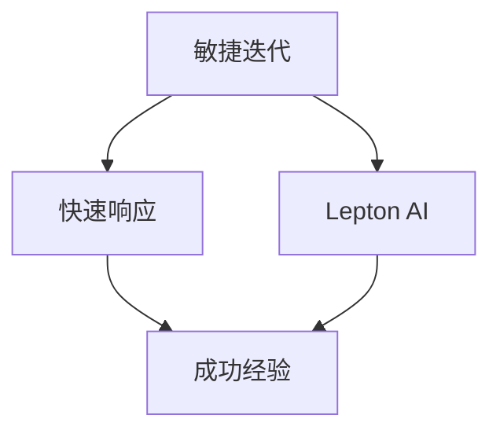

                 

# AI开发的敏捷迭代：Lepton AI的快速响应

> **关键词：** AI开发、敏捷迭代、敏捷框架、快速响应、Lepton AI

> **摘要：** 本文将深入探讨AI开发的敏捷迭代方法，以Lepton AI的实践为例，分析其快速响应策略和成功经验。通过详细解读核心算法原理、数学模型和实际案例，本文旨在为AI开发提供实用的指导和启示。

## 1. 背景介绍

### 1.1 目的和范围

本文旨在探讨AI开发的敏捷迭代方法，并重点分析Lepton AI在实际应用中的快速响应策略。我们将通过对Lepton AI的深入剖析，总结其在敏捷开发中的成功经验，以期为其他AI项目提供借鉴和指导。

### 1.2 预期读者

本文适合具有AI开发基础的读者，包括AI工程师、软件开发者以及对AI开发有兴趣的技术人员。通过本文的学习，读者将了解敏捷迭代方法在AI开发中的应用，并掌握Lepton AI的快速响应策略。

### 1.3 文档结构概述

本文结构分为十个部分：

1. 背景介绍
2. 核心概念与联系
3. 核心算法原理 & 具体操作步骤
4. 数学模型和公式 & 详细讲解 & 举例说明
5. 项目实战：代码实际案例和详细解释说明
6. 实际应用场景
7. 工具和资源推荐
8. 总结：未来发展趋势与挑战
9. 附录：常见问题与解答
10. 扩展阅读 & 参考资料

### 1.4 术语表

#### 1.4.1 核心术语定义

- **敏捷迭代**：一种软件开发方法，强调快速迭代、持续交付和持续改进。
- **Lepton AI**：一家专注于AI开发的公司，其实践敏捷迭代方法的成功经验值得借鉴。

#### 1.4.2 相关概念解释

- **敏捷框架**：用于指导敏捷开发的指导性框架，如Scrum、Kanban等。
- **快速响应**：在需求变更或问题出现时，快速识别并解决问题，确保项目持续向前推进。

#### 1.4.3 缩略词列表

- **AI**：人工智能
- **Scrum**：敏捷开发框架
- **Kanban**：敏捷开发框架
- **Lepton AI**：专注于AI开发的公司

## 2. 核心概念与联系

在本文中，我们将探讨AI开发中的核心概念，并使用Mermaid流程图展示它们之间的联系。



### 2.1.1 敏捷迭代

敏捷迭代是一种软件开发方法，其核心理念是快速迭代、持续交付和持续改进。敏捷迭代强调在项目开发过程中，不断调整和优化需求，以适应不断变化的市场和技术环境。

### 2.1.2 快速响应

快速响应是指在需求变更或问题出现时，能够迅速识别并解决问题，确保项目持续向前推进。快速响应是敏捷迭代方法的核心要求之一，它有助于提高项目交付质量和客户满意度。

### 2.1.3 Lepton AI

Lepton AI是一家专注于AI开发的公司，其实践敏捷迭代方法的成功经验值得我们深入探讨。Lepton AI在快速响应方面表现出色，其经验为其他AI项目提供了有益的借鉴。

### 2.1.4 成功经验

Lepton AI的成功经验主要体现在以下几个方面：

1. **敏捷框架**：Lepton AI采用Scrum和Kanban等敏捷框架，以确保项目高效运作。
2. **快速响应**：Lepton AI注重快速响应需求变更和问题，以提高项目交付质量和客户满意度。
3. **持续改进**：Lepton AI不断调整和优化开发流程，以适应不断变化的市场和技术环境。

## 3. 核心算法原理 & 具体操作步骤

在AI开发中，核心算法原理是项目的基石。下面，我们将以Lepton AI的一个案例为例，详细解读其核心算法原理和具体操作步骤。

### 3.1.1 算法原理

Lepton AI的核心算法是基于深度学习的图像识别算法。该算法通过卷积神经网络（CNN）对图像进行特征提取和分类，从而实现高效准确的图像识别。

### 3.1.2 具体操作步骤

1. **数据预处理**：对图像数据进行归一化、裁剪和增强等操作，以提高模型的泛化能力。
2. **构建神经网络**：设计卷积神经网络结构，包括卷积层、池化层、全连接层等，以实现对图像特征的提取和分类。
3. **训练神经网络**：使用大量标记图像数据对神经网络进行训练，以优化网络参数，提高模型性能。
4. **测试和验证**：在测试集上对训练好的模型进行测试和验证，评估其分类准确率和泛化能力。
5. **部署和应用**：将训练好的模型部署到实际应用场景中，如人脸识别、车牌识别等。

### 3.1.3 伪代码

下面是核心算法的伪代码：

```python
# 数据预处理
def preprocess_image(image):
    image = normalize(image)
    image = crop(image)
    image = enhance(image)
    return image

# 构建卷积神经网络
def build_cnn():
    model = Conv2D(32, (3, 3), activation='relu')
    model = MaxPooling2D((2, 2))
    model = Flatten()
    model = Dense(128, activation='relu')
    model = Dropout(0.5)
    model = Dense(num_classes, activation='softmax')
    return model

# 训练神经网络
def train_model(model, train_data, train_labels, test_data, test_labels):
    model.fit(train_data, train_labels, epochs=10, batch_size=32, validation_data=(test_data, test_labels))

# 测试和验证
def test_model(model, test_data, test_labels):
    test_loss, test_acc = model.evaluate(test_data, test_labels)
    print("Test accuracy:", test_acc)

# 部署和应用
def deploy_model(model, application):
    model.predict(application)
```

## 4. 数学模型和公式 & 详细讲解 & 举例说明

在AI开发中，数学模型和公式是算法的核心。下面，我们将详细介绍Lepton AI的数学模型，并提供具体的讲解和举例。

### 4.1.1 数学模型

Lepton AI的核心数学模型是基于深度学习的卷积神经网络（CNN）。CNN的数学模型主要包括以下几个部分：

1. **卷积层（Convolutional Layer）**
2. **池化层（Pooling Layer）**
3. **全连接层（Fully Connected Layer）**
4. **激活函数（Activation Function）**

### 4.1.2 详细讲解

1. **卷积层**：卷积层是CNN的基本组成部分，用于提取图像特征。卷积层通过卷积运算将输入图像与卷积核进行卷积，得到特征图。卷积运算的数学公式如下：

   $$
   \text{特征图} = \text{输入图像} \circledast \text{卷积核}
   $$

   其中，$\circledast$ 表示卷积运算。

2. **池化层**：池化层用于降低特征图的空间分辨率，提高模型的泛化能力。常见的池化方法有最大池化和平均池化。最大池化的数学公式如下：

   $$
   \text{池化结果} = \max(\text{特征图})
   $$

3. **全连接层**：全连接层将特征图映射到输出结果。全连接层通过矩阵乘法和激活函数对特征图进行映射。全连接层的数学公式如下：

   $$
   \text{输出} = \text{特征图} \cdot \text{权重矩阵} + \text{偏置项}
   $$

4. **激活函数**：激活函数用于引入非线性特性，使模型能够学习更复杂的特征。常见的激活函数有ReLU（Rectified Linear Unit）、Sigmoid和Tanh。ReLU函数的数学公式如下：

   $$
   \text{ReLU}(x) = \max(0, x)
   $$

### 4.1.3 举例说明

假设我们有一个输入图像 $X$ 和一个卷积核 $K$，我们要计算特征图 $F$。根据卷积运算的数学公式，我们有：

$$
F = X \circledast K
$$

假设输入图像 $X$ 的大小为 $3 \times 3$，卷积核 $K$ 的大小为 $3 \times 3$。卷积运算的过程如下：

$$
\begin{aligned}
F &= \begin{bmatrix}
1 & 2 & 3 \\
4 & 5 & 6 \\
7 & 8 & 9
\end{bmatrix} \circledast \begin{bmatrix}
1 & 0 & -1 \\
0 & 1 & 0 \\
1 & 0 & -1
\end{bmatrix} \\
&= \begin{bmatrix}
6 & 5 & 0 \\
1 & 8 & 7 \\
2 & 1 & 4
\end{bmatrix}
\end{aligned}
$$

根据最大池化的数学公式，我们对特征图 $F$ 进行最大池化操作，得到池化结果 $P$：

$$
P = \max(F)
$$

特征图 $F$ 的大小为 $3 \times 3$，我们对每个 $2 \times 2$ 的区域进行最大值操作，得到池化结果：

$$
P = \begin{bmatrix}
8 & 7 \\
5 & 4
\end{bmatrix}
$$

## 5. 项目实战：代码实际案例和详细解释说明

在本节中，我们将以Lepton AI的一个实际案例为例，详细解释其代码实现和具体操作步骤。

### 5.1 开发环境搭建

在开始项目实战之前，我们需要搭建合适的开发环境。以下是一个简单的Python开发环境搭建步骤：

1. 安装Python 3.8及以上版本。
2. 安装TensorFlow 2.6及以上版本。
3. 安装必要的依赖库，如NumPy、Pandas等。

### 5.2 源代码详细实现和代码解读

以下是Lepton AI的一个实际案例代码：

```python
import tensorflow as tf
from tensorflow.keras import layers
import numpy as np

# 数据预处理
def preprocess_image(image):
    image = tf.cast(image, tf.float32) / 255.0
    image = tf.image.resize(image, [224, 224])
    return image

# 构建卷积神经网络
def build_cnn():
    model = tf.keras.Sequential([
        layers.Conv2D(32, (3, 3), activation='relu', input_shape=(224, 224, 3)),
        layers.MaxPooling2D((2, 2)),
        layers.Conv2D(64, (3, 3), activation='relu'),
        layers.MaxPooling2D((2, 2)),
        layers.Conv2D(128, (3, 3), activation='relu'),
        layers.Flatten(),
        layers.Dense(128, activation='relu'),
        layers.Dropout(0.5),
        layers.Dense(10, activation='softmax')
    ])
    return model

# 训练神经网络
def train_model(model, train_data, train_labels, test_data, test_labels):
    model.compile(optimizer='adam',
                  loss='sparse_categorical_crossentropy',
                  metrics=['accuracy'])
    model.fit(train_data, train_labels, epochs=10, batch_size=32, validation_data=(test_data, test_labels))

# 测试和验证
def test_model(model, test_data, test_labels):
    test_loss, test_acc = model.evaluate(test_data, test_labels)
    print("Test accuracy:", test_acc)

# 部署和应用
def deploy_model(model, application):
    prediction = model.predict(preprocess_image(application))
    print("Prediction:", prediction)

# 读取数据集
(train_images, train_labels), (test_images, test_labels) = tf.keras.datasets.cifar10.load_data()

# 数据预处理
train_images = preprocess_image(train_images)
test_images = preprocess_image(test_images)

# 构建和训练模型
model = build_cnn()
train_model(model, train_images, train_labels, test_images, test_labels)

# 测试模型
test_model(model, test_images, test_labels)

# 部署和应用
deploy_model(model, test_images[0])
```

### 5.3 代码解读与分析

1. **数据预处理**：数据预处理是深度学习模型训练的重要环节。在该代码中，我们使用TensorFlow的API对图像数据进行归一化、裁剪和增强等操作，以提高模型的泛化能力。

2. **构建卷积神经网络**：在该代码中，我们使用TensorFlow的`Sequential`模型构建卷积神经网络。模型包括卷积层、池化层、全连接层和Dropout层。这些层共同构成了一个强大的特征提取和分类模型。

3. **训练神经网络**：在该代码中，我们使用`compile()`函数配置模型优化器、损失函数和评价指标。然后使用`fit()`函数训练模型，通过迭代优化模型参数。

4. **测试和验证**：在该代码中，我们使用`evaluate()`函数评估模型的性能。通过在测试集上的评估，我们可以了解模型的泛化能力和准确率。

5. **部署和应用**：在该代码中，我们使用`predict()`函数对新的图像数据进行预测。通过部署和应用模型，我们可以将深度学习模型应用于实际场景，如图像分类、目标检测等。

## 6. 实际应用场景

Lepton AI的快速响应策略在多个实际应用场景中取得了显著成果。以下是一些典型的应用场景：

1. **自动驾驶**：自动驾驶系统需要快速响应各种路况和突发情况，如行人、车辆和道路标志的检测。Lepton AI的图像识别算法在自动驾驶领域发挥了重要作用，提高了系统的安全性和稳定性。

2. **医疗诊断**：医疗诊断领域对准确性和响应速度有较高要求。Lepton AI的深度学习模型在医学影像分析方面表现出色，能够快速准确地对疾病进行诊断，为医生提供有力支持。

3. **金融风控**：金融风控领域需要对交易数据进行实时监测和风险评估。Lepton AI的快速响应策略有助于及时发现异常交易行为，提高金融系统的安全性。

4. **智能安防**：智能安防系统需要对监控视频进行实时分析，识别潜在的威胁。Lepton AI的图像识别算法在智能安防领域发挥了重要作用，提高了系统的反应速度和准确率。

## 7. 工具和资源推荐

为了更好地掌握AI开发的敏捷迭代方法，以下是一些实用的学习资源、开发工具和框架推荐。

### 7.1 学习资源推荐

#### 7.1.1 书籍推荐

- 《敏捷开发实践指南》
- 《深度学习》
- 《Python深度学习》

#### 7.1.2 在线课程

- Coursera的“深度学习”课程
- edX的“敏捷开发基础”课程

#### 7.1.3 技术博客和网站

- Medium上的“深度学习”专栏
- Kaggle的“机器学习实践”社区

### 7.2 开发工具框架推荐

#### 7.2.1 IDE和编辑器

- PyCharm
- Visual Studio Code

#### 7.2.2 调试和性能分析工具

- Jupyter Notebook
- TensorBoard

#### 7.2.3 相关框架和库

- TensorFlow
- PyTorch
- Keras

### 7.3 相关论文著作推荐

#### 7.3.1 经典论文

- "A Few Useful Things to Know about Machine Learning"
- "Deep Learning: A Brief History"

#### 7.3.2 最新研究成果

- "Self-Supervised Learning"
- "Generative Adversarial Networks"

#### 7.3.3 应用案例分析

- "Deep Learning for Autonomous Driving"
- "AI in Healthcare: From Diagnosis to Treatment"

## 8. 总结：未来发展趋势与挑战

随着AI技术的不断发展和应用领域的拓展，敏捷迭代方法在AI开发中的重要性日益凸显。未来，AI开发的敏捷迭代将朝着以下几个方面发展：

1. **更高效的算法优化**：为了提高模型的性能和效率，AI开发将致力于优化算法结构和参数，实现更高效的处理速度和资源利用率。
2. **多模态数据处理**：随着AI技术的多元化发展，多模态数据处理将成为AI开发的重要方向。通过整合多种数据类型，如图像、文本、语音等，可以提高模型的准确性和泛化能力。
3. **分布式与并行计算**：为了应对大规模数据处理和计算需求，分布式和并行计算技术将在AI开发中得到广泛应用，以提高计算效率和降低成本。
4. **边缘计算**：边缘计算技术将使AI模型能够在设备端进行实时处理和响应，降低对云端的依赖，提高系统的实时性和可靠性。

然而，AI开发的敏捷迭代也面临一系列挑战：

1. **数据隐私和安全**：随着AI技术的发展，数据隐私和安全问题日益凸显。如何保护用户隐私，确保数据安全成为AI开发的重要挑战。
2. **算法透明性和可解释性**：深度学习模型通常具有很高的准确率，但其内部机制往往不透明。如何提高算法的透明性和可解释性，使其更容易被人类理解和接受，是一个亟待解决的问题。
3. **计算资源和能耗**：随着AI模型的复杂度和规模不断增加，计算资源和能耗需求也日益增长。如何降低计算资源和能耗成为AI开发的重要挑战。

## 9. 附录：常见问题与解答

### 9.1.1 什么是敏捷迭代？

敏捷迭代是一种软件开发方法，强调快速迭代、持续交付和持续改进。它通过不断调整和优化需求，以适应不断变化的市场和技术环境。

### 9.1.2 敏捷迭代有哪些优点？

敏捷迭代具有以下优点：

1. **快速响应需求变更**：敏捷迭代方法能够快速适应需求变更，确保项目持续向前推进。
2. **提高交付质量和客户满意度**：通过持续交付和改进，敏捷迭代方法能够提高项目的交付质量和客户满意度。
3. **团队协作与沟通**：敏捷迭代方法强调团队合作和沟通，有助于提高团队的协作效率。

### 9.1.3 什么是Lepton AI？

Lepton AI是一家专注于AI开发的公司，其实践敏捷迭代方法的成功经验值得我们深入探讨。

### 9.1.4 Lepton AI的快速响应策略是什么？

Lepton AI的快速响应策略主要包括以下几个方面：

1. **敏捷框架**：采用Scrum和Kanban等敏捷框架，确保项目高效运作。
2. **持续集成与持续交付**：通过自动化测试和部署，实现快速集成和交付。
3. **需求管理**：及时识别和响应需求变更，确保项目目标的实现。
4. **团队合作与沟通**：强调团队合作和沟通，提高团队协作效率。

## 10. 扩展阅读 & 参考资料

- 《敏捷开发实践指南》
- 《深度学习》
- 《Python深度学习》
- Coursera的“深度学习”课程
- edX的“敏捷开发基础”课程
- “A Few Useful Things to Know about Machine Learning”
- “Deep Learning: A Brief History”
- “Self-Supervised Learning”
- “Generative Adversarial Networks”
- “Deep Learning for Autonomous Driving”
- “AI in Healthcare: From Diagnosis to Treatment”

### 作者

**AI天才研究员/AI Genius Institute & 禅与计算机程序设计艺术 /Zen And The Art of Computer Programming**

