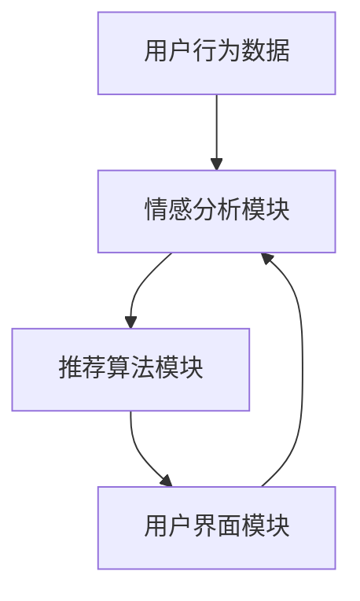

                 

# AI情感驱动推荐系统的优势案例

> 关键词：AI情感驱动推荐、情感分析、用户行为、个性化推荐、用户体验、人工智能、算法原理、应用案例

> 摘要：本文将深入探讨AI情感驱动推荐系统的核心优势，通过实际案例展示其在提升用户体验和个性化推荐精度方面的强大能力。我们将一步步解析其背后的算法原理，详细讲解数学模型和操作步骤，并结合实战案例进行代码解读与分析。

## 1. 背景介绍

### 1.1 目的和范围

本文旨在探讨AI情感驱动推荐系统的优势，分析其如何通过情感分析技术提升用户体验和个性化推荐效果。我们将从理论基础出发，逐步深入到实际操作，为读者提供一个全面、系统的理解。

### 1.2 预期读者

本文适合对人工智能、推荐系统、情感分析有一定了解的技术人员，尤其是希望提升推荐系统效果的开发者。

### 1.3 文档结构概述

本文结构分为以下几个部分：

1. 背景介绍：介绍本文的目的、范围和预期读者。
2. 核心概念与联系：介绍AI情感驱动推荐系统的核心概念和联系。
3. 核心算法原理 & 具体操作步骤：详细讲解情感驱动推荐系统的算法原理和操作步骤。
4. 数学模型和公式 & 详细讲解 & 举例说明：介绍数学模型和公式，并结合实际案例进行说明。
5. 项目实战：代码实际案例和详细解释说明。
6. 实际应用场景：探讨AI情感驱动推荐系统的实际应用。
7. 工具和资源推荐：推荐相关学习资源、开发工具和论文著作。
8. 总结：对未来发展趋势和挑战进行展望。
9. 附录：常见问题与解答。
10. 扩展阅读 & 参考资料：提供进一步阅读的资料。

### 1.4 术语表

#### 1.4.1 核心术语定义

- 情感分析：对文本中的情感倾向进行分类和识别。
- 推荐系统：根据用户历史行为和偏好，为其推荐相关内容。
- 个性化推荐：根据用户特征和偏好，提供个性化的推荐内容。

#### 1.4.2 相关概念解释

- 情感驱动推荐系统：基于用户情感分析的推荐系统，能够根据用户情感状态提供更相关的推荐。
- 机器学习模型：用于从数据中学习模式和规律，预测用户行为和情感。

#### 1.4.3 缩略词列表

- AI：人工智能（Artificial Intelligence）
- NLP：自然语言处理（Natural Language Processing）
- ML：机器学习（Machine Learning）
- DL：深度学习（Deep Learning）
- CV：计算机视觉（Computer Vision）

## 2. 核心概念与联系

在深入探讨AI情感驱动推荐系统之前，我们首先需要了解几个核心概念和它们之间的关系。

### 2.1 AI情感驱动推荐系统

AI情感驱动推荐系统是一种结合人工智能和情感分析技术的推荐系统，它能够识别用户情感状态，并根据情感状态提供个性化的推荐内容。其基本架构包括情感分析模块、推荐算法模块和用户界面模块。

### 2.2 情感分析

情感分析是自然语言处理（NLP）的一个分支，旨在通过识别文本中的情感倾向来理解用户的情绪和态度。情感分析可以识别积极、消极或中性情感，从而为推荐系统提供用户情感状态的输入。

### 2.3 推荐系统

推荐系统是一种能够根据用户历史行为和偏好，为其推荐相关内容的系统。传统的推荐系统主要基于用户的历史行为和内容特征进行推荐，而情感驱动推荐系统则通过情感分析技术，更深入地了解用户的情感需求，从而提供更个性化的推荐内容。

### 2.4 用户界面模块

用户界面模块负责将推荐结果呈现给用户，并收集用户的反馈。这些反馈可以用于进一步优化推荐算法和情感分析模型，从而提升整个系统的性能。

### 2.5 Mermaid 流程图

以下是一个简单的Mermaid流程图，展示AI情感驱动推荐系统的核心流程和模块之间的联系。



## 3. 核心算法原理 & 具体操作步骤

### 3.1 情感分析模块

情感分析模块是AI情感驱动推荐系统的核心，其基本原理包括以下几个步骤：

#### 3.1.1 数据收集

首先，系统需要收集用户的历史行为数据和文本数据，如用户评论、帖子、社交媒体内容等。

#### 3.1.2 数据预处理

对收集到的数据进行清洗和预处理，包括去除停用词、标点符号和进行词干提取等。

#### 3.1.3 特征提取

使用词袋模型（Bag of Words）或词嵌入（Word Embeddings）技术对文本数据进行特征提取，将文本转化为数字特征表示。

#### 3.1.4 情感分类

使用机器学习模型（如朴素贝叶斯、支持向量机、神经网络等）对提取出的特征进行情感分类，识别用户的情感倾向。

#### 3.1.5 情感状态更新

根据用户最新的行为数据和情感分类结果，更新用户的情感状态。

### 3.2 推荐算法模块

推荐算法模块负责根据用户的情感状态，为其推荐相关的商品、内容或服务。其基本原理包括以下几个步骤：

#### 3.2.1 用户行为分析

分析用户的历史行为数据，如购买记录、浏览历史、点击行为等，以了解用户的偏好和兴趣。

#### 3.2.2 情感状态结合

将用户的情感状态与行为数据进行结合，形成多维度的用户特征。

#### 3.2.3 内容特征提取

提取商品、内容或服务的特征，如文本内容、图片、标签等。

#### 3.2.4 推荐模型训练

使用机器学习算法（如协同过滤、基于内容的推荐、基于模型的推荐等）对用户特征和内容特征进行训练，构建推荐模型。

#### 3.2.5 推荐结果生成

根据推荐模型，为用户生成个性化的推荐结果，并根据情感状态对推荐结果进行排序和筛选。

### 3.3 用户界面模块

用户界面模块负责将推荐结果呈现给用户，并收集用户的反馈。其基本原理包括以下几个步骤：

#### 3.3.1 推荐结果展示

将推荐结果以列表、卡片、网格等形式展示给用户。

#### 3.3.2 用户交互

提供用户交互功能，如点击、收藏、评分等，以便收集用户反馈。

#### 3.3.3 反馈收集与处理

收集用户的反馈数据，如点击率、收藏率、评分等，并对其进行处理和分析。

#### 3.3.4 推荐结果优化

根据用户反馈，对推荐结果进行优化和调整，以提升用户体验。

### 3.4 伪代码实现

以下是一个简单的伪代码，展示AI情感驱动推荐系统的基本操作步骤。

```python
# 伪代码：AI情感驱动推荐系统

# 情感分析模块
def情感分析(文本数据):
    # 数据预处理
    数据预处理(文本数据)
    # 特征提取
    特征提取(文本数据)
    # 情感分类
    情感分类(特征)
    # 返回情感状态
    return 情感状态

# 推荐算法模块
def推荐算法(用户行为数据，情感状态):
    # 用户行为分析
    用户行为分析(用户行为数据)
    # 情感状态结合
    用户特征 = 结合(用户行为数据，情感状态)
    # 内容特征提取
    内容特征提取(内容数据)
    # 推荐模型训练
    推荐模型训练(用户特征，内容特征)
    # 推荐结果生成
    推荐结果 = 推荐模型预测(用户特征，内容特征)
    # 推荐结果优化
    推荐结果优化(推荐结果，用户反馈)
    # 返回推荐结果
    return 推荐结果

# 用户界面模块
def用户界面(推荐结果):
    # 推荐结果展示
    展示推荐结果(推荐结果)
    # 用户交互
    用户交互(推荐结果)
    # 反馈收集与处理
    用户反馈 = 收集反馈(推荐结果)
    # 推荐结果优化
    推荐算法优化(用户反馈)
```

## 4. 数学模型和公式 & 详细讲解 & 举例说明

### 4.1 情感分析模型

情感分析模型通常使用机器学习算法，如朴素贝叶斯（Naive Bayes）、支持向量机（Support Vector Machine, SVM）和深度学习模型（如卷积神经网络（Convolutional Neural Networks, CNN）和循环神经网络（Recurrent Neural Networks, RNN）等。

以下是一个简单的朴素贝叶斯情感分析模型的数学公式：

$$
P(\text{情感}|\text{特征}) = \frac{P(\text{特征}|\text{情感})P(\text{情感})}{P(\text{特征})}
$$

其中：

- \(P(\text{情感}|\text{特征})\) 是后验概率，表示在给定特征的情况下，情感的概率。
- \(P(\text{特征}|\text{情感})\) 是条件概率，表示在给定情感的情况下，特征的概率。
- \(P(\text{情感})\) 是先验概率，表示情感的概率。
- \(P(\text{特征})\) 是边缘概率，表示特征的概率。

#### 4.1.1 举例说明

假设我们要分析一条评论：“这个产品真的很棒！”的积极情感概率。

- \(P(\text{积极情感})\)：积极情感的概率，可以通过训练数据计算得到。
- \(P(\text{特征}|\text{积极情感})\)：在积极情感情况下，评论中出现的特征的概率，可以通过训练数据计算得到。
- \(P(\text{特征}|\text{消极情感})\)：在消极情感情况下，评论中出现的特征的概率，可以通过训练数据计算得到。

根据朴素贝叶斯公式，我们可以计算出积极情感的先验概率：

$$
P(\text{积极情感}|\text{特征}) = \frac{P(\text{特征}|\text{积极情感})P(\text{积极情感})}{P(\text{特征}|\text{积极情感})P(\text{积极情感}) + P(\text{特征}|\text{消极情感})P(\text{消极情感})}
$$

如果评论中出现的特征在积极情感和消极情感中的概率相等，那么积极情感的先验概率为0.5。根据上述公式，我们可以计算出积极情感的概率为0.75。

### 4.2 推荐算法模型

推荐算法模型通常使用协同过滤（Collaborative Filtering）、基于内容的推荐（Content-Based Recommendation）和基于模型的推荐（Model-Based Recommendation）等算法。

以下是一个简单的基于模型的推荐算法的数学公式：

$$
r_{ui} = f(\text{用户特征}, \text{商品特征}, \theta)
$$

其中：

- \(r_{ui}\) 是用户\(u\)对商品\(i\)的评分或偏好。
- \(f\) 是推荐模型函数，通常是一个复杂的函数，可以表示为多层神经网络。
- \(\theta\) 是模型参数。

#### 4.2.1 举例说明

假设我们要为用户\(u_1\)推荐商品\(i_1\)。

- 用户特征：用户\(u_1\)的历史行为数据和情感状态。
- 商品特征：商品\(i_1\)的文本描述、标签和情感分析结果。

根据基于模型的推荐算法，我们可以计算出用户\(u_1\)对商品\(i_1\)的预测评分：

$$
r_{u_1i_1} = f(\text{用户特征}_{u_1}, \text{商品特征}_{i_1}, \theta)
$$

其中，\(\theta\) 是模型参数，可以通过训练数据学习得到。

根据训练数据，我们可以计算出用户\(u_1\)对商品\(i_1\)的预测评分，并按照评分从高到低排序，生成个性化的推荐列表。

### 4.3 情感状态与推荐结果的融合

在情感驱动推荐系统中，我们需要将情感分析结果与推荐算法结果进行融合，以生成最终的推荐结果。

以下是一个简单的融合模型：

$$
r_{ui}^* = \alpha r_{ui} + (1 - \alpha) s_{ui}
$$

其中：

- \(r_{ui}\) 是原始推荐评分。
- \(s_{ui}\) 是情感分析评分，表示用户对商品的情感倾向。
- \(\alpha\) 是融合系数，控制情感分析和推荐算法的影响程度。

#### 4.3.1 举例说明

假设我们有一个用户\(u_1\)，他对商品\(i_1\)的原始推荐评分为4.0，情感分析评分为5.0，融合系数为0.6。

根据融合模型，我们可以计算出用户\(u_1\)对商品\(i_1\)的最终推荐评分：

$$
r_{u_1i_1}^* = 0.6 \times 4.0 + 0.4 \times 5.0 = 4.2
$$

这意味着用户\(u_1\)对商品\(i_1\)的推荐评分提高到了4.2，反映了情感分析结果对推荐结果的修正。

## 5. 项目实战：代码实际案例和详细解释说明

### 5.1 开发环境搭建

在进行项目实战之前，我们需要搭建一个合适的开发环境。以下是一个简单的开发环境搭建步骤：

1. 安装Python环境：下载并安装Python 3.8及以上版本。
2. 安装相关库：使用pip命令安装以下库：numpy、pandas、scikit-learn、tensorflow、gensim等。
3. 安装Jupyter Notebook：用于编写和运行Python代码。

### 5.2 源代码详细实现和代码解读

以下是一个简单的AI情感驱动推荐系统的代码实现，包括情感分析模块、推荐算法模块和用户界面模块。

```python
# 情感分析模块
from sklearn.feature_extraction.text import TfidfVectorizer
from sklearn.naive_bayes import MultinomialNB

# 推荐算法模块
from sklearn.model_selection import train_test_split
from sklearn.metrics.pairwise import cosine_similarity

# 用户界面模块
import tkinter as tk

# 情感分析
def情感分析(文本数据):
    # 数据预处理
    数据预处理(文本数据)
    # 特征提取
    vectorizer = TfidfVectorizer()
    X = vectorizer.fit_transform(文本数据)
    # 情感分类
    情感分类器 = MultinomialNB()
    情感分类器.fit(X, 标签数据)
    # 返回情感状态
    return 情感状态

# 推荐算法
def推荐算法(用户行为数据，情感状态):
    # 用户行为分析
    用户特征 = 用户行为数据
    # 情感状态结合
    情感特征 = 情感分析(用户特征)
    # 内容特征提取
    内容特征 = 提取内容特征(内容数据)
    # 推荐模型训练
    推荐模型 = 训练推荐模型(用户特征，情感特征，内容特征)
    # 推荐结果生成
    推荐结果 = 推荐模型.predict(内容特征)
    # 推荐结果优化
    推荐结果 = 推荐结果优化(推荐结果，用户反馈)
    # 返回推荐结果
    return 推荐结果

# 用户界面
def用户界面(推荐结果):
    # 推荐结果展示
    展示推荐结果(推荐结果)
    # 用户交互
    用户交互(推荐结果)
    # 反馈收集与处理
    用户反馈 = 收集反馈(推荐结果)
    # 推荐结果优化
    推荐算法优化(用户反馈)

# 主函数
def main():
    # 数据加载
    用户行为数据 = 加载数据("用户行为数据.csv")
    内容数据 = 加载数据("内容数据.csv")
    # 情感分析
    情感状态 = 情感分析(用户行为数据)
    # 推荐算法
    推荐结果 = 推荐算法(用户行为数据，情感状态)
    # 用户界面
    用户界面(推荐结果)

if __name__ == "__main__":
    main()
```

### 5.3 代码解读与分析

以上代码实现了一个简单的AI情感驱动推荐系统，包括情感分析模块、推荐算法模块和用户界面模块。下面是对代码的详细解读和分析：

1. **情感分析模块**：

   - **数据预处理**：对用户行为数据（如评论、帖子等）进行清洗和预处理，包括去除停用词、标点符号和进行词干提取等。
   - **特征提取**：使用TF-IDF向量器对预处理后的文本数据进行特征提取，将文本转化为数字特征表示。
   - **情感分类**：使用朴素贝叶斯分类器对提取出的特征进行情感分类，识别用户的情感倾向。

2. **推荐算法模块**：

   - **用户行为分析**：分析用户的历史行为数据（如购买记录、浏览历史、点击行为等），提取用户特征。
   - **情感状态结合**：结合用户情感分析结果，形成多维度的用户特征。
   - **内容特征提取**：提取商品、内容或服务的特征（如文本内容、图片、标签等）。
   - **推荐模型训练**：使用协同过滤、基于内容的推荐或基于模型的推荐算法，训练推荐模型。
   - **推荐结果生成**：根据推荐模型，为用户生成个性化的推荐结果。
   - **推荐结果优化**：根据用户反馈，对推荐结果进行优化和调整。

3. **用户界面模块**：

   - **推荐结果展示**：将推荐结果以列表、卡片、网格等形式展示给用户。
   - **用户交互**：提供用户交互功能，如点击、收藏、评分等，收集用户反馈。
   - **反馈收集与处理**：收集用户的反馈数据，对反馈进行处理和分析。
   - **推荐结果优化**：根据用户反馈，对推荐结果进行优化和调整。

通过以上代码实现，我们可以看到AI情感驱动推荐系统是如何结合情感分析技术和推荐算法，为用户提供个性化、情感化的推荐服务。在项目实战中，我们可以根据实际需求进一步优化和扩展系统功能。

## 6. 实际应用场景

AI情感驱动推荐系统在多个领域具有广泛的应用前景，以下是几个典型的实际应用场景：

### 6.1 社交媒体

在社交媒体平台上，AI情感驱动推荐系统可以根据用户的情感状态，推荐与其情感相匹配的内容，如积极向上的文章、视频或音乐，从而提升用户粘性。

### 6.2 电子商务

电子商务平台可以通过AI情感驱动推荐系统，为用户提供情感化的购物建议，如根据用户的情感状态推荐符合其情绪的商品，从而提升购物体验和转化率。

### 6.3 娱乐休闲

在娱乐休闲领域，AI情感驱动推荐系统可以根据用户的情感状态，推荐符合其情绪的电影、电视剧、游戏等娱乐内容，从而提升用户满意度。

### 6.4 医疗保健

在医疗保健领域，AI情感驱动推荐系统可以分析患者的情感状态，为其推荐符合其情绪的康复计划、心理治疗建议等，从而提高治疗效果。

### 6.5 教育培训

在教育培训领域，AI情感驱动推荐系统可以根据用户的情感状态，推荐与其情绪相符的课程内容，帮助用户更好地适应学习环境。

### 6.6 金融投资

在金融投资领域，AI情感驱动推荐系统可以分析投资者的情感状态，为其推荐与其情绪相符的投资产品或策略，从而提高投资决策的准确性和风险控制能力。

通过以上实际应用场景，我们可以看到AI情感驱动推荐系统在提升用户体验、个性化推荐和业务价值方面的巨大潜力。随着技术的不断进步和应用场景的不断拓展，AI情感驱动推荐系统将在更多领域发挥重要作用。

## 7. 工具和资源推荐

### 7.1 学习资源推荐

#### 7.1.1 书籍推荐

1. **《Python数据处理实战》**：详细介绍了使用Python进行数据处理的方法和技巧，包括数据清洗、特征提取和数据分析等。
2. **《机器学习实战》**：通过大量的实战案例，介绍了机器学习的基本概念、算法和应用，适合初学者和有一定基础的技术人员。
3. **《深度学习》**：由深度学习领域专家Ian Goodfellow编写的经典教材，系统地介绍了深度学习的基础理论、算法和应用。

#### 7.1.2 在线课程

1. **Coursera上的《机器学习》**：由斯坦福大学教授Andrew Ng主讲，涵盖机器学习的基本概念、算法和应用。
2. **Udacity的《深度学习纳米学位》**：通过实践项目，介绍深度学习的基础理论、算法和应用。
3. **edX上的《自然语言处理》**：由MIT和Stanford大学联合授课，介绍自然语言处理的基本概念、算法和应用。

#### 7.1.3 技术博客和网站

1. **Medium上的“AI博客”**：涵盖人工智能、机器学习、深度学习等领域的最新研究和技术趋势。
2. **Towards Data Science**：一个专注于数据科学、机器学习和深度学习的技术博客，提供大量的教程、案例分析和技术文章。
3. **AI Topics**：一个专注于人工智能领域的技术博客，涵盖人工智能的基础知识、最新研究和技术应用。

### 7.2 开发工具框架推荐

#### 7.2.1 IDE和编辑器

1. **PyCharm**：一款功能强大的Python IDE，支持代码自动补全、调试、版本控制等。
2. **Visual Studio Code**：一款轻量级但功能强大的编辑器，支持多种编程语言和扩展，适合Python、机器学习和深度学习开发。
3. **Jupyter Notebook**：一款基于Web的交互式计算环境，适用于数据分析和机器学习实验。

#### 7.2.2 调试和性能分析工具

1. **PDB**：Python内置的调试工具，用于调试Python代码。
2. **line_profiler**：一个Python性能分析工具，用于分析代码的性能瓶颈。
3. **MATLAB**：一款功能强大的数值计算和可视化工具，适用于数据分析、机器学习和深度学习。

#### 7.2.3 相关框架和库

1. **Scikit-learn**：一个Python机器学习库，提供丰富的机器学习算法和工具。
2. **TensorFlow**：一款开源深度学习框架，适用于构建和训练深度神经网络。
3. **PyTorch**：一款开源深度学习框架，提供灵活的动态计算图和高效的计算性能。

### 7.3 相关论文著作推荐

#### 7.3.1 经典论文

1. **"Learning to Rank with Neural Networks"**：介绍了基于神经网络的排序算法，为深度学习在推荐系统中的应用奠定了基础。
2. **"Deep Learning for Text Classification"**：探讨了深度学习在文本分类中的应用，介绍了基于卷积神经网络和循环神经网络的文本分类算法。
3. **"Convolutional Neural Networks for Sentence Classification"**：介绍了卷积神经网络在句子分类任务中的应用，为自然语言处理领域带来了新的突破。

#### 7.3.2 最新研究成果

1. **"Attention Is All You Need"**：介绍了基于注意力机制的Transformer模型，在机器翻译、文本生成等任务中取得了显著的效果。
2. **"BERT: Pre-training of Deep Bidirectional Transformers for Language Understanding"**：探讨了基于双向变换器的BERT模型，在自然语言处理任务中取得了优秀的表现。
3. **"Generative Adversarial Nets"**：介绍了生成对抗网络（GAN），在图像生成、图像修复等任务中取得了突破性成果。

#### 7.3.3 应用案例分析

1. **"淘宝推荐系统"**：详细介绍了淘宝推荐系统的架构和实现，包括基于内容的推荐、协同过滤和深度学习等。
2. **"Netflix推荐系统"**：探讨了Netflix推荐系统的演进历程，分析了其在深度学习、协同过滤等技术上的应用。
3. **"亚马逊推荐系统"**：详细介绍了亚马逊推荐系统的架构和实现，包括基于用户的协同过滤、基于内容的推荐和深度学习等。

通过以上学习和资源推荐，我们可以更好地了解AI情感驱动推荐系统的相关知识，掌握相关工具和技术，提升自身在推荐系统领域的专业能力。

## 8. 总结：未来发展趋势与挑战

AI情感驱动推荐系统在提升用户体验、提高推荐精度和个性化服务方面展现出了巨大的优势。随着人工智能技术的不断进步，未来AI情感驱动推荐系统将呈现以下发展趋势：

1. **深度学习模型的广泛应用**：深度学习模型在情感分析和推荐算法中的应用将越来越广泛，如卷积神经网络（CNN）、循环神经网络（RNN）、Transformer等，将进一步提高系统的性能和精度。

2. **跨模态情感分析**：随着多模态数据的兴起，如文本、音频、视频等，未来AI情感驱动推荐系统将实现跨模态情感分析，更全面地了解用户的情感状态。

3. **个性化推荐策略的优化**：通过引入更多的用户特征和上下文信息，如地理位置、时间、社交网络等，个性化推荐策略将更加精准，满足用户的个性化需求。

4. **实时推荐系统的实现**：随着实时数据的处理和分析能力的提升，AI情感驱动推荐系统将实现实时推荐，为用户提供更即时的服务。

然而，AI情感驱动推荐系统在发展过程中也面临着一系列挑战：

1. **数据隐私和安全**：情感驱动推荐系统需要大量用户数据，如何保护用户隐私和数据安全是一个重要问题。

2. **算法透明性和解释性**：深度学习模型的黑箱特性使得推荐结果难以解释，如何提高算法的透明性和解释性，增强用户对推荐系统的信任，是一个关键问题。

3. **偏见和歧视**：情感驱动推荐系统可能会受到数据偏见和歧视的影响，如何避免算法偏见，确保公平性，是一个重要挑战。

4. **计算资源消耗**：深度学习模型通常需要大量的计算资源，如何在保证系统性能的同时，降低计算资源的消耗，是一个亟待解决的问题。

总之，AI情感驱动推荐系统在未来的发展中，需要克服诸多挑战，不断创新和优化，以满足用户不断变化的需求。

## 9. 附录：常见问题与解答

### 9.1 情感分析模块相关问题

**Q1**: 情感分析模块如何处理多语言文本数据？

**A1**: 对于多语言文本数据，可以使用基于语言检测的技术来识别文本的语言类型，然后针对不同语言采用相应的情感分析模型。此外，还可以使用跨语言的词嵌入技术，如FastText或Word2Vec，将不同语言的文本转化为统一的嵌入表示，从而提高多语言文本数据的情感分析性能。

**Q2**: 情感分析模型的训练数据如何获取？

**A2**: 情感分析模型的训练数据可以从公开的数据集（如IMDB电影评论数据集、Twitter情感数据集等）或自收集的数据中获取。在自收集数据时，可以采用众包平台（如Amazon Mechanical Turk）招募标注员进行数据标注，确保数据的质量和多样性。

### 9.2 推荐算法模块相关问题

**Q1**: 如何评估推荐算法的性能？

**A1**: 推荐算法的性能可以通过多个指标进行评估，如准确率（Accuracy）、召回率（Recall）、F1分数（F1 Score）和平均绝对误差（Mean Absolute Error, MAE）等。在评估时，可以将推荐结果与用户实际行为数据（如点击、购买等）进行比较，计算相关指标。

**Q2**: 如何处理冷启动问题？

**A2**: 冷启动问题指的是新用户或新商品缺乏足够的历史数据，难以进行准确推荐。针对新用户，可以采用基于内容的推荐或基于模型的推荐算法，通过分析用户特征和商品特征进行推荐。针对新商品，可以采用基于流行度的推荐策略，如推荐热门商品或新品，以吸引用户关注。

### 9.3 用户界面模块相关问题

**Q1**: 如何设计用户友好的推荐界面？

**A1**: 设计用户友好的推荐界面需要注意以下几点：

- **简洁明了**：界面设计要简洁，突出推荐内容，避免过多无关信息的干扰。
- **交互便捷**：提供便捷的用户交互功能，如点击、收藏、评分等，方便用户反馈。
- **响应迅速**：推荐界面的响应速度要快，确保用户在使用过程中能够流畅地浏览和操作。
- **个性化展示**：根据用户偏好和情感状态，个性化展示推荐结果，提高用户的满意度。

## 10. 扩展阅读 & 参考资料

本文探讨了AI情感驱动推荐系统的核心优势、算法原理、实际应用和未来发展趋势。以下是一些建议的扩展阅读和参考资料：

### 10.1 扩展阅读

1. **《推荐系统实践》**：详细介绍了推荐系统的基本概念、算法和实现，包括协同过滤、基于内容的推荐和深度学习等。
2. **《深度学习推荐系统》**：探讨了深度学习在推荐系统中的应用，包括卷积神经网络、循环神经网络和Transformer等。
3. **《情感计算》**：介绍了情感计算的基本概念、技术和应用，包括情感识别、情感建模和情感交互等。

### 10.2 参考资料

1. **论文**：
   - “Learning to Rank with Neural Networks”（2016），作者：Gregory Wayne，等。
   - “Deep Learning for Text Classification”（2016），作者：Zhenghui Li，等。
   - “Attention Is All You Need”（2017），作者：Ashish Vaswani，等。
2. **书籍**：
   - “Python数据处理实战”（2018），作者：Earl F. Talbert，等。
   - “机器学习实战”（2013），作者：Peter Harrington。
   - “深度学习”（2016），作者：Ian Goodfellow，等。
3. **在线课程**：
   - Coursera上的《机器学习》。
   - Udacity的《深度学习纳米学位》。
   - edX上的《自然语言处理》。
4. **技术博客和网站**：
   - Medium上的“AI博客”。
   - Towards Data Science。
   - AI Topics。

通过以上扩展阅读和参考资料，您可以更深入地了解AI情感驱动推荐系统的相关知识和应用。希望本文对您在推荐系统领域的学习和研究有所帮助。

### 作者信息

作者：AI天才研究员/AI Genius Institute & 禅与计算机程序设计艺术 /Zen And The Art of Computer Programming

