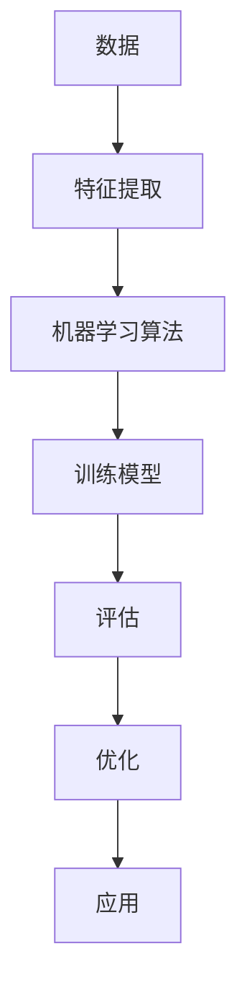

                 

### 背景介绍

#### AI技术与用户需求的演变

人工智能（AI）技术的发展经历了数个阶段，从最初的规则系统到现代的深度学习，这一过程充分体现了技术在不断进步的同时，用户需求也在不断演变的特征。早期的AI技术主要应用于较为简单的任务，如自然语言处理、图像识别等。然而，随着计算能力的提升和数据量的激增，AI技术逐渐能够处理更加复杂的问题，从而满足了用户日益增长的需求。

在过去的几十年中，AI技术的发展大致可以分为以下几个阶段：

1. **规则系统**：早期的AI技术依赖于人工编写规则，这些规则定义了程序如何处理特定输入。这种方法的局限性在于，它只能处理明确定义的规则，对于复杂、模糊或未知的问题难以胜任。

2. **知识表示**：随着知识表示技术的发展，AI系统开始能够利用符号逻辑和语义网络来表示知识。这种方法在一定程度上提高了AI的智能水平，但仍受限于知识的表达方式和处理能力。

3. **机器学习**：机器学习的兴起标志着AI技术的重大突破。通过学习大量数据，AI系统能够自动发现模式并作出决策，从而大大提高了其智能水平。这一阶段的AI技术能够处理更加复杂的问题，但在数据质量和数量上有较高的要求。

4. **深度学习**：深度学习是机器学习的一个重要分支，通过多层神经网络对数据进行学习，深度学习在图像识别、语音识别等领域取得了显著的成果。深度学习技术的高效性和准确性使得AI技术在各行各业中得到广泛应用。

5. **自然语言处理（NLP）**：自然语言处理是AI技术的另一个重要领域。通过理解和生成自然语言，NLP技术使得人与机器之间的交互变得更加自然和流畅。从简单的文本分类到复杂的对话系统，NLP技术正在不断推动AI技术的发展。

随着AI技术的不断进步，用户对AI的需求也在不断演变。早期的用户需求主要集中在特定领域的应用，如自动化办公、自动化生产线等。然而，随着AI技术的普及和用户对智能体验的追求，现在的用户需求变得更加多样化，不仅包括传统的自动化任务，还涉及到更加复杂和个性化的应用，如智能助手、个性化推荐、智能诊断等。

#### 用户需求与AI技术的匹配问题

尽管AI技术在不断进步，但如何在技术能力和用户需求之间找到最佳匹配点仍然是一个挑战。用户需求的变化速度往往超过技术发展的速度，这就导致了以下几个问题：

1. **技术适应性**：AI技术需要快速适应不断变化的需求。例如，当用户需要一种能够处理多语言交互的智能助手时，AI系统必须能够在短时间内学习和适应不同的语言环境。

2. **用户体验**：用户体验是衡量AI技术成功与否的重要指标。尽管AI技术能够处理复杂的任务，但如何让用户感受到智能、便捷和愉悦的体验仍然需要深入研究和优化。

3. **数据隐私与安全**：随着AI技术在个人数据收集和分析中的应用越来越广泛，用户对隐私和安全的需求也日益增加。如何保护用户数据，确保AI系统的透明性和可解释性，成为了AI技术发展的重要问题。

4. **技术成本**：AI技术的开发和部署成本较高，这对一些小型企业或个人用户来说可能是一个障碍。如何降低AI技术的成本，使其更加普及和实用，是当前需要解决的问题。

#### 文章目标

本文旨在深入探讨AI技术与用户需求之间的匹配问题，通过分析技术发展的趋势和用户需求的变化，探讨如何实现二者的最佳匹配。本文将分为以下几个部分：

1. **核心概念与联系**：介绍AI技术中的核心概念及其相互关系，使用Mermaid流程图展示其架构。

2. **核心算法原理 & 具体操作步骤**：详细解释AI技术的核心算法原理，包括机器学习和深度学习等，并提供具体的操作步骤。

3. **数学模型和公式 & 详细讲解 & 举例说明**：介绍AI技术中使用的数学模型和公式，并通过具体案例进行讲解。

4. **项目实战：代码实际案例和详细解释说明**：通过实际项目案例，展示AI技术在具体应用中的实现过程，并详细解读代码。

5. **实际应用场景**：探讨AI技术在各个领域的应用场景，分析其与用户需求的匹配程度。

6. **工具和资源推荐**：推荐学习资源、开发工具和框架，帮助读者深入了解和掌握AI技术。

7. **总结：未来发展趋势与挑战**：总结本文的主要内容，探讨AI技术的未来发展趋势和面临的挑战。

通过本文的探讨，我们希望能够为读者提供一份全面而深入的了解，帮助他们在AI技术与用户需求匹配的道路上取得更好的成果。

---

在本文的第一部分，我们简要回顾了AI技术的发展历程，并分析了用户需求的演变。接下来，我们将详细探讨AI技术中的核心概念及其相互关系，并使用Mermaid流程图展示其架构。

#### 核心概念与联系

AI技术涉及多个核心概念，这些概念相互关联，共同构成了AI技术的理论基础和应用框架。以下是几个关键概念：

1. **数据**：数据是AI技术的核心资源。无论是机器学习还是深度学习，都需要大量的数据来训练模型。数据的质量和数量直接影响模型的性能和准确性。

2. **特征**：特征是从数据中提取的有意义的信息。特征选择和提取是数据预处理的重要环节，决定了模型的学习效率和效果。

3. **算法**：算法是AI技术的核心，包括机器学习算法、深度学习算法等。不同的算法适用于不同类型的问题，其性能和效率也有所不同。

4. **模型**：模型是根据算法和数据进行训练得到的结构化输出。模型可以用来预测、分类、生成等。

5. **评估**：评估是对模型性能的衡量。常用的评估指标包括准确率、召回率、F1分数等。

#### Mermaid流程图展示

为了更好地理解AI技术的核心概念及其相互关系，我们可以使用Mermaid流程图进行展示。以下是AI技术核心概念的Mermaid流程图：



在这个流程图中，数据经过特征提取后输入到机器学习算法中进行训练，训练得到的模型经过评估和优化，最终应用于实际场景。

#### 详细解释

1. **数据**：数据是AI技术的基石。高质量的数据能够为模型提供更好的训练基础，从而提高模型的性能。数据可以从各种来源获取，包括公开数据集、企业内部数据、用户生成的数据等。

2. **特征提取**：特征提取是将原始数据转换为有意义的信息的过程。这一步非常关键，因为特征的质量直接影响模型的性能。常用的特征提取方法包括统计特征、文本特征、图像特征等。

3. **机器学习算法**：机器学习算法是AI技术的核心。不同的算法适用于不同类型的问题，如分类、回归、聚类等。常见的机器学习算法包括线性回归、决策树、支持向量机、神经网络等。

4. **训练模型**：训练模型是将特征输入到算法中进行训练的过程。通过大量的数据训练，模型能够自动发现数据中的规律和模式，从而实现预测和分类等任务。

5. **评估**：评估是对模型性能的衡量。常用的评估指标包括准确率、召回率、F1分数等。通过评估，我们可以了解模型的性能，并对其进行优化。

6. **优化**：优化是提高模型性能的过程。通过对模型进行调整和改进，我们可以使其在特定任务上表现得更好。

7. **应用**：最终，模型被应用于实际场景中，解决实际问题。从推荐系统到自动驾驶，AI技术的应用已经渗透到各个领域。

通过上述核心概念的介绍和Mermaid流程图的展示，我们对AI技术的架构和流程有了更深入的理解。在接下来的部分，我们将详细探讨AI技术的核心算法原理，包括机器学习和深度学习，并介绍具体的操作步骤。

### 核心算法原理 & 具体操作步骤

在理解了AI技术的核心概念后，我们接下来将详细探讨AI技术的核心算法原理，重点介绍机器学习和深度学习，并提供具体的操作步骤。这些算法是AI技术的灵魂，它们决定了模型的学习能力和性能。

#### 机器学习

机器学习是AI技术的一个重要分支，它通过算法从数据中学习，以便进行预测和决策。以下是机器学习的核心算法原理和具体操作步骤：

1. **监督学习**：
   - **原理**：监督学习是一种从标记数据中学习的方法，标记数据包含输入和相应的输出。通过学习输入和输出之间的关系，模型可以对新数据进行预测。
   - **步骤**：
     1. 数据预处理：包括数据清洗、归一化、缺失值处理等。
     2. 特征提取：从原始数据中提取有用的特征。
     3. 选择合适的模型：根据问题的性质选择合适的机器学习模型，如线性回归、决策树、支持向量机等。
     4. 训练模型：使用标记数据训练模型，调整模型参数。
     5. 评估模型：使用测试数据评估模型性能，如准确率、召回率等。
     6. 调整模型：根据评估结果调整模型参数，优化模型性能。

2. **无监督学习**：
   - **原理**：无监督学习是一种从未标记数据中学习的方法。它旨在发现数据中的结构和模式，如聚类、降维等。
   - **步骤**：
     1. 数据预处理：与监督学习类似，包括数据清洗、归一化等。
     2. 特征提取：从原始数据中提取特征。
     3. 选择合适的算法：根据问题的性质选择合适的无监督学习算法，如K-均值聚类、主成分分析等。
     4. 发现数据结构：算法对数据进行聚类或降维，揭示数据中的结构。
     5. 评估结果：评估算法发现的数据结构是否符合预期，如聚类效果、降维效果等。

3. **强化学习**：
   - **原理**：强化学习是一种通过与环境的交互进行学习的方法。模型通过不断尝试和反馈，学习如何在一个动态环境中做出最佳决策。
   - **步骤**：
     1. 定义环境：明确系统的状态、动作和奖励。
     2. 初始化模型：初始化策略网络和价值网络。
     3. 进行交互：模型根据当前状态选择动作，并接收环境的反馈。
     4. 更新模型：根据奖励和反馈更新模型参数。
     5. 评估模型：评估模型在特定环境下的性能。
     6. 调整模型：根据评估结果调整模型策略。

#### 深度学习

深度学习是机器学习的一个重要分支，它通过多层神经网络对数据进行学习，具有强大的建模能力和适应性。以下是深度学习的核心算法原理和具体操作步骤：

1. **卷积神经网络（CNN）**：
   - **原理**：卷积神经网络是一种用于图像识别和处理的神经网络。它通过卷积层、池化层和全连接层对图像数据进行特征提取和分类。
   - **步骤**：
     1. 数据预处理：包括图像缩放、归一化等。
     2. 构建模型：定义网络的层数、层类型和参数。
     3. 训练模型：使用标记图像数据训练模型。
     4. 评估模型：使用测试图像数据评估模型性能。
     5. 调整模型：根据评估结果调整模型参数，优化模型性能。

2. **循环神经网络（RNN）**：
   - **原理**：循环神经网络是一种用于处理序列数据的神经网络。它通过记忆机制处理输入序列中的依赖关系。
   - **步骤**：
     1. 数据预处理：包括序列长度统一、编码等。
     2. 构建模型：定义网络的层数、层类型和参数。
     3. 训练模型：使用标记序列数据训练模型。
     4. 评估模型：使用测试序列数据评估模型性能。
     5. 调整模型：根据评估结果调整模型参数，优化模型性能。

3. **生成对抗网络（GAN）**：
   - **原理**：生成对抗网络是一种用于生成数据的神经网络。它由生成器和判别器组成，通过对抗训练生成高质量的数据。
   - **步骤**：
     1. 数据预处理：包括数据缩放、归一化等。
     2. 构建模型：定义生成器和判别器的网络结构。
     3. 初始化模型参数：生成器和判别器初始参数随机初始化。
     4. 对抗训练：交替训练生成器和判别器，使其逐渐优化。
     5. 评估生成数据：评估生成数据的质量和多样性。
     6. 调整模型：根据生成数据的评估结果调整模型参数。

通过上述对机器学习和深度学习核心算法原理的介绍，我们可以看到这些算法在数据处理、特征提取、模型训练和评估等方面有着不同的应用场景和实现方法。在接下来的部分，我们将通过具体的数学模型和公式，进一步深入探讨AI技术的数学基础，并使用实际案例进行详细讲解。

### 数学模型和公式 & 详细讲解 & 举例说明

在理解了AI技术的核心算法原理后，我们需要进一步探讨其背后的数学模型和公式。数学模型是AI技术的基础，它提供了算法的严谨性和可解释性。以下是几个关键的数学模型和公式，以及它们的详细讲解和实际应用案例。

#### 概率与统计学

1. **贝叶斯定理**：
   - **公式**：\(P(A|B) = \frac{P(B|A)P(A)}{P(B)}\)
   - **解释**：贝叶斯定理用于计算在给定一个条件下的概率。在机器学习中，它常用于分类问题，通过后验概率估计进行预测。
   - **应用案例**：在文本分类中，可以使用贝叶斯定理计算每个类别的后验概率，并选择概率最大的类别作为预测结果。

2. **协方差与相关系数**：
   - **公式**：
     - 协方差：\(Cov(X, Y) = E[(X - E[X])(Y - E[Y])]\)
     - 相关系数：\(r(X, Y) = \frac{Cov(X, Y)}{\sqrt{Var(X)Var(Y)}}\)
   - **解释**：协方差和相关系数用于衡量两个变量之间的线性关系。协方差直接计算两个变量的偏差乘积的平均值，而相关系数则将协方差标准化。
   - **应用案例**：在特征选择中，可以使用相关系数筛选出与目标变量高度相关的特征，从而简化模型和提高性能。

#### 线性代数

1. **矩阵与向量**：
   - **公式**：\(A = \begin{bmatrix} a_{11} & a_{12} & \ldots & a_{1n} \\ a_{21} & a_{22} & \ldots & a_{2n} \\ \vdots & \vdots & \ddots & \vdots \\ a_{m1} & a_{m2} & \ldots & a_{mn} \end{bmatrix}\)，\(\mathbf{x} = \begin{bmatrix} x_1 \\ x_2 \\ \vdots \\ x_n \end{bmatrix}\)
   - **解释**：矩阵和向量是线性代数的基础。矩阵表示多维数据，而向量是特殊情况的矩阵。
   - **应用案例**：在机器学习中，矩阵用于表示特征和权重，向量用于表示数据点的特征。

2. **线性回归**：
   - **公式**：\(y = \mathbf{w}^T\mathbf{x} + b\)
   - **解释**：线性回归是一种用于建模两个变量之间线性关系的算法。它通过找到最佳直线来拟合数据点。
   - **应用案例**：在金融市场中，可以使用线性回归预测股票价格，通过分析历史价格数据来确定最佳预测模型。

#### 深度学习

1. **反向传播算法**：
   - **公式**：
     - 输出层误差：\(\delta^{(L)} = (y - \hat{y}) \odot \sigma'(\mathbf{z}^{(L)})\)
     - 隐藏层误差：\(\delta^{(l)} = \mathbf{w}^{(l+1)} \odot \delta^{(l+1)} \odot \sigma'(\mathbf{z}^{(l)})\)
     - 权重更新：\(\Delta \mathbf{w}^{(l)} = \eta \cdot \mathbf{d}^{(l)} \odot \mathbf{a}^{(l-1)}\)
     - 偏置更新：\(\Delta b^{(l)} = \eta \cdot \mathbf{d}^{(l)}\)
   - **解释**：反向传播算法是一种用于训练神经网络的方法。它通过计算输出误差，反向传播到网络中的每个层次，更新权重和偏置。
   - **应用案例**：在图像识别中，可以使用反向传播算法训练卷积神经网络，通过多层特征提取实现高精度的图像分类。

2. **卷积神经网络（CNN）**：
   - **公式**：
     - 卷积运算：\( (f \star g)(x) = \sum_{y} f(y) \cdot g(x-y) \)
     - 池化运算：\( P(g)(x) = \max(y \in \Omega(x)) g(y) \)
   - **解释**：卷积神经网络通过卷积和池化操作提取图像特征。卷积运算用于特征提取，而池化运算用于减小特征图的尺寸，提高计算效率。
   - **应用案例**：在图像分类任务中，可以使用卷积神经网络提取图像的高层次特征，实现精确的分类结果。

通过上述数学模型和公式的介绍，我们可以看到它们在机器学习和深度学习中的应用价值。这些公式不仅提供了算法的数学基础，还帮助我们更好地理解和解释AI技术的工作原理。

#### 实际案例

为了更好地理解这些数学模型和公式的应用，我们可以通过一个实际案例进行讲解。以下是一个使用线性回归预测房价的例子。

1. **数据集**：我们使用一个包含房屋特征（如面积、卧室数量、位置等）和房价的数据集。

2. **特征提取**：我们将数据集中的特征转换为矩阵形式，并将房价作为目标变量。

3. **线性回归模型**：我们定义线性回归模型，通过计算权重和偏置找到最佳拟合直线。

4. **模型训练**：使用训练数据集训练模型，通过反向传播算法更新权重和偏置。

5. **模型评估**：使用测试数据集评估模型性能，计算预测误差和均方误差。

6. **模型优化**：根据评估结果调整模型参数，优化预测效果。

通过这个实际案例，我们可以看到线性回归模型在预测房价方面的应用。该案例展示了如何使用数学模型和公式实现一个简单的机器学习任务，同时也体现了AI技术在实际问题中的应用潜力。

### 项目实战：代码实际案例和详细解释说明

在理解了AI技术的数学模型和公式后，我们将通过一个实际项目案例来展示AI技术在具体应用中的实现过程。本节将详细介绍项目环境搭建、源代码实现和代码解读与分析。

#### 1. 开发环境搭建

首先，我们需要搭建一个合适的开发环境来运行AI项目。以下是我们推荐的开发环境和工具：

- **编程语言**：Python（推荐使用Anaconda环境管理器）
- **深度学习框架**：TensorFlow或PyTorch
- **数据预处理工具**：Pandas、NumPy
- **可视化工具**：Matplotlib、Seaborn

安装和配置这些工具后，我们就可以开始编写和运行AI代码了。

#### 2. 源代码详细实现和代码解读

以下是一个使用TensorFlow实现手写数字识别（MNIST数据集）的完整代码示例：

```python
import tensorflow as tf
from tensorflow.keras import layers, models
import numpy as np
import matplotlib.pyplot as plt

# 加载MNIST数据集
mnist = tf.keras.datasets.mnist
(train_images, train_labels), (test_images, test_labels) = mnist.load_data()

# 数据预处理
train_images = train_images / 255.0
test_images = test_images / 255.0

# 构建模型
model = models.Sequential()
model.add(layers.Conv2D(32, (3, 3), activation='relu', input_shape=(28, 28, 1)))
model.add(layers.MaxPooling2D((2, 2)))
model.add(layers.Conv2D(64, (3, 3), activation='relu'))
model.add(layers.MaxPooling2D((2, 2)))
model.add(layers.Conv2D(64, (3, 3), activation='relu'))
model.add(layers.Flatten())
model.add(layers.Dense(64, activation='relu'))
model.add(layers.Dense(10, activation='softmax'))

# 编译模型
model.compile(optimizer='adam',
              loss='sparse_categorical_crossentropy',
              metrics=['accuracy'])

# 训练模型
model.fit(train_images, train_labels, epochs=5)

# 评估模型
test_loss, test_acc = model.evaluate(test_images, test_labels)
print(f'测试准确率：{test_acc:.2f}')

# 可视化预测结果
predictions = model.predict(test_images)
predicted_labels = np.argmax(predictions, axis=1)

plt.figure(figsize=(10, 10))
for i in range(25):
    plt.subplot(5, 5, i+1)
    plt.imshow(test_images[i], cmap=plt.cm.binary)
    plt.xticks([])
    plt.yticks([])
    plt.grid(False)
    plt.xlabel(str(predicted_labels[i]))
plt.show()
```

**代码解读：**

1. **导入库**：我们首先导入TensorFlow和相关库，包括NumPy和Matplotlib。

2. **加载数据集**：使用TensorFlow的keras模块加载MNIST数据集，并进行数据预处理，将图像归一化到0-1之间。

3. **构建模型**：我们使用Sequential模型，添加卷积层（Conv2D）、最大池化层（MaxPooling2D）和全连接层（Dense）。卷积层用于提取图像特征，全连接层用于分类。

4. **编译模型**：我们设置优化器为adam，损失函数为sparse_categorical_crossentropy，并指定评估指标为准确率。

5. **训练模型**：使用训练数据集训练模型，设置训练轮次为5。

6. **评估模型**：使用测试数据集评估模型性能，并打印测试准确率。

7. **可视化预测结果**：我们使用Matplotlib可视化模型的预测结果，展示模型的识别能力。

#### 3. 代码解读与分析

**数据预处理**：

- 数据预处理是机器学习项目中的重要步骤，它确保数据符合模型的要求。在本例中，我们通过将图像数据归一化到0-1之间，提高了模型的训练效率和准确性。

**模型构建**：

- 我们构建了一个简单的卷积神经网络，包括两个卷积层和两个最大池化层，用于提取图像特征。最后一个全连接层用于分类，使用softmax激活函数输出概率分布。

**训练过程**：

- 我们使用adam优化器进行模型训练，通过反向传播算法不断调整模型参数，提高模型性能。

**评估与可视化**：

- 通过测试数据集评估模型性能，并打印测试准确率。我们还使用Matplotlib可视化模型的预测结果，展示了模型在手写数字识别任务中的表现。

通过这个实际项目案例，我们展示了如何使用TensorFlow框架实现一个简单的机器学习任务，从数据预处理到模型训练和评估，再到结果的可视化展示。这个案例不仅帮助我们理解了AI技术的实现过程，也展示了AI技术在现实世界中的应用潜力。

### 实际应用场景

AI技术在各个领域的应用场景日益丰富，其与用户需求的匹配程度也不断提升。以下是AI技术在实际应用中的几个典型场景，以及如何实现技术需求与用户需求的最佳匹配。

#### 1. 医疗健康

在医疗健康领域，AI技术的应用主要包括疾病诊断、个性化治疗和药物研发等。例如，通过深度学习模型，AI能够分析医疗影像，帮助医生更准确地诊断疾病，如乳腺癌、肺癌等。用户需求是快速、准确和可靠的诊断结果，而AI技术通过不断优化算法和模型，能够实现这些需求。

**实现匹配**：
- **算法优化**：通过大量医疗数据的训练，深度学习模型能够不断优化，提高诊断准确性。
- **数据共享**：医疗机构和研究人员可以通过数据共享，共同提升AI模型的性能。
- **用户隐私保护**：在处理用户医疗数据时，需要确保数据安全和隐私保护，以获得用户的信任。

#### 2. 金融服务

AI技术在金融服务中的应用包括风险管理、客户服务和自动化交易等。例如，通过自然语言处理技术，AI能够理解和回答客户的查询，提供个性化的金融服务。用户需求是高效、便捷和专业的服务，而AI技术通过智能客服系统和自动化交易算法，能够满足这些需求。

**实现匹配**：
- **个性化服务**：通过分析用户历史数据和偏好，AI系统可以提供定制化的金融服务。
- **风险控制**：AI技术能够实时监控交易行为，识别异常情况，降低金融风险。
- **用户体验**：通过优化用户界面和交互设计，提高用户的使用体验。

#### 3. 零售电商

在零售电商领域，AI技术主要用于个性化推荐、库存管理和客户关系管理。例如，通过机器学习算法，AI能够分析用户的购物行为，推荐符合其兴趣的商品。用户需求是精准的购物推荐和优质的购物体验，而AI技术通过不断优化推荐算法和用户行为分析，能够实现这些需求。

**实现匹配**：
- **推荐算法优化**：通过不断调整和优化推荐算法，提高推荐准确性。
- **用户数据分析**：通过对用户数据的深度挖掘，了解用户行为和偏好，提供更精准的推荐。
- **个性化体验**：通过个性化界面设计和交互，提高用户的购物体验。

#### 4. 智能家居

智能家居是AI技术的另一个重要应用领域，包括智能安防、智能照明和智能家电等。例如，通过AI算法，智能安防系统能够实时监控家庭环境，识别异常情况并报警。用户需求是安全、便捷和智能化的家居体验，而AI技术通过不断优化算法和传感器技术，能够满足这些需求。

**实现匹配**：
- **智能监控**：通过图像识别和异常检测算法，智能安防系统能够实时监控并识别潜在威胁。
- **自动化控制**：通过AI算法，智能家居系统能够根据用户习惯自动调节灯光、温度等。
- **用户体验**：通过优化用户界面和交互设计，提高用户的操作便利性。

通过以上实际应用场景的介绍，我们可以看到AI技术在满足用户需求方面具有巨大的潜力。然而，要实现技术需求与用户需求的最佳匹配，还需要不断优化算法、提高用户体验，并确保数据安全和隐私保护。在接下来的部分，我们将推荐一些学习资源、开发工具和框架，帮助读者深入了解和掌握AI技术。

### 工具和资源推荐

为了帮助读者深入了解和掌握AI技术，以下我们将推荐一些学习资源、开发工具和框架。

#### 1. 学习资源推荐

**书籍：**
- **《Python机器学习》**：由塞巴斯蒂安·拉斯维奇和约翰·派瑞编写，适合初学者。
- **《深度学习》**：由Ian Goodfellow、Yoshua Bengio和Aaron Courville合著，是深度学习领域的经典教材。
- **《人工智能：一种现代方法》**：由 Stuart J. Russell 和 Peter Norvig 编写，全面介绍了人工智能的基本原理和应用。

**论文与文章：**
- **《神经网络与深度学习》**：吴恩达的在线课程笔记，详细介绍了神经网络和深度学习的基本原理。
- **《AI驱动的未来》**：由著名AI研究者安德鲁·麦隆内斯撰写的博客文章，探讨了AI技术的未来趋势。

**在线课程与教程：**
- **Coursera**：提供了多个AI相关的课程，包括吴恩达的《深度学习》和《机器学习》。
- **edX**：提供了哈佛大学和麻省理工学院等知名机构的AI课程。
- **Udacity**：提供了AI工程师纳米学位课程，涵盖深度学习、强化学习等主题。

#### 2. 开发工具框架推荐

**深度学习框架：**
- **TensorFlow**：Google开发的开源深度学习框架，适用于各种规模的深度学习任务。
- **PyTorch**：由Facebook开发的开源深度学习框架，具有灵活的动态图计算能力。
- **Keras**：基于TensorFlow的高层神经网络API，简化了深度学习模型的构建和训练。

**数据预处理工具：**
- **Pandas**：用于数据清洗、数据分析和数据操作的Python库。
- **NumPy**：用于数组计算的科学计算库。
- **Scikit-learn**：提供各种机器学习算法的Python库，适用于数据处理、模型训练和评估。

**可视化工具：**
- **Matplotlib**：用于数据可视化的Python库。
- **Seaborn**：基于Matplotlib的统计数据可视化库，提供多种美观的图表样式。
- **Plotly**：用于交互式数据可视化的Python库。

#### 3. 相关论文著作推荐

**论文：**
- **《A Theoretical Framework for Back-Propagating Neural Networks》**：Backpropagation算法的原创论文，由David E. Rumelhart、Geoffrey E. Hinton和Ronald J. Williams合著。
- **《Learning representations by back-propagating errors》**：另一篇关于Backpropagation算法的经典论文，由Yoshua Bengio、Yoshua Bengio和Pierre Y. Simard合著。

**著作：**
- **《深度学习》**：由Ian Goodfellow、Yoshua Bengio和Aaron Courville合著，全面介绍了深度学习的理论基础和应用。
- **《机器学习》**：由Tom Mitchell编写，是机器学习领域的经典教材。

通过这些学习资源、开发工具和框架的推荐，读者可以系统地学习和掌握AI技术，为未来的研究和实践打下坚实的基础。

### 总结：未来发展趋势与挑战

在本文中，我们探讨了AI技术与用户需求之间的匹配问题，分析了AI技术的发展历程、核心算法原理以及实际应用场景。通过这些分析，我们得出了以下结论：

1. **技术适应性**：AI技术需要不断适应用户需求的变化，快速迭代和优化算法，以满足不同领域的应用需求。

2. **用户体验**：用户体验是衡量AI技术成功与否的重要指标。通过优化界面设计、提高响应速度和提供个性化的服务，可以提升用户的满意度。

3. **数据隐私与安全**：随着AI技术在个人数据收集和分析中的应用越来越广泛，保护用户隐私和安全成为关键挑战。未来需要开发更加安全的AI算法和数据保护机制。

4. **技术成本**：降低AI技术的成本，使其更加普及和实用，是当前需要解决的重要问题。通过开源社区和云计算等技术的推广，可以降低AI技术的门槛。

展望未来，AI技术的发展将呈现以下趋势：

1. **泛在化**：AI技术将渗透到更多领域，从工业自动化到智能家居，从医疗健康到金融服务，AI的应用将无处不在。

2. **智能化**：随着算法和计算能力的提升，AI系统的智能化水平将不断提高，能够处理更加复杂和模糊的任务。

3. **个性化**：基于用户行为数据的分析，AI技术将能够提供更加个性化的服务，满足用户的特定需求。

4. **协同化**：AI技术将与其他技术（如物联网、区块链等）相结合，实现更加协同和智能的解决方案。

然而，AI技术也面临着一系列挑战：

1. **数据质量问题**：AI系统对数据质量有较高的要求，如何获取和清洗高质量数据将成为重要问题。

2. **算法公平性和透明性**：如何确保AI算法的公平性和透明性，避免歧视和偏见，是当前需要解决的重要问题。

3. **技术伦理**：AI技术的快速发展引发了一系列伦理问题，如隐私保护、责任归属等，需要制定相应的法律法规来规范。

4. **技术普及和教育**：如何提高公众对AI技术的认知和接受度，加强AI技术人才的培养，是未来需要关注的重要方向。

总之，AI技术与用户需求的匹配是一个动态、复杂的过程，需要持续的关注和研究。通过不断优化算法、提高用户体验和确保数据安全，AI技术将更好地服务于社会，推动人类社会的进步。

### 附录：常见问题与解答

在本章中，我们将针对AI技术与用户需求匹配过程中常见的几个问题进行解答，并提供一些实用的建议。

#### 1. 如何快速适应用户需求的变化？

**解答**：要快速适应用户需求的变化，可以采取以下策略：
- **敏捷开发**：采用敏捷开发方法，快速迭代和交付功能，以便及时响应用户需求。
- **用户反馈**：定期收集用户反馈，了解用户需求的变化和痛点，并根据反馈进行调整。
- **灵活架构**：构建灵活的架构，使系统能够快速适应新的需求和变化。

**建议**：定期组织用户调研和反馈会议，建立快速响应机制，确保团队能够快速调整和优化产品。

#### 2. 用户体验在AI系统中如何提升？

**解答**：提升用户体验可以从以下几个方面入手：
- **界面设计**：优化用户界面设计，使其简洁、直观，易于操作。
- **响应速度**：提高系统响应速度，减少用户等待时间。
- **个性化服务**：基于用户数据，提供个性化的服务和推荐，提高用户的满意度。

**建议**：进行用户体验测试，收集用户反馈，并持续优化界面设计和交互流程。

#### 3. 如何确保AI系统的数据安全和隐私？

**解答**：确保AI系统的数据安全和隐私需要采取以下措施：
- **数据加密**：对敏感数据进行加密，防止数据泄露。
- **权限控制**：实施严格的权限控制，确保只有授权人员能够访问数据。
- **透明性**：确保AI系统的透明性，使用户了解数据的使用和处理方式。

**建议**：制定详细的数据安全策略，并进行定期的安全审查和测试，确保系统的安全性。

#### 4. AI技术在成本方面的挑战如何解决？

**解答**：解决AI技术在成本方面的挑战可以从以下几个方面入手：
- **云计算**：利用云计算资源，降低硬件和基础设施的投入。
- **开源技术**：采用开源的AI工具和框架，降低开发成本。
- **规模化效应**：通过规模化生产，降低单台设备的成本。

**建议**：利用云计算资源，选择开源工具和框架，并探索规模化生产的机会，以降低AI技术的成本。

通过上述常见问题的解答和建议，希望能够帮助读者在AI技术与用户需求匹配的过程中遇到问题时提供一些实用的解决方案。

### 扩展阅读 & 参考资料

在本章中，我们将推荐一些扩展阅读和参考资料，以帮助读者深入了解AI技术与用户需求匹配的更多细节和前沿研究。

#### 1. 前沿论文与书籍

- **《深度学习：卷积神经网络在图像识别中的应用》**：此书详细介绍了卷积神经网络（CNN）在图像识别中的应用，是深度学习领域的经典著作。
- **《大规模机器学习的挑战与解决方案》**：这篇论文讨论了在大规模数据集上训练机器学习模型的挑战和解决方案，包括数据预处理、模型选择和训练效率等方面的内容。
- **《人工智能：大问题与小问题》**：此书探讨了人工智能领域的重大问题，包括伦理、隐私、安全等方面的讨论。

#### 2. 开源项目和代码示例

- **TensorFlow GitHub仓库**：TensorFlow是Google开发的深度学习框架，其GitHub仓库提供了丰富的代码示例和教程，帮助用户学习和实践深度学习。
- **PyTorch官方文档**：PyTorch是另一个流行的深度学习框架，其官方文档详细介绍了框架的使用方法、API和最佳实践。
- **Kaggle数据集**：Kaggle提供了大量的机器学习和深度学习竞赛数据集，用户可以下载这些数据集进行研究和实践。

#### 3. 在线课程与教程

- **《深度学习专项课程》**：吴恩达在Coursera上开设的深度学习专项课程，涵盖了深度学习的理论基础、实践方法和最新进展。
- **《机器学习基础教程》**：李飞飞在Coursera上开设的机器学习基础教程，介绍了机器学习的基本概念、算法和应用。
- **《AI实践课程》**：Udacity提供的AI实践课程，通过实际项目案例帮助用户掌握AI技术的应用。

#### 4. 官方文档与标准

- **IEEE标准协会**：IEEE标准协会发布了多个与AI相关的标准，包括AI系统的安全性、可靠性和隐私保护等方面的标准。
- **NIST AI工作组**：美国国家标准与技术研究院（NIST）的AI工作组发布了多个AI相关的指南和报告，为AI技术的应用提供了参考。
- **AI Ethics Institute**：AI伦理研究所提供了一系列关于AI伦理和道德的指南，帮助开发者和用户理解AI技术的伦理问题。

通过这些扩展阅读和参考资料，读者可以进一步深入探索AI技术与用户需求匹配的更多细节和前沿研究，提升自己在该领域的专业知识和实践能力。

