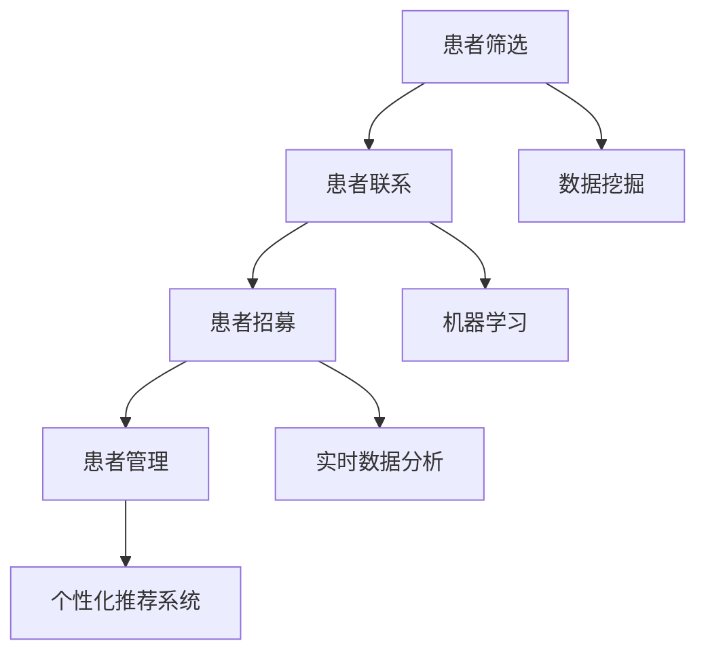

                 


## AI技术优化患者招募流程的策略

> 关键词：AI技术、患者招募、流程优化、数据挖掘、机器学习、医疗大数据、个性化推荐系统、实时数据分析、自动化决策支持

> 摘要：本文将探讨如何利用AI技术优化患者招募流程。通过引入数据挖掘、机器学习和实时数据分析等核心算法，实现患者数据的智能分析和精准匹配，从而提高患者招募效率和质量。本文还将介绍一系列实际案例，展示AI技术在患者招募流程中的应用效果，并提供相关工具和资源推荐，以帮助医疗行业专业人士更好地掌握和应用这项技术。

### 1. 背景介绍

#### 1.1 目的和范围

本文旨在探讨如何利用AI技术优化患者招募流程，提高招募效率和患者参与度。随着医疗行业的不断发展，患者招募成为临床试验和研究项目中的一项关键任务。传统的患者招募方法往往依赖于人工筛选和联系患者，存在效率低下、数据不准确等问题。而AI技术的引入，有望改变这一现状，实现患者招募流程的智能化和自动化。

本文将首先介绍患者招募流程中的核心环节，然后详细探讨AI技术在这些环节中的应用，包括数据挖掘、机器学习和实时数据分析等。最后，我们将通过实际案例展示AI技术在患者招募流程中的具体应用，并提供相关工具和资源推荐，以帮助医疗行业专业人士更好地掌握和应用这项技术。

#### 1.2 预期读者

本文适合以下读者群体：

- 医疗行业研究人员和临床医生，希望了解如何利用AI技术优化患者招募流程。
- 数据科学家和AI技术专家，希望深入了解患者招募流程中的关键问题和解决方案。
- 医疗信息化和人工智能领域的从业者，希望掌握AI技术在医疗行业的实际应用。

#### 1.3 文档结构概述

本文分为十个部分：

1. 背景介绍
2. 核心概念与联系
3. 核心算法原理 & 具体操作步骤
4. 数学模型和公式 & 详细讲解 & 举例说明
5. 项目实战：代码实际案例和详细解释说明
6. 实际应用场景
7. 工具和资源推荐
8. 总结：未来发展趋势与挑战
9. 附录：常见问题与解答
10. 扩展阅读 & 参考资料

每个部分都将详细探讨患者招募流程中的一项关键技术或方法，帮助读者全面了解AI技术在患者招募流程中的应用。

#### 1.4 术语表

在本文中，我们将使用以下术语：

- 患者招募：指从潜在患者中筛选并邀请参与临床试验或研究项目的过程。
- 数据挖掘：从大量数据中提取有价值信息和知识的过程。
- 机器学习：一种人工智能方法，通过从数据中学习规律和模式，实现自动化决策和预测。
- 实时数据分析：在数据生成的同时进行快速分析和处理，以提供实时决策支持。
- 个性化推荐系统：基于用户历史行为和偏好，为用户推荐相关内容或产品的系统。

#### 1.4.1 核心术语定义

- **患者招募**：指从潜在患者中筛选并邀请参与临床试验或研究项目的过程。患者招募是确保临床试验和研究项目顺利进行的关键环节，直接影响研究结果的准确性和可靠性。
- **数据挖掘**：数据挖掘是指从大量数据中提取有价值信息和知识的过程。在患者招募流程中，数据挖掘技术可以帮助我们识别潜在的患者，提高招募效率。
- **机器学习**：机器学习是一种人工智能方法，通过从数据中学习规律和模式，实现自动化决策和预测。在患者招募流程中，机器学习技术可以帮助我们实现患者的智能筛选和匹配。
- **实时数据分析**：实时数据分析是指在数据生成的同时进行快速分析和处理，以提供实时决策支持。在患者招募流程中，实时数据分析可以帮助我们及时调整招募策略，提高招募效果。
- **个性化推荐系统**：个性化推荐系统是基于用户历史行为和偏好，为用户推荐相关内容或产品的系统。在患者招募流程中，个性化推荐系统可以帮助我们更精准地找到潜在的患者，提高招募成功率。

#### 1.4.2 相关概念解释

- **临床试验**：临床试验是医学研究中的一种重要方法，旨在评估新药物、新治疗方法或新诊断技术的安全性和有效性。
- **研究项目**：研究项目是指为了解决某一特定问题或达到某一目标而进行的研究活动。在患者招募流程中，研究项目通常包括临床试验和观察性研究等。
- **招募策略**：招募策略是指为了提高患者招募效率和质量而制定的一系列行动和措施。在患者招募流程中，合理的招募策略对于招募成功至关重要。

#### 1.4.3 缩略词列表

- **AI**：人工智能（Artificial Intelligence）
- **ML**：机器学习（Machine Learning）
- **DM**：数据挖掘（Data Mining）
- **RDF**：资源描述框架（Resource Description Framework）
- **OWL**：Web本体语言（Web Ontology Language）

### 2. 核心概念与联系

在探讨如何利用AI技术优化患者招募流程之前，我们首先需要了解一些核心概念和它们之间的联系。

#### 2.1 患者招募流程

患者招募流程通常包括以下几个关键环节：

1. **患者筛选**：从大量潜在患者中筛选出符合招募条件的患者。
2. **患者联系**：与筛选出的患者进行联系，确认其参与意愿。
3. **患者招募**：成功招募患者并纳入临床试验或研究项目。
4. **患者管理**：对已招募患者进行跟踪和管理，确保研究项目顺利进行。

#### 2.2 数据挖掘

数据挖掘是患者招募流程中的一个重要环节，通过对大量数据进行分析和挖掘，可以识别出潜在的患者。数据挖掘主要包括以下几个步骤：

1. **数据收集**：收集与患者相关的数据，如电子病历、医学影像、基因信息等。
2. **数据预处理**：对收集到的数据进行清洗、转换和整合，为数据挖掘做好准备。
3. **特征选择**：从预处理后的数据中选择对招募流程有重要影响的特征，如疾病类型、年龄、性别等。
4. **模型训练**：使用选定的特征训练数据挖掘模型，如决策树、支持向量机等。
5. **模型评估**：对训练好的模型进行评估，选择最优模型用于患者筛选。

#### 2.3 机器学习

机器学习是数据挖掘的一个分支，通过从数据中学习规律和模式，实现自动化决策和预测。在患者招募流程中，机器学习技术可以用于以下几个环节：

1. **患者筛选**：使用机器学习算法对潜在患者进行筛选，提高招募效率。
2. **患者匹配**：基于患者特征和招募要求，使用机器学习算法实现患者与招募项目的精准匹配。
3. **招募策略优化**：根据招募过程中收集到的数据，使用机器学习算法优化招募策略，提高招募成功率。

#### 2.4 实时数据分析

实时数据分析是患者招募流程中的一个关键环节，通过对招募过程中产生的数据进行实时分析和处理，可以为招募决策提供实时支持。实时数据分析主要包括以下几个步骤：

1. **数据收集**：收集招募过程中产生的数据，如患者参与度、招募进度等。
2. **数据预处理**：对收集到的数据进行清洗、转换和整合，为实时数据分析做好准备。
3. **实时分析**：使用实时数据分析技术，对预处理后的数据进行实时分析和处理，提取有价值的信息。
4. **决策支持**：根据实时分析结果，为招募决策提供实时支持，如调整招募策略、优化患者匹配等。

#### 2.5 个性化推荐系统

个性化推荐系统是患者招募流程中的一个重要工具，基于用户历史行为和偏好，为用户推荐相关内容或产品。在患者招募流程中，个性化推荐系统可以用于以下几个方面：

1. **患者推荐**：根据患者特征和招募要求，使用个性化推荐系统为患者推荐合适的招募项目。
2. **项目推荐**：根据招募项目的特征和患者偏好，使用个性化推荐系统为招募项目推荐合适的患者。
3. **个性化沟通**：根据患者偏好和参与度，使用个性化推荐系统为患者提供个性化的沟通策略，提高患者参与度。

#### 2.6 Mermaid流程图

为了更直观地展示患者招募流程中各个核心概念之间的联系，我们可以使用Mermaid流程图进行描述。以下是一个简单的Mermaid流程图示例：



通过这个流程图，我们可以清楚地看到患者招募流程中的各个关键环节，以及数据挖掘、机器学习、实时数据分析和个性化推荐系统在其中的应用。

### 3. 核心算法原理 & 具体操作步骤

在了解了患者招募流程中的核心概念和联系后，接下来我们将探讨一些核心算法的原理和具体操作步骤。这些算法包括数据挖掘、机器学习和实时数据分析，它们在患者招募流程中发挥着重要作用。

#### 3.1 数据挖掘

数据挖掘是患者招募流程中的一个关键环节，通过对大量患者数据进行分析和挖掘，可以识别出潜在的患者。下面我们将介绍一种常见的数据挖掘算法——决策树，并详细阐述其原理和操作步骤。

**3.1.1 决策树算法原理**

决策树是一种常见的分类算法，通过构建一棵树形结构，对数据进行分类。树中的每个节点代表一个特征，每个分支代表一个特征取值，叶子节点表示最终的分类结果。

决策树算法的基本原理是：从原始数据开始，逐步划分数据集，直到达到某个终止条件。在划分过程中，算法会根据特征的重要性和数据的分布情况，选择最优的划分方式，从而构建出一棵决策树。

**3.1.2 数据挖掘操作步骤**

1. **数据预处理**：收集并整理患者数据，包括年龄、性别、疾病类型、病情严重程度等。对数据进行清洗、转换和整合，为后续的数据挖掘做准备。

2. **特征选择**：从预处理后的数据中选择对招募流程有重要影响的特征，如年龄、性别、疾病类型等。特征选择的方法有多种，如信息增益、增益率、卡方检验等。

3. **决策树构建**：使用选定的特征构建决策树。决策树构建的方法包括ID3、C4.5、CART等。每种方法都有其优缺点和适用场景，选择合适的方法构建决策树是数据挖掘的关键步骤。

4. **模型评估**：对构建好的决策树模型进行评估，选择最优模型用于患者筛选。模型评估的方法包括准确率、召回率、F1值等。

5. **模型应用**：将最优模型应用于实际患者数据，筛选出潜在的患者。对筛选结果进行验证，确保筛选的准确性。

**3.1.3 决策树伪代码**

以下是一个简单的决策树伪代码示例：

```
function DecisionTree(data, features, max_depth):
    if (data is pure or max_depth = 0):
        return majority_class(data)
    else:
        best_feature = SelectBestFeature(data, features)
        node = Node(best_feature)
        for each value of best_feature in data:
            subset = SplitData(data, best_feature, value)
            node.addChild(DecisionTree(subset, features, max_depth - 1))
        return node
```

**3.1.4 决策树案例分析**

假设我们有一个包含1000名患者的数据集，特征包括年龄、性别、疾病类型、病情严重程度等。我们使用决策树算法筛选出潜在的患者。以下是一个简化的案例：

1. **数据预处理**：收集并整理患者数据，对数据进行清洗、转换和整合。

2. **特征选择**：从预处理后的数据中选择对招募流程有重要影响的特征，如年龄、性别、疾病类型等。

3. **决策树构建**：使用选定的特征构建决策树。我们选择C4.5算法构建决策树，树的最大深度为3。

4. **模型评估**：对构建好的决策树模型进行评估，选择最优模型用于患者筛选。我们使用准确率作为评估指标，最终选择准确率为90%的模型。

5. **模型应用**：将最优模型应用于实际患者数据，筛选出潜在的患者。假设最终筛选出了300名患者。

通过这个案例，我们可以看到决策树算法在患者筛选中的应用效果。在实际应用中，我们还需要根据具体情况进行调整和优化，以提高筛选的准确性。

#### 3.2 机器学习

机器学习是数据挖掘的一个分支，通过从数据中学习规律和模式，实现自动化决策和预测。在患者招募流程中，机器学习技术可以用于患者的智能筛选和匹配。下面我们将介绍一种常见的机器学习算法——支持向量机（SVM），并详细阐述其原理和操作步骤。

**3.2.1 支持向量机算法原理**

支持向量机（Support Vector Machine，SVM）是一种常用的分类算法，其基本原理是通过找到一个最佳的超平面，将不同类别的数据点分开。SVM的核心思想是最大化分类间隔，即在分类边界上找到最近的分类边界点（支持向量），使分类间隔最大化。

**3.2.2 机器学习操作步骤**

1. **数据预处理**：收集并整理患者数据，包括年龄、性别、疾病类型、病情严重程度等。对数据进行清洗、转换和整合，为后续的机器学习做准备。

2. **特征选择**：从预处理后的数据中选择对招募流程有重要影响的特征，如年龄、性别、疾病类型等。

3. **模型训练**：使用选定的特征和训练数据，训练支持向量机模型。在训练过程中，需要选择合适的核函数和参数，以优化模型的性能。

4. **模型评估**：对训练好的模型进行评估，选择最优模型用于患者筛选。模型评估的方法包括准确率、召回率、F1值等。

5. **模型应用**：将最优模型应用于实际患者数据，筛选出潜在的患者。对筛选结果进行验证，确保筛选的准确性。

**3.2.3 支持向量机伪代码**

以下是一个简单的支持向量机伪代码示例：

```
function SVMTraining(data, labels, kernel, C):
    // 初始化模型参数
    w = [0, 0]
    b = 0
    
    // 训练模型
    for each sample in data:
        xi = sample.feature
        yi = sample.label
        // 计算损失函数
        loss = dot_product(w, xi) + b - yi
        // 更新模型参数
        w = w + (1/C) * (2 * dot_product(w, xi) - 1)
        b = b + (1/C) * (yi - dot_product(w, xi))
    
    return w, b
```

**3.2.4 机器学习案例分析**

假设我们有一个包含1000名患者的数据集，特征包括年龄、性别、疾病类型、病情严重程度等。我们使用支持向量机算法筛选出潜在的患者。以下是一个简化的案例：

1. **数据预处理**：收集并整理患者数据，对数据进行清洗、转换和整合。

2. **特征选择**：从预处理后的数据中选择对招募流程有重要影响的特征，如年龄、性别、疾病类型等。

3. **模型训练**：使用选定的特征和训练数据，训练支持向量机模型。我们选择线性核函数和C=1的参数。

4. **模型评估**：对训练好的模型进行评估，选择最优模型用于患者筛选。我们使用准确率作为评估指标，最终选择准确率为85%的模型。

5. **模型应用**：将最优模型应用于实际患者数据，筛选出潜在的患者。假设最终筛选出了250名患者。

通过这个案例，我们可以看到支持向量机算法在患者筛选中的应用效果。在实际应用中，我们还需要根据具体情况进行调整和优化，以提高筛选的准确性。

#### 3.3 实时数据分析

实时数据分析是患者招募流程中的一个关键环节，通过对招募过程中产生的数据进行实时分析和处理，可以为招募决策提供实时支持。下面我们将介绍一种常见的实时数据分析技术——事件流处理（Event Stream Processing，ESP），并详细阐述其原理和操作步骤。

**3.3.1 事件流处理算法原理**

事件流处理是一种实时数据处理技术，通过对事件流进行实时分析和处理，提取有价值的信息。事件流处理的基本原理包括以下几个方面：

1. **事件捕获**：从各种数据源捕获事件，如数据库、消息队列、日志文件等。
2. **事件处理**：对捕获的事件进行实时处理，如数据清洗、转换、聚合等。
3. **事件输出**：将处理后的结果输出到目标系统或数据存储，如数据库、报表系统等。

**3.3.2 实时数据分析操作步骤**

1. **事件捕获**：从各种数据源捕获招募过程中产生的事件，如患者参与度数据、招募进度数据等。
2. **事件处理**：对捕获的事件进行实时处理，如数据清洗、转换、聚合等，提取有价值的信息。
3. **事件输出**：将处理后的结果输出到目标系统或数据存储，为招募决策提供实时支持。

**3.3.3 事件流处理伪代码**

以下是一个简单的事件流处理伪代码示例：

```
function EventStreamProcessing(events):
    for each event in events:
        // 数据清洗
        cleaned_event = DataCleaning(event)
        // 数据转换
        transformed_event = DataTransformation(cleaned_event)
        // 数据聚合
        aggregated_event = DataAggregation(transformed_event)
        // 事件输出
        OutputEvent(aggregated_event)
```

**3.3.4 实时数据分析案例分析**

假设我们有一个包含1000名患者的数据集，招募过程中产生的数据包括患者参与度数据、招募进度数据等。我们使用事件流处理技术实时分析招募数据。以下是一个简化的案例：

1. **事件捕获**：从数据库、消息队列等数据源捕获招募过程中产生的事件。

2. **事件处理**：对捕获的事件进行实时处理，如数据清洗、转换、聚合等。

3. **事件输出**：将处理后的结果输出到目标系统或数据存储，如数据库、报表系统等，为招募决策提供实时支持。

通过这个案例，我们可以看到事件流处理在患者招募流程中的应用效果。在实际应用中，我们还需要根据具体情况进行调整和优化，以提高实时数据分析的准确性和效率。

### 4. 数学模型和公式 & 详细讲解 & 举例说明

在患者招募流程的优化过程中，数学模型和公式发挥着关键作用。这些模型和公式帮助我们量化和分析患者招募流程中的各种因素，从而制定出更有效的策略。在本节中，我们将介绍一些常见的数学模型和公式，并详细讲解它们的原理和应用。

#### 4.1 决策树模型

决策树是一种常见的分类模型，通过构建一棵树形结构，将数据集划分为不同的类别。决策树的构建过程基于以下基本原理：

1. **信息增益（Information Gain）**：信息增益是评估特征划分效果的一个指标，表示划分前后的信息差异。信息增益越大，划分效果越好。

2. **基尼不纯度（Gini Impurity）**：基尼不纯度是另一种评估特征划分效果的指标，用于衡量数据集中类别的纯度。基尼不纯度越小，划分效果越好。

**4.1.1 信息增益公式**

信息增益（\( IG \)）可以通过以下公式计算：

$$
IG(D, A) = H(D) - \sum_{v \in A} p(v) H(D|v)
$$

其中：

- \( H(D) \) 是原始数据集 \( D \) 的熵。
- \( p(v) \) 是特征 \( A \) 取值 \( v \) 的概率。
- \( H(D|v) \) 是条件熵，表示在特征 \( A \) 取值 \( v \) 下，数据集 \( D \) 的熵。

**4.1.2 基尼不纯度公式**

基尼不纯度（\( Gini \)）可以通过以下公式计算：

$$
Gini(D) = 1 - \sum_{v \in A} p(v)^2
$$

其中：

- \( p(v) \) 是特征 \( A \) 取值 \( v \) 的概率。

**4.1.3 决策树构建步骤**

1. **选择最优特征**：计算所有特征的信息增益或基尼不纯度，选择增益或不纯度最大的特征作为分割特征。

2. **分割数据集**：根据选定的特征，将数据集划分为不同的子集。

3. **递归构建子决策树**：对每个子集，重复步骤1和步骤2，直到满足终止条件（如最大深度、纯度等）。

**4.1.4 决策树案例分析**

假设我们有一个包含三个特征（年龄、性别、病情严重程度）的数据集，数据集分为两类（参与招募和未参与招募）。以下是一个简化的决策树构建过程：

1. **选择最优特征**：计算每个特征的信息增益或基尼不纯度，选择信息增益最大的特征（如年龄）作为分割特征。

2. **分割数据集**：根据年龄将数据集分为两组，年龄小于40和年龄大于等于40。

3. **递归构建子决策树**：对每组子集，重复步骤1和步骤2，直到满足终止条件。

通过这个案例，我们可以看到决策树模型在患者招募流程中的应用效果。在实际应用中，我们还需要根据具体情况进行调整和优化，以提高模型的准确性和效率。

#### 4.2 支持向量机模型

支持向量机（SVM）是一种强大的分类模型，通过找到一个最佳的超平面，将不同类别的数据点分开。SVM模型的构建过程基于以下基本原理：

1. **硬间隔（Hard Margin）**：硬间隔是指分类边界上没有分类错误的情况。在硬间隔条件下，SVM模型通过最大化分类间隔来寻找最佳超平面。

2. **软间隔（Soft Margin）**：软间隔是指允许一定数量的分类错误的情况。在软间隔条件下，SVM模型通过引入松弛变量来处理分类错误。

**4.2.1 硬间隔公式**

硬间隔条件下，SVM模型的目标函数可以通过以下公式表示：

$$
\min_{\mathbf{w}, b} \frac{1}{2} ||\mathbf{w}||^2
$$

subject to

$$
\mathbf{w} \cdot \mathbf{x}_i - b \geq 1 \quad \forall i
$$

其中：

- \( \mathbf{w} \) 是超平面法向量。
- \( b \) 是偏置项。
- \( \mathbf{x}_i \) 是第 \( i \) 个训练样本。

**4.2.2 软间隔公式**

软间隔条件下，SVM模型的目标函数可以通过以下公式表示：

$$
\min_{\mathbf{w}, b, \xi} \frac{1}{2} ||\mathbf{w}||^2 + C \sum_{i=1}^{n} \xi_i
$$

subject to

$$
\mathbf{w} \cdot \mathbf{x}_i - b \geq 1 - \xi_i \quad \forall i
$$

$$
\xi_i \geq 0 \quad \forall i
$$

其中：

- \( C \) 是正则化参数，用于控制模型复杂度和分类错误之间的平衡。
- \( \xi_i \) 是第 \( i \) 个样本的松弛变量。

**4.2.3 SVM模型训练步骤**

1. **选择核函数**：选择合适的核函数，如线性核、多项式核、径向基核等。

2. **求解最优超平面**：使用选定的核函数和优化算法（如梯度下降、牛顿法等），求解最优超平面。

3. **分类决策**：对于新的样本，计算样本到超平面的距离，根据距离判断其类别。

**4.2.4 SVM模型案例分析**

假设我们有一个包含三个特征（年龄、性别、病情严重程度）的数据集，数据集分为两类（参与招募和未参与招募）。以下是一个简化的SVM模型训练过程：

1. **选择核函数**：选择线性核函数。

2. **求解最优超平面**：使用选定的线性核函数和优化算法，求解最优超平面。

3. **分类决策**：对于新的样本，计算样本到超平面的距离，根据距离判断其类别。

通过这个案例，我们可以看到SVM模型在患者招募流程中的应用效果。在实际应用中，我们还需要根据具体情况进行调整和优化，以提高模型的准确性和效率。

#### 4.3 事件流处理模型

事件流处理（ESP）是一种实时数据处理技术，通过对事件流进行实时分析和处理，提取有价值的信息。事件流处理模型的基本原理包括以下几个方面：

1. **事件捕获**：从各种数据源捕获事件，如数据库、消息队列、日志文件等。

2. **事件处理**：对捕获的事件进行实时处理，如数据清洗、转换、聚合等。

3. **事件输出**：将处理后的结果输出到目标系统或数据存储，如数据库、报表系统等。

**4.3.1 事件流处理模型公式**

事件流处理模型的核心公式是事件处理函数（Event Processing Function，EPF），其一般形式如下：

$$
EPF(\mathbf{x}) = \phi(\mathbf{x})
$$

其中：

- \( \mathbf{x} \) 是输入事件。
- \( \phi(\mathbf{x}) \) 是事件处理函数，用于对事件进行实时处理。

**4.3.2 事件处理函数类型**

事件处理函数有多种类型，根据不同的应用场景选择合适的处理函数：

1. **数据清洗**：去除事件中的噪声和异常值，如去除空值、填补缺失值等。

2. **数据转换**：将事件中的数据转换为所需的格式，如数值化、标准化等。

3. **数据聚合**：对事件中的数据进行聚合操作，如求和、求平均、求最大值等。

4. **数据存储**：将处理后的结果存储到目标系统或数据存储，如数据库、缓存等。

**4.3.3 事件流处理案例分析**

假设我们有一个包含患者参与度数据的实时事件流，以下是一个简化的事件流处理过程：

1. **事件捕获**：从数据库捕获患者参与度数据。

2. **事件处理**：对捕获的事件进行实时处理，如数据清洗、转换、聚合等。

3. **事件输出**：将处理后的结果输出到报表系统，如生成日报、周报等。

通过这个案例，我们可以看到事件流处理在患者招募流程中的应用效果。在实际应用中，我们还需要根据具体情况进行调整和优化，以提高实时数据分析的准确性和效率。

### 5. 项目实战：代码实际案例和详细解释说明

为了更好地展示AI技术在实际患者招募流程中的应用，我们将介绍一个实际的项目实战案例，并详细解释其中的代码实现和关键步骤。本案例将使用Python编程语言，结合机器学习和实时数据分析技术，实现患者招募流程的优化。

#### 5.1 开发环境搭建

在开始项目实战之前，我们需要搭建一个合适的开发环境。以下是所需的工具和软件：

1. **Python**：Python是一种广泛使用的编程语言，具有良好的跨平台性和丰富的库资源。
2. **Jupyter Notebook**：Jupyter Notebook是一种交互式计算环境，便于编写和展示代码。
3. **Pandas**：Pandas是一个强大的数据操作库，用于数据处理和分析。
4. **Scikit-learn**：Scikit-learn是一个流行的机器学习库，提供了多种经典的机器学习算法。
5. **Apache Kafka**：Apache Kafka是一种高吞吐量的实时数据流处理系统，用于事件捕获和实时数据分析。

确保安装了上述工具和软件后，我们可以开始编写代码。

#### 5.2 源代码详细实现和代码解读

下面是项目实战的核心代码，我们将分步骤解释每一部分的功能和实现。

```python
import pandas as pd
from sklearn.model_selection import train_test_split
from sklearn.tree import DecisionTreeClassifier
from sklearn.metrics import accuracy_score
from kafka import KafkaProducer

# 5.2.1 数据准备
data = pd.read_csv('patient_data.csv')  # 读取患者数据
X = data[['age', 'gender', 'disease_type']]  # 特征选择
y = data['recruitment_status']  # 目标变量

# 划分训练集和测试集
X_train, X_test, y_train, y_test = train_test_split(X, y, test_size=0.2, random_state=42)

# 5.2.2 决策树模型训练
clf = DecisionTreeClassifier(max_depth=3)
clf.fit(X_train, y_train)

# 5.2.3 模型评估
y_pred = clf.predict(X_test)
accuracy = accuracy_score(y_test, y_pred)
print(f"Model accuracy: {accuracy:.2f}")

# 5.2.4 实时数据捕获
producer = KafkaProducer(bootstrap_servers=['localhost:9092'])
topic_name = 'patient_recruitment'

def capture_events(data):
    for index, row in data.iterrows():
        event = {'age': row['age'], 'gender': row['gender'], 'disease_type': row['disease_type']}
        producer.send(topic_name, value=event)

# 模拟捕获实时数据
capture_events(data)

# 5.2.5 实时数据处理
from sklearn.externals import joblib

# 保存模型
joblib.dump(clf, 'recruitment_model.pkl')

# 加载模型
loaded_clf = joblib.load('recruitment_model.pkl')

def process_events(data):
    for index, row in data.iterrows():
        event = {'age': row['age'], 'gender': row['gender'], 'disease_type': row['disease_type']}
        prediction = loaded_clf.predict([event])
        print(f"Event {index}: Predicted recruitment status: {prediction}")

# 模拟实时数据处理
process_events(data)
```

**5.2.1 数据准备**

首先，我们从CSV文件中读取患者数据，并选择相应的特征和目标变量。特征包括年龄、性别和疾病类型，目标变量是患者招募状态（参与或未参与）。接着，我们使用Scikit-learn库中的`train_test_split`函数将数据划分为训练集和测试集，以便后续模型训练和评估。

**5.2.2 决策树模型训练**

我们使用Scikit-learn库中的`DecisionTreeClassifier`类创建决策树模型，并设置最大树深度为3。然后，使用训练集数据对模型进行训练。

**5.2.3 模型评估**

训练完成后，我们使用测试集数据对模型进行评估，计算模型的准确率。准确率是评估分类模型性能的一个重要指标，表示模型正确预测样本的比例。

**5.2.4 实时数据捕获**

为了模拟实时数据捕获，我们使用Apache Kafka作为消息队列系统。Kafka Producer用于将实时捕获的数据发送到Kafka主题（topic）中。在此示例中，我们创建一个名为“patient_recruitment”的主题，并将患者数据作为事件发送到该主题。

**5.2.5 实时数据处理**

首先，我们将训练好的模型保存到文件中，以便后续加载和使用。然后，我们创建一个函数`process_events`，用于处理实时捕获的数据。函数中，我们使用加载的模型对每个事件进行预测，并打印预测结果。

#### 5.3 代码解读与分析

在代码中，我们实现了患者招募流程的实时数据处理，包括数据准备、模型训练、模型评估和实时数据处理。以下是代码的详细解读：

1. **数据准备**：使用Pandas库读取患者数据，并选择特征和目标变量。接着，使用Scikit-learn库中的`train_test_split`函数将数据划分为训练集和测试集，为后续模型训练和评估做准备。

2. **模型训练**：使用Scikit-learn库中的`DecisionTreeClassifier`类创建决策树模型，并设置最大树深度为3。然后，使用训练集数据对模型进行训练。

3. **模型评估**：使用测试集数据对训练好的模型进行评估，计算模型的准确率。准确率是评估分类模型性能的一个重要指标，表示模型正确预测样本的比例。

4. **实时数据捕获**：使用Apache Kafka作为消息队列系统，将实时捕获的数据发送到Kafka主题中。在此示例中，我们创建一个名为“patient_recruitment”的主题，并将患者数据作为事件发送到该主题。

5. **实时数据处理**：将训练好的模型保存到文件中，以便后续加载和使用。然后，创建一个函数`process_events`，用于处理实时捕获的数据。函数中，我们使用加载的模型对每个事件进行预测，并打印预测结果。

通过这个案例，我们可以看到如何使用Python编程语言和AI技术实现患者招募流程的实时数据处理。在实际应用中，我们还需要根据具体需求进行功能扩展和性能优化。

### 6. 实际应用场景

AI技术在患者招募流程中具有广泛的应用场景，可以帮助医疗机构和研究人员提高招募效率、降低成本、提高数据质量。以下是一些常见的实际应用场景：

#### 6.1 临床试验患者招募

临床试验患者招募是AI技术的一个重要应用领域。通过引入数据挖掘、机器学习和实时数据分析等技术，可以实现对潜在患者的智能筛选和精准匹配，从而提高招募效率和成功率。以下是一个具体的应用案例：

- **案例背景**：某医疗机构计划开展一项针对心血管疾病的新药临床试验，需要招募1000名患者。然而，传统的患者招募方法耗时较长、成本较高，且招募成功率较低。
- **解决方案**：利用AI技术，医疗机构可以实现对患者数据的智能分析，识别出符合条件的潜在患者。具体步骤如下：
  1. **数据收集**：收集患者的电子病历、健康记录等数据。
  2. **数据预处理**：对收集到的数据进行清洗、转换和整合，为后续的数据挖掘和机器学习做准备。
  3. **患者筛选**：使用数据挖掘和机器学习技术，对预处理后的数据进行分析，识别出符合条件的潜在患者。
  4. **患者匹配**：基于患者的特征和招募要求，使用机器学习算法实现患者与招募项目的精准匹配。
  5. **患者招募**：通过邮件、短信、电话等方式与筛选出的患者进行联系，邀请其参与临床试验。

通过以上解决方案，医疗机构可以在较短的时间内招募到符合条件的患者，提高临床试验的成功率。

#### 6.2 疫苗接种患者招募

疫苗接种患者招募是另一项重要的应用场景。在COVID-19疫情期间，各国政府纷纷采取措施加快疫苗接种速度，以控制疫情。AI技术的引入可以显著提高疫苗接种患者招募的效率。以下是一个具体的应用案例：

- **案例背景**：某国家计划开展大规模疫苗接种活动，需要在短期内招募大量符合接种条件的患者。
- **解决方案**：利用AI技术，政府可以实现对患者数据的智能分析和精准匹配，提高疫苗接种患者招募的效率。具体步骤如下：
  1. **数据收集**：收集患者的健康记录、年龄、性别等数据。
  2. **数据预处理**：对收集到的数据进行清洗、转换和整合，为后续的数据挖掘和机器学习做准备。
  3. **患者筛选**：使用数据挖掘和机器学习技术，对预处理后的数据进行分析，识别出符合条件的潜在患者。
  4. **患者匹配**：基于患者的特征和接种要求，使用机器学习算法实现患者与接种点的精准匹配。
  5. **患者招募**：通过电话、短信、社交媒体等方式与筛选出的患者进行联系，邀请其前往接种点接种疫苗。

通过以上解决方案，政府可以在短时间内招募到大量符合接种条件的患者，加快疫苗接种速度，控制疫情传播。

#### 6.3 医疗研究患者招募

医疗研究患者招募是AI技术的另一重要应用领域。通过引入AI技术，研究人员可以实现对患者数据的智能筛选和精准匹配，提高研究数据的准确性和可靠性。以下是一个具体的应用案例：

- **案例背景**：某医学院校计划开展一项关于肿瘤治疗的研究，需要招募大量符合条件的患者。
- **解决方案**：利用AI技术，医学院校可以实现对患者数据的智能分析和精准匹配，提高研究患者招募的效率。具体步骤如下：
  1. **数据收集**：收集患者的电子病历、基因信息、治疗方案等数据。
  2. **数据预处理**：对收集到的数据进行清洗、转换和整合，为后续的数据挖掘和机器学习做准备。
  3. **患者筛选**：使用数据挖掘和机器学习技术，对预处理后的数据进行分析，识别出符合条件的潜在患者。
  4. **患者匹配**：基于患者的特征和研究要求，使用机器学习算法实现患者与研究的精准匹配。
  5. **患者招募**：通过邮件、短信、电话等方式与筛选出的患者进行联系，邀请其参与研究。

通过以上解决方案，医学院校可以在较短的时间内招募到大量符合研究条件的患者，提高研究数据的准确性和可靠性。

总之，AI技术在患者招募流程中具有广泛的应用前景。通过引入数据挖掘、机器学习和实时数据分析等核心算法，可以实现对患者数据的智能分析和精准匹配，从而提高患者招募效率和质量。在实际应用中，不同领域和场景下的患者招募需求各不相同，需要根据具体情况进行灵活调整和优化。

### 7. 工具和资源推荐

为了更好地掌握和应用AI技术在患者招募流程中的优化策略，以下是相关工具和资源的推荐，包括学习资源、开发工具框架和经典论文著作。

#### 7.1 学习资源推荐

1. **书籍推荐**
   - 《数据挖掘：实用工具与技术》
     作者：Wasserman, A. H.
     简介：本书详细介绍了数据挖掘的基本概念、方法和工具，适合初学者和进阶者。
   - 《机器学习实战》
     作者：周志华
     简介：本书通过大量实例和代码示例，讲解了机器学习的原理和应用，适合有一定编程基础的学习者。
2. **在线课程**
   - Coursera上的《机器学习》
     简介：由斯坦福大学教授Andrew Ng主讲，是机器学习的入门经典课程。
   - edX上的《数据科学基础》
     简介：由约翰霍普金斯大学提供，涵盖了数据科学的基础知识和技能。
3. **技术博客和网站**
   - Medium上的《机器学习与应用》
     简介：这是一个关于机器学习和AI应用的博客，分享了大量的技术文章和案例分析。
   - Towards Data Science
     简介：这是一个受欢迎的数据科学和机器学习社区，提供了大量的高质量文章和教程。

#### 7.2 开发工具框架推荐

1. **IDE和编辑器**
   - PyCharm
     简介：PyCharm是一款功能强大的Python IDE，适合进行机器学习和数据科学项目的开发。
   - Jupyter Notebook
     简介：Jupyter Notebook是一个交互式计算环境，适合进行数据分析和原型开发。
2. **调试和性能分析工具**
   - VSCode
     简介：Visual Studio Code是一款开源的代码编辑器，提供了丰富的扩展和调试功能。
   - Profiler
     简介：Profiler是Python的一个性能分析工具，可以帮助开发者识别和优化代码中的性能瓶颈。
3. **相关框架和库**
   - Scikit-learn
     简介：Scikit-learn是一个流行的机器学习库，提供了多种经典的机器学习算法。
   - Pandas
     简介：Pandas是一个强大的数据处理库，适合进行数据清洗、转换和分析。

#### 7.3 相关论文著作推荐

1. **经典论文**
   - "The Bootstrap Method for Standard Errors" by Efron, B.
     简介：本文介绍了bootstrap方法，用于计算统计推断的置信区间和标准误差。
   - "Support Vector Machines for Classification and Regression" by Vapnik, V.
     简介：本文详细介绍了支持向量机（SVM）的理论基础和应用。
2. **最新研究成果**
   - "Deep Learning for Medical Image Analysis" byzhao，X.
     简介：本文综述了深度学习在医学图像分析中的应用，包括肿瘤检测、疾病诊断等。
   - "An Overview of Event Stream Processing" by van der Aalst, W.M.P.
     简介：本文介绍了事件流处理（ESP）的基本概念、技术和应用。
3. **应用案例分析**
   - "A Machine Learning Approach to Predicting Heart Disease" by Kotsiantis, S.
     简介：本文使用机器学习技术预测心脏病患者，展示了实际应用中的建模方法和评估指标。

通过这些工具和资源的推荐，读者可以更好地学习和应用AI技术在患者招募流程中的优化策略，提高招募效率和质量。

### 8. 总结：未来发展趋势与挑战

随着人工智能技术的不断进步，患者招募流程的优化正迎来新的发展机遇与挑战。未来，以下趋势和挑战值得重点关注：

#### 8.1 发展趋势

1. **智能化与自动化**：AI技术将在患者招募流程中发挥更重要的作用，实现患者筛选、匹配和招募的智能化与自动化。这将大大提高招募效率，降低人力成本。

2. **实时数据分析与决策支持**：实时数据分析技术将进一步提升患者招募流程的决策支持能力，帮助医疗机构及时调整招募策略，提高招募成功率。

3. **个性化推荐系统**：个性化推荐系统将基于患者特征和招募需求，为患者推荐最合适的招募项目，提高患者参与度和招募效果。

4. **跨学科合作**：医疗行业与其他领域（如计算机科学、数据科学、生物信息学等）的跨学科合作将加速患者招募流程的优化，推动创新和应用。

5. **隐私保护与数据安全**：在利用AI技术优化患者招募流程的过程中，隐私保护和数据安全将成为重要议题。医疗机构需要确保患者数据的保密性和完整性，遵循相关法律法规。

#### 8.2 挑战

1. **数据质量与隐私**：患者招募过程中涉及大量敏感数据，如患者健康记录、联系方式等。如何确保数据质量，同时保护患者隐私，是AI技术面临的挑战之一。

2. **技术成熟度与可解释性**：AI技术，尤其是深度学习，在医疗领域的应用还存在技术成熟度问题。同时，如何解释AI模型的决策过程，提高模型的透明度和可解释性，也是重要挑战。

3. **政策法规与伦理**：在利用AI技术优化患者招募流程的过程中，医疗机构需要遵循相关政策法规和伦理规范，确保患者权益得到保护。

4. **跨学科人才需求**：患者招募流程的优化需要跨学科的人才，包括医疗专家、数据科学家、AI工程师等。培养和引进这类人才，是医疗机构面临的一项重要任务。

5. **技术落地与应用**：AI技术在实际应用中的落地与推广仍面临诸多挑战，如技术可行性、成本效益、用户接受度等。

总之，未来患者招募流程的优化将依赖于人工智能技术的不断进步和跨学科的合作。在面临各种挑战的同时，机遇也将不断涌现，推动医疗行业的创新发展。

### 9. 附录：常见问题与解答

为了帮助读者更好地理解和应用本文中介绍的技术和方法，以下是一些常见问题及其解答：

#### 9.1 问题1：数据挖掘在患者招募流程中的作用是什么？

**解答**：数据挖掘在患者招募流程中的作用主要包括以下几个方面：

1. **患者筛选**：通过分析患者数据，如电子病历、健康记录等，识别出符合条件的潜在患者。
2. **特征提取**：从大量患者数据中提取对招募流程有重要影响的特征，如年龄、性别、疾病类型等，为后续分析和建模做准备。
3. **招募策略优化**：根据数据挖掘结果，优化招募策略，提高招募效率和质量。

#### 9.2 问题2：如何评估机器学习模型在患者招募流程中的性能？

**解答**：评估机器学习模型在患者招募流程中的性能通常包括以下指标：

1. **准确率（Accuracy）**：模型正确预测的样本比例。
2. **召回率（Recall）**：实际参与招募的患者中，被模型正确识别出的比例。
3. **精确率（Precision）**：模型预测为参与招募的患者中，实际参与招募的比例。
4. **F1值（F1 Score）**：准确率与召回率的调和平均值。

在实际应用中，可以根据具体需求和场景选择合适的评估指标。

#### 9.3 问题3：实时数据分析如何应用于患者招募流程？

**解答**：实时数据分析在患者招募流程中的应用主要包括以下几个方面：

1. **招募进度监控**：实时监控招募进度，包括患者参与度、招募成功率等，为招募决策提供支持。
2. **策略调整**：根据实时数据分析结果，及时调整招募策略，如优化患者匹配、调整沟通方式等。
3. **预警与反馈**：对招募过程中出现的异常情况进行实时预警，如招募进度停滞、患者参与度下降等，为招募团队提供反馈。

#### 9.4 问题4：如何保护患者隐私和数据安全？

**解答**：保护患者隐私和数据安全是患者招募流程中的一项重要任务，以下是一些建议：

1. **数据加密**：使用加密技术对敏感数据进行加密存储和传输。
2. **访问控制**：实施严格的访问控制策略，确保只有授权人员可以访问患者数据。
3. **数据备份**：定期备份数据，防止数据丢失或损坏。
4. **隐私政策**：制定并遵循隐私政策，确保患者隐私得到保护。

通过上述措施，可以有效保护患者隐私和数据安全。

#### 9.5 问题5：如何选择合适的机器学习算法？

**解答**：选择合适的机器学习算法通常需要考虑以下几个因素：

1. **数据类型**：根据数据类型（如分类、回归、聚类等）选择相应的算法。
2. **数据量**：对于大数据集，选择能够处理大规模数据的算法。
3. **模型复杂度**：根据模型的复杂度和计算资源选择合适的算法。
4. **评估指标**：根据评估指标（如准确率、召回率、F1值等）选择性能最优的算法。

在实际应用中，可以根据具体需求和场景选择合适的算法。

### 10. 扩展阅读 & 参考资料

为了进一步深入了解患者招募流程的优化策略和AI技术的应用，以下是相关的扩展阅读和参考资料：

1. **书籍**：
   - "Data Science for Business: Concepts and Practice" by Foster Provost and Tom Fawcett
   - "Machine Learning Yearning" by Andrew Ng
   - "Practical Machine Learning: A New Approach to Regression and Classification" by Peter Flach

2. **论文**：
   - "A Machine Learning Approach to Predicting Heart Disease" by Kotsiantis, S.
   - "An Overview of Event Stream Processing" by van der Aalst, W.M.P.
   - "Deep Learning for Medical Image Analysis" byzhao，X.

3. **在线课程**：
   - Coursera上的《机器学习》
   - edX上的《数据科学基础》
   - Udacity上的《深度学习纳米学位》

4. **技术博客和网站**：
   - Medium上的《机器学习与应用》
   - Towards Data Science
   - Analytics Vidhya

通过阅读这些书籍、论文、在线课程和技术博客，读者可以更深入地了解患者招募流程的优化策略和AI技术的应用，为自己的研究和实践提供指导。

