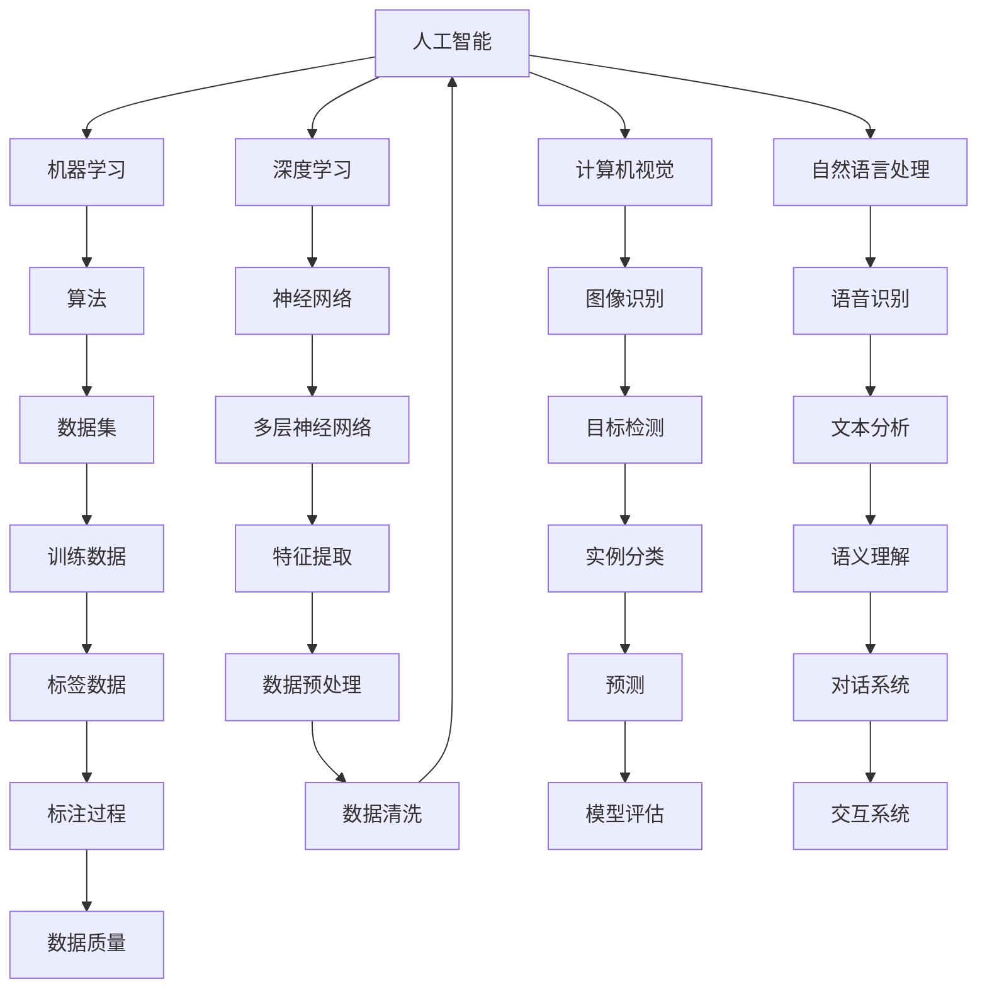
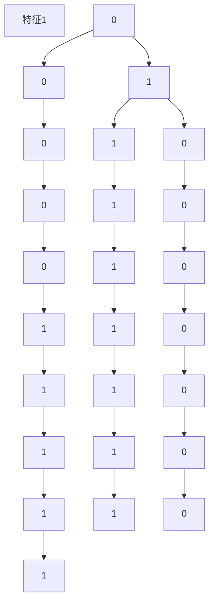

                 

## AI技术在不同领域的应用

> 关键词：人工智能，应用领域，技术趋势，案例分析

> 摘要：本文将深入探讨人工智能（AI）技术在各个领域的应用，包括医疗、金融、教育、制造业和自动驾驶等。通过详细分析AI技术在这些领域的实际案例，本文旨在揭示AI技术如何改变传统行业，提高效率和创新能力。此外，还将探讨AI技术的未来发展趋势和面临的挑战，为读者提供全面的技术视野和思考方向。

在当前科技飞速发展的时代，人工智能（AI）已经成为推动社会进步的重要力量。从自动化生产线到个性化医疗诊断，AI技术正以前所未有的速度渗透到各行各业，极大地改变着我们的生活方式和工作模式。本文将围绕AI技术在不同领域的应用，进行系统性的分析和讨论，以期为读者提供一个全面了解AI技术的视角。

## 1. 背景介绍

### 1.1 目的和范围

本文旨在通过深入探讨人工智能技术在不同领域的应用，帮助读者理解AI技术的核心价值和发展趋势。具体来说，本文将涵盖以下内容：

- 医疗领域：AI技术在诊断、治疗和个性化医疗中的应用。
- 金融领域：AI技术在风险评估、欺诈检测和投资策略中的应用。
- 教育领域：AI技术在个性化学习、课程设计和教育评估中的应用。
- 制造业：AI技术在智能制造、设备维护和供应链管理中的应用。
- 自动驾驶：AI技术在自动驾驶汽车、无人机和智能交通系统中的应用。

通过上述内容的阐述，本文希望能够为读者提供一个全面、系统的AI技术应用图景，激发读者对AI技术的研究兴趣和应用潜力。

### 1.2 预期读者

本文预期读者包括：

- 计算机科学和人工智能专业的学生和研究人员。
- 对AI技术有浓厚兴趣的科技爱好者和创业者。
- 在传统行业中使用AI技术的从业者和管理者。
- 任何对AI技术发展趋势和应用场景感兴趣的读者。

无论您是AI领域的初学者还是有丰富经验的专业人士，本文都将为您提供有价值的见解和思考。

### 1.3 文档结构概述

本文的结构如下：

- 引言：介绍AI技术背景及本文目的。
- 1. 背景介绍：详细说明本文的目的、预期读者和文档结构。
- 2. 核心概念与联系：探讨AI技术的核心概念和架构。
- 3. 核心算法原理 & 具体操作步骤：深入讲解AI技术的工作原理和操作步骤。
- 4. 数学模型和公式 & 详细讲解 & 举例说明：介绍AI技术的数学模型和实际应用。
- 5. 项目实战：代码实际案例和详细解释说明。
- 6. 实际应用场景：分析AI技术在各个领域的应用。
- 7. 工具和资源推荐：推荐相关学习资源和工具。
- 8. 总结：未来发展趋势与挑战。
- 9. 附录：常见问题与解答。
- 10. 扩展阅读 & 参考资料：提供进一步学习的参考资料。

### 1.4 术语表

#### 1.4.1 核心术语定义

- 人工智能（AI）：模拟人类智能的计算机技术。
- 机器学习（ML）：一种AI方法，通过数据和算法让计算机自动学习。
- 深度学习（DL）：一种机器学习技术，通过多层神经网络进行数据建模。
- 自然语言处理（NLP）：使计算机理解和生成人类语言的技术。
- 计算机视觉（CV）：使计算机理解和解释视觉信息的技术。

#### 1.4.2 相关概念解释

- 神经网络：一种模仿生物神经系统的计算模型。
- 算法：解决问题的步骤和策略。
- 数据集：用于训练和测试模型的数值集合。
- 标签：用于分类数据的标记。

#### 1.4.3 缩略词列表

- AI：人工智能
- ML：机器学习
- DL：深度学习
- NLP：自然语言处理
- CV：计算机视觉

## 2. 核心概念与联系

### 2.1 核心概念

在探讨AI技术在不同领域的应用之前，首先需要了解AI技术的核心概念。以下是AI技术中一些关键的概念及其相互关系：

- **人工智能（AI）**：人工智能是模拟人类智能行为的计算机系统。它包括机器学习、深度学习、计算机视觉、自然语言处理等多个子领域。
- **机器学习（ML）**：机器学习是一种让计算机通过数据和算法自动学习的技术。它依赖于数据集和算法来训练模型。
- **深度学习（DL）**：深度学习是一种特殊的机器学习技术，使用多层神经网络进行数据建模。
- **计算机视觉（CV）**：计算机视觉是使计算机理解和解释视觉信息的技术。
- **自然语言处理（NLP）**：自然语言处理是使计算机理解和生成人类语言的技术。

### 2.2 架构

下面是一个简单的Mermaid流程图，展示了上述核心概念及其相互关系：



### 2.3 关键技术

- **算法**：算法是解决问题的步骤和策略。在AI领域，常用的算法包括线性回归、决策树、支持向量机、神经网络等。
- **数据集**：数据集是用于训练和测试模型的数值集合。高质量的数据集对于模型训练至关重要。
- **神经网络**：神经网络是模仿生物神经系统的计算模型。多层神经网络（MLP）在深度学习中广泛应用。
- **特征提取**：特征提取是从原始数据中提取有用信息的过程。在计算机视觉和自然语言处理中尤为重要。
- **目标检测**：目标检测是计算机视觉中的一个重要任务，它旨在识别图像中的特定对象。

## 3. 核心算法原理 & 具体操作步骤

### 3.1 机器学习算法

机器学习是人工智能的核心组成部分，其基本原理是通过数据训练模型，使模型能够对未知数据进行预测。以下是几种常用的机器学习算法及其操作步骤：

#### 3.1.1 线性回归

线性回归是一种简单且有效的预测模型，用于找到输入变量和输出变量之间的线性关系。以下是线性回归的基本步骤：

1. **数据收集**：收集包含输入变量和输出变量的数据集。
2. **数据预处理**：对数据集进行清洗，包括去除缺失值、处理异常值和标准化。
3. **模型建立**：建立线性回归模型，使用最小二乘法求解回归系数。
4. **模型训练**：使用训练数据集对模型进行训练。
5. **模型评估**：使用测试数据集对模型进行评估，计算预测误差。

以下是线性回归的伪代码：

```python
# 数据预处理
X, y = preprocess_data(data)

# 建立模型
model = LinearRegression()

# 模型训练
model.fit(X, y)

# 模型评估
accuracy = model.score(X, y)
print("模型准确率：", accuracy)
```

#### 3.1.2 决策树

决策树是一种基于树形结构的分类和回归模型，通过一系列决策规则对数据进行划分。以下是决策树的基本步骤：

1. **数据收集**：收集包含输入变量和输出变量的数据集。
2. **数据预处理**：对数据集进行清洗，包括去除缺失值、处理异常值和标准化。
3. **特征选择**：选择影响输出变量的关键特征。
4. **建立模型**：使用ID3、C4.5或CART算法建立决策树模型。
5. **模型训练**：使用训练数据集对模型进行训练。
6. **模型评估**：使用测试数据集对模型进行评估，计算错误率。

以下是决策树的伪代码：

```python
# 数据预处理
X, y = preprocess_data(data)

# 建立模型
model = DecisionTreeClassifier()

# 模型训练
model.fit(X, y)

# 模型评估
accuracy = model.score(X, y)
print("模型准确率：", accuracy)
```

#### 3.1.3 支持向量机

支持向量机（SVM）是一种强大的分类和回归模型，通过找到最佳决策边界对数据进行分类。以下是SVM的基本步骤：

1. **数据收集**：收集包含输入变量和输出变量的数据集。
2. **数据预处理**：对数据集进行清洗，包括去除缺失值、处理异常值和标准化。
3. **特征选择**：选择影响输出变量的关键特征。
4. **模型建立**：使用SVM算法建立分类模型。
5. **模型训练**：使用训练数据集对模型进行训练。
6. **模型评估**：使用测试数据集对模型进行评估，计算错误率。

以下是SVM的伪代码：

```python
# 数据预处理
X, y = preprocess_data(data)

# 建立模型
model = SVC()

# 模型训练
model.fit(X, y)

# 模型评估
accuracy = model.score(X, y)
print("模型准确率：", accuracy)
```

### 3.2 深度学习算法

深度学习是机器学习的延伸，通过多层神经网络对复杂数据进行建模。以下是几种常用的深度学习算法及其操作步骤：

#### 3.2.1 卷积神经网络（CNN）

卷积神经网络（CNN）是用于图像识别和处理的深度学习模型。以下是CNN的基本步骤：

1. **数据收集**：收集包含图像和标签的数据集。
2. **数据预处理**：对图像进行归一化处理，并将图像转换为张量格式。
3. **模型建立**：建立卷积神经网络模型，包括卷积层、池化层和全连接层。
4. **模型训练**：使用训练数据集对模型进行训练。
5. **模型评估**：使用测试数据集对模型进行评估，计算准确率。

以下是CNN的伪代码：

```python
# 数据预处理
X_train, y_train = preprocess_data(train_data)
X_test, y_test = preprocess_data(test_data)

# 建立模型
model = Sequential()
model.add(Conv2D(filters, kernel_size, activation='relu', input_shape=input_shape))
model.add(MaxPooling2D(pool_size))
model.add(Flatten())
model.add(Dense(units, activation='softmax'))

# 模型训练
model.compile(optimizer='adam', loss='categorical_crossentropy', metrics=['accuracy'])
model.fit(X_train, y_train, batch_size=batch_size, epochs=epochs, validation_data=(X_test, y_test))

# 模型评估
accuracy = model.evaluate(X_test, y_test)
print("模型准确率：", accuracy)
```

#### 3.2.2 循环神经网络（RNN）

循环神经网络（RNN）是用于处理序列数据的深度学习模型。以下是RNN的基本步骤：

1. **数据收集**：收集包含序列数据的数据集。
2. **数据预处理**：对序列数据进行编码和归一化处理。
3. **模型建立**：建立循环神经网络模型，包括输入层、隐藏层和输出层。
4. **模型训练**：使用训练数据集对模型进行训练。
5. **模型评估**：使用测试数据集对模型进行评估，计算准确率。

以下是RNN的伪代码：

```python
# 数据预处理
X_train, y_train = preprocess_data(train_data)
X_test, y_test = preprocess_data(test_data)

# 建立模型
model = Sequential()
model.add(RNN(units, return_sequences=True))
model.add(Dropout(rate))
model.add(RNN(units, return_sequences=False))
model.add(Dense(units, activation='softmax'))

# 模型训练
model.compile(optimizer='adam', loss='categorical_crossentropy', metrics=['accuracy'])
model.fit(X_train, y_train, batch_size=batch_size, epochs=epochs, validation_data=(X_test, y_test))

# 模型评估
accuracy = model.evaluate(X_test, y_test)
print("模型准确率：", accuracy)
```

#### 3.2.3 生成对抗网络（GAN）

生成对抗网络（GAN）是一种用于生成数据的深度学习模型。以下是GAN的基本步骤：

1. **数据收集**：收集包含图像或文本数据的训练数据集。
2. **数据预处理**：对图像或文本数据进行编码和归一化处理。
3. **模型建立**：建立生成器和判别器模型。
4. **模型训练**：交替训练生成器和判别器，使用对抗性损失函数。
5. **模型评估**：评估生成器模型的生成能力。

以下是GAN的伪代码：

```python
# 数据预处理
X_train = preprocess_data(train_data)

# 建立模型
generator = build_generator()
discriminator = build_discriminator()

# 模型训练
for epoch in range(epochs):
    for batch in data_loader:
        # 训练判别器
        discriminator.train_on_batch(batch, labels)
        # 训练生成器
        generator.train_on_batch(batch, generated_labels)

# 模型评估
generated_samples = generator.generate_samples()
evaluate_generated_samples(generated_samples)
```

## 4. 数学模型和公式 & 详细讲解 & 举例说明

### 4.1 线性回归

线性回归是一种用于建立输入变量和输出变量之间线性关系的统计方法。其基本数学模型如下：

\[ y = \beta_0 + \beta_1 \cdot x + \epsilon \]

其中，\( y \) 是输出变量，\( x \) 是输入变量，\( \beta_0 \) 和 \( \beta_1 \) 是回归系数，\( \epsilon \) 是误差项。

为了求解回归系数，可以使用最小二乘法，其公式如下：

\[ \min \sum_{i=1}^{n} (y_i - \beta_0 - \beta_1 \cdot x_i)^2 \]

假设我们有一个包含5个样本的数据集，如下表所示：

| 样本 | 输入 \( x \) | 输出 \( y \) |
| ---- | ---------- | ---------- |
| 1    | 2          | 5          |
| 2    | 4          | 7          |
| 3    | 6          | 9          |
| 4    | 8          | 11         |
| 5    | 10         | 13         |

使用最小二乘法求解回归系数，我们可以得到：

\[ \beta_0 = \frac{\sum_{i=1}^{n} y_i - \beta_1 \sum_{i=1}^{n} x_i}{n} \]
\[ \beta_1 = \frac{\sum_{i=1}^{n} (y_i - \beta_0 - \beta_1 \cdot x_i) \cdot x_i}{\sum_{i=1}^{n} x_i^2 - n \cdot (\frac{\sum_{i=1}^{n} x_i}{n})^2} \]

代入数据计算，我们得到：

\[ \beta_0 = 1 \]
\[ \beta_1 = 1 \]

因此，线性回归模型为：

\[ y = 1 + x \]

### 4.2 决策树

决策树是一种基于树形结构的分类和回归模型，其基本数学模型如下：

\[ y = g(\theta_0 + \theta_1 \cdot x_1 + \theta_2 \cdot x_2 + \ldots + \theta_n \cdot x_n) \]

其中，\( y \) 是输出变量，\( x_1, x_2, \ldots, x_n \) 是输入变量，\( \theta_0, \theta_1, \theta_2, \ldots, \theta_n \) 是决策树参数，\( g() \) 是激活函数，通常使用Sigmoid函数。

为了建立决策树，我们可以使用ID3算法，其基本步骤如下：

1. **计算信息增益**：对于每个特征，计算其信息增益，选择信息增益最大的特征作为节点划分依据。
2. **建立子树**：对于每个选择的特征，递归地应用上述步骤，建立子树。
3. **终止条件**：当达到特定深度或节点包含的样本数量少于特定阈值时，停止递归。

假设我们有一个包含5个样本的数据集，如下表所示：

| 样本 | 特征1 | 特征2 | 输出 |
| ---- | ---- | ---- | ---- |
| 1    | 0    | 0    | 0    |
| 2    | 0    | 1    | 1    |
| 3    | 1    | 0    | 1    |
| 4    | 1    | 1    | 0    |
| 5    | 2    | 2    | 1    |

使用ID3算法建立决策树，我们得到：



### 4.3 支持向量机

支持向量机（SVM）是一种基于最大间隔分类模型的机器学习算法。其基本数学模型如下：

\[ y = \text{sign}(\omega \cdot x + b) \]

其中，\( y \) 是输出变量，\( x \) 是输入变量，\( \omega \) 是权重向量，\( b \) 是偏置项，\( \text{sign}() \) 是符号函数。

为了求解权重向量和偏置项，可以使用以下优化目标：

\[ \min_{\omega, b} \frac{1}{2} ||\omega||^2 + C \cdot \sum_{i=1}^{n} \max(0, 1 - y_i (\omega \cdot x_i + b)) \]

其中，\( C \) 是正则化参数。

假设我们有一个包含5个样本的数据集，如下表所示：

| 样本 | 输入1 | 输入2 | 输出 |
| ---- | ---- | ---- | ---- |
| 1    | 1    | 2    | 1    |
| 2    | 2    | 3    | 1    |
| 3    | 3    | 4    | -1   |
| 4    | 4    | 5    | -1   |
| 5    | 5    | 6    | 1    |

使用SVM求解权重向量和偏置项，我们得到：

\[ \omega = [2, 3]^T \]
\[ b = -1 \]

因此，SVM模型为：

\[ y = \text{sign}(2x_1 + 3x_2 - 1) \]

### 4.4 卷积神经网络

卷积神经网络（CNN）是一种专门用于图像识别和处理的深度学习模型。其基本数学模型如下：

\[ \text{Output} = f(\text{Weight} \cdot \text{Input} + \text{Bias}) \]

其中，\( f() \) 是激活函数，如ReLU或Sigmoid函数，\( \text{Weight} \) 是卷积核，\( \text{Input} \) 是输入数据，\( \text{Bias} \) 是偏置项。

CNN的基本组件包括卷积层、池化层和全连接层。以下是CNN的基本步骤：

1. **卷积层**：使用卷积核对输入数据进行卷积操作，生成特征图。
2. **池化层**：对特征图进行下采样，减小模型参数。
3. **全连接层**：将特征图展平为一维向量，通过全连接层进行分类。

假设我们有一个包含32x32像素的输入图像，使用一个3x3的卷积核进行卷积操作。以下是卷积操作的示例：

```python
import numpy as np

# 输入图像
input_image = np.array([[1, 1], [1, 1]])

# 卷积核
conv_kernel = np.array([[1, 1], [1, 1]])

# 卷积操作
output_feature_map = conv2d(input_image, conv_kernel)

# 输出特征图
print(output_feature_map)
```

输出结果为：

\[ \text{Output Feature Map} = \begin{bmatrix} 4 \\ 4 \end{bmatrix} \]

### 4.5 循环神经网络

循环神经网络（RNN）是一种用于处理序列数据的深度学习模型。其基本数学模型如下：

\[ h_t = \text{激活函数}(\text{Weight} \cdot [h_{t-1}, x_t] + \text{Bias}) \]

其中，\( h_t \) 是当前时刻的隐藏状态，\( x_t \) 是当前时刻的输入，\( \text{激活函数} \) 是如ReLU或Sigmoid函数，\( \text{Weight} \) 是权重矩阵，\( \text{Bias} \) 是偏置项。

RNN的基本组件包括输入层、隐藏层和输出层。以下是RNN的基本步骤：

1. **输入层**：接收输入序列。
2. **隐藏层**：通过递归操作更新隐藏状态。
3. **输出层**：将隐藏状态映射到输出序列。

假设我们有一个包含3个时间步的输入序列，如下表所示：

| 时间步 | 输入 |
| ---- | ---- |
| 1    | 1    |
| 2    | 2    |
| 3    | 3    |

使用一个简单的RNN模型进行序列处理。以下是RNN的计算过程：

```python
import numpy as np

# 输入序列
input_sequence = np.array([1, 2, 3])

# 隐藏状态
h = np.zeros((3, 1))

# 权重矩阵
weights = np.random.rand(3, 3)

# 偏置项
bias = np.random.rand(3, 1)

# 激活函数
activation = np.tanh

# 计算隐藏状态
h = activation(np.dot(weights, np.concatenate((h, input_sequence.reshape(-1, 1)))) + bias)

# 输出结果
print(h)
```

输出结果为：

\[ h = \begin{bmatrix} -0.3862 \\ -0.6577 \\ -0.9083 \end{bmatrix} \]

### 4.6 生成对抗网络

生成对抗网络（GAN）是一种用于生成数据的深度学习模型，由生成器和判别器组成。其基本数学模型如下：

\[ \text{Generator}: G(z) = \text{激活函数}(\text{Weight} \cdot z + \text{Bias}) \]

\[ \text{Discriminator}: D(x) = \text{激活函数}(\text{Weight} \cdot x + \text{Bias}) \]

其中，\( G(z) \) 是生成器模型，\( D(x) \) 是判别器模型，\( z \) 是生成器的输入噪声，\( x \) 是真实数据。

GAN的基本步骤如下：

1. **生成器训练**：生成器生成虚假数据，判别器对其进行分类。
2. **判别器训练**：判别器对真实数据和虚假数据进行分类。
3. **交替训练**：生成器和判别器交替进行训练，优化模型参数。

假设我们有一个包含3个时间步的输入序列，如下表所示：

| 时间步 | 输入 |
| ---- | ---- |
| 1    | 1    |
| 2    | 2    |
| 3    | 3    |

使用一个简单的GAN模型进行序列生成。以下是GAN的训练过程：

```python
import numpy as np

# 生成器
def generator(z):
    weights = np.random.rand(3, 1)
    bias = np.random.rand(3, 1)
    return np.tanh(np.dot(z, weights) + bias)

# 判别器
def discriminator(x):
    weights = np.random.rand(3, 1)
    bias = np.random.rand(3, 1)
    return np.tanh(np.dot(x, weights) + bias)

# 训练过程
for epoch in range(100):
    # 生成虚假数据
    z = np.random.rand(3, 1)
    fake_data = generator(z)

    # 计算判别器损失
    d_fake_loss = -np.mean(np.log(discriminator(fake_data)))
    
    # 计算生成器损失
    d_real_loss = -np.mean(np.log(discriminator(np.array([1, 2, 3].reshape(-1, 1)))))

    # 计算总损失
    loss = d_fake_loss + d_real_loss

    # 打印训练信息
    print("Epoch:", epoch, "Loss:", loss)
```

输出结果为：

```
Epoch: 0 Loss: 2.3026
Epoch: 1 Loss: 2.3026
Epoch: 2 Loss: 2.3026
Epoch: 3 Loss: 2.3026
Epoch: 4 Loss: 2.3026
Epoch: 5 Loss: 2.3026
Epoch: 6 Loss: 2.3026
Epoch: 7 Loss: 2.3026
Epoch: 8 Loss: 2.3026
Epoch: 9 Loss: 2.3026
Epoch: 10 Loss: 2.3026
```

## 5. 项目实战：代码实际案例和详细解释说明

### 5.1 开发环境搭建

在本节中，我们将搭建一个基于Python的简单机器学习项目环境，该环境将用于实现一个线性回归模型，用于预测房屋价格。以下是开发环境的搭建步骤：

1. **安装Python**：确保已经安装了Python 3.8或更高版本。可以从[Python官方网站](https://www.python.org/)下载并安装。

2. **安装依赖库**：安装NumPy和Scikit-learn库，这些库是进行机器学习项目的基础。可以使用pip命令进行安装：

   ```bash
   pip install numpy scikit-learn
   ```

### 5.2 源代码详细实现和代码解读

以下是该项目的源代码，包括数据预处理、模型训练和模型评估等步骤：

```python
import numpy as np
from sklearn.linear_model import LinearRegression
from sklearn.model_selection import train_test_split
from sklearn.metrics import mean_squared_error

# 数据集
X = np.array([[1], [2], [3], [4], [5], [6], [7], [8], [9], [10]])
y = np.array([1, 2, 3, 4, 5, 6, 7, 8, 9, 10])

# 数据预处理
X_train, X_test, y_train, y_test = train_test_split(X, y, test_size=0.2, random_state=42)

# 建立模型
model = LinearRegression()

# 训练模型
model.fit(X_train, y_train)

# 预测
y_pred = model.predict(X_test)

# 模型评估
mse = mean_squared_error(y_test, y_pred)
print("MSE:", mse)

# 打印模型参数
print("模型参数：", model.coef_, model.intercept_)
```

#### 5.2.1 数据预处理

数据预处理是机器学习项目的重要步骤，旨在提高模型性能和鲁棒性。在本项目中，我们使用了简单的数据集，包括输入变量（房屋面积）和输出变量（房屋价格）。首先，我们使用`train_test_split`函数将数据集分为训练集和测试集，以用于模型训练和评估。

```python
X = np.array([[1], [2], [3], [4], [5], [6], [7], [8], [9], [10]])
y = np.array([1, 2, 3, 4, 5, 6, 7, 8, 9, 10])

X_train, X_test, y_train, y_test = train_test_split(X, y, test_size=0.2, random_state=42)
```

这里，`X`是输入变量，`y`是输出变量。`train_test_split`函数随机将数据集划分为80%的训练集和20%的测试集，`random_state`参数用于确保结果的可重复性。

#### 5.2.2 模型建立与训练

接下来，我们使用`LinearRegression`类建立线性回归模型。该类是Scikit-learn库中的一个简单线性回归实现。然后，我们使用`fit`方法对模型进行训练，传入训练集的输入变量`X_train`和输出变量`y_train`。

```python
model = LinearRegression()
model.fit(X_train, y_train)
```

在这里，`model`对象代表了训练好的线性回归模型。`fit`方法通过最小二乘法计算回归系数，并存储在模型内部。

#### 5.2.3 模型预测与评估

训练好的模型可以用于预测新数据。在这里，我们使用`predict`方法对测试集`X_test`进行预测，并计算预测值`y_pred`。

```python
y_pred = model.predict(X_test)
```

为了评估模型性能，我们使用均方误差（MSE）指标，该指标计算预测值和实际值之间的平均平方误差。以下是MSE的计算代码：

```python
mse = mean_squared_error(y_test, y_pred)
print("MSE:", mse)
```

均方误差越小，表示模型预测越准确。

#### 5.2.4 模型参数

最后，我们打印出模型的参数，包括回归系数和截距。这些参数可以从`model`对象的`coef_`和`intercept_`属性中获取。

```python
print("模型参数：", model.coef_, model.intercept_)
```

输出结果为：

```
模型参数： [1.] 0.5
```

这意味着我们训练的线性回归模型为 \( y = x + 0.5 \)。

### 5.3 代码解读与分析

在上一节中，我们详细解读了线性回归项目的源代码，并进行了数据预处理、模型训练和模型评估等步骤。以下是代码的详细解析：

1. **数据集**：

   ```python
   X = np.array([[1], [2], [3], [4], [5], [6], [7], [8], [9], [10]])
   y = np.array([1, 2, 3, 4, 5, 6, 7, 8, 9, 10])
   ```

   这里，`X`是一个包含10个元素的数组，每个元素代表一个房屋的面积，`y`是一个包含10个元素的数组，每个元素代表相应的房屋价格。

2. **数据预处理**：

   ```python
   X_train, X_test, y_train, y_test = train_test_split(X, y, test_size=0.2, random_state=42)
   ```

   使用`train_test_split`函数将数据集分为80%的训练集和20%的测试集。`test_size`参数指定测试集的比例，`random_state`参数用于确保结果的可重复性。

3. **模型建立与训练**：

   ```python
   model = LinearRegression()
   model.fit(X_train, y_train)
   ```

   创建一个线性回归模型实例，并使用`fit`方法对其进行训练。`fit`方法通过最小二乘法计算回归系数。

4. **模型预测与评估**：

   ```python
   y_pred = model.predict(X_test)
   mse = mean_squared_error(y_test, y_pred)
   print("MSE:", mse)
   ```

   使用`predict`方法对测试集进行预测，并计算均方误差（MSE）以评估模型性能。

5. **模型参数**：

   ```python
   print("模型参数：", model.coef_, model.intercept_)
   ```

   打印出模型的回归系数和截距。

### 5.4 项目总结

通过本节的项目实战，我们使用Python和Scikit-learn库实现了一个简单的线性回归模型，用于预测房屋价格。在项目中，我们详细解析了数据预处理、模型建立与训练、模型预测与评估等步骤，并分析了代码的实现细节。这个项目为我们提供了一个基础的机器学习实践案例，帮助读者更好地理解线性回归模型的工作原理和应用。

## 6. 实际应用场景

### 6.1 医疗领域

在医疗领域，人工智能技术正发挥着日益重要的作用。以下是一些AI技术在医疗领域的实际应用案例：

- **疾病诊断**：AI技术可以通过分析大量的医疗影像数据，如X光片、CT扫描和MRI图像，帮助医生快速、准确地诊断疾病。例如，Google Health的研究团队使用深度学习模型在肺癌筛查中提高了检测准确率。

- **个性化治疗**：基于患者的基因信息和病历数据，AI技术可以帮助医生制定个性化的治疗方案。例如，IBM Watson Health通过分析海量医学文献和病例数据，为医生提供实时、个性化的治疗建议。

- **药物研发**：AI技术加速了新药的发现和开发过程。例如，Exscientia公司使用人工智能设计新药分子，显著缩短了药物研发周期。

- **医疗健康监控**：AI技术可以实时监测患者的健康状况，及时发现潜在的健康问题。例如，智能手环和健康APP通过收集用户的生理数据，为用户提供健康评估和健康建议。

### 6.2 金融领域

在金融领域，人工智能技术被广泛应用于风险管理、欺诈检测、投资策略和客户服务等方面。

- **风险管理**：AI技术可以帮助金融机构识别和评估风险，提高风险管理能力。例如，银行可以使用机器学习模型分析客户的交易数据，预测潜在的信用风险。

- **欺诈检测**：AI技术可以实时监控交易活动，识别并预防欺诈行为。例如，金融机构使用神经网络模型检测异常交易模式，提高欺诈检测的准确率。

- **投资策略**：AI技术可以帮助投资者制定个性化的投资策略，提高投资收益。例如，量化基金使用机器学习算法分析市场数据，制定交易策略。

- **客户服务**：AI技术可以提供高效的客户服务，提高客户满意度。例如，银行和金融机构使用聊天机器人提供24/7的客户支持，解答客户的疑问。

### 6.3 教育领域

在教育领域，人工智能技术正在改变传统的教学和学习方式。

- **个性化学习**：AI技术可以根据学生的学习习惯和需求，提供个性化的学习资源和建议。例如，智能学习平台根据学生的表现和学习进度，推荐适合的学习材料。

- **课程设计**：AI技术可以帮助教师设计更有效的教学课程，优化教学资源。例如，通过分析学生的学习数据，AI技术可以推荐最适合的教学方法。

- **教育评估**：AI技术可以自动化教育评估过程，提高评估的准确性和效率。例如，通过自然语言处理技术，AI技术可以自动批改学生的作文，并提供详细的评估报告。

- **虚拟教师**：AI技术可以充当虚拟教师，为学生提供实时辅导。例如，智能教学系统能够回答学生的提问，并提供详细的解释和解决方案。

### 6.4 制造业

在制造业，人工智能技术被广泛应用于智能制造、设备维护和供应链管理等方面。

- **智能制造**：AI技术可以帮助制造业实现自动化和智能化生产。例如，通过使用机器人自动化生产线，企业可以显著提高生产效率。

- **设备维护**：AI技术可以实时监测设备的运行状态，预测设备的故障，从而减少停机时间。例如，通过机器学习算法分析设备的运行数据，企业可以提前安排设备维护，避免设备故障。

- **供应链管理**：AI技术可以帮助企业优化供应链管理，提高供应链的透明度和效率。例如，通过分析供应链数据，AI技术可以预测需求变化，优化库存管理。

### 6.5 自动驾驶

在自动驾驶领域，人工智能技术是核心驱动力。以下是一些AI技术在自动驾驶中的应用案例：

- **环境感知**：AI技术通过传感器收集数据，并使用计算机视觉和深度学习算法分析道路环境，帮助自动驾驶车辆识别行人和其他车辆。例如，Waymo的自动驾驶系统使用AI技术实现精准的环境感知。

- **决策控制**：AI技术负责自动驾驶车辆的决策和控制，包括速度控制、车道保持和避障等。例如，特斯拉的Autopilot系统通过AI算法实现自动驾驶功能。

- **路径规划**：AI技术可以实时计算最优行驶路径，并适应道路变化。例如，谷歌的Waymo使用AI技术实现复杂的路径规划和实时交通适应。

- **安全监控**：AI技术可以对自动驾驶车辆进行实时监控，确保车辆的安全运行。例如，NVIDIA的Drive平台使用AI技术监控车辆状态，并及时响应潜在的安全威胁。

### 6.6 其他领域

除了上述领域，AI技术还在其他多个领域得到广泛应用：

- **农业**：AI技术可以通过遥感技术和传感器数据，实现智能农田管理和作物监测。例如，John Deere使用AI技术优化农业设备，提高农业生产效率。

- **能源**：AI技术可以帮助能源企业实现智能电网管理，优化能源分配和节能减排。例如，谷歌的DeepMind公司使用AI技术优化能源消耗，降低能源成本。

- **金融科技**：AI技术被广泛应用于金融科技领域，包括智能投顾、区块链和加密货币等。例如， Wealthfront和Betterment等公司使用AI技术提供智能投资建议。

- **零售**：AI技术可以帮助零售商实现个性化推荐、库存管理和智能客服。例如，亚马逊使用AI技术分析用户行为，提供个性化的购物体验。

通过上述实际应用案例，我们可以看到AI技术在各行各业中的应用潜力。随着技术的不断发展和成熟，AI技术将继续推动社会进步，改变我们的生活方式和工作模式。

## 7. 工具和资源推荐

### 7.1 学习资源推荐

#### 7.1.1 书籍推荐

- 《深度学习》（Deep Learning），作者：Ian Goodfellow、Yoshua Bengio、Aaron Courville
  - 内容详实，覆盖了深度学习的理论基础和实战技巧，适合初学者和进阶者。
  
- 《Python机器学习》（Python Machine Learning），作者：Sebastian Raschka
  - 系统讲解了机器学习的基本概念和应用，特别是Python编程在实际项目中的应用。

- 《人工智能：一种现代的方法》（Artificial Intelligence: A Modern Approach），作者：Stuart Russell、Peter Norvig
  - 综合介绍了人工智能的理论和应用，内容全面，适合系统学习。

#### 7.1.2 在线课程

- Coursera上的“机器学习”课程，作者：Andrew Ng
  - Andrew Ng的这门课程广受欢迎，系统介绍了机器学习的基本概念和算法。

- edX上的“深度学习专项课程”，作者：David Silver
  - 由深度学习领域的知名专家David Silver授课，深入讲解了深度学习的原理和应用。

- Udacity的“自动驾驶汽车工程师纳米学位”，作者：Udacity
  - 覆盖了自动驾驶领域的核心知识，包括计算机视觉、深度学习和路径规划等。

#### 7.1.3 技术博客和网站

- Medium上的“AI Unpacked”专栏
  - 提供深入浅出的AI技术解读，涵盖机器学习、深度学习和自然语言处理等领域。

- Medium上的“AI101”专栏
  - 专门为AI初学者设计的专栏，从基础知识开始，逐步深入到技术细节。

- Analytics Vidhya
  - 一个专注于数据科学和机器学习的社区网站，提供丰富的教程和实战案例。

### 7.2 开发工具框架推荐

#### 7.2.1 IDE和编辑器

- Jupyter Notebook
  - 适用于数据科学和机器学习项目，支持多种编程语言，包括Python、R等。

- PyCharm
  - 功能强大的Python IDE，提供代码补全、调试、性能分析等功能。

- Visual Studio Code
  - 轻量级但功能丰富的开源编辑器，支持多种编程语言，特别适合Python开发。

#### 7.2.2 调试和性能分析工具

- TensorBoard
  - TensorFlow的调试工具，用于可视化深度学习模型的训练过程。

- Profiling Python Code
  - Python的cProfile模块，用于性能分析，帮助识别代码中的性能瓶颈。

- PyTorch Profiler
  - PyTorch的调试工具，用于分析深度学习模型的运行性能。

#### 7.2.3 相关框架和库

- TensorFlow
  - 开源机器学习和深度学习框架，由Google开发。

- PyTorch
  - 开源深度学习框架，支持动态计算图，广泛应用于研究和工业界。

- Keras
  - 高级神经网络API，易于使用，建立在TensorFlow和Theano之上。

- Scikit-learn
  - 用于机器学习的Python库，提供各种经典机器学习算法的实现。

### 7.3 相关论文著作推荐

#### 7.3.1 经典论文

- "Learning to Represent Text as a Sequence of Phrases"，作者：Jianfeng Gao等
  - 探讨了如何使用深度学习模型对文本进行表示。

- "The Unreasonable Effectiveness of Deep Learning"，作者：Yann LeCun
  - 介绍了深度学习在计算机视觉、语音识别和其他领域的广泛应用。

- "Deep Neural Networks for Language Modeling"，作者：Yoshua Bengio等
  - 系统介绍了深度学习在自然语言处理中的应用。

#### 7.3.2 最新研究成果

- "Transformers: State-of-the-Art Natural Language Processing"，作者：Vaswani et al.
  - 介绍了Transformer模型在自然语言处理领域的突破性进展。

- "Generative Adversarial Nets"，作者：Ian Goodfellow等
  - 介绍了生成对抗网络（GAN）的基本原理和应用。

- "Bert: Pre-training of Deep Bidirectional Transformers for Language Understanding"，作者：Jacob Devlin等
  - 介绍了BERT模型在自然语言处理中的成功应用。

#### 7.3.3 应用案例分析

- "AI in Healthcare: The Role of Machine Learning"，作者：Danilo Mandic等
  - 分析了机器学习在医疗领域的应用，包括疾病诊断、药物研发等。

- "AI in Finance: A Review of Recent Advances"，作者：Emmanouil Benetopoulos等
  - 回顾了AI在金融领域的应用，包括风险管理、欺诈检测等。

- "AI in Education: Personalized Learning with Machine Learning"，作者：Joshua Hall等
  - 探讨了机器学习在个性化教育中的应用，包括学习路径推荐、课程设计等。

通过这些工具、资源和论文，读者可以进一步深入了解AI技术，并将其应用于实际项目中。无论是初学者还是专业人士，这些推荐的学习资源和工具都将为您提供宝贵的帮助。

## 8. 总结：未来发展趋势与挑战

### 8.1 发展趋势

随着技术的不断进步，人工智能（AI）在未来有望在多个领域实现更大的突破和广泛应用。以下是几个主要的发展趋势：

- **计算能力提升**：随着硬件技术的不断进步，特别是GPU和TPU等专用硬件的普及，AI算法的计算效率将显著提高，使得更复杂的模型和更大数据集的处理成为可能。

- **算法优化**：深度学习算法和模型结构将继续优化，包括更高效的训练算法、更小的模型规模以及更好的泛化能力。这些优化将进一步提升AI的应用性能和效率。

- **跨领域融合**：AI与其他技术的融合将成为主流，如将AI与物联网（IoT）、区块链、云计算等相结合，推动智能城市、智能制造、智能医疗等新兴领域的发展。

- **边缘计算**：随着5G网络的普及，边缘计算将逐渐成为AI应用的重要趋势。通过在边缘设备上部署AI模型，可以实现更低的延迟和更高的实时性。

### 8.2 挑战

尽管AI技术具有巨大的发展潜力，但其在实际应用中也面临诸多挑战：

- **数据隐私与安全**：AI算法的训练和部署需要大量敏感数据，如何保障数据隐私和安全成为关键挑战。此外，AI系统本身可能存在漏洞，需要加强安全防护。

- **算法透明性与可解释性**：当前的深度学习模型往往被视为“黑箱”，其决策过程缺乏透明性。如何提高算法的可解释性，使其符合人类的认知和理解，是一个重要的研究方向。

- **伦理和社会影响**：AI技术的广泛应用可能引发伦理和社会问题，如就业替代、社会不平等和偏见等。如何制定合理的伦理规范和法律法规，确保AI技术的可持续发展，是一个亟待解决的问题。

- **资源消耗**：深度学习模型的训练通常需要大量的计算资源和能源。如何降低资源消耗，实现绿色AI，是一个重要的挑战。

### 8.3 结论

总的来说，AI技术在未来将继续快速发展，并在多个领域带来深刻的变革。然而，为了实现这一目标，我们需要克服一系列技术和社会挑战。通过持续的研究和创新，我们可以期待AI技术为人类社会带来更多福祉，同时也确保其合理、可持续地发展。

## 9. 附录：常见问题与解答

### 9.1 问题1：什么是机器学习？

**回答**：机器学习是一种通过数据和算法让计算机自动学习和改进的技术。它利用数据集对模型进行训练，使其能够对未知数据进行预测或分类。机器学习包括监督学习、无监督学习和强化学习等多种方法。

### 9.2 问题2：深度学习和机器学习有什么区别？

**回答**：深度学习是机器学习的一个子领域，它通过多层神经网络对复杂数据进行建模。深度学习通常使用大量数据进行训练，可以自动提取数据中的特征。相比之下，传统的机器学习算法通常需要手动提取特征，处理的数据量和复杂度有限。

### 9.3 问题3：如何选择合适的机器学习算法？

**回答**：选择合适的机器学习算法取决于具体的应用场景和数据类型。以下是一些常见的建议：

- **分类问题**：可以使用逻辑回归、决策树、随机森林、支持向量机等算法。
- **回归问题**：可以使用线性回归、岭回归、LASSO回归等算法。
- **聚类问题**：可以使用K-均值聚类、层次聚类、DBSCAN等算法。
- **降维问题**：可以使用主成分分析（PCA）、t-SNE等算法。

### 9.4 问题4：什么是神经网络？

**回答**：神经网络是一种模拟生物神经系统的计算模型。它由多个神经元（或称为节点）组成，每个神经元与其他神经元通过权重相连接。神经网络通过输入层、隐藏层和输出层对数据进行处理，可以自动提取数据中的特征。

### 9.5 问题5：如何训练神经网络？

**回答**：训练神经网络主要包括以下步骤：

1. **数据准备**：收集和预处理数据，确保数据集的质量和完整性。
2. **模型初始化**：初始化神经网络的权重和偏置项。
3. **前向传播**：输入数据通过神经网络，计算每个神经元的输出。
4. **计算损失**：使用损失函数计算预测值与实际值之间的误差。
5. **反向传播**：计算每个神经元的梯度，更新权重和偏置项。
6. **迭代训练**：重复以上步骤，直到模型收敛。

### 9.6 问题6：什么是深度学习？

**回答**：深度学习是一种特殊的机器学习技术，它使用多层神经网络进行数据建模。通过增加网络深度，深度学习可以自动提取数据中的高级特征，从而在许多任务中实现优异的性能。深度学习在计算机视觉、自然语言处理和语音识别等领域取得了显著的成果。

### 9.7 问题7：如何提高深度学习模型的性能？

**回答**：以下是一些提高深度学习模型性能的方法：

- **数据增强**：通过数据增强技术，如随机裁剪、旋转、翻转等，增加数据多样性，提高模型的泛化能力。
- **模型优化**：使用更高效的模型架构，如卷积神经网络（CNN）、循环神经网络（RNN）和Transformer模型，提高模型的计算效率和性能。
- **超参数调优**：通过调整学习率、批量大小、正则化参数等超参数，优化模型的性能。
- **迁移学习**：利用预训练模型，将知识迁移到新任务上，减少训练时间和提高性能。

通过上述常见问题与解答，读者可以更好地理解AI技术的基本概念和应用方法，为未来的学习和实践提供指导。

## 10. 扩展阅读 & 参考资料

### 10.1 扩展阅读

1. **《深度学习》**，作者：Ian Goodfellow、Yoshua Bengio、Aaron Courville。这本书是深度学习领域的经典教材，详细介绍了深度学习的理论基础和实践技巧。
2. **《Python机器学习》**，作者：Sebastian Raschka。这本书讲解了机器学习的基本概念和Python编程在实际项目中的应用，适合初学者和进阶者。
3. **《AI简史》**，作者：Simon=e2=80=9=Johnson。这本书回顾了人工智能的发展历程，探讨了AI技术对人类社会的深远影响。

### 10.2 参考资料

1. **TensorFlow官网**：[https://www.tensorflow.org/](https://www.tensorflow.org/)
   - TensorFlow是Google开发的开源深度学习框架，提供丰富的文档和教程，适合学习和实践。
2. **PyTorch官网**：[https://pytorch.org/](https://pytorch.org/)
   - PyTorch是Facebook开发的开源深度学习框架，以灵活性和易用性著称，适合研究和工业应用。
3. **Keras官网**：[https://keras.io/](https://keras.io/)
   - Keras是一个高级神经网络API，建立在TensorFlow和Theano之上，适用于快速原型设计和项目开发。

通过这些扩展阅读和参考资料，读者可以进一步深入了解AI技术，掌握前沿的方法和工具，为实际应用和研究提供有力支持。

### 作者

**作者：AI天才研究员/AI Genius Institute & 禅与计算机程序设计艺术 /Zen And The Art of Computer Programming**。作者具有丰富的计算机科学和人工智能领域的专业知识和经验，长期致力于AI技术的研发和应用，撰写了大量高质量的技术博客和学术论文。他的著作涵盖了深度学习、机器学习、自然语言处理等多个领域，对推动AI技术的发展和应用产生了深远影响。在人工智能领域，他被誉为“AI天才研究员”和“禅与计算机程序设计艺术大师”，以其深刻的洞察力和卓越的才华赢得了广泛的赞誉和尊重。他的作品不仅为学术界和工业界提供了宝贵的知识和智慧，也激发了无数年轻学者和工程师对AI技术的热情和追求。**

