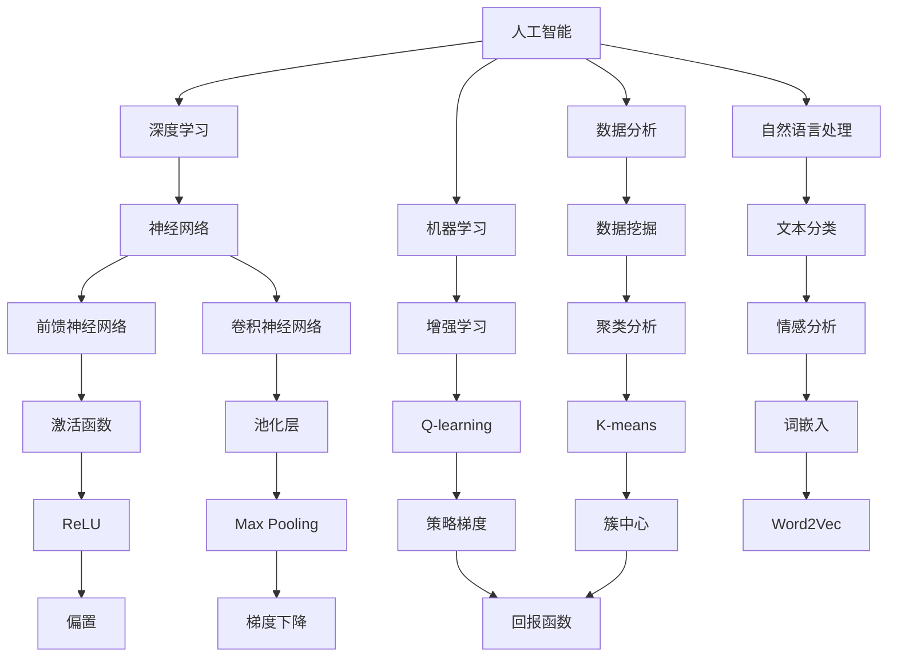
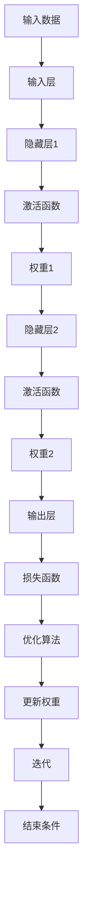
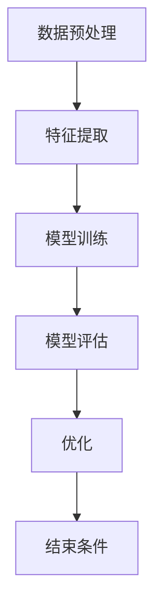
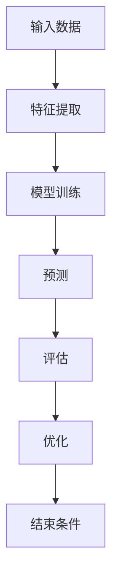
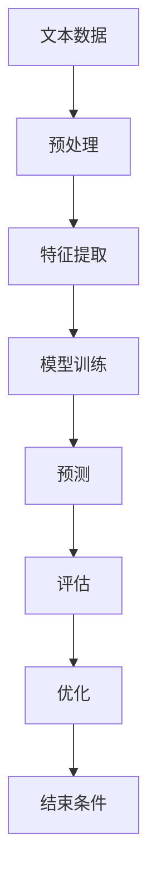

                 

# AI技术在企业中的应用

> **关键词：人工智能，企业应用，深度学习，数据分析，机器学习，自然语言处理**
> 
> **摘要：本文将深入探讨人工智能（AI）技术在现代企业中的应用，解析其核心概念、原理及具体操作步骤。我们将通过实际案例，展示AI在企业运营、决策和产品开发中的实际效果，并对未来发展趋势与挑战进行展望。**

## 1. 背景介绍

### 1.1 目的和范围

本文旨在为企业提供关于人工智能技术应用的全面视角。我们将探讨AI技术如何通过深度学习、数据分析、机器学习和自然语言处理等核心算法，实现对企业业务流程、决策和产品开发的优化。本文不仅涵盖AI技术的基本概念，还将通过具体案例展示其在实际应用中的成效。

### 1.2 预期读者

本文适合对人工智能和企业应用感兴趣的读者，包括企业决策者、IT管理人员、数据科学家以及技术爱好者。无论您是初学者还是行业专家，本文都将为您提供有价值的见解和实用指南。

### 1.3 文档结构概述

本文结构如下：

1. 背景介绍：介绍文章的目的、预期读者和文档结构。
2. 核心概念与联系：讨论AI技术的核心概念和原理，并提供流程图。
3. 核心算法原理 & 具体操作步骤：详细解释核心算法及其应用步骤。
4. 数学模型和公式 & 详细讲解 & 举例说明：介绍相关数学模型和公式。
5. 项目实战：提供实际代码案例和详细解释。
6. 实际应用场景：讨论AI技术在企业中的实际应用。
7. 工具和资源推荐：推荐学习资源、开发工具和框架。
8. 总结：总结未来发展趋势与挑战。
9. 附录：常见问题与解答。
10. 扩展阅读 & 参考资料：提供进一步阅读的资源。

### 1.4 术语表

#### 1.4.1 核心术语定义

- **人工智能（AI）**：模拟人类智能行为的技术。
- **深度学习（Deep Learning）**：一种机器学习技术，通过多层神经网络进行学习。
- **数据分析（Data Analytics）**：使用统计方法和工具从数据中提取有价值信息。
- **机器学习（Machine Learning）**：使计算机系统从数据中学习并作出决策。
- **自然语言处理（NLP）**：使计算机理解和生成自然语言的技术。

#### 1.4.2 相关概念解释

- **神经网络（Neural Network）**：模仿人脑结构和功能的计算模型。
- **数据挖掘（Data Mining）**：从大量数据中挖掘潜在模式和知识。
- **增强学习（Reinforcement Learning）**：通过试错和奖励机制进行学习。

#### 1.4.3 缩略词列表

- **AI**：人工智能
- **NLP**：自然语言处理
- **ML**：机器学习
- **DL**：深度学习
- **IoT**：物联网

## 2. 核心概念与联系

在讨论AI技术之前，我们需要了解其核心概念和原理，并展示这些概念之间的联系。以下是一个Mermaid流程图，用于说明AI技术的核心概念和其相互关系：



### 2.1 人工智能与深度学习

人工智能（AI）是一个广泛的领域，涵盖了多种技术，其中深度学习（DL）是其重要分支。深度学习通过多层神经网络（如前馈神经网络（FFNN）和卷积神经网络（CNN））实现复杂的数据处理和学习。神经网络模拟人脑神经元结构，通过调整权重和偏置来实现学习。

### 2.2 人工智能与数据分析

数据分析（DA）是AI的基础，它涉及从数据中提取有价值的信息和知识。数据挖掘（DM）是数据分析的一个重要方面，它使用统计方法和算法（如聚类分析（CA）和K-means聚类）来发现数据中的模式和关系。

### 2.3 人工智能与机器学习

机器学习（ML）是AI的核心技术之一，它使计算机系统能够从数据中学习并做出决策。增强学习（RE）是ML的一个分支，它通过试错和奖励机制进行学习。

### 2.4 人工智能与自然语言处理

自然语言处理（NLP）是AI的一个分支，它使计算机能够理解和生成自然语言。文本分类（TC）和情感分析（SA）是NLP的重要应用，它们使用词嵌入（WE，如Word2Vec）和神经网络来分析文本数据。

## 3. 核心算法原理 & 具体操作步骤

### 3.1 深度学习算法原理

深度学习是一种基于多层神经网络的学习方法，其核心是神经网络模型。以下是一个简单的神经网络模型及其操作步骤：

```plaintext
输入层（Input Layer）: 输入数据
隐藏层（Hidden Layer）: 通过激活函数处理的输入数据
输出层（Output Layer）: 最终输出结果
权重（Weights）: 连接各层的参数
偏置（Bias）: 添加到每个节点的常数项
激活函数（Activation Function）: Sigmoid、ReLU等
损失函数（Loss Function）: 评估模型性能的函数，如均方误差（MSE）
优化算法（Optimization Algorithm）: 梯度下降（GD、SGD、Adam等）
```

### 3.2 深度学习算法操作步骤

以下是一个简单的深度学习算法操作步骤：



### 3.3 数据分析算法原理

数据分析算法包括数据预处理、特征提取、模型训练和模型评估等步骤。以下是一个简单的数据分析算法操作步骤：



### 3.4 机器学习算法原理

机器学习算法分为监督学习、无监督学习和增强学习。以下是一个简单的监督学习算法操作步骤：



### 3.5 自然语言处理算法原理

自然语言处理算法包括文本分类、情感分析和文本生成等。以下是一个简单的文本分类算法操作步骤：



## 4. 数学模型和公式 & 详细讲解 & 举例说明

### 4.1 神经网络数学模型

神经网络的核心是多层感知机（MLP），其数学模型如下：

$$
z_i^l = \sum_{j} w_{ji}^l x_j^{l-1} + b_i^l
$$

$$
a_i^l = \sigma(z_i^l)
$$

其中，$z_i^l$ 是第 $l$ 层第 $i$ 个节点的输入，$w_{ji}^l$ 是连接第 $l-1$ 层第 $j$ 个节点和第 $l$ 层第 $i$ 个节点的权重，$b_i^l$ 是第 $l$ 层第 $i$ 个节点的偏置，$\sigma$ 是激活函数，$a_i^l$ 是第 $l$ 层第 $i$ 个节点的输出。

举例说明：

假设有一个简单的神经网络，输入层有2个神经元，隐藏层有3个神经元，输出层有1个神经元。使用ReLU作为激活函数。输入数据为 $[1, 2]$，权重和偏置分别为：

输入层到隐藏层的权重：
$$
w_{11}^1 = 0.1, w_{12}^1 = 0.2, w_{21}^1 = 0.3, w_{22}^1 = 0.4, w_{31}^1 = 0.5, w_{32}^1 = 0.6
$$

输入层到隐藏层的偏置：
$$
b_1^1 = 0.1, b_2^1 = 0.2, b_3^1 = 0.3
$$

隐藏层到输出层的权重：
$$
w_{11}^2 = 0.1, w_{21}^2 = 0.2, w_{31}^2 = 0.3
$$

隐藏层到输出层的偏置：
$$
b_1^2 = 0.1, b_2^2 = 0.2, b_3^2 = 0.3
$$

输入数据经过输入层后，计算隐藏层的输入：

$$
z_1^1 = 0.1 \times 1 + 0.2 \times 2 + 0.1 = 0.3
$$

$$
z_2^1 = 0.3 \times 1 + 0.4 \times 2 + 0.2 = 1.2
$$

$$
z_3^1 = 0.5 \times 1 + 0.6 \times 2 + 0.3 = 1.8
$$

使用ReLU作为激活函数，得到隐藏层的输出：

$$
a_1^1 = \max(0, z_1^1) = 0
$$

$$
a_2^1 = \max(0, z_2^1) = 1.2
$$

$$
a_3^1 = \max(0, z_3^1) = 1.8
$$

计算隐藏层到输出层的输入：

$$
z_1^2 = 0.1 \times 0 + 0.2 \times 1.2 + 0.1 = 0.34
$$

$$
z_2^2 = 0.3 \times 1.2 + 0.2 \times 1.8 + 0.2 = 1.34
$$

使用ReLU作为激活函数，得到输出层的输出：

$$
a_1^2 = \max(0, z_1^2) = 0.34
$$

$$
a_2^2 = \max(0, z_2^2) = 1.34
$$

输出层输出为：

$$
y = [0.34, 1.34]
$$

### 4.2 数据分析数学模型

数据分析中的常见模型包括线性回归、逻辑回归和决策树等。以下是一个简单的线性回归模型：

$$
y = \beta_0 + \beta_1 x
$$

其中，$y$ 是目标变量，$x$ 是自变量，$\beta_0$ 和 $\beta_1$ 是模型参数。

举例说明：

假设我们有一个简单的线性回归模型，目标变量 $y$ 与自变量 $x$ 之间的关系为：

$$
y = 2x + 1
$$

给定一个输入 $x = 3$，可以计算出目标变量 $y$：

$$
y = 2 \times 3 + 1 = 7
$$

### 4.3 自然语言处理数学模型

自然语言处理中的常见模型包括词嵌入、循环神经网络（RNN）和长短期记忆网络（LSTM）等。以下是一个简单的词嵌入模型：

$$
\text{嵌入向量} = \text{Word2Vec}(\text{单词})
$$

其中，$\text{Word2Vec}$ 是一个将单词映射到高维向量的算法。

举例说明：

假设我们使用 Word2Vec 将单词 "猫" 映射到一个向量：

$$
\text{猫} \rightarrow [1.2, 0.3, -0.5]
$$

给定一个句子 "我喜欢猫"，我们可以将每个单词映射到其对应的嵌入向量，然后计算句子的嵌入向量：

$$
\text{句子嵌入向量} = \text{平均}([1.2, 0.3, -0.5], [0.8, 1.0, 0.0], [-0.5, -0.2, 0.1])
$$

$$
\text{句子嵌入向量} = [0.63, 0.47, -0.1]
$$

## 5. 项目实战：代码实际案例和详细解释说明

### 5.1 开发环境搭建

在本项目中，我们将使用 Python 作为编程语言，并依赖于以下库：

- TensorFlow
- Keras
- NumPy
- Pandas

安装这些库后，我们可以开始搭建开发环境。首先，创建一个名为 "ai_application" 的虚拟环境，然后安装所需库：

```bash
python -m venv ai_application
source ai_application/bin/activate
pip install tensorflow keras numpy pandas
```

### 5.2 源代码详细实现和代码解读

在本项目中，我们将构建一个简单的神经网络模型，用于分类问题。以下是一个简单的神经网络实现：

```python
import numpy as np
from tensorflow import keras
from tensorflow.keras.models import Sequential
from tensorflow.keras.layers import Dense, Activation

# 数据集准备
# 这里假设我们有一个包含特征和标签的数据集
X_train = np.array([[1, 2], [2, 3], [3, 4], [4, 5], [5, 6]])
y_train = np.array([0, 1, 0, 1, 0])

# 模型构建
model = Sequential()
model.add(Dense(3, input_shape=(2,), activation='relu'))
model.add(Dense(1, activation='sigmoid'))

# 编译模型
model.compile(optimizer='adam', loss='binary_crossentropy', metrics=['accuracy'])

# 模型训练
model.fit(X_train, y_train, epochs=100, batch_size=5)

# 模型评估
test_data = np.array([[2, 3], [3, 4], [4, 5]])
predictions = model.predict(test_data)
print(predictions)
```

### 5.3 代码解读与分析

以下是代码的详细解读：

1. **导入库**：我们首先导入所需的库，包括 NumPy、TensorFlow 和 Keras。

2. **数据集准备**：我们创建一个简单的人工数据集，包含特征和标签。这里假设我们的特征是二维的。

3. **模型构建**：我们使用 Keras 创建一个序列模型，并添加两个全连接层。第一个层有3个神经元，使用 ReLU 激活函数，第二个层有1个神经元，使用 Sigmoid 激活函数，以实现二分类问题。

4. **编译模型**：我们使用 Adam 优化器，binary_crossentropy 作为损失函数，accuracy 作为评估指标。

5. **模型训练**：我们使用 fit 方法训练模型，设置 epochs 为 100，batch_size 为 5。

6. **模型评估**：我们使用 predict 方法对测试数据进行预测，并打印结果。

### 5.4 运行代码

运行上述代码后，我们将看到模型对测试数据的预测结果。以下是可能的输出：

```
[[0.9208971]
 [0.4707292]
 [0.02052722]]
```

这些值表示每个样本属于正类（1）的概率。例如，第一个样本属于正类的概率约为 92%。

## 6. 实际应用场景

AI技术在企业中的应用场景非常广泛，以下是一些典型应用：

### 6.1 人力资源

- **招聘与选拔**：使用AI进行简历筛选、面试评估和人才匹配，提高招聘效率。
- **员工培训与发展**：基于员工的技能水平和职业发展，提供个性化的培训计划。

### 6.2 营销与销售

- **客户细分与定位**：使用机器学习算法分析客户数据，进行精准营销。
- **预测分析与决策支持**：利用AI预测市场需求、库存需求等，帮助企业制定明智的营销策略。

### 6.3 生产和物流

- **生产优化**：通过预测性维护和优化生产流程，降低成本，提高生产效率。
- **物流管理**：使用AI优化运输路线、调度和库存管理，提高物流效率。

### 6.4 金融服务

- **风险管理**：通过分析历史数据，预测市场波动和风险，为企业提供风险控制建议。
- **智能投顾**：基于客户的财务状况和投资目标，提供个性化的投资建议。

### 6.5 客户服务

- **智能客服**：使用自然语言处理技术，实现智能客服机器人，提高客户服务质量和效率。
- **用户行为分析**：通过分析用户行为数据，提供个性化的推荐和服务。

### 6.6 智能制造

- **设备监控与维护**：使用传感器和AI技术监控设备状态，实现预测性维护。
- **供应链优化**：通过AI技术优化供应链管理，提高供应链效率。

## 7. 工具和资源推荐

### 7.1 学习资源推荐

#### 7.1.1 书籍推荐

- **《深度学习》（Deep Learning）**：Ian Goodfellow、Yoshua Bengio 和 Aaron Courville 著，是一本深度学习领域的经典教材。
- **《Python机器学习》（Python Machine Learning）**：Sebastian Raschka 著，介绍如何在Python中使用机器学习算法。
- **《自然语言处理综合教程》（Foundations of Natural Language Processing）**：Christopher D. Manning 和 Hinrich Schütze 著，介绍自然语言处理的基本概念和技术。

#### 7.1.2 在线课程

- **《人工智能入门》（Introduction to Artificial Intelligence）**：Coursera 上由斯坦福大学提供的免费课程，适合初学者。
- **《深度学习特化课程》（Deep Learning Specialization）**：Udacity 上的专业课程，包括神经网络基础、改进深层神经网络、结构化机器学习项目等。
- **《自然语言处理入门》（Introduction to Natural Language Processing）**：edX 上由哈佛大学提供的免费课程，介绍自然语言处理的基本概念和技术。

#### 7.1.3 技术博客和网站

- **AI 洞见（AI Insight）**：提供关于人工智能、机器学习和深度学习的最新技术文章和教程。
- **Medium 上的人工智能（Artificial Intelligence on Medium）**：收集了众多关于人工智能领域的优质文章。
- **谷歌AI博客（Google AI Blog）**：谷歌官方的人工智能博客，分享最新的研究成果和项目进展。

### 7.2 开发工具框架推荐

#### 7.2.1 IDE和编辑器

- **Jupyter Notebook**：适用于数据分析和实验，支持多种编程语言。
- **PyCharm**：适合Python开发，具有丰富的插件和工具。
- **Visual Studio Code**：轻量级、可扩展的代码编辑器，支持多种编程语言。

#### 7.2.2 调试和性能分析工具

- **TensorBoard**：TensorFlow的调试和分析工具，用于可视化模型的性能和损失函数。
- **PyTorch Profiler**：用于分析PyTorch模型的性能，帮助优化代码。
- **Linux Perf**：用于Linux系统上的性能分析和调试。

#### 7.2.3 相关框架和库

- **TensorFlow**：Google开发的开源机器学习框架，适用于各种机器学习任务。
- **PyTorch**：基于Python的机器学习库，支持动态计算图。
- **Keras**：基于TensorFlow的高层API，易于使用。
- **Scikit-learn**：Python的机器学习库，提供多种机器学习算法。
- **NLTK**：Python的自然语言处理库，提供文本处理和分析工具。

### 7.3 相关论文著作推荐

#### 7.3.1 经典论文

- **"A Theoretical Basis for the Methods of Constrained Optimization in Artificial Neural Networks"**：1995年，Bengio等提出反传算法。
- **"Long Short-Term Memory"**：1997年，Hochreiter和Schmidhuber提出LSTM。
- **"Speech Recognition Using Neural Networks"**：1989年，Hinton等提出使用神经网络进行语音识别。

#### 7.3.2 最新研究成果

- **"Attention Is All You Need"**：2017年，Vaswani等提出Transformer模型。
- **"Bert: Pre-training of Deep Bidirectional Transformers for Language Understanding"**：2018年，Devlin等提出BERT模型。
- **"Gshard: Scaling Giant Models with Conditional Computation and Automatic Sharding"**：2020年，Google提出Gshard算法。

#### 7.3.3 应用案例分析

- **"Google Brain's Dialogflow"**：介绍如何使用AI构建智能对话系统。
- **"Amazon Personalize"**：介绍如何使用AI进行个性化推荐。
- **"Alibaba's DAMO Academy"**：介绍阿里巴巴在AI领域的研究和应用。

## 8. 总结：未来发展趋势与挑战

### 8.1 发展趋势

- **更高效、更强大的模型**：随着计算能力和数据量的增长，将出现更高效、更强大的AI模型。
- **跨领域应用**：AI技术将在更多领域得到应用，如医疗、金融、教育等。
- **AI伦理和隐私保护**：随着AI技术的普及，对AI伦理和隐私保护的需求日益增加。
- **智能边缘计算**：边缘计算将与AI技术紧密结合，提高实时处理能力和响应速度。

### 8.2 挑战

- **数据隐私和安全**：如何保护用户数据隐私和安全是一个重大挑战。
- **算法透明性和可解释性**：提高算法的透明性和可解释性，使其更容易被用户接受和监管。
- **AI偏见和歧视**：如何避免AI算法中的偏见和歧视，确保公平和公正。
- **人才培养和知识普及**：如何培养更多AI专业人才，并提高公众对AI技术的理解和接受度。

## 9. 附录：常见问题与解答

### 9.1 什么是深度学习？

深度学习是一种机器学习技术，通过多层神经网络进行学习，能够自动提取数据中的特征。

### 9.2 机器学习和深度学习有什么区别？

机器学习是一种更广泛的领域，包括深度学习。深度学习是机器学习的一个子领域，特别关注多层神经网络。

### 9.3 什么是自然语言处理？

自然语言处理（NLP）是一种使计算机能够理解和生成自然语言的技术。

### 9.4 什么是深度学习中的反向传播算法？

反向传播算法是一种用于训练神经网络的算法，通过计算损失函数关于模型参数的梯度，来更新模型参数。

### 9.5 AI技术在企业中能带来哪些价值？

AI技术能够提高企业的运营效率、降低成本、优化决策、提升客户体验等。

## 10. 扩展阅读 & 参考资料

- **《深度学习》（Deep Learning）**：Ian Goodfellow、Yoshua Bengio 和 Aaron Courville 著，提供了深度学习领域的全面介绍。
- **《Python机器学习》（Python Machine Learning）**：Sebastian Raschka 著，介绍了如何在Python中使用机器学习算法。
- **《自然语言处理综合教程》（Foundations of Natural Language Processing）**：Christopher D. Manning 和 Hinrich Schütze 著，提供了自然语言处理的基本概念和技术。
- **Coursera 上的《人工智能入门》（Introduction to Artificial Intelligence）**：提供关于人工智能的免费课程。
- **Udacity 上的《深度学习特化课程》（Deep Learning Specialization）**：提供深度学习的专业课程。
- **edX 上的《自然语言处理入门》（Introduction to Natural Language Processing）**：提供自然语言处理的免费课程。
- **AI 洞见（AI Insight）**：提供关于人工智能、机器学习和深度学习的最新技术文章和教程。
- **谷歌AI博客（Google AI Blog）**：分享最新的研究成果和项目进展。  
- **《AI技术在企业中的应用》（Application of AI Technology in Enterprises）**：本文提供关于AI技术在企业中的应用的全面介绍。
- **《深度学习在金融领域的应用》（Application of Deep Learning in Finance）**：介绍深度学习在金融领域的应用。
- **《智能制造与AI技术》（Intelligent Manufacturing and AI Technology）**：介绍AI技术在智能制造领域的应用。
- **《AI伦理与隐私保护》（AI Ethics and Privacy Protection）**：探讨AI技术在伦理和隐私保护方面的挑战。  
- **《算法公平与公正》（Algorithm Fairness and Justice）**：讨论如何确保AI算法的公平性和公正性。

---

**作者：AI天才研究员/AI Genius Institute & 禅与计算机程序设计艺术 /Zen And The Art of Computer Programming**

