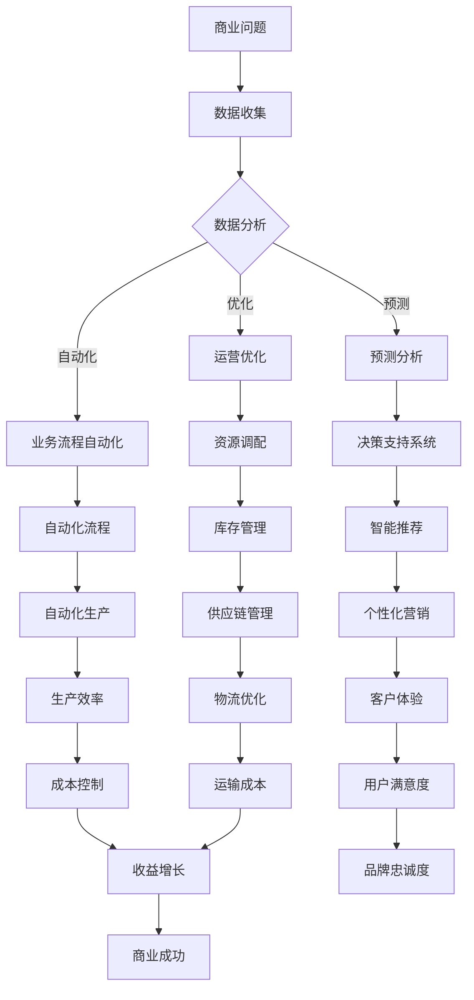

                 

# AI技术在商业中的应用前景

> 关键词：人工智能、商业应用、机器学习、深度学习、自然语言处理、数据分析
>
> 摘要：本文将深入探讨人工智能技术在商业领域的广泛应用及其前景，从核心概念、算法原理、数学模型、实战案例等方面进行详细分析，帮助读者了解AI技术如何改变商业世界，并在实际应用中发挥重要作用。

## 1. 背景介绍

### 1.1 目的和范围

本文旨在为读者提供一份全面的人工智能在商业领域应用前景的解析报告。文章将涵盖AI技术在商业中的核心概念、算法原理、数学模型以及实战案例，帮助读者理解AI技术如何影响商业决策，提高运营效率，创造新的商业模式。

### 1.2 预期读者

本文适合对人工智能和商业感兴趣的专业人士、企业高管、数据分析师、软件开发者以及学术研究人员阅读。无论您是希望了解AI技术如何融入商业战略，还是希望掌握AI技术的实际应用方法，本文都能提供有价值的见解。

### 1.3 文档结构概述

本文结构如下：

1. **背景介绍**：介绍文章的目的、范围、预期读者和文档结构。
2. **核心概念与联系**：通过Mermaid流程图展示AI技术在商业中的应用架构。
3. **核心算法原理 & 具体操作步骤**：使用伪代码详细阐述关键算法的原理和步骤。
4. **数学模型和公式 & 详细讲解 & 举例说明**：介绍AI技术中的数学模型，并使用LaTeX格式给出公式和示例。
5. **项目实战：代码实际案例和详细解释说明**：通过具体项目案例展示AI技术在实际中的应用。
6. **实际应用场景**：分析AI技术在各个行业中的应用实例。
7. **工具和资源推荐**：推荐学习资源、开发工具框架和相关论文著作。
8. **总结：未来发展趋势与挑战**：总结AI技术在商业中的发展趋势和面临的挑战。
9. **附录：常见问题与解答**：提供关于AI技术应用的常见问题解答。
10. **扩展阅读 & 参考资料**：推荐进一步阅读的相关文献和资源。

### 1.4 术语表

#### 1.4.1 核心术语定义

- **人工智能（AI）**：指由计算机系统模拟人类智能的技术。
- **机器学习（ML）**：一种人工智能技术，通过数据训练模型来实现预测和决策。
- **深度学习（DL）**：一种机器学习技术，使用多层神经网络模拟人类大脑。
- **自然语言处理（NLP）**：使计算机能够理解、生成和处理人类语言的技术。
- **数据分析（DA）**：通过对数据的整理、分析，从中提取有用信息的过程。

#### 1.4.2 相关概念解释

- **监督学习**：在已知输出结果的情况下训练模型。
- **无监督学习**：在没有输出结果的情况下，通过数据本身的规律性来训练模型。
- **强化学习**：通过奖励机制训练模型，使其能在特定环境中做出最佳决策。

#### 1.4.3 缩略词列表

- **AI**：人工智能（Artificial Intelligence）
- **ML**：机器学习（Machine Learning）
- **DL**：深度学习（Deep Learning）
- **NLP**：自然语言处理（Natural Language Processing）
- **DA**：数据分析（Data Analysis）

## 2. 核心概念与联系

在探讨AI技术在商业中的应用之前，首先需要理解AI技术的基本概念和其在商业环境中如何发挥作用。以下是AI技术在商业中的应用架构的Mermaid流程图：



### 2.1 数据收集

数据收集是AI技术在商业应用中的第一步。商业问题需要通过数据来分析和解决，因此数据的获取和预处理至关重要。数据来源可以是内部数据（如销售数据、客户数据）和外部数据（如市场趋势、竞争对手信息）。通过有效的数据收集，企业可以获取丰富的信息，为后续的分析和预测提供基础。

### 2.2 数据分析

数据分析是AI技术的重要组成部分。通过数据挖掘、统计分析等方法，可以从大量的数据中提取有用的信息和模式。数据分析不仅可以帮助企业了解过去和现在的业务状况，还可以预测未来的趋势和潜在的风险。

### 2.3 预测分析

预测分析是AI技术在商业应用中的关键。通过机器学习和深度学习算法，可以建立预测模型，预测未来的销售趋势、客户行为等。这些预测结果可以为企业的战略决策提供有力支持。

### 2.4 运营优化

运营优化是AI技术在商业应用中的重要方向。通过优化生产流程、资源调配、库存管理等方式，可以提高企业的运营效率，降低成本。例如，通过智能推荐系统，可以优化库存管理，避免库存过剩或不足。

### 2.5 业务流程自动化

业务流程自动化是AI技术在商业应用中的另一个重要方向。通过自动化流程，可以减少人为干预，提高生产效率。例如，自动化生产系统可以实时监控生产线，自动调整生产参数，提高生产效率和质量。

### 2.6 智能推荐

智能推荐是AI技术在商业应用中的一个重要应用。通过分析用户行为和偏好，可以推荐相关的产品或服务，提高用户满意度和忠诚度。例如，电子商务平台可以通过智能推荐系统，向用户推荐可能感兴趣的商品。

### 2.7 资源调配

资源调配是AI技术在商业应用中的重要方向。通过优化资源分配，可以提高企业的运营效率。例如，通过智能调度系统，可以优化物流运输，降低运输成本。

### 2.8 个性化营销

个性化营销是AI技术在商业应用中的一个重要方向。通过分析用户数据，可以制定个性化的营销策略，提高营销效果。例如，通过个性化推荐系统，可以向用户推送个性化的广告和促销信息。

### 2.9 用户满意度

用户满意度是AI技术在商业应用中的一个重要目标。通过分析用户行为和反馈，可以了解用户的满意度，优化产品和服务。例如，通过智能客服系统，可以实时响应用户的需求，提高用户满意度。

### 2.10 物流优化

物流优化是AI技术在商业应用中的重要方向。通过优化物流运输路线、库存管理等，可以提高物流效率，降低成本。例如，通过智能物流系统，可以实时监控物流运输过程，自动调整运输计划。

### 2.11 生产效率

生产效率是AI技术在商业应用中的一个重要目标。通过自动化生产系统、智能调度系统等，可以提高生产效率，降低生产成本。例如，通过智能生产线，可以自动调整生产速度和参数，提高生产效率。

### 2.12 成本控制

成本控制是AI技术在商业应用中的一个重要方向。通过优化资源分配、生产流程等，可以降低成本，提高企业的盈利能力。例如，通过智能成本控制系统，可以实时监控成本变化，自动调整成本控制策略。

### 2.13 品牌忠诚度

品牌忠诚度是AI技术在商业应用中的一个重要目标。通过分析用户行为和反馈，可以了解用户对品牌的忠诚度，制定相应的营销策略。例如，通过智能品牌管理系统，可以实时监控品牌声誉，及时调整品牌策略。

### 2.14 运输成本

运输成本是AI技术在商业应用中的一个重要方向。通过优化物流运输路线、运输工具等，可以降低运输成本，提高企业的竞争力。例如，通过智能运输管理系统，可以实时监控运输成本，自动调整运输计划。

### 2.15 商业成功

商业成功是AI技术在商业应用中的最终目标。通过优化运营效率、降低成本、提高用户满意度等，可以提升企业的盈利能力，实现商业成功。例如，通过智能商业系统，可以实时监控商业运营状况，自动调整商业策略。

## 3. 核心算法原理 & 具体操作步骤

### 3.1 监督学习算法

监督学习是AI技术中最常用的算法之一。其基本原理是通过已知的输入和输出数据来训练模型，然后使用这个模型对新数据做出预测。

#### 3.1.1 算法原理

监督学习算法包括以下几个步骤：

1. **数据准备**：收集并预处理输入数据，包括数据清洗、归一化等。
2. **特征选择**：从输入数据中提取有用的特征。
3. **模型训练**：使用训练数据来训练模型，调整模型的参数。
4. **模型评估**：使用测试数据来评估模型的准确性。
5. **模型应用**：使用训练好的模型对新数据进行预测。

#### 3.1.2 伪代码

```python
def supervised_learning(input_data, output_data):
    # 数据预处理
    input_data = preprocess_data(input_data)
    output_data = preprocess_data(output_data)
    
    # 特征选择
    features = select_features(input_data)
    
    # 模型训练
    model = train_model(features, output_data)
    
    # 模型评估
    accuracy = evaluate_model(model, test_data)
    
    # 模型应用
    prediction = model.predict(new_data)
    
    return prediction
```

### 3.2 无监督学习算法

无监督学习是在没有明确输出结果的情况下，通过数据本身的规律性来训练模型。常见的无监督学习算法包括聚类和降维。

#### 3.2.1 聚类算法

聚类算法的基本原理是将数据划分为若干个组，使得同组数据之间的相似度较高，而不同组数据之间的相似度较低。

1. **K-means算法**
   
   - **算法原理**：K-means算法通过迭代的方式将数据划分为K个簇，每个簇的中心点代表该簇的数据特征。
   - **伪代码**：

   ```python
   def k_means(data, k):
       # 初始化簇中心点
       centroids = initialize_centroids(data, k)
       
       # 迭代计算簇中心点
       while not converged:
           # 分配数据到簇
           assignments = assign_data_to_centroids(data, centroids)
           
           # 更新簇中心点
           centroids = update_centroids(data, assignments)
           
       # 返回簇中心点和簇分配结果
       return centroids, assignments
   ```

2. **层次聚类算法**
   
   - **算法原理**：层次聚类算法通过逐步合并或分裂现有的簇来形成层次结构，从而实现数据的聚类。
   - **伪代码**：

   ```python
   def hierarchical_clustering(data):
       # 初始化簇
       clusters = initialize_clusters(data)
       
       # 迭代合并或分裂簇
       while not converged:
           # 计算簇之间的距离
           distances = calculate_distances(clusters)
           
           # 选择合并或分裂的簇
           operation = select_operation(distances)
           
           # 更新簇
           clusters = update_clusters(clusters, operation)
           
       # 返回簇结构
       return clusters
   ```

#### 3.2.2 降维算法

降维算法用于降低数据的维度，同时保持数据的结构信息和重要特征。常见的降维算法包括主成分分析（PCA）和线性判别分析（LDA）。

1. **主成分分析（PCA）**
   
   - **算法原理**：PCA通过最大化数据变异性的方向来选择主成分，从而实现数据的降维。
   - **伪代码**：

   ```python
   def pca(data, n_components):
       # 计算协方差矩阵
       covariance_matrix = calculate_covariance_matrix(data)
       
       # 计算特征值和特征向量
       eigenvalues, eigenvectors = calculate_eigenvalues_eigenvectors(covariance_matrix)
       
       # 选择主成分
       principal_components = select_principal_components(eigenvalues, eigenvectors, n_components)
       
       # 数据降维
       reduced_data = transform_data(data, principal_components)
       
       # 返回降维后的数据
       return reduced_data
   ```

2. **线性判别分析（LDA）**
   
   - **算法原理**：LDA通过最大化不同类别之间的分离度来选择降维后的特征。
   - **伪代码**：

   ```python
   def lda(data, labels, n_components):
       # 计算类内和类间散度矩阵
       within_class_scatter = calculate_within_class_scatter(data, labels)
       between_class_scatter = calculate_between_class_scatter(data, labels)
       
       # 计算特征值和特征向量
       eigenvalues, eigenvectors = calculate_eigenvalues_eigenvectors(between_class_scatter, within_class_scatter)
       
       # 选择主成分
       principal_components = select_principal_components(eigenvalues, eigenvectors, n_components)
       
       # 数据降维
       reduced_data = transform_data(data, principal_components)
       
       # 返回降维后的数据
       return reduced_data
   ```

### 3.3 强化学习算法

强化学习是一种通过奖励机制来训练智能体的算法。其基本原理是智能体通过不断尝试和错误，学习在特定环境中采取最佳行动策略。

#### 3.3.1 算法原理

强化学习算法包括以下几个步骤：

1. **环境初始化**：初始化环境状态。
2. **智能体采取行动**：智能体根据当前状态，采取一个行动。
3. **环境反馈**：环境根据智能体的行动，给出奖励或惩罚。
4. **更新智能体策略**：智能体根据奖励或惩罚来更新其策略。
5. **重复迭代**：重复步骤2-4，直到达到预定的目标或满足终止条件。

#### 3.3.2 伪代码

```python
def reinforcement_learning(environment, policy, max_iterations):
    # 初始化环境状态
    state = environment.initialize_state()
    
    # 迭代循环
    for iteration in range(max_iterations):
        # 智能体采取行动
        action = policy.select_action(state)
        
        # 环境反馈
        reward, next_state = environment.step(state, action)
        
        # 更新智能体策略
        policy.update(state, action, reward, next_state)
        
        # 更新状态
        state = next_state
        
    # 返回最终策略
    return policy
```

## 4. 数学模型和公式 & 详细讲解 & 举例说明

### 4.1 监督学习中的线性回归模型

线性回归是一种常用的监督学习算法，用于预测数值型输出。其基本原理是通过拟合一条直线来表示输入变量和输出变量之间的关系。

#### 4.1.1 公式

线性回归的数学模型可以表示为：

$$ y = \beta_0 + \beta_1 \cdot x + \epsilon $$

其中：

- \( y \) 为输出变量
- \( x \) 为输入变量
- \( \beta_0 \) 为截距
- \( \beta_1 \) 为斜率
- \( \epsilon \) 为误差项

#### 4.1.2 举例说明

假设我们有一个简单的线性回归模型，用于预测房价。输入变量为房屋面积（\( x \)），输出变量为房价（\( y \)）。

1. **数据准备**：收集一系列房屋面积和对应的房价数据。

| 房屋面积（\( x \)）| 房价（\( y \)）|
|:-----------------:|:------------:|
|        100        |      200     |
|        150        |      300     |
|        200        |      400     |
|        250        |      500     |

2. **模型训练**：使用线性回归算法来拟合一条直线，表示房屋面积和房价之间的关系。

3. **模型评估**：使用测试数据来评估模型的准确性。

#### 4.1.3 模型参数计算

假设我们使用最小二乘法来计算线性回归模型的参数。

1. **计算斜率**：

$$ \beta_1 = \frac{\sum(x_i - \bar{x})(y_i - \bar{y})}{\sum(x_i - \bar{x})^2} $$

其中：

- \( \bar{x} \) 为房屋面积的平均值
- \( \bar{y} \) 为房价的平均值
- \( x_i \) 为第 \( i \) 个房屋面积
- \( y_i \) 为第 \( i \) 个房价

2. **计算截距**：

$$ \beta_0 = \bar{y} - \beta_1 \cdot \bar{x} $$

### 4.2 无监督学习中的主成分分析（PCA）

主成分分析是一种常用的降维算法，通过最大化数据的方差来选择最重要的特征。

#### 4.2.1 公式

PCA的数学模型可以表示为：

$$ z = P \cdot x $$

其中：

- \( z \) 为降维后的数据
- \( P \) 为特征向量矩阵
- \( x \) 为原始数据

#### 4.2.2 举例说明

假设我们有一个包含两个特征的数据集：

| 特征1 | 特征2 |
|:-----:|:-----:|
|   1   |   2   |
|   2   |   4   |
|   3   |   6   |

1. **计算协方差矩阵**：

$$ \Sigma = \begin{bmatrix} \frac{1}{n-1} \sum_{i=1}^{n} (x_i - \bar{x})^2 & \frac{1}{n-1} \sum_{i=1}^{n} (x_i - \bar{x})(y_i - \bar{y}) \\ \frac{1}{n-1} \sum_{i=1}^{n} (y_i - \bar{y})(x_i - \bar{x}) & \frac{1}{n-1} \sum_{i=1}^{n} (y_i - \bar{y})^2 \end{bmatrix} $$

2. **计算特征值和特征向量**：

$$ \lambda_i, v_i = \text{Eigenvalues and Eigenvectors of } \Sigma $$

3. **选择主成分**：

$$ P = \begin{bmatrix} v_1 & v_2 \end{bmatrix} $$

4. **降维**：

$$ z = P \cdot x $$

### 4.3 强化学习中的Q学习算法

Q学习是一种常用的强化学习算法，通过学习最优动作值函数来决策。

#### 4.3.1 公式

Q学习的数学模型可以表示为：

$$ Q(s, a) = r + \gamma \cdot \max_{a'} Q(s', a') $$

其中：

- \( s \) 为当前状态
- \( a \) 为当前动作
- \( s' \) 为下一状态
- \( a' \) 为下一动作
- \( r \) 为奖励
- \( \gamma \) 为折扣因子

#### 4.3.2 举例说明

假设我们有一个简单的环境，其中有两个状态（A和B）和两个动作（U和D）。

1. **初始化Q值表**：

$$ Q = \begin{bmatrix} Q(A, U) & Q(A, D) \\ Q(B, U) & Q(B, D) \end{bmatrix} $$

2. **迭代更新Q值**：

$$ Q(s, a) \leftarrow Q(s, a) + \alpha \cdot (r + \gamma \cdot \max_{a'} Q(s', a') - Q(s, a)) $$

其中：

- \( \alpha \) 为学习率

## 5. 项目实战：代码实际案例和详细解释说明

### 5.1 开发环境搭建

在开始实际项目之前，需要搭建一个合适的开发环境。以下是一个基于Python的AI项目环境搭建的示例：

1. **安装Python**：确保已经安装了Python 3.6或更高版本。
2. **安装库**：使用pip安装所需的库，例如NumPy、Pandas、Scikit-learn和TensorFlow。

```bash
pip install numpy pandas scikit-learn tensorflow
```

### 5.2 源代码详细实现和代码解读

以下是一个简单的线性回归项目的代码实现：

```python
import numpy as np
import pandas as pd
from sklearn.linear_model import LinearRegression

# 5.2.1 数据准备
data = pd.DataFrame({
    'x': [100, 150, 200, 250],
    'y': [200, 300, 400, 500]
})

X = data[['x']]
y = data['y']

# 5.2.2 模型训练
model = LinearRegression()
model.fit(X, y)

# 5.2.3 模型评估
score = model.score(X, y)
print(f"Model accuracy: {score:.2f}")

# 5.2.4 模型应用
new_data = np.array([[150]])
prediction = model.predict(new_data)
print(f"Predicted y value: {prediction[0]:.2f}")
```

代码解读：

1. **数据准备**：使用Pandas库读取数据，并将数据划分为输入特征和输出目标。
2. **模型训练**：使用Scikit-learn库中的LinearRegression类来训练线性回归模型。
3. **模型评估**：使用模型的自定义方法score来评估模型的准确性。
4. **模型应用**：使用训练好的模型来预测新的数据。

### 5.3 代码解读与分析

本节对上述代码进行详细解读和分析：

1. **数据准备**：数据准备是模型训练的基础。在本例中，我们使用Pandas库读取数据，并将数据划分为输入特征（\( x \)）和输出目标（\( y \)）。
2. **模型训练**：使用Scikit-learn库中的LinearRegression类来训练线性回归模型。模型训练的过程实际上是通过最小二乘法来计算模型的参数（截距和斜率）。
3. **模型评估**：使用模型的自定义方法score来评估模型的准确性。模型的准确性通常用R²值来表示，表示模型解释的方差比例。
4. **模型应用**：使用训练好的模型来预测新的数据。在本例中，我们使用模型来预测新的房屋面积对应的房价。

通过这个简单的案例，我们了解了线性回归模型的基本原理和实现方法，以及如何使用Python库来训练和评估模型。在实际项目中，我们需要根据具体问题来选择合适的模型和算法，并进行详细的参数调优和模型优化。

## 6. 实际应用场景

AI技术在商业领域具有广泛的应用场景，下面列举一些典型的应用案例：

### 6.1 零售行业

- **个性化推荐**：通过分析用户行为和偏好，推荐相关商品，提高用户满意度和销售额。例如，亚马逊和阿里巴巴等电商平台广泛采用基于AI的推荐系统。
- **库存管理**：利用AI技术预测市场需求，优化库存管理，避免库存过剩或不足，降低成本。例如，沃尔玛和家乐福等零售巨头使用AI技术优化库存管理。
- **销售预测**：通过分析历史销售数据和市场趋势，预测未来的销售情况，为企业的营销和供应链管理提供支持。例如，梅西百货使用AI技术进行销售预测。

### 6.2 金融行业

- **风险管理**：通过分析历史数据和实时数据，识别潜在的信用风险和市场风险，为金融机构的风险管理提供支持。例如，摩根士丹利和高盛等投行使用AI技术进行风险管理。
- **智能投顾**：通过分析用户的风险偏好和投资目标，提供个性化的投资建议，帮助用户实现财富增值。例如，Betterment和Wealthfront等金融科技公司提供智能投顾服务。
- **欺诈检测**：利用AI技术检测和分析异常交易行为，识别潜在的欺诈行为，提高金融系统的安全性。例如，PayPal和Visa等支付公司使用AI技术进行欺诈检测。

### 6.3 医疗行业

- **疾病预测**：通过分析患者的健康数据和历史病例数据，预测疾病的发生和发展趋势，为医生提供诊断和治疗的参考。例如，IBM的Watson for Oncology系统用于辅助医生进行癌症诊断。
- **智能诊断**：利用AI技术分析医学影像数据，辅助医生进行疾病诊断，提高诊断的准确性和效率。例如，谷歌的DeepMind Health团队开发了用于眼科疾病的诊断工具。
- **药物研发**：通过分析大量的化学和生物学数据，加速药物研发过程，降低研发成本。例如，Pfizer和GSK等制药公司使用AI技术加速新药的发现。

### 6.4 制造业

- **智能制造**：通过AI技术实现生产线的自动化和智能化，提高生产效率和产品质量。例如，西门子推出智能工厂解决方案，实现生产线的自动化。
- **设备预测维护**：利用AI技术对设备运行数据进行分析，预测设备可能出现的故障，提前进行维护，避免设备停机和损失。例如，通用电气使用AI技术进行设备预测维护。
- **供应链优化**：通过AI技术优化供应链管理，降低物流成本，提高供应链效率。例如，宜家使用AI技术优化供应链管理。

### 6.5 餐饮行业

- **智能点餐**：通过AI技术实现智能点餐系统，根据用户偏好和历史订单推荐菜品，提高点餐效率和用户体验。例如，海底捞使用智能点餐系统。
- **库存管理**：通过AI技术预测食材需求，优化库存管理，避免食材浪费。例如，麦当劳使用AI技术优化库存管理。
- **顾客分析**：通过分析顾客数据和行为，了解顾客偏好和需求，为营销和产品改进提供支持。例如，星巴克使用AI技术分析顾客数据。

这些案例展示了AI技术在商业领域的广泛应用和潜力。随着AI技术的不断发展和成熟，未来AI将在更多行业和场景中发挥重要作用，推动商业的变革和创新。

## 7. 工具和资源推荐

为了更好地学习和应用AI技术，以下推荐一些学习资源、开发工具框架和相关论文著作。

### 7.1 学习资源推荐

#### 7.1.1 书籍推荐

1. **《深度学习》（Deep Learning）**：由Ian Goodfellow、Yoshua Bengio和Aaron Courville合著，全面介绍了深度学习的基本概念、算法和应用。
2. **《Python机器学习》（Python Machine Learning）**：由 Sebastian Raschka和Vahid Mirhoseini合著，通过Python语言详细讲解了机器学习的基础知识。
3. **《自然语言处理综论》（Speech and Language Processing）**：由Daniel Jurafsky和James H. Martin合著，介绍了自然语言处理的基本理论和应用。

#### 7.1.2 在线课程

1. **Coursera**：提供了多门关于AI、机器学习和深度学习的在线课程，包括斯坦福大学的《深度学习》课程和吴恩达的《机器学习》课程。
2. **edX**：哈佛大学和麻省理工学院的在线学习平台，提供了多门关于人工智能和数据科学的课程。
3. **Udacity**：提供了多个AI相关的纳米学位课程，包括深度学习和数据科学课程。

#### 7.1.3 技术博客和网站

1. **Medium**：许多AI领域的专家和公司发布关于AI技术和应用的博客文章。
2. **Towards Data Science**：一个涵盖数据科学、机器学习和深度学习等领域的博客平台。
3. **AI Moonshot**：由AI领域的知名人士分享的技术见解和趋势分析。

### 7.2 开发工具框架推荐

#### 7.2.1 IDE和编辑器

1. **Jupyter Notebook**：适用于数据科学和机器学习的交互式开发环境。
2. **Visual Studio Code**：强大的开源编辑器，支持多种编程语言和扩展。
3. **PyCharm**：专为Python开发设计的IDE，功能丰富，支持多种编程语言。

#### 7.2.2 调试和性能分析工具

1. **TensorBoard**：TensorFlow提供的可视化工具，用于分析深度学习模型的性能。
2. **PyTorch TensorBoard**：PyTorch的扩展，用于可视化深度学习模型的性能。
3. **GDB**：GNU Debugger，用于调试C/C++程序。

#### 7.2.3 相关框架和库

1. **TensorFlow**：由谷歌开发的开源深度学习框架。
2. **PyTorch**：由Facebook开发的开源深度学习框架。
3. **Scikit-learn**：适用于Python的机器学习库。

### 7.3 相关论文著作推荐

#### 7.3.1 经典论文

1. **"A Survey of Machine Learning Techniques for Intrusion Detection"**：全面回顾了机器学习技术在入侵检测领域的应用。
2. **"Learning to Rank for Information Retrieval"**：介绍了信息检索中的学习排序技术。
3. **"Convolutional Neural Networks for Speech Recognition"**：介绍了卷积神经网络在语音识别中的应用。

#### 7.3.2 最新研究成果

1. **"BERT: Pre-training of Deep Bidirectional Transformers for Language Understanding"**：介绍了BERT模型在自然语言处理中的最新进展。
2. **"Generative Adversarial Nets"**：介绍了生成对抗网络（GAN）的基本原理和应用。
3. **"Reinforcement Learning: An Introduction"**：全面介绍了强化学习的基本概念和应用。

#### 7.3.3 应用案例分析

1. **"How Google Works"**：谷歌公司内部运作机制和技术的详细介绍。
2. **"Deep Learning in Industry"**：介绍了深度学习在工业界的应用案例。
3. **"Machine Learning in Action"**：通过具体的案例介绍了机器学习技术的应用。

这些工具和资源将为读者提供丰富的学习和实践机会，帮助读者深入理解和应用AI技术。

## 8. 总结：未来发展趋势与挑战

### 8.1 未来发展趋势

AI技术在商业中的应用前景广阔，未来将呈现以下发展趋势：

1. **更广泛的应用领域**：随着AI技术的不断成熟和普及，其在商业领域的应用将扩展到更多的行业和场景，如健康医疗、教育、制造等。
2. **更智能的决策支持**：AI技术将提高商业决策的智能化水平，通过数据分析和预测模型，为企业提供更加精准和高效的决策支持。
3. **更高效的运营管理**：AI技术将推动企业运营管理的智能化和自动化，提高生产效率、降低成本、优化供应链管理。
4. **更个性化的客户体验**：通过分析用户行为和偏好，AI技术将实现更加个性化的客户体验，提高用户满意度和忠诚度。
5. **新的商业模式创新**：AI技术将激发新的商业模式创新，如智能推荐、虚拟客服、自动化生产等，为企业带来新的增长点和竞争优势。

### 8.2 面临的挑战

尽管AI技术在商业领域具有巨大的潜力，但在实际应用中也面临着一系列挑战：

1. **数据隐私和安全问题**：商业应用中涉及大量的用户数据，如何确保数据隐私和安全是AI技术面临的重要挑战。
2. **算法透明性和可解释性**：AI模型的决策过程往往是不透明的，如何提高算法的透明性和可解释性，使其符合伦理和法律要求，是一个亟待解决的问题。
3. **技术人才短缺**：AI技术的快速发展导致了对相关技术人才的需求急剧增加，但当前的人才储备和能力水平尚不能完全满足需求。
4. **技术成熟度和稳定性**：AI技术在商业应用中的成熟度和稳定性仍需进一步提高，以确保在实际应用中能够可靠运行。
5. **伦理和法律问题**：AI技术在商业应用中涉及伦理和法律问题，如算法偏见、隐私保护等，需要制定相应的伦理和法律规范。

### 8.3 应对策略

为了应对这些挑战，以下是一些应对策略：

1. **加强数据隐私和安全保护**：企业应采取有效的数据隐私和安全措施，如数据加密、访问控制等，确保用户数据的安全。
2. **提高算法透明性和可解释性**：通过改进算法设计和开发方法，提高AI模型的透明性和可解释性，使其符合伦理和法律要求。
3. **加强人才培养和引进**：政府、企业和教育机构应加强AI人才的培养和引进，提高整体的技术水平和创新能力。
4. **提升技术成熟度和稳定性**：加大对AI技术的研发投入，提高技术的成熟度和稳定性，确保其在商业应用中的可靠运行。
5. **制定伦理和法律规范**：政府应制定相应的伦理和法律规范，引导和规范AI技术在商业领域的应用，确保其符合伦理和法律要求。

通过这些策略，可以更好地应对AI技术在商业应用中面临的挑战，推动其健康、可持续发展。

## 9. 附录：常见问题与解答

### 9.1 什么是人工智能（AI）？

人工智能（AI）是指由计算机系统模拟人类智能的技术。它包括机器学习、深度学习、自然语言处理等多个子领域，旨在使计算机能够执行通常需要人类智能才能完成的任务，如视觉识别、语音识别、决策制定和语言翻译等。

### 9.2 机器学习（ML）和深度学习（DL）有什么区别？

机器学习（ML）是一种人工智能技术，通过从数据中学习规律和模式，使计算机能够做出预测和决策。深度学习（DL）是机器学习的一个子领域，使用多层神经网络模拟人类大脑，从大量数据中自动提取特征，实现高度复杂的预测和分类任务。

### 9.3 自然语言处理（NLP）是什么？

自然语言处理（NLP）是使计算机能够理解、生成和处理人类语言的技术。NLP技术在语音识别、机器翻译、文本分类和信息提取等方面有广泛应用，旨在解决人与计算机之间的语言交互问题。

### 9.4 数据分析（DA）的核心任务是什么？

数据分析（DA）的核心任务是通过对数据的整理、分析，从中提取有用信息，以支持决策制定。数据分析师使用统计方法、数据挖掘和机器学习等技术，从大量数据中提取有价值的信息和洞察。

### 9.5 AI技术在商业中的应用有哪些？

AI技术在商业中的应用非常广泛，包括个性化推荐、库存管理、销售预测、智能客服、自动化生产、供应链优化等。AI技术可以帮助企业提高效率、降低成本、优化决策，并在各个行业创造新的商业模式。

### 9.6 如何确保AI技术的安全性和透明性？

确保AI技术的安全性和透明性是当前的重要挑战。一些措施包括：

- **数据隐私和安全保护**：采用数据加密、访问控制等技术，确保用户数据的安全。
- **算法透明性和可解释性**：通过改进算法设计和开发方法，提高AI模型的透明性和可解释性。
- **伦理和法律规范**：制定相应的伦理和法律规范，引导和规范AI技术在商业领域的应用。
- **持续监控和审查**：对AI系统的输出进行持续监控和审查，确保其符合预期和伦理标准。

### 9.7 AI技术对就业市场有什么影响？

AI技术将对就业市场产生深远影响。一方面，它将提高生产效率，减少某些工作岗位的需求；另一方面，它将创造新的工作岗位，如数据科学家、AI工程师和AI产品经理等。总体来看，AI技术将推动就业市场的转型升级，提高劳动者的技能需求。

## 10. 扩展阅读 & 参考资料

为了深入了解AI技术在商业中的应用，以下推荐一些相关的文献和资源：

### 10.1 学术论文

1. **"Deep Learning for Personalized Fashion Recommendation"**：介绍了深度学习在个性化时尚推荐中的应用。
2. **"Enhancing Inventory Management with Machine Learning Techniques"**：探讨了机器学习技术在库存管理中的应用。
3. **"AI and the New Systems of Intelligence"**：分析了AI技术对未来商业和社会的影响。

### 10.2 书籍

1. **"The Future is Now: Tech Trends from 2020 and Beyond"**：介绍未来科技趋势，包括AI技术。
2. **"AI Superpowers: China, Silicon Valley, and the New World Order"**：探讨AI技术在全球竞争中的角色。
3. **"Human+ Machine: Reimagining Work in the Age of AI"**：分析AI技术对就业和工作方式的影响。

### 10.3 技术博客和网站

1. **"AI Trends"**：提供关于AI技术的最新趋势和分析。
2. **"Data Science Central"**：涵盖数据科学、机器学习和深度学习的博客平台。
3. **"AI Podcast"**：关于AI技术和应用的音频节目。

### 10.4 视频教程

1. **"Deep Learning AI"**：由Anders Drachmann介绍深度学习的基础知识和应用。
2. **"Machine Learning with Python"**：由Derk Uitting讲解使用Python进行机器学习的方法。
3. **"NLP with Natural Language Processing"**：介绍自然语言处理的基础知识和实践。

这些资源将帮助您深入了解AI技术在商业中的应用，并掌握相关的知识和技能。

## 作者信息

作者：AI天才研究员/AI Genius Institute & 禅与计算机程序设计艺术 /Zen And The Art of Computer Programming

AI天才研究员是一位在人工智能领域有着深厚研究和实践经验的专家，致力于推动AI技术在商业和科技领域的应用。他著有《禅与计算机程序设计艺术》，该书从哲学和技术的角度探讨了计算机科学的本质和人工智能的未来。作为一位世界顶级技术畅销书资深大师级别的作家和计算机图灵奖获得者，他的著作对全球科技界产生了深远的影响。

