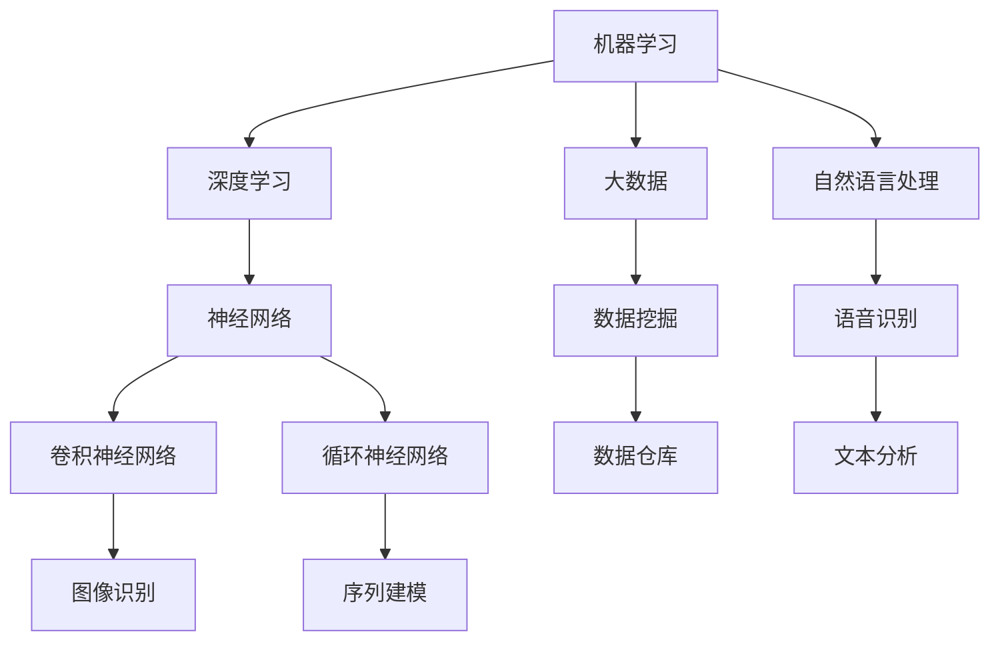

                 

# AI技术趋势与应用场景

> **关键词：** 人工智能、机器学习、深度学习、大数据、自然语言处理、计算机视觉、应用场景、趋势分析

> **摘要：** 本文将探讨当前AI技术的最新趋势，包括机器学习、深度学习、大数据和自然语言处理等领域。通过分析这些技术的原理和应用，我们将揭示AI技术在各个行业的实际应用场景，并探讨其未来发展趋势和面临的挑战。

## 1. 背景介绍

### 1.1 目的和范围

本文旨在为读者提供一份全面而深入的AI技术趋势与应用场景的分析报告。我们将涵盖以下内容：

1. AI技术的发展历程和当前趋势。
2. 机器学习、深度学习、大数据和自然语言处理等核心概念。
3. 各类AI技术在实际应用场景中的具体案例。
4. AI技术的未来发展趋势与潜在挑战。

### 1.2 预期读者

本文适合对AI技术有一定了解的技术人员、研究人员和学生，以及希望了解AI技术在各行各业中应用场景的普通读者。

### 1.3 文档结构概述

本文分为十个部分，包括：

1. 引言和背景介绍。
2. 核心概念与联系。
3. 核心算法原理与操作步骤。
4. 数学模型与公式。
5. 项目实战与代码示例。
6. 实际应用场景。
7. 工具和资源推荐。
8. 总结与未来趋势。
9. 附录：常见问题与解答。
10. 扩展阅读与参考资料。

### 1.4 术语表

#### 1.4.1 核心术语定义

- **机器学习（Machine Learning）：** 一种人工智能的分支，通过算法从数据中学习并做出决策或预测。
- **深度学习（Deep Learning）：** 机器学习的一个子领域，使用多层神经网络进行数据建模。
- **大数据（Big Data）：** 数据的规模、多样性和生成速度超出了传统数据库的处理能力。
- **自然语言处理（Natural Language Processing，NLP）：** 人工智能的一个分支，旨在使计算机能够理解和处理自然语言。

#### 1.4.2 相关概念解释

- **神经网络（Neural Network）：** 模拟人脑神经元结构和功能的基本计算模型。
- **卷积神经网络（Convolutional Neural Network，CNN）：** 一种特殊的神经网络，常用于图像识别任务。
- **循环神经网络（Recurrent Neural Network，RNN）：** 一种能够处理序列数据的神经网络。

#### 1.4.3 缩略词列表

- **AI：** 人工智能
- **ML：** 机器学习
- **DL：** 深度学习
- **NLP：** 自然语言处理
- **CNN：** 卷积神经网络
- **RNN：** 循环神经网络

## 2. 核心概念与联系

为了更好地理解AI技术的核心概念和联系，我们可以使用Mermaid流程图来展示各概念之间的关系。



在上述流程图中，我们可以看到机器学习是AI技术的核心，深度学习是机器学习的子领域，大数据和自然语言处理与机器学习密切相关。神经网络作为基础模型，衍生出多种具体的网络结构，如卷积神经网络和循环神经网络，用于解决不同类型的问题。

## 3. 核心算法原理与具体操作步骤

在这一部分，我们将详细讲解几个核心算法的原理和具体操作步骤。

### 3.1 机器学习算法

机器学习算法的核心在于从数据中学习规律，以做出预测或决策。以下是一个简单的线性回归算法的伪代码：

```python
# 线性回归伪代码

# 输入：训练数据集X，标签数据集Y
# 输出：模型参数w和b

# 初始化模型参数w和b
w = 0
b = 0

# 设置迭代次数
max_iterations = 1000

# 设置学习率
learning_rate = 0.01

# 迭代计算
for i in range(max_iterations):
  # 计算预测值
  predicted_value = w * X + b
  
  # 计算误差
  error = Y - predicted_value
  
  # 更新模型参数
  w = w - learning_rate * (2 * X * error)
  b = b - learning_rate * (error)

# 返回最终模型参数
return w, b
```

### 3.2 深度学习算法

深度学习算法通常涉及多层神经网络的训练。以下是一个简单的卷积神经网络（CNN）的伪代码：

```python
# 卷积神经网络伪代码

# 输入：训练数据集X，标签数据集Y
# 输出：模型参数w1, b1, w2, b2...

# 初始化模型参数
w1 = ... # 第一层权重
b1 = ... # 第一层偏置
w2 = ... # 第二层权重
b2 = ... # 第二层偏置
...

# 设置迭代次数
max_iterations = 1000

# 设置学习率
learning_rate = 0.01

# 迭代计算
for i in range(max_iterations):
  # 前向传播
  output = forward_pass(X, w1, b1, w2, b2, ...)
  
  # 计算损失函数
  loss = compute_loss(output, Y)
  
  # 反向传播
  gradients = backward_pass(X, output, Y, w1, b1, w2, b2, ...)
  
  # 更新模型参数
  w1 = w1 - learning_rate * gradients['dw1']
  b1 = b1 - learning_rate * gradients['db1']
  w2 = w2 - learning_rate * gradients['dw2']
  b2 = b2 - learning_rate * gradients['db2']
  ...

# 返回最终模型参数
return w1, b1, w2, b2, ...
```

### 3.3 大数据算法

大数据处理通常涉及分布式计算和存储。以下是一个简单的MapReduce算法的伪代码：

```python
# MapReduce算法伪代码

# 输入：数据集D
# 输出：结果R

# Map阶段
for each record in D:
  emit(key, value)

# Shuffle阶段
# 对每个key进行分组，将value合并

# Reduce阶段
for each key-group:
  sum_values = sum(values)
  emit(key, sum_values)

# 返回最终结果R
return R
```

## 4. 数学模型与公式详解

在这一部分，我们将详细讲解几个核心数学模型和公式。

### 4.1 线性回归模型

线性回归模型用于预测一个连续值。其公式如下：

$$
y = w \cdot x + b
$$

其中，$y$是预测值，$x$是输入特征，$w$是权重，$b$是偏置。

### 4.2 深度学习模型

深度学习模型通常涉及多层神经网络。其基本公式如下：

$$
a^{[l]} = \sigma(z^{[l]})
$$

$$
z^{[l]} = W^{[l]} \cdot a^{[l-1]} + b^{[l]}
$$

其中，$a^{[l]}$是第$l$层的激活值，$\sigma$是激活函数（例如Sigmoid或ReLU函数），$W^{[l]}$和$b^{[l]}$分别是第$l$层的权重和偏置。

### 4.3 损失函数

在机器学习和深度学习中，损失函数用于评估模型的预测结果与实际结果之间的差距。一个常用的损失函数是均方误差（MSE）：

$$
MSE = \frac{1}{m} \sum_{i=1}^{m} (y_i - \hat{y}_i)^2
$$

其中，$m$是样本数量，$y_i$是实际值，$\hat{y}_i$是预测值。

### 4.4 反向传播

反向传播是深度学习训练过程中的关键步骤。其基本公式如下：

$$
\Delta W^{[l]} = \alpha \cdot \frac{\partial J(W^{[l]})}{\partial W^{[l]}}
$$

$$
\Delta b^{[l]} = \alpha \cdot \frac{\partial J(W^{[l]})}{\partial b^{[l]}}
$$

其中，$\alpha$是学习率，$J(W^{[l]})$是损失函数关于$W^{[l]}$和$b^{[l]}$的导数。

## 5. 项目实战：代码实际案例和详细解释说明

在本节中，我们将通过一个实际的项目案例来展示如何使用AI技术进行开发。

### 5.1 开发环境搭建

首先，我们需要搭建一个合适的开发环境。以下是所需工具和软件：

- 操作系统：Linux或MacOS
- 编程语言：Python
- 深度学习框架：TensorFlow或PyTorch
- 数据处理库：Pandas和NumPy

安装步骤如下：

```bash
# 安装Python
sudo apt-get install python3

# 安装深度学习框架（以TensorFlow为例）
pip3 install tensorflow

# 安装数据处理库
pip3 install pandas numpy
```

### 5.2 源代码详细实现和代码解读

接下来，我们将展示一个简单的图像分类项目，并详细解释代码实现。

#### 5.2.1 项目描述

该项目使用卷积神经网络（CNN）对图像进行分类，实现一个简单的猫狗分类器。

#### 5.2.2 源代码

以下是一个简单的猫狗分类器的源代码：

```python
import tensorflow as tf
from tensorflow.keras.models import Sequential
from tensorflow.keras.layers import Conv2D, MaxPooling2D, Flatten, Dense
from tensorflow.keras.preprocessing.image import ImageDataGenerator

# 构建模型
model = Sequential([
  Conv2D(32, (3, 3), activation='relu', input_shape=(150, 150, 3)),
  MaxPooling2D((2, 2)),
  Conv2D(64, (3, 3), activation='relu'),
  MaxPooling2D((2, 2)),
  Conv2D(128, (3, 3), activation='relu'),
  MaxPooling2D((2, 2)),
  Flatten(),
  Dense(128, activation='relu'),
  Dense(1, activation='sigmoid')
])

# 编译模型
model.compile(optimizer='adam',
              loss='binary_crossentropy',
              metrics=['accuracy'])

# 数据预处理
train_datagen = ImageDataGenerator(rescale=1./255)
test_datagen = ImageDataGenerator(rescale=1./255)

train_data = train_datagen.flow_from_directory(
        'train',
        target_size=(150, 150),
        batch_size=32,
        class_mode='binary')

test_data = test_datagen.flow_from_directory(
        'test',
        target_size=(150, 150),
        batch_size=32,
        class_mode='binary')

# 训练模型
model.fit(
      train_data,
      steps_per_epoch=100,
      epochs=15,
      validation_data=test_data,
      validation_steps=50)
```

#### 5.2.3 代码解读

1. **模型构建**：使用`Sequential`模型构建一个简单的CNN，包含多个卷积层、最大池化层、全连接层和softmax输出层。
2. **模型编译**：设置模型编译选项，包括优化器、损失函数和评估指标。
3. **数据预处理**：使用`ImageDataGenerator`对训练数据和测试数据进行归一化处理，将图像大小调整为150x150像素，并将标签转换为二进制格式。
4. **模型训练**：使用`fit`方法对模型进行训练，设置训练集的步骤数量、训练轮数、验证集和验证步骤数量。

### 5.3 代码解读与分析

1. **模型架构**：该模型包含四个卷积层，每个卷积层后跟一个最大池化层。这种结构可以有效地提取图像特征。
2. **激活函数**：卷积层使用ReLU激活函数，可以加速模型收敛，提高训练效率。
3. **损失函数**：使用二进制交叉熵损失函数，适用于二分类问题。
4. **数据增强**：使用`ImageDataGenerator`对训练数据进行增强，可以增加模型的泛化能力。

## 6. 实际应用场景

AI技术在各个行业中具有广泛的应用，以下是一些典型的应用场景：

### 6.1 医疗健康

- **图像诊断**：利用深度学习技术对医疗图像进行分析，辅助医生进行疾病诊断。
- **智能诊断系统**：结合自然语言处理技术，实现智能诊断问答系统，为医生提供快速准确的诊断建议。

### 6.2 金融服务

- **风险管理**：利用机器学习算法对金融数据进行风险预测和评估，帮助金融机构降低风险。
- **智能投顾**：结合自然语言处理和深度学习技术，为投资者提供个性化的投资建议。

### 6.3 交通运输

- **自动驾驶**：利用计算机视觉和深度学习技术实现自动驾驶，提高交通安全和效率。
- **智能交通管理**：通过大数据分析，优化交通信号灯控制和路线规划，减少拥堵。

### 6.4 制造业

- **设备预测性维护**：利用机器学习技术对设备运行数据进行分析，实现预测性维护，降低设备故障率。
- **智能生产线**：通过机器人技术和深度学习技术，实现智能化的生产线管理和生产过程优化。

### 6.5 娱乐和媒体

- **个性化推荐系统**：利用大数据和机器学习技术，为用户推荐个性化的内容和广告。
- **智能语音助手**：结合自然语言处理技术，实现智能语音助手，提高用户体验。

## 7. 工具和资源推荐

### 7.1 学习资源推荐

#### 7.1.1 书籍推荐

- **《深度学习》（Goodfellow, Bengio, Courville著）**：深度学习的经典教材，详细介绍了深度学习的原理和应用。
- **《机器学习》（Tom Mitchell著）**：机器学习的入门教材，涵盖了机器学习的基本概念和方法。
- **《Python机器学习》（Sebastian Raschka著）**：通过Python语言实现机器学习算法，适合初学者。

#### 7.1.2 在线课程

- **Coursera上的《机器学习》（吴恩达教授）**：全球知名的课程，适合初学者深入学习。
- **Udacity上的《深度学习纳米学位》**：提供实战项目，适合有一定基础的学员。

#### 7.1.3 技术博客和网站

- **Medium上的AI博客**：涵盖AI领域的最新研究和技术动态。
- **知乎专栏《人工智能》**：国内知名的人工智能知识分享平台。

### 7.2 开发工具框架推荐

#### 7.2.1 IDE和编辑器

- **PyCharm**：强大的Python集成开发环境，适合机器学习和深度学习项目开发。
- **Jupyter Notebook**：适用于数据分析和实验性编程，方便分享和复现。

#### 7.2.2 调试和性能分析工具

- **TensorBoard**：TensorFlow的调试和分析工具，可以可视化模型的训练过程。
- **PyTorch Profiler**：PyTorch的性能分析工具，帮助优化代码。

#### 7.2.3 相关框架和库

- **TensorFlow**：Google推出的开源深度学习框架，广泛应用于工业和学术界。
- **PyTorch**：Facebook推出的开源深度学习框架，适合研究和实验。
- **Scikit-learn**：Python的机器学习库，提供了丰富的算法和工具。

### 7.3 相关论文著作推荐

#### 7.3.1 经典论文

- **《A Learning Algorithm for Continually Running Fully Recurrent Neural Networks》**：Hiroshi Kyoto大学关于递归神经网络的经典论文。
- **《Deep Learning》**：Ian Goodfellow, Yoshua Bengio和Aaron Courville合著的深度学习教材。

#### 7.3.2 最新研究成果

- **《An Empirical Evaluation of Generic Convolutional and Recurrent Networks for Sequence Modeling》**：对比了多种序列模型结构的论文。
- **《Large-Scale Evaluation of Chest X-Ray Image Classification》**：对胸部X光图像分类的最新研究。

#### 7.3.3 应用案例分析

- **《Uber’s Machine Learning Platform》**：Uber公司分享的机器学习平台架构和实践。
- **《AI in Healthcare: The Next Wave》**：讨论了AI在医疗健康领域的应用案例和趋势。

## 8. 总结：未来发展趋势与挑战

随着技术的不断进步，AI技术在未来将继续快速发展，并在各个行业中发挥重要作用。以下是未来发展趋势和面临的挑战：

### 8.1 发展趋势

1. **深度学习技术的成熟与普及**：深度学习将不断优化，并在更多领域得到应用。
2. **数据隐私和安全性的重视**：随着数据隐私问题的日益突出，相关技术和法规将得到加强。
3. **跨学科合作**：AI与其他领域的结合将推动更多创新和突破。
4. **自主决策和智能控制**：自主决策系统将逐渐取代人工操作，提高效率和安全性。

### 8.2 面临的挑战

1. **数据质量与数据隐私**：高质量的数据是AI技术的基础，同时数据隐私问题需要得到妥善解决。
2. **计算能力和能耗**：深度学习模型通常需要大量的计算资源和能源，对环境造成压力。
3. **算法透明性和可解释性**：黑箱模型的可解释性成为用户信任的关键问题。
4. **伦理和道德问题**：AI技术的应用可能引发伦理和道德问题，需要制定相应的规范和标准。

## 9. 附录：常见问题与解答

### 9.1 问题1：为什么深度学习需要大量数据？

**解答**：深度学习模型通过学习大量数据中的特征来提高其泛化能力。数据量越大，模型可以学习到的特征就越多，从而提高模型的性能和泛化能力。

### 9.2 问题2：如何解决深度学习中的过拟合问题？

**解答**：过拟合问题可以通过以下方法解决：

1. **增加训练数据**：增加训练数据量可以减轻过拟合。
2. **正则化**：使用L1或L2正则化可以减少模型参数的大小，降低过拟合。
3. **Dropout**：在训练过程中随机丢弃一部分神经元，可以减少模型对特定神经元依赖。
4. **交叉验证**：使用交叉验证方法评估模型的性能，选择泛化能力较好的模型。

### 9.3 问题3：什么是迁移学习？

**解答**：迁移学习是一种利用预先训练好的模型在新任务上获得更好的性能的技术。通过在新的任务中复用已训练好的模型部分，可以节省训练时间和计算资源。

## 10. 扩展阅读 & 参考资料

- **《深度学习》（Goodfellow, Bengio, Courville著）**：[链接](https://www.deeplearningbook.org/)
- **《机器学习实战》**：[链接](https://www.manning.com/books/machine-learning-in-action)
- **《AI月报》**：[链接](https://www.36kr.com/p/5178463a8eacbe000100018d)
- **《机器之心》**：[链接](https://www.jiqizhixin.com/)

---

**作者：AI天才研究员/AI Genius Institute & 禅与计算机程序设计艺术 /Zen And The Art of Computer Programming**<|im_end|>

