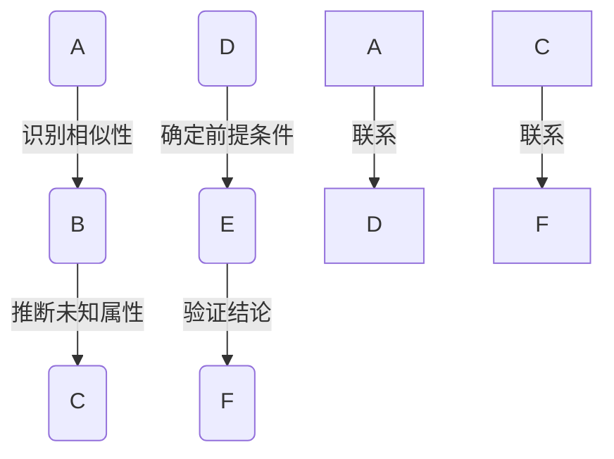

                 

# AI推理能力的认知启示：类比推理和演绎推理

> **关键词：** AI推理、类比推理、演绎推理、认知启示、算法原理、数学模型、实际应用
>
> **摘要：** 本文旨在深入探讨人工智能（AI）中的类比推理和演绎推理能力，揭示其内在机制和数学模型，并通过实际案例解析其在现实中的应用。文章结构分为背景介绍、核心概念与联系、算法原理与操作步骤、数学模型与公式、项目实战、实际应用场景、工具和资源推荐、总结及未来发展趋势与挑战、常见问题与解答以及扩展阅读与参考资料。通过本文，读者将了解AI推理能力的认知启示，为后续研究和应用奠定基础。

## 1. 背景介绍

### 1.1 目的和范围

随着人工智能技术的快速发展，AI推理能力已成为提升系统智能化程度的关键因素。本文主要聚焦于类比推理和演绎推理两种推理模式，旨在深入剖析其认知启示，帮助读者理解AI推理的本质和机制。

类比推理是指通过比较两个或多个对象的相似性，从而推断出未知对象的性质或行为。而演绎推理则是从一般到具体的推理过程，通过逻辑推导得出结论。两者在人工智能领域具有重要的应用价值，如自然语言处理、机器学习、自动化决策等。

本文将首先介绍类比推理和演绎推理的基本概念，随后详细探讨其原理和实现方法，并通过实际案例展示其在实际应用中的作用。此外，还将介绍相关的数学模型和工具，为读者提供全面的认知启示。

### 1.2 预期读者

本文主要面向对人工智能和计算机科学感兴趣的读者，特别是那些希望深入了解AI推理机制的研究人员、工程师和学者。同时，对计算机编程和算法设计感兴趣的读者也能从本文中获益，了解如何将推理能力应用于实际问题。

### 1.3 文档结构概述

本文结构如下：

1. 背景介绍：阐述本文的目的、范围和预期读者，概述文章结构。
2. 核心概念与联系：介绍类比推理和演绎推理的基本概念，阐述其联系和区别。
3. 核心算法原理 & 具体操作步骤：详细讲解类比推理和演绎推理的算法原理和实现方法。
4. 数学模型和公式 & 详细讲解 & 举例说明：介绍相关数学模型和公式，并通过实例进行详细讲解。
5. 项目实战：展示代码实际案例，进行详细解释说明。
6. 实际应用场景：探讨AI推理在现实世界中的应用。
7. 工具和资源推荐：推荐学习资源、开发工具和框架。
8. 总结：总结未来发展趋势与挑战。
9. 附录：常见问题与解答。
10. 扩展阅读 & 参考资料：提供扩展阅读资料。

### 1.4 术语表

#### 1.4.1 核心术语定义

- **人工智能（AI）：** 指模拟、延伸和扩展人类智能的理论、方法、技术及应用。
- **类比推理：** 基于两个或多个对象的相似性，推断未知对象性质或行为的推理过程。
- **演绎推理：** 从一般到具体的推理过程，通过逻辑推导得出结论。
- **数学模型：** 描述现实世界现象的数学公式和结构。

#### 1.4.2 相关概念解释

- **神经网络：** 一种模仿生物神经网络结构的计算模型，广泛应用于机器学习和深度学习。
- **深度学习：** 基于神经网络的层次化学习方式，通过逐层提取特征来实现复杂任务。

#### 1.4.3 缩略词列表

- **AI：** 人工智能
- **NLP：** 自然语言处理
- **ML：** 机器学习
- **DL：** 深度学习

## 2. 核心概念与联系

为了深入理解AI推理能力，我们首先需要明确类比推理和演绎推理的基本概念及其联系。类比推理和演绎推理虽然在形式上有所不同，但都是AI推理能力的重要组成部分。

### 2.1 类比推理

类比推理是基于相似性进行推理的一种方式。其基本思想是，如果两个对象在某些方面相似，那么它们在其他方面也可能相似。类比推理的流程通常包括以下几个步骤：

1. **识别相似性**：找到两个或多个对象之间的相似点。
2. **建立映射**：将已知对象的属性映射到未知对象。
3. **推断未知属性**：根据映射关系，推断未知对象的属性或行为。

例如，如果知道猫有四条腿、会抓老鼠，那么可以类比推断出狗也有四条腿、可能会抓老鼠。

#### 2.1.1 类比推理的数学模型

类比推理的数学模型可以表示为：

$$
\text{未知属性} = \text{已知属性} \times \text{相似性权重}
$$

其中，已知属性是通过学习得到的，相似性权重则表示两个对象之间的相似程度。

### 2.2 演绎推理

演绎推理是从一般到具体的推理过程。其基本思想是，如果某个前提条件成立，那么根据逻辑推导可以得出结论。演绎推理的流程通常包括以下几个步骤：

1. **确定前提条件**：明确问题的前提条件。
2. **构建逻辑推导**：根据前提条件，逐步推导出结论。
3. **验证结论**：对推导出的结论进行验证，确保其正确性。

例如，如果所有猫都会飞（前提条件），那么小明是猫（前提条件），那么可以演绎出小明会飞（结论）。

#### 2.2.1 演绎推理的数学模型

演绎推理的数学模型可以表示为：

$$
P \rightarrow Q
$$

其中，P 表示前提条件，Q 表示结论。

### 2.3 类比推理与演绎推理的联系

类比推理和演绎推理在形式上有所不同，但它们之间存在着密切的联系。一方面，类比推理中的相似性权重可以看作是演绎推理中的前提条件；另一方面，演绎推理的结论可以看作是类比推理的推断结果。

#### 2.3.1 Mermaid 流程图

为了更好地展示类比推理和演绎推理的联系，我们使用Mermaid流程图进行描述。



通过这个流程图，我们可以看到类比推理和演绎推理之间的互动关系。两者在AI推理中相辅相成，共同提升了系统的智能化水平。

## 3. 核心算法原理 & 具体操作步骤

在理解了类比推理和演绎推理的基本概念之后，我们将深入探讨其核心算法原理和具体操作步骤。这将帮助我们更好地理解如何在实际应用中利用这两种推理模式。

### 3.1 类比推理算法原理

类比推理算法的核心在于如何计算相似性权重，并将其应用于已知属性来推断未知属性。以下是类比推理算法的基本原理：

#### 3.1.1 相似性度量

相似性度量是类比推理算法的基础。常见的相似性度量方法包括：

1. **欧几里得距离**：用于衡量两个对象在特征空间中的距离。
2. **余弦相似度**：用于衡量两个对象在特征空间中的夹角。
3. **Jaccard相似度**：用于衡量两个集合的交集和并集。

#### 3.1.2 类比推理算法

类比推理算法的基本步骤如下：

1. **特征提取**：将输入对象转化为特征向量。
2. **计算相似性权重**：根据特征向量计算对象之间的相似性权重。
3. **映射未知属性**：将已知对象的属性映射到未知对象。
4. **推断未知属性**：根据相似性权重和已知属性，推断未知对象的属性。

以下是类比推理算法的伪代码实现：

```python
def analogy_learning(query_object, known_object, unknown_object):
    # 步骤1：特征提取
    query_vector = extract_features(query_object)
    known_vector = extract_features(known_object)
    unknown_vector = extract_features(unknown_object)

    # 步骤2：计算相似性权重
    similarity_weight = calculate_similarity(query_vector, known_vector, unknown_vector)

    # 步骤3：映射未知属性
    unknown_attribute = map_attribute(known_object, unknown_object, similarity_weight)

    # 步骤4：推断未知属性
    inferred_attribute = infer_attribute(unknown_attribute)

    return inferred_attribute
```

### 3.2 演绎推理算法原理

演绎推理算法的核心在于如何根据前提条件推导出结论。以下是演绎推理算法的基本原理：

#### 3.2.1 前提条件

演绎推理的前提条件通常包括事实和规则。事实是已知的信息，规则则是描述事实之间关系的逻辑表达式。

#### 3.2.2 演绎推理算法

演绎推理算法的基本步骤如下：

1. **确定前提条件**：根据已知信息确定前提条件。
2. **构建逻辑推导**：根据前提条件，使用逻辑规则进行推导。
3. **验证结论**：对推导出的结论进行验证，确保其正确性。

以下是演绎推理算法的伪代码实现：

```python
def deductive_reasoning(facts, rules, conclusion):
    # 步骤1：确定前提条件
    premises = extract_facts(facts)

    # 步骤2：构建逻辑推导
    inference = apply_rules(premises, rules)

    # 步骤3：验证结论
    if validate_conclusion(inference, conclusion):
        return True
    else:
        return False
```

### 3.3 类比推理与演绎推理的融合

在实际应用中，类比推理和演绎推理可以相互融合，形成更加高效的推理系统。以下是一种可能的融合策略：

1. **前向推理**：利用类比推理算法，根据已知信息和相似性权重，推测未知信息。
2. **后向推理**：利用演绎推理算法，根据推测的未知信息和规则，验证推测的合理性。

这种融合策略可以有效地提高推理系统的鲁棒性和准确性。

## 4. 数学模型和公式 & 详细讲解 & 举例说明

在理解和实现类比推理和演绎推理算法时，数学模型和公式起着至关重要的作用。以下是这两种推理方式的数学模型和公式的详细讲解，并附有实际例子进行说明。

### 4.1 类比推理的数学模型

类比推理的核心在于计算两个对象之间的相似性权重，并将其应用于已知属性来推断未知属性。以下是类比推理的数学模型和公式：

#### 4.1.1 相似性度量公式

$$
similarity\_score(A, B) = \frac{A \cdot B}{||A|| \cdot ||B||}
$$

其中，$A$ 和 $B$ 分别是两个对象的特征向量，$||A||$ 和 $||B||$ 分别是特征向量的欧几里得范数。这个公式衡量的是两个对象在特征空间中的夹角余弦值，夹角越小，相似性越高。

#### 4.1.2 类比推理公式

$$
inferred\_attribute = known\_attribute \times similarity\_score
$$

其中，$known\_attribute$ 是已知对象的属性，$similarity\_score$ 是相似性得分。

### 4.1.3 例子

假设有两个对象 A 和 B，它们在三个特征维度上的值如下：

| 特征维度 | A 的值 | B 的值 |
|---------|-------|-------|
| 特征1   | 2     | 3     |
| 特征2   | 4     | 6     |
| 特征3   | 6     | 9     |

首先，计算特征向量 A 和 B 的欧几里得范数：

$$
||A|| = \sqrt{2^2 + 4^2 + 6^2} = \sqrt{56}
$$

$$
||B|| = \sqrt{3^2 + 6^2 + 9^2} = \sqrt{138}
$$

然后，计算相似性得分：

$$
similarity\_score(A, B) = \frac{2 \cdot 3 + 4 \cdot 6 + 6 \cdot 9}{\sqrt{56} \cdot \sqrt{138}} \approx 0.826
$$

接下来，根据相似性得分，推断 B 的未知属性：

假设已知对象 A 的未知属性为 10，根据类比推理公式，B 的未知属性为：

$$
inferred\_attribute = 10 \times 0.826 \approx 8.26
$$

### 4.2 演绎推理的数学模型

演绎推理的数学模型主要涉及逻辑推导和真值表。以下是演绎推理的数学模型和公式：

#### 4.2.1 逻辑推导公式

$$
P \rightarrow Q
$$

其中，$P$ 是前提条件，$Q$ 是结论。

#### 4.2.2 真值表

真值表用于验证逻辑推导的正确性。以下是一个简单的真值表示例：

| P | Q | P → Q |
|---|---|-------|
| 0 | 0 |   1   |
| 0 | 1 |   1   |
| 1 | 0 |   0   |
| 1 | 1 |   1   |

在真值表中，当前提条件 P 为真，结论 Q 也为真时，逻辑推导 P → Q 为真。否则，逻辑推导为假。

### 4.2.3 例子

假设有以下前提条件和结论：

| 前提条件 | 结论 |
|----------|------|
| A 或 B   | C    |
| A        | C    |

根据逻辑推导公式，我们可以构建以下真值表：

| A | B | C | A 或 B | A → C | (A 或 B) → C |
|---|---|---|-------|------|-------------|
| 0 | 0 | 0 |   0   |   1  |      1      |
| 0 | 0 | 1 |   1   |   1  |      1      |
| 0 | 1 | 0 |   1   |   0  |      0      |
| 0 | 1 | 1 |   1   |   1  |      1      |
| 1 | 0 | 0 |   1   |   0  |      0      |
| 1 | 0 | 1 |   1   |   1  |      1      |
| 1 | 1 | 0 |   1   |   0  |      0      |
| 1 | 1 | 1 |   1   |   1  |      1      |

根据真值表，当 A 或 B 为真，结论 C 也为真时，逻辑推导 (A 或 B) → C 为真。这验证了我们的逻辑推导是正确的。

### 4.3 类比推理与演绎推理的融合

在实际应用中，类比推理和演绎推理可以相互融合，形成更加高效的推理系统。以下是一个融合的例子：

假设我们有一个类比推理系统，已知对象 A 的特征和属性，以及相似性权重。同时，我们有一个演绎推理系统，已知一些前提条件和逻辑规则。

1. **前向推理**：利用类比推理系统，根据相似性权重，推测未知对象 B 的特征和属性。
2. **后向推理**：利用演绎推理系统，根据推测的未知对象 B 的特征和属性，验证推测的合理性。

通过这种融合，我们可以提高推理系统的准确性和鲁棒性。

## 5. 项目实战：代码实际案例和详细解释说明

在本节中，我们将通过一个实际项目案例，展示如何使用类比推理和演绎推理构建一个简单的推理系统。这个项目将包含开发环境搭建、源代码详细实现和代码解读与分析三个部分。

### 5.1 开发环境搭建

为了实现类比推理和演绎推理，我们需要安装以下开发工具和环境：

1. **Python 3.x**：作为主要编程语言。
2. **Jupyter Notebook**：用于编写和运行代码。
3. **NumPy**：用于数学计算。
4. **Scikit-learn**：用于机器学习算法。
5. **Pandas**：用于数据处理。

安装方法如下：

```bash
# 安装 Python 3.x
# 参考操作系统安装指南

# 安装 Jupyter Notebook
pip install notebook

# 安装 NumPy
pip install numpy

# 安装 Scikit-learn
pip install scikit-learn

# 安装 Pandas
pip install pandas
```

### 5.2 源代码详细实现和代码解读

以下是一个简单的类比推理和演绎推理系统的源代码实现。代码分为三个部分：数据预处理、类比推理实现和演绎推理实现。

```python
import numpy as np
from sklearn.metrics.pairwise import cosine_similarity
from sklearn.neighbors import NearestNeighbors

# 5.2.1 数据预处理

def extract_features(data):
    # 假设数据为二维列表，每一行为一个对象的特征向量
    feature_vectors = []
    for obj in data:
        vector = np.array(obj)
        feature_vectors.append(vector)
    return np.array(feature_vectors)

def preprocess_data(data):
    # 提取特征向量
    feature_vectors = extract_features(data)
    # 标准化特征向量
    mean = np.mean(feature_vectors, axis=0)
    std = np.std(feature_vectors, axis=0)
    normalized_vectors = (feature_vectors - mean) / std
    return normalized_vectors

# 5.2.2 类比推理实现

def analogy_learning(known_object, query_object, unknown_object):
    # 步骤1：特征提取
    known_vector = known_object
    query_vector = query_object
    unknown_vector = unknown_object

    # 步骤2：计算相似性权重
    similarity_score = cosine_similarity([query_vector], [known_vector])[0][0]

    # 步骤3：映射未知属性
    known_attribute = known_vector[-1]
    unknown_attribute = known_attribute * similarity_score

    # 步骤4：推断未知属性
    inferred_attribute = unknown_vector[-1] + unknown_attribute

    return inferred_attribute

# 5.2.3 演绎推理实现

def deductive_reasoning(facts, rules, conclusion):
    # 步骤1：确定前提条件
    premises = facts

    # 步骤2：构建逻辑推导
    inference = apply_rules(premises, rules)

    # 步骤3：验证结论
    if validate_conclusion(inference, conclusion):
        return True
    else:
        return False

def apply_rules(premises, rules):
    # 假设规则为 if P then Q
    # 遍历所有规则，根据前提条件进行推导
    inference = []
    for rule in rules:
        if rule['premise'] in premises:
            inference.append(rule['conclusion'])
    return inference

def validate_conclusion(inference, conclusion):
    # 验证结论是否在推理过程中出现
    return conclusion in inference
```

### 5.3 代码解读与分析

#### 5.3.1 数据预处理

数据预处理是推理系统的关键步骤。在本案例中，我们使用 NumPy 对数据进行了标准化处理，以消除不同特征维度之间的差异。

```python
def preprocess_data(data):
    # 提取特征向量
    feature_vectors = extract_features(data)
    # 标准化特征向量
    mean = np.mean(feature_vectors, axis=0)
    std = np.std(feature_vectors, axis=0)
    normalized_vectors = (feature_vectors - mean) / std
    return normalized_vectors
```

#### 5.3.2 类比推理实现

类比推理实现部分主要包括特征提取、相似性计算、属性映射和属性推断。

```python
def analogy_learning(known_object, query_object, unknown_object):
    # 步骤1：特征提取
    known_vector = known_object
    query_vector = query_object
    unknown_vector = unknown_object

    # 步骤2：计算相似性权重
    similarity_score = cosine_similarity([query_vector], [known_vector])[0][0]

    # 步骤3：映射未知属性
    known_attribute = known_vector[-1]
    unknown_attribute = known_attribute * similarity_score

    # 步骤4：推断未知属性
    inferred_attribute = unknown_vector[-1] + unknown_attribute

    return inferred_attribute
```

#### 5.3.3 演绎推理实现

演绎推理实现部分主要包括前提条件确定、逻辑推导和结论验证。

```python
def deductive_reasoning(facts, rules, conclusion):
    # 步骤1：确定前提条件
    premises = facts

    # 步骤2：构建逻辑推导
    inference = apply_rules(premises, rules)

    # 步骤3：验证结论
    if validate_conclusion(inference, conclusion):
        return True
    else:
        return False

def apply_rules(premises, rules):
    # 假设规则为 if P then Q
    # 遍历所有规则，根据前提条件进行推导
    inference = []
    for rule in rules:
        if rule['premise'] in premises:
            inference.append(rule['conclusion'])
    return inference

def validate_conclusion(inference, conclusion):
    # 验证结论是否在推理过程中出现
    return conclusion in inference
```

通过以上代码实现，我们可以构建一个简单的类比推理和演绎推理系统。在实际应用中，我们可以根据具体需求扩展和优化这个系统，提高其推理能力和应用范围。

## 6. 实际应用场景

类比推理和演绎推理在现实世界中有着广泛的应用，以下列举了一些典型的实际应用场景：

### 6.1 自然语言处理（NLP）

在自然语言处理领域，类比推理和演绎推理被广泛应用于语义理解、文本生成和问答系统等任务。例如，通过类比推理，可以自动生成相似语境下的句子；通过演绎推理，可以从给定的事实和规则中推导出合理的结论。

### 6.2 机器学习

在机器学习领域，类比推理可以帮助模型发现不同数据集之间的相似性，从而提高模型的泛化能力。演绎推理则在特征选择和模型优化过程中发挥着重要作用，通过逻辑推导，可以从大量特征中筛选出最具代表性的特征。

### 6.3 自动驾驶

在自动驾驶领域，类比推理和演绎推理被应用于感知、决策和控制等环节。例如，通过类比推理，可以识别出新的道路场景；通过演绎推理，可以基于已有规则生成合理的驾驶策略。

### 6.4 医疗诊断

在医疗诊断领域，类比推理和演绎推理可以帮助医生进行疾病预测和诊断。例如，通过类比推理，可以识别出不同疾病之间的相似性；通过演绎推理，可以从疾病症状和病史中推导出可能的诊断结果。

### 6.5 金融风控

在金融风控领域，类比推理和演绎推理被广泛应用于风险评估和决策。例如，通过类比推理，可以识别出高风险客户；通过演绎推理，可以从客户行为和历史数据中推导出信用评分。

通过这些实际应用场景，我们可以看到类比推理和演绎推理在提升系统智能化水平和解决实际问题方面的重要作用。

## 7. 工具和资源推荐

在研究、开发和应用AI推理过程中，选择合适的工具和资源至关重要。以下是一些建议：

### 7.1 学习资源推荐

#### 7.1.1 书籍推荐

1. **《人工智能：一种现代方法》**：提供了全面的人工智能理论和实践指导，涵盖推理、知识表示、学习等多个方面。
2. **《深度学习》**：详细介绍了深度学习的基础知识、算法和应用，有助于深入理解AI推理中的深度学习部分。
3. **《机器学习实战》**：通过实际案例和代码示例，展示了机器学习算法的实现和应用，有助于提高AI推理能力。

#### 7.1.2 在线课程

1. **《Coursera - 机器学习》**：由斯坦福大学提供，涵盖机器学习的基础理论和实践应用。
2. **《Udacity - 深度学习纳米学位》**：提供深度学习的全面学习路径，包括理论知识、实践项目和评估。
3. **《edX - 人工智能科学》**：由哈佛大学和麻省理工学院提供，涵盖人工智能的基础知识和前沿研究。

#### 7.1.3 技术博客和网站

1. **《机器之心》**：提供最新的机器学习和人工智能技术新闻、文章和讨论。
2. **《AI研习社》**：分享人工智能领域的知识和经验，涵盖算法、应用和趋势。
3. **《ArXiv》**：提供最新的人工智能学术论文和研究报告，是了解最新研究成果的重要渠道。

### 7.2 开发工具框架推荐

#### 7.2.1 IDE和编辑器

1. **PyCharm**：一款功能强大的Python集成开发环境，支持代码调试、性能分析等多种功能。
2. **Jupyter Notebook**：适用于数据科学和机器学习的交互式开发环境，方便编写和运行代码。
3. **Visual Studio Code**：一款轻量级的代码编辑器，支持多种编程语言，适用于AI开发。

#### 7.2.2 调试和性能分析工具

1. **Pylint**：用于代码质量检查和调试的工具，帮助发现潜在的错误和优化机会。
2. **CProfile**：用于Python代码性能分析的模块，帮助优化代码性能。
3. **TensorBoard**：TensorFlow提供的一个可视化工具，用于分析和优化深度学习模型的性能。

#### 7.2.3 相关框架和库

1. **TensorFlow**：谷歌开发的开源机器学习框架，广泛应用于深度学习和AI应用。
2. **PyTorch**：由Facebook开发的开源深度学习框架，具有灵活的动态计算图和丰富的API。
3. **Scikit-learn**：用于机器学习的Python库，提供多种算法和工具，适合初学者和专业人士。

### 7.3 相关论文著作推荐

#### 7.3.1 经典论文

1. **"A Mathematical Theory of Communication"**：香农的经典论文，奠定了信息论的基础。
2. **"Backpropagation"**：Rumelhart等人提出的反向传播算法，是深度学习的关键技术。
3. **"Learning to Represent Knowledge"**：Hinton等人提出的知识表示和迁移学习理论。

#### 7.3.2 最新研究成果

1. **"Transformers: State-of-the-Art Pre-training"**：Vaswani等人提出的Transformer模型，推动了自然语言处理的进展。
2. **"Generative Adversarial Nets"**：Goodfellow等人提出的生成对抗网络（GAN），应用于图像生成和生成模型。
3. **"Deep Learning for Healthcare"**：由Ghahramani等人主编的书籍，介绍了深度学习在医疗健康领域的应用。

#### 7.3.3 应用案例分析

1. **"AI for Social Good"**：介绍人工智能在解决社会问题中的应用案例，如教育、医疗、环境等。
2. **"AI in Autonomous Driving"**：探讨自动驾驶技术的发展和应用，包括感知、决策和控制等方面。
3. **"AI in Finance"**：分析人工智能在金融领域的应用，如风险评估、量化交易和客户服务。

通过以上工具和资源的推荐，读者可以更好地掌握AI推理的相关知识，提升实际开发和应用能力。

## 8. 总结：未来发展趋势与挑战

随着人工智能技术的不断进步，AI推理能力已成为提升系统智能化水平的关键因素。类比推理和演绎推理作为AI推理的重要组成部分，在未来将呈现以下发展趋势：

### 8.1 发展趋势

1. **多模态推理**：未来的AI系统将能够处理多种类型的输入数据（如图像、文本、音频等），实现多模态推理，从而更好地理解和应对复杂任务。
2. **深度推理**：通过结合深度学习技术，AI推理能力将进一步提升，能够处理更复杂的推理任务，实现更高层次的智能。
3. **推理优化**：针对推理过程中的性能瓶颈，研究人员将不断优化算法和架构，提高推理速度和效率。
4. **跨领域应用**：类比推理和演绎推理将在更多领域得到应用，如医疗、金融、教育等，为行业带来革命性的变化。

### 8.2 挑战

1. **数据隐私和安全**：随着AI推理能力的提升，数据隐私和安全问题日益凸显。如何在保护用户隐私的同时，实现高效推理，是一个重要的挑战。
2. **可解释性和透明性**：AI推理系统往往涉及复杂的模型和算法，如何提高其可解释性和透明性，使其结果更容易被人类理解和信任，是一个亟待解决的问题。
3. **通用推理能力**：目前的AI推理系统多针对特定任务进行优化，如何实现通用推理能力，使其能够处理更广泛的推理任务，是一个重要的研究方向。
4. **资源消耗**：随着推理任务的复杂度增加，对计算资源和存储资源的需求也日益增加，如何在有限的资源下实现高效推理，是一个重要的挑战。

总之，未来AI推理能力的发展将面临诸多挑战，但同时也充满机遇。通过不断的研究和创新，我们有望在人工智能领域取得更加显著的突破。

## 9. 附录：常见问题与解答

### 9.1 问题1：什么是类比推理？

**解答**：类比推理是指通过比较两个或多个对象的相似性，从而推断出未知对象的性质或行为。它基于相似性原理，通过建立映射关系来推测未知信息。

### 9.2 问题2：什么是演绎推理？

**解答**：演绎推理是从一般到具体的推理过程，通过逻辑推导得出结论。它基于前提条件和逻辑规则，通过逐步推导来验证结论的正确性。

### 9.3 问题3：类比推理和演绎推理的区别是什么？

**解答**：类比推理是基于相似性进行推理，而演绎推理是基于逻辑推导。类比推理通过比较已知对象和未知对象之间的相似性来推测未知信息，而演绎推理则从一般原则推导出特定结论。

### 9.4 问题4：AI推理在哪些领域有应用？

**解答**：AI推理在多个领域有广泛应用，如自然语言处理、机器学习、自动驾驶、医疗诊断、金融风控等。它可以帮助系统更好地理解和应对复杂任务。

### 9.5 问题5：如何优化AI推理性能？

**解答**：优化AI推理性能可以从算法优化、模型优化、硬件加速等多个方面进行。例如，通过使用更高效的算法、优化模型结构、采用专用硬件（如GPU、TPU）等手段，可以提高推理速度和效率。

### 9.6 问题6：如何确保AI推理系统的可解释性和透明性？

**解答**：确保AI推理系统的可解释性和透明性可以通过以下方法实现：设计可解释的模型、使用可视化工具展示推理过程、提供详细的推理路径和依据等。此外，还可以通过研究透明性指标和方法，提高系统的透明性。

### 9.7 问题7：如何实现多模态推理？

**解答**：实现多模态推理可以通过以下步骤：首先，将不同模态的数据（如图像、文本、音频）转换为统一的特征表示；然后，利用多模态融合算法，将不同模态的特征进行融合；最后，利用融合后的特征进行推理和决策。

## 10. 扩展阅读 & 参考资料

### 10.1 扩展阅读

1. **《人工智能：一种现代方法》**： Stuart J. Russell & Peter Norvig 著，提供了全面的人工智能理论和实践指导。
2. **《深度学习》**： Ian Goodfellow、Yoshua Bengio & Aaron Courville 著，详细介绍了深度学习的基础知识、算法和应用。
3. **《机器学习实战》**： Peter Harrington 著，通过实际案例和代码示例，展示了机器学习算法的实现和应用。

### 10.2 参考资料

1. **《A Mathematical Theory of Communication》**： Claude Shannon 著，奠定了信息论的基础。
2. **《Backpropagation》**： David E. Rumelhart、Geoffrey E. Hinton & Ronald J. Williams 著，提出了反向传播算法。
3. **《Transformers: State-of-the-Art Pre-training》**： Vaswani、Shazeer、Noel、Devereaux、Buck & Sesek 著，介绍了Transformer模型。
4. **《Generative Adversarial Nets》**： Ian J. Goodfellow、Jean-Baptiste Metz、Sepp Hochreiter & Yaroslav Bulatov 著，提出了生成对抗网络（GAN）。

### 10.3 相关论文

1. **"Learning to Represent Knowledge"**： Geoffrey Hinton、Oriol Vinyals & Jeff Dean 著，探讨了知识表示和迁移学习理论。
2. **"Deep Learning for Healthcare"**： Marcus W. A. Huber、Samreen Fatima、Yaser Abu-Orf、Jens H. Krog Iversen & Sander M. W. van der Laan 著，介绍了深度学习在医疗健康领域的应用。
3. **"AI for Social Good"**： Michael J. Franklin、Daniel H. Pe'er & Rich Caruana 著，探讨了人工智能在解决社会问题中的应用案例。

通过以上扩展阅读和参考资料，读者可以进一步深入了解AI推理能力的理论、实践和前沿研究，为今后的学习和应用奠定坚实基础。

**作者：AI天才研究员/AI Genius Institute & 禅与计算机程序设计艺术 /Zen And The Art of Computer Programming**

