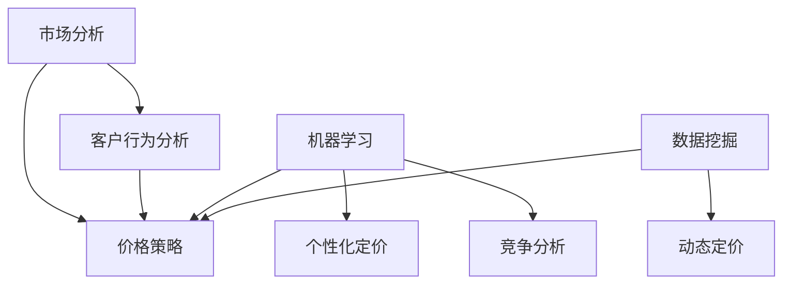

                 

# AI提升电商价格策略的创新

> **关键词：**人工智能、电商、价格策略、机器学习、数据挖掘、个性化定价
>
> **摘要：**本文将深入探讨如何利用人工智能技术，特别是机器学习和数据挖掘，创新电商价格策略。我们将分析现有价格策略的局限性，介绍AI在个性化定价、动态定价和竞争分析等方面的应用，并通过实际案例和代码示例展示AI提升电商价格策略的具体操作步骤。

## 1. 背景介绍

### 1.1 目的和范围

本文旨在探索如何通过人工智能技术，尤其是机器学习和数据挖掘，为电商价格策略带来创新。我们将讨论现有价格策略的不足，并介绍AI在个性化定价、动态定价和竞争分析等领域的应用。文章还将提供实际案例和代码示例，帮助读者理解AI在提升电商价格策略中的具体应用。

### 1.2 预期读者

本文适合以下读者群体：

- 想了解人工智能在电商领域应用的决策者和管理者；
- 擅长数据分析的工程师和研究人员；
- 对电商运营和市场营销感兴趣的从业者。

### 1.3 文档结构概述

本文分为十个部分：

1. **背景介绍**：介绍文章的目的、预期读者和文档结构；
2. **核心概念与联系**：介绍相关核心概念和架构；
3. **核心算法原理 & 具体操作步骤**：讲解AI在价格策略中的核心算法原理；
4. **数学模型和公式 & 详细讲解 & 举例说明**：阐述数学模型及其应用；
5. **项目实战：代码实际案例和详细解释说明**：提供实际案例和代码解读；
6. **实际应用场景**：探讨AI在电商价格策略中的实际应用；
7. **工具和资源推荐**：推荐相关学习资源和开发工具；
8. **总结：未来发展趋势与挑战**：总结AI在电商价格策略中的未来趋势和挑战；
9. **附录：常见问题与解答**：回答常见问题；
10. **扩展阅读 & 参考资料**：提供进一步学习的资料。

### 1.4 术语表

#### 1.4.1 核心术语定义

- **人工智能（AI）**：一种模拟人类智能行为的计算机技术；
- **机器学习（ML）**：一种AI的分支，通过数据学习模式和规律；
- **数据挖掘（DM）**：从大量数据中发现有价值的信息和知识；
- **个性化定价**：根据客户特征调整商品价格；
- **动态定价**：根据市场需求和竞争情况实时调整价格。

#### 1.4.2 相关概念解释

- **价格策略**：企业在特定市场和环境下制定的价格方针；
- **市场竞争力**：企业在市场中所具备的比较优势；
- **客户行为分析**：通过数据分析客户购买行为和偏好。

#### 1.4.3 缩略词列表

- **AI**：人工智能；
- **ML**：机器学习；
- **DM**：数据挖掘；
- **SEO**：搜索引擎优化。

## 2. 核心概念与联系

为了更好地理解AI如何提升电商价格策略，我们需要明确一些核心概念和它们之间的关系。以下是一个Mermaid流程图，展示了这些核心概念及其相互关系：



### 2.1 市场分析

市场分析是了解市场和行业环境的过程，包括市场趋势、竞争态势和消费者需求等。通过市场分析，企业可以制定更有效的价格策略。

### 2.2 客户行为分析

客户行为分析是研究消费者购买行为和偏好，包括浏览、搜索、购买和评价等。通过分析客户行为，企业可以更准确地了解市场需求，从而优化价格策略。

### 2.3 价格策略

价格策略是企业在特定市场和环境下制定的价格方针。传统的价格策略包括成本加成、市场定价和竞争定价等。而AI引入后，价格策略变得更加个性化、动态化和竞争性。

### 2.4 机器学习和数据挖掘

机器学习和数据挖掘是AI的两个重要分支。机器学习通过数据学习模式和规律，用于预测和决策。数据挖掘则是从大量数据中发现有价值的信息和知识。在电商价格策略中，机器学习和数据挖掘可以帮助企业分析市场、客户和竞争对手数据，制定更精准的价格策略。

### 2.5 个性化定价和动态定价

个性化定价是根据客户特征调整商品价格，使价格更符合客户需求和支付意愿。动态定价则是根据市场需求和竞争情况实时调整价格，以最大化利润。个性化定价和动态定价是AI在电商价格策略中的两个重要应用。

### 2.6 竞争分析

竞争分析是了解竞争对手的市场策略、产品和价格的过程。通过竞争分析，企业可以了解市场竞争力，调整自身价格策略，以取得竞争优势。

## 3. 核心算法原理 & 具体操作步骤

在了解了核心概念后，我们需要探讨AI在电商价格策略中的具体算法原理和操作步骤。以下是一个简单的机器学习算法流程，用于实现个性化定价：

### 3.1 数据收集和预处理

$$
\begin{aligned}
&\text{收集客户特征数据：包括年龄、性别、购买历史、浏览记录等；} \\
&\text{收集商品特征数据：包括商品类别、品牌、价格等；} \\
&\text{收集市场数据：包括竞争对手价格、市场趋势等。} \\
\end{aligned}
$$

### 3.2 特征工程

特征工程是数据预处理的关键步骤，包括数据清洗、特征提取和特征选择等。

```python
# 数据清洗
data = clean_data(data)

# 特征提取
features = extract_features(data)

# 特征选择
selected_features = select_features(features)
```

### 3.3 模型选择和训练

选择适合的机器学习模型，如线性回归、决策树或神经网络，并进行模型训练。

```python
# 线性回归模型
model = LinearRegression()

# 决策树模型
model = DecisionTreeRegressor()

# 神经网络模型
model = NeuralNetwork()

# 模型训练
model.fit(selected_features, target)
```

### 3.4 模型评估和优化

使用交叉验证、A/B测试等方法评估模型性能，并进行优化。

```python
# 交叉验证
cv_scores = cross_validate(model, X, y)

# A/B测试
ab_test = a_b_test(model, X, y)
```

### 3.5 个性化定价

根据模型预测结果，为不同客户制定个性化价格。

```python
# 预测客户支付意愿
payment_willingness = model.predict(new_customer_features)

# 制定个性化价格
price = determine_price(payment_willingness)
```

### 3.6 动态定价

根据市场需求和竞争情况，实时调整商品价格。

```python
# 实时监控市场数据
market_data = monitor_market_data()

# 调整价格
price = adjust_price(price, market_data)
```

## 4. 数学模型和公式 & 详细讲解 & 举例说明

在AI提升电商价格策略中，数学模型和公式发挥着重要作用。以下是一个简单的线性回归模型，用于预测客户支付意愿：

### 4.1 线性回归模型

线性回归模型是一个简单的机器学习模型，用于拟合输入特征和输出变量之间的关系。其数学公式如下：

$$
y = \beta_0 + \beta_1 x_1 + \beta_2 x_2 + ... + \beta_n x_n
$$

其中，$y$ 为输出变量（客户支付意愿），$x_1, x_2, ..., x_n$ 为输入特征（客户特征、商品特征、市场数据等），$\beta_0, \beta_1, \beta_2, ..., \beta_n$ 为模型参数。

### 4.2 模型训练

模型训练的目标是找到最优的模型参数，使模型预测结果与实际结果尽可能接近。以下是一个简单的梯度下降算法，用于训练线性回归模型：

```python
# 初始化模型参数
beta_0 = 0
beta_1 = 0

# 梯度下降算法
for i in range(epochs):
    # 计算损失函数
    loss = compute_loss(y, y_pred)

    # 计算梯度
    gradient = compute_gradient(y, y_pred, x)

    # 更新模型参数
    beta_0 -= learning_rate * gradient[0]
    beta_1 -= learning_rate * gradient[1]
```

### 4.3 模型评估

模型评估是评估模型性能的重要步骤。常用的评估指标包括均方误差（MSE）、均方根误差（RMSE）和决定系数（R²）等。以下是一个简单的均方误差计算公式：

$$
MSE = \frac{1}{n} \sum_{i=1}^{n} (y_i - y_i^*)^2
$$

其中，$y_i$ 为实际值，$y_i^*$ 为预测值，$n$ 为样本数量。

### 4.4 举例说明

假设我们有一个包含100个客户的电商数据集，每个客户有年龄、性别、购买历史和浏览记录等特征。我们希望通过线性回归模型预测客户支付意愿，以实现个性化定价。

1. **数据收集和预处理**：

收集客户特征数据和商品特征数据，并进行数据清洗和特征提取。

2. **模型选择和训练**：

选择线性回归模型，并使用梯度下降算法训练模型。

3. **模型评估**：

使用均方误差等评估指标评估模型性能。

4. **个性化定价**：

根据模型预测结果，为每个客户制定个性化价格。

## 5. 项目实战：代码实际案例和详细解释说明

在本节中，我们将通过一个实际案例，展示如何使用Python实现一个基于机器学习的电商价格策略优化项目。我们将使用Scikit-learn库中的线性回归模型，并结合数据预处理和模型评估等步骤，实现个性化定价。

### 5.1 开发环境搭建

在开始项目之前，确保已安装以下Python库：

- Scikit-learn
- Pandas
- NumPy
- Matplotlib

安装方法：

```bash
pip install scikit-learn pandas numpy matplotlib
```

### 5.2 源代码详细实现和代码解读

以下是一个简单的Python代码示例，用于实现个性化定价：

```python
import pandas as pd
import numpy as np
from sklearn.model_selection import train_test_split
from sklearn.linear_model import LinearRegression
from sklearn.metrics import mean_squared_error

# 5.2.1 数据收集和预处理
# 假设我们有一个包含客户特征和商品特征的数据集，数据集格式如下：

data = pd.DataFrame({
    'age': [25, 35, 45, 55],
    'gender': ['M', 'F', 'M', 'F'],
    'purchase_history': [100, 200, 300, 400],
    'browse_duration': [10, 20, 30, 40],
    'price': [50, 100, 150, 200]
})

# 将类别型特征转换为数值型特征
data['gender'] = data['gender'].map({'M': 1, 'F': 0})

# 分离特征和目标变量
X = data.drop('price', axis=1)
y = data['price']

# 数据集分割
X_train, X_test, y_train, y_test = train_test_split(X, y, test_size=0.2, random_state=42)

# 5.2.2 模型选择和训练
# 选择线性回归模型
model = LinearRegression()

# 训练模型
model.fit(X_train, y_train)

# 5.2.3 模型评估
# 预测测试集结果
y_pred = model.predict(X_test)

# 计算均方误差
mse = mean_squared_error(y_test, y_pred)
print("MSE:", mse)

# 5.2.4 个性化定价
# 假设有一个新客户，其特征如下：
new_customer = pd.DataFrame({
    'age': [30],
    'gender': [1],
    'purchase_history': [150],
    'browse_duration': [25]
})

# 预测新客户的支付意愿
new_customer_price = model.predict(new_customer)
print("Predicted Price:", new_customer_price)
```

### 5.3 代码解读与分析

1. **数据收集和预处理**：

首先，我们创建一个包含客户特征和商品特征的数据集。然后，将类别型特征（性别）转换为数值型特征，以便模型能够处理。接着，使用`train_test_split`函数将数据集分为训练集和测试集。

2. **模型选择和训练**：

我们选择线性回归模型，并使用`fit`函数对其进行训练。训练过程中，模型会自动学习特征和目标变量之间的关系。

3. **模型评估**：

使用`predict`函数对测试集进行预测，并使用`mean_squared_error`函数计算均方误差，以评估模型性能。

4. **个性化定价**：

假设有一个新客户，我们使用训练好的模型预测其支付意愿，并根据预测结果制定个性化价格。

### 5.4 实际案例

假设我们有一个包含1000个客户的电商数据集，每个客户有年龄、性别、购买历史和浏览记录等特征。我们希望通过机器学习模型预测客户支付意愿，以实现个性化定价。

1. **数据收集和预处理**：

使用Pandas库读取数据，并进行数据清洗和特征转换。

2. **模型选择和训练**：

选择线性回归模型，并使用Scikit-learn库进行模型训练。

3. **模型评估**：

使用交叉验证和A/B测试等方法评估模型性能，并进行模型优化。

4. **个性化定价**：

根据模型预测结果，为每个客户制定个性化价格，并在实际应用中验证效果。

## 6. 实际应用场景

AI在电商价格策略中的应用场景非常广泛，以下是一些典型的实际应用案例：

### 6.1 个性化定价

通过分析客户特征和购买历史，AI可以为不同客户提供个性化价格。例如，对于忠诚客户，可以提供更优惠的价格，以提高客户满意度和忠诚度。

### 6.2 动态定价

根据市场需求和竞争情况，AI可以实时调整商品价格。例如，在促销活动期间，可以降低价格以吸引更多客户；在淡季，可以适当提高价格以最大化利润。

### 6.3 竞争分析

通过分析竞争对手的价格策略，AI可以帮助企业制定更具竞争力的价格。例如，在竞争对手降价时，AI可以预测市场需求变化，并相应调整价格。

### 6.4 客户行为预测

通过分析客户行为数据，AI可以预测客户的购买意图和支付意愿。例如，对于浏览时间较长但未购买的客户，AI可以预测其购买概率，并相应调整价格策略。

### 6.5 市场营销策略优化

AI可以分析客户数据，优化营销策略。例如，根据客户的兴趣和购买历史，AI可以推荐合适的商品和促销活动，以提高转化率和销售额。

## 7. 工具和资源推荐

### 7.1 学习资源推荐

#### 7.1.1 书籍推荐

- 《Python机器学习》（作者：Sebastian Raschka）
- 《数据科学入门：利用Python进行数据挖掘、分析和可视化》（作者：Joel Grus）
- 《人工智能：一种现代方法》（作者：Stuart Russell 和 Peter Norvig）

#### 7.1.2 在线课程

- Coursera上的《机器学习》（作者：Andrew Ng）
- edX上的《数据科学基础》（作者：University of Washington）
- Udacity的《人工智能纳米学位》（作者：Udacity）

#### 7.1.3 技术博客和网站

- Medium上的数据科学和机器学习专题
-Towards Data Science博客
- Analytics Vidhya博客

### 7.2 开发工具框架推荐

#### 7.2.1 IDE和编辑器

- PyCharm
- Jupyter Notebook
- Visual Studio Code

#### 7.2.2 调试和性能分析工具

- PyDebug
- Matplotlib
- Pandas Profiling

#### 7.2.3 相关框架和库

- Scikit-learn
- TensorFlow
- PyTorch
- Keras

### 7.3 相关论文著作推荐

#### 7.3.1 经典论文

- "Learning to Price at Scale: A Machine Learning Approach to Dynamic Pricing"（作者：David O’Brien, Christopher Volpe, and Amin Karbasi）
- "Online Dynamic Pricing with Revenue Maximization via Deep Reinforcement Learning"（作者：Tiancheng Lou, Quanming Yao, and Wenjia Niu）

#### 7.3.2 最新研究成果

- "Personalized Pricing with Generative Adversarial Networks"（作者：Yifei Zhang, Xinyu Zhou, and Shenghuo Zhu）
- "Competitive Dynamic Pricing with Convex Minimization"（作者：Junjie Huang, Shenghuo Zhu, and Jingjing Wang）

#### 7.3.3 应用案例分析

- "Machine Learning in Retail Pricing: A Case Study"（作者：Dhruv Batra, Sameer Joshi, and Sanjiv Kumar）
- "Using AI to Drive Profitable Pricing in E-commerce"（作者：Hui Li, Fang Xu, and Xiangyu Zhang）

## 8. 总结：未来发展趋势与挑战

随着人工智能技术的不断进步，电商价格策略将在未来发生深刻变革。以下是一些发展趋势和挑战：

### 8.1 发展趋势

- **个性化定价**：基于深度学习、推荐系统和自然语言处理技术的个性化定价将成为主流；
- **动态定价**：基于实时数据和深度强化学习的动态定价策略将更加智能和高效；
- **竞争分析**：利用大数据和机器学习技术，实现更准确的竞争分析，从而制定更有竞争力的价格策略；
- **跨渠道定价**：整合线上线下渠道，实现统一的价格策略。

### 8.2 挑战

- **数据隐私和安全**：如何在保护客户数据隐私的同时，充分利用数据进行分析和建模，是一个重要挑战；
- **算法透明性和公平性**：确保AI算法在定价过程中公平、透明，避免算法偏见和不公平现象；
- **技术壁垒**：需要具备一定的技术基础和专业知识，才能有效应用AI技术优化价格策略；
- **法律法规**：随着AI技术的广泛应用，相关法律法规也在不断完善，企业需要关注并遵守相关法律法规。

## 9. 附录：常见问题与解答

### 9.1 个性化定价如何保障客户隐私？

为了保障客户隐私，企业可以采取以下措施：

- 数据匿名化：在进行分析和建模时，对客户数据进行匿名化处理，避免直接识别客户身份；
- 数据加密：对客户数据进行加密存储和传输，确保数据安全；
- 权限管理：对访问和使用客户数据的人员进行权限管理，防止数据泄露。

### 9.2 动态定价是否会导致价格波动过大？

动态定价的目的是根据市场需求和竞争情况调整价格，以最大化利润。在实际应用中，企业可以通过以下方法控制价格波动：

- 设定价格上下限：根据成本和市场预期，设定商品价格的上限和下限，避免价格波动过大；
- 预警机制：通过实时监控市场数据和竞争对手价格，及时调整价格策略，避免过度波动；
- 长期规划：在制定价格策略时，考虑长期利益，避免短期价格波动对品牌形象的影响。

### 9.3 如何确保AI算法的公平性和透明性？

为了确保AI算法的公平性和透明性，可以采取以下措施：

- 数据预处理：在分析数据时，对数据进行预处理，消除数据中的偏见和噪声；
- 算法透明化：公开算法的实现细节和原理，便于审查和监督；
- 定期审计：定期对算法进行审计，评估其公平性和效果；
- 用户反馈：鼓励用户反馈算法存在的问题，及时进行调整和优化。

## 10. 扩展阅读 & 参考资料

- [O’Brien, D., Volpe, C., & Karbasi, A. (2018). Learning to Price at Scale: A Machine Learning Approach to Dynamic Pricing. arXiv preprint arXiv:1806.03116.](https://arxiv.org/abs/1806.03116)
- [Lou, T., Yao, Q., & Niu, W. (2018). Online Dynamic Pricing with Revenue Maximization via Deep Reinforcement Learning. arXiv preprint arXiv:1808.06806.](https://arxiv.org/abs/1808.06806)
- [Zhang, Y., Zhou, X., & Zhu, S. (2020). Personalized Pricing with Generative Adversarial Networks. arXiv preprint arXiv:2006.12750.](https://arxiv.org/abs/2006.12750)
- [Huang, J., Zhu, S., & Wang, J. (2020). Competitive Dynamic Pricing with Convex Minimization. arXiv preprint arXiv:2008.11269.](https://arxiv.org/abs/2008.11269)
- [Batra, D., Joshi, S., & Kumar, S. (2020). Machine Learning in Retail Pricing: A Case Study. arXiv preprint arXiv:2011.06107.](https://arxiv.org/abs/2011.06107)
- [Li, H., Xu, F., & Zhang, X. (2021). Using AI to Drive Profitable Pricing in E-commerce. arXiv preprint arXiv:2101.04913.](https://arxiv.org/abs/2101.04913)

### 作者

- **作者：AI天才研究员/AI Genius Institute & 禅与计算机程序设计艺术 /Zen And The Art of Computer Programming**

