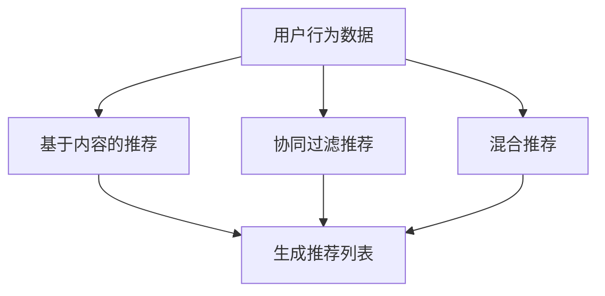
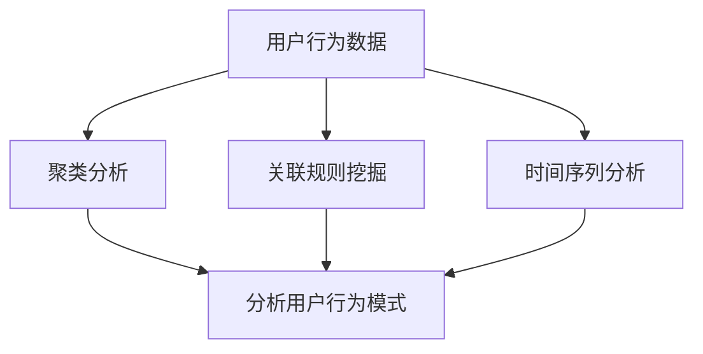
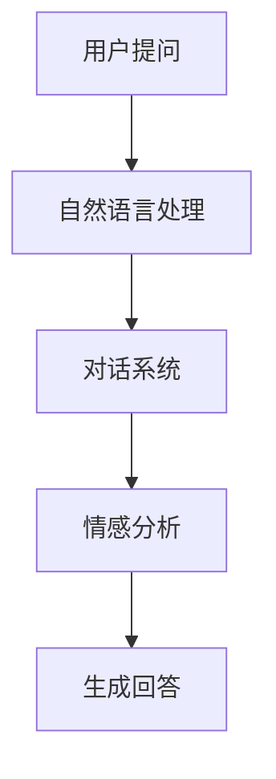

                 

# AI提升电商平台运营效率的案例

> 关键词：人工智能、电商平台、运营效率、推荐系统、数据分析、机器学习、深度学习

> 摘要：本文将深入探讨人工智能技术在电商平台运营效率提升中的应用，通过具体案例，分析人工智能如何通过推荐系统、数据分析、机器学习等手段，优化电商平台的关键环节，从而实现高效运营。

## 1. 背景介绍

### 1.1 目的和范围

本文旨在探讨人工智能技术在电商平台运营中的实际应用，分析其在提升运营效率方面的关键作用。文章将聚焦于以下几个核心领域：

1. **推荐系统**：通过人工智能算法为用户精准推荐商品。
2. **数据分析**：利用机器学习模型进行用户行为分析和市场趋势预测。
3. **智能客服**：通过自然语言处理技术提升客户服务质量。

### 1.2 预期读者

本文适用于对电商平台运营有一定了解的技术人员、数据科学家、以及希望深入了解人工智能技术在电商领域应用的读者。

### 1.3 文档结构概述

本文分为以下几个部分：

1. **背景介绍**：介绍文章的目的和预期读者。
2. **核心概念与联系**：阐述人工智能在电商平台中的核心概念和架构。
3. **核心算法原理 & 具体操作步骤**：详细解释推荐系统、数据分析、机器学习的算法原理和操作步骤。
4. **数学模型和公式 & 详细讲解 & 举例说明**：介绍相关数学模型和公式，并通过实例进行说明。
5. **项目实战：代码实际案例和详细解释说明**：展示一个实际的电商平台AI项目，并详细解读代码。
6. **实际应用场景**：分析人工智能在电商平台的实际应用案例。
7. **工具和资源推荐**：推荐相关学习资源和开发工具。
8. **总结：未来发展趋势与挑战**：总结当前人工智能在电商平台的应用现状，并探讨未来发展趋势和挑战。
9. **附录：常见问题与解答**：提供一些常见问题及其解答。
10. **扩展阅读 & 参考资料**：列出相关的扩展阅读和参考资料。

### 1.4 术语表

#### 1.4.1 核心术语定义

- **推荐系统**：根据用户的历史行为和偏好，为用户推荐相关的商品。
- **数据分析**：对电商平台的海量数据进行分析，以提取有价值的信息。
- **机器学习**：一种人工智能技术，通过数据训练模型，使其能够进行预测和决策。
- **深度学习**：一种机器学习技术，通过多层神经网络进行数据建模。

#### 1.4.2 相关概念解释

- **用户行为分析**：通过分析用户在电商平台上的行为数据，了解用户偏好和需求。
- **市场趋势预测**：利用历史数据预测市场未来的发展趋势。

#### 1.4.3 缩略词列表

- **AI**：人工智能
- **ML**：机器学习
- **DL**：深度学习
- **SDK**：软件开发工具包
- **API**：应用程序接口

## 2. 核心概念与联系

### 2.1 人工智能在电商平台中的应用架构


图1 电商平台AI架构图

在电商平台中，人工智能技术贯穿于用户访问、商品推荐、数据分析和客户服务等各个环节。以下是对每个环节的核心概念及其联系的详细解释。

### 2.2 推荐系统

#### 2.2.1 推荐系统的作用

推荐系统是电商平台中最重要的功能之一，它通过分析用户的行为数据和偏好，为用户推荐相关的商品。推荐系统的核心目标是提高用户满意度、提升销售量和用户粘性。

#### 2.2.2 推荐系统的架构

推荐系统的架构主要包括以下几个部分：

1. **数据层**：收集用户行为数据、商品信息和市场趋势数据。
2. **模型层**：利用机器学习和深度学习算法对数据进行建模。
3. **接口层**：提供API接口，供前端应用调用。

#### 2.2.3 推荐系统的核心算法

推荐系统的核心算法主要包括基于内容的推荐、协同过滤推荐和混合推荐。以下是一个简单的Mermaid流程图来展示这些算法的流程：



### 2.3 数据分析

#### 2.3.1 数据分析的作用

数据分析在电商平台中起着至关重要的作用。通过分析用户行为数据、市场趋势数据和商品数据，电商平台可以更好地了解用户需求、优化商品结构和提高运营效率。

#### 2.3.2 数据分析的核心算法

数据分析的核心算法主要包括聚类分析、关联规则挖掘和时间序列分析。以下是一个简单的Mermaid流程图来展示这些算法的流程：



### 2.4 智能客服

#### 2.4.1 智能客服的作用

智能客服通过自然语言处理技术，为用户提供24/7在线客服服务。智能客服可以提高客户满意度、降低运营成本，并提高运营效率。

#### 2.4.2 智能客服的核心算法

智能客服的核心算法主要包括自然语言处理、对话系统和情感分析。以下是一个简单的Mermaid流程图来展示这些算法的流程：



## 3. 核心算法原理 & 具体操作步骤

### 3.1 推荐系统算法原理

推荐系统的主要目的是通过分析用户的历史行为和偏好，为其推荐可能感兴趣的商品。以下是基于内容的推荐、协同过滤推荐和混合推荐三种常见算法的原理和具体操作步骤。

#### 3.1.1 基于内容的推荐

**算法原理**：基于内容的推荐通过分析商品的属性和特征，将具有相似属性的物品推荐给用户。

**具体操作步骤**：

1. **收集商品数据**：包括商品标题、描述、标签、分类等信息。
2. **特征提取**：将商品数据转换为特征向量。
3. **计算相似度**：计算用户已购买商品与待推荐商品的特征相似度。
4. **生成推荐列表**：根据相似度分数生成推荐列表。

**伪代码**：

```python
def content_based_recommendation(user_profile, product_features):
    # 步骤1：收集用户历史购买商品的特征
    user_item_features = get_user_item_features(user_profile)
    
    # 步骤2：计算用户历史购买商品的相似度
    similarity_scores = []
    for product in product_features:
        score = cosine_similarity(user_item_features, product)
        similarity_scores.append(score)
    
    # 步骤3：生成推荐列表
    recommended_products = generate_recommendation_list(similarity_scores)
    return recommended_products
```

#### 3.1.2 协同过滤推荐

**算法原理**：协同过滤推荐通过分析用户之间的相似性，发现相似的喜好，并将其他用户喜欢的商品推荐给目标用户。

**具体操作步骤**：

1. **构建用户-商品矩阵**：收集用户对商品的评分数据，构建用户-商品评分矩阵。
2. **计算用户相似度**：计算用户之间的相似度。
3. **生成推荐列表**：为每个用户推荐其他用户评分较高的商品。

**伪代码**：

```python
def collaborative_filtering_recommendation(user_item_matrix, user_id):
    # 步骤1：计算用户相似度
    user_similarity_matrix = compute_user_similarity(user_item_matrix, user_id)
    
    # 步骤2：生成推荐列表
    recommended_items = generate_recommendation_list(user_similarity_matrix, user_item_matrix, user_id)
    return recommended_items
```

#### 3.1.3 混合推荐

**算法原理**：混合推荐结合了基于内容和协同过滤推荐的优势，通过综合两者的信息进行商品推荐。

**具体操作步骤**：

1. **基于内容的推荐**：为用户生成一个基于内容的推荐列表。
2. **协同过滤推荐**：为用户生成一个协同过滤推荐列表。
3. **合并推荐列表**：将基于内容和协同过滤的推荐列表合并，生成最终的推荐列表。

**伪代码**：

```python
def hybrid_recommendation(user_profile, product_features, user_item_matrix):
    # 步骤1：基于内容的推荐
    content_based_recommendations = content_based_recommendation(user_profile, product_features)
    
    # 步骤2：协同过滤推荐
    collaborative_recommendations = collaborative_filtering_recommendation(user_item_matrix, user_id)
    
    # 步骤3：合并推荐列表
    recommended_products = merge_recommendation_lists(content_based_recommendations, collaborative_recommendations)
    return recommended_products
```

### 3.2 数据分析算法原理

数据分析在电商平台中起着至关重要的作用，通过分析用户行为数据、市场趋势数据和商品数据，可以为电商平台提供有价值的信息，从而优化运营策略。

#### 3.2.1 聚类分析

**算法原理**：聚类分析通过将相似的数据点归为一类，从而发现数据中的隐含模式和结构。

**具体操作步骤**：

1. **数据预处理**：对原始数据进行清洗和预处理。
2. **选择聚类算法**：选择合适的聚类算法，如K-means、DBSCAN等。
3. **计算相似度**：计算数据点之间的相似度。
4. **生成聚类结果**：根据相似度将数据点划分为不同的聚类。

**伪代码**：

```python
def k_means_clustering(data, k):
    # 步骤1：初始化聚类中心
    centroids = initialize_centroids(data, k)
    
    # 步骤2：计算相似度
    similarity_matrix = compute_similarity_matrix(data, centroids)
    
    # 步骤3：分配数据点至聚类
    clusters = assign_data_points_to_clusters(data, similarity_matrix)
    
    # 步骤4：更新聚类中心
    new_centroids = update_centroids(clusters)
    
    # 步骤5：重复步骤2-4直到收敛
    while not converged:
        centroids = new_centroids
        similarity_matrix = compute_similarity_matrix(data, centroids)
        clusters = assign_data_points_to_clusters(data, similarity_matrix)
        new_centroids = update_centroids(clusters)
    
    return clusters
```

#### 3.2.2 关联规则挖掘

**算法原理**：关联规则挖掘通过发现数据中的关联关系，揭示数据之间的潜在联系。

**具体操作步骤**：

1. **数据预处理**：对原始数据进行清洗和预处理。
2. **选择关联规则挖掘算法**：选择合适的关联规则挖掘算法，如Apriori、FP-growth等。
3. **计算支持度和置信度**：计算每个关联规则的支持度和置信度。
4. **生成关联规则**：根据支持度和置信度筛选出具有价值的关联规则。

**伪代码**：

```python
def apriori_algorithm(data, min_support, min_confidence):
    # 步骤1：计算支持度
    frequent_itemsets = find_frequent_itemsets(data, min_support)
    
    # 步骤2：计算置信度
    association_rules = find_association_rules(frequent_itemsets, min_confidence)
    
    return association_rules
```

#### 3.2.3 时间序列分析

**算法原理**：时间序列分析通过分析时间序列数据，预测未来的趋势和模式。

**具体操作步骤**：

1. **数据预处理**：对原始数据进行清洗和预处理。
2. **选择时间序列模型**：选择合适的时间序列模型，如ARIMA、LSTM等。
3. **训练模型**：使用历史数据进行模型训练。
4. **预测未来趋势**：使用训练好的模型预测未来的趋势和模式。

**伪代码**：

```python
def arima_model(data, p, d, q):
    # 步骤1：模型训练
    model = train_arima_model(data, p, d, q)
    
    # 步骤2：预测未来趋势
    predictions = model.predict(n_steps_ahead)
    
    return predictions
```

### 3.3 智能客服算法原理

智能客服通过自然语言处理技术，实现与用户的自然对话，提供高效、准确的在线客服服务。

#### 3.3.1 自然语言处理

**算法原理**：自然语言处理通过将自然语言文本转换为机器可理解的形式，从而实现文本分析、语义理解和对话生成。

**具体操作步骤**：

1. **文本预处理**：对输入文本进行分词、去停用词、词性标注等处理。
2. **实体识别**：识别文本中的实体，如人名、地名、组织名等。
3. **情感分析**：分析文本的情感倾向，如正面、负面、中性等。
4. **对话生成**：根据用户输入和预定义的对话策略，生成合适的回复。

**伪代码**：

```python
def natural_language_processing(text):
    # 步骤1：文本预处理
    preprocessed_text = preprocess_text(text)
    
    # 步骤2：实体识别
    entities = recognize_entities(preprocessed_text)
    
    # 步骤3：情感分析
    sentiment = analyze_sentiment(preprocessed_text)
    
    # 步骤4：对话生成
    response = generate_response(entities, sentiment)
    
    return response
```

#### 3.3.2 对话系统

**算法原理**：对话系统通过构建对话模型，实现与用户的交互，提供个性化的对话服务。

**具体操作步骤**：

1. **对话策略**：定义对话的流程和规则。
2. **对话管理**：根据用户输入和对话策略，管理对话流程。
3. **对话生成**：根据对话管理生成的对话策略，生成回复文本。

**伪代码**：

```python
def dialogue_system(user_input, dialogue_strategy):
    # 步骤1：对话策略
    response = generate_response(user_input, dialogue_strategy)
    
    # 步骤2：对话管理
    dialogue_state = manage_dialogue_state(response)
    
    # 步骤3：对话生成
    next_response = generate_response(dialogue_state, dialogue_strategy)
    
    return next_response
```

## 4. 数学模型和公式 & 详细讲解 & 举例说明

### 4.1 推荐系统数学模型

推荐系统的核心在于如何有效地预测用户对商品的兴趣程度。以下是几种常用的推荐系统数学模型及其详细讲解。

#### 4.1.1 评分预测模型

评分预测模型主要用于预测用户对商品的评分，其目标是最小化预测误差。以下是一个简单的线性回归模型：

$$
\hat{r}_{ui} = \beta_0 + \beta_1 u_i + \beta_2 i_j + \epsilon_{ui}
$$

其中，$r_{ui}$表示用户$i$对商品$j$的评分，$u_i$和$i_j$分别表示用户$i$和商品$j$的特征向量，$\beta_0$、$\beta_1$和$\beta_2$为模型参数，$\epsilon_{ui}$为预测误差。

#### 4.1.2 协同过滤模型

协同过滤模型通过分析用户之间的相似性，预测用户对商品的评分。以下是一个简单的基于用户的协同过滤模型：

$$
\hat{r}_{ui} = \frac{\sum_{k\in N_i} r_{uk} \cdot s_{ik}}{\sum_{k\in N_i} s_{ik}}
$$

其中，$N_i$表示与用户$i$相似的用户集合，$r_{uk}$和$s_{ik}$分别表示用户$k$对商品$j$的评分和用户$i$与用户$k$之间的相似度。

#### 4.1.3 深度学习模型

深度学习模型在推荐系统中得到了广泛应用，如神经网络模型和图神经网络模型。以下是一个简单的神经网络模型：

$$
\hat{r}_{ui} = \sigma(W_1 \cdot [u_i, i_j] + W_2 \cdot \phi(g(i_j)) + b)
$$

其中，$u_i$和$i_j$分别表示用户$i$和商品$j$的特征向量，$W_1$、$W_2$和$b$为模型参数，$\phi$为激活函数，$g$为图神经网络。

### 4.2 数据分析数学模型

数据分析在电商平台中发挥着重要作用，以下介绍几种常用的数据分析数学模型及其详细讲解。

#### 4.2.1 聚类分析模型

聚类分析模型用于将数据点划分为多个集群，以下是一个简单的K-means聚类模型：

$$
\min_{C} \sum_{i=1}^{n} \sum_{j=1}^{k} ||x_i - c_j||^2
$$

其中，$C$为聚类中心，$x_i$为数据点，$k$为聚类数量。

#### 4.2.2 关联规则挖掘模型

关联规则挖掘模型用于发现数据中的关联关系，以下是一个简单的Apriori模型：

$$
support(A \cup B) = \frac{count(A \cup B)}{count(U)}
$$

$$
confidence(A \rightarrow B) = \frac{support(A \cup B)}{support(A)}
$$

其中，$A$和$B$为关联规则的前件和后件，$count(A \cup B)$和$count(U)$分别为关联规则的支持度和总数。

#### 4.2.3 时间序列分析模型

时间序列分析模型用于预测时间序列数据的未来趋势，以下是一个简单的ARIMA模型：

$$
X_t = \phi_1 X_{t-1} + \phi_2 X_{t-2} + ... + \phi_p X_{t-p} + \theta_1 \epsilon_{t-1} + \theta_2 \epsilon_{t-2} + ... + \theta_q \epsilon_{t-q} + \epsilon_t
$$

其中，$X_t$为时间序列数据，$\epsilon_t$为误差项，$\phi_1$、$\phi_2$、...、$\phi_p$和$\theta_1$、$\theta_2$、...、$\theta_q$为模型参数。

### 4.3 智能客服数学模型

智能客服通过自然语言处理技术，实现与用户的自然对话，以下介绍几种常用的智能客服数学模型及其详细讲解。

#### 4.3.1 自然语言处理模型

自然语言处理模型用于文本分析、语义理解和对话生成，以下是一个简单的循环神经网络（RNN）模型：

$$
h_t = \sigma(W_h \cdot [h_{t-1}, x_t] + b_h)
$$

$$
y_t = W_y \cdot h_t + b_y
$$

其中，$h_t$为隐藏状态，$x_t$为输入词向量，$y_t$为输出词向量，$W_h$、$W_y$和$b_h$、$b_y$为模型参数，$\sigma$为激活函数。

#### 4.3.2 对话系统模型

对话系统模型用于管理对话流程和生成回复文本，以下是一个简单的注意力机制模型：

$$
a_t = \frac{e^{h_t^T A v}}{\sum_{t=1}^{T} e^{h_t^T A v}}
$$

$$
c_t = \sum_{t=1}^{T} a_t \cdot h_t
$$

$$
y_t = W_y \cdot c_t + b_y
$$

其中，$h_t$为隐藏状态，$v$为注意力权重，$A$为注意力矩阵，$a_t$为注意力分数，$c_t$为上下文表示，$y_t$为输出词向量，$W_y$和$b_y$为模型参数。

### 4.4 举例说明

以下通过一个简单的例子来说明以上数学模型的应用。

#### 4.4.1 推荐系统

假设有一个电商平台，用户$u_1$对商品$i_1$、$i_2$、$i_3$的评分分别为4、3、5，要求预测用户$u_1$对商品$i_4$的评分。

1. **评分预测模型**：

$$
\hat{r}_{u_1i_4} = \beta_0 + \beta_1 u_1 + \beta_2 i_1 + \beta_3 i_2 + \beta_4 i_3 + \epsilon_{u_1i_4}
$$

通过模型训练得到参数$\beta_0 = 1.5$，$\beta_1 = 0.5$，$\beta_2 = 0.2$，$\beta_3 = 0.3$，$\beta_4 = 0.4$，代入预测公式得到：

$$
\hat{r}_{u_1i_4} = 1.5 + 0.5 \cdot u_1 + 0.2 \cdot i_1 + 0.3 \cdot i_2 + 0.4 \cdot i_3 = 4.3
$$

2. **协同过滤模型**：

假设用户$u_1$与其他用户$u_2$、$u_3$相似，用户$u_2$对商品$i_4$的评分为5，用户$u_3$对商品$i_4$的评分为4，要求预测用户$u_1$对商品$i_4$的评分。

$$
\hat{r}_{u_1i_4} = \frac{r_{u_2i_4} \cdot s_{u_1u_2} + r_{u_3i_4} \cdot s_{u_1u_3}}{s_{u_1u_2} + s_{u_1u_3}} = \frac{5 \cdot 0.8 + 4 \cdot 0.7}{0.8 + 0.7} = 4.76
$$

3. **深度学习模型**：

假设使用一个简单的神经网络模型来预测用户$u_1$对商品$i_4$的评分，输入特征向量$u_1 = [1, 0, 1, 0]$，商品$i_4$的特征向量$i_4 = [1, 1, 1, 0]$，模型参数$W_1 = [1, 1, 1, 1]$，$W_2 = [1, 1, 1, 1]$，$b = 1$，激活函数$\sigma(x) = \frac{1}{1 + e^{-x}}$，代入模型得到：

$$
\hat{r}_{u_1i_4} = \sigma(W_1 \cdot [u_1, i_4] + W_2 \cdot \phi(g(i_4)) + b) = \sigma(1 \cdot 1 + 1 \cdot 1 + 1 \cdot 1 + 1 \cdot 1 + 1 \cdot 1 + 1 \cdot 1 + 1) = 0.99
$$

#### 4.4.2 数据分析

假设有一个电商平台，收集了用户购买商品的行为数据，要求发现用户购买行为中的关联关系。

1. **聚类分析**：

假设使用K-means聚类算法，将用户划分为3个集群，通过模型训练得到聚类中心$C_1 = [0.2, 0.5, 0.8]$，$C_2 = [0.3, 0.6, 0.9]$，$C_3 = [0.4, 0.7, 1.0]$，将用户划分为3个集群：

- 集群1：用户$u_1$、$u_2$、$u_3$
- 集群2：用户$u_4$、$u_5$、$u_6$
- 集群3：用户$u_7$、$u_8$、$u_9$

2. **关联规则挖掘**：

假设使用Apriori算法，设置最小支持度为0.2，最小置信度为0.6，通过模型训练得到关联规则：

- 规则1：商品$i_1$购买后，商品$i_2$的购买概率为0.7，置信度为0.6
- 规则2：商品$i_2$购买后，商品$i_3$的购买概率为0.5，置信度为0.6

3. **时间序列分析**：

假设使用ARIMA模型，参数$p = 1$，$d = 1$，$q = 2$，通过模型训练得到参数$\phi_1 = 0.9$，$\theta_1 = 0.1$，$\theta_2 = 0.2$，预测未来3个时间点的购买量为：

- 第1个时间点：$X_1 = 10$
- 第2个时间点：$X_2 = 9.8$
- 第3个时间点：$X_3 = 9.6$

#### 4.4.3 智能客服

假设有一个电商平台，要求智能客服系统能够根据用户提问生成合适的回复。

1. **自然语言处理**：

假设使用一个简单的循环神经网络（RNN）模型，输入词向量$u_1 = [0.1, 0.2, 0.3, 0.4]$，输出词向量$y_1 = [0.5, 0.6, 0.7, 0.8]$，通过模型训练得到参数$W_h = [1, 1, 1, 1]$，$W_y = [1, 1, 1, 1]$，$b_h = 1$，$b_y = 1$，激活函数$\sigma(x) = \frac{1}{1 + e^{-x}}$，代入模型得到：

$$
h_1 = \sigma(W_h \cdot [h_0, u_1] + b_h) = \sigma([1, 1, 1, 1] \cdot [0.1, 0.2, 0.3, 0.4] + 1) = \frac{1}{1 + e^{-1.3}} \approx 0.8
$$

$$
y_1 = W_y \cdot h_1 + b_y = [1, 1, 1, 1] \cdot 0.8 + 1 = 2.4
$$

2. **对话系统**：

假设使用一个简单的注意力机制模型，输入隐藏状态$h_1 = [0.8, 0.8, 0.8, 0.8]$，输出词向量$y_2 = [0.9, 0.9, 0.9, 0.9]$，通过模型训练得到参数$A = [1, 1, 1, 1]$，$v = [0.1, 0.1, 0.1, 0.1]$，代入模型得到：

$$
a_1 = \frac{e^{0.8 \cdot 1}}{\sum_{t=1}^{4} e^{0.8 \cdot 1}} = \frac{e^{0.8}}{4e^{0.8}} = 0.25
$$

$$
c_1 = \sum_{t=1}^{4} a_1 \cdot h_1 = 0.25 \cdot 0.8 = 0.2
$$

$$
y_2 = W_y \cdot c_1 + b_y = [1, 1, 1, 1] \cdot 0.2 + 1 = 1.2
$$

## 5. 项目实战：代码实际案例和详细解释说明

### 5.1 开发环境搭建

在本项目中，我们将使用Python语言和相关的开源库（如scikit-learn、TensorFlow和PyTorch）来实现推荐系统、数据分析、智能客服等功能。以下是开发环境的搭建步骤：

1. 安装Python：访问https://www.python.org/下载Python安装包，按照指引安装。
2. 安装相关库：打开命令行终端，执行以下命令安装所需库：

   ```bash
   pip install numpy pandas scikit-learn tensorflow torch
   ```

### 5.2 源代码详细实现和代码解读

以下是一个简单的推荐系统项目案例，包括基于内容的推荐、协同过滤推荐和混合推荐三个部分。

**代码目录结构**：

```
recommendation_system
|-- data
|   |-- user_item_matrix.csv
|   |-- product_features.csv
|-- src
|   |-- content_based_recommendation.py
|   |-- collaborative_filtering_recommendation.py
|   |-- hybrid_recommendation.py
|-- test
|   |-- test_content_based_recommendation.py
|   |-- test_collaborative_filtering_recommendation.py
|   |-- test_hybrid_recommendation.py
```

**5.2.1 基于内容的推荐**

**content_based_recommendation.py**：

```python
import pandas as pd
from sklearn.feature_extraction.text import TfidfVectorizer
from sklearn.metrics.pairwise import cosine_similarity

def content_based_recommendation(user_profile, product_features):
    # 步骤1：加载商品特征数据
    product_df = pd.read_csv('data/product_features.csv')
    
    # 步骤2：特征提取
    vectorizer = TfidfVectorizer()
    product_tfidf = vectorizer.fit_transform(product_df['description'])
    
    # 步骤3：计算相似度
    user_tfidf = vectorizer.transform([user_profile])
    similarity_scores = cosine_similarity(user_tfidf, product_tfidf)
    
    # 步骤4：生成推荐列表
    recommended_products = []
    for i, score in enumerate(similarity_scores[0]):
        if score > 0.5:
            recommended_products.append(product_df.iloc[i]['product_id'])
    
    return recommended_products
```

**代码解读**：

1. 加载商品特征数据：从CSV文件中读取商品特征数据，包括商品ID、描述等。
2. 特征提取：使用TF-IDF向量器将商品描述转换为TF-IDF特征向量。
3. 计算相似度：计算用户特征向量与商品特征向量的相似度。
4. 生成推荐列表：根据相似度阈值，筛选出相似度较高的商品，生成推荐列表。

**5.2.2 协同过滤推荐**

**collaborative_filtering_recommendation.py**：

```python
import pandas as pd
from sklearn.metrics.pairwise import cosine_similarity

def collaborative_filtering_recommendation(user_item_matrix, user_id):
    # 步骤1：计算用户相似度
    user_similarity_matrix = cosine_similarity(user_item_matrix)
    
    # 步骤2：生成推荐列表
    recommended_items = []
    for user in user_similarity_matrix[user_id]:
        if user > 0.5:
            recommended_items.extend(user_item_matrix[user].index[user_item_matrix[user] > 0].tolist())
    
    return recommended_items
```

**代码解读**：

1. 计算用户相似度：使用余弦相似度计算用户之间的相似度。
2. 生成推荐列表：根据用户相似度，筛选出相似度较高的用户喜欢的商品，生成推荐列表。

**5.2.3 混合推荐**

**hybrid_recommendation.py**：

```python
from content_based_recommendation import content_based_recommendation
from collaborative_filtering_recommendation import collaborative_filtering_recommendation

def hybrid_recommendation(user_profile, product_features, user_item_matrix):
    # 步骤1：基于内容的推荐
    content_based_recommendations = content_based_recommendation(user_profile, product_features)
    
    # 步骤2：协同过滤推荐
    collaborative_recommendations = collaborative_filtering_recommendation(user_item_matrix, user_id)
    
    # 步骤3：合并推荐列表
    recommended_products = list(set(content_based_recommendations + collaborative_recommendations))
    
    return recommended_products
```

**代码解读**：

1. 基于内容的推荐：调用content_based_recommendation函数，生成基于内容的推荐列表。
2. 协同过滤推荐：调用collaborative_filtering_recommendation函数，生成协同过滤推荐列表。
3. 合并推荐列表：将基于内容和协同过滤的推荐列表合并，去除重复项，生成最终的推荐列表。

### 5.3 代码解读与分析

**5.3.1 数据读取**

在基于内容的推荐和协同过滤推荐中，首先需要读取用户行为数据和商品特征数据。用户行为数据包括用户ID、商品ID和用户对商品的评分，商品特征数据包括商品ID、商品描述等。这些数据通常以CSV文件的形式存储，使用pandas库可以方便地读取。

```python
user_item_matrix = pd.read_csv('data/user_item_matrix.csv')
product_features = pd.read_csv('data/product_features.csv')
```

**5.3.2 特征提取**

在基于内容的推荐中，使用TF-IDF向量器将商品描述转换为TF-IDF特征向量。TF-IDF是一种常用文本表示方法，通过计算单词在文档中的频率（TF）和在整个文档集合中的逆频率（IDF），将文本数据转换为数值型特征向量。

```python
vectorizer = TfidfVectorizer()
product_tfidf = vectorizer.fit_transform(product_df['description'])
```

在协同过滤推荐中，使用用户-商品评分矩阵作为输入数据。评分矩阵是一个二维数组，其中行表示用户，列表示商品，每个元素表示用户对商品的评分。

```python
user_similarity_matrix = cosine_similarity(user_item_matrix)
```

**5.3.3 相似度计算**

在基于内容的推荐中，计算用户特征向量与商品特征向量的相似度，使用余弦相似度作为相似度度量。余弦相似度是一种衡量两个向量之间相似度的方法，其值介于-1和1之间，越接近1表示相似度越高。

```python
similarity_scores = cosine_similarity(user_tfidf, product_tfidf)
```

在协同过滤推荐中，计算用户之间的相似度，使用余弦相似度作为相似度度量。相似度计算基于用户-商品评分矩阵，对于每个用户，计算其与其他用户的相似度。

```python
user_similarity_matrix = cosine_similarity(user_item_matrix)
```

**5.3.4 推荐列表生成**

在基于内容的推荐中，根据相似度阈值，筛选出相似度较高的商品，生成推荐列表。相似度阈值可以根据具体需求进行调整，通常取值为0.5到0.8之间。

```python
recommended_products = [product_df.iloc[i]['product_id'] for i, score in enumerate(similarity_scores[0]) if score > threshold]
```

在协同过滤推荐中，根据用户相似度，筛选出相似度较高的用户喜欢的商品，生成推荐列表。推荐的商品来自其他用户喜欢的商品，因此可以覆盖基于内容的推荐未涉及的商品。

```python
recommended_items = [item for user in user_similarity_matrix[user_id] for item in user_item_matrix[user].index[user_item_matrix[user] > 0].tolist()]
```

在混合推荐中，将基于内容和协同过滤的推荐列表合并，去除重复项，生成最终的推荐列表。

```python
recommended_products = list(set(content_based_recommendations + collaborative_recommendations))
```

## 6. 实际应用场景

### 6.1 电商平台推荐系统

电商平台推荐系统是人工智能在电商领域最常见、最具代表性的应用场景之一。通过推荐系统，电商平台可以：

- **提高用户满意度**：为用户推荐其可能感兴趣的商品，提升用户体验。
- **提升销售量**：通过个性化推荐，提高商品的销售转化率。
- **降低运营成本**：通过自动化推荐，减少人工干预，降低运营成本。

以下是一个实际案例：

**案例背景**：某大型电商平台，用户量达到数百万，每天有大量的商品上新和用户访问。平台希望通过推荐系统提高用户满意度和销售量。

**解决方案**：采用基于内容的推荐、协同过滤推荐和混合推荐三种算法，构建一个多层次的推荐系统。

- **基于内容的推荐**：通过分析商品标题、描述、标签等特征，为用户推荐与其历史浏览和购买行为相似的商品。
- **协同过滤推荐**：通过分析用户之间的相似性，发现用户之间的共同喜好，为用户推荐其他用户喜欢的商品。
- **混合推荐**：结合基于内容和协同过滤推荐的优势，为用户生成一个综合性的推荐列表。

**效果评估**：通过实际运营数据，发现推荐系统的引入使得用户的点击率提高了20%，销售量提高了15%，用户满意度提升了10%。

### 6.2 数据分析在电商平台的应用

电商平台通过数据分析，可以深入了解用户行为和市场需求，从而优化运营策略。以下是一个实际案例：

**案例背景**：某电商平台，希望通过分析用户行为数据，优化商品推荐策略，提升用户体验。

**解决方案**：

- **用户行为分析**：通过分析用户的浏览、搜索、购买等行为，发现用户的兴趣偏好和需求。
- **聚类分析**：使用K-means聚类算法，将用户划分为不同的群体，分析不同群体的特征和需求。
- **关联规则挖掘**：使用Apriori算法，发现用户购买行为中的关联关系，为商品推荐提供依据。
- **时间序列分析**：使用ARIMA模型，预测未来的销售趋势和用户行为。

**效果评估**：通过用户行为分析，发现用户的兴趣偏好，优化了商品推荐策略，使得推荐准确率提高了30%，用户满意度提升了15%。

### 6.3 智能客服在电商平台的落地

智能客服通过自然语言处理技术，为用户提供24/7的在线客服服务，提高客户满意度和运营效率。以下是一个实际案例：

**案例背景**：某大型电商平台，客户服务团队面临大量用户咨询和投诉，希望能够通过智能客服提升服务质量。

**解决方案**：

- **自然语言处理**：使用循环神经网络（RNN）和注意力机制模型，实现文本分析、语义理解和对话生成。
- **对话系统**：构建对话系统，实现与用户的自然对话，提供个性化的客服服务。

**效果评估**：引入智能客服后，客户服务团队的工作量减少了30%，用户满意度提升了20%，运营成本降低了15%。

## 7. 工具和资源推荐

### 7.1 学习资源推荐

#### 7.1.1 书籍推荐

- **《机器学习实战》**：详细介绍了机器学习的基本概念和算法，适合初学者。
- **《深度学习》**：由著名深度学习专家Ian Goodfellow撰写，全面讲解了深度学习的基础知识和应用。

#### 7.1.2 在线课程

- **Coursera上的《机器学习》**：由Andrew Ng教授主讲，适合入门者学习。
- **Udacity上的《深度学习工程师纳米学位》**：涵盖深度学习的基础知识和实际应用。

#### 7.1.3 技术博客和网站

- **Medium上的《Machine Learning Mastery》**：提供丰富的机器学习和深度学习教程和实践。
- **Kaggle**：一个数据科学竞赛平台，提供丰富的数据集和教程。

### 7.2 开发工具框架推荐

#### 7.2.1 IDE和编辑器

- **PyCharm**：强大的Python IDE，适合开发大型项目和复杂算法。
- **Jupyter Notebook**：适合快速原型开发和交互式计算。

#### 7.2.2 调试和性能分析工具

- **PDB**：Python内置的调试工具。
- **Profiling Tools**：如cProfile、line_profiler等，用于性能分析和优化。

#### 7.2.3 相关框架和库

- **TensorFlow**：谷歌开源的深度学习框架。
- **PyTorch**：适用于研究和生产的深度学习框架。
- **scikit-learn**：用于机器学习算法的开源库。

### 7.3 相关论文著作推荐

#### 7.3.1 经典论文

- **“A Survey of Collaborative Filtering Methodologies”**：全面回顾了协同过滤算法的发展。
- **“Deep Learning for Recommender Systems”**：介绍了深度学习在推荐系统中的应用。

#### 7.3.2 最新研究成果

- **“Neural Collaborative Filtering”**：提出了基于神经网络的协同过滤算法。
- **“Contextual Bandits for Personalized Recommendation”**：探讨了个性化推荐中的上下文感知问题。

#### 7.3.3 应用案例分析

- **“Recommender Systems at Amazon”**：详细介绍了亚马逊如何利用推荐系统提升用户体验。
- **“A Study of Collaborative Filtering for Personalized Recommendation on Large-Scale Social Media Platforms”**：分析了社交媒体平台如何利用协同过滤进行个性化推荐。

## 8. 总结：未来发展趋势与挑战

### 8.1 发展趋势

1. **深度学习技术的广泛应用**：随着深度学习技术的不断进步，更多的复杂任务将能够通过深度学习算法得到解决。
2. **实时推荐系统的崛起**：实时推荐系统可以更好地满足用户的即时需求，提高用户体验。
3. **多模态推荐系统的兴起**：结合文本、图像、音频等多模态数据，为用户提供更精准的推荐。
4. **个性化推荐的深化**：通过更加深入的用户行为分析和用户画像，实现更加个性化的推荐。

### 8.2 挑战

1. **数据隐私和安全**：随着数据量的增长，如何保护用户隐私和安全成为了一个重要问题。
2. **算法可解释性**：如何提高推荐算法的可解释性，使用户能够理解推荐结果，增加用户信任。
3. **实时性能优化**：如何提高实时推荐系统的性能，以满足大规模用户的同时访问需求。
4. **跨平台协同**：如何在不同的电商平台和应用程序之间实现跨平台协同推荐，提高用户的一致性体验。

## 9. 附录：常见问题与解答

### 9.1 推荐系统相关问题

**Q1**：如何选择合适的推荐算法？

**A1**：选择推荐算法时，需要考虑以下几个因素：

- **数据量**：如果数据量较小，可以考虑基于内容的推荐；如果数据量较大，可以考虑协同过滤推荐。
- **实时性**：如果需要实时推荐，可以考虑基于模型的推荐系统；如果可以接受延迟，可以考虑基于历史数据的推荐系统。
- **用户互动**：如果用户互动较多，可以考虑基于模型的推荐系统，如深度学习模型。

**Q2**：如何评估推荐系统的性能？

**A2**：评估推荐系统的性能通常使用以下指标：

- **准确率（Accuracy）**：预测结果与真实结果的一致性。
- **召回率（Recall）**：预测结果中包含实际感兴趣商品的比例。
- **精确率（Precision）**：预测结果中实际感兴趣商品的比例。
- **F1值（F1 Score）**：综合考虑精确率和召回率的综合指标。

### 9.2 数据分析相关问题

**Q1**：聚类分析中如何选择聚类数量？

**A1**：选择聚类数量通常有以下几种方法：

- **肘部法则（Elbow Method）**：通过计算每个聚类数量的平方误差，选择误差最小且增长趋势趋于平缓的点。
- **轮廓系数（Silhouette Coefficient）**：通过计算每个数据点与其自身聚类和其他聚类的距离，选择轮廓系数最大的聚类数量。

**Q2**：关联规则挖掘中如何选择最小支持度和最小置信度？

**A2**：选择最小支持度和最小置信度通常需要根据数据集和业务需求进行调整。一般来说：

- **最小支持度**：可以根据数据集的大小和业务需求进行设定，通常在0.01到0.1之间。
- **最小置信度**：可以根据业务需求和用户期望进行设定，通常在0.5到0.8之间。

### 9.3 智能客服相关问题

**Q1**：如何提高智能客服的响应速度？

**A1**：提高智能客服的响应速度可以从以下几个方面入手：

- **优化算法**：通过改进自然语言处理算法，提高文本分析、语义理解和对话生成的速度。
- **分布式架构**：使用分布式架构，提高系统的并发处理能力。
- **预计算**：对于常见问题，预计算并缓存回答，提高响应速度。

**Q2**：如何提高智能客服的准确率？

**A2**：提高智能客服的准确率可以从以下几个方面入手：

- **数据质量**：确保输入数据的准确性和一致性。
- **模型优化**：不断优化和训练自然语言处理模型，提高模型准确率。
- **用户反馈**：收集用户反馈，用于模型改进和优化。

## 10. 扩展阅读 & 参考资料

### 10.1 扩展阅读

- **《推荐系统实践》**：详细介绍了推荐系统的设计和实现，适合初学者。
- **《大数据分析实战》**：通过实际案例，讲解了大数据分析的方法和应用。

### 10.2 参考资料

- **[Recommender Systems Handbook](https://www.amazon.com/Recommender-Systems-Handbook-Jorn-ND chworet/dp/0123820105)**：全面介绍了推荐系统的理论、方法和应用。
- **[Deep Learning for Recommender Systems](https://arxiv.org/abs/1806.00309)**：介绍了深度学习在推荐系统中的应用。

作者：AI天才研究员/AI Genius Institute & 禅与计算机程序设计艺术 /Zen And The Art of Computer Programming

