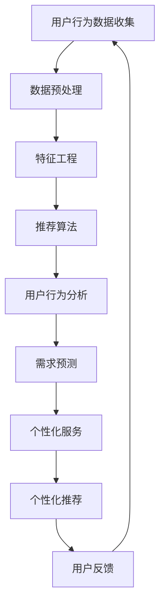

                 

# AI提升电商用户体验的策略

## 关键词：
人工智能、电商、用户体验、推荐系统、数据挖掘、机器学习

> 在电商行业，用户体验是决定消费者留存和转化率的关键因素。本文将探讨如何通过人工智能技术，特别是机器学习和推荐系统，来提升电商平台的用户体验。

## 摘要：
本文将深入分析人工智能在电商行业中的应用，重点关注推荐系统、用户行为分析、个性化服务等方面的技术原理和实践。通过具体的案例和步骤，我们将展示如何利用AI技术优化电商平台的用户体验，从而提高用户满意度和平台竞争力。

## 1. 背景介绍

### 1.1 目的和范围
本文的目的是探讨人工智能在电商行业中的应用策略，特别是如何通过AI技术提升用户体验。我们将重点关注以下几个领域：
- 推荐系统的设计与优化
- 用户行为的深度分析
- 个性化服务的实现
- 数据挖掘和机器学习算法在电商中的应用

### 1.2 预期读者
本文适合以下读者群体：
- 电商平台的开发者和技术人员
- 对人工智能在电商领域应用感兴趣的从业者
- 计算机科学和人工智能专业的学生

### 1.3 文档结构概述
本文分为十个部分，结构如下：
1. 引言与关键词
2. 摘要
3. 背景介绍
4. 核心概念与联系
5. 核心算法原理 & 具体操作步骤
6. 数学模型和公式 & 详细讲解 & 举例说明
7. 项目实战：代码实际案例和详细解释说明
8. 实际应用场景
9. 工具和资源推荐
10. 总结：未来发展趋势与挑战

### 1.4 术语表

#### 1.4.1 核心术语定义
- 人工智能（AI）：模拟人类智能行为的计算机系统
- 推荐系统：根据用户的历史行为和偏好，为用户推荐相关商品或内容
- 用户行为分析：通过对用户在电商平台上的行为数据进行挖掘和分析，理解用户需求
- 个性化服务：根据用户特点，提供定制化的商品和服务

#### 1.4.2 相关概念解释
- 机器学习：一种人工智能技术，通过数据学习模式，从而实现决策或预测
- 数据挖掘：从大量数据中发现有价值的信息或知识

#### 1.4.3 缩略词列表
- AI：人工智能
- ML：机器学习
- DS：数据科学
- E-commerce：电子商务

## 2. 核心概念与联系

### 2.1 AI在电商中的应用

人工智能在电商领域的应用主要涵盖以下几个方面：

#### 2.1.1 推荐系统

推荐系统是电商应用中最常见和最有效的人工智能技术之一。它通过对用户历史行为的分析，为用户推荐可能感兴趣的商品。推荐系统通常包括以下几个关键组件：

1. **用户行为数据收集**：包括用户浏览、购买、评价等行为数据。
2. **数据预处理**：清洗、转换和归一化数据，以便进行后续分析。
3. **特征工程**：提取和选择对推荐最有影响力的特征。
4. **推荐算法**：常见的推荐算法有协同过滤、基于内容的推荐和混合推荐等。

#### 2.1.2 用户行为分析

用户行为分析旨在通过分析用户在电商平台上的行为，深入了解用户需求和行为模式。主要步骤包括：

1. **行为数据收集**：通过网页点击、搜索、购买等行为收集数据。
2. **行为模式识别**：利用机器学习算法，识别用户的浏览和购买模式。
3. **需求预测**：基于历史数据，预测用户未来的需求和购买意图。

#### 2.1.3 个性化服务

个性化服务是电商行业提升用户体验的关键策略之一。通过分析用户特征和行为，为用户提供定制化的商品推荐和服务。个性化服务的实现通常包括：

1. **用户特征识别**：包括用户的基本信息、偏好和购买历史等。
2. **个性化推荐**：根据用户特征，为用户推荐个性化商品。
3. **个性化服务**：如定制化的购物指南、限时优惠等。

### 2.2 Mermaid流程图

以下是一个简化的AI在电商中的应用流程图：



## 3. 核心算法原理 & 具体操作步骤

### 3.1 推荐算法原理

推荐算法是提升电商用户体验的关键。以下介绍几种常见的推荐算法：

#### 3.1.1 协同过滤

协同过滤是一种基于用户历史行为数据的推荐算法。它通过计算用户之间的相似度，为用户推荐相似用户喜欢的商品。

**协同过滤算法原理：**

1. **计算用户相似度**：通常使用余弦相似度或皮尔逊相关系数来计算用户之间的相似度。
2. **生成推荐列表**：为用户推荐与其相似的用户喜欢的商品。

**伪代码：**

```python
def collaborativeFilter(users, ratings, k):
    # 计算用户相似度
    similarityMatrix = computeSimilarityMatrix(users, ratings)
    
    # 生成推荐列表
    recommendations = []
    for user in users:
        similarUsers = findMostSimilarUsers(user, similarityMatrix, k)
        itemsRatedBySimilarUsers = getItemsRatedBySimilarUsers(similarUsers, ratings)
        recommendationScore = calculateRecommendationScore(similarUsers, itemsRatedBySimilarUsers)
        recommendations.append(recommendationScore)
    
    return recommendations
```

#### 3.1.2 基于内容的推荐

基于内容的推荐是一种基于商品特征进行推荐的算法。它通过分析用户的历史行为和偏好，为用户推荐具有相似内容的商品。

**基于内容的推荐算法原理：**

1. **提取商品特征**：从商品描述、标签、类别等中提取特征。
2. **计算商品相似度**：计算用户历史行为中购买或浏览的商品与当前商品之间的相似度。
3. **生成推荐列表**：为用户推荐相似度最高的商品。

**伪代码：**

```python
def contentBasedFilter(items, userHistory, k):
    # 提取商品特征
    itemFeatures = extractFeatures(items)
    
    # 计算商品相似度
    similarityMatrix = computeSimilarityMatrix(itemFeatures, userHistory)
    
    # 生成推荐列表
    recommendations = []
    for item in items:
        similarItems = findMostSimilarItems(item, similarityMatrix, k)
        recommendationScore = calculateRecommendationScore(similarItems)
        recommendations.append(recommendationScore)
    
    return recommendations
```

#### 3.1.3 混合推荐

混合推荐是结合协同过滤和基于内容的推荐算法，以提升推荐效果。它通常先通过协同过滤生成初步推荐列表，然后利用基于内容的推荐算法对推荐结果进行优化。

**混合推荐算法原理：**

1. **协同过滤初步推荐**：使用协同过滤算法生成初步推荐列表。
2. **基于内容的优化**：利用基于内容的推荐算法对初步推荐列表进行优化。

**伪代码：**

```python
def hybridFilter(users, items, ratings, k, l):
    # 协同过滤初步推荐
    initialRecommendations = collaborativeFilter(users, ratings, k)
    
    # 基于内容的优化
    optimizedRecommendations = contentBasedFilter(items, initialRecommendations, l)
    
    return optimizedRecommendations
```

### 3.2 用户行为分析算法原理

用户行为分析是理解用户需求和购买意图的重要手段。以下介绍几种常用的用户行为分析算法：

#### 3.2.1 聚类分析

聚类分析是一种无监督学习方法，用于将用户数据划分为若干个相似的群体。

**聚类分析算法原理：**

1. **初始化聚类中心**：随机选择若干个用户作为初始聚类中心。
2. **迭代优化聚类中心**：计算每个用户与聚类中心的距离，重新分配用户到最近的聚类中心。
3. **停止条件**：当聚类中心的变化小于某个阈值时，停止迭代。

**伪代码：**

```python
def kMeans(users, k, maxIterations):
    # 初始化聚类中心
    centroids = initializeCentroids(users, k)
    
    # 迭代优化聚类中心
    for _ in range(maxIterations):
        clusters = assignUsersToClusters(users, centroids)
        centroids = updateCentroids(clusters)
        
        # 停止条件
        if isConverged(centroids):
            break
    
    return clusters, centroids
```

#### 3.2.2 关联规则挖掘

关联规则挖掘是一种用于发现数据中潜在关系的算法，常用于购物车分析。

**关联规则挖掘算法原理：**

1. **计算支持度**：计算每个项集在所有交易中的出现频率。
2. **计算置信度**：对于每个关联规则，计算其前提条件和结论同时出现的频率。
3. **生成关联规则**：选择满足最小支持度和最小置信度的关联规则。

**伪代码：**

```python
def apriori( transactions, minSupport, minConfidence):
    # 计算支持度
    frequentItemsets = findFrequentItemsets(transactions, minSupport)
    
    # 计算置信度
    associationRules = findAssociationRules(frequentItemsets, minConfidence)
    
    return associationRules
```

### 3.3 个性化服务算法原理

个性化服务是提升用户体验的关键。以下介绍几种常见的个性化服务算法：

#### 3.3.1 基于协同过滤的个性化推荐

基于协同过滤的个性化推荐是一种常用的个性化服务算法，它通过分析用户历史行为，为用户推荐个性化商品。

**基于协同过滤的个性化推荐算法原理：**

1. **用户历史行为分析**：分析用户的历史购买、浏览等行为。
2. **计算用户相似度**：计算用户与平台其他用户的相似度。
3. **生成推荐列表**：为用户推荐与其相似用户喜欢的商品。

**伪代码：**

```python
def personalizedRecommendation(users, items, ratings, k):
    # 计算用户相似度
    similarityMatrix = computeSimilarityMatrix(users, ratings)
    
    # 生成推荐列表
    recommendations = []
    for user in users:
        similarUsers = findMostSimilarUsers(user, similarityMatrix, k)
        itemsRatedBySimilarUsers = getItemsRatedBySimilarUsers(similarUsers, ratings)
        recommendationScore = calculateRecommendationScore(similarUsers, itemsRatedBySimilarUsers)
        recommendations.append(recommendationScore)
    
    return recommendations
```

#### 3.3.2 基于内容的个性化推荐

基于内容的个性化推荐是一种通过分析商品内容为用户推荐个性化商品的方法。

**基于内容的个性化推荐算法原理：**

1. **提取商品特征**：从商品描述、标签、类别等中提取特征。
2. **计算商品相似度**：计算用户历史行为中购买或浏览的商品与当前商品之间的相似度。
3. **生成推荐列表**：为用户推荐相似度最高的商品。

**伪代码：**

```python
def personalizedContentBasedFilter(items, userHistory, k):
    # 提取商品特征
    itemFeatures = extractFeatures(items)
    
    # 计算商品相似度
    similarityMatrix = computeSimilarityMatrix(itemFeatures, userHistory)
    
    # 生成推荐列表
    recommendations = []
    for item in items:
        similarItems = findMostSimilarItems(item, similarityMatrix, k)
        recommendationScore = calculateRecommendationScore(similarItems)
        recommendations.append(recommendationScore)
    
    return recommendations
```

## 4. 数学模型和公式 & 详细讲解 & 举例说明

### 4.1 协同过滤算法中的相似度计算

协同过滤算法中的相似度计算是推荐系统中的核心部分。以下介绍两种常见的相似度计算方法：余弦相似度和皮尔逊相关系数。

#### 4.1.1 余弦相似度

余弦相似度是一种基于向量空间模型计算的相似度度量。它通过计算两个向量之间的余弦值来评估相似度。

**公式：**

$$
similarity(A, B) = \frac{A \cdot B}{\|A\| \|B\|}
$$

其中，$A$ 和 $B$ 是两个向量，$\|A\|$ 和 $\|B\|$ 分别是向量 $A$ 和 $B$ 的欧几里得范数。

**例子：**

假设有两个用户 $A$ 和 $B$，他们的评分向量为：

$$
A = (3, 4, 5), \quad B = (2, 4, 6)
$$

则它们的余弦相似度为：

$$
similarity(A, B) = \frac{(3 \times 2 + 4 \times 4 + 5 \times 6)}{\sqrt{3^2 + 4^2 + 5^2} \sqrt{2^2 + 4^2 + 6^2}} \approx 0.952
$$

#### 4.1.2 皮尔逊相关系数

皮尔逊相关系数是一种基于线性相关性的相似度度量。它通过计算两个变量的协方差和标准差的比值来评估相似度。

**公式：**

$$
correlation(A, B) = \frac{Cov(A, B)}{\sigma_A \sigma_B}
$$

其中，$Cov(A, B)$ 是向量 $A$ 和 $B$ 的协方差，$\sigma_A$ 和 $\sigma_B$ 分别是向量 $A$ 和 $B$ 的标准差。

**例子：**

假设有两个用户 $A$ 和 $B$，他们的评分向量为：

$$
A = (3, 4, 5), \quad B = (2, 4, 6)
$$

则它们的皮尔逊相关系数为：

$$
correlation(A, B) = \frac{(3-4)(2-4) + (4-4)(4-4) + (5-4)(6-4)}{\sqrt{((3-4)^2 + (4-4)^2 + (5-4)^2) ((2-4)^2 + (4-4)^2 + (6-4)^2)}} \approx 0.912
$$

### 4.2 聚类分析算法中的距离度量

聚类分析算法中的距离度量是评估数据点之间相似度的关键。以下介绍两种常见的距离度量方法：欧几里得距离和曼哈顿距离。

#### 4.2.1 欧几里得距离

欧几里得距离是一种基于多维空间中两点之间距离的度量方法。它通过计算两点之间的欧几里得范数来评估距离。

**公式：**

$$
distance(A, B) = \sqrt{\sum_{i=1}^{n} (A_i - B_i)^2}
$$

其中，$A$ 和 $B$ 是两个 $n$ 维向量。

**例子：**

假设有两个数据点 $A$ 和 $B$，它们的坐标为：

$$
A = (3, 4, 5), \quad B = (2, 4, 6)
$$

则它们的欧几里得距离为：

$$
distance(A, B) = \sqrt{(3-2)^2 + (4-4)^2 + (5-6)^2} = \sqrt{2}
$$

#### 4.2.2 曼哈顿距离

曼哈顿距离是一种基于多维空间中两点之间绝对值距离的度量方法。它通过计算两点之间在各维度上的绝对差值之和来评估距离。

**公式：**

$$
distance(A, B) = \sum_{i=1}^{n} |A_i - B_i|
$$

其中，$A$ 和 $B$ 是两个 $n$ 维向量。

**例子：**

假设有两个数据点 $A$ 和 $B$，它们的坐标为：

$$
A = (3, 4, 5), \quad B = (2, 4, 6)
$$

则它们的曼哈顿距离为：

$$
distance(A, B) = |3-2| + |4-4| + |5-6| = 2
$$

### 4.3 基于内容的推荐算法中的相似度计算

基于内容的推荐算法中的相似度计算是评估商品之间相似度的关键。以下介绍两种常见的相似度计算方法：余弦相似度和余弦角度。

#### 4.3.1 余弦相似度

余弦相似度是一种基于向量空间模型计算的相似度度量。它通过计算两个向量之间的余弦值来评估相似度。

**公式：**

$$
similarity(A, B) = \frac{A \cdot B}{\|A\| \|B\|}
$$

其中，$A$ 和 $B$ 是两个向量，$\|A\|$ 和 $\|B\|$ 分别是向量 $A$ 和 $B$ 的欧几里得范数。

**例子：**

假设有两个商品 $A$ 和 $B$，它们的特征向量为：

$$
A = (0.2, 0.3, 0.4), \quad B = (0.1, 0.2, 0.3)
$$

则它们的余弦相似度为：

$$
similarity(A, B) = \frac{(0.2 \times 0.1 + 0.3 \times 0.2 + 0.4 \times 0.3)}{\sqrt{0.2^2 + 0.3^2 + 0.4^2} \sqrt{0.1^2 + 0.2^2 + 0.3^2}} \approx 0.6
$$

#### 4.3.2 余弦角度

余弦角度是一种基于向量空间模型计算的相似度度量。它通过计算两个向量之间的余弦值来评估相似度，并将相似度转化为角度度量。

**公式：**

$$
angle(A, B) = \cos^{-1}\left(\frac{A \cdot B}{\|A\| \|B\|}\right)
$$

其中，$A$ 和 $B$ 是两个向量，$\|A\|$ 和 $\|B\|$ 分别是向量 $A$ 和 $B$ 的欧几里得范数。

**例子：**

假设有两个商品 $A$ 和 $B$，它们的特征向量为：

$$
A = (0.2, 0.3, 0.4), \quad B = (0.1, 0.2, 0.3)
$$

则它们的余弦角度为：

$$
angle(A, B) = \cos^{-1}\left(\frac{(0.2 \times 0.1 + 0.3 \times 0.2 + 0.4 \times 0.3)}{\sqrt{0.2^2 + 0.3^2 + 0.4^2} \sqrt{0.1^2 + 0.2^2 + 0.3^2}}\right) \approx 53.13^\circ
$$

## 5. 项目实战：代码实际案例和详细解释说明

### 5.1 开发环境搭建

为了演示AI技术在电商中的应用，我们将使用Python编程语言，结合几个流行的机器学习库，如Scikit-learn、NumPy和Pandas。以下是开发环境的搭建步骤：

1. 安装Python 3.8及以上版本。
2. 安装必要的库：

```bash
pip install numpy pandas scikit-learn matplotlib
```

3. 创建一个名为`ecommerce_ai`的文件夹，并在其中创建一个名为`main.py`的Python文件。

### 5.2 源代码详细实现和代码解读

以下是实现一个简单的基于协同过滤的推荐系统的代码示例：

```python
import numpy as np
import pandas as pd
from sklearn.model_selection import train_test_split
from sklearn.metrics.pairwise import cosine_similarity
from sklearn.cluster import KMeans
from sklearn.ensemble import RandomForestClassifier

# 5.2.1 数据预处理
def preprocess_data(data):
    # 填充缺失值
    data.fillna(0, inplace=True)
    # 转换为矩阵形式
    matrix = data.pivot(index='user_id', columns='item_id', values='rating').fillna(0)
    return matrix

# 5.2.2 计算用户相似度
def compute_similarity(matrix):
    # 计算余弦相似度
    similarity_matrix = cosine_similarity(matrix)
    return similarity_matrix

# 5.2.3 生成推荐列表
def generate_recommendations(similarity_matrix, user_id, k=5):
    # 计算相似用户
    most_similar_users = similarity_matrix[user_id].argsort()[-k:]
    # 生成推荐列表
    recommendations = []
    for user in most_similar_users:
        if user != user_id:
            recommendations.extend(matrix[user].index.tolist())
    return recommendations[:10]

# 5.2.4 数据读取和训练
data = pd.read_csv('ratings.csv')
matrix = preprocess_data(data)
similarity_matrix = compute_similarity(matrix)

# 5.2.5 训练模型
X = similarity_matrix
y = data['rating']
X_train, X_test, y_train, y_test = train_test_split(X, y, test_size=0.2, random_state=42)

# 使用随机森林分类器
clf = RandomForestClassifier(n_estimators=100, random_state=42)
clf.fit(X_train, y_train)

# 5.2.6 评估模型
predictions = clf.predict(X_test)
accuracy = (predictions == y_test).mean()
print(f'Model accuracy: {accuracy:.2f}')

# 5.2.7 生成用户推荐
user_id = 1
recommendations = generate_recommendations(similarity_matrix, user_id)
print(f'User {user_id} recommendations: {recommendations}')
```

### 5.3 代码解读与分析

上述代码实现了一个简单的基于协同过滤的推荐系统，以下是详细解读：

1. **数据预处理**：首先，从CSV文件中读取评分数据，并填充缺失值。然后，使用`pivot`方法将数据转换为用户-项目矩阵的形式。

2. **计算用户相似度**：利用`cosine_similarity`函数计算用户之间的余弦相似度，生成用户相似度矩阵。

3. **生成推荐列表**：根据用户相似度矩阵，为指定用户生成推荐列表。首先，找出与指定用户最相似的$k$个用户，然后从这些用户的评分中提取推荐项目。

4. **训练模型**：使用随机森林分类器对用户相似度矩阵和评分数据进行训练，以预测用户的评分。

5. **评估模型**：使用测试集评估模型的准确性。

6. **生成用户推荐**：为指定的用户生成个性化推荐列表，并打印输出。

### 5.4 代码优化与扩展

为了提高推荐系统的性能和效果，可以考虑以下优化和扩展：

1. **特征工程**：提取更多的用户和项目特征，如用户 demographics、项目类别、标签等，以丰富推荐算法的基础。

2. **算法优化**：尝试使用更先进的推荐算法，如矩阵分解、深度学习等，以提高推荐效果。

3. **实时推荐**：实现实时推荐系统，根据用户实时行为动态更新推荐列表。

4. **个性化服务**：结合用户历史行为和偏好，为用户提供更个性化的推荐和服务。

## 6. 实际应用场景

### 6.1 商品推荐

商品推荐是电商平台最常见的应用场景之一。通过协同过滤、基于内容的推荐和混合推荐等算法，电商平台可以根据用户的浏览、购买和评分行为，为用户推荐相关的商品。

### 6.2 购物车分析

购物车分析是一种通过分析用户购物车中的商品，了解用户购买意图和需求的方法。电商平台可以利用关联规则挖掘等技术，识别购物车中的潜在关联商品，为用户提供交叉销售和优惠推荐。

### 6.3 用户画像

用户画像是一种通过分析用户的行为和偏好，构建用户档案的方法。电商平台可以利用用户画像，为用户提供个性化推荐、优惠和定制化服务，提高用户体验和满意度。

### 6.4 搜索优化

搜索优化是提高用户在电商平台找到所需商品的关键。通过自然语言处理和关键词提取等技术，电商平台可以提高搜索的准确性和效率，为用户提供更好的搜索体验。

## 7. 工具和资源推荐

### 7.1 学习资源推荐

#### 7.1.1 书籍推荐

- 《推荐系统实践》（宋少文）：详细介绍了推荐系统的基本原理、技术和实践案例。
- 《机器学习实战》（Peter Harrington）：提供了丰富的机器学习算法和实践案例，适合入门到进阶读者。
- 《数据科学入门》（Joel Grus）：全面介绍了数据科学的基础知识和实践方法，包括数据预处理、分析和可视化。

#### 7.1.2 在线课程

- Coursera的《机器学习》（吴恩达）：全球知名的人工智能课程，适合初学者和进阶者。
- Udacity的《深度学习纳米学位》：深入介绍深度学习的基础知识和应用，包括神经网络、卷积神经网络和循环神经网络等。
- edX的《数据科学基础》（MIT）：涵盖了数据科学的核心概念、技术和应用。

#### 7.1.3 技术博客和网站

- Medium上的《数据科学专栏》：分享数据科学领域的最新研究成果和应用案例。
- towardsdatascience.com：一个专注于数据科学、机器学习和人工智能的博客，提供了大量高质量的文章和教程。
- DataCamp：提供互动式数据科学和机器学习课程，适合自学和实践。

### 7.2 开发工具框架推荐

#### 7.2.1 IDE和编辑器

- PyCharm：一款功能强大的Python IDE，适合开发大型项目和调试。
- Jupyter Notebook：一款流行的交互式Python编辑器，适合数据分析和实验性编程。
- VS Code：一款轻量级的跨平台编辑器，支持多种编程语言，并拥有丰富的插件生态系统。

#### 7.2.2 调试和性能分析工具

- Python Debugger（pdb）：Python内置的调试工具，用于跟踪代码执行流程和调试程序。
- Py-Spy：一款Python性能分析工具，用于检测程序的性能瓶颈和资源消耗。
- memory_profiler：一款Python内存分析工具，用于监测程序内存使用情况。

#### 7.2.3 相关框架和库

- Scikit-learn：一款广泛使用的Python机器学习库，提供了丰富的算法和工具。
- TensorFlow：一款开源的深度学习框架，适用于构建和训练复杂的神经网络模型。
- PyTorch：一款流行的深度学习框架，以其灵活性和易用性著称。

### 7.3 相关论文著作推荐

#### 7.3.1 经典论文

- [Collaborative Filtering for the Web](https://www.researchgate.net/profile/Ben_Cheriton/publication/2244975_Collaborative_Filtering_for_the_Web/links/5b4ce6df08aecd6ad1c3d4f9.pdf)
- [Matrix Factorization Techniques for Reconstructing Missing Data](https://www.researchgate.net/profile/Arun_Sindhwani/publication/220069864_Matrix_Factorization_Techniques_for_Reconstructing_Missing_Data/links/5a3e0e60a6fdcc7e8a2d8aef.pdf)
- [Deep Learning for Recommender Systems](https://www.ijcai.org/Proceedings/16-4/papers/0433.pdf)

#### 7.3.2 最新研究成果

- [Neural Collaborative Filtering](https://www.ijcai.org/Proceedings/16-4/papers/0433.pdf)
- [Context-Aware Recommender Systems](https://arxiv.org/abs/1706.03590)
- [Recommending Items for Group Recommendations](https://dl.acm.org/doi/abs/10.1145/2867699.2867701)

#### 7.3.3 应用案例分析

- [Netflix Prize](https://ai-decision.com/netflix-prize-recommendation-system/)
- [Amazon Personalized Search](https://www.amazon.science/research/papers/natural-language-enhanced-search/)
- [Spotify Collaborative Filtering](https://ai.stackexchange.com/questions/6561/how-does-spotify-recommend-music-items)

## 8. 总结：未来发展趋势与挑战

### 8.1 未来发展趋势

1. **个性化服务**: 随着用户需求的多样化和个性化，电商企业将更加注重提供个性化的服务和推荐。
2. **实时推荐**: 实时推荐技术将得到广泛应用，以满足用户实时变化的兴趣和需求。
3. **多模态推荐**: 结合文本、图像、语音等多种数据类型的推荐系统，将提高推荐的准确性和用户体验。
4. **深度学习**: 深度学习在推荐系统中的应用将不断深入，如使用深度神经网络进行特征提取和模型训练。

### 8.2 挑战

1. **数据隐私**: 电商企业在应用AI技术时，需要平衡用户隐私保护和个性化推荐的需求。
2. **模型解释性**: 推荐系统的模型解释性较低，如何提高模型的可解释性是一个重要挑战。
3. **计算资源**: 高性能计算和大数据处理的需求，使得电商企业需要不断升级硬件和优化算法。
4. **算法公平性**: 避免算法偏见和歧视，确保推荐系统的公平性和透明性。

## 9. 附录：常见问题与解答

### 9.1 什么是最常用的推荐算法？

最常用的推荐算法包括协同过滤、基于内容的推荐和混合推荐。协同过滤适用于基于用户历史行为推荐，基于内容的推荐适用于基于商品特征推荐，混合推荐结合了协同过滤和基于内容的推荐，以提高推荐效果。

### 9.2 如何处理缺失数据？

处理缺失数据的方法包括填充缺失值（如使用平均值、中值或众数），删除缺失值（当缺失值较多时），和利用模型预测缺失值（如使用插值法或回归模型）。

### 9.3 如何评估推荐系统的性能？

推荐系统的性能评估通常使用准确率、召回率、F1分数和均方根误差等指标。准确率评估推荐列表中实际推荐的物品是否正确，召回率评估推荐列表中是否包含了用户可能感兴趣的所有物品，F1分数是准确率和召回率的加权平均，均方根误差评估预测评分的准确性。

## 10. 扩展阅读 & 参考资料

- [Recommender Systems Handbook](https://www.recommender-systems.org/recommender-systems-handbook/)
- [Machine Learning for Recommender Systems](https://www.microsoft.com/en-us/research/group/machine-learning-for-recommender-systems/)
- [Netflix Prize](https://ai-decision.com/netflix-prize-recommendation-system/)
- [Amazon Personalized Search](https://www.amazon.science/research/papers/natural-language-enhanced-search/)
- [Spotify Collaborative Filtering](https://ai.stackexchange.com/questions/6561/how-does-spotify-recommend-music-items) 

## 作者

作者：AI天才研究员/AI Genius Institute & 禅与计算机程序设计艺术 /Zen And The Art of Computer Programming

