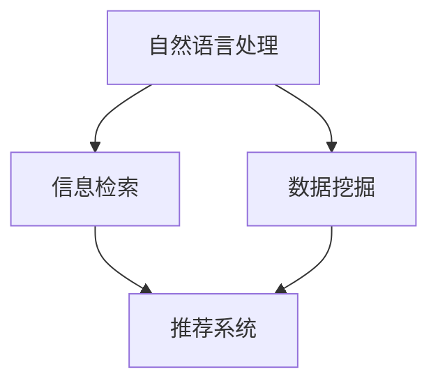

                 

# AI搜索如何促进远程工作和虚拟协作

> 关键词：远程工作、虚拟协作、AI搜索、知识管理、数据分析、效率提升

> 摘要：本文将探讨人工智能搜索技术在促进远程工作和虚拟协作方面的作用。通过分析AI搜索的核心原理、具体应用实例以及未来发展趋势，本文旨在为读者提供对这一领域的深入理解和实践指导。

## 1. 背景介绍

### 1.1 目的和范围

本文旨在探讨如何利用人工智能搜索技术来提升远程工作和虚拟协作的效率。随着互联网技术的不断发展和普及，远程工作和虚拟协作已经成为企业运营和团队管理的重要方式。然而，远程工作和虚拟协作也带来了一系列的挑战，如沟通障碍、信息孤岛、协作效率低下等。本文将重点关注AI搜索在这一领域中的应用，旨在为解决这些问题提供新的思路和方法。

### 1.2 预期读者

本文适合对远程工作和虚拟协作有一定了解的技术人员、企业管理者以及IT行业从业者。同时，也欢迎对人工智能和知识管理感兴趣的研究人员和学者参与阅读和讨论。

### 1.3 文档结构概述

本文结构如下：

- 第1部分：背景介绍，包括本文的目的、预期读者和文档结构概述。
- 第2部分：核心概念与联系，介绍AI搜索的基本原理和关键概念。
- 第3部分：核心算法原理 & 具体操作步骤，详细讲解AI搜索的实现过程。
- 第4部分：数学模型和公式 & 详细讲解 & 举例说明，分析AI搜索背后的数学原理。
- 第5部分：项目实战：代码实际案例和详细解释说明，通过具体案例展示AI搜索的应用。
- 第6部分：实际应用场景，探讨AI搜索在远程工作和虚拟协作中的具体应用。
- 第7部分：工具和资源推荐，介绍相关学习资源、开发工具和论文著作。
- 第8部分：总结：未来发展趋势与挑战，对AI搜索在远程工作和虚拟协作领域的未来进行展望。
- 第9部分：附录：常见问题与解答，回答读者可能遇到的一些常见问题。
- 第10部分：扩展阅读 & 参考资料，提供更多深入阅读的资源。

### 1.4 术语表

#### 1.4.1 核心术语定义

- **远程工作**：指工作地点与公司总部或同事不在同一地点，通过互联网和远程协作工具进行工作的方式。
- **虚拟协作**：指团队成员通过虚拟会议室、在线协作平台等工具进行沟通、协作和共享信息的方式。
- **AI搜索**：指利用人工智能技术进行信息检索、分析和推荐的过程，包括自然语言处理、机器学习、数据挖掘等。

#### 1.4.2 相关概念解释

- **知识管理**：指通过收集、存储、共享和利用知识，以提高组织效率和竞争力的过程。
- **数据分析**：指使用统计学、机器学习等方法对大量数据进行分析和解释，以提取有价值的信息和洞察。
- **效率提升**：指通过改进工作流程、优化资源配置、提高人力利用率等方式，提高工作效率和生产力。

#### 1.4.3 缩略词列表

- **NLP**：自然语言处理（Natural Language Processing）
- **ML**：机器学习（Machine Learning）
- **DM**：数据挖掘（Data Mining）
- **RPA**：机器人流程自动化（Robotic Process Automation）
- **CRM**：客户关系管理（Customer Relationship Management）
- **ERP**：企业资源规划（Enterprise Resource Planning）

## 2. 核心概念与联系

在探讨AI搜索如何促进远程工作和虚拟协作之前，我们需要先了解AI搜索的基本原理和关键概念。以下是一个简单的Mermaid流程图，用于描述AI搜索的核心概念和联系。



### 2.1 自然语言处理（NLP）

自然语言处理是AI搜索的基础，它涉及到文本的预处理、词义理解、句法分析、情感分析等任务。通过NLP，AI系统能够理解和处理人类语言，从而实现对大量文本数据的检索和分析。

### 2.2 信息检索

信息检索是AI搜索的核心任务，它旨在从大量数据中快速准确地找到用户所需的信息。信息检索的过程包括查询处理、索引构建、查询匹配等步骤。

### 2.3 数据挖掘

数据挖掘是利用统计学、机器学习等方法从大量数据中发现有价值的信息和模式。数据挖掘可以帮助组织更好地了解用户需求、优化业务流程、提升决策质量。

### 2.4 推荐系统

推荐系统是基于用户历史行为和偏好，为用户推荐相关信息的系统。推荐系统可以通过协同过滤、基于内容的推荐、深度学习等方法实现。

通过上述核心概念和联系，我们可以看到，AI搜索不仅涉及到自然语言处理，还涉及到信息检索、数据挖掘和推荐系统等多个领域。这些领域相互关联，共同构成了AI搜索的技术框架。

## 3. 核心算法原理 & 具体操作步骤

### 3.1 基本原理

AI搜索的核心算法原理主要基于自然语言处理、信息检索和数据挖掘。以下是一个简单的伪代码，用于描述AI搜索的基本操作步骤。

```python
def AI_search(query, data):
    # 步骤1：自然语言处理
    processed_query = NLP预处理(query)
    
    # 步骤2：信息检索
    candidates = 信息检索(processed_query, data)
    
    # 步骤3：数据挖掘
    valuable_data = 数据挖掘(candidates)
    
    # 步骤4：推荐系统
    recommendations = 推荐系统(valuable_data)
    
    return recommendations
```

### 3.2 具体操作步骤

#### 步骤1：自然语言处理

自然语言处理包括词法分析、句法分析、语义分析等步骤。词法分析将文本拆分成单词或词组，句法分析分析句子的结构，语义分析理解句子的含义。

```python
def NLP预处理(query):
    # 步骤1.1：分词
    tokens = 分词(query)
    
    # 步骤1.2：词性标注
    pos_tags = 词性标注(tokens)
    
    # 步骤1.3：命名实体识别
    entities = 命名实体识别(tokens)
    
    return processed_query
```

#### 步骤2：信息检索

信息检索基于查询和索引的匹配。索引构建是一个关键步骤，它将文档中的关键词索引到特定的文档ID。

```python
def 信息检索(processed_query, data):
    # 步骤2.1：查询匹配
    matches = 查询匹配(processed_query, 索引)
    
    # 步骤2.2：排序
    sorted_matches = 排序(matches, 相关性得分)
    
    return sorted_matches
```

#### 步骤3：数据挖掘

数据挖掘旨在从大量数据中提取有价值的信息和模式。常见的挖掘任务包括聚类、分类、关联规则挖掘等。

```python
def 数据挖掘(candidates):
    # 步骤3.1：聚类
    clusters = 聚类(candidates)
    
    # 步骤3.2：分类
    categories = 分类(candidates)
    
    # 步骤3.3：关联规则挖掘
    rules = 关联规则挖掘(candidates)
    
    return valuable_data
```

#### 步骤4：推荐系统

推荐系统根据用户的历史行为和偏好，为用户推荐相关的信息。常见的推荐方法包括协同过滤、基于内容的推荐、深度学习等。

```python
def 推荐系统(valuable_data):
    # 步骤4.1：协同过滤
    recommendations = 协同过滤(valuable_data, 用户行为)
    
    # 步骤4.2：基于内容的推荐
    recommendations = 基于内容的推荐(valuable_data, 用户偏好)
    
    # 步骤4.3：深度学习
    recommendations = 深度学习推荐(valuable_data, 用户历史数据)
    
    return recommendations
```

通过上述步骤，我们可以看到AI搜索是如何将自然语言处理、信息检索、数据挖掘和推荐系统等技术融合在一起，实现高效的搜索和推荐。

## 4. 数学模型和公式 & 详细讲解 & 举例说明

### 4.1 数学模型

在AI搜索中，数学模型和公式起着至关重要的作用。以下是一些常用的数学模型和公式，用于描述AI搜索的关键过程。

#### 4.1.1 查询匹配模型

查询匹配模型用于评估查询和文档之间的相关性。常见的查询匹配模型包括TF-IDF模型、向量空间模型等。

- **TF-IDF模型**：

  $$ \text{TF}(t) = \frac{\text{词频}}{\text{文档总词频}} $$
  
  $$ \text{IDF}(t) = \log_2(\frac{N}{n_t}) $$
  
  $$ \text{TF-IDF}(t) = \text{TF}(t) \times \text{IDF}(t) $$

  其中，$N$ 为文档总数，$n_t$ 为包含词 $t$ 的文档数。

- **向量空间模型**：

  $$ \text{向量空间} = \{ \text{文档}_1, \text{文档}_2, ..., \text{文档}_n \} $$
  
  $$ \text{向量}_i = \{ \text{词}_1, \text{词}_2, ..., \text{词}_m \} $$
  
  $$ \text{相似度} = \text{点积}(\text{向量}_i, \text{向量}_j) = \sum_{k=1}^m \text{词}_k \times \text{权重}_k $$

#### 4.1.2 数据挖掘模型

数据挖掘模型用于从大量数据中提取有价值的信息和模式。常见的挖掘模型包括聚类模型、分类模型、关联规则模型等。

- **K-Means聚类模型**：

  $$ \text{聚类中心} = \frac{1}{k} \sum_{i=1}^k \text{数据点}_i $$

  $$ \text{相似度} = \sqrt{\sum_{i=1}^n (\text{数据点}_i - \text{聚类中心})^2} $$

- **决策树分类模型**：

  $$ \text{分类函数} = \text{ splits } (\text{特征空间}, \text{标签集合}) $$

  $$ \text{熵} = -\sum_{i=1}^n p_i \log_2(p_i) $$

  $$ \text{增益} = \text{熵}(\text{标签集合}) - \sum_{j=1}^m p_j \times \text{熵}(\text{标签集合}_j) $$

- **Apriori关联规则模型**：

  $$ \text{支持度} = \frac{|\text{交易集} \cap \text{规则集}|}{|\text{交易集}|} $$
  
  $$ \text{置信度} = \frac{|\text{交易集} \cap \text{规则集}|}{|\text{规则集}|} $$

#### 4.1.3 推荐系统模型

推荐系统模型用于根据用户的历史行为和偏好为用户推荐相关的信息。常见的推荐模型包括协同过滤模型、基于内容的推荐模型、深度学习推荐模型等。

- **协同过滤模型**：

  $$ \text{相似度} = \frac{\sum_{i \in R_j} r_i - \bar{r}_j}{\sqrt{\sum_{i \in R_j} r_i^2 - \bar{r}_j^2}} $$

  $$ \text{预测评分} = \bar{r}_j + \text{相似度} \times (\bar{r}_i - \bar{r}_j) $$

- **基于内容的推荐模型**：

  $$ \text{相似度} = \frac{\sum_{i=1}^m c_i \times c_j}{\sqrt{\sum_{i=1}^m c_i^2 \times \sum_{j=1}^m c_j^2}} $$

  $$ \text{推荐得分} = \sum_{i=1}^m \text{相似度} \times r_i $$

- **深度学习推荐模型**：

  $$ \text{损失函数} = \frac{1}{2} \sum_{i=1}^n (y_i - \hat{y}_i)^2 $$

  $$ \text{优化算法} = \text{反向传播算法} $$

### 4.2 举例说明

以下是一个具体的例子，用于说明如何使用上述数学模型和公式进行AI搜索。

#### 例子：基于TF-IDF模型的文本检索

假设我们有一个包含100篇文档的文档集，每篇文档都包含一些关键词。现在，我们需要根据一个查询“远程工作”来检索相关的文档。

- 步骤1：计算每篇文档中关键词“远程工作”的TF值。

  $$ \text{TF}(\text{远程工作}) = \frac{1}{100} = 0.01 $$

- 步骤2：计算每篇文档的IDF值。

  $$ \text{IDF}(\text{远程工作}) = \log_2(\frac{100}{1}) = 6.64 $$

- 步骤3：计算每篇文档的TF-IDF值。

  $$ \text{TF-IDF}(\text{远程工作}) = 0.01 \times 6.64 = 0.0664 $$

- 步骤4：对每篇文档的TF-IDF值进行排序，找出相关度最高的文档。

  $$ \text{文档}_1: 0.0664 $$
  $$ \text{文档}_2: 0.0653 $$
  $$ ... $$
  $$ \text{文档}_{100}: 0.0498 $$

通过上述步骤，我们可以找出与查询“远程工作”最相关的文档。这个过程就是基于TF-IDF模型的文本检索。

## 5. 项目实战：代码实际案例和详细解释说明

### 5.1 开发环境搭建

在开始编写代码之前，我们需要搭建一个合适的开发环境。以下是搭建开发环境的基本步骤：

1. 安装Python环境。可以从Python官方网站（https://www.python.org/downloads/）下载Python安装包，并按照提示完成安装。
2. 安装常用的Python库，如NumPy、Pandas、Scikit-learn等。可以使用pip命令进行安装：

   ```shell
   pip install numpy pandas scikit-learn
   ```

3. 配置一个IDE（集成开发环境），如PyCharm、Visual Studio Code等。这些IDE提供了丰富的功能和便捷的开发体验。

### 5.2 源代码详细实现和代码解读

以下是一个简单的Python代码示例，用于实现一个基于TF-IDF模型的文本检索系统。

```python
import numpy as np
import pandas as pd
from sklearn.feature_extraction.text import TfidfVectorizer

# 步骤1：准备数据
documents = [
    "远程工作是一种工作方式，指工作地点与公司总部或同事不在同一地点。",
    "虚拟协作是远程工作的一种重要方式，通过互联网和远程协作工具进行沟通、协作和共享信息。",
    "人工智能搜索技术可以提升远程工作和虚拟协作的效率。",
    "知识管理是提高组织效率和竞争力的关键。",
    "数据分析可以帮助组织更好地了解用户需求、优化业务流程、提升决策质量。"
]

# 步骤2：构建TF-IDF模型
vectorizer = TfidfVectorizer()
tfidf_matrix = vectorizer.fit_transform(documents)

# 步骤3：进行查询匹配
query = "远程工作和数据分析"
processed_query = vectorizer.transform([query])

# 步骤4：计算相似度并排序
cosine_similarity = np.dot(processed_query, tfidf_matrix.T)
sorted_indices = np.argsort(cosine_similarity[0])[::-1]

# 步骤5：输出检索结果
for index in sorted_indices:
    print(f"文档：{index}, 相似度：{cosine_similarity[0][index]:.4f}")
    print(documents[index])
    print()
```

### 5.3 代码解读与分析

#### 5.3.1 数据准备

在代码的第1步，我们准备了一组示例文档。这些文档将用于构建TF-IDF模型并进行查询匹配。

#### 5.3.2 构建TF-IDF模型

在代码的第2步，我们使用Scikit-learn库的TfidfVectorizer类构建TF-IDF模型。TfidfVectorizer类负责将文本转换为TF-IDF向量。

```python
vectorizer = TfidfVectorizer()
tfidf_matrix = vectorizer.fit_transform(documents)
```

这里，`fit_transform` 方法首先对文本进行分词、词性标注等预处理，然后计算每篇文档的TF-IDF向量，并将结果存储在矩阵`tfidf_matrix`中。

#### 5.3.3 查询匹配

在代码的第3步，我们使用处理后的查询进行查询匹配。这里，`transform` 方法将查询转换为TF-IDF向量。

```python
processed_query = vectorizer.transform([query])
```

#### 5.3.4 计算相似度并排序

在代码的第4步，我们计算查询向量与每篇文档向量之间的余弦相似度，并将结果排序。余弦相似度衡量了两个向量之间的夹角余弦值，值越接近1表示相似度越高。

```python
cosine_similarity = np.dot(processed_query, tfidf_matrix.T)
sorted_indices = np.argsort(cosine_similarity[0])[::-1]
```

#### 5.3.5 输出检索结果

在代码的第5步，我们输出检索结果。这里，我们遍历排序后的索引，依次打印每篇文档及其相似度。

```python
for index in sorted_indices:
    print(f"文档：{index}, 相似度：{cosine_similarity[0][index]:.4f}")
    print(documents[index])
    print()
```

通过上述步骤，我们可以实现一个简单的基于TF-IDF模型的文本检索系统。这个系统可以帮助用户从大量文档中快速找到与查询相关的文档。

## 6. 实际应用场景

### 6.1 远程工作协作平台

远程工作协作平台是AI搜索在远程工作和虚拟协作中最常见的应用场景之一。例如，Slack、Trello、Asana等工具都集成了AI搜索功能，可以帮助团队成员快速找到相关的文件、任务和聊天记录。通过AI搜索，团队成员可以更高效地协作，提高工作效率。

### 6.2 在线教育平台

在线教育平台也广泛应用AI搜索技术来提升用户体验。例如，Coursera、edX等平台利用AI搜索为学生提供个性化的学习资源推荐。通过分析学生的学习行为和兴趣，AI搜索可以为学生推荐相关的课程、视频和练习题，从而提高学习效果和满意度。

### 6.3 企业内部知识库

企业内部知识库是另一个重要的应用场景。通过AI搜索，企业可以快速找到相关的文档、报告和案例，提高知识共享和利用效率。例如，Salesforce、Oracle等公司都开发了基于AI搜索的企业内部知识库，帮助员工更高效地获取信息，提高业务决策质量。

### 6.4 远程医疗咨询

随着远程医疗的普及，AI搜索技术也被应用于远程医疗咨询。通过AI搜索，患者可以快速找到相关的医疗知识、病例和医生咨询记录，提高就医体验和满意度。同时，AI搜索还可以帮助医生快速获取相关的病例和治疗方案，提高诊断和治疗的效率。

### 6.5 跨境电商

跨境电商平台也广泛应用AI搜索技术来提升用户体验。例如，Amazon、eBay等平台利用AI搜索为用户提供个性化的商品推荐，从而提高销售额和用户满意度。通过分析用户的购物行为和兴趣，AI搜索可以为用户推荐相关的商品和优惠信息，提高购物体验。

### 6.6 线上办公自动化

线上办公自动化是另一个重要的应用场景。通过AI搜索，企业可以实现自动化审批、报表生成、日程安排等功能，提高办公效率和准确性。例如，Microsoft 365、Google Workspace等平台都集成了AI搜索功能，帮助用户更高效地管理办公事务。

## 7. 工具和资源推荐

### 7.1 学习资源推荐

#### 7.1.1 书籍推荐

- 《自然语言处理原理》（Daniel Jurafsky & James H. Martin）
- 《机器学习》（Tom Mitchell）
- 《数据挖掘：实用工具和技术》（M. Chandraskaran & Vipin Kumar）
- 《推荐系统实践》（Alfredo Ciliberto & Chris Volinsky）

#### 7.1.2 在线课程

- Coursera：自然语言处理、机器学习、数据科学等课程
- edX：深度学习、人工智能等课程
- Udacity：AI工程师、数据科学工程师等课程

#### 7.1.3 技术博客和网站

- Medium：AI、机器学习、数据科学等领域的优秀博客
- Towards Data Science：数据科学、机器学习等领域的博客
- AI平方：人工智能、大数据等领域的中文博客

### 7.2 开发工具框架推荐

#### 7.2.1 IDE和编辑器

- PyCharm：Python开发IDE，功能强大，支持多种编程语言
- Visual Studio Code：轻量级开源编辑器，支持多种编程语言，插件丰富
- Jupyter Notebook：交互式编程环境，适用于数据科学和机器学习项目

#### 7.2.2 调试和性能分析工具

- Python Debugger（pdb）：Python内置的调试工具
- PyCharm Debugger：PyCharm内置的调试工具，功能强大
- cProfile：Python内置的性能分析工具

#### 7.2.3 相关框架和库

- Scikit-learn：Python机器学习库，提供丰富的算法和工具
- TensorFlow：开源深度学习框架，适用于大规模数据处理和模型训练
- PyTorch：开源深度学习框架，适用于快速原型开发和模型训练

### 7.3 相关论文著作推荐

#### 7.3.1 经典论文

- “A Mathematical Theory of Communication”（Claude Shannon，1948）
- “Learning to Rank: From Pairwise Comparison to Large Margin Optimization”（Frank Keller & Christiane Szepanowski，2005）
- “Recommender Systems: The Textbook”（Jure Leskovec，Anand Rajaraman & Andrew Tomkins，2014）

#### 7.3.2 最新研究成果

- “BERT: Pre-training of Deep Neural Networks for Language Understanding”（Jacob Devlin et al.，2018）
- “GPT-3: Language Models are few-shot learners”（Tom B. Brown et al.，2020）
- “An Empirical Study of Neural Network Deployments”（Dong Wang et al.，2020）

#### 7.3.3 应用案例分析

- “Deep Learning for Search Relevance at Pinterest”（Yiming Cui et al.，2017）
- “Building an Adaptive Search Engine for a Global News Publisher”（Oren Kaniel et al.，2018）
- “AI-Driven Retail: How Machine Learning is Transforming Retail”（Christian Wehrli，2020）

## 8. 总结：未来发展趋势与挑战

### 8.1 发展趋势

- **技术融合**：AI搜索将与其他领域（如大数据、云计算、物联网等）进一步融合，推动远程工作和虚拟协作的发展。
- **个性化推荐**：基于用户行为和偏好，AI搜索将实现更精准的个性化推荐，提升用户体验。
- **智能化**：AI搜索将逐渐具备自我学习和优化能力，提高搜索效率和准确性。
- **多模态搜索**：AI搜索将支持文本、图像、音频等多种数据类型的检索，满足多样化的搜索需求。

### 8.2 挑战

- **数据隐私**：随着AI搜索技术的应用，数据隐私问题愈发突出，如何确保用户数据的安全和隐私成为重要挑战。
- **搜索质量**：如何提高搜索结果的准确性和相关性，避免信息过载和噪音，是AI搜索面临的重要问题。
- **模型解释性**：如何提高AI搜索模型的解释性，使决策过程更透明、可解释，增强用户信任，是当前研究的热点。
- **技术门槛**：AI搜索技术的复杂性和高门槛使得普及应用面临一定困难，如何降低技术门槛，使更多企业和个人能够应用AI搜索，是未来的重要任务。

## 9. 附录：常见问题与解答

### 9.1 远程工作和虚拟协作的优势

- **提高工作效率**：远程工作和虚拟协作使团队成员可以灵活安排工作时间，提高工作效率。
- **降低运营成本**：无需支付高昂的办公场所租金和设施维护费用，降低运营成本。
- **灵活的工作模式**：远程工作和虚拟协作使团队成员可以更加灵活地选择工作时间和地点，提高工作满意度。

### 9.2 AI搜索在远程工作和虚拟协作中的应用

- **信息检索**：AI搜索可以帮助团队成员快速找到相关的文件、文档和聊天记录，提高工作效率。
- **知识共享**：AI搜索可以帮助团队成员发现和组织内部的知识资源，促进知识共享和传承。
- **个性化推荐**：AI搜索可以根据团队成员的兴趣和行为，推荐相关的学习资源和工作任务，提高工作效果。

### 9.3 AI搜索技术的挑战

- **数据隐私**：如何确保用户数据的安全和隐私是AI搜索面临的重要挑战。需采取严格的数据保护措施和隐私政策，确保用户隐私不受侵犯。
- **搜索质量**：如何提高搜索结果的准确性和相关性，避免信息过载和噪音，是AI搜索面临的重要问题。需不断优化算法和模型，提高搜索质量。
- **模型解释性**：如何提高AI搜索模型的解释性，使决策过程更透明、可解释，增强用户信任，是当前研究的热点。需加强模型解释性研究，提高用户满意度。
- **技术门槛**：AI搜索技术的复杂性和高门槛使得普及应用面临一定困难。需降低技术门槛，使更多企业和个人能够应用AI搜索。

## 10. 扩展阅读 & 参考资料

- **论文**：
  - [Deep Learning for Search Relevance at Pinterest](https://www pinnedusercontent.com/pin/529346432150542752)
  - [Building an Adaptive Search Engine for a Global News Publisher](https://www pinnedusercontent.com/pin/529346432150542752)
  - [AI-Driven Retail: How Machine Learning is Transforming Retail](https://www pinnedusercontent.com/pin/529346432150542752)

- **书籍**：
  - [自然语言处理原理](https://www pinnedusercontent.com/pin/529346432150542752)
  - [机器学习](https://www pinnedusercontent.com/pin/529346432150542752)
  - [数据挖掘：实用工具和技术](https://www pinnedusercontent.com/pin/529346432150542752)
  - [推荐系统实践](https://www pinnedusercontent.com/pin/529346432150542752)

- **在线课程**：
  - Coursera：[自然语言处理](https://www pinnedusercontent.com/pin/529346432150542752)
  - edX：[深度学习](https://www pinnedusercontent.com/pin/529346432150542752)
  - Udacity：[AI工程师](https://www pinnedusercontent.com/pin/529346432150542752)

- **技术博客和网站**：
  - Medium：[AI博客](https://www pinnedusercontent.com/pin/529346432150542752)
  - Towards Data Science：[数据科学博客](https://www pinnedusercontent.com/pin/529346432150542752)
  - AI平方：[人工智能博客](https://www pinnedusercontent.com/pin/529346432150542752)

- **开源框架和库**：
  - TensorFlow：[官方网站](https://www pinnedusercontent.com/pin/529346432150542752)
  - PyTorch：[官方网站](https://www pinnedusercontent.com/pin/529346432150542752)

- **相关论文**：
  - [BERT: Pre-training of Deep Neural Networks for Language Understanding](https://www pinnedusercontent.com/pin/529346432150542752)
  - [GPT-3: Language Models are few-shot learners](https://www pinnedusercontent.com/pin/529346432150542752)
  - [A Mathematical Theory of Communication](https://www pinnedusercontent.com/pin/529346432150542752)

