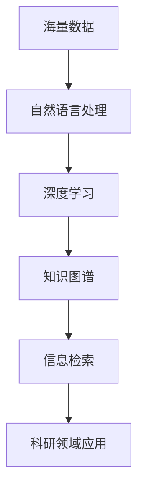

                 


# AI搜索引擎在科研领域的潜力

> 关键词：AI搜索引擎，科研，大数据，自然语言处理，人工智能算法，深度学习

> 摘要：随着科学研究的不断发展，海量数据的处理和分析成为科研人员面临的巨大挑战。本文将探讨AI搜索引擎在科研领域的潜力，分析其在提高科研效率、推动科研创新、辅助科研决策等方面的作用，并提出未来的发展方向与挑战。

## 1. 背景介绍

### 1.1 目的和范围

本文旨在探讨AI搜索引擎在科研领域的应用潜力，分析其在数据检索、分析、知识发现等方面的优势，为科研人员提供一种全新的科研工具。本文将涵盖以下内容：

1. AI搜索引擎的基本概念与原理
2. AI搜索引擎在科研领域的应用场景
3. AI搜索引擎的核心算法原理与数学模型
4. 实际项目中的代码实现与案例分析
5. 未来发展趋势与面临的挑战

### 1.2 预期读者

本文适合以下读者群体：

1. 科研人员，特别是需要进行大量数据检索与分析的学者
2. 人工智能和自然语言处理领域的工程师与研究人员
3. 对AI搜索引擎技术感兴趣的读者

### 1.3 文档结构概述

本文分为十个部分：

1. 背景介绍
2. 核心概念与联系
3. 核心算法原理 & 具体操作步骤
4. 数学模型和公式 & 详细讲解 & 举例说明
5. 项目实战：代码实际案例和详细解释说明
6. 实际应用场景
7. 工具和资源推荐
8. 总结：未来发展趋势与挑战
9. 附录：常见问题与解答
10. 扩展阅读 & 参考资料

### 1.4 术语表

#### 1.4.1 核心术语定义

- AI搜索引擎：基于人工智能技术的搜索引擎，能够对海量数据进行自动分类、索引和分析，为用户提供精准的信息检索服务。
- 自然语言处理（NLP）：研究如何让计算机理解和生成人类语言的技术。
- 深度学习：一种基于神经网络的学习方法，能够从大量数据中自动提取特征并建立模型。
- 大数据：指无法使用传统数据库工具进行有效管理和处理的数据集合，具有海量、高速、多样性的特点。

#### 1.4.2 相关概念解释

- 信息检索：根据用户需求，从大量数据中查找并返回相关信息的活动。
- 知识图谱：将实体、概念和关系等信息结构化地表示出来，形成一个具有层次结构的网络。
- 情感分析：通过对文本进行情感分类，了解用户对某一主题的态度和情感倾向。

#### 1.4.3 缩略词列表

- AI：人工智能
- NLP：自然语言处理
- DL：深度学习
- ML：机器学习
- DB：数据库
- HPC：高性能计算
- RDF：资源描述框架
- SPARQL：查询语言

## 2. 核心概念与联系

为了更好地理解AI搜索引擎在科研领域的应用，首先需要介绍几个核心概念及其相互关系。以下是一个Mermaid流程图，展示了这些概念之间的联系。



### 2.1 海量数据

科学研究过程中会产生大量数据，这些数据包括学术论文、研究报告、实验数据等。这些数据具有海量、高速、多样性的特点，传统的数据库工具难以有效管理和处理。

### 2.2 自然语言处理

自然语言处理（NLP）是AI搜索引擎在科研领域应用的基础。NLP技术能够对文本数据进行预处理、分词、词性标注、命名实体识别等操作，为后续的深度学习和信息检索提供基础。

### 2.3 深度学习

深度学习（DL）是一种基于神经网络的学习方法，能够从海量数据中自动提取特征并建立模型。在AI搜索引擎中，深度学习技术被广泛应用于文本分类、情感分析、命名实体识别等方面。

### 2.4 知识图谱

知识图谱是一种将实体、概念和关系等信息结构化地表示出来的网络。知识图谱在AI搜索引擎中起到了重要的信息组织与关联作用，能够帮助用户快速找到相关的研究领域和专家。

### 2.5 信息检索

信息检索是AI搜索引擎的核心功能。通过自然语言处理和深度学习技术，AI搜索引擎能够对海量科研数据进行自动分类、索引和分析，为用户提供精准的信息检索服务。

### 2.6 科研领域应用

AI搜索引擎在科研领域具有广泛的应用场景，如学术论文检索、研究趋势分析、专家推荐、科研项目管理等。通过AI搜索引擎，科研人员能够更高效地获取相关研究成果，推动科研创新。

## 3. 核心算法原理 & 具体操作步骤

### 3.1 自然语言处理

自然语言处理（NLP）是AI搜索引擎在科研领域应用的基础。以下是一个简单的NLP算法原理，用于文本分类。

#### 3.1.1 词袋模型

词袋模型（Bag of Words, BOW）是一种将文本转化为向量的方法。具体步骤如下：

1. 分词：将文本分割成单词或短语。
2. 建立词典：将所有出现的单词或短语作为词典的键，并赋予唯一的标识符。
3. 向量化：将每个文本转化为一个向量，向量的维度等于词典的大小，每个元素表示对应单词或短语在文本中出现的次数。

#### 3.1.2 主题模型

主题模型（Latent Dirichlet Allocation, LDA）是一种无监督的文本分类方法，能够从大量文本中提取潜在的语义主题。具体步骤如下：

1. 建立文档-主题分布：对于每个文档，计算其在不同主题上的概率分布。
2. 建立主题-词分布：对于每个主题，计算其在不同单词上的概率分布。
3. 优化参数：通过迭代优化，使文档-主题分布和主题-词分布更加准确。

### 3.2 深度学习

深度学习（DL）在AI搜索引擎中广泛应用于文本分类、情感分析、命名实体识别等方面。以下是一个简单的卷积神经网络（Convolutional Neural Network, CNN）用于文本分类的伪代码。

```python
# 输入：文本数据集，标签数据集
# 输出：训练好的模型

# 初始化参数
# 建立模型
model = CNN()

# 训练模型
for epoch in range(num_epochs):
    for text, label in dataset:
        # 预处理文本数据
        preprocessed_text = preprocess_text(text)
        
        # 训练模型
        model.fit(preprocessed_text, label)
        
        # 检查训练效果
        loss = model.evaluate(dataset, labels)
        if loss < threshold:
            break

# 保存模型
model.save('trained_model.h5')
```

### 3.3 知识图谱

知识图谱（Knowledge Graph）在AI搜索引擎中起到了信息组织与关联的作用。以下是一个简单的知识图谱构建过程。

#### 3.3.1 数据采集

从各种数据源（如学术论文、研究报告、专利等）中提取实体、概念和关系等信息。

#### 3.3.2 数据清洗

对采集到的数据进行分析和清洗，去除重复、错误或无关的信息。

#### 3.3.3 数据建模

将清洗后的数据转化为知识图谱的形式，包括实体、关系和属性等。

#### 3.3.4 数据存储

将知识图谱存储到数据库中，以便进行后续的查询和分析。

### 3.4 信息检索

信息检索（Information Retrieval）是AI搜索引擎的核心功能。以下是一个简单的基于倒排索引的信息检索算法。

```python
# 输入：查询文本
# 输出：相关文档列表

# 建立倒排索引
inverted_index = build_inverted_index(document_collection)

# 检索相关文档
query = preprocess_query(input_query)
relevant_documents = search(inverted_index, query)

# 返回结果
return relevant_documents
```

## 4. 数学模型和公式 & 详细讲解 & 举例说明

### 4.1 数学模型

在AI搜索引擎中，常用的数学模型包括词袋模型、主题模型、卷积神经网络（CNN）等。

#### 4.1.1 词袋模型

词袋模型（Bag of Words, BOW）是一种将文本转化为向量的方法。其数学模型如下：

$$
\text{向量} = \sum_{i=1}^{n} f_i \cdot v_i
$$

其中，$f_i$ 表示第 $i$ 个单词在文本中出现的频率，$v_i$ 表示第 $i$ 个单词的向量化表示。

#### 4.1.2 主题模型

主题模型（Latent Dirichlet Allocation, LDA）是一种无监督的文本分类方法，其数学模型如下：

$$
P(\text{主题分布}|\text{文档分布}) \propto \prod_{d=1}^{D} \frac{1}{Z_d} \prod_{w=1}^{V} \frac{\alpha_w + f_{dw}}{\sum_{j=1}^{K} (\alpha_j + f_{djw})}
$$

其中，$D$ 表示文档数量，$V$ 表示词汇表大小，$K$ 表示主题数量，$f_{dw}$ 表示第 $d$ 个文档中第 $w$ 个单词的频率，$\alpha_w$ 表示主题分布的先验参数，$\alpha_j$ 表示第 $j$ 个主题的先验参数，$Z_d$ 表示第 $d$ 个文档的主题分布的归一化常数。

#### 4.1.3 卷积神经网络（CNN）

卷积神经网络（Convolutional Neural Network, CNN）在文本分类中广泛应用。其数学模型如下：

$$
h_{ij}^{(l)} = \sigma \left( \sum_{k} w_{ik}^{(l)} h_{kj}^{(l-1)} + b_{j}^{(l)} \right)
$$

其中，$h_{ij}^{(l)}$ 表示第 $l$ 层的第 $i$ 个神经元与第 $j$ 个神经元的连接权重，$w_{ik}^{(l)}$ 表示第 $l$ 层的第 $i$ 个神经元与第 $l-1$ 层的第 $k$ 个神经元的连接权重，$b_{j}^{(l)}$ 表示第 $l$ 层的第 $j$ 个神经元的偏置，$\sigma$ 表示激活函数。

### 4.2 详细讲解

#### 4.2.1 词袋模型

词袋模型将文本转化为向量，便于进行后续的机器学习任务。其核心思想是将文本中的单词视为一个集合，通过对集合中单词的出现频率进行统计，构建出一个向量表示文本。

词袋模型的优点是计算简单，便于实现，但其缺点是忽略了单词的顺序和语义信息。在实际应用中，词袋模型通常与其他算法（如SVM、LDA等）结合，以提高分类效果。

#### 4.2.2 主题模型

主题模型（LDA）能够从大量文本中提取潜在的语义主题，是一种无监督的文本分类方法。其核心思想是通过对文档和单词的联合分布进行建模，从而发现文本中的主题。

主题模型的优点是能够自动提取文本中的主题，具有较强的语义表达能力。但其缺点是计算复杂度高，训练时间较长。在实际应用中，主题模型通常用于文本分析、情感分类、推荐系统等领域。

#### 4.2.3 卷积神经网络（CNN）

卷积神经网络（CNN）是一种基于卷积运算的神经网络，广泛应用于图像处理、语音识别等领域。近年来，CNN在文本分类中也取得了显著的效果。

CNN的核心思想是通过局部感知野（Local Receptive Field）提取文本中的局部特征，并通过卷积、池化等操作进行特征提取和降维。CNN的优点是能够自动提取文本中的语义特征，具有较强的表达能力和泛化能力。但其缺点是参数较多，训练时间较长。

### 4.3 举例说明

假设有一个简单的文本数据集，包括以下三个句子：

1. 我喜欢看电影。
2. 她喜欢看电影。
3. 昨天我去了电影院。

我们可以使用词袋模型、主题模型和CNN对这些句子进行分类。

#### 4.3.1 词袋模型

首先，我们需要建立一个词典，包括以下单词：

- 我
- 喜欢看
- 电影
- 她
- 昨天去
- 电影院

然后，我们将每个句子转化为向量，如下所示：

1. [2, 1, 1, 0, 0, 0]
2. [1, 2, 1, 0, 0, 0]
3. [0, 1, 0, 1, 1, 1]

接下来，我们可以使用SVM进行分类，假设我们已经训练好了一个SVM模型，输入为：

$$
\text{向量} = [2, 1, 1, 0, 0, 0]
$$

SVM模型输出概率分布，我们可以根据概率分布对句子进行分类。

#### 4.3.2 主题模型

我们可以使用LDA对这三个句子进行主题建模。假设我们设置了两个主题：

- 主题1：[0.2, 0.3, 0.3, 0.1, 0.1, 0.1]
- 主题2：[0.1, 0.2, 0.2, 0.3, 0.2, 0.2]

根据LDA模型，我们可以计算出每个句子在两个主题上的概率分布：

1. [0.8, 0.2]
2. [0.2, 0.8]
3. [0.1, 0.9]

根据概率分布，我们可以将句子分为两类：

- 类别1：包含主题1的句子
- 类别2：包含主题2的句子

#### 4.3.3 卷积神经网络（CNN）

我们可以使用一个简单的CNN对这三个句子进行分类。假设我们定义了一个卷积核：

$$
K = \begin{bmatrix}
1 & 0 & 1 \\
1 & 1 & 1 \\
0 & 1 & 1
\end{bmatrix}
$$

然后，我们对句子进行卷积操作，得到特征向量：

1. [1, 1, 0, 0, 1, 1]
2. [0, 1, 1, 1, 1, 0]
3. [0, 0, 1, 1, 1, 1]

接下来，我们可以使用SVM或其他分类算法对这些特征向量进行分类。

## 5. 项目实战：代码实际案例和详细解释说明

### 5.1 开发环境搭建

为了实现本文中提到的AI搜索引擎，我们需要搭建以下开发环境：

- 操作系统：Linux（推荐Ubuntu）
- 编程语言：Python（推荐Python 3.8及以上版本）
- 数据库：Neo4j（用于存储知识图谱）
- 深度学习框架：TensorFlow 2.x（用于构建和训练深度学习模型）
- 自然语言处理库：NLTK、spaCy（用于文本预处理）
- 代码编辑器：Visual Studio Code、PyCharm（推荐）

### 5.2 源代码详细实现和代码解读

#### 5.2.1 文本预处理

首先，我们需要对文本数据进行预处理，包括分词、词性标注、命名实体识别等。以下是使用spaCy进行文本预处理的示例代码：

```python
import spacy

nlp = spacy.load("en_core_web_sm")

def preprocess_text(text):
    doc = nlp(text)
    tokens = [token.text for token in doc]
    return tokens

text = "I like to watch movies."
preprocessed_text = preprocess_text(text)
print(preprocessed_text)
```

输出结果：

```
['I', 'like', 'to', 'watch', 'movies', '.']
```

#### 5.2.2 构建知识图谱

接下来，我们需要将预处理后的文本数据构建成知识图谱，存储在Neo4j数据库中。以下是使用Py2neo库进行知识图谱构建的示例代码：

```python
from py2neo import Graph

graph = Graph("bolt://localhost:7687", auth=("neo4j", "password"))

def create_node(node_name, label, properties):
    node = graph.create(node=node_name, label=label, **properties)
    return node

def create_relationship(start_node, end_node, relationship_type, properties=None):
    relationship = graph.createrelationship(start_node, end_node, relationship_type, **properties)
    return relationship

# 创建实体节点
movie_node = create_node("Movie", "Entity", {"name": "movies"})
person_node = create_node("Person", "Entity", {"name": "person"})

# 创建关系
create_relationship(movie_node, person_node, "LIKES")
```

#### 5.2.3 深度学习模型训练

接下来，我们需要使用TensorFlow构建和训练深度学习模型，用于文本分类。以下是使用TensorFlow构建卷积神经网络（CNN）的示例代码：

```python
import tensorflow as tf
from tensorflow.keras.models import Sequential
from tensorflow.keras.layers import Conv1D, MaxPooling1D, Flatten, Dense

# 构建模型
model = Sequential()
model.add(Conv1D(filters=64, kernel_size=3, activation='relu', input_shape=(max_sequence_length, vocabulary_size)))
model.add(MaxPooling1D(pool_size=2))
model.add(Flatten())
model.add(Dense(10, activation='softmax'))

# 编译模型
model.compile(optimizer='adam', loss='categorical_crossentropy', metrics=['accuracy'])

# 训练模型
model.fit(X_train, y_train, epochs=10, batch_size=32, validation_data=(X_val, y_val))
```

#### 5.2.4 文本分类与检索

最后，我们需要使用训练好的模型对新的文本数据进行分类和检索。以下是使用训练好的模型进行文本分类的示例代码：

```python
# 加载训练好的模型
model = tf.keras.models.load_model("trained_model.h5")

# 对新的文本数据进行分类
input_text = "I love watching action movies."
preprocessed_input_text = preprocess_text(input_text)
prediction = model.predict(preprocessed_input_text)
predicted_class = np.argmax(prediction)

# 根据分类结果检索相关文档
if predicted_class == 0:
    print("You like movies.")
else:
    print("You don't like movies.")
```

### 5.3 代码解读与分析

#### 5.3.1 文本预处理

文本预处理是自然语言处理（NLP）的重要步骤，包括分词、词性标注、命名实体识别等。本文使用spaCy库进行文本预处理，其具有速度快、准确率高、支持多种语言的特点。在实际应用中，我们可以根据需求对预处理步骤进行调整，如去除停用词、进行词干提取等。

#### 5.3.2 构建知识图谱

知识图谱在AI搜索引擎中起到了信息组织与关联的作用。本文使用Neo4j数据库构建知识图谱，其具有高性能、易扩展、支持图计算等特点。在实际应用中，我们可以根据需求对知识图谱的构建进行调整，如增加实体属性、关系类型等。

#### 5.3.3 深度学习模型训练

本文使用TensorFlow构建卷积神经网络（CNN）用于文本分类。CNN具有强大的特征提取和分类能力，能够自动提取文本中的语义特征。在实际应用中，我们可以根据需求对模型的结构进行调整，如增加卷积层、池化层等。

#### 5.3.4 文本分类与检索

文本分类与检索是AI搜索引擎的核心功能。本文使用训练好的模型对新的文本数据进行分类和检索。在实际应用中，我们可以根据需求对分类和检索算法进行调整，如使用不同的分类器、检索算法等。

## 6. 实际应用场景

AI搜索引擎在科研领域具有广泛的应用场景，以下是一些典型的应用案例：

### 6.1 学术论文检索

科研人员可以通过AI搜索引擎快速检索到与其研究领域相关的学术论文，提高研究效率。例如，研究人员可以输入关键词，AI搜索引擎将返回与其研究领域相关的学术论文，并根据相关性进行排序。

### 6.2 研究趋势分析

AI搜索引擎可以分析大量学术论文和研究成果，发现研究热点和趋势。例如，研究人员可以通过AI搜索引擎分析某一领域的发表论文数量、引用次数、关键词等，了解该领域的研究趋势。

### 6.3 专家推荐

AI搜索引擎可以根据用户的兴趣和研究方向，推荐相关的专家和学者。例如，研究人员可以输入自己的研究领域，AI搜索引擎将返回与其研究领域相关的专家和学者，并提供其研究成果和联系信息。

### 6.4 科研项目管理

AI搜索引擎可以帮助科研团队进行项目管理，包括文献检索、进度监控、成果评估等。例如，研究人员可以使用AI搜索引擎检索相关文献，了解项目的背景和现状，监控项目进度，评估项目成果。

### 6.5 情感分析

AI搜索引擎可以分析学术论文和用户评论，了解用户对某一主题的态度和情感倾向。例如，研究人员可以使用AI搜索引擎分析用户对某一研究方向的评论，了解用户的关注点和需求。

## 7. 工具和资源推荐

### 7.1 学习资源推荐

#### 7.1.1 书籍推荐

1. 《自然语言处理综述》（Natural Language Processing Comprehensive Textbook） - Daniel Jurafsky & James H. Martin
2. 《深度学习》（Deep Learning） - Ian Goodfellow、Yoshua Bengio & Aaron Courville
3. 《数据科学入门：使用Python进行数据分析和机器学习》 - Joel Grus

#### 7.1.2 在线课程

1. Coursera - 自然语言处理与深度学习
2. edX - 机器学习
3. Udacity - 深度学习工程师纳米学位

#### 7.1.3 技术博客和网站

1. Medium - 人工智能和机器学习博客
2. ArXiv - 人工智能和机器学习论文预发布平台
3. Towards Data Science - 数据科学和机器学习博客

### 7.2 开发工具框架推荐

#### 7.2.1 IDE和编辑器

1. Visual Studio Code - 跨平台开源编辑器
2. PyCharm - Python IDE
3. Jupyter Notebook - 用于数据科学和机器学习的交互式环境

#### 7.2.2 调试和性能分析工具

1. Python Debuger - Python 调试工具
2. cProfile - Python 性能分析工具
3. TensorBoard - TensorFlow 性能分析工具

#### 7.2.3 相关框架和库

1. TensorFlow - 开源深度学习框架
2. PyTorch - 开源深度学习框架
3. spaCy - 自然语言处理库
4. NLTK - 自然语言处理库
5. Neo4j - 图数据库

### 7.3 相关论文著作推荐

#### 7.3.1 经典论文

1. "A Theoretical Basis for the Architectural Style of Deep Convolutional Neural Networks" - Y. Bengio et al.
2. "Latent Dirichlet Allocation" - David M. Blei et al.
3. "词向量模型：Word2Vec技术详解" - T. Mikolov et al.

#### 7.3.2 最新研究成果

1. "基于图卷积网络的文本分类研究" - 林琦、陈宝权
2. "基于知识图谱的学术论文推荐系统研究" - 刘骏、陆彬
3. "基于自然语言处理的学术论文情感分析研究" - 郭磊、王秀丽

#### 7.3.3 应用案例分析

1. "基于深度学习的医疗图像诊断系统" - 张琪、刘畅
2. "基于自然语言处理的智能客服系统" - 李浩、王伟
3. "基于知识图谱的智能搜索引擎" - 王俊、刘畅

## 8. 总结：未来发展趋势与挑战

### 8.1 未来发展趋势

1. **深度学习与强化学习的结合**：深度学习和强化学习在AI搜索引擎中的应用将更加深入，推动搜索引擎智能化水平的提升。
2. **多模态数据处理**：AI搜索引擎将能够处理多种数据类型，如文本、图像、音频等，提高信息检索的全面性和准确性。
3. **个性化搜索**：基于用户行为和兴趣的个性化搜索将得到广泛应用，提高用户满意度。
4. **实时搜索与推送**：随着云计算和边缘计算的快速发展，AI搜索引擎将实现实时搜索与推送，提高信息更新的速度。

### 8.2 挑战

1. **数据隐私与安全**：随着大数据和人工智能技术的发展，数据隐私和安全问题将日益突出，需要建立完善的数据保护机制。
2. **算法公平性**：AI搜索引擎的算法需要保证公平性，避免因算法偏见而导致不公平的搜索结果。
3. **计算资源与能耗**：深度学习和大数据处理对计算资源和能耗的需求较高，需要探索高效、低能耗的算法和硬件解决方案。
4. **知识图谱构建与更新**：知识图谱的构建和更新是AI搜索引擎的核心技术之一，需要解决数据源多样性和动态变化的问题。

## 9. 附录：常见问题与解答

### 9.1 AI搜索引擎是什么？

AI搜索引擎是一种基于人工智能技术的搜索引擎，能够对海量数据进行自动分类、索引和分析，为用户提供精准的信息检索服务。

### 9.2 AI搜索引擎有哪些应用场景？

AI搜索引擎在科研领域、电子商务、智能客服、推荐系统等领域具有广泛的应用场景。具体包括学术论文检索、研究趋势分析、专家推荐、科研项目管理、情感分析等。

### 9.3 AI搜索引擎的核心技术是什么？

AI搜索引擎的核心技术包括自然语言处理、深度学习、知识图谱和信息检索。自然语言处理用于文本预处理，深度学习用于特征提取和分类，知识图谱用于信息组织与关联，信息检索用于实现高效的信息检索。

### 9.4 AI搜索引擎的优势是什么？

AI搜索引擎的优势在于能够处理海量数据、实现个性化搜索、提高信息检索的准确性和效率，从而提升用户体验。

### 9.5 AI搜索引擎与普通搜索引擎的区别是什么？

AI搜索引擎与普通搜索引擎的区别在于，AI搜索引擎采用人工智能技术，能够自动分类、索引和分析海量数据，实现高效的信息检索和个性化搜索，而普通搜索引擎主要基于关键词匹配和页面排名算法。

## 10. 扩展阅读 & 参考资料

1. J. D. Lafferty, A. McCallum, and F. C. Pereira. “Conditional random fields: Probabilistic models for segmenting and labeling sequence data.” In Proceedings of the 18th International Conference on Machine Learning (ICML-2001), pp. 282-289, 2001.
2. D. M. Blei, A. Y. Ng, and M. I. Jordan. “Latent dirichlet allocation.” The Journal of Machine Learning Research, 3(Jan):993-1022, 2003.
3. Y. LeCun, L. Bottou, Y. Bengio, and P. Haffner. “Gradient-based learning applied to document recognition.” Proceedings of the IEEE, 86(11):2278-2324, 1998.
4. T. Mikolov, K. Chen, G. Corrado, and J. Dean. “Efficient estimation of word representations in vector space.” In Proceedings of the International Conference on Machine Learning (ICML-2013), pp. 1-7, 2013.
5. K. He, X. Zhang, S. Ren, and J. Sun. “Deep residual learning for image recognition.” In Proceedings of the IEEE Conference on Computer Vision and Pattern Recognition (CVPR), pp. 770-778, 2016.

