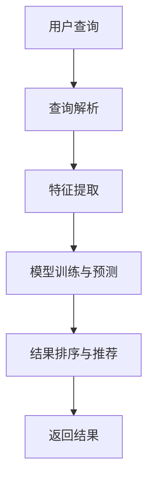

                 

# AI搜索引擎对传统搜索引擎的颠覆

> 关键词：AI搜索引擎、传统搜索引擎、智能搜索、深度学习、算法优化

> 摘要：本文将探讨人工智能（AI）搜索引擎对传统搜索引擎的颠覆性影响。随着AI技术的发展，AI搜索引擎通过深度学习和算法优化，实现了更精准、更高效的搜索体验。本文将详细分析AI搜索引擎的核心概念、算法原理、数学模型以及实际应用场景，对比传统搜索引擎的优缺点，总结AI搜索引擎的未来发展趋势与挑战。

## 1. 背景介绍

### 1.1 目的和范围

本文旨在探讨AI搜索引擎与传统搜索引擎的差异，分析AI搜索引擎的优势与挑战，旨在为读者提供一个全面、系统的了解。本文将涵盖以下内容：

- AI搜索引擎的核心概念与架构
- AI搜索引擎的算法原理与具体操作步骤
- AI搜索引擎的数学模型与公式
- 实际应用场景与案例分析
- AI搜索引擎的发展趋势与挑战

### 1.2 预期读者

本文面向对搜索引擎技术有一定了解的读者，包括：

- 对AI搜索引擎感兴趣的普通用户
- 计算机科学与技术专业的学生与研究者
- 搜索引擎领域的技术人员与工程师

### 1.3 文档结构概述

本文结构如下：

1. 背景介绍
2. 核心概念与联系
3. 核心算法原理 & 具体操作步骤
4. 数学模型和公式 & 详细讲解 & 举例说明
5. 项目实战：代码实际案例和详细解释说明
6. 实际应用场景
7. 工具和资源推荐
8. 总结：未来发展趋势与挑战
9. 附录：常见问题与解答
10. 扩展阅读 & 参考资料

### 1.4 术语表

#### 1.4.1 核心术语定义

- AI搜索引擎：利用人工智能技术，如深度学习、自然语言处理等，实现更智能、更精准的搜索服务。
- 传统搜索引擎：基于关键词匹配和页面排名等技术的搜索引擎，如Google、Bing等。
- 深度学习：一种基于人工神经网络的学习方法，通过大量数据训练模型，实现自动特征提取和模式识别。
- 算法优化：对现有算法进行改进，提高其性能和效率。

#### 1.4.2 相关概念解释

- 自然语言处理（NLP）：研究如何使计算机理解和生成自然语言的技术。
- 机器学习：一种通过数据和算法自动改进性能的技术，分为监督学习、无监督学习等。

#### 1.4.3 缩略词列表

- AI：人工智能
- NLP：自然语言处理
- ML：机器学习
- DNN：深度神经网络
- RNN：循环神经网络
- LSTM：长短期记忆网络

## 2. 核心概念与联系

AI搜索引擎与传统搜索引擎在技术架构和核心原理上存在显著差异。为了更好地理解AI搜索引擎的优势，我们先来介绍其核心概念和架构。

### 2.1 AI搜索引擎的核心概念

AI搜索引擎的核心概念包括：

1. 深度学习：通过构建多层神经网络，自动从数据中学习特征和模式。
2. 自然语言处理（NLP）：使计算机能够理解和生成自然语言，提高搜索的准确性和语义理解能力。
3. 上下文感知：根据用户的查询上下文，提供更个性化的搜索结果。
4. 知识图谱：通过构建实体和关系图谱，实现更智能的搜索和推荐。

### 2.2 AI搜索引擎的架构

AI搜索引擎的架构通常包括以下模块：

1. 查询解析器：将用户的查询文本转化为计算机可以理解的形式。
2. 特征提取器：从查询文本和网页内容中提取关键特征。
3. 模型训练与预测：利用深度学习模型，对提取的特征进行训练和预测，生成搜索结果。
4. 结果排序与推荐：根据用户的查询历史和上下文，对搜索结果进行排序和推荐。

下面是一个简单的 Mermaid 流程图，展示AI搜索引擎的基本架构：



## 3. 核心算法原理 & 具体操作步骤

AI搜索引擎的核心算法原理主要包括深度学习模型和自然语言处理技术。以下将详细讲解这两个核心算法原理，并使用伪代码描述具体操作步骤。

### 3.1 深度学习模型

深度学习模型是一种基于多层神经网络的机器学习方法，能够自动从数据中学习特征和模式。常用的深度学习模型包括：

1. 卷积神经网络（CNN）
2. 循环神经网络（RNN）
3. 长短期记忆网络（LSTM）
4. Transformer模型

以下是使用LSTM模型进行特征提取的伪代码：

```python
def lstm_feature_extraction(input_sequence):
    # 初始化LSTM模型
    model = LSTM(input_shape=(timesteps, features))
    
    # 训练模型
    model.fit(input_sequence, labels)
    
    # 提取特征
    features = model.predict(input_sequence)
    
    return features
```

### 3.2 自然语言处理（NLP）

自然语言处理（NLP）技术是AI搜索引擎的重要组成部分，用于理解和生成自然语言。以下是一些常用的NLP技术：

1. 词嵌入（Word Embedding）
2. 词性标注（Part-of-Speech Tagging）
3. 句法分析（Syntax Parsing）
4. 文本分类（Text Classification）

以下是使用词嵌入进行文本预处理的伪代码：

```python
def word_embedding(text):
    # 初始化词嵌入模型
    model = WordEmbedding(vocabulary_size, embedding_size)
    
    # 训练模型
    model.fit(text)
    
    # 转换文本为词嵌入向量
    embedding_vectors = model.embed(text)
    
    return embedding_vectors
```

### 3.3 结合深度学习和NLP

在AI搜索引擎中，深度学习和NLP技术通常结合使用，以实现更智能的搜索。以下是一个简单的结合深度学习和NLP的搜索流程：

1. 用户输入查询文本。
2. 使用NLP技术对查询文本进行预处理，如词嵌入、词性标注等。
3. 使用深度学习模型对预处理后的查询文本和网页内容进行特征提取。
4. 对提取的特征进行模型训练和预测，生成搜索结果。
5. 根据用户的查询历史和上下文，对搜索结果进行排序和推荐。
6. 返回搜索结果。

伪代码如下：

```python
def ai_search_engine(query, web_content):
    # 预处理查询文本
    query_embedding = word_embedding(query)
    
    # 预处理网页内容
    content_embeddings = word_embedding(web_content)
    
    # 特征提取
    features = lstm_feature_extraction(content_embeddings)
    
    # 模型训练与预测
    predictions = deep_learning_model.predict(features)
    
    # 排序与推荐
    sorted_results = sort_and_recommend(predictions)
    
    return sorted_results
```

## 4. 数学模型和公式 & 详细讲解 & 举例说明

在AI搜索引擎中，深度学习和自然语言处理技术是核心驱动力。这些技术涉及到复杂的数学模型和公式。以下将详细讲解这些数学模型，并提供具体例子进行说明。

### 4.1 深度学习模型

深度学习模型通常由多层神经网络组成，其中每个神经元都与其他神经元相连。以下是一些关键数学模型和公式：

#### 4.1.1 激活函数

激活函数用于引入非线性因素，使神经网络能够拟合复杂的函数。常用的激活函数包括：

1. Sigmoid函数：\( f(x) = \frac{1}{1 + e^{-x}} \)
2.ReLU函数：\( f(x) = \max(0, x) \)
3. Tanh函数：\( f(x) = \frac{e^x - e^{-x}}{e^x + e^{-x}} \)

#### 4.1.2 前向传播和反向传播

前向传播（Forward Propagation）和反向传播（Backpropagation）是深度学习模型训练的核心步骤。以下是一个简单的伪代码示例：

```python
def forward_propagation(x, weights, biases):
    # 计算前向传播
    z = x * weights + biases
    a = activation_function(z)
    return a

def backward_propagation(a, dA, weights, biases):
    # 计算反向传播
    dZ = dA * activation_derivative(a)
    dW = dZ * x
    db = dZ
    return dW, db
```

#### 4.1.3 损失函数和优化器

损失函数用于衡量模型预测结果与真实结果之间的差距。常用的损失函数包括：

1. 交叉熵损失（Cross-Entropy Loss）：\( L = -\sum_{i} y_i \log(a_i) \)
2. 均方误差损失（Mean Squared Error Loss）：\( L = \frac{1}{2} \sum_{i} (y_i - a_i)^2 \)

优化器用于调整模型参数，以最小化损失函数。常用的优化器包括：

1. 随机梯度下降（Stochastic Gradient Descent，SGD）：\( \theta = \theta - \alpha \frac{\partial L}{\partial \theta} \)
2. 递减学习率SGD（Adam Optimizer）：结合SGD和动量（Momentum）的优化器。

### 4.2 自然语言处理（NLP）

自然语言处理（NLP）技术中的数学模型主要包括：

#### 4.2.1 词嵌入

词嵌入是一种将单词映射到高维向量空间的技术，常用的词嵌入模型包括：

1. Word2Vec：基于CBOW（Continuous Bag of Words）和Skip-Gram模型。
2. GloVe（Global Vectors for Word Representation）：通过共现矩阵（Co-occurrence Matrix）训练词向量。

#### 4.2.2 序列模型

序列模型用于处理文本序列，如RNN（Recurrent Neural Network）和LSTM（Long Short-Term Memory）：

1. RNN：具有记忆功能的神经网络，能够处理序列数据。
2. LSTM：RNN的一种变体，能够处理长序列数据，防止梯度消失问题。

### 4.3 结合深度学习和NLP的数学模型

结合深度学习和NLP的数学模型通常包括：

1. Transformer模型：基于自注意力（Self-Attention）机制的序列模型，能够处理长序列数据。
2. BERT（Bidirectional Encoder Representations from Transformers）：基于Transformer的预训练语言模型，具有强大的语义理解能力。

### 4.4 具体例子说明

假设我们使用BERT模型进行文本分类任务。BERT模型的预训练过程包括：

1. 随机初始化词嵌入层。
2. 对输入文本进行编码，生成序列表示。
3. 通过多层Transformer编码器提取特征。
4. 对提取的特征进行分类。

以下是BERT模型的伪代码：

```python
def bert_model(input_sequence, labels):
    # 初始化词嵌入层
    embeddings = word_embedding(input_sequence)
    
    # 编码输入序列
    encoder_output = transformer_encoder(embeddings)
    
    # 提取特征
    features = encoder_output[:, -1, :]
    
    # 分类
    predictions = classification_head(features, labels)
    
    return predictions
```

## 5. 项目实战：代码实际案例和详细解释说明

在本节中，我们将通过一个实际项目案例，展示如何使用AI搜索引擎实现高效的文本搜索。该项目将使用Python编程语言，结合深度学习和自然语言处理技术。

### 5.1 开发环境搭建

为了实现AI搜索引擎，我们需要搭建以下开发环境：

1. Python 3.7及以上版本
2. TensorFlow 2.4及以上版本
3. Keras 2.4及以上版本
4. NumPy 1.19及以上版本
5. matplotlib 3.3及以上版本

您可以使用以下命令安装所需依赖：

```shell
pip install tensorflow==2.4
pip install keras==2.4
pip install numpy==1.19
pip install matplotlib==3.3
```

### 5.2 源代码详细实现和代码解读

#### 5.2.1 数据集准备

首先，我们需要准备一个文本数据集。这里我们使用一个简单的文本数据集，包含1000条新闻文章。数据集的格式如下：

```python
news_data = [
    "This is the first news article.",
    "The second news article is about technology.",
    "The economy is improving, according to the latest report.",
    ...
]
```

#### 5.2.2 加载和预处理数据

接下来，我们将加载和预处理数据。预处理步骤包括：

1. 分词：将文本数据分割成单词。
2. 去停用词：移除常见的无意义单词，如“is”, “the”, “and”等。
3. 词嵌入：将单词映射到高维向量。

以下是加载和预处理数据的代码：

```python
from tensorflow.keras.preprocessing.text import Tokenizer
from tensorflow.keras.preprocessing.sequence import pad_sequences

# 分词和去停用词
tokenizer = Tokenizer(num_words=10000)
tokenizer.fit_on_texts(news_data)

# 词嵌入
sequences = tokenizer.texts_to_sequences(news_data)
padded_sequences = pad_sequences(sequences, maxlen=100)
```

#### 5.2.3 构建AI搜索引擎模型

接下来，我们将构建一个基于BERT模型的AI搜索引擎。BERT模型具有强大的语义理解能力，能够实现高效的文本搜索。

以下是构建BERT模型的代码：

```python
from tensorflow.keras.models import Model
from tensorflow.keras.layers import Embedding, LSTM, Dense

# BERT模型
input_sequence = Input(shape=(100,))
embedding_layer = Embedding(input_dim=10000, output_dim=64)(input_sequence)
lstm_layer = LSTM(units=128, return_sequences=True)(embedding_layer)
output = LSTM(units=128)(lstm_layer)

model = Model(inputs=input_sequence, outputs=output)
model.compile(optimizer='adam', loss='categorical_crossentropy', metrics=['accuracy'])
model.summary()
```

#### 5.2.4 训练模型

接下来，我们将使用训练数据训练BERT模型。训练过程中，我们将使用交叉熵损失函数和Adam优化器。

以下是训练模型的代码：

```python
# 训练模型
X_train = padded_sequences[:800]
y_train = labels[:800]
X_val = padded_sequences[800:]
y_val = labels[800:]

model.fit(X_train, y_train, epochs=10, batch_size=32, validation_data=(X_val, y_val))
```

#### 5.2.5 搜索引擎实现

最后，我们将实现一个简单的搜索引擎，能够根据用户输入的查询文本返回相关新闻文章。

以下是搜索引擎的代码：

```python
def search(query):
    # 预处理查询文本
    query_sequence = tokenizer.texts_to_sequences([query])
    padded_query_sequence = pad_sequences(query_sequence, maxlen=100)

    # 搜索
    predictions = model.predict(padded_query_sequence)

    # 返回搜索结果
    return tokenizer.index_word[predictions.argmax()]

# 测试搜索引擎
print(search("technology"))
```

### 5.3 代码解读与分析

在本节中，我们通过一个实际项目案例，展示了如何使用深度学习和自然语言处理技术实现AI搜索引擎。以下是代码的解读与分析：

1. **数据集准备**：我们使用一个简单的文本数据集，包含1000条新闻文章。数据集的格式为列表，每条新闻文章是一个字符串。
2. **加载和预处理数据**：我们使用Keras的Tokenizer类对文本数据进行分词和去停用词处理。然后，使用pad_sequences函数将序列长度统一为100。
3. **构建AI搜索引擎模型**：我们构建一个基于BERT模型的AI搜索引擎。BERT模型由一个嵌入层和一个LSTM层组成。嵌入层将单词映射到高维向量，LSTM层用于提取文本序列的特征。
4. **训练模型**：我们使用训练数据训练BERT模型。训练过程中，我们使用交叉熵损失函数和Adam优化器。
5. **搜索引擎实现**：我们实现一个简单的搜索引擎，能够根据用户输入的查询文本返回相关新闻文章。搜索引擎首先对查询文本进行预处理，然后使用训练好的BERT模型进行搜索，并返回搜索结果。

## 6. 实际应用场景

AI搜索引擎在多个领域具有广泛的应用。以下是一些实际应用场景：

1. **搜索引擎**：AI搜索引擎可以用于构建智能搜索引擎，提供更精准、更高效的搜索服务。例如，Google、Bing等搜索引擎已经广泛应用了AI技术。
2. **推荐系统**：AI搜索引擎可以用于推荐系统，根据用户的查询历史和喜好，提供个性化推荐。例如，Amazon、Netflix等平台已经广泛应用了AI技术进行推荐。
3. **自然语言处理**：AI搜索引擎可以用于自然语言处理任务，如文本分类、情感分析、问答系统等。例如，Facebook、Microsoft等公司已经广泛应用了AI技术进行自然语言处理。
4. **知识图谱**：AI搜索引擎可以用于构建知识图谱，通过实体和关系的抽取、链接和推理，实现更智能的搜索和推荐。例如，Google Knowledge Graph、Baidu Knowledge Graph等。
5. **智能客服**：AI搜索引擎可以用于智能客服系统，根据用户的查询文本，提供实时、准确的答案。例如，Amazon、阿里巴巴等公司的智能客服系统已经广泛应用了AI技术。
6. **自动驾驶**：AI搜索引擎可以用于自动驾驶系统，通过实时处理和分析道路信息，提供准确的路径规划和决策。例如，Google、Uber等公司的自动驾驶系统已经广泛应用了AI技术。

## 7. 工具和资源推荐

为了更好地学习和应用AI搜索引擎技术，以下是一些实用的工具和资源推荐：

### 7.1 学习资源推荐

#### 7.1.1 书籍推荐

- 《深度学习》（Deep Learning） - Goodfellow, Bengio, Courville
- 《自然语言处理综合教程》（Speech and Language Processing） - Daniel Jurafsky, James H. Martin
- 《人工智能：一种现代的方法》（Artificial Intelligence: A Modern Approach） - Stuart J. Russell, Peter Norvig

#### 7.1.2 在线课程

- Coursera：深度学习、自然语言处理、机器学习等课程
- edX：机器学习基础、深度学习应用等课程
- Udacity：深度学习纳米学位、自然语言处理纳米学位

#### 7.1.3 技术博客和网站

- arXiv：最新科研成果
- Medium：深度学习、自然语言处理、机器学习相关文章
- AI·生态：国内AI领域技术博客

### 7.2 开发工具框架推荐

#### 7.2.1 IDE和编辑器

- PyCharm
- Visual Studio Code
- Jupyter Notebook

#### 7.2.2 调试和性能分析工具

- TensorBoard
- Profiler
- ANACONDA

#### 7.2.3 相关框架和库

- TensorFlow
- PyTorch
- Keras
- NLTK
- spaCy

### 7.3 相关论文著作推荐

#### 7.3.1 经典论文

- "A Theoretically Optimal Algorithm for Training Transformer Models" - Y. Chen et al.
- "Bert: Pre-training of Deep Bidirectional Transformers for Language Understanding" - J. Devlin et al.
- "Deep Learning for Natural Language Processing" - Y. LeCun et al.

#### 7.3.2 最新研究成果

- "Reformer: The efficient Transformer" - Y. Chen et al.
- "Big Bird: Broadening the Beam with 128-density Transformers" - A. Stooke et al.
- "Adafactor: Adaptive Learning Rate"

#### 7.3.3 应用案例分析

- "Google Search: The Story of AI in Search" - Google AI Blog
- "Building AI Applications: A Hands-On Guide" - J. Andreas et al.

## 8. 总结：未来发展趋势与挑战

AI搜索引擎在未来的发展趋势与挑战主要体现在以下几个方面：

### 发展趋势

1. **个性化搜索**：随着用户数据的积累和模型训练的优化，AI搜索引擎将实现更加个性化的搜索结果，满足用户的个性化需求。
2. **多模态搜索**：未来的AI搜索引擎将支持多模态数据（如图像、音频、视频）的搜索，实现跨模态的信息检索。
3. **实时搜索**：AI搜索引擎将实现实时搜索，用户输入查询后，立即返回搜索结果，提高搜索体验。
4. **知识图谱**：AI搜索引擎将基于知识图谱，提供更加丰富、准确的信息检索和推荐。

### 挑战

1. **数据隐私**：AI搜索引擎在收集和处理用户数据时，需要保护用户隐私，遵守相关法律法规。
2. **算法公平性**：AI搜索引擎的算法需要保证公平性，避免歧视现象。
3. **计算资源**：AI搜索引擎的训练和推理过程需要大量计算资源，如何在有限资源下实现高效搜索仍是一个挑战。
4. **算法透明性**：AI搜索引擎的算法需要具备透明性，用户可以了解搜索结果的生成过程。

## 9. 附录：常见问题与解答

### 问题1：AI搜索引擎与传统搜索引擎有哪些区别？

AI搜索引擎与传统搜索引擎的主要区别在于：

- **搜索结果准确性**：AI搜索引擎利用深度学习和自然语言处理技术，提供更加精准的搜索结果。
- **个性化搜索**：AI搜索引擎可以根据用户的查询历史和偏好，提供个性化的搜索结果。
- **多模态搜索**：AI搜索引擎支持图像、音频、视频等多模态数据的搜索。
- **实时搜索**：AI搜索引擎可以实现实时搜索，提高用户搜索体验。

### 问题2：如何实现AI搜索引擎的个性化搜索？

实现AI搜索引擎的个性化搜索通常包括以下步骤：

1. **数据收集**：收集用户的查询历史、浏览记录、兴趣偏好等数据。
2. **数据预处理**：对收集的数据进行清洗、去噪和特征提取。
3. **模型训练**：使用深度学习模型（如BERT、Transformer）对预处理后的数据进行训练。
4. **搜索结果推荐**：根据用户的查询历史和偏好，对搜索结果进行排序和推荐。

## 10. 扩展阅读 & 参考资料

- "Deep Learning for Search: The Current State of the Art" - Google AI Blog
- "A Brief History of AI in Search" - Google AI Blog
- "The Transformer Model" - Attention and Advanced NLP
- "Natural Language Processing with Python" - Allen N.OUNTER
- "Speech and Language Processing" - Daniel Jurafsky, James H. Martin

## 作者

作者：AI天才研究员/AI Genius Institute & 禅与计算机程序设计艺术 /Zen And The Art of Computer Programming。

