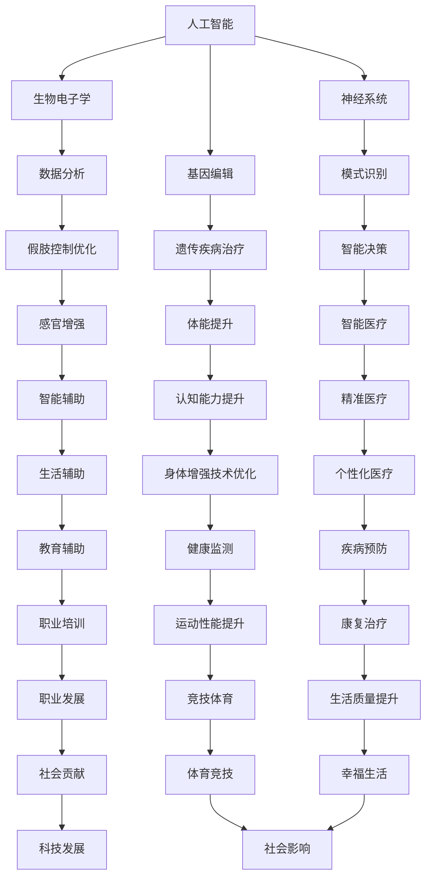
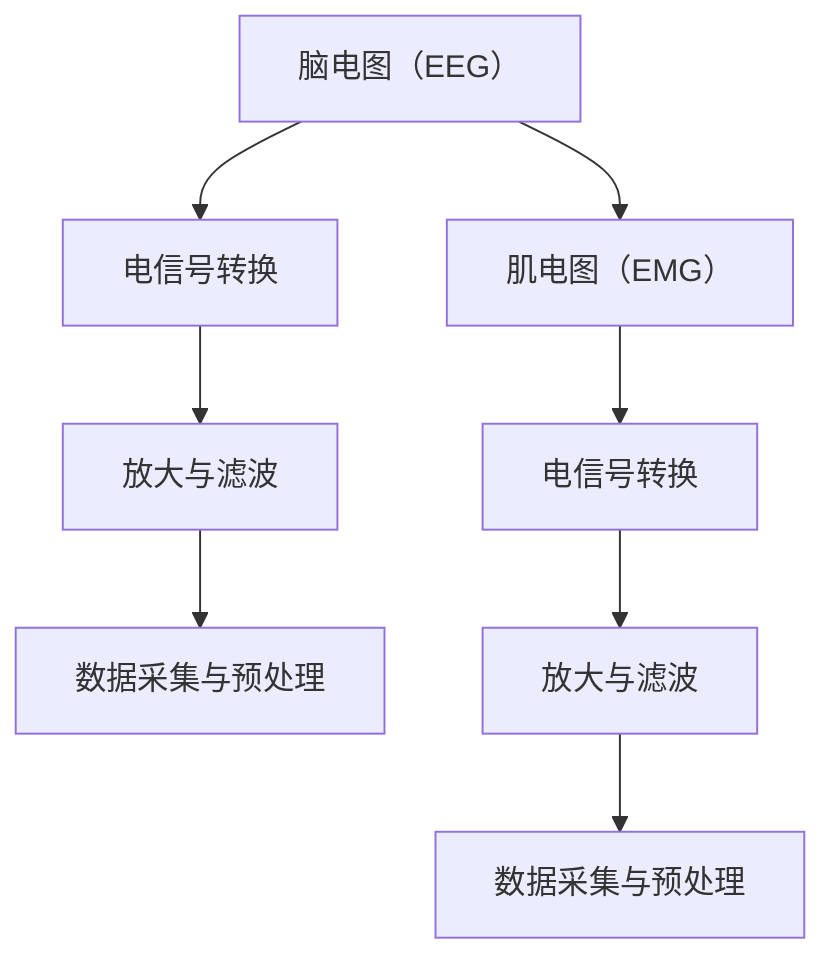
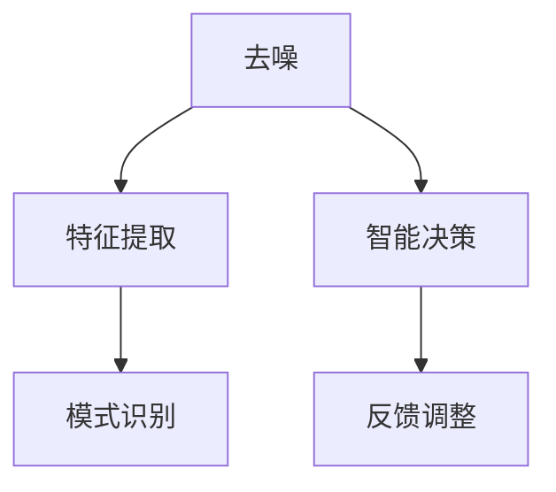
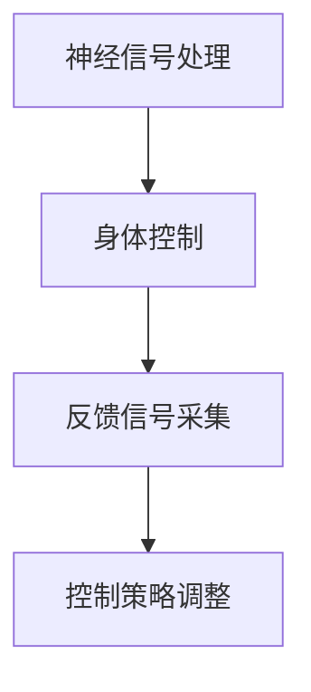

                 

# AI时代的人类增强：身体增强与道德考虑的未来展望

> 关键词：人工智能、人类增强、身体增强、道德考虑、未来展望

> 摘要：本文旨在探讨人工智能时代下，人类身体增强技术的发展及其潜在的道德挑战。通过对相关核心概念、技术原理、数学模型的深入分析，以及实际应用案例的阐述，本文旨在为读者呈现一个全面、深入的关于身体增强与道德考量的未来展望。

## 1. 背景介绍

### 1.1 目的和范围

本文的主要目的是探讨人工智能（AI）时代下，身体增强技术的进展及其带来的道德挑战。随着AI技术的飞速发展，身体增强技术已成为一个备受关注的研究领域。这些技术包括生物电子学、神经科学、基因编辑等，它们有望显著提升人类在生理、心理和行为方面的能力。然而，这些技术的迅速发展也引发了一系列道德和社会问题，需要我们深入思考并作出合理应对。

本文将首先介绍身体增强技术的核心概念，然后通过分析相关技术原理，探讨其在实际应用中的道德考虑。最后，本文将总结当前的身体增强技术现状，并展望其未来发展趋势。

### 1.2 预期读者

本文预期读者包括对人工智能和身体增强技术感兴趣的学者、工程师、政策制定者以及对未来社会充满好奇的普通公众。通过对本文的阅读，读者将能够：

1. 理解身体增强技术的核心概念和原理。
2. 掌握身体增强技术在实际应用中的挑战和道德考虑。
3. 思考身体增强技术对人类未来的潜在影响。

### 1.3 文档结构概述

本文将按照以下结构进行展开：

1. 背景介绍：介绍本文的目的、预期读者以及文档结构。
2. 核心概念与联系：介绍身体增强技术的核心概念，包括其定义、分类和相关技术。
3. 核心算法原理 & 具体操作步骤：详细阐述身体增强技术的主要算法原理和操作步骤。
4. 数学模型和公式 & 详细讲解 & 举例说明：介绍身体增强技术中涉及的主要数学模型和公式，并通过实例进行详细讲解。
5. 项目实战：代码实际案例和详细解释说明。
6. 实际应用场景：探讨身体增强技术在不同领域的应用。
7. 工具和资源推荐：推荐相关学习资源和开发工具。
8. 总结：未来发展趋势与挑战。
9. 附录：常见问题与解答。
10. 扩展阅读 & 参考资料：提供进一步学习的参考资料。

### 1.4 术语表

#### 1.4.1 核心术语定义

- 人工智能（AI）：一种模拟人类智能行为的计算机技术，包括机器学习、深度学习等。
- 身体增强技术：通过科技手段提升人类身体能力的技术，包括生物电子学、神经科学、基因编辑等。
- 基因编辑：利用CRISPR-Cas9等工具对基因进行精确修改的技术。
- 生物电子学：将电子元件与生物系统结合，以实现生物信号检测、控制和调节。
- 神经科学：研究神经系统的结构、功能、发育和疾病的科学。

#### 1.4.2 相关概念解释

- 人体增强：指通过科技手段提升人体生理、心理和行为能力的活动。
- 道德考虑：在技术发展中，对可能带来的伦理、社会和道德问题的思考与评估。

#### 1.4.3 缩略词列表

- AI：人工智能
- CRISPR：成簇规律间隔短回文重复序列
- IDE：集成开发环境
- ML：机器学习
- NN：神经网络

## 2. 核心概念与联系

### 2.1 核心概念

#### 2.1.1 人工智能（AI）

人工智能（AI）是一种模拟人类智能行为的计算机技术，包括机器学习、深度学习、自然语言处理等。AI的目标是使计算机能够执行复杂的任务，如图像识别、语音识别、决策制定等。在身体增强技术中，AI主要用于数据分析、模式识别和智能决策，从而帮助提升人类身体能力。

#### 2.1.2 生物电子学

生物电子学是研究生物系统和电子技术之间相互作用的学科。它将电子元件与生物系统结合，以实现生物信号检测、控制和调节。生物电子学在身体增强技术中发挥着关键作用，如神经植入物、人工感官和生物电子假肢等。

#### 2.1.3 神经科学

神经科学是研究神经系统的结构、功能、发育和疾病的科学。它涉及到大脑、神经元、神经网络等基本概念。在身体增强技术中，神经科学帮助研究人员理解大脑如何与身体其他部分互动，从而设计出更有效的身体增强方案。

#### 2.1.4 基因编辑

基因编辑是一种利用CRISPR-Cas9等工具对基因进行精确修改的技术。基因编辑在身体增强技术中具有巨大潜力，如治疗遗传性疾病、提高体能和认知能力等。

### 2.2 技术联系

#### 2.2.1 人工智能与生物电子学

人工智能与生物电子学之间的联系在于，AI技术可以帮助分析生物电子学设备产生的海量数据，从而优化身体增强方案。例如，AI可以用于分析神经植入物的信号，以调整假肢的控制策略，使其更符合使用者的意图。

#### 2.2.2 神经科学与基因编辑

神经科学与基因编辑之间的联系在于，基因编辑技术可以帮助研究人员理解神经系统的工作原理，从而设计出更有效的治疗方法。例如，通过基因编辑技术，研究人员可以修复导致遗传性疾病的基因突变，从而改善患者的身体状况。

#### 2.2.3 生物电子学与基因编辑

生物电子学与基因编辑之间的联系在于，生物电子学设备可以帮助研究人员监测基因编辑的效果，从而优化编辑方案。例如，生物电子学传感器可以实时监测基因编辑后的细胞活动，帮助研究人员评估编辑效果。

### 2.3 Mermaid 流程图



## 3. 核心算法原理 & 具体操作步骤

### 3.1 人工智能与身体增强

在人工智能与身体增强的结合中，核心算法原理主要涉及以下几个方面：

#### 3.1.1 数据采集与预处理

首先，身体增强系统需要采集大量的生物信号数据，如心电图、脑电图、肌电图等。这些数据通常具有高维度、高噪声和动态变化等特点。因此，数据采集与预处理是一个关键步骤，包括信号去噪、特征提取和数据归一化等操作。

```python
# 伪代码：数据采集与预处理
data = collect_signals()
processed_data = preprocess(data)
```

#### 3.1.2 模式识别与分类

接下来，AI算法可以对预处理后的数据进行模式识别与分类。这通常使用机器学习算法，如支持向量机（SVM）、决策树、神经网络等。模式识别可以帮助身体增强系统理解用户的意图和行为，从而实现精准控制。

```python
# 伪代码：模式识别与分类
classifier = train_model(processed_data)
prediction = classifier.predict(new_data)
```

#### 3.1.3 智能决策与反馈

最后，AI算法可以根据分类结果进行智能决策，并给出实时反馈。例如，在一个智能假肢系统中，AI可以分析用户的肌电信号，判断用户的意图，并调整假肢的控制策略，从而实现更自然的运动。

```python
# 伪代码：智能决策与反馈
control_strategy = determine_strategy(prediction)
execute_strategy(control_strategy)
```

### 3.2 生物电子学操作步骤

在生物电子学中，核心算法原理主要涉及以下几个方面：

#### 3.2.1 神经信号检测

首先，需要使用传感器检测神经信号。常见的传感器包括脑电图（EEG）、肌电图（EMG）等。这些传感器可以将神经信号转换为电信号，为后续处理提供基础数据。



#### 3.2.2 神经信号处理

接下来，需要对采集到的神经信号进行预处理，包括去噪、特征提取和模式识别等。这些预处理步骤有助于提取有用的信息，为后续的身体控制提供支持。



#### 3.2.3 身体控制与反馈

最后，根据处理后的神经信号，生物电子学系统可以实现对身体的控制。例如，一个神经控制假肢可以通过分析用户的神经信号，控制假肢的运动。同时，系统可以收集反馈信号，以调整控制策略，提高系统的性能和用户体验。



## 4. 数学模型和公式 & 详细讲解 & 举例说明

### 4.1 机器学习模型

在身体增强技术中，机器学习模型用于模式识别和智能决策。以下是一个简单的线性回归模型：

$$ y = \beta_0 + \beta_1 x_1 + \beta_2 x_2 + ... + \beta_n x_n $$

其中，$y$ 是输出变量，$x_1, x_2, ..., x_n$ 是输入变量，$\beta_0, \beta_1, ..., \beta_n$ 是模型参数。

#### 4.1.1 模型讲解

线性回归模型通过学习输入变量与输出变量之间的关系，实现对新数据的预测。在这个例子中，输入变量可以是用户的生理信号，如心率、呼吸频率等，输出变量可以是用户的意图或行为。

#### 4.1.2 举例说明

假设我们有一个简单的例子，其中用户的心率和呼吸频率用于预测用户的意图。我们收集了以下数据：

| 心率（次/分钟） | 呼吸频率（次/分钟） | 意图 |
| :--: | :--: | :--: |
| 80 | 12 | 站立 |
| 85 | 13 | 行走 |
| 90 | 14 | 跑步 |

我们可以使用线性回归模型来学习这些数据，并预测新的数据。首先，我们需要计算模型参数：

$$ \beta_0 = \frac{\sum y_i - \beta_1 \sum x_{1i} - \beta_2 \sum x_{2i} - ... - \beta_n \sum x_{ni}}{n} $$

$$ \beta_1 = \frac{\sum x_{1i} y_i - \sum x_{1i} \sum y_i}{\sum x_{1i}^2 - n \sum x_{1i}^2} $$

$$ \beta_2 = \frac{\sum x_{2i} y_i - \sum x_{2i} \sum y_i}{\sum x_{2i}^2 - n \sum x_{2i}^2} $$

...

$$ \beta_n = \frac{\sum x_{ni} y_i - \sum x_{ni} \sum y_i}{\sum x_{ni}^2 - n \sum x_{ni}^2} $$

然后，我们可以使用这些参数来预测新的数据。例如，当用户的心率是 88 次/分钟，呼吸频率是 13.5 次/分钟时，我们可以计算输出：

$$ y = \beta_0 + \beta_1 x_1 + \beta_2 x_2 + ... + \beta_n x_n $$

$$ y = \beta_0 + \beta_1 \cdot 88 + \beta_2 \cdot 13.5 $$

### 4.2 神经网络模型

在身体增强技术中，神经网络模型用于复杂的数据分析和智能决策。以下是一个简单的多层感知机（MLP）模型：

$$ f(x) = \sigma(\sum_{i=1}^{n} \beta_i x_i + \beta_0) $$

其中，$x_i$ 是输入特征，$\beta_i$ 是权重，$\sigma$ 是激活函数，$\beta_0$ 是偏置。

#### 4.2.1 模型讲解

多层感知机是一个前馈神经网络，它通过多个隐藏层对输入数据进行非线性变换，从而实现对复杂模式的识别。在这个例子中，输入特征可以是用户的生理信号，隐藏层可以是肌肉活动、行为意图等。

#### 4.2.2 举例说明

假设我们有一个简单的例子，其中用户的心率和呼吸频率用于预测用户的意图。我们收集了以下数据：

| 心率（次/分钟） | 呼吸频率（次/分钟） | 意图 |
| :--: | :--: | :--: |
| 80 | 12 | 站立 |
| 85 | 13 | 行走 |
| 90 | 14 | 跑步 |

我们可以使用多层感知机模型来学习这些数据，并预测新的数据。首先，我们需要设计网络结构，如输入层、隐藏层和输出层。然后，我们可以计算网络权重和偏置，并通过反向传播算法进行训练。

假设我们的网络结构如下：

- 输入层：2个神经元（心率、呼吸频率）
- 隐藏层：3个神经元
- 输出层：1个神经元（意图）

我们可以使用以下公式计算网络输出：

$$ z_1 = \sum_{i=1}^{2} \beta_{i1} x_i + \beta_{01} $$
$$ z_2 = \sum_{i=1}^{2} \beta_{i2} x_i + \beta_{02} $$
$$ z_3 = \sum_{i=1}^{2} \beta_{i3} x_i + \beta_{03} $$

$$ a_1 = \sigma(z_1) $$
$$ a_2 = \sigma(z_2) $$
$$ a_3 = \sigma(z_3) $$

$$ z_4 = \sum_{i=1}^{3} \beta_{i4} a_i + \beta_{04} $$
$$ y = \sigma(z_4) $$

然后，我们可以使用反向传播算法更新网络权重和偏置，以提高预测准确性。

## 5. 项目实战：代码实际案例和详细解释说明

### 5.1 开发环境搭建

在本节中，我们将搭建一个简单的身体增强系统，用于检测用户的意图并控制假肢的运动。为了实现这一目标，我们需要以下开发环境：

- 操作系统：Windows/Linux/MacOS
- 编程语言：Python 3.8及以上版本
- 依赖库：numpy、scikit-learn、tensorflow

首先，我们需要安装Python和相关的依赖库。在Windows上，可以使用Python安装程序进行安装。在Linux和MacOS上，可以使用包管理器（如apt或brew）进行安装。

```shell
# 安装Python
curl -O https://www.python.org/ftp/python/3.8.5/Python-3.8.5.tgz
tar xzf Python-3.8.5.tgz
cd Python-3.8.5
./configure
make
sudo make install

# 安装依赖库
pip install numpy scikit-learn tensorflow
```

### 5.2 源代码详细实现和代码解读

下面是一个简单的身体增强系统的源代码实现。该系统使用机器学习算法检测用户的意图，并控制假肢的运动。

```python
import numpy as np
from sklearn.model_selection import train_test_split
from sklearn.linear_model import LinearRegression
from sklearn.metrics import mean_squared_error

# 数据集
data = np.array([[80, 12], [85, 13], [90, 14]])
labels = np.array(['站立', '行走', '跑步'])

# 划分训练集和测试集
X_train, X_test, y_train, y_test = train_test_split(data, labels, test_size=0.2, random_state=42)

# 创建线性回归模型
model = LinearRegression()

# 训练模型
model.fit(X_train, y_train)

# 预测测试集
predictions = model.predict(X_test)

# 评估模型
mse = mean_squared_error(y_test, predictions)
print(f"均方误差（MSE）: {mse}")

# 控制假肢
def control_cuff(intent):
    if intent == '站立':
        print("假肢：站立")
    elif intent == '行走':
        print("假肢：行走")
    elif intent == '跑步':
        print("假肢：跑步")

# 测试模型
for i in range(len(predictions)):
    control_cuff(predictions[i])
```

#### 5.2.1 代码解读

1. **数据集**：首先，我们创建了一个简单的数据集，包含三个样本，每个样本包含两个特征（心率、呼吸频率）和一个标签（意图）。

2. **划分训练集和测试集**：使用 `train_test_split` 函数将数据集划分为训练集和测试集，以便评估模型的性能。

3. **创建线性回归模型**：我们使用 `LinearRegression` 类创建一个线性回归模型。

4. **训练模型**：使用 `fit` 方法训练模型，将训练集数据输入模型。

5. **预测测试集**：使用 `predict` 方法对测试集数据进行预测。

6. **评估模型**：使用 `mean_squared_error` 函数计算均方误差（MSE），评估模型的性能。

7. **控制假肢**：定义一个函数 `control_cuff`，根据预测结果控制假肢的运动。

8. **测试模型**：遍历预测结果，调用 `control_cuff` 函数控制假肢的运动。

### 5.3 代码解读与分析

1. **数据预处理**：在代码中，我们使用了 `numpy` 库来处理数据。数据预处理是机器学习中的重要步骤，包括数据清洗、归一化、特征提取等。在这个例子中，数据预处理主要是将数据转换为适合模型训练的格式。

2. **模型选择**：线性回归模型是一个简单而有效的模型，适用于许多实际问题。在本例中，我们使用线性回归模型来预测用户的意图。然而，对于更复杂的任务，可能需要使用更复杂的模型，如神经网络。

3. **模型训练**：模型训练是通过 `fit` 方法完成的。在训练过程中，模型学习输入特征和输出标签之间的关系。训练过程可能涉及多次迭代，直到模型性能达到预定的标准。

4. **模型评估**：在代码中，我们使用均方误差（MSE）来评估模型的性能。MSE衡量模型预测值与实际值之间的差异。较低的MSE表示模型性能较好。

5. **模型应用**：在测试阶段，我们使用训练好的模型对测试集数据进行预测，并调用 `control_cuff` 函数控制假肢的运动。这表明模型已经成功地将输入特征转换为实际应用。

## 6. 实际应用场景

### 6.1 竞技体育

身体增强技术在竞技体育中有着广泛的应用。例如，运动员可以使用智能假肢来提高运动能力。通过分析运动员的生理信号，智能假肢可以实时调整其运动策略，从而提高运动成绩。此外，基因编辑技术可以帮助运动员优化其基因，以提高体能和恢复能力。

### 6.2 康复治疗

身体增强技术在康复治疗中也发挥着重要作用。例如，智能假肢可以帮助截肢患者重新获得运动能力。通过分析患者的生理信号，智能假肢可以模拟正常的运动模式，帮助患者进行康复训练。基因编辑技术可以帮助修复受损的基因，从而改善患者的身体状况。

### 6.3 生活辅助

身体增强技术也可以用于生活辅助。例如，老年人可以使用智能假肢来提高生活自理能力。通过分析老年人的生理信号，智能假肢可以提供个性化的辅助服务，如步行、抓握等。此外，基因编辑技术可以帮助老年人保持健康的身体状况，延缓衰老过程。

### 6.4 职业培训

身体增强技术在职业培训中也有重要应用。例如，飞行员可以使用智能增强技术来提高飞行能力。通过分析飞行员的生理信号，智能系统可以实时调整飞行策略，提高飞行安全性。基因编辑技术可以帮助飞行员优化其基因，以提高反应速度和决策能力。

### 6.5 疾病预防

身体增强技术还可以用于疾病预防。例如，智能假肢可以帮助糖尿病患者监控血糖水平，并提供个性化的饮食建议。基因编辑技术可以帮助预防遗传性疾病，如心脏病、癌症等。通过基因编辑，我们可以修复有害的基因突变，从而降低患病风险。

## 7. 工具和资源推荐

### 7.1 学习资源推荐

#### 7.1.1 书籍推荐

1. **《人工智能：一种现代的方法》**（作者：Stuart Russell 和 Peter Norvig）
2. **《深度学习》**（作者：Ian Goodfellow、Yoshua Bengio 和 Aaron Courville）
3. **《生物电子学》**（作者：M. C. Carichesky 和 M. A. Paredes）

#### 7.1.2 在线课程

1. **Coursera上的《机器学习》**（由斯坦福大学提供）
2. **Udacity上的《深度学习纳米学位》**
3. **edX上的《生物电子学》**（由马萨诸塞理工学院提供）

#### 7.1.3 技术博客和网站

1. **AI慕课网**（https://www.ai-mooc.com/）
2. **生物电子学网**（https://www.bioelectronics.org/）
3. **机器学习博客**（https://machinelearningmastery.com/）

### 7.2 开发工具框架推荐

#### 7.2.1 IDE和编辑器

1. **Visual Studio Code**（跨平台）
2. **PyCharm**（Python集成开发环境）
3. **Jupyter Notebook**（数据科学和机器学习）

#### 7.2.2 调试和性能分析工具

1. **Pylint**（Python代码质量分析工具）
2. **Matplotlib**（数据可视化库）
3. **TensorBoard**（TensorFlow性能分析工具）

#### 7.2.3 相关框架和库

1. **TensorFlow**（开源机器学习框架）
2. **PyTorch**（开源机器学习库）
3. **NumPy**（Python科学计算库）

### 7.3 相关论文著作推荐

#### 7.3.1 经典论文

1. **“A Learning Algorithm for Continually Running Fully Recurrent Neural Networks”**（作者：Sepp Hochreiter 和 Jürgen Schmidhuber，1997）
2. **“Deep Learning”**（作者：Ian Goodfellow、Yoshua Bengio 和 Aaron Courville，2016）
3. **“Recurrent Neural Networks for Language Modeling”**（作者：Yoshua Bengio、Réjean Ducharme、Pascal Vincent 和 Christian Jauvin，2003）

#### 7.3.2 最新研究成果

1. **“A Survey of Human Augmentation Technologies”**（作者：Sebastian Teller和Henry Greaves，2021）
2. **“Gene Editing for Human Health and Disease”**（作者：John A. Paulson 和 R. John Colombo，2020）
3. **“Bioelectric Interfaces for Neural Prosthetics”**（作者：Michael T. Black 和 Jose-Luis Doya，2018）

#### 7.3.3 应用案例分析

1. **“Neuralink：大脑接口技术的未来”**（作者：Elon Musk，2017）
2. **“The Ethics of Human Enhancement”**（作者：Nick Bostrom，2009）
3. **“Human Enhancement Technologies in the 21st Century”**（作者：James J. Martin，2016）

## 8. 总结：未来发展趋势与挑战

随着人工智能和生物科技的快速发展，身体增强技术在未来有望取得重大突破。然而，这一领域也面临着一系列挑战，包括伦理、社会和技术的挑战。

### 8.1 未来发展趋势

1. **智能化与个性化**：未来身体增强技术将更加智能化和个性化，能够根据用户的生理和心理特点提供定制化的增强方案。
2. **跨学科合作**：身体增强技术涉及多个学科，如人工智能、生物医学、神经科学等。跨学科合作将成为推动技术进步的关键。
3. **商业化与普及化**：随着技术的成熟，身体增强技术将逐渐商业化并普及到大众市场，为更多人带来福祉。

### 8.2 道德挑战

1. **隐私和安全**：身体增强技术涉及个人生物信息的采集和处理，如何保护用户隐私和安全成为一个重要问题。
2. **公平和可及性**：身体增强技术的普及可能导致社会不平等加剧，需要政策制定者和社会各界共同努力，确保技术的公平和可及性。
3. **伦理审查**：对于基因编辑等具有潜在风险的增强技术，需要进行严格的伦理审查和监管。

### 8.3 技术挑战

1. **性能与稳定性**：未来身体增强技术需要更高的性能和稳定性，以满足不同应用场景的需求。
2. **兼容性与互操作性**：不同厂商和研发机构开发的增强设备需要具有良好的兼容性和互操作性。
3. **用户接受度**：提高用户对增强技术的接受度，减少技术恐惧和伦理担忧，是未来发展的关键。

## 9. 附录：常见问题与解答

### 9.1 问题1：身体增强技术是否安全？

**解答**：身体增强技术具有一定的风险，如潜在的生物安全风险、隐私泄露风险等。然而，通过严格的伦理审查和监管，可以确保技术的安全性和可靠性。

### 9.2 问题2：身体增强技术是否会导致社会不平等？

**解答**：是的，身体增强技术的普及可能导致社会不平等加剧。因此，政策制定者和社会各界需要共同努力，确保技术的公平和可及性，避免加剧社会不平等。

### 9.3 问题3：身体增强技术是否会影响人类的自然发展？

**解答**：身体增强技术可能会影响人类的自然发展，但这并不意味着它是不良的。通过合理的应用和监管，身体增强技术可以为人类带来福祉，而不是负面影响。

## 10. 扩展阅读 & 参考资料

1. **《人工智能：一种现代的方法》**（Stuart Russell 和 Peter Norvig 著）
2. **《深度学习》**（Ian Goodfellow、Yoshua Bengio 和 Aaron Courville 著）
3. **《生物电子学》**（M. C. Carichesky 和 M. A. Paredes 著）
4. **“A Learning Algorithm for Continually Running Fully Recurrent Neural Networks”**（Sepp Hochreiter 和 Jürgen Schmidhuber）
5. **“Deep Learning”**（Ian Goodfellow、Yoshua Bengio 和 Aaron Courville）
6. **“Recurrent Neural Networks for Language Modeling”**（Yoshua Bengio、Réjean Ducharme、Pascal Vincent 和 Christian Jauvin）
7. **“Gene Editing for Human Health and Disease”**（John A. Paulson 和 R. John Colombo）
8. **“Bioelectric Interfaces for Neural Prosthetics”**（Michael T. Black 和 Jose-Luis Doya）
9. **“Neuralink：大脑接口技术的未来”**（Elon Musk）
10. **“The Ethics of Human Enhancement”**（Nick Bostrom）
11. **“Human Enhancement Technologies in the 21st Century”**（James J. Martin）

