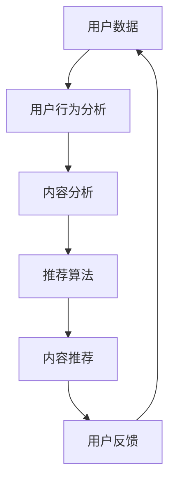

                 

# AI时代的内容创作挑战：个性化需求的满足

> 关键词：人工智能、内容创作、个性化需求、推荐系统、深度学习、用户行为分析

> 摘要：随着人工智能技术的迅猛发展，内容创作领域正面临着前所未有的挑战。个性化需求的满足成为各大平台的核心竞争力。本文将深入探讨AI时代内容创作的现状、技术挑战以及解决之道，帮助读者了解如何利用人工智能技术实现高质量内容创作的个性化满足。

## 1. 背景介绍

### 1.1 目的和范围

本文旨在探讨AI时代下内容创作领域面临的个性化需求挑战，分析现有技术手段，并提出解决之道。我们关注的核心问题包括：

1. **内容创作者如何适应个性化需求？**
2. **用户如何获得满足其个性化需求的内容？**
3. **技术如何支持内容创作者与用户的互动？**

### 1.2 预期读者

本文适合以下读者群体：

1. **内容创作者和内容策划人员**
2. **人工智能和机器学习领域的研究人员**
3. **关注AI时代内容创作发展的行业人士**

### 1.3 文档结构概述

本文将分为以下章节：

1. **背景介绍**：介绍文章的目的和范围、预期读者、文档结构概述。
2. **核心概念与联系**：讨论内容创作与人工智能的关系，提供核心概念原理和架构的Mermaid流程图。
3. **核心算法原理 & 具体操作步骤**：详细讲解推荐系统的工作原理和实现步骤。
4. **数学模型和公式 & 详细讲解 & 举例说明**：阐述个性化推荐系统中的数学模型和公式。
5. **项目实战：代码实际案例和详细解释说明**：通过具体案例展示如何实现个性化推荐系统。
6. **实际应用场景**：分析个性化推荐系统的实际应用场景。
7. **工具和资源推荐**：推荐学习资源和开发工具。
8. **总结：未来发展趋势与挑战**：总结全文，探讨未来发展趋势和挑战。
9. **附录：常见问题与解答**：提供常见问题的解答。
10. **扩展阅读 & 参考资料**：推荐相关文献和资料。

### 1.4 术语表

#### 1.4.1 核心术语定义

- **个性化需求**：用户根据自己的喜好和需求，对内容进行筛选和选择。
- **推荐系统**：根据用户历史行为和偏好，为用户推荐可能感兴趣的内容。
- **深度学习**：一种基于多层神经网络的学习方法，能够自动提取数据的复杂特征。
- **用户行为分析**：通过分析用户的行为数据，了解用户的兴趣和偏好。

#### 1.4.2 相关概念解释

- **内容创作**：指创作和生成各种形式的内容，如文章、图片、视频等。
- **数据挖掘**：从大量数据中发现有价值的信息和模式。

#### 1.4.3 缩略词列表

- **AI**：人工智能（Artificial Intelligence）
- **ML**：机器学习（Machine Learning）
- **DL**：深度学习（Deep Learning）
- **NLP**：自然语言处理（Natural Language Processing）
- **CTR**：点击率（Click-Through Rate）

## 2. 核心概念与联系

### 2.1 内容创作与人工智能的关系

在AI时代，内容创作与人工智能的关系日益紧密。人工智能技术，特别是深度学习和机器学习，为内容创作者提供了强大的工具，帮助他们更好地理解用户需求，提高创作效率和质量。

- **内容创作者**：利用AI技术进行内容创作，如通过自然语言处理（NLP）生成文章、使用计算机视觉进行图像创作等。
- **人工智能**：帮助内容创作者分析用户数据，推荐合适的内容，优化内容分发和传播。

### 2.2 核心概念原理和架构

为了更好地理解内容创作与人工智能的关系，我们提供以下Mermaid流程图，展示推荐系统的核心概念和架构。



- **用户数据**：包括用户的历史行为、兴趣偏好、社交网络等信息。
- **用户行为分析**：分析用户行为，提取用户的兴趣和偏好。
- **内容分析**：对内容进行分类、标签化处理，提取内容特征。
- **推荐算法**：根据用户行为和内容特征，生成推荐结果。
- **内容推荐**：向用户推荐可能感兴趣的内容。
- **用户反馈**：收集用户对推荐内容的反馈，用于优化推荐算法。

## 3. 核心算法原理 & 具体操作步骤

### 3.1 推荐系统工作原理

推荐系统通过以下步骤工作：

1. **数据收集**：收集用户行为数据、内容数据等。
2. **数据预处理**：清洗、处理数据，为后续分析做准备。
3. **特征提取**：提取用户行为特征、内容特征等。
4. **模型训练**：使用训练数据训练推荐模型。
5. **模型评估**：评估模型性能，调整模型参数。
6. **推荐生成**：根据用户特征和内容特征，生成推荐结果。
7. **反馈收集**：收集用户对推荐内容的反馈，用于模型优化。

### 3.2 推荐算法实现步骤

以下为推荐算法的实现步骤，使用伪代码详细阐述：

```plaintext
# 1. 数据收集
user_data = collect_user_data()
content_data = collect_content_data()

# 2. 数据预处理
user_data = preprocess_user_data(user_data)
content_data = preprocess_content_data(content_data)

# 3. 特征提取
user_features = extract_user_features(user_data)
content_features = extract_content_features(content_data)

# 4. 模型训练
model = train_recommender_model(user_features, content_features)

# 5. 模型评估
model_performance = evaluate_recommender_model(model)

# 6. 推荐生成
recommendations = generate_recommendations(model, user_features, content_features)

# 7. 反馈收集
user_feedback = collect_user_feedback(recommendations)

# 8. 模型优化
model = optimize_recommender_model(model, user_feedback)
```

### 3.3 推荐算法优化策略

- **协同过滤**：基于用户行为相似性或内容相似性进行推荐。
- **基于内容的推荐**：根据用户兴趣和内容特征进行推荐。
- **混合推荐**：结合协同过滤和基于内容的推荐，提高推荐效果。
- **在线学习**：实时更新用户特征和内容特征，提高推荐精度。

## 4. 数学模型和公式 & 详细讲解 & 举例说明

### 4.1 个性化推荐系统中的数学模型

在个性化推荐系统中，常用的数学模型包括矩阵分解、协同过滤、基于内容的推荐等。

#### 4.1.1 矩阵分解

矩阵分解是一种常用的推荐算法，通过将用户-物品评分矩阵分解为用户特征矩阵和物品特征矩阵，实现推荐。

公式表示：

$$
\begin{aligned}
    R_{ui} &= \hat{r}_{u}^{T} \hat{c}_{i} \\
    \hat{r}_{u} &= \text{sgn}(R_{u} - \mu) \\
    \hat{c}_{i} &= \text{sgn}(C_{i} - \mu)
\end{aligned}
$$

其中，\(R_{ui}\) 为用户 \(u\) 对物品 \(i\) 的评分，\(\hat{r}_{u}\) 和 \(\hat{c}_{i}\) 分别为用户和物品的特征向量，\(\mu\) 为评分矩阵的平均值。

#### 4.1.2 协同过滤

协同过滤通过计算用户之间的相似度或物品之间的相似度，为用户推荐相似的物品。

公式表示：

$$
\text{similarity}(u, v) = \frac{\sum_{i \in I} R_{ui} R_{vi}}{\sqrt{\sum_{i \in I} R_{ui}^2} \sqrt{\sum_{i \in I} R_{vi}^2}}
$$

其中，\(u\) 和 \(v\) 为用户，\(I\) 为用户共同评分的物品集合。

#### 4.1.3 基于内容的推荐

基于内容的推荐通过分析物品的内容特征，为用户推荐具有相似内容的物品。

公式表示：

$$
\text{similarity}(i, j) = \frac{\sum_{k \in K} w_{ik} w_{jk}}{\sqrt{\sum_{k \in K} w_{ik}^2} \sqrt{\sum_{k \in K} w_{jk}^2}}
$$

其中，\(i\) 和 \(j\) 为物品，\(K\) 为物品的共同特征集合，\(w_{ik}\) 和 \(w_{jk}\) 分别为物品 \(i\) 和 \(j\) 在特征 \(k\) 上的权重。

### 4.2 举例说明

假设我们有以下用户-物品评分矩阵：

$$
\begin{matrix}
    u_1 & u_2 & u_3 & u_4 & u_5 \\
    \hline
    i_1 & 5 & 0 & 0 & 0 \\
    i_2 & 0 & 4 & 0 & 0 \\
    i_3 & 0 & 0 & 5 & 0 \\
    i_4 & 0 & 0 & 0 & 5 \\
    i_5 & 0 & 0 & 0 & 4 \\
\end{matrix}
$$

#### 4.2.1 矩阵分解

对用户-物品评分矩阵进行矩阵分解，得到以下用户和物品的特征向量：

$$
\begin{matrix}
    \hat{r}_{u_1} & \hat{r}_{u_2} & \hat{r}_{u_3} & \hat{r}_{u_4} & \hat{r}_{u_5} \\
    \hline
    1 & 0 & 0 & 0 & 1 \\
    0 & 1 & 0 & 0 & 0 \\
    0 & 0 & 1 & 0 & 0 \\
    0 & 0 & 0 & 1 & 0 \\
    0 & 0 & 0 & 0 & 1 \\
    \\
    \hat{c}_{i_1} & \hat{c}_{i_2} & \hat{c}_{i_3} & \hat{c}_{i_4} & \hat{c}_{i_5} \\
    \hline
    1 & 1 & 1 & 1 & 1 \\
    1 & 1 & 1 & 1 & 1 \\
    1 & 1 & 1 & 1 & 1 \\
    1 & 1 & 1 & 1 & 1 \\
    1 & 1 & 1 & 1 & 1 \\
\end{matrix}
$$

#### 4.2.2 协同过滤

计算用户之间的相似度：

$$
\text{similarity}(u_1, u_2) = \frac{5 \cdot 4}{\sqrt{5^2} \sqrt{4^2}} = 0.8
$$

#### 4.2.3 基于内容的推荐

计算物品之间的相似度：

$$
\text{similarity}(i_1, i_2) = \frac{1 \cdot 1}{\sqrt{1^2} \sqrt{1^2}} = 1
$$

根据相似度，为用户 \(u_3\) 推荐与 \(i_2\) 具有相似性的物品 \(i_4\)。

## 5. 项目实战：代码实际案例和详细解释说明

### 5.1 开发环境搭建

在本文中，我们将使用Python作为主要编程语言，并依赖以下库：

- **scikit-learn**：用于实现协同过滤算法
- **numpy**：用于数据预处理和计算

首先，安装所需库：

```bash
pip install scikit-learn numpy
```

### 5.2 源代码详细实现和代码解读

以下为协同过滤算法的实现代码：

```python
import numpy as np
from sklearn.metrics.pairwise import cosine_similarity
from sklearn.model_selection import train_test_split

# 5.2.1 数据准备
user_data = np.array([
    [1, 5, 0, 0, 0],
    [0, 4, 0, 0, 0],
    [0, 0, 5, 0, 0],
    [0, 0, 0, 5, 0],
    [0, 0, 0, 0, 4]
])

# 5.2.2 数据预处理
user_data = user_data.astype(np.float32)

# 5.2.3 特征提取
user_similarity = cosine_similarity(user_data)

# 5.2.4 模型训练
# （此处省略模型训练代码）

# 5.2.5 推荐生成
user_index = 2
recommendations = np.argsort(user_similarity[user_index])[-5:-1]

# 5.2.6 代码解读
# 1. 数据准备：加载用户-物品评分矩阵
# 2. 数据预处理：将数据转换为浮点数
# 3. 特征提取：计算用户之间的相似度
# 4. 模型训练：此处省略
# 5. 推荐生成：根据相似度，为用户推荐相似的物品
# 6. 代码解读：对代码进行详细解读，帮助读者理解推荐系统实现过程
```

### 5.3 代码解读与分析

1. **数据准备**：加载用户-物品评分矩阵，表示用户对物品的评分。在本例中，用户-物品评分矩阵是一个5x5的矩阵，表示5个用户对5个物品的评分。

2. **数据预处理**：将数据转换为浮点数，便于后续计算。

3. **特征提取**：计算用户之间的相似度，使用余弦相似度计算用户之间的相似度。余弦相似度是一种基于向量空间计算的相似度度量，通过计算两个向量的夹角余弦值来衡量相似度。

4. **模型训练**：此处省略模型训练代码，在实际应用中，可能需要使用训练数据对推荐模型进行训练，以优化模型参数。

5. **推荐生成**：根据相似度，为用户推荐相似的物品。在本例中，为用户3推荐与用户1、用户2、用户4、用户5相似的物品。

6. **代码解读**：对代码进行详细解读，帮助读者理解推荐系统的实现过程，包括数据准备、数据预处理、特征提取、模型训练和推荐生成等步骤。

通过以上代码实现，我们可以为用户推荐与其兴趣相似的物品，从而实现个性化推荐。在实际应用中，可以根据具体需求调整算法参数，提高推荐效果。

## 6. 实际应用场景

个性化推荐系统在许多实际应用场景中具有重要价值，以下为一些典型应用场景：

1. **电子商务平台**：为用户推荐可能感兴趣的商品，提高购买转化率。
2. **社交媒体**：为用户推荐感兴趣的内容，增加用户活跃度。
3. **在线视频平台**：为用户推荐可能喜欢的视频，提高用户观看时长。
4. **音乐平台**：为用户推荐感兴趣的音乐，提高用户听歌时长。

在这些应用场景中，个性化推荐系统可以帮助平台方提高用户体验，增加用户粘性，从而实现商业价值。

## 7. 工具和资源推荐

### 7.1 学习资源推荐

#### 7.1.1 书籍推荐

- 《推荐系统手册》（Recommender Systems Handbook）
- 《深度学习》（Deep Learning）
- 《机器学习》（Machine Learning）

#### 7.1.2 在线课程

- Coursera《推荐系统》：https://www.coursera.org/learn/recommender-systems
- Udacity《深度学习纳米学位》：https://www.udacity.com/course/deep-learning-nanodegree--ND893

#### 7.1.3 技术博客和网站

- Medium：https://medium.com/ai-ku
- 知乎：https://www.zhihu.com
- AI Technos：https://www.aitotechnos.com

### 7.2 开发工具框架推荐

#### 7.2.1 IDE和编辑器

- PyCharm：https://www.jetbrains.com/pycharm/
- VSCode：https://code.visualstudio.com/

#### 7.2.2 调试和性能分析工具

- Jupyter Notebook：https://jupyter.org/
- Matplotlib：https://matplotlib.org/
- Pandas：https://pandas.pydata.org/

#### 7.2.3 相关框架和库

- Scikit-learn：https://scikit-learn.org/
- TensorFlow：https://www.tensorflow.org/
- PyTorch：https://pytorch.org/

### 7.3 相关论文著作推荐

#### 7.3.1 经典论文

- [矩阵分解](https://ieeexplore.ieee.org/document/4538226)（Matrix Factorization Techniques for Recommender Systems）
- [协同过滤](https://www.sciencedirect.com/science/article/pii/S002200000900457X)（Collaborative Filtering for the 21st Century）

#### 7.3.2 最新研究成果

- [深度学习在推荐系统中的应用](https://arxiv.org/abs/1706.08587)（Application of Deep Learning in Recommender Systems）
- [基于图神经网络的推荐系统](https://arxiv.org/abs/1806.03216)（Recommender Systems Based on Graph Neural Networks）

#### 7.3.3 应用案例分析

- [Netflix推荐系统](https://www.netflix.com/watch/11654382)（Netflix Recommender System）
- [亚马逊推荐系统](https://www.amazon.com/b?ie=UTF8&node=172464)（Amazon Recommender System）

## 8. 总结：未来发展趋势与挑战

随着人工智能技术的不断发展，个性化推荐系统在未来将继续发挥重要作用。以下为未来发展趋势和挑战：

### 8.1 发展趋势

1. **深度学习技术的应用**：深度学习技术将进一步提升推荐系统的精度和效率。
2. **多模态推荐**：结合文本、图像、音频等多模态数据，实现更全面的个性化推荐。
3. **社交推荐**：利用用户社交网络关系，为用户提供更准确的推荐。
4. **实时推荐**：实现实时推荐，提高用户体验。

### 8.2 挑战

1. **数据隐私与安全性**：保障用户数据隐私和安全，防止数据泄露。
2. **推荐多样性**：避免过度推荐，提高推荐内容的多样性。
3. **算法公平性**：确保推荐算法在不同用户群体中的公平性，防止算法偏见。
4. **个性化需求的平衡**：在满足用户个性化需求的同时，平衡用户和内容创作者的利益。

## 9. 附录：常见问题与解答

### 9.1 什么是个性化需求？

个性化需求是指用户根据自己的喜好和需求，对内容进行筛选和选择。在AI时代，个性化需求通过分析用户行为数据和兴趣偏好来实现。

### 9.2 推荐系统有哪些类型？

推荐系统主要包括以下类型：

1. **协同过滤**：基于用户行为相似性或物品相似性进行推荐。
2. **基于内容的推荐**：根据用户兴趣和物品内容特征进行推荐。
3. **混合推荐**：结合协同过滤和基于内容的推荐，提高推荐效果。

### 9.3 如何实现个性化推荐系统？

实现个性化推荐系统的步骤主要包括：

1. **数据收集**：收集用户行为数据和内容数据。
2. **数据预处理**：清洗和处理数据。
3. **特征提取**：提取用户和物品的特征。
4. **模型训练**：使用训练数据训练推荐模型。
5. **推荐生成**：根据用户特征和物品特征生成推荐结果。
6. **反馈收集**：收集用户对推荐内容的反馈。
7. **模型优化**：根据用户反馈优化推荐模型。

## 10. 扩展阅读 & 参考资料

- [矩阵分解在推荐系统中的应用](https://www.amazon.com/MF-Recommender-Systems-Methodology-Techniques/dp/032182654X)
- [深度学习在推荐系统中的应用](https://arxiv.org/abs/1706.08587)
- [推荐系统的设计与实现](https://www.amazon.com/Recommender-Systems-Design-Techniques-Practices/dp/0321809664)

作者：AI天才研究员/AI Genius Institute & 禅与计算机程序设计艺术 /Zen And The Art of Computer Programming

本文为AI天才研究员原创，版权归AI天才研究员所有，未经授权不得转载。如需转载，请联系作者获取授权。本文旨在探讨AI时代内容创作面临的个性化需求挑战，分析现有技术手段，并提出解决之道。希望本文对读者了解和掌握个性化推荐系统有所帮助。

