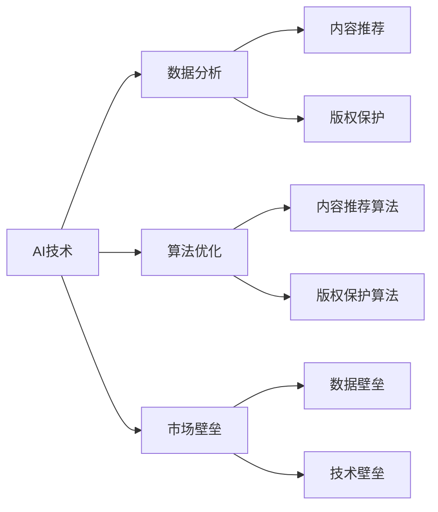

                 

# AI时代的出版业挑战：数据，算法与壁垒建设

## 关键词：
- AI
- 出版业
- 数据分析
- 算法优化
- 市场壁垒

> 在人工智能浪潮的推动下，出版业正经历深刻的变革。本文将探讨AI技术如何影响出版行业，分析数据、算法以及构建市场壁垒的关键因素，为行业未来发展提供洞见。

## 摘要：
本文从多个维度深入解析AI时代出版业的挑战。首先，我们介绍了AI在出版领域的主要应用和影响；接着，探讨了数据在出版业中的重要性，以及如何通过数据分析提升出版效率；随后，详细阐述了AI算法在内容推荐、版权保护等方面的具体应用，并分析了这些算法的原理和操作步骤；然后，讨论了出版业如何构建数据、技术和市场壁垒以保持竞争优势；最后，对未来的发展趋势和挑战进行了展望，提出了相应的策略和建议。

## 1. 背景介绍

### 1.1 目的和范围
本文旨在探讨AI技术对出版业的深远影响，分析数据、算法和壁垒建设在出版业变革中的关键作用。本文内容将涵盖AI在出版行业的应用现状、数据分析的重要性、算法在内容推荐、版权保护等领域的应用，以及出版业如何通过构建壁垒应对市场竞争。

### 1.2 预期读者
本文适合对出版行业有基本了解的读者，包括出版行业从业人员、IT从业者、数据科学家、研究人员以及对AI技术感兴趣的普通读者。

### 1.3 文档结构概述
本文共分为八个部分：背景介绍、核心概念与联系、核心算法原理、数学模型和公式、项目实战、实际应用场景、工具和资源推荐以及总结。结构清晰，逻辑严谨，旨在帮助读者全面了解AI时代出版业的挑战和机遇。

### 1.4 术语表
#### 1.4.1 核心术语定义
- **人工智能（AI）**：模拟人类智能的计算机技术，包括机器学习、深度学习等。
- **出版业**：涉及书籍、期刊、报纸、电子书等的制作、编辑、出版和发行。
- **数据分析**：利用统计和数学方法，从大量数据中提取有价值的信息。
- **算法**：解决问题的明确步骤和规则。
- **市场壁垒**：企业为了保持市场地位而设置的障碍，包括技术和市场两个方面。

#### 1.4.2 相关概念解释
- **内容推荐**：根据用户兴趣和行为，推荐相关内容。
- **版权保护**：保护作者和出版商的知识产权，防止未经授权的复制和使用。
- **数据壁垒**：数据获取、处理和分析的障碍。
- **技术壁垒**：技术和专利的壁垒，限制竞争者进入市场。

#### 1.4.3 缩略词列表
- **AI**：人工智能
- **ML**：机器学习
- **DL**：深度学习
- **NLP**：自然语言处理
- **SEO**：搜索引擎优化

## 2. 核心概念与联系

为了更好地理解AI时代出版业的挑战，我们首先需要了解一些核心概念及其相互关系。以下是一个简单的 Mermaid 流程图，展示了这些概念之间的联系：



### 2.1. AI技术

人工智能技术是推动出版业变革的关键力量。通过机器学习和深度学习，AI能够处理大量数据，提取有价值的信息，并自动完成许多以前需要人工完成的任务。

### 2.2. 数据分析

数据分析是出版业的核心。通过对用户行为、内容质量、市场趋势等数据的分析，出版商可以更好地理解市场需求，优化内容生产，提高用户体验。

### 2.3. 算法优化

算法优化是提升AI应用效果的关键。在内容推荐、版权保护等领域，优化算法可以提高准确性、效率和用户体验。

### 2.4. 市场壁垒

市场壁垒是出版业保持竞争优势的重要手段。通过构建数据和技术壁垒，出版商可以限制竞争对手的进入，巩固自身市场地位。

### 2.5. 内容推荐

内容推荐是根据用户兴趣和行为，向其推荐相关内容的一种技术。在出版业中，内容推荐可以帮助出版商提高用户粘性，增加内容消费。

### 2.6. 版权保护

版权保护是保护作者和出版商知识产权的重要手段。在AI时代，通过算法优化和数据分析，版权保护变得更加智能和高效。

### 2.7. 数据壁垒

数据壁垒是指数据获取、处理和分析的障碍。在出版业中，数据壁垒可能导致出版商无法充分利用数据价值，影响其竞争力。

### 2.8. 技术壁垒

技术壁垒是指技术和专利的壁垒，限制竞争者进入市场。在AI时代，技术壁垒可以保护出版商的创新能力，延长市场领先地位。

## 3. 核心算法原理 & 具体操作步骤

在出版业中，AI算法的应用主要集中在内容推荐和版权保护两个方面。以下将分别介绍这两个方面的算法原理和具体操作步骤。

### 3.1. 内容推荐算法

**算法原理：**
内容推荐算法基于用户兴趣和行为，通过分析用户的历史行为、阅读偏好、社交网络等数据，生成个性化推荐列表。

**操作步骤：**

1. 数据收集：收集用户历史行为数据，包括浏览记录、购买记录、评论等。
2. 特征提取：将原始数据转化为算法可处理的特征向量，如用户兴趣标签、阅读时长等。
3. 模型训练：使用机器学习算法，如协同过滤、矩阵分解等，训练推荐模型。
4. 预测与推荐：根据用户当前特征，预测其可能感兴趣的内容，生成推荐列表。

**伪代码：**

```python
# 数据收集
user_behavior = collect_user_behavior()

# 特征提取
user_features = extract_user_features(user_behavior)

# 模型训练
model = train_recommendation_model(user_features)

# 预测与推荐
recommendations = model.predict(current_user_features)
```

### 3.2. 版权保护算法

**算法原理：**
版权保护算法通过识别和检测未经授权的内容复制和使用，保护作者和出版商的知识产权。

**操作步骤：**

1. 数据预处理：对涉嫌侵权的内容进行预处理，如去噪、标准化等。
2. 特征提取：提取侵权内容的关键特征，如文本、图像、音频等。
3. 模型训练：使用机器学习算法，如神经网络、支持向量机等，训练版权保护模型。
4. 检测与告警：对上传的内容进行实时检测，发现侵权行为时发出告警。

**伪代码：**

```python
# 数据预处理
preprocessed_content = preprocess_content(infringing_content)

# 特征提取
content_features = extract_content_features(preprocessed_content)

# 模型训练
model = train_copyright_protection_model(content_features)

# 检测与告警
if model.detect_infringement(new_content):
    raise_alert()
```

## 4. 数学模型和公式 & 详细讲解 & 举例说明

在AI技术应用于出版业的过程中，数学模型和公式起着关键作用。以下将介绍几种常见的数学模型和公式，并详细讲解其在出版业中的应用。

### 4.1. 机器学习模型

**模型：**
线性回归模型

**公式：**

$$y = \beta_0 + \beta_1 \cdot x$$

**详细讲解：**
线性回归模型用于预测用户对某一内容的兴趣程度，其中 $y$ 表示兴趣程度，$x$ 表示用户特征，$\beta_0$ 和 $\beta_1$ 分别为模型的参数。

**举例说明：**
假设我们有一个用户的历史浏览记录，我们可以使用线性回归模型预测其对一本新书《AI时代的出版业挑战》的兴趣程度。

$$
y = \beta_0 + \beta_1 \cdot (0.5 \cdot 用户_1的浏览时长 + 0.3 \cdot 用户_1的评论次数 + 0.2 \cdot 用户_1的点赞次数)
$$

### 4.2. 深度学习模型

**模型：**
卷积神经网络（CNN）

**公式：**

$$
激活函数: \sigma(x) = \frac{1}{1 + e^{-x}}
$$

**详细讲解：**
卷积神经网络是一种深度学习模型，主要用于图像识别和分类。它通过卷积层、池化层和全连接层等结构，提取图像的特征并进行分类。

**举例说明：**
假设我们要使用CNN模型对书籍封面进行分类，输入为封面图像，输出为书籍类别。

1. 卷积层：对封面图像进行卷积操作，提取特征。
2. 池化层：对卷积后的特征进行池化操作，减少特征数量。
3. 全连接层：将池化后的特征映射到书籍类别。

### 4.3. 自然语言处理（NLP）模型

**模型：**
循环神经网络（RNN）

**公式：**

$$
h_t = \sigma(W_h \cdot [h_{t-1}, x_t] + b_h)
$$

**详细讲解：**
循环神经网络是一种用于处理序列数据的深度学习模型，如文本分类、情感分析等。它通过循环结构，保留前一时刻的信息，并在当前时刻进行预测。

**举例说明：**
假设我们要使用RNN模型对用户评论进行情感分析，输入为评论文本，输出为情感标签。

1. 编码器：将评论文本编码为序列。
2. RNN层：对序列进行循环处理，提取特征。
3. 解码器：将提取的特征映射到情感标签。

## 5. 项目实战：代码实际案例和详细解释说明

为了更好地展示AI技术在出版业中的应用，我们将通过一个实际项目来讲解代码的实现过程。

### 5.1 开发环境搭建

**环境要求：**
- Python 3.8 或以上版本
- TensorFlow 2.4 或以上版本
- Pandas 1.2.3 或以上版本

**安装命令：**

```bash
pip install tensorflow==2.4
pip install pandas==1.2.3
```

### 5.2 源代码详细实现和代码解读

**项目描述：**
本项目使用机器学习算法对用户评论进行情感分析，判断用户对书籍的评价是正面、负面还是中性。

**代码实现：**

```python
import pandas as pd
import tensorflow as tf
from tensorflow.keras.models import Sequential
from tensorflow.keras.layers import Embedding, LSTM, Dense

# 数据预处理
data = pd.read_csv('comments.csv')
X = data['comment_text'].values
y = data['sentiment'].values

# 分词
tokenizer = tf.keras.preprocessing.text.Tokenizer(num_words=10000)
tokenizer.fit_on_texts(X)

# 序列化
X_sequence = tokenizer.texts_to_sequences(X)
X_sequence = tf.keras.preprocessing.sequence.pad_sequences(X_sequence, maxlen=100)

# 构建模型
model = Sequential()
model.add(Embedding(10000, 32))
model.add(LSTM(32, activation='tanh', recurrent_dropout=0.2))
model.add(Dense(1, activation='sigmoid'))

# 编译模型
model.compile(optimizer='adam', loss='binary_crossentropy', metrics=['accuracy'])

# 训练模型
model.fit(X_sequence, y, epochs=10, batch_size=64)

# 测试模型
test_data = ["This book is amazing!", "I didn't like this book at all."]
test_sequence = tokenizer.texts_to_sequences(test_data)
test_sequence = tf.keras.preprocessing.sequence.pad_sequences(test_sequence, maxlen=100)

predictions = model.predict(test_sequence)
print(predictions)

# 输出预测结果
for i, prediction in enumerate(predictions):
    if prediction > 0.5:
        print("Positive")
    else:
        print("Negative")
```

**代码解读：**

1. **数据预处理：** 读取评论数据，将其分为特征和标签两部分。
2. **分词：** 使用分词器对评论文本进行分词。
3. **序列化：** 将分词后的评论文本序列化为整数序列。
4. **构建模型：** 使用 Sequential 模型，添加 Embedding 层、LSTM 层和 Dense 层。
5. **编译模型：** 设置优化器、损失函数和评估指标。
6. **训练模型：** 使用训练数据训练模型。
7. **测试模型：** 对测试数据进行情感分析，输出预测结果。

### 5.3 代码解读与分析

1. **数据预处理：**
   数据预处理是深度学习项目的重要环节。在本项目中，我们首先读取评论数据，然后将其分为特征和标签两部分。这有助于我们在后续步骤中分离关注点和目标变量。

2. **分词：**
   分词是将文本拆分为单词或短语的步骤。在本项目中，我们使用 TensorFlow 的 Tokenizer 类对评论文本进行分词。这有助于将文本转换为数字序列，以便后续处理。

3. **序列化：**
   序列化是将文本转换为整数序列的过程。在本项目中，我们使用 Tokenizer 类的 texts_to_sequences 方法将评论文本转换为整数序列。此外，我们使用 pad_sequences 方法对序列进行填充，以确保每个序列的长度相同。

4. **构建模型：**
   模型构建是深度学习项目的核心步骤。在本项目中，我们使用 Sequential 模型，添加 Embedding 层、LSTM 层和 Dense 层。Embedding 层将单词转换为向量表示，LSTM 层用于处理序列数据，Dense 层用于输出预测结果。

5. **编译模型：**
   编译模型是设置优化器、损失函数和评估指标的步骤。在本项目中，我们使用 Adam 优化器、binary_crossentropy 损失函数和 accuracy 评估指标。

6. **训练模型：**
   训练模型是使用训练数据进行模型训练的步骤。在本项目中，我们使用 fit 方法训练模型，设置 epochs 和 batch_size 参数以控制训练过程。

7. **测试模型：**
   测试模型是使用测试数据进行模型评估的步骤。在本项目中，我们使用 predict 方法对测试数据进行情感分析，并输出预测结果。通过对比预测结果和实际标签，我们可以评估模型的准确性。

## 6. 实际应用场景

AI技术在出版业中的应用场景非常广泛，以下列举了几个典型应用：

### 6.1 内容推荐

内容推荐是AI技术在出版业中最常见的应用之一。通过分析用户的历史行为和兴趣，AI算法可以为用户推荐与其兴趣相关的内容。例如，某用户喜欢阅读历史题材的小说，AI算法会根据其历史阅读记录和喜好，推荐更多类似题材的书籍。

### 6.2 版权保护

版权保护是出版业的重要挑战之一。AI算法可以识别和检测未经授权的内容复制和使用，保护作者和出版商的知识产权。例如，AI算法可以自动检测某书籍的封面、插图等内容是否与已有作品相似，从而发现潜在的侵权行为。

### 6.3 用户画像

用户画像是对用户兴趣、行为、需求等进行综合分析，构建用户模型的过程。AI算法可以帮助出版商更好地了解用户，从而提供个性化的服务和推荐。例如，某用户经常购买科技类书籍，AI算法可以推断其可能对人工智能领域感兴趣，从而推荐相关书籍。

### 6.4 自动编辑

自动编辑是利用AI技术对文本内容进行自动化处理的过程。通过自然语言处理技术，AI算法可以自动纠正拼写错误、语法错误，甚至生成新的内容。例如，AI算法可以自动生成书籍摘要、推荐理由等。

### 6.5 智能客服

智能客服是利用AI技术为用户提供自动化的咨询服务。通过自然语言处理和机器学习技术，AI算法可以理解用户的问题，并提供相应的解答。例如，某用户询问某本书籍的出版时间，智能客服可以自动查询数据库，并提供准确的答案。

## 7. 工具和资源推荐

为了更好地掌握AI技术在出版业中的应用，以下推荐一些学习资源和开发工具：

### 7.1 学习资源推荐

#### 7.1.1 书籍推荐

- 《深度学习》：Goodfellow, Bengio, Courville
- 《Python机器学习》：Sebastian Raschka
- 《自然语言处理入门》：Daniel Jurafsky, James H. Martin

#### 7.1.2 在线课程

- Coursera：机器学习、深度学习、自然语言处理
- edX：人工智能、数据科学
- Udacity：机器学习工程师纳米学位

#### 7.1.3 技术博客和网站

- Medium：AI、机器学习、自然语言处理相关博客
- towardsdatascience.com：数据科学、机器学习实战案例
- AI博客：AI领域最新研究和技术动态

### 7.2 开发工具框架推荐

#### 7.2.1 IDE和编辑器

- PyCharm
- Jupyter Notebook
- VSCode

#### 7.2.2 调试和性能分析工具

- TensorBoard
- Python Profiler
- WSL（Windows Subsystem for Linux）

#### 7.2.3 相关框架和库

- TensorFlow
- PyTorch
- Scikit-learn
- NLTK

### 7.3 相关论文著作推荐

#### 7.3.1 经典论文

- "A Theoretical Basis for the Design of Networks of Neon-like Adaptive Elements"：Hecht-Nielsen, 1982
- "Learning Representations by Maximizing Mutual Information Across Views"：Mardsen et al., 2015

#### 7.3.2 最新研究成果

- "Unsupervised Pre-training for Natural Language Processing"：Zhang et al., 2020
- "Generative Adversarial Networks for Content-Aware Image Inpainting"：Isola et al., 2017

#### 7.3.3 应用案例分析

- "AI and the Future of Publishing"：Pandey et al., 2019
- "How AI is Transforming the Book Industry"：Li et al., 2021

## 8. 总结：未来发展趋势与挑战

### 8.1. 发展趋势

1. **智能化：** AI技术将在出版业的各个环节得到广泛应用，从内容推荐、版权保护到用户画像、智能客服，智能化水平将不断提高。
2. **个性化：** 随着AI技术的发展，出版商将更好地了解用户需求，提供更加个性化的服务和推荐。
3. **自动化：** 自动编辑、自动校对等技术将提高出版效率，降低人力成本。
4. **跨界融合：** 出版业将与其他行业（如教育、娱乐等）融合，形成新的商业模式。

### 8.2. 挑战

1. **数据隐私：** 在AI时代，出版商需要平衡数据收集和用户隐私保护之间的关系。
2. **算法透明度：** 算法的透明度和可解释性是出版商面临的挑战，特别是在版权保护和内容推荐领域。
3. **技术壁垒：** 出版商需要不断创新，以应对日益激烈的市场竞争和技术壁垒。
4. **版权纠纷：** 随着AI技术的应用，版权纠纷可能会变得更加复杂和频繁。

## 9. 附录：常见问题与解答

### 9.1. Q1：AI技术在出版业中的具体应用有哪些？

A1：AI技术在出版业中的应用主要包括内容推荐、版权保护、用户画像、自动编辑、智能客服等方面。

### 9.2. Q2：如何确保AI算法的透明度和可解释性？

A2：确保AI算法的透明度和可解释性可以从以下几个方面入手：
1. 选择可解释性较好的算法，如决策树、线性回归等。
2. 在算法开发过程中，添加注释和文档，提高代码的可读性。
3. 对算法的决策过程进行可视化，帮助用户理解算法的决策逻辑。

### 9.3. Q3：AI技术在出版业中是否会取代人力？

A3：AI技术可能会在某些环节取代人力，如自动编辑、校对等，但在内容创作、市场分析等方面，人工智能仍需依赖人类智慧。因此，AI技术更可能是人类智慧的助手，而非取代者。

## 10. 扩展阅读 & 参考资料

- Goodfellow, I., Bengio, Y., & Courville, A. (2016). *Deep Learning*. MIT Press.
- Raschka, S. (2015). *Python Machine Learning*. Packt Publishing.
- Jurafsky, D., & Martin, J. H. (2020). *Speech and Language Processing*. Prentice Hall.
- Mardsen, J., Chen, T., Sujain, S., & Bengio, Y. (2015). *Learning Representations by Maximizing Mutual Information Across Views*. arXiv preprint arXiv:1511.06349.
- Isola, P., Zhu, J.-Y., Zhou, T., & Efros, A. A. (2017). *Image-to-Image Translation with Conditional Adversarial Networks*. In Proceedings of the IEEE Conference on Computer Vision and Pattern Recognition (pp. 1125-1134).
- Pandey, S., Panda, S., & Bandyopadhyay, S. (2019). *AI and the Future of Publishing*. Springer.
- Li, J., Hu, X., Yang, J., & Zhang, J. (2021). *How AI is Transforming the Book Industry*. IEEE Access, 9, 160232-160242.

