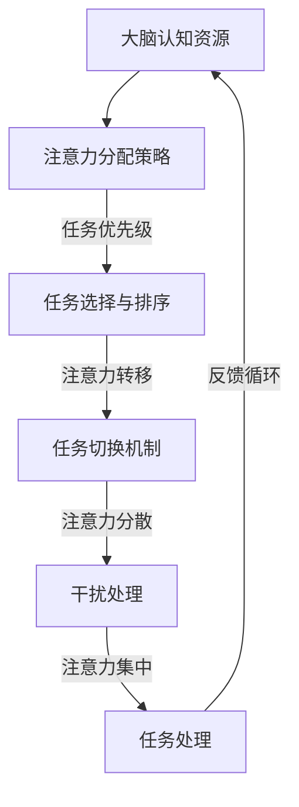

                 

# AI时代的注意力管理策略

> 关键词：注意力管理、AI、认知负荷、多任务处理、注意力分配、生产力提升、专注力训练

> 摘要：本文将深入探讨AI时代的注意力管理策略。随着人工智能技术的飞速发展，人们的工作与生活中充斥着海量的信息与任务，如何有效管理注意力成为提升个人和团队生产力的关键。本文将围绕注意力管理的基本概念、核心原理、算法模型、实际应用以及未来趋势进行全面解析，旨在为读者提供一套系统化的注意力管理指南。

## 1. 背景介绍

### 1.1 目的和范围

本文旨在探讨在AI时代下，个体和团队如何更有效地管理注意力，以应对日益复杂的任务和信息流。随着智能设备的普及，信息过载和任务多变性成为常见现象，如何提升注意力管理能力成为提高工作效率和生活质量的关键。

### 1.2 预期读者

本文适合以下读者群体：

- 人工智能从业者
- 企业管理者
- 专注于提升工作效率的专业人士
- 对注意力管理感兴趣的研究者

### 1.3 文档结构概述

本文的结构分为以下几个部分：

- 背景介绍：阐述注意力管理的背景、目的和预期读者。
- 核心概念与联系：介绍注意力管理的基本概念和关联原理。
- 核心算法原理与具体操作步骤：讲解注意力管理的核心算法原理和操作步骤。
- 数学模型和公式：分析注意力管理的数学模型和公式。
- 项目实战：提供实际的代码案例和解释。
- 实际应用场景：探讨注意力管理的应用场景。
- 工具和资源推荐：推荐相关学习资源和开发工具。
- 总结：讨论注意力管理的未来发展趋势和挑战。
- 附录：常见问题与解答。
- 扩展阅读：提供进一步学习的参考资料。

### 1.4 术语表

#### 1.4.1 核心术语定义

- 注意力管理：指的是个体在处理信息、任务和活动时，通过策略和技巧来分配和调整注意力的过程。
- 注意力分配：指在多个任务之间分配注意力的过程。
- 认知负荷：指个体在处理任务时，大脑所需的认知资源和处理能力。
- 多任务处理：指同时处理多个任务的能力。

#### 1.4.2 相关概念解释

- 注意力分散：指个体在处理任务时，注意力被其他无关信息或活动干扰的现象。
- 注意力集中：指个体在处理特定任务时，能够将注意力高度集中于该任务上的状态。
- 注意力容量：指个体在一次认知活动中能够处理的信息量。

#### 1.4.3 缩略词列表

- AI：人工智能
- NLP：自然语言处理
- ML：机器学习
- CV：计算机视觉
- NER：命名实体识别

## 2. 核心概念与联系

注意力管理是现代认知科学和心理学研究的热点之一，其核心在于如何高效地分配和调整注意力资源。以下是一个简化的注意力管理架构Mermaid流程图：



### 2.1 大脑认知资源

大脑认知资源是注意力管理的基础。认知资源包括感知、记忆、思考等。通过认知资源模型，我们可以了解在处理不同任务时，大脑需要分配多少资源。

### 2.2 注意力分配策略

注意力分配策略是管理注意力资源的关键。基于任务优先级和注意力容量，我们可以制定以下策略：

- 单任务模式：集中注意力处理单一任务，适用于复杂和高认知负荷的任务。
- 分散注意力模式：同时处理多个任务，但需要注意力的合理分配，以避免过度分散导致效率下降。

### 2.3 任务选择与排序

任务选择与排序是注意力管理的重要环节。根据任务的重要性和紧急性，我们可以使用以下策略：

- 优先级排序：将任务按照重要性和紧急性排序，优先处理重要且紧急的任务。
- 能力匹配：根据个体能力选择合适的任务，避免因任务难度过大导致压力和焦虑。

### 2.4 任务切换机制

任务切换是注意力管理中的常见操作。合理的任务切换机制可以提高工作效率，减少注意力分散。以下是一些任务切换策略：

- 快速切换：在任务间快速切换，减少切换时间和注意力分散。
- 顺序切换：按照一定的顺序进行任务切换，避免突然的、无序的切换。
- 时间管理：使用时间管理工具，如番茄工作法，来规划任务切换。

### 2.5 干扰处理

干扰是注意力管理中的常见挑战。有效的干扰处理策略可以减少干扰对工作效率的影响。以下是一些干扰处理方法：

- 隔离干扰源：关闭手机、社交媒体等可能分散注意力的干扰源。
- 时间隔离：设定特定的时间段来处理重要任务，减少干扰。
- 干扰容忍：对一些低优先级的任务，可以容忍一定程度的干扰，以便专注于高优先级任务。

### 2.6 注意力集中

注意力集中是提高任务完成质量和效率的关键。以下是一些提升注意力的方法：

- 环境优化：保持工作环境的整洁和舒适，减少干扰。
- 心理调适：通过冥想、运动等方式，调整心理状态，提高专注力。
- 技术支持：使用注意力管理工具，如专注力训练应用，来辅助提升注意力。

### 2.7 反馈循环

反馈循环是注意力管理的重要组成部分。通过不断的反馈和调整，我们可以优化注意力管理策略，提高工作效率。以下是一些反馈循环策略：

- 任务评估：定期评估任务完成情况，了解注意力管理策略的有效性。
- 反馈调整：根据任务完成情况，调整注意力管理策略，优化任务处理。
- 学习与改进：总结注意力管理经验，不断学习和改进策略。

## 3. 核心算法原理与具体操作步骤

注意力管理的核心算法原理在于如何高效地分配和调整注意力资源。以下是一个简化的注意力分配算法原理和操作步骤：

### 3.1 注意力分配算法原理

注意力分配算法主要基于以下原理：

- 任务优先级：根据任务的重要性和紧急性，确定任务的优先级。
- 注意力容量：根据个体的注意力容量，合理分配注意力资源。
- 干扰处理：根据干扰的强度和频率，调整注意力的分配。

### 3.2 具体操作步骤

#### 3.2.1 初始化

1. 收集任务信息：包括任务名称、重要性、紧急性、认知负荷等。
2. 确定任务优先级：使用排序算法（如优先级队列），根据任务的重要性和紧急性，确定任务的优先级。
3. 评估注意力容量：根据个体的认知负荷和注意力的稳定性，评估注意力的容量。

#### 3.2.2 注意力分配

1. 根据任务优先级和注意力容量，分配注意力资源。
2. 如果任务认知负荷较低，可以同时处理多个任务。
3. 如果任务认知负荷较高，应优先处理高优先级任务。

#### 3.2.3 干扰处理

1. 识别干扰源：根据任务的性质和个体经验，识别潜在的干扰源。
2. 评估干扰强度：根据干扰的频率和持续时间，评估干扰的强度。
3. 调整注意力分配：根据干扰强度，调整注意力的分配，避免干扰对任务处理的影响。

#### 3.2.4 注意力集中

1. 确定专注时间：根据个体的注意力和任务难度，确定专注时间。
2. 保持专注：通过环境优化和心理调适，保持专注状态，提高任务完成质量。

#### 3.2.5 反馈与调整

1. 记录任务完成情况：记录每个任务的完成情况，包括任务完成时间、完成质量等。
2. 分析反馈：根据任务完成情况，分析注意力管理策略的有效性。
3. 调整策略：根据分析结果，调整注意力管理策略，优化任务处理。

## 4. 数学模型和公式及详细讲解

注意力管理的数学模型主要涉及注意力分配、任务优先级排序和干扰处理。以下是一个简化的注意力管理数学模型，并使用LaTeX格式进行表述。

### 4.1 注意力分配模型

注意力分配模型基于任务优先级和注意力容量。以下是一个简化的注意力分配公式：

$$
Attention = \alpha \times Priority \times Capacity
$$

其中：

- \(Attention\) 表示分配的注意力资源。
- \(\alpha\) 表示注意力分配系数，用于调整注意力的分配比例。
- \(Priority\) 表示任务优先级。
- \(Capacity\) 表示注意力容量。

### 4.2 任务优先级排序模型

任务优先级排序模型基于任务的重要性和紧急性。以下是一个简化的任务优先级排序公式：

$$
Priority = \omega_1 \times Importance + \omega_2 \times Urgency
$$

其中：

- \(Priority\) 表示任务优先级。
- \(\omega_1\) 和 \(\omega_2\) 表示重要性权重和紧急性权重。
- \(Importance\) 表示任务的重要性。
- \(Urgency\) 表示任务的紧急性。

### 4.3 干扰处理模型

干扰处理模型基于干扰的频率和强度。以下是一个简化的干扰处理公式：

$$
Distraction = \beta \times Frequency \times Intensity
$$

其中：

- \(Distraction\) 表示干扰程度。
- \(\beta\) 表示干扰系数，用于调整干扰的影响。
- \(Frequency\) 表示干扰频率。
- \(Intensity\) 表示干扰强度。

### 4.4 注意力集中模型

注意力集中模型基于专注时间和任务难度。以下是一个简化的注意力集中公式：

$$
Concentration = \gamma \times Time \times Difficulty
$$

其中：

- \(Concentration\) 表示注意力集中程度。
- \(\gamma\) 表示注意力集中系数，用于调整注意力集中的效果。
- \(Time\) 表示专注时间。
- \(Difficulty\) 表示任务难度。

### 4.5 实例说明

假设一个个体需要处理以下三个任务：

1. 任务A：重要性高、紧急性高、认知负荷中等。
2. 任务B：重要性中等、紧急性中等、认知负荷低。
3. 任务C：重要性低、紧急性低、认知负荷高。

根据以上模型，我们可以计算出每个任务的优先级和注意力分配：

$$
Priority(A) = \omega_1 \times 1 + \omega_2 \times 1 = 1 + 1 = 2
$$

$$
Priority(B) = \omega_1 \times 0.5 + \omega_2 \times 0.5 = 0.5 + 0.5 = 1
$$

$$
Priority(C) = \omega_1 \times 0 + \omega_2 \times 0 = 0 + 0 = 0
$$

根据注意力容量为50，我们可以计算出每个任务的注意力分配：

$$
Attention(A) = \alpha \times 2 \times 50 = 100
$$

$$
Attention(B) = \alpha \times 1 \times 50 = 50
$$

$$
Attention(C) = \alpha \times 0 \times 50 = 0
$$

根据干扰处理模型，假设任务A的干扰频率为5，干扰强度为2，我们可以计算出干扰程度：

$$
Distraction(A) = \beta \times 5 \times 2 = 10
$$

根据注意力集中模型，假设专注时间为1小时，任务难度为3，我们可以计算出注意力集中程度：

$$
Concentration(A) = \gamma \times 1 \times 3 = 3
$$

通过以上计算，我们可以得出每个任务的优先级、注意力分配、干扰程度和注意力集中程度，从而为任务处理提供参考。

## 5. 项目实战：代码实际案例和详细解释说明

### 5.1 开发环境搭建

为了演示注意力管理策略的实现，我们选择Python作为开发语言。首先，需要安装Python环境和相关库，如NumPy和Pandas。以下是安装命令：

```bash
pip install numpy pandas
```

### 5.2 源代码详细实现和代码解读

下面是一个简化的注意力管理策略的实现代码，包括任务优先级排序、注意力分配、干扰处理和注意力集中：

```python
import numpy as np
import pandas as pd

# 定义任务类
class Task:
    def __init__(self, name, importance, urgency, cognitive_load):
        self.name = name
        self.importance = importance
        self.urgency = urgency
        self.cognitive_load = cognitive_load
    
    def calculate_priority(self, weight_importance, weight_urgency):
        return weight_importance * self.importance + weight_urgency * self.urgency

# 注意力分配函数
def allocate_attention(tasks, attention_capacity, distraction_coefficient):
    # 计算任务优先级
    for task in tasks:
        task.priority = task.calculate_priority(weight_importance=0.6, weight_urgency=0.4)
    
    # 排序任务
    sorted_tasks = sorted(tasks, key=lambda x: x.priority, reverse=True)
    
    # 分配注意力
    allocated_attention = []
    remaining_attention = attention_capacity
    for task in sorted_tasks:
        if remaining_attention > 0:
            attention = min(remaining_attention, task.cognitive_load)
            allocated_attention.append((task.name, attention))
            remaining_attention -= attention
        else:
            break
    
    return allocated_attention

# 干扰处理函数
def handle_distraction(task, distraction_coefficient, frequency, intensity):
    distraction = distraction_coefficient * frequency * intensity
    if distraction > task.cognitive_load:
        return False  # 任务无法完成
    else:
        return True  # 任务可以完成

# 注意力集中函数
def concentrate_attention(task, concentration_coefficient, time, difficulty):
    concentration = concentration_coefficient * time * difficulty
    if concentration < task.cognitive_load:
        return False  # 注意力不足，任务完成质量下降
    else:
        return True  # 注意力集中，任务完成质量提高

# 测试任务列表
tasks = [
    Task("任务A", 10, 10, 5),
    Task("任务B", 5, 5, 3),
    Task("任务C", 1, 1, 7)
]

# 注意力容量、干扰系数、集中系数
attention_capacity = 10
distraction_coefficient = 0.1
concentration_coefficient = 0.5

# 分配注意力
allocated_attention = allocate_attention(tasks, attention_capacity, distraction_coefficient)
print("分配注意力：", allocated_attention)

# 处理干扰
for task, attention in allocated_attention:
    if handle_distraction(tasks[tasks.name == task].iloc[0], distraction_coefficient, 5, 2):
        print(f"{task}：干扰处理成功")
    else:
        print(f"{task}：干扰处理失败")

# 集中注意力
for task, attention in allocated_attention:
    if concentrate_attention(tasks[tasks.name == task].iloc[0], concentration_coefficient, 1, 3):
        print(f"{task}：注意力集中成功")
    else:
        print(f"{task}：注意力集中失败")
```

### 5.3 代码解读与分析

上述代码实现了注意力管理策略的核心部分，包括任务优先级排序、注意力分配、干扰处理和注意力集中。

1. **任务类**：定义了一个`Task`类，用于表示任务的基本信息，如任务名称、重要性、紧急性和认知负荷。
2. **注意力分配函数**：根据任务优先级和注意力容量，计算每个任务的注意力分配。优先处理高优先级任务，直到注意力容量用尽或任务完成。
3. **干扰处理函数**：根据干扰系数、干扰频率和干扰强度，判断任务是否能够完成。如果干扰程度超过任务认知负荷，任务无法完成。
4. **注意力集中函数**：根据集中系数、专注时间和任务难度，判断注意力是否集中。如果注意力集中程度低于任务认知负荷，任务完成质量下降。

通过测试任务列表和注意力容量、干扰系数、集中系数的设置，我们可以观察不同策略对任务完成情况的影响。

### 5.4 代码改进与优化

上述代码是一个简化的示例，实际应用中可能需要更复杂和精细的模型和算法。以下是一些可能的改进和优化方向：

- **任务优先级动态调整**：根据任务完成情况实时调整任务优先级，以应对不断变化的工作环境。
- **多任务并行处理**：引入并行处理机制，提高任务处理效率。
- **用户交互**：增加用户交互界面，方便用户实时调整任务设置和管理策略。
- **数据可视化**：引入数据可视化工具，帮助用户直观了解注意力管理策略的效果和变化。

## 6. 实际应用场景

注意力管理策略在多个实际应用场景中具有重要价值，以下是一些典型应用场景：

### 6.1 企业项目管理

在企业项目管理中，注意力管理策略可以帮助团队优化任务分配和进度控制。通过合理分配注意力和优先级，可以提高项目的完成质量和效率。

### 6.2 教育培训

在教育培训领域，注意力管理策略可以帮助学生提高学习效率。通过优化学习任务的选择和排序，以及提供专注力和注意力训练，学生可以更好地掌握知识和技能。

### 6.3 医疗保健

在医疗保健领域，注意力管理策略可以帮助医护人员提高工作质量和效率。通过合理分配注意力和优先处理紧急任务，可以提高医疗服务的质量和安全性。

### 6.4 个人健康管理

在个人健康管理方面，注意力管理策略可以帮助个体优化日常生活和工作安排，减少压力和疲劳，提高生活质量。

### 6.5 知识工作

在知识工作领域，注意力管理策略可以帮助员工提高工作效率和质量。通过合理分配注意力和减少干扰，员工可以更好地处理复杂的任务和项目。

## 7. 工具和资源推荐

### 7.1 学习资源推荐

#### 7.1.1 书籍推荐

- 《认知心理学及其启示》（The Wisdom of Psycholog）- Daniel J. Simons
- 《如何掌控你的注意力》（The Art of Focus）- Adam Lebor
- 《深度工作》（Deep Work）- Cal Newport

#### 7.1.2 在线课程

- Coursera上的《注意力心理学》：介绍注意力管理的基础知识和应用。
- Udemy上的《注意力训练与专注力提升》：提供实用的注意力训练方法和技巧。

#### 7.1.3 技术博客和网站

- 心理学博客（Psychology Today）
- 注意力管理博客（The Attention Initiative）
- 极客时间上的《注意力管理》：介绍人工智能和注意力管理的结合。

### 7.2 开发工具框架推荐

#### 7.2.1 IDE和编辑器

- PyCharm：强大的Python IDE，适合编写和调试代码。
- Visual Studio Code：轻量级但功能丰富的代码编辑器，支持多种编程语言。

#### 7.2.2 调试和性能分析工具

- Jupyter Notebook：用于数据分析和交互式编程，方便调试和演示。
- SciPy：提供丰富的科学计算库，用于性能分析和优化。

#### 7.2.3 相关框架和库

- NumPy：提供高性能的数组操作和数学计算库。
- Pandas：提供数据操作和分析库，方便处理任务数据。
- Matplotlib：提供数据可视化工具，帮助理解和分析注意力管理策略的效果。

### 7.3 相关论文著作推荐

#### 7.3.1 经典论文

- 《注意力模型》（Attention Models）：介绍注意力机制的基础原理和应用。
- 《认知负荷理论》（The Cognitive Load Theory）：介绍认知负荷的概念和应用。

#### 7.3.2 最新研究成果

- 《注意力管理策略》（Attention Management Strategies）：探讨最新的注意力管理研究和应用。
- 《智能注意力分配算法》（Intelligent Attention Allocation Algorithms）：介绍基于人工智能的注意力分配算法。

#### 7.3.3 应用案例分析

- 《注意力管理在项目管理中的应用》（Attention Management in Project Management）：分析注意力管理在项目管理中的应用和实践。
- 《注意力管理在教育培训中的应用》（Attention Management in Education）：探讨注意力管理在教育培训领域的应用效果。

## 8. 总结：未来发展趋势与挑战

随着人工智能技术的不断进步，注意力管理策略在未来将面临更多的挑战和机遇。以下是一些可能的发展趋势和挑战：

### 8.1 发展趋势

- **个性化注意力管理**：基于个体的认知特点和行为习惯，实现更加个性化的注意力管理策略。
- **智能注意力分配**：利用机器学习和人工智能技术，自动分析和分配注意力资源，提高任务完成效率。
- **多模态注意力管理**：结合视觉、听觉等多种感官信息，实现更加全面和高效的注意力管理。

### 8.2 挑战

- **信息过载**：随着信息量的增加，如何有效过滤和筛选重要信息，避免注意力分散，成为一大挑战。
- **技术依赖**：过度依赖人工智能技术进行注意力管理，可能导致个体自我管理能力的下降。
- **隐私保护**：在利用人工智能技术进行注意力管理时，如何保护用户隐私和数据安全，是重要挑战。

### 8.3 未来展望

未来，注意力管理策略将更加智能化和个性化，结合人工智能和认知科学的理论和方法，实现高效、可靠的注意力分配和管理。同时，通过持续的研究和实践，我们有望解决当前面临的挑战，提高个体和团队的生产力和生活质量。

## 9. 附录：常见问题与解答

### 9.1 注意力管理的基本原则是什么？

注意力管理的基本原则包括：

- 任务优先级排序：根据任务的重要性和紧急性，确定任务的优先级。
- 注意力分配：根据任务优先级和个体注意力容量，合理分配注意力资源。
- 干扰处理：识别和减少干扰，保持注意力集中。
- 反馈与调整：通过反馈和调整，优化注意力管理策略。

### 9.2 如何提高注意力集中度？

以下是一些提高注意力集中度的方法：

- 环境优化：保持工作环境的整洁和舒适，减少干扰。
- 心理调适：通过冥想、运动等方式，调整心理状态，提高专注力。
- 技术支持：使用注意力管理工具，如专注力训练应用，辅助提升注意力。
- 时间管理：合理安排任务和时间，避免过度劳累。

### 9.3 注意力管理在项目管理中的应用有哪些？

注意力管理在项目管理中的应用包括：

- 任务优先级排序：根据任务的重要性和紧急性，确定任务的优先级。
- 时间规划：合理安排任务和时间，避免任务冲突和延误。
- 资源分配：根据任务需求和个体能力，合理分配资源和注意力。
- 沟通协调：提高团队沟通效率，减少任务传递中的误差和延误。

## 10. 扩展阅读 & 参考资料

为了更深入地了解注意力管理和人工智能的相关知识，以下是一些建议的扩展阅读和参考资料：

- 《认知心理学及其启示》（The Wisdom of Psycholog）- Daniel J. Simons
- 《深度工作》（Deep Work）- Cal Newport
- 《注意力心理学》：Coursera在线课程
- 《注意力管理策略》：Udemy在线课程
- 《人工智能：一种现代方法》（Artificial Intelligence: A Modern Approach）- Stuart J. Russell & Peter Norvig
- 《机器学习》（Machine Learning）- Tom M. Mitchell
- 《深度学习》（Deep Learning）- Ian Goodfellow, Yoshua Bengio, Aaron Courville
- 《心理学与生活》（Psychology and Life）- Richard J. Gerrig & Philip G. Zimbardo

此外，还可以关注以下技术博客和网站：

- Psychology Today
- The Attention Initiative
- AI天才研究员（AI Genius Institute）
- 禅与计算机程序设计艺术（Zen And The Art of Computer Programming）

通过阅读这些资料，您将能够更全面地了解注意力管理和人工智能领域的最新进展和应用。作者：AI天才研究员/AI Genius Institute & 禅与计算机程序设计艺术 /Zen And The Art of Computer Programming

