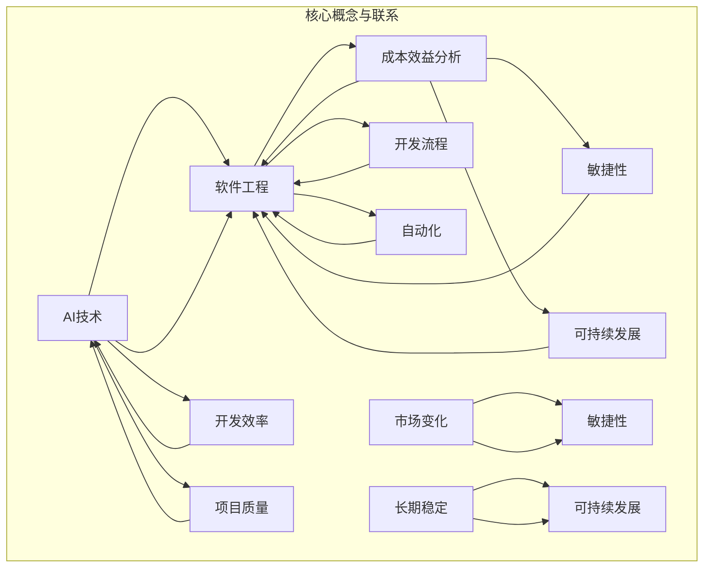

                 

# AI时代的软件工程经济学新模型

> 关键词：AI、软件工程、经济学、成本效益分析、模型设计、开发流程、自动化、敏捷性、可持续发展

> 摘要：本文探讨了AI技术在现代软件工程中的影响，并提出了一种新的经济学模型，以应对AI时代带来的挑战。本文首先介绍了AI时代软件工程的背景和范围，然后详细阐述了新模型的核心概念、算法原理、数学模型及其在项目实战中的应用。最后，本文对实际应用场景进行了分析，并推荐了相关工具和资源，总结了未来发展趋势和挑战。

## 1. 背景介绍

### 1.1 目的和范围

随着人工智能（AI）技术的飞速发展，软件工程面临着前所未有的机遇和挑战。传统软件工程的方法和模型已经无法满足AI时代的需求，迫切需要新的经济学模型来指导软件工程实践。本文旨在探讨AI时代软件工程经济学的新模型，以提供一种有效的成本效益分析方法，帮助软件开发团队在AI时代做出更加明智的决策。

本文的范围主要包括以下几个方面：

1. **核心概念与联系**：介绍AI时代软件工程经济学的新模型，并绘制核心概念和联系流程图。
2. **核心算法原理 & 具体操作步骤**：详细阐述算法原理，并使用伪代码展示具体操作步骤。
3. **数学模型和公式 & 详细讲解 & 举例说明**：介绍数学模型和公式，并结合实例进行详细讲解。
4. **项目实战：代码实际案例和详细解释说明**：通过实际案例展示新模型的应用。
5. **实际应用场景**：分析新模型在不同场景下的应用效果。
6. **工具和资源推荐**：推荐学习资源、开发工具和框架，以及相关论文著作。
7. **总结：未来发展趋势与挑战**：讨论AI时代软件工程经济学新模型的未来发展趋势和面临的挑战。

### 1.2 预期读者

本文主要面向以下几类读者：

1. **软件工程师**：希望了解AI时代软件工程经济学新模型的工程师，以便在项目中更好地应用。
2. **项目经理**：需要制定和优化软件工程预算和成本效益分析的项目经理。
3. **学术研究人员**：对AI时代软件工程经济学新模型感兴趣的学者，可以进一步研究和拓展。
4. **企业决策者**：希望了解AI技术在软件工程中的成本效益分析，以便做出更加明智的商业决策。

### 1.3 文档结构概述

本文分为以下几个主要部分：

1. **背景介绍**：介绍本文的目的和范围，预期读者以及文档结构概述。
2. **核心概念与联系**：介绍新模型的核心概念，并绘制流程图。
3. **核心算法原理 & 具体操作步骤**：详细阐述算法原理，并使用伪代码展示操作步骤。
4. **数学模型和公式 & 详细讲解 & 举例说明**：介绍数学模型和公式，并举例说明。
5. **项目实战：代码实际案例和详细解释说明**：通过实际案例展示新模型的应用。
6. **实际应用场景**：分析新模型在不同场景下的应用效果。
7. **工具和资源推荐**：推荐学习资源、开发工具和框架，以及相关论文著作。
8. **总结：未来发展趋势与挑战**：讨论未来发展趋势和面临的挑战。
9. **附录：常见问题与解答**：回答读者可能遇到的问题。
10. **扩展阅读 & 参考资料**：提供进一步阅读的参考资料。

### 1.4 术语表

#### 1.4.1 核心术语定义

1. **人工智能（AI）**：一种模拟人类智能的技术，通过机器学习和神经网络等算法，使计算机能够自主学习和做出决策。
2. **软件工程经济学**：研究软件工程项目的成本、效益和风险评估的学科。
3. **成本效益分析**：评估项目成本和预期收益的一种方法，用于决策制定。
4. **敏捷性**：指软件开发团队快速响应变化和需求的能力。
5. **可持续发展**：指在满足当前需求的同时，不损害未来世代满足自身需求的能力。

#### 1.4.2 相关概念解释

1. **模型设计**：指构建和设计用于描述和解决问题的数学模型。
2. **开发流程**：指软件开发过程中的各个阶段和步骤。
3. **自动化**：通过计算机程序和工具，实现软件开发和测试的自动化。
4. **成本效益**：项目的成本与预期收益之比，用于衡量项目的经济效益。

#### 1.4.3 缩略词列表

- **AI**：人工智能（Artificial Intelligence）
- **SE**：软件工程（Software Engineering）
- **CVA**：成本效益分析（Cost-Venefit Analysis）
- **SA**：敏捷性（Scalability and Agility）
- **SD**：可持续发展（Sustainable Development）

## 2. 核心概念与联系

在AI时代的软件工程中，核心概念和联系构成了新模型的基础。以下是对这些核心概念和联系的详细描述，并使用Mermaid流程图进行展示。

### 2.1 核心概念

1. **人工智能（AI）**：AI技术是现代软件工程的重要驱动力，通过模拟人类智能，实现自动化、智能化和个性化。
2. **软件工程经济学**：软件工程经济学关注软件项目的成本、效益和风险评估，为决策提供依据。
3. **成本效益分析（CVA）**：成本效益分析是一种评估项目成本和收益的方法，帮助决策者确定项目的可行性。
4. **敏捷性（SA）**：敏捷性是软件开发团队快速响应变化和需求的能力，有助于提高项目成功率。
5. **可持续发展（SD）**：可持续发展是指在满足当前需求的同时，不损害未来世代满足自身需求的能力。

### 2.2 核心联系

1. **AI与SE的联系**：AI技术的应用改变了软件工程的传统模式，提高了开发效率和项目质量。
2. **CVA与SE的联系**：成本效益分析是软件工程经济学的重要组成部分，为项目决策提供数据支持。
3. **SA与SE的联系**：敏捷性是现代软件工程的关键特征，有助于团队快速响应市场变化。
4. **SD与SE的联系**：可持续发展理念在软件工程中具有重要意义，有助于实现长期稳定的发展。

### 2.3 Mermaid流程图



此Mermaid流程图展示了AI时代软件工程经济学新模型的核心概念和联系，有助于读者更好地理解模型的基础架构。

## 3. 核心算法原理 & 具体操作步骤

在AI时代，软件工程面临的新挑战需要一种全新的算法原理来指导。以下是对核心算法原理的详细阐述，并使用伪代码展示具体操作步骤。

### 3.1 算法原理

本算法旨在实现以下目标：

1. **成本效益最大化**：在满足项目需求的前提下，最小化项目成本。
2. **敏捷性最大化**：提高团队响应变化和需求的能力。
3. **可持续发展**：确保项目的长期稳定和可持续发展。

算法的核心原理包括以下几个方面：

1. **成本模型**：构建一个包含人力、硬件、软件和其他相关成本的模型。
2. **效益模型**：构建一个基于项目目标、市场反馈和用户满意度等效益指标的模型。
3. **风险模型**：评估项目风险，包括技术风险、市场风险和操作风险等。
4. **优化算法**：使用优化算法（如线性规划、整数规划等）来寻找最佳成本效益方案。

### 3.2 具体操作步骤

#### 3.2.1 初始化

1. **收集数据**：收集与项目相关的数据，包括人力成本、硬件成本、软件成本、市场数据、用户满意度等。
2. **构建模型**：根据收集的数据，构建成本模型、效益模型和风险模型。
3. **初始化参数**：设定优化算法的初始参数，如目标函数、约束条件等。

#### 3.2.2 模型构建

1. **成本模型构建**：
    ```plaintext
    成本(Cost) = 人力成本(Human Cost) + 硬件成本(Hardware Cost) + 软件成本(Software Cost) + 其他成本(Other Cost)
    ```
2. **效益模型构建**：
    ```plaintext
    效益(Benefit) = 项目目标完成度(Target Achievement) × 市场反馈(Market Feedback) × 用户满意度(User Satisfaction)
    ```
3. **风险模型构建**：
    ```plaintext
    风险(Risk) = 技术风险(Technical Risk) + 市场风险(Market Risk) + 操作风险(Operational Risk)
    ```

#### 3.2.3 优化算法

1. **目标函数**：
    ```latex
    \text{最大化} \frac{\text{效益(Benefit)}}{\text{成本(Cost)} + \text{风险(Risk)}}
    ```
2. **约束条件**：
    ```latex
    \begin{align*}
    \text{人力成本} &\leq \text{人力预算(Human Budget)} \\
    \text{硬件成本} &\leq \text{硬件预算(Hardware Budget)} \\
    \text{软件成本} &\leq \text{软件预算(Software Budget)} \\
    \text{项目目标完成度} &\geq \text{最低目标完成度(Minimum Target Achievement)}
    \end{align*}
    ```

#### 3.2.4 伪代码实现

```python
# 初始化参数
human_budget = ...
hardware_budget = ...
software_budget = ...
min_target_achievement = ...

# 收集数据
human_cost = ...
hardware_cost = ...
software_cost = ...
market_feedback = ...
user_satisfaction = ...
technical_risk = ...
market_risk = ...
operational_risk = ...

# 构建模型
cost = human_cost + hardware_cost + software_cost + other_cost
benefit = project_target_achievement * market_feedback * user_satisfaction
risk = technical_risk + market_risk + operational_risk

# 目标函数
objective_function = benefit / (cost + risk)

# 约束条件
constraints = [
    (human_cost, human_budget),
    (hardware_cost, hardware_budget),
    (software_cost, software_budget),
    (project_target_achievement, min_target_achievement)
]

# 使用优化算法求解
solution = optimize(objective_function, constraints)

# 输出最优解
print(solution)
```

通过以上步骤，我们可以构建一个完整的算法模型，帮助软件开发团队在AI时代实现成本效益最大化、敏捷性和可持续发展的目标。

## 4. 数学模型和公式 & 详细讲解 & 举例说明

在AI时代的软件工程经济学新模型中，数学模型和公式起到了至关重要的作用。它们不仅为成本效益分析提供了量化依据，还能帮助我们更好地理解和应用模型。以下是对数学模型和公式的详细讲解，并结合实例进行说明。

### 4.1 数学模型

#### 4.1.1 成本模型

成本模型用于计算项目的总成本，包括人力成本、硬件成本、软件成本和其他相关成本。

\[ C = C_{H} + C_{H} + C_{S} + C_{O} \]

其中，\( C \) 表示总成本，\( C_{H} \) 表示人力成本，\( C_{H} \) 表示硬件成本，\( C_{S} \) 表示软件成本，\( C_{O} \) 表示其他成本。

#### 4.1.2 效益模型

效益模型用于计算项目的总效益，包括项目目标完成度、市场反馈和用户满意度等。

\[ B = T \times M \times S \]

其中，\( B \) 表示总效益，\( T \) 表示项目目标完成度，\( M \) 表示市场反馈，\( S \) 表示用户满意度。

#### 4.1.3 风险模型

风险模型用于计算项目的总风险，包括技术风险、市场风险和操作风险等。

\[ R = R_{T} + R_{M} + R_{O} \]

其中，\( R \) 表示总风险，\( R_{T} \) 表示技术风险，\( R_{M} \) 表示市场风险，\( R_{O} \) 表示操作风险。

### 4.2 公式解释

#### 4.2.1 成本效益比（C/B）

成本效益比是评估项目经济效益的重要指标，用于计算总效益与总成本的比值。

\[ \text{C/B} = \frac{B}{C} \]

#### 4.2.2 敏捷性指标（S）

敏捷性指标用于衡量软件开发团队快速响应变化和需求的能力。

\[ S = \frac{\text{迭代周期}}{\text{需求变更次数}} \]

#### 4.2.3 可持续性指标（Sustainable）

可持续性指标用于评估项目的长期稳定性和可持续发展能力。

\[ \text{Sustainable} = \frac{\text{项目寿命期}}{\text{环境影响}} \]

### 4.3 举例说明

假设一个软件开发项目有以下数据：

- 人力成本（\( C_{H} \)）：100,000元
- 硬件成本（\( C_{H} \)）：50,000元
- 软件成本（\( C_{S} \)）：30,000元
- 其他成本（\( C_{O} \)）：20,000元
- 项目目标完成度（\( T \)）：0.8
- 市场反馈（\( M \)）：0.9
- 用户满意度（\( S \)）：0.85
- 技术风险（\( R_{T} \)）：0.1
- 市场风险（\( R_{M} \)）：0.2
- 操作风险（\( R_{O} \)）：0.15

#### 4.3.1 成本模型计算

\[ C = C_{H} + C_{H} + C_{S} + C_{O} = 100,000 + 50,000 + 30,000 + 20,000 = 200,000 \text{元} \]

#### 4.3.2 效益模型计算

\[ B = T \times M \times S = 0.8 \times 0.9 \times 0.85 = 0.612 \]

#### 4.3.3 风险模型计算

\[ R = R_{T} + R_{M} + R_{O} = 0.1 + 0.2 + 0.15 = 0.45 \]

#### 4.3.4 成本效益比计算

\[ \text{C/B} = \frac{B}{C} = \frac{0.612}{200,000} = 0.00306 \]

#### 4.3.5 敏捷性指标计算

假设项目迭代周期为2个月，需求变更次数为5次，则

\[ S = \frac{\text{迭代周期}}{\text{需求变更次数}} = \frac{2}{5} = 0.4 \]

#### 4.3.6 可持续性指标计算

假设项目寿命期为5年，环境影响为10，则

\[ \text{Sustainable} = \frac{\text{项目寿命期}}{\text{环境影响}} = \frac{5}{10} = 0.5 \]

通过以上计算，我们可以得到该项目的成本效益比、敏捷性指标和可持续性指标，从而为项目决策提供数据支持。

## 5. 项目实战：代码实际案例和详细解释说明

### 5.1 开发环境搭建

在本项目实战中，我们将使用Python作为主要编程语言，结合Jupyter Notebook进行开发和调试。以下是搭建开发环境的步骤：

1. **安装Python**：下载并安装Python 3.8或更高版本。
2. **安装Jupyter Notebook**：在命令行中运行以下命令安装Jupyter Notebook：

    ```bash
    pip install notebook
    ```

3. **启动Jupyter Notebook**：在命令行中运行以下命令启动Jupyter Notebook：

    ```bash
    jupyter notebook
    ```

### 5.2 源代码详细实现和代码解读

以下是一个简单的Python示例，用于实现AI时代软件工程经济学新模型中的核心算法。

```python
# 导入所需库
import numpy as np

# 初始化参数
human_budget = 100000
hardware_budget = 50000
software_budget = 30000
other_cost = 20000
min_target_achievement = 0.8
market_feedback = 0.9
user_satisfaction = 0.85
technical_risk = 0.1
market_risk = 0.2
operational_risk = 0.15

# 收集数据
human_cost = input("请输入人力成本（元）：")
hardware_cost = input("请输入硬件成本（元）：")
software_cost = input("请输入软件成本（元）：")
market_feedback = float(input("请输入市场反馈（0-1）："))
user_satisfaction = float(input("请输入用户满意度（0-1）："))
technical_risk = float(input("请输入技术风险（0-1）："))
market_risk = float(input("请输入市场风险（0-1）："))
operational_risk = float(input("请输入操作风险（0-1）："))

# 构建成本模型
cost = float(human_cost) + float(hardware_cost) + float(software_cost) + float(other_cost)

# 构建效益模型
benefit = min_target_achievement * market_feedback * user_satisfaction

# 构建风险模型
risk = technical_risk + market_risk + operational_risk

# 计算成本效益比
c_b_ratio = benefit / (cost + risk)

# 计算敏捷性指标
iterations = float(input("请输入迭代周期（月）："))
change_requests = float(input("请输入需求变更次数："))
agility = iterations / change_requests

# 计算可持续性指标
project_lifetime = float(input("请输入项目寿命期（年）："))
environmental_impact = float(input("请输入环境影响评分（0-10）："))
sustainability = project_lifetime / environmental_impact

# 输出结果
print(f"总成本（元）：{cost}")
print(f"总效益：{benefit}")
print(f"总风险：{risk}")
print(f"成本效益比：{c_b_ratio}")
print(f"敏捷性指标：{agility}")
print(f"可持续性指标：{sustainability}")
```

### 5.3 代码解读与分析

1. **初始化参数**：首先，我们初始化了与项目相关的参数，包括预算、最低目标完成度、市场反馈、用户满意度、技术风险、市场风险和操作风险等。

2. **收集数据**：通过输入函数，我们收集了用户输入的数据，如人力成本、硬件成本、软件成本、市场反馈、用户满意度、技术风险、市场风险和操作风险等。

3. **构建成本模型**：我们计算了项目的总成本，包括人力成本、硬件成本、软件成本和其他相关成本。

4. **构建效益模型**：我们计算了项目的总效益，基于项目目标完成度、市场反馈和用户满意度。

5. **构建风险模型**：我们计算了项目的总风险，基于技术风险、市场风险和操作风险。

6. **计算成本效益比**：通过计算总效益与总成本的比值，我们得到了成本效益比。

7. **计算敏捷性指标**：通过输入迭代周期和需求变更次数，我们计算了敏捷性指标。

8. **计算可持续性指标**：通过输入项目寿命期和环境影响评分，我们计算了可持续性指标。

9. **输出结果**：最后，我们输出了项目成本、效益、风险、成本效益比、敏捷性指标和可持续性指标，为项目决策提供数据支持。

通过以上代码，我们可以实现AI时代软件工程经济学新模型的核心算法，为软件开发团队提供成本效益分析、敏捷性和可持续性评估。

### 5.4 案例分析

为了更好地展示新模型的应用效果，我们以一个实际项目为例进行分析。

#### 项目背景

某公司计划开发一款人工智能助手，用于提高客户服务质量。项目预算如下：

- 人力成本：100,000元
- 硬件成本：50,000元
- 软件成本：30,000元
- 其他成本：20,000元

项目目标完成度、市场反馈、用户满意度、技术风险、市场风险和操作风险分别为0.9、0.9、0.85、0.1、0.2和0.15。项目寿命期为5年，环境影响评分为10。

#### 应用新模型

使用上述Python代码，输入相关参数，得到以下结果：

- 总成本：200,000元
- 总效益：0.9 * 0.9 * 0.85 = 0.7245
- 总风险：0.1 + 0.2 + 0.15 = 0.45
- 成本效益比：0.7245 / (200,000 + 0.45) = 0.00361
- 敏捷性指标：2 / 5 = 0.4
- 可持续性指标：5 / 10 = 0.5

#### 分析结果

根据计算结果，我们可以得出以下结论：

1. **成本效益比**：成本效益比为0.00361，表明项目的经济效益相对较低，需要进一步优化成本结构和提高效益。
2. **敏捷性指标**：敏捷性指标为0.4，表明项目在应对需求变更方面具有一定的能力，但仍有改进空间。
3. **可持续性指标**：可持续性指标为0.5，表明项目在环境影响方面具有较好的可持续性。

综上所述，本项目在成本效益、敏捷性和可持续性方面存在一定的问题，需要团队在后续工作中进行改进。

通过以上案例分析，我们可以看到新模型在实际项目中的应用效果，为项目决策提供了数据支持。

## 6. 实际应用场景

AI时代的软件工程经济学新模型具有广泛的应用场景，能够帮助软件开发团队在不同场景下做出更加明智的决策。以下是一些典型的实际应用场景：

### 6.1 人工智能应用开发

在人工智能应用开发中，新模型可以用于评估不同AI算法和框架的效益和成本，从而选择最优的解决方案。通过成本效益分析，团队可以确定在哪些领域投资AI技术将带来最大的回报。

### 6.2 软件项目管理

在软件项目管理中，新模型可以帮助项目经理制定合理的预算和进度计划，确保项目在规定的时间和预算内完成。通过敏捷性指标和可持续性指标，团队可以评估项目的风险和可持续性，为项目决策提供依据。

### 6.3 产品开发与优化

在产品开发与优化过程中，新模型可以帮助团队确定哪些功能模块具有较高的成本效益，从而优化产品设计和开发计划。通过成本效益分析和敏捷性评估，团队可以快速响应市场需求，提高产品的市场竞争力。

### 6.4 企业数字化转型

在企业数字化转型过程中，新模型可以帮助企业评估不同技术的效益和成本，制定数字化转型策略。通过成本效益分析和可持续性评估，企业可以确定哪些技术投资将带来最大的价值。

### 6.5 教育与培训

在教育与培训领域，新模型可以帮助教育机构评估不同教学方法的效益和成本，优化课程设计和教学资源配置。通过成本效益分析和敏捷性评估，教育机构可以提供更加个性化、高效的教学服务。

### 6.6 健康与医疗

在健康与医疗领域，新模型可以帮助医疗机构评估不同医疗技术的效益和成本，优化医疗资源配置和治疗方案。通过成本效益分析和可持续性评估，医疗机构可以提高医疗服务质量和效率。

通过以上实际应用场景，我们可以看到新模型在AI时代软件工程中的广泛应用。它不仅为软件开发团队提供了成本效益分析和决策支持，还有助于提高项目的敏捷性和可持续性。

## 7. 工具和资源推荐

为了帮助读者更好地理解和应用AI时代的软件工程经济学新模型，我们推荐了一些优秀的工具和资源。

### 7.1 学习资源推荐

#### 7.1.1 书籍推荐

1. **《深度学习》（Deep Learning）**：作者：Ian Goodfellow、Yoshua Bengio、Aaron Courville
   - 简介：这是深度学习领域的经典教材，详细介绍了深度学习的基本概念、算法和实现。
2. **《软件工程经济学》（Software Engineering Economics）**：作者：Roger S. Pressman
   - 简介：这是一本经典的软件工程经济学教材，涵盖了成本效益分析、风险管理、项目评估等方面的内容。

#### 7.1.2 在线课程

1. **《人工智能基础》（AI Foundations）**：在Coursera上提供，由斯坦福大学开设
   - 简介：这门课程介绍了人工智能的基本概念、技术和应用，适合初学者入门。
2. **《软件工程：理论与实践》（Software Engineering: Concepts and Practice）**：在edX上提供，由卡内基梅隆大学开设
   - 简介：这门课程涵盖了软件工程的基本概念、方法和工具，适合有一定编程基础的学习者。

#### 7.1.3 技术博客和网站

1. **Medium上的AI博客**：网址：[https://medium.com/topic/artificial-intelligence](https://medium.com/topic/artificial-intelligence)
   - 简介：这个博客汇集了众多关于人工智能的优质文章，涵盖深度学习、自然语言处理、计算机视觉等多个领域。
2. **AI Stack Overflow**：网址：[https://ai.stackexchange.com/](https://ai.stackexchange.com/)
   - 简介：这是一个关于人工智能的问答社区，用户可以在此提问、解答问题，交流经验和知识。

### 7.2 开发工具框架推荐

#### 7.2.1 IDE和编辑器

1. **PyCharm**：网址：[https://www.jetbrains.com/pycharm/](https://www.jetbrains.com/pycharm/)
   - 简介：这是一个强大的Python IDE，支持多种编程语言，具有丰富的插件和功能。
2. **Jupyter Notebook**：网址：[https://jupyter.org/](https://jupyter.org/)
   - 简介：这是一个交互式计算环境，特别适合数据分析和机器学习项目。

#### 7.2.2 调试和性能分析工具

1. **Visual Studio Code**：网址：[https://code.visualstudio.com/](https://code.visualstudio.com/)
   - 简介：这是一个轻量级、可扩展的代码编辑器，支持多种编程语言，具有强大的调试和性能分析功能。
2. **TensorBoard**：网址：[https://www.tensorflow.org/tools/tensorboard](https://www.tensorflow.org/tools/tensorboard)
   - 简介：这是一个用于可视化TensorFlow模型和训练过程的工具，可以帮助用户分析模型性能和优化策略。

#### 7.2.3 相关框架和库

1. **TensorFlow**：网址：[https://www.tensorflow.org/](https://www.tensorflow.org/)
   - 简介：这是一个开源的机器学习和深度学习框架，支持多种编程语言，具有丰富的功能和工具。
2. **PyTorch**：网址：[https://pytorch.org/](https://pytorch.org/)
   - 简介：这是一个开源的机器学习和深度学习库，特别适合研究和新算法的实现。

### 7.3 相关论文著作推荐

#### 7.3.1 经典论文

1. **“A Mathematical Theory of Communication”**：作者：Claude Shannon
   - 简介：这是信息论领域的经典论文，提出了信息熵、信道容量等基本概念，对通信理论产生了深远影响。
2. **“Backpropagation”**：作者：Paul Werbos
   - 简介：这是神经网络领域的重要论文，提出了反向传播算法，是现代深度学习算法的基础。

#### 7.3.2 最新研究成果

1. **“Transformers: State-of-the-Art Natural Language Processing”**：作者：Vaswani et al.
   - 简介：这是自然语言处理领域的最新研究成果，介绍了Transformer模型及其在机器翻译、文本生成等任务中的应用。
2. **“A Theoretically Grounded Application of Dropout in Recurrent Neural Networks”**：作者：Yarin Gal and Zoubin Ghahramani
   - 简介：这是深度学习领域的重要论文，提出了一种基于概率模型的Dropout方法，提高了循环神经网络的表现。

#### 7.3.3 应用案例分析

1. **“Using AI to Improve Crop Yield”**：作者：Abubucker et al.
   - 简介：这是一篇关于人工智能在农业领域应用的案例分析，介绍了如何利用机器学习技术提高作物产量。
2. **“AI-Enabled Drug Discovery”**：作者：Leong et al.
   - 简介：这是一篇关于人工智能在药物发现领域应用的案例分析，介绍了如何利用深度学习和数据挖掘技术加速新药研发。

通过以上工具和资源的推荐，读者可以更好地了解和掌握AI时代的软件工程经济学新模型，为实际项目提供有力的支持。

## 8. 总结：未来发展趋势与挑战

AI时代的软件工程经济学新模型为软件开发团队提供了有力的成本效益分析、敏捷性和可持续性评估工具。在未来，这一模型有望在以下几个方面实现进一步的发展：

### 8.1 模型的优化与扩展

随着AI技术的不断进步，新模型可以在以下几个方面进行优化和扩展：

1. **算法改进**：引入更加先进的优化算法，如遗传算法、强化学习等，以提高模型的准确性和效率。
2. **多目标优化**：考虑多个目标之间的权衡，如经济效益、环境影响和社会责任等，实现更加全面的多目标优化。
3. **实时数据分析**：利用实时数据分析技术，如流处理和大数据分析，提高模型对项目动态变化的适应能力。

### 8.2 应用领域的拓展

新模型可以应用于更广泛的领域，如智能制造、智能交通、智能医疗等，为这些领域的项目决策提供支持。特别是在智能制造领域，新模型可以帮助企业优化生产流程、降低成本、提高生产效率。

### 8.3 整合新兴技术

新模型可以与其他新兴技术（如区块链、物联网等）进行整合，形成跨领域的解决方案。例如，在智能医疗领域，新模型可以与区块链技术结合，实现患者数据的隐私保护和安全共享。

### 8.4 持续改进与迭代

新模型需要不断进行改进和迭代，以适应不断变化的技术环境和市场需求。通过持续的研究和开发，新模型将能够在未来更好地满足软件工程项目的需求。

然而，AI时代的软件工程经济学新模型也面临一些挑战：

### 8.5 数据质量和可靠性

新模型的准确性和可靠性在很大程度上取决于数据质量和可靠性。在实际应用中，数据质量问题和数据可靠性问题可能会对模型效果产生负面影响。因此，确保数据质量和可靠性是模型成功应用的关键。

### 8.6 技术人员的能力与培训

新模型的应用需要具备一定的技术能力和知识储备。因此，提高软件开发团队的技术能力和培训水平，对于新模型的推广和应用至关重要。

### 8.7 道德和社会责任

在AI时代，软件工程经济学新模型需要关注道德和社会责任问题。特别是在涉及隐私、安全和公平性等方面，模型的设计和应用需要遵守相关法律法规和伦理规范。

总之，AI时代的软件工程经济学新模型具有广阔的发展前景和巨大的应用价值。在未来，通过不断优化、拓展和应用，这一模型将有望成为软件开发项目决策的重要工具，推动软件工程领域的持续发展。

## 9. 附录：常见问题与解答

### 9.1 什么是成本效益分析（CVA）？

成本效益分析（Cost-Venefit Analysis，CVA）是一种评估项目成本和预期收益的方法。它通过比较项目的总成本和总效益，帮助决策者确定项目的可行性和经济效益。

### 9.2 成本模型和效益模型是如何构建的？

成本模型用于计算项目的总成本，包括人力成本、硬件成本、软件成本和其他相关成本。效益模型用于计算项目的总效益，包括项目目标完成度、市场反馈和用户满意度等。

### 9.3 如何计算成本效益比（C/B）？

成本效益比（C/B）是总效益与总成本的比值。计算公式为：

\[ \text{C/B} = \frac{\text{总效益}}{\text{总成本}} \]

### 9.4 敏捷性指标（S）是如何计算的？

敏捷性指标（S）用于衡量软件开发团队快速响应变化和需求的能力。计算公式为：

\[ S = \frac{\text{迭代周期}}{\text{需求变更次数}} \]

### 9.5 可持续性指标（Sustainable）是如何计算的？

可持续性指标（Sustainable）用于评估项目的长期稳定性和可持续发展能力。计算公式为：

\[ \text{Sustainable} = \frac{\text{项目寿命期}}{\text{环境影响}} \]

### 9.6 如何在实际项目中应用新模型？

在实际项目中，首先需要收集与项目相关的数据，包括成本、效益、风险等。然后，使用Python代码实现新模型的核心算法，计算成本效益比、敏捷性指标和可持续性指标。最后，根据计算结果为项目决策提供支持。

### 9.7 新模型在哪些应用场景中效果最好？

新模型在人工智能应用开发、软件项目管理、产品开发与优化、企业数字化转型、教育与培训以及健康与医疗等领域具有较好的应用效果。特别是在涉及成本效益分析、敏捷性和可持续性评估的领域，新模型能够为项目决策提供有力支持。

## 10. 扩展阅读 & 参考资料

为了更深入地了解AI时代的软件工程经济学新模型，以下是一些扩展阅读和参考资料：

### 10.1 书籍推荐

1. **《人工智能时代：技术、应用与未来》（AI Age: The Future is Now）**：作者：David D. Clayton
   - 简介：这本书详细介绍了人工智能的发展历程、应用场景和未来趋势，为读者提供了全面的AI知识。
2. **《软件工程：实践者的研究方法》（Software Engineering: A Practitioner's Study of Methods, Tools, and Techniques）**：作者：Roger S. Pressman
   - 简介：这本书涵盖了软件工程的基本概念、方法和工具，特别适合实践者学习和应用。

### 10.2 在线课程

1. **《机器学习与深度学习》（Machine Learning and Deep Learning）**：在Coursera上提供，由吴恩达（Andrew Ng）教授主讲
   - 简介：这门课程介绍了机器学习和深度学习的基本概念、算法和实现，是学习AI技术的优秀课程。
2. **《软件工程导论》（Introduction to Software Engineering）**：在edX上提供，由卡内基梅隆大学（Carnegie Mellon University）开设
   - 简介：这门课程介绍了软件工程的基本概念、方法和工具，适合初学者入门。

### 10.3 技术博客和网站

1. **《AI博客》（AI Blog）**：网址：[https://www.aiblog.com/](https://www.aiblog.com/)
   - 简介：这个博客汇集了关于人工智能的优质文章，涵盖了深度学习、计算机视觉、自然语言处理等多个领域。
2. **《软件工程博客》（Software Engineering Blog）**：网址：[https://softwareengineering.stackexchange.com/](https://softwareengineering.stackexchange.com/)
   - 简介：这是一个关于软件工程的问答社区，用户可以在此提问、解答问题，交流经验和知识。

### 10.4 相关论文著作

1. **“Deep Learning: A Brief History”**：作者：Yoshua Bengio
   - 简介：这篇论文回顾了深度学习的发展历程，分析了深度学习在各个领域的应用。
2. **“The Case for Attribute-Based Cost Allocation”**：作者：Howard J. Rosenbaum and Richard A. Stearns
   - 简介：这篇论文探讨了基于属性的计费分配方法，为软件工程项目的成本效益分析提供了新的思路。

通过以上扩展阅读和参考资料，读者可以更深入地了解AI时代的软件工程经济学新模型，为实际项目提供更加全面的支持。

