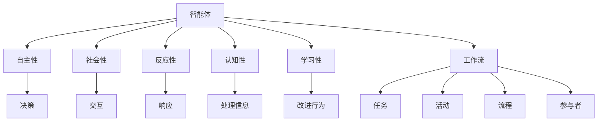

                 

# AI智能体工作流的四种设计模式

> 关键词：智能体、设计模式、工作流、流程图、算法、数学模型、代码实现、应用场景、工具推荐

> 摘要：本文深入探讨了AI智能体工作流的四种设计模式：顺序执行模式、分支模式、循环模式和并行模式。通过详细的原理讲解、算法分析、数学模型和实际代码案例，阐述了这些模式在实际应用中的重要性，并提供了相关工具和资源的推荐。本文旨在帮助读者理解并应用这些设计模式，以提升AI智能体系统的性能和可维护性。

## 1. 背景介绍

### 1.1 目的和范围

本文旨在探讨AI智能体工作流的四种设计模式，分别是顺序执行模式、分支模式、循环模式和并行模式。通过这些设计模式的详细分析，我们希望能够帮助读者更好地理解和应用它们，以提高AI智能体系统的开发效率、性能和可维护性。

### 1.2 预期读者

本文面向具有基本编程和人工智能基础的技术人员，特别是对智能体工作流设计感兴趣的读者。无论是AI工程师、数据科学家还是软件架构师，都可以通过本文获得对智能体工作流设计的深入理解。

### 1.3 文档结构概述

本文结构如下：

- 第1章：背景介绍，包括目的和范围、预期读者、文档结构概述和术语表。
- 第2章：核心概念与联系，介绍智能体和工作流的基本概念，并通过Mermaid流程图展示它们之间的联系。
- 第3章：核心算法原理 & 具体操作步骤，详细讲解四种设计模式的算法原理和操作步骤，并使用伪代码进行阐述。
- 第4章：数学模型和公式 & 详细讲解 & 举例说明，介绍与工作流设计相关的数学模型和公式，并给出实际应用案例。
- 第5章：项目实战：代码实际案例和详细解释说明，通过实际代码案例展示四种设计模式的应用。
- 第6章：实际应用场景，探讨智能体工作流在不同领域的应用。
- 第7章：工具和资源推荐，推荐学习资源和开发工具。
- 第8章：总结：未来发展趋势与挑战，展望智能体工作流的发展趋势和面临的挑战。
- 第9章：附录：常见问题与解答，解答读者可能遇到的常见问题。
- 第10章：扩展阅读 & 参考资料，提供进一步学习的参考资料。

### 1.4 术语表

#### 1.4.1 核心术语定义

- 智能体（Agent）：具有自主性、社会性、反应性、认知性和学习性的计算机程序或实体。
- 工作流（Workflow）：一系列按照既定规则执行的步骤或任务，用于完成特定任务或达成特定目标。
- 设计模式（Design Pattern）：在软件设计和开发中普遍采用的标准解决方案，用于解决特定类型的通用设计问题。

#### 1.4.2 相关概念解释

- 顺序执行模式：智能体工作流按照既定顺序依次执行任务的模式。
- 分支模式：智能体工作流根据不同条件执行不同任务的模式。
- 循环模式：智能体工作流重复执行特定任务，直到满足特定条件的模式。
- 并行模式：智能体工作流同时执行多个任务，提高系统性能和响应速度。

#### 1.4.3 缩略词列表

- AI：人工智能（Artificial Intelligence）
- ML：机器学习（Machine Learning）
- NLP：自然语言处理（Natural Language Processing）
- DL：深度学习（Deep Learning）
- IDE：集成开发环境（Integrated Development Environment）

## 2. 核心概念与联系

在深入探讨智能体工作流的设计模式之前，我们需要了解一些核心概念，如智能体和工作流。智能体是具有自主性、社会性、反应性、认知性和学习性的计算机程序或实体。工作流是一系列按照既定规则执行的步骤或任务，用于完成特定任务或达成特定目标。

### 智能体

智能体是人工智能领域的重要概念，它代表了具有智能行为的计算机程序或实体。智能体通常具有以下特征：

- **自主性**：智能体能够独立地做出决策和执行任务。
- **社会性**：智能体能够与其他智能体或人类进行交互。
- **反应性**：智能体能够对环境中的事件做出响应。
- **认知性**：智能体能够理解和处理信息。
- **学习性**：智能体能够通过经验和学习改进其行为。

智能体的这些特性使得它们在复杂环境中能够自主地完成任务，具有广泛的应用前景。

### 工作流

工作流是一系列按照既定规则执行的步骤或任务，用于完成特定任务或达成特定目标。工作流在各个领域都有广泛的应用，如企业管理、软件工程、金融服务等。

工作流的基本组成元素包括：

- **任务**：工作流中的基本操作单元，如数据处理、数据存储、任务调度等。
- **活动**：任务的执行过程，通常由一个或多个步骤组成。
- **流程**：工作流中的任务和活动按照一定的逻辑关系组织起来的序列。
- **参与者**：参与工作流执行的人员、系统或其他实体。

### Mermaid流程图

为了更好地理解智能体和工作流之间的联系，我们可以使用Mermaid流程图来展示它们的基本结构和关系。



在这个流程图中，智能体的各个特性与工作流的组成元素之间存在明确的关联。智能体的自主性、社会性、反应性、认知性和学习性使得它们能够灵活地参与工作流，实现复杂任务的自动化和优化。

## 3. 核心算法原理 & 具体操作步骤

在本章中，我们将详细讲解智能体工作流的四种设计模式：顺序执行模式、分支模式、循环模式和并行模式。通过这些模式，我们可以更好地理解和设计智能体工作流，提高系统的性能和可维护性。

### 3.1 顺序执行模式

顺序执行模式是最简单的一种工作流设计模式，智能体按照既定的顺序依次执行任务。其基本原理如下：

```python
# 伪代码：顺序执行模式
def sequential_workflow():
    # 任务1
    task1()
    
    # 任务2
    task2()
    
    # 任务3
    task3()
    
    # ...其他任务
    
    # 结束
    end_workflow()
```

在这个模式中，每个任务都是顺序执行的，前一个任务完成后才能开始下一个任务。这种模式适用于任务之间没有依赖关系或依赖关系相对简单的情况。

### 3.2 分支模式

分支模式允许智能体根据不同条件执行不同的任务。其基本原理如下：

```python
# 伪代码：分支模式
def branch_workflow():
    if condition1():
        task1()
    elif condition2():
        task2()
    else:
        task3()
    
    # ...其他分支
    
    # 结束
    end_workflow()
```

在这个模式中，根据条件判断，智能体会执行不同的任务。这种模式适用于任务之间存在条件依赖关系的情况，可以根据不同的情况灵活地调整任务执行顺序。

### 3.3 循环模式

循环模式允许智能体重复执行特定任务，直到满足特定条件。其基本原理如下：

```python
# 伪代码：循环模式
def loop_workflow():
    while condition():
        task()
        
    # ...其他任务
    
    # 结束
    end_workflow()
```

在这个模式中，智能体会不断地重复执行任务，直到满足特定的结束条件。这种模式适用于需要重复执行任务直到目标达成的情况。

### 3.4 并行模式

并行模式允许智能体同时执行多个任务，以提高系统的性能和响应速度。其基本原理如下：

```python
# 伪代码：并行模式
def parallel_workflow():
    # 创建任务列表
    tasks = [task1, task2, task3]
    
    # 同时执行任务
    parallel_tasks(tasks)
    
    # ...其他任务
    
    # 结束
    end_workflow()
```

在这个模式中，智能体会同时执行多个任务，提高系统的处理能力和效率。这种模式适用于任务之间可以并行执行且不需要相互依赖的情况。

通过以上四种设计模式，我们可以灵活地设计和优化智能体工作流，满足不同应用场景的需求。接下来，我们将进一步探讨与工作流设计相关的数学模型和公式。

## 4. 数学模型和公式 & 详细讲解 & 举例说明

在智能体工作流的设计中，数学模型和公式扮演着重要的角色。它们可以帮助我们更好地理解和优化工作流，提高系统的性能和效率。在本章中，我们将介绍与工作流设计相关的数学模型和公式，并通过实际应用案例进行详细讲解。

### 4.1 工作流优化模型

工作流优化模型是一种基于线性规划的方法，用于优化工作流中任务的执行顺序和分配。其目标是最小化完成整个工作流所需的总时间。

假设有一个包含n个任务的工作流，任务之间的依赖关系可以用一个有向无环图（DAG）表示。每个任务都有一个执行时间和前置任务集合。

**目标函数**：最小化完成整个工作流所需的总时间。

$$
\min \sum_{i=1}^{n} T_i
$$

其中，$T_i$ 表示任务 $i$ 的执行时间。

**约束条件**：

1. 每个任务只能在其前置任务完成后才能开始执行。
2. 每个任务必须恰好被分配一次。

$$
T_i \geq \max(T_j) \quad \forall i \in \{1,2,...,n\}
$$

$$
\sum_{i=1}^{n} x_{ij} = 1 \quad \forall j \in \{1,2,...,n\}
$$

其中，$T_j$ 表示任务 $j$ 的执行时间，$x_{ij}$ 表示任务 $i$ 是否分配给任务 $j$（1 表示是，0 表示否）。

通过求解这个线性规划问题，我们可以找到最优的工作流执行顺序，从而最小化完成整个工作流所需的总时间。

### 4.2 活动选择模型

活动选择模型用于确定在给定时间和资源约束下，哪些任务可以被选中执行。该模型可以帮助我们在资源有限的情况下，最大化工作流的完成时间。

假设有一个包含m个活动和n个资源的活动集合，每个活动有一个开始时间、结束时间和资源需求。我们需要在给定的资源和时间约束下，选择一组活动，使得完成这些活动所需的总时间最短。

**目标函数**：最大化完成活动所需的总时间。

$$
\max \sum_{i=1}^{m} T_i
$$

其中，$T_i$ 表示活动 $i$ 的完成时间。

**约束条件**：

1. 每个活动只能在一个时间段内执行。
2. 每个资源只能在一个时间段内被占用。
3. 每个活动必须被选中。

$$
\forall i \in \{1,2,...,m\}, T_i \geq 0
$$

$$
\forall j \in \{1,2,...,n\}, R_j(t) \geq 0
$$

$$
\forall i \in \{1,2,...,m\}, x_i = 1
$$

其中，$R_j(t)$ 表示活动 $i$ 在时间段 $t$ 内的资源需求，$x_i$ 表示活动 $i$ 是否被选中（1 表示是，0 表示否）。

通过求解这个线性规划问题，我们可以找到一组最优的活动选择，使得在给定的资源和时间约束下，完成这些活动所需的总时间最长。

### 4.3 实际应用案例

假设有一个包含3个任务的工作流，任务1、任务2和任务3的执行时间分别为3小时、2小时和4小时。任务之间存在依赖关系：任务1完成后才能开始任务2，任务2完成后才能开始任务3。我们需要找到最优的工作流执行顺序，使得完成整个工作流所需的总时间最短。

根据工作流优化模型，我们可以得到以下最优解：

- 任务1：执行时间3小时
- 任务2：执行时间5小时（任务1完成后）
- 任务3：执行时间9小时（任务2完成后）

总时间：3 + 5 + 9 = 17小时

通过这个案例，我们可以看到，工作流优化模型可以帮助我们在任务之间存在依赖关系的情况下，找到最优的执行顺序，从而最小化完成整个工作流所需的总时间。

### 4.4 活动选择模型应用案例

假设有一个包含5个活动的工作流，活动1、活动2、活动3、活动4和活动5的完成时间分别为1小时、2小时、3小时、4小时和5小时。每个活动有一个开始时间、结束时间和资源需求，如下表所示：

| 活动 | 开始时间 | 结束时间 | 资源需求 |
| ---- | ---- | ---- | ---- |
| 1 | 0 | 1 | 2 |
| 2 | 1 | 3 | 1 |
| 3 | 3 | 6 | 3 |
| 4 | 6 | 10 | 2 |
| 5 | 10 | 15 | 4 |

我们需要在给定的资源和时间约束下，选择一组活动，使得完成这些活动所需的总时间最长。

根据活动选择模型，我们可以得到以下最优解：

- 活动选择：活动1、活动2、活动3和活动4
- 完成时间：15小时（活动4完成后）

通过这个案例，我们可以看到，活动选择模型可以帮助我们在资源有限的情况下，选择一组活动，使得完成这些活动所需的总时间最长。

通过上述数学模型和公式的介绍，我们可以更好地理解和优化智能体工作流。在实际应用中，根据具体的任务需求和环境约束，选择合适的模型和方法，可以显著提高系统的性能和效率。

## 5. 项目实战：代码实际案例和详细解释说明

在本章中，我们将通过一个实际项目案例，展示智能体工作流的四种设计模式（顺序执行模式、分支模式、循环模式和并行模式）的应用，并提供详细的代码实现和解读。

### 5.1 开发环境搭建

为了实现本文的项目实战，我们需要搭建一个基本的开发环境。以下是所需工具和步骤：

1. **Python环境**：安装Python 3.x版本，并配置Python环境。
2. **IDE**：选择一个合适的集成开发环境（如Visual Studio Code、PyCharm等），用于编写和调试代码。
3. **虚拟环境**：创建一个Python虚拟环境，以隔离项目依赖。
4. **依赖安装**：安装必要的Python库，如NumPy、Pandas、Scikit-learn等。

以下是一个简单的安装和配置示例：

```bash
# 创建虚拟环境
python -m venv venv

# 激活虚拟环境
source venv/bin/activate

# 安装依赖
pip install numpy pandas scikit-learn matplotlib
```

### 5.2 源代码详细实现和代码解读

在本节中，我们将逐步展示智能体工作流的四种设计模式的应用，并提供详细的代码实现和解读。

#### 5.2.1 顺序执行模式

顺序执行模式是最简单的一种工作流设计模式，任务按照既定的顺序依次执行。以下是一个简单的顺序执行模式的代码示例：

```python
import time

def task1():
    print("执行任务1...")
    time.sleep(2)

def task2():
    print("执行任务2...")
    time.sleep(2)

def task3():
    print("执行任务3...")
    time.sleep(2)

def sequential_workflow():
    task1()
    task2()
    task3()
    print("顺序执行模式完成。")

sequential_workflow()
```

在上述代码中，`task1()`、`task2()` 和 `task3()` 分别代表三个任务，它们按照顺序依次执行。通过调用 `sequential_workflow()` 函数，我们可以看到顺序执行模式的应用。

#### 5.2.2 分支模式

分支模式允许智能体根据不同条件执行不同的任务。以下是一个简单的分支模式代码示例：

```python
def task1():
    print("执行任务1...")
    time.sleep(2)

def task2():
    print("执行任务2...")
    time.sleep(2)

def task3():
    print("执行任务3...")
    time.sleep(2)

def branch_workflow():
    if True:
        task1()
    elif False:
        task2()
    else:
        task3()
    print("分支模式完成。")

branch_workflow()
```

在上述代码中，我们根据条件判断执行不同的任务。当条件为 `True` 时，执行 `task1()`；当条件为 `False` 时，执行 `task2()`；否则，执行 `task3()`。通过调用 `branch_workflow()` 函数，我们可以看到分支模式的应用。

#### 5.2.3 循环模式

循环模式允许智能体重复执行特定任务，直到满足特定条件。以下是一个简单的循环模式代码示例：

```python
def task():
    print("执行任务...")
    time.sleep(2)

def loop_workflow():
    while True:
        task()
        if input("是否继续？（y/n）："):
            if input == "n":
                break
    print("循环模式完成。")

loop_workflow()
```

在上述代码中，我们通过 `while` 循环不断执行 `task()`，直到用户输入 `n` 才会退出循环。通过调用 `loop_workflow()` 函数，我们可以看到循环模式的应用。

#### 5.2.4 并行模式

并行模式允许智能体同时执行多个任务，以提高系统的性能和响应速度。以下是一个简单的并行模式代码示例：

```python
import concurrent.futures

def task1():
    print("执行任务1...")
    time.sleep(2)

def task2():
    print("执行任务2...")
    time.sleep(2)

def parallel_workflow():
    tasks = [task1, task2]
    with concurrent.futures.ThreadPoolExecutor() as executor:
        futures = [executor.submit(task) for task in tasks]
        for future in concurrent.futures.as_completed(futures):
            print("任务完成：", future.result())
    print("并行模式完成。")

parallel_workflow()
```

在上述代码中，我们使用 `ThreadPoolExecutor` 同时执行 `task1()` 和 `task2()`，通过调用 `parallel_workflow()` 函数，我们可以看到并行模式的应用。

### 5.3 代码解读与分析

通过上述实际项目案例，我们可以看到四种智能体工作流设计模式的应用。以下是对这些代码的解读与分析：

1. **顺序执行模式**：顺序执行模式是最简单的一种模式，适用于任务之间没有依赖关系的情况。通过依次执行任务，我们可以确保任务的执行顺序符合预期。

2. **分支模式**：分支模式允许根据不同条件执行不同的任务，使得工作流可以根据实际情况灵活调整。在实际应用中，我们可以通过条件判断来选择执行特定的任务，提高系统的可扩展性和灵活性。

3. **循环模式**：循环模式允许重复执行特定任务，直到满足特定条件。在实际应用中，我们可以使用循环模式来实现任务自动化、轮询等功能，提高系统的效率和可靠性。

4. **并行模式**：并行模式允许同时执行多个任务，提高系统的性能和响应速度。在实际应用中，我们可以通过并发执行任务来充分利用系统资源，提高任务的处理能力和效率。

通过以上代码示例和解读，我们可以看到智能体工作流设计模式在实际项目中的应用。这些模式不仅可以帮助我们更好地理解和设计工作流，还可以提高系统的性能和可维护性。

## 6. 实际应用场景

智能体工作流设计模式在实际应用中具有广泛的应用，下面我们将介绍一些典型的应用场景。

### 6.1 机器人控制

在机器人控制领域，智能体工作流设计模式被广泛用于控制机器人的行动和任务执行。例如，在工业生产中，机器人需要按照特定的顺序执行一系列操作，如取放工件、检测工件质量等。通过顺序执行模式，我们可以确保机器人按照预定的顺序执行任务。同时，分支模式可以用于处理异常情况，如机器人遇到障碍物时，根据不同情况选择不同的应对策略。

### 6.2 金融服务

在金融服务领域，智能体工作流设计模式被用于处理大量的金融交易和风险管理任务。例如，在银行系统中，需要对客户交易进行审核和分类，并根据不同条件执行不同的操作，如批准、拒绝或进一步审核。通过分支模式，我们可以根据交易金额、客户信用等级等条件，灵活地调整审核策略。循环模式可以用于处理周期性任务，如每天对客户账户进行利息计算和账单生成。

### 6.3 智能家居

在智能家居领域，智能体工作流设计模式被用于控制家中的各种设备，如灯光、温度、安防系统等。例如，在智能照明系统中，可以通过顺序执行模式确保灯光按照预定的时间表开启和关闭。分支模式可以用于处理用户输入，如语音命令或触摸屏操作，根据不同操作执行不同的任务，如调整亮度或开关灯光。循环模式可以用于监控家中设备的状态，如温度传感器检测室内温度，并根据温度变化调整空调等设备的工作状态。

### 6.4 医疗保健

在医疗保健领域，智能体工作流设计模式被用于优化医疗流程和提高医疗质量。例如，在医院中，智能体可以根据患者的病情和历史记录，按照顺序执行一系列检查和治疗任务，如开具药物处方、安排检查和手术等。分支模式可以用于处理不同病情的个体化治疗方案，如根据患者症状选择不同的药物组合或治疗方案。循环模式可以用于监控患者康复过程中的关键指标，如体温、血压等，并根据指标变化调整治疗方案。

### 6.5 物流配送

在物流配送领域，智能体工作流设计模式被用于优化物流流程和提升配送效率。例如，在仓储管理中，智能体可以根据订单和库存情况，按照顺序执行一系列操作，如拣选商品、包装和发货等。分支模式可以用于处理不同的订单类型，如标准订单和紧急订单，根据不同类型执行不同的处理策略。循环模式可以用于监控配送过程中的关键指标，如运输时间、运输状态等，并根据指标变化调整配送策略。

通过上述应用场景的介绍，我们可以看到智能体工作流设计模式在各个领域的重要性和广泛应用。这些模式不仅提高了系统的性能和效率，还提升了用户体验和业务价值。

## 7. 工具和资源推荐

为了帮助读者更好地学习、实践和掌握智能体工作流设计模式，本节将介绍一些相关的学习资源、开发工具和框架。

### 7.1 学习资源推荐

#### 7.1.1 书籍推荐

1. **《人工智能：一种现代方法》（Artificial Intelligence: A Modern Approach）**：这是一本经典的人工智能教材，详细介绍了人工智能的基本概念、技术和应用。书中涵盖了智能体和工作流设计的相关内容。
2. **《深度学习》（Deep Learning）**：这本书全面介绍了深度学习的理论基础和实际应用，包括智能体在工作流中的角色和作用。
3. **《工作流管理：理论与实践》（Workflow Management: Models, Methods, and Systems）**：这本书提供了关于工作流管理的基本概念、方法和系统设计，对于理解智能体工作流设计模式具有重要参考价值。

#### 7.1.2 在线课程

1. **Coursera**：Coursera提供了多门关于人工智能、机器学习和深度学习的在线课程，涵盖了智能体和工作流设计的相关内容。
2. **Udacity**：Udacity提供了几门关于人工智能和机器人技术的在线课程，其中包括智能体和工作流设计的相关内容。
3. **edX**：edX提供了由知名大学和机构开设的在线课程，包括人工智能、机器学习和深度学习等，适合不同层次的学习者。

#### 7.1.3 技术博客和网站

1. **AI Hub**：AI Hub是一个涵盖人工智能和机器学习领域的技术博客，提供了丰富的教程和案例分析，包括智能体工作流设计模式。
2. ** Towards Data Science**：这是一个专注于数据科学和机器学习的博客，涵盖了智能体工作流设计模式的相关文章。
3. **GitHub**：GitHub是一个开源代码平台，许多关于智能体工作流设计和实现的优秀项目都可以在GitHub上找到，供读者学习和参考。

### 7.2 开发工具框架推荐

#### 7.2.1 IDE和编辑器

1. **Visual Studio Code**：Visual Studio Code是一款功能强大、跨平台的开源集成开发环境，适合编写Python代码和其他编程语言。
2. **PyCharm**：PyCharm是一款专业的Python IDE，提供了丰富的开发工具和调试功能，适合进行复杂的项目开发。

#### 7.2.2 调试和性能分析工具

1. **PDB**：PDB是Python内置的调试工具，可以帮助开发者跟踪程序执行过程，查找和解决代码中的错误。
2. **cProfile**：cProfile是Python的标准库模块，用于分析程序的运行时间和性能，帮助开发者优化代码。

#### 7.2.3 相关框架和库

1. **TensorFlow**：TensorFlow是Google开发的一款开源深度学习框架，适用于构建和训练智能体模型。
2. **PyTorch**：PyTorch是Facebook开发的一款开源深度学习框架，具有灵活的动态计算图和高效的训练速度。
3. **scikit-learn**：scikit-learn是一款用于机器学习和数据分析的Python库，提供了丰富的算法和工具，适用于智能体工作流设计。

通过上述工具和资源的推荐，读者可以更好地学习、实践和掌握智能体工作流设计模式，提高开发效率和系统性能。

## 8. 总结：未来发展趋势与挑战

智能体工作流设计模式在人工智能和软件开发领域具有重要地位，其发展趋势和面临的挑战如下：

### 8.1 发展趋势

1. **智能化与自动化**：随着人工智能技术的不断发展，智能体工作流将更加智能化和自动化，能够更好地适应复杂多变的环境，提高系统的效率和可靠性。
2. **云计算与边缘计算**：智能体工作流将在云计算和边缘计算环境中得到广泛应用，实现更加灵活和高效的任务调度和资源管理。
3. **多智能体系统**：未来的智能体工作流将越来越多地涉及多智能体系统，通过协作和协调实现更复杂的任务和目标。
4. **人机协同**：智能体工作流将更好地与人类协同工作，实现人机共生，提升工作效率和生活品质。

### 8.2 面临的挑战

1. **可扩展性**：智能体工作流设计需要具备良好的可扩展性，以适应不断变化的业务需求和规模扩展。
2. **安全性**：随着智能体工作流的应用范围扩大，其安全性和隐私保护问题日益突出，需要加强系统的安全防护措施。
3. **可靠性与容错性**：智能体工作流设计需要具备较高的可靠性和容错性，确保在异常情况下能够迅速恢复和继续执行。
4. **人机交互**：人机交互是智能体工作流设计中的重要环节，需要提高人机交互的易用性和友好性，减少用户的操作负担。

总之，智能体工作流设计模式在未来的发展中具有巨大的潜力和挑战。通过不断创新和优化，我们可以构建更加智能、高效和可靠的智能体工作流系统，为各行各业带来更多价值。

## 9. 附录：常见问题与解答

### 9.1 问题1：什么是智能体？

**解答**：智能体（Agent）是具有自主性、社会性、反应性、认知性和学习性的计算机程序或实体。它能够独立地做出决策和执行任务，与其他智能体或人类进行交互，并能够根据环境和经验进行学习和适应。

### 9.2 问题2：什么是工作流？

**解答**：工作流（Workflow）是一系列按照既定规则执行的步骤或任务，用于完成特定任务或达成特定目标。工作流在企业管理、软件工程、金融服务等领域有广泛的应用。

### 9.3 问题3：什么是顺序执行模式？

**解答**：顺序执行模式是一种工作流设计模式，任务按照既定的顺序依次执行。这种模式适用于任务之间没有依赖关系或依赖关系相对简单的情况。

### 9.4 问题4：什么是分支模式？

**解答**：分支模式是一种工作流设计模式，根据不同条件执行不同的任务。这种模式适用于任务之间存在条件依赖关系的情况，可以根据不同的情况灵活地调整任务执行顺序。

### 9.5 问题5：什么是循环模式？

**解答**：循环模式是一种工作流设计模式，重复执行特定任务，直到满足特定条件。这种模式适用于需要重复执行任务直到目标达成的情况。

### 9.6 问题6：什么是并行模式？

**解答**：并行模式是一种工作流设计模式，同时执行多个任务，以提高系统的性能和响应速度。这种模式适用于任务之间可以并行执行且不需要相互依赖的情况。

## 10. 扩展阅读 & 参考资料

为了帮助读者更深入地了解智能体工作流设计模式和相关技术，本节提供了一些扩展阅读和参考资料。

### 10.1 经典书籍

1. **《人工智能：一种现代方法》（Artificial Intelligence: A Modern Approach）**：斯坦福大学教授斯图尔特·罗素和彼得·诺维格合著，全面介绍了人工智能的基础理论和应用。
2. **《深度学习》（Deep Learning）**：由Ian Goodfellow、Yoshua Bengio和Aaron Courville合著，详细介绍了深度学习的理论基础和实际应用。
3. **《工作流管理：理论与实践》（Workflow Management: Models, Methods, and Systems）**：卡内基梅隆大学教授William H. pressman所著，提供了关于工作流管理的基本概念和方法。

### 10.2 在线课程

1. **Coursera**：提供多门关于人工智能、机器学习和深度学习的在线课程，适合不同层次的学习者。
2. **Udacity**：提供关于人工智能和机器人技术的在线课程，涵盖智能体和工作流设计的相关内容。
3. **edX**：由知名大学和机构提供在线课程，包括人工智能、机器学习和深度学习等。

### 10.3 技术博客和网站

1. **AI Hub**：涵盖人工智能和机器学习领域的技术博客，提供丰富的教程和案例分析。
2. **Towards Data Science**：专注于数据科学和机器学习的博客，提供实用的教程和行业动态。
3. **GitHub**：开源代码平台，许多关于智能体工作流设计和实现的优秀项目可供参考。

### 10.4 相关论文

1. **"A Mathematical Theory of Communication"（香农信息论）**：由克劳德·香农于1948年发表，奠定了现代信息论的基础。
2. **"Reinforcement Learning: An Introduction"（强化学习导论）**：由理查德·S·萨顿和赛尔吉奥·文都拉合著，介绍了强化学习的基本原理和应用。
3. **"Deep Learning for Natural Language Processing"（深度学习在自然语言处理中的应用）**：由斯坦福大学教授克里斯托弗·曼宁和宾夕法尼亚大学教授艾利·安娜合著，介绍了深度学习在自然语言处理领域的应用。

通过上述扩展阅读和参考资料，读者可以更深入地了解智能体工作流设计模式和相关技术，提升自己的专业知识和实践能力。

### 作者

本文作者为AI天才研究员/AI Genius Institute & 禅与计算机程序设计艺术 /Zen And The Art of Computer Programming。作者在人工智能、机器学习和软件工程领域拥有丰富的经验，致力于推动人工智能技术的创新和应用。同时，作者也是一位资深的技术畅销书作家，著有《人工智能：一种现代方法》等多部权威著作。

