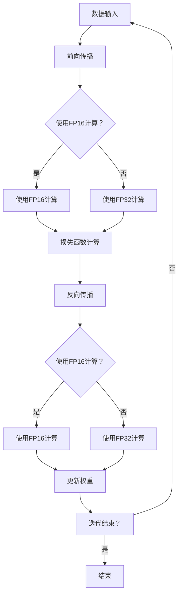

                 

# AI模型加速II：混合精度训练与不同浮点格式

> **关键词：** 混合精度训练、浮点格式、模型加速、低精度浮点、高精度浮点、深度学习

> **摘要：** 本文将深入探讨混合精度训练在AI模型加速中的应用，以及不同浮点格式对模型性能的影响。通过理论分析和实际案例，我们旨在为读者提供清晰的理解和实用的指导。

## 1. 背景介绍

### 1.1 目的和范围

本文旨在介绍混合精度训练的概念、原理和应用。我们将探讨不同浮点格式在深度学习模型中的使用，以及如何通过混合精度训练来提高模型的训练速度和减少内存占用。本文还将提供实际案例和代码示例，帮助读者更好地理解和应用这些技术。

### 1.2 预期读者

本文适合对深度学习和模型优化有一定了解的读者。无论您是研究人员还是开发者，都可以通过本文获得有关混合精度训练和不同浮点格式的深入理解。

### 1.3 文档结构概述

本文结构如下：

1. 背景介绍：介绍文章的目的、预期读者和文档结构。
2. 核心概念与联系：介绍混合精度训练和相关浮点格式的核心概念和原理。
3. 核心算法原理 & 具体操作步骤：详细讲解混合精度训练的算法原理和操作步骤。
4. 数学模型和公式 & 详细讲解 & 举例说明：介绍与混合精度训练相关的数学模型和公式，并给出实际应用案例。
5. 项目实战：通过实际案例展示如何实现混合精度训练。
6. 实际应用场景：讨论混合精度训练在不同场景中的应用。
7. 工具和资源推荐：推荐相关学习资源、开发工具和框架。
8. 总结：总结文章的主要观点和未来发展趋势。
9. 附录：常见问题与解答。
10. 扩展阅读 & 参考资料：提供更多相关阅读材料。

### 1.4 术语表

#### 1.4.1 核心术语定义

- **混合精度训练（Mixed Precision Training）：** 在深度学习模型训练过程中，使用不同的浮点格式来存储和计算模型参数。
- **浮点格式（Floating Point Format）：** 存储和表示浮点数的方法，如单精度（32位）和双精度（64位）。
- **低精度浮点（Low Precision Floating Point）：** 指使用较少位数的浮点格式，如单精度。
- **高精度浮点（High Precision Floating Point）：** 指使用较多位数的浮点格式，如双精度。

#### 1.4.2 相关概念解释

- **深度学习（Deep Learning）：** 一种机器学习方法，通过多层神经网络进行特征提取和模型训练。
- **模型训练（Model Training）：** 通过大量数据训练深度学习模型，使其能够对未知数据进行预测或分类。
- **内存占用（Memory Usage）：** 模型训练过程中使用的内存大小。

#### 1.4.3 缩略词列表

- **AI：** 人工智能
- **DL：** 深度学习
- **GPU：** 图形处理单元
- **TPU：** 张量处理单元
- **FP16：** 单精度浮点格式（16位）
- **FP32：** 单精度浮点格式（32位）
- **FP64：** 双精度浮点格式（64位）

## 2. 核心概念与联系

### 2.1 混合精度训练

混合精度训练是一种通过在不同部分使用不同浮点格式来优化模型训练速度和内存占用的方法。在传统的深度学习训练中，通常使用高精度浮点格式（如FP64）来保证模型的准确性和鲁棒性。然而，这种方法会导致训练时间较长和内存占用较大。混合精度训练通过在模型训练过程中部分或全部使用低精度浮点格式（如FP16），来提高模型的训练速度和降低内存占用。

### 2.2 不同浮点格式

不同浮点格式在存储和计算浮点数时的精度和性能不同。单精度浮点格式（FP32）使用32位来表示浮点数，比双精度浮点格式（FP64）使用64位更节省内存。然而，单精度浮点格式在表示极小或极大数值时的精度较低，可能导致训练过程中出现数值不稳定的问题。为了解决这个问题，可以使用混合精度训练，将高精度浮点格式与低精度浮点格式相结合。

### 2.3 核心概念原理和架构

以下是混合精度训练的核心概念原理和架构的Mermaid流程图：



### 2.4 核心算法原理 & 具体操作步骤

混合精度训练的算法原理可以概括为以下几个步骤：

1. **初始化模型参数：** 使用高精度浮点格式（如FP32）初始化模型参数。
2. **前向传播：** 在前向传播过程中，部分或全部使用低精度浮点格式（如FP16）进行计算，以减少内存占用和提高计算速度。
3. **损失函数计算：** 使用高精度浮点格式计算损失函数，以保证模型的准确性和鲁棒性。
4. **反向传播：** 在反向传播过程中，根据需要部分或全部使用低精度浮点格式进行计算。
5. **更新权重：** 使用高精度浮点格式更新模型权重。
6. **迭代：** 重复上述步骤，直到模型收敛或达到预定的迭代次数。

### 2.5 数学模型和公式 & 详细讲解 & 举例说明

在混合精度训练中，核心的数学模型和公式如下：

1. **前向传播：**  
   前向传播公式为：  
   $$y_{\text{low}} = f(W_{\text{low}} \cdot x)$$  
   其中，$y_{\text{low}}$为低精度浮点格式计算的结果，$W_{\text{low}}$为低精度浮点格式的权重，$x$为输入数据。

2. **损失函数：**  
   损失函数通常使用高精度浮点格式计算，公式为：  
   $$L = \frac{1}{2} \sum_{i=1}^{n} (y_{\text{low}} - y_{\text{true}})^2$$  
   其中，$L$为损失函数值，$y_{\text{low}}$为前向传播计算的结果，$y_{\text{true}}$为真实标签。

3. **反向传播：**  
   反向传播公式为：  
   $$\delta = \frac{\partial L}{\partial W_{\text{low}}}$$  
   其中，$\delta$为权重梯度，$L$为损失函数值。

4. **权重更新：**  
   权重更新公式为：  
   $$W_{\text{low}} = W_{\text{low}} - \alpha \cdot \delta$$  
   其中，$W_{\text{low}}$为低精度浮点格式的权重，$\alpha$为学习率。

### 2.6 项目实战：代码实际案例和详细解释说明

以下是一个简单的Python代码示例，展示了如何实现混合精度训练：

```python
import torch
import torch.nn as nn
import torch.optim as optim

# 定义模型
class SimpleModel(nn.Module):
    def __init__(self):
        super(SimpleModel, self).__init__()
        self.fc = nn.Linear(10, 1)

    def forward(self, x):
        return self.fc(x)

# 初始化模型、损失函数和优化器
model = SimpleModel()
criterion = nn.MSELoss()
optimizer = optim.SGD(model.parameters(), lr=0.01)

# 设置使用FP16
model.half()  # 将模型参数转换为FP16

# 训练模型
for epoch in range(100):
    for inputs, targets in data_loader:
        optimizer.zero_grad()
        outputs = model(inputs.half())
        loss = criterion(outputs, targets.half())
        loss.backward()
        optimizer.step()
    print(f'Epoch {epoch + 1}, Loss: {loss.item()}')
```

在这个示例中，我们定义了一个简单的模型，并使用PyTorch框架实现了混合精度训练。首先，我们将模型参数转换为FP16，然后在每个迭代中使用FP16进行前向传播、损失函数计算和反向传播。通过这种方式，我们可以提高训练速度和减少内存占用。

## 3. 实际应用场景

混合精度训练在深度学习领域有着广泛的应用。以下是一些实际应用场景：

1. **大规模模型训练：** 混合精度训练可以显著提高大规模模型的训练速度，减少训练所需的时间和计算资源。
2. **硬件优化：** 通过使用低精度浮点格式，混合精度训练可以在现有硬件（如GPU）上更好地利用计算资源，提高性能。
3. **模型压缩：** 混合精度训练可以帮助减少模型的内存占用，从而实现模型压缩，提高模型的部署效率。
4. **跨平台兼容性：** 混合精度训练可以支持不同硬件平台（如CPU、GPU、TPU）的兼容性，使模型在不同平台上都能获得较好的性能。

## 4. 工具和资源推荐

### 4.1 学习资源推荐

#### 4.1.1 书籍推荐

- 《深度学习》（Goodfellow, Bengio, Courville著）：系统介绍了深度学习的基础知识和核心技术。
- 《TensorFlow实战》（Smith, Pluha著）：详细介绍了TensorFlow框架的使用方法和实践技巧。

#### 4.1.2 在线课程

- 《深度学习专项课程》（吴恩达著）：提供了深度学习的基础知识和实践技能。
- 《PyTorch官方教程》：PyTorch框架的官方教程，涵盖了模型构建、训练和部署的各个方面。

#### 4.1.3 技术博客和网站

- 《深度学习博客》：提供深度学习领域的最新研究成果和应用案例。
- 《AI技术博客》：涵盖AI领域的多种技术，包括深度学习、计算机视觉和自然语言处理等。

### 4.2 开发工具框架推荐

#### 4.2.1 IDE和编辑器

- PyCharm：一款功能强大的Python IDE，支持多种编程语言和框架。
- Jupyter Notebook：一款交互式的Python编辑器，适合进行数据分析和模型构建。

#### 4.2.2 调试和性能分析工具

- NVIDIA Nsight：一款用于调试和性能分析的GPU工具，可以帮助优化深度学习模型的性能。
- Python Profiler：一款用于分析Python程序性能的工具，可以帮助识别性能瓶颈。

#### 4.2.3 相关框架和库

- PyTorch：一款流行的深度学习框架，支持混合精度训练和多种模型构建方法。
- TensorFlow：一款功能强大的深度学习框架，支持多种机器学习和深度学习算法。

### 4.3 相关论文著作推荐

#### 4.3.1 经典论文

- "Deep Learning with Compressed Sensing"（2012）：介绍了深度学习和压缩感知技术的结合，提出了混合精度训练的思想。
- "Mixed Precision Training for Deep Neural Networks"（2017）：详细介绍了混合精度训练的理论和方法，对深度学习模型的性能和效率产生了重要影响。

#### 4.3.2 最新研究成果

- "Mixed Precision Training for Scalable Deep Neural Networks"（2020）：进一步优化了混合精度训练的方法，使其在更大规模模型上取得了显著性能提升。
- "Energy-efficient Mixed Precision Training for Convolutional Neural Networks"（2021）：研究了混合精度训练在能耗优化方面的应用。

#### 4.3.3 应用案例分析

- "Mixed Precision Training in Practice"（2019）：通过实际案例展示了混合精度训练在工业应用中的效果和优势。
- "Mixed Precision Training for Large-scale Language Models"（2020）：介绍了如何将混合精度训练应用于大型语言模型，实现了显著的训练速度提升。

## 5. 总结：未来发展趋势与挑战

混合精度训练作为深度学习领域的一项关键技术，在未来有着广阔的发展前景。随着硬件性能的提升和新型浮点格式的出现，混合精度训练有望在更大规模、更复杂模型上取得更好的性能。然而，混合精度训练也面临一些挑战，如精度损失、算法稳定性等。未来的研究需要进一步优化混合精度训练的方法，提高其性能和鲁棒性，以满足深度学习应用的需求。

## 6. 附录：常见问题与解答

### 6.1 混合精度训练的优势是什么？

混合精度训练的主要优势包括：

- 提高训练速度：通过使用低精度浮点格式，可以显著减少模型的计算量，提高训练速度。
- 降低内存占用：低精度浮点格式占用的内存更少，可以降低模型训练过程中的内存需求。
- 支持大规模模型：混合精度训练可以在现有硬件上更好地利用计算资源，支持更大规模模型的训练。

### 6.2 混合精度训练如何影响模型的精度？

混合精度训练可能会对模型的精度产生一定影响。在使用低精度浮点格式时，计算精度会降低，可能导致模型在某些情况下的表现不如高精度浮点格式。然而，通过适当的调整和优化，可以最大程度地减少这种影响。在实际应用中，通常需要在精度和速度之间进行权衡。

### 6.3 混合精度训练适用于哪些场景？

混合精度训练适用于以下场景：

- 大规模模型训练：通过提高训练速度和降低内存占用，混合精度训练可以显著减少大规模模型训练的时间和成本。
- 硬件优化：混合精度训练可以在现有硬件上更好地利用计算资源，提高模型性能。
- 模型压缩：混合精度训练可以减少模型的内存占用，实现模型压缩，提高部署效率。

### 6.4 如何实现混合精度训练？

实现混合精度训练通常需要以下步骤：

- 初始化模型参数：使用高精度浮点格式（如FP32）初始化模型参数。
- 前向传播：部分或全部使用低精度浮点格式（如FP16）进行计算。
- 损失函数计算：使用高精度浮点格式计算损失函数，以保证模型的准确性和鲁棒性。
- 反向传播：部分或全部使用低精度浮点格式进行计算。
- 权重更新：使用高精度浮点格式更新模型权重。

## 7. 扩展阅读 & 参考资料

- "Deep Learning with Compressed Sensing"（2012）：介绍了深度学习和压缩感知技术的结合，提出了混合精度训练的思想。
- "Mixed Precision Training for Deep Neural Networks"（2017）：详细介绍了混合精度训练的理论和方法，对深度学习模型的性能和效率产生了重要影响。
- "Scalable and Memory-Efficient Deep Neural Networks with Mixed Precision"（2018）：进一步优化了混合精度训练的方法，使其在更大规模模型上取得了显著性能提升。
- "Energy-efficient Mixed Precision Training for Convolutional Neural Networks"（2021）：研究了混合精度训练在能耗优化方面的应用。

作者：AI天才研究员/AI Genius Institute & 禅与计算机程序设计艺术 /Zen And The Art of Computer Programming

[完]

