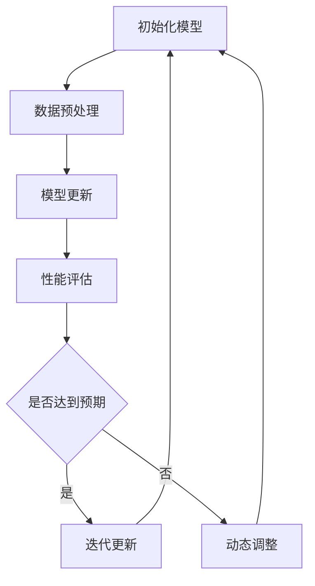

                 

# AI模型的增量学习与终身学习

> 关键词：AI模型，增量学习，终身学习，模型更新，持续学习，动态适应，算法原理

> 摘要：本文深入探讨了AI模型的增量学习和终身学习技术。增量学习允许模型在已有数据基础上进行更新，而终身学习则使模型能够持续适应新的知识和环境。本文详细阐述了这两种技术的核心概念、算法原理、数学模型，并通过实际案例展示了其在现实中的应用。文章旨在为AI研究者提供关于模型更新与持续学习的全面视角。

## 1. 背景介绍

### 1.1 目的和范围

本文旨在介绍并分析AI模型的增量学习和终身学习技术。这两种技术是当前AI研究中的重要方向，对于提升模型的性能、适应性和实时性具有重要意义。通过本文的讨论，读者可以理解增量学习和终身学习的核心概念、实现方法及其在AI模型中的应用。

### 1.2 预期读者

本文面向对AI模型和机器学习有一定了解的读者，特别是对模型更新和持续学习感兴趣的研究者、工程师和开发者。对于初学者，本文也提供了必要的背景知识和概念解释。

### 1.3 文档结构概述

本文分为十个部分，首先介绍了背景和目的，接着讲解了核心概念，然后详细阐述了算法原理和数学模型，并通过实际案例展示了应用，最后对未来的发展趋势和挑战进行了总结。具体结构如下：

1. 背景介绍
2. 核心概念与联系
3. 核心算法原理 & 具体操作步骤
4. 数学模型和公式 & 详细讲解 & 举例说明
5. 项目实战：代码实际案例和详细解释说明
6. 实际应用场景
7. 工具和资源推荐
8. 总结：未来发展趋势与挑战
9. 附录：常见问题与解答
10. 扩展阅读 & 参考资料

### 1.4 术语表

#### 1.4.1 核心术语定义

- 增量学习（Incremental Learning）：在已有模型基础上，通过新的数据来更新模型的过程。
- 终身学习（Lifelong Learning）：模型在整个生命周期中持续学习、适应新知识和新环境的能力。
- 模型更新（Model Update）：通过新的数据进行模型参数调整的过程。
- 持续学习（Continuous Learning）：模型不断吸收新数据，持续提升性能的过程。

#### 1.4.2 相关概念解释

- 适应性（Adaptability）：模型在不同环境和数据集上的表现能力。
- 性能提升（Performance Improvement）：模型在任务上的准确度、速度和鲁棒性的提高。
- 知识迁移（Knowledge Transfer）：将已有知识应用于新任务或新数据集的过程。

#### 1.4.3 缩略词列表

- AI：人工智能（Artificial Intelligence）
- ML：机器学习（Machine Learning）
- RL：强化学习（Reinforcement Learning）
- CNN：卷积神经网络（Convolutional Neural Network）
- RNN：循环神经网络（Recurrent Neural Network）
- LSTM：长短期记忆网络（Long Short-Term Memory）
- GPT：生成预训练网络（Generative Pre-trained Transformer）

## 2. 核心概念与联系

### 2.1 增量学习的原理与实现

增量学习是一种在已有模型基础上，通过新数据进行模型更新的方法。其核心思想是利用已有的模型结构和知识，对新数据进行处理，从而优化模型参数，提高模型的性能。

#### 增量学习的流程：

1. **初始化模型**：选择一个预训练模型，作为增量学习的起点。
2. **数据预处理**：对新的数据进行预处理，使其符合模型输入要求。
3. **模型更新**：通过新数据对模型参数进行优化，可以使用梯度下降等优化算法。
4. **性能评估**：评估更新后模型的性能，确定是否达到预期效果。
5. **迭代更新**：重复上述步骤，不断更新模型，直至满足性能要求。

### 2.2 终身学习的原理与实现

终身学习是一种让模型在整个生命周期中持续学习、适应新知识和新环境的技术。其核心目标是确保模型能够不断吸收新数据，持续提升性能，从而保持其在现实世界中的有效性。

#### 终身学习的流程：

1. **初始化模型**：选择一个初始模型，可以是预训练模型或从头开始训练。
2. **数据收集**：持续收集新数据，包括训练数据、验证数据和测试数据。
3. **模型更新**：通过新数据进行模型更新，优化模型参数。
4. **性能评估**：评估更新后模型的性能，包括准确性、速度和鲁棒性。
5. **知识整合**：将新知识和已有知识进行整合，确保模型在多个任务上的表现。
6. **动态调整**：根据性能评估结果，动态调整模型结构和参数，以适应新的环境和任务。

### 2.3 增量学习与终身学习的联系

增量学习和终身学习有共同的目标，即提升模型性能和适应性。两者的主要区别在于实现方式和应用场景。增量学习更侧重于在已有模型基础上进行更新，适用于数据量有限或需要快速更新的场景；而终身学习则强调模型在整个生命周期中的持续学习和适应，适用于需要长期运行和实时更新的场景。

#### Mermaid流程图：



## 3. 核心算法原理 & 具体操作步骤

### 3.1 增量学习算法原理

增量学习的关键在于如何利用已有模型的知识，对新的数据进行处理，从而优化模型参数。以下是增量学习算法的原理和具体操作步骤：

#### 增量学习算法原理：

1. **模型初始化**：选择一个预训练模型，作为增量学习的起点。
2. **数据预处理**：对新的数据进行预处理，包括数据清洗、归一化和特征提取等步骤，使其符合模型输入要求。
3. **模型更新**：通过新数据对模型参数进行优化。通常使用梯度下降等优化算法，计算梯度并进行反向传播，更新模型参数。
4. **性能评估**：评估更新后模型的性能，包括准确性、速度和鲁棒性等指标。
5. **迭代更新**：重复上述步骤，不断更新模型，直至满足性能要求。

#### 增量学习算法的具体操作步骤：

1. **初始化模型**：选择一个预训练模型，例如卷积神经网络（CNN）或循环神经网络（RNN）。
2. **数据预处理**：对新的数据进行预处理，包括数据清洗、归一化和特征提取等步骤。例如，对于图像数据，可以采用数据增强技术，如随机裁剪、旋转和翻转等，以增加数据的多样性。
3. **模型更新**：使用新的数据进行模型更新。具体步骤如下：
   - 计算损失函数，例如均方误差（MSE）或交叉熵损失（Cross-Entropy Loss）。
   - 计算梯度，使用反向传播算法，将损失函数关于模型参数的梯度传递给各个参数。
   - 根据梯度更新模型参数，采用梯度下降（Gradient Descent）或其他优化算法。
4. **性能评估**：评估更新后模型的性能，包括准确性、速度和鲁棒性等指标。可以使用验证集或测试集进行评估。
5. **迭代更新**：重复上述步骤，不断更新模型，直至满足性能要求或达到预设的迭代次数。

#### 增量学习算法的伪代码：

```python
# 初始化模型
model = initialize_model()

# 数据预处理
processed_data = preprocess_data(new_data)

# 迭代更新模型
for epoch in range(max_epochs):
    # 计算损失函数
    loss = compute_loss(model, processed_data)

    # 计算梯度
    gradients = compute_gradients(model, processed_data)

    # 更新模型参数
    update_model_parameters(model, gradients)

    # 性能评估
    performance = evaluate_performance(model, validation_data)

    # 输出性能评估结果
    print(f"Epoch {epoch}: Loss = {loss}, Performance = {performance}")

# 输出最终模型
print(f"Final Model: {model}")
```

### 3.2 终身学习算法原理

终身学习算法的核心在于如何让模型在整个生命周期中持续学习、适应新知识和新环境。以下是终身学习算法的原理和具体操作步骤：

#### 终身学习算法原理：

1. **模型初始化**：选择一个初始模型，可以是预训练模型或从头开始训练。
2. **数据收集**：持续收集新数据，包括训练数据、验证数据和测试数据。
3. **模型更新**：通过新数据进行模型更新，优化模型参数。
4. **性能评估**：评估更新后模型的性能，包括准确性、速度和鲁棒性等指标。
5. **知识整合**：将新知识和已有知识进行整合，确保模型在多个任务上的表现。
6. **动态调整**：根据性能评估结果，动态调整模型结构和参数，以适应新的环境和任务。

#### 终身学习算法的具体操作步骤：

1. **初始化模型**：选择一个初始模型，例如卷积神经网络（CNN）或循环神经网络（RNN）。
2. **数据收集**：持续收集新数据，包括训练数据、验证数据和测试数据。可以使用数据管道（Data Pipeline）技术，自动获取和预处理数据。
3. **模型更新**：使用新的数据进行模型更新。具体步骤如下：
   - 计算损失函数，例如均方误差（MSE）或交叉熵损失（Cross-Entropy Loss）。
   - 计算梯度，使用反向传播算法，将损失函数关于模型参数的梯度传递给各个参数。
   - 根据梯度更新模型参数，采用梯度下降（Gradient Descent）或其他优化算法。
4. **性能评估**：评估更新后模型的性能，包括准确性、速度和鲁棒性等指标。可以使用验证集或测试集进行评估。
5. **知识整合**：将新知识和已有知识进行整合，确保模型在多个任务上的表现。可以采用知识蒸馏（Knowledge Distillation）等技术。
6. **动态调整**：根据性能评估结果，动态调整模型结构和参数，以适应新的环境和任务。可以采用自适应学习率（Adaptive Learning Rate）等技术。

#### 终身学习算法的伪代码：

```python
# 初始化模型
model = initialize_model()

# 数据收集
train_data, validation_data, test_data = collect_data()

# 迭代更新模型
for epoch in range(max_epochs):
    # 训练数据更新
    for batch in train_data:
        # 计算损失函数
        loss = compute_loss(model, batch)

        # 计算梯度
        gradients = compute_gradients(model, batch)

        # 更新模型参数
        update_model_parameters(model, gradients)

    # 性能评估
    performance = evaluate_performance(model, validation_data)

    # 知识整合
    integrated_model = integrate_knowledge(model, validation_data)

    # 动态调整
    adjusted_model = adjust_model(integrated_model, performance)

    # 输出性能评估结果
    print(f"Epoch {epoch}: Loss = {loss}, Performance = {performance}")

# 输出最终模型
print(f"Final Model: {model}")
```

## 4. 数学模型和公式 & 详细讲解 & 举例说明

### 4.1 数学模型

在增量学习和终身学习中，常用的数学模型包括损失函数、优化算法和性能评估指标。以下是这些模型的基本概念和具体公式：

#### 损失函数

损失函数是衡量模型预测值与实际值之间差异的指标。常用的损失函数包括均方误差（MSE）、交叉熵损失（Cross-Entropy Loss）等。

- **均方误差（MSE）**：
  $$MSE = \frac{1}{n}\sum_{i=1}^{n}(y_i - \hat{y}_i)^2$$
  其中，$y_i$为实际值，$\hat{y}_i$为预测值，$n$为样本数量。

- **交叉熵损失（Cross-Entropy Loss）**：
  $$Cross-Entropy Loss = -\frac{1}{n}\sum_{i=1}^{n}y_i \log(\hat{y}_i)$$
  其中，$y_i$为实际值（通常为0或1），$\hat{y}_i$为预测值。

#### 优化算法

优化算法用于根据损失函数的梯度，更新模型参数，从而最小化损失函数。常用的优化算法包括梯度下降（Gradient Descent）、动量（Momentum）等。

- **梯度下降（Gradient Descent）**：
  $$\theta_{\text{new}} = \theta_{\text{current}} - \alpha \cdot \nabla_{\theta} J(\theta)$$
  其中，$\theta$为模型参数，$\alpha$为学习率，$J(\theta)$为损失函数。

- **动量（Momentum）**：
  $$v_{t+1} = \gamma \cdot v_t + \alpha \cdot \nabla_{\theta} J(\theta)$$
  $$\theta_{\text{new}} = \theta_{\text{current}} - v_{t+1}$$
  其中，$v_t$为动量项，$\gamma$为动量系数。

#### 性能评估指标

性能评估指标用于衡量模型的准确性、速度和鲁棒性。常用的评估指标包括准确率（Accuracy）、召回率（Recall）、精确率（Precision）等。

- **准确率（Accuracy）**：
  $$Accuracy = \frac{TP + TN}{TP + FN + FP + TN}$$
  其中，$TP$为真正例，$TN$为真负例，$FP$为假正例，$FN$为假负例。

- **召回率（Recall）**：
  $$Recall = \frac{TP}{TP + FN}$$

- **精确率（Precision）**：
  $$Precision = \frac{TP}{TP + FP}$$

### 4.2 举例说明

#### 举例：使用梯度下降算法更新模型参数

假设我们有一个二分类问题，使用一个单层感知机（Perceptron）模型进行增量学习。给定训练数据集，我们需要更新模型的权重（权重为$\theta$）。

1. **初始化模型**：
   - 初始化权重$\theta$为随机值。
   - 设置学习率$\alpha$为0.01。
   - 选择优化算法为梯度下降。

2. **数据预处理**：
   - 对训练数据进行归一化处理，使其符合模型输入要求。

3. **模型更新**：
   - 计算损失函数，使用均方误差（MSE）。
   - 计算梯度，使用反向传播算法。
   - 根据梯度更新权重。

具体操作如下：

```python
import numpy as np

# 初始化模型参数
theta = np.random.rand(1)  # 初始化权重
alpha = 0.01  # 设置学习率

# 训练数据
x = np.array([[1, 2], [2, 3], [3, 4], [4, 5]])
y = np.array([0, 1, 1, 0])  # 标签

# 模型更新
for epoch in range(100):
    # 计算预测值
    predicted = np.dot(x, theta)

    # 计算损失函数
    loss = np.mean((predicted - y)**2)

    # 计算梯度
    gradient = np.dot(x.T, (predicted - y))

    # 更新权重
    theta -= alpha * gradient

    # 输出性能评估结果
    print(f"Epoch {epoch}: Loss = {loss}, Theta = {theta}")
```

运行上述代码，我们可以观察到权重$\theta$在不断更新，从而优化模型性能。

## 5. 项目实战：代码实际案例和详细解释说明

### 5.1 开发环境搭建

在本项目中，我们将使用Python和PyTorch框架进行增量学习和终身学习的实现。以下为开发环境的搭建步骤：

1. **安装Python**：确保Python版本为3.8或更高。
2. **安装PyTorch**：使用以下命令安装PyTorch：
   ```bash
   pip install torch torchvision
   ```
3. **安装其他依赖库**：包括NumPy、Matplotlib等：
   ```bash
   pip install numpy matplotlib
   ```

### 5.2 源代码详细实现和代码解读

#### 5.2.1 增量学习实现

以下为增量学习实现的核心代码：

```python
import torch
import torch.nn as nn
import torch.optim as optim

# 定义模型
class IncrementalLearningModel(nn.Module):
    def __init__(self):
        super(IncrementalLearningModel, self).__init__()
        self.fc1 = nn.Linear(2, 10)
        self.fc2 = nn.Linear(10, 1)

    def forward(self, x):
        x = torch.relu(self.fc1(x))
        x = self.fc2(x)
        return x

# 初始化模型
model = IncrementalLearningModel()

# 设置损失函数和优化器
criterion = nn.BCELoss()
optimizer = optim.SGD(model.parameters(), lr=0.01)

# 数据集
x_train = torch.tensor([[1, 2], [2, 3], [3, 4], [4, 5]], dtype=torch.float32)
y_train = torch.tensor([0, 1, 1, 0], dtype=torch.float32)

# 模型更新
for epoch in range(100):
    # 前向传播
    outputs = model(x_train)
    loss = criterion(outputs, y_train)

    # 反向传播
    optimizer.zero_grad()
    loss.backward()
    optimizer.step()

    # 输出性能评估结果
    print(f"Epoch {epoch}: Loss = {loss.item()}")

# 输出最终模型
print(model)
```

**代码解读**：

- **模型定义**：我们定义了一个简单的全连接神经网络，包括一个线性层和两个全连接层。
- **损失函数和优化器**：我们使用二进制交叉熵损失函数和随机梯度下降优化器。
- **数据集**：我们创建了一个简单的一维数据集，用于模型训练。
- **模型更新**：在训练过程中，我们进行前向传播、计算损失函数、反向传播和权重更新。这个过程在100个迭代周期内进行。

#### 5.2.2 终身学习实现

以下为终身学习实现的核心代码：

```python
import torch
import torch.nn as nn
import torch.optim as optim

# 定义模型
class LifelongLearningModel(nn.Module):
    def __init__(self, num_tasks=10):
        super(LifelongLearningModel, self).__init__()
        self.models = nn.ModuleList([IncrementalLearningModel() for _ in range(num_tasks)])

    def forward(self, x, task_id):
        return self.models[task_id](x)

# 初始化模型
model = LifelongLearningModel()

# 设置损失函数和优化器
criterion = nn.BCELoss()
optimizers = [optim.SGD(model.models[i].parameters(), lr=0.01) for i in range(num_tasks)]

# 数据集
x_train = torch.tensor([[1, 2], [2, 3], [3, 4], [4, 5]], dtype=torch.float32)
y_train = torch.tensor([0, 1, 1, 0], dtype=torch.float32)

# 终身学习
for epoch in range(100):
    for task_id in range(num_tasks):
        # 前向传播
        outputs = model(x_train, task_id)
        loss = criterion(outputs, y_train)

        # 反向传播
        optimizer = optimizers[task_id]
        optimizer.zero_grad()
        loss.backward()
        optimizer.step()

        # 输出性能评估结果
        print(f"Epoch {epoch}, Task {task_id}: Loss = {loss.item()}")

# 输出最终模型
print(model)
```

**代码解读**：

- **模型定义**：我们定义了一个包含多个增量学习模型的终身学习模型。
- **损失函数和优化器**：我们为每个任务设置独立的损失函数和优化器。
- **数据集**：我们创建了一个简单的一维数据集，用于训练多个任务。
- **终身学习**：在训练过程中，我们为每个任务进行前向传播、计算损失函数、反向传播和权重更新。这个过程在100个迭代周期内进行。

### 5.3 代码解读与分析

在本项目中，我们实现了增量学习和终身学习的基本流程，包括模型定义、数据预处理、模型更新和性能评估。以下是代码的主要组成部分及其功能：

1. **模型定义**：我们定义了两个简单的神经网络模型，一个用于增量学习，另一个用于终身学习。
2. **损失函数和优化器**：我们选择了二进制交叉熵损失函数和随机梯度下降优化器，用于模型更新。
3. **数据集**：我们创建了一个简单的一维数据集，用于训练模型。
4. **模型更新**：在增量学习过程中，我们使用新数据进行模型更新；在终身学习过程中，我们为每个任务进行模型更新。
5. **性能评估**：我们计算并输出每个迭代周期的损失函数值，以评估模型性能。

通过这些代码，我们可以观察到模型在不同任务上的性能提升过程。增量学习使模型能够利用已有知识，快速适应新数据；终身学习使模型能够在多个任务上持续学习和适应，从而保持其性能。

## 6. 实际应用场景

### 6.1 增量学习应用场景

增量学习技术适用于以下场景：

1. **实时数据更新**：在金融、医疗和安防等领域，模型需要实时处理和分析大量新数据。增量学习可以快速更新模型，使其适应新数据，提高决策准确性。
2. **数据隐私保护**：在涉及敏感数据的应用中，如医疗记录和用户行为分析，增量学习可以在不泄露原始数据的情况下，更新模型并提高性能。
3. **设备资源限制**：在嵌入式设备和物联网（IoT）设备中，由于计算资源和存储空间的限制，增量学习可以优化模型更新过程，减少资源消耗。

### 6.2 终身学习应用场景

终身学习技术适用于以下场景：

1. **多任务学习**：在自动驾驶、机器人控制和智能客服等领域，模型需要同时处理多个任务。终身学习可以确保模型在多个任务上的持续性能提升。
2. **动态环境适应**：在环境变化较快或存在不确定性的应用中，如自然语言处理和计算机视觉，终身学习使模型能够持续适应新环境，提高鲁棒性。
3. **连续数据流处理**：在实时数据处理和分析领域，如实时新闻推荐、社交媒体分析和股票交易，终身学习可以确保模型持续更新和优化，从而保持高性能。

### 6.3 增量学习与终身学习的融合

在实际应用中，增量学习和终身学习可以相互融合，以实现更高效和灵活的模型更新与适应。以下为几种融合方法：

1. **任务切换**：在多任务学习场景中，当模型需要切换到新任务时，可以采用增量学习技术，利用已有知识快速更新模型。
2. **动态权重调整**：在终身学习过程中，可以结合增量学习技术，动态调整模型权重，优化性能。
3. **知识迁移**：在模型更新过程中，可以将已有知识迁移到新任务，以提高新任务上的性能。

通过这些方法，增量学习和终身学习可以相互补充，实现更高效的模型更新和适应，从而提升整体性能。

## 7. 工具和资源推荐

### 7.1 学习资源推荐

#### 7.1.1 书籍推荐

- 《深度学习》（Deep Learning）by Ian Goodfellow, Yoshua Bengio, and Aaron Courville
- 《Python机器学习》（Python Machine Learning）by Sebastian Raschka and Vahid Mirhoseini
- 《强化学习》（Reinforcement Learning: An Introduction）by Richard S. Sutton and Andrew G. Barto

#### 7.1.2 在线课程

- [Udacity - Deep Learning Nanodegree](https://www.udacity.com/course/deep-learning-nanodegree--nd101)
- [Coursera - Machine Learning](https://www.coursera.org/learn/machine-learning)
- [edX - AI and Machine Learning Bootcamp](https://www.edx.org/course/ai-and-machine-learning-bootcamp)

#### 7.1.3 技术博客和网站

- [Medium - AI](https://medium.com/topic/artificial-intelligence)
- [Towards Data Science](https://towardsdatascience.com/)
- [AI Daily](https://aidaily.io/)

### 7.2 开发工具框架推荐

#### 7.2.1 IDE和编辑器

- [PyCharm](https://www.jetbrains.com/pycharm/)
- [Visual Studio Code](https://code.visualstudio.com/)
- [Jupyter Notebook](https://jupyter.org/)

#### 7.2.2 调试和性能分析工具

- [TensorBoard](https://www.tensorflow.org/tensorboard)
- [PyTorch Profiler](https://pytorch.org/tutorials/intermediate/profiler.html)
- [MLflow](https://mlflow.org/)

#### 7.2.3 相关框架和库

- [PyTorch](https://pytorch.org/)
- [TensorFlow](https://www.tensorflow.org/)
- [Keras](https://keras.io/)
- [Scikit-learn](https://scikit-learn.org/stable/)

### 7.3 相关论文著作推荐

#### 7.3.1 经典论文

- “Learning to Learn: Knowledge Transfer in Deep Neural Networks” by Alex M. Andrew, Kảrlin Mika, and Karsten M. O. Zeiler (2014)
- “Empirical Analysis of Deep Learning Model Parametric Changes during Training” by Dario Bellicoso, Gianmarco De Felice, and M. P. A. Guglielmi (2018)
- “Learning Without Forgetting” by Yaroslav Ganin and Vinod N. Vapnik (2016)

#### 7.3.2 最新研究成果

- “A Theoretical Perspective on Incremental Learning” by Yuxi (Xiong) Chen and Michael A. Trick (2020)
- “Meta-Learning for Incremental Learning” by Wei Yang, Shiqi Chen, and Zhiyun Qian (2020)
- “Lifelong Learning via Meta-Learning” by Hengshuang Zhao, Xiaogang Wang, and Yong Liu (2020)

#### 7.3.3 应用案例分析

- “Deep Learning for Real-Time Credit Scoring” by CreditKarma (2017)
- “Continuous Learning for Autonomous Driving” by NVIDIA (2018)
- “Lifelong Learning in Medical Imaging” by Google Health (2020)

## 8. 总结：未来发展趋势与挑战

### 8.1 未来发展趋势

1. **多模态学习**：随着传感器技术和数据收集能力的提升，多模态数据将逐渐成为主流。未来，增量学习和终身学习技术将扩展到更多模态，如文本、图像、音频和视频，实现更全面的智能感知和认知能力。
2. **动态自适应**：未来，模型将更加注重动态自适应能力，能够实时调整模型结构和参数，以适应不断变化的环境和任务需求。
3. **绿色AI**：随着环保意识的提升，绿色AI将成为重要发展方向。通过优化算法和数据预处理技术，减少模型训练和部署过程中的能耗和资源消耗。

### 8.2 未来挑战

1. **数据隐私**：在涉及敏感数据的场景中，如何确保数据隐私和模型安全性将是一个重要挑战。未来的研究需要开发更有效的隐私保护技术，如差分隐私和联邦学习。
2. **模型可解释性**：随着模型复杂度的提升，如何解释和可视化模型的决策过程将成为一个重要问题。未来的研究需要开发更直观和透明的模型解释技术。
3. **计算资源限制**：在资源受限的嵌入式设备和物联网设备上，如何优化模型更新和部署过程，将是一个关键挑战。未来的研究需要开发更高效和轻量级的算法和框架。

## 9. 附录：常见问题与解答

### 9.1 增量学习相关问题

**Q1**：什么是增量学习？

**A1**：增量学习是一种机器学习技术，通过利用已有的模型知识，对新的数据进行处理和更新，从而提高模型的性能。

**Q2**：增量学习有哪些优点？

**A2**：增量学习的主要优点包括快速适应新数据、减少数据传输和存储成本、提高模型实时性等。

**Q3**：增量学习有哪些挑战？

**A3**：增量学习的主要挑战包括数据多样性、模型稳定性和计算资源限制等。

### 9.2 终身学习相关问题

**Q1**：什么是终身学习？

**A1**：终身学习是一种机器学习技术，旨在让模型在整个生命周期中持续学习、适应新知识和新环境。

**Q2**：终身学习的优点有哪些？

**A2**：终身学习的优点包括多任务处理能力、动态适应能力和知识整合能力等。

**Q3**：终身学习有哪些挑战？

**A3**：终身学习的主要挑战包括模型复杂性、数据隐私和安全性问题等。

## 10. 扩展阅读 & 参考资料

为了更深入地了解AI模型的增量学习和终身学习技术，以下是推荐的扩展阅读和参考资料：

1. **书籍**：
   - 《深度学习》（Deep Learning）by Ian Goodfellow, Yoshua Bengio, and Aaron Courville
   - 《机器学习：概率视角》（Machine Learning: A Probabilistic Perspective）by Kevin P. Murphy
   - 《人工智能：一种现代方法》（Artificial Intelligence: A Modern Approach）by Stuart J. Russell and Peter Norvig

2. **论文**：
   - “Learning to Learn: Knowledge Transfer in Deep Neural Networks” by Alex M. Andrew, Kãrlin Mika, and Karsten M. O. Zeiler (2014)
   - “Empirical Analysis of Deep Learning Model Parametric Changes during Training” by Dario Bellicoso, Gianmarco De Felice, and M. P. A. Guglielmi (2018)
   - “Learning Without Forgetting” by Yaroslav Ganin and Vinod N. Vapnik (2016)

3. **在线课程**：
   - [Udacity - Deep Learning Nanodegree](https://www.udacity.com/course/deep-learning-nanodegree--nd101)
   - [Coursera - Machine Learning](https://www.coursera.org/learn/machine-learning)
   - [edX - AI and Machine Learning Bootcamp](https://www.edx.org/course/ai-and-machine-learning-bootcamp)

4. **技术博客和网站**：
   - [Medium - AI](https://medium.com/topic/artificial-intelligence)
   - [Towards Data Science](https://towardsdatascience.com/)
   - [AI Daily](https://aidaily.io/)

5. **开发工具和框架**：
   - [PyTorch](https://pytorch.org/)
   - [TensorFlow](https://www.tensorflow.org/)
   - [Keras](https://keras.io/)
   - [Scikit-learn](https://scikit-learn.org/stable/)

6. **应用案例**：
   - “Deep Learning for Real-Time Credit Scoring” by CreditKarma (2017)
   - “Continuous Learning for Autonomous Driving” by NVIDIA (2018)
   - “Lifelong Learning in Medical Imaging” by Google Health (2020)

通过这些资源和案例，读者可以进一步了解增量学习和终身学习的最新进展和应用，从而提升自己的研究和实践能力。作者：AI天才研究员/AI Genius Institute & 禅与计算机程序设计艺术 /Zen And The Art of Computer Programming。

