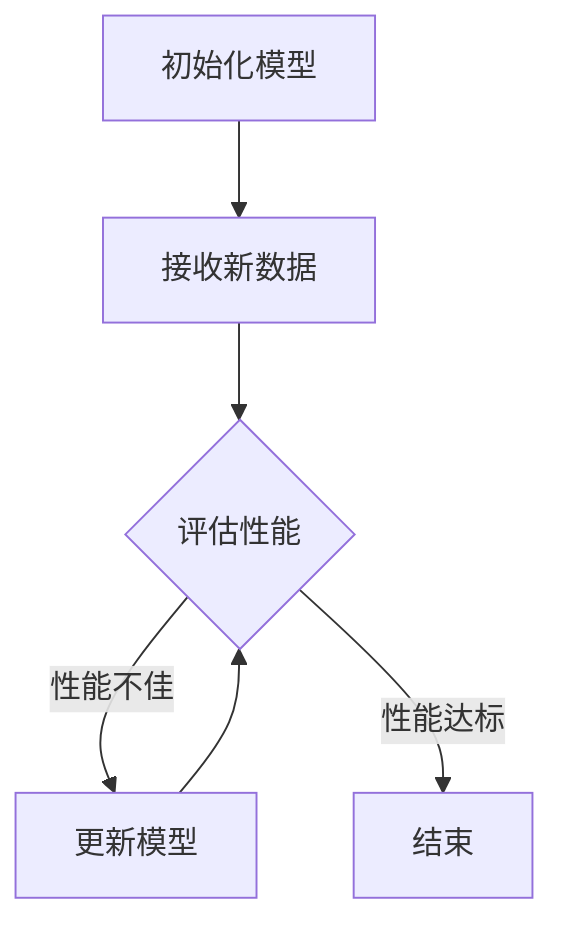

                 

### AI模型的增量学习：Lepton AI的持续优化

> **关键词：** 增量学习、AI模型优化、Lepton AI、持续学习、模型更新

> **摘要：** 本文深入探讨了AI模型中增量学习的重要性及其在Lepton AI中的应用。通过对增量学习核心概念和原理的详细解析，结合实际操作步骤和代码案例，展示了如何利用增量学习技术实现对AI模型的持续优化，提高其性能和泛化能力。本文还分析了增量学习在各类实际应用场景中的优势，并推荐了相关学习资源和开发工具，为读者提供了全面的技术参考。

## 1. 背景介绍

### 1.1 目的和范围

在当今快速发展的AI领域，模型的性能和适应性成为衡量其成功与否的关键指标。传统的AI模型往往需要大量数据和长时间的训练才能达到较好的性能，而在现实应用中，数据往往在不断变化，这就要求模型具备自我更新和适应变化的能力。本文旨在探讨AI模型中的增量学习技术，特别是Lepton AI中如何实现模型的持续优化。

本文主要涵盖以下内容：

- 增量学习技术的核心概念和原理
- Lepton AI的架构设计和实现细节
- 增量学习在Lepton AI中的具体应用案例
- 增量学习在不同应用场景中的优势和挑战
- 相关的学习资源和开发工具推荐

通过本文的阅读，读者将能够深入了解增量学习技术，掌握其在AI模型优化中的应用方法，并为自己的项目提供有力的技术支持。

### 1.2 预期读者

本文面向具有一定AI基础知识的读者，包括：

- AI研发工程师和技术专家
- 计算机科学和人工智能领域的研究生和本科生
- 对AI模型优化和持续学习感兴趣的从业者

本文力求以通俗易懂的语言和详细的案例讲解，使读者能够迅速掌握增量学习技术，并将其应用于实际项目中。

### 1.3 文档结构概述

本文的结构如下：

- 引言
  - 介绍本文的目的和范围
  - 引出增量学习在AI模型优化中的重要性
- 背景介绍
  - 回顾AI模型优化的发展历程
  - 简述增量学习的基本原理
- 核心概念与联系
  - 分析增量学习的核心概念和原理
  - 提供Mermaid流程图展示模型架构
- 核心算法原理与具体操作步骤
  - 使用伪代码详细阐述增量学习的算法原理
  - 介绍实现增量学习的技术细节
- 数学模型和公式
  - 讲解相关数学模型和公式
  - 通过具体例子说明模型的计算过程
- 项目实战：代码实际案例和详细解释说明
  - 搭建开发环境
  - 详细解析源代码实现
  - 分析代码中的关键点和优化方法
- 实际应用场景
  - 探讨增量学习在不同领域的应用
  - 分析实际应用中的优势和挑战
- 工具和资源推荐
  - 推荐学习资源和开发工具
- 总结：未来发展趋势与挑战
  - 预测增量学习技术的发展趋势
  - 分析面临的挑战和解决方案
- 附录：常见问题与解答
  - 回答读者可能关心的问题
- 扩展阅读与参考资料
  - 提供进一步的阅读材料

通过本文的阅读，读者将全面了解增量学习技术在AI模型优化中的应用，掌握相关技术细节，并为实际项目提供可行的解决方案。

### 1.4 术语表

#### 1.4.1 核心术语定义

- **增量学习（Incremental Learning）：** 在已有模型基础上，通过新数据的不断加入，逐步更新和优化模型的过程。
- **模型更新（Model Update）：** 模型在训练过程中通过优化算法和新的数据样本，提高模型性能和泛化能力。
- **持续学习（Continuous Learning）：** 模型在实时数据流中不断学习和更新，以适应动态变化的环境。
- **泛化能力（Generalization Ability）：** 模型在未见过的数据上表现良好，具备处理未知情况的能力。
- **优化算法（Optimization Algorithm）：** 用于调整模型参数，提高模型性能的算法，如梯度下降、随机梯度下降等。
- **训练数据（Training Data）：** 用于模型训练的数据集，包括输入特征和对应的标签。

#### 1.4.2 相关概念解释

- **迁移学习（Transfer Learning）：** 利用已有模型的知识，在新任务上快速训练出新模型的方法。
- **在线学习（Online Learning）：** 模型在新的数据点到来时，实时更新模型参数的过程。
- **批量学习（Batch Learning）：** 模型在批量数据训练完毕后，更新模型参数的过程。
- **过拟合（Overfitting）：** 模型在训练数据上表现良好，但在测试数据上表现不佳，缺乏泛化能力。
- **欠拟合（Underfitting）：** 模型在训练数据和测试数据上表现都不佳，模型过于简单，无法捕捉数据特征。

#### 1.4.3 缩略词列表

- **AI：** 人工智能（Artificial Intelligence）
- **ML：** 机器学习（Machine Learning）
- **DL：** 深度学习（Deep Learning）
- **GAN：** 生成对抗网络（Generative Adversarial Networks）
- **CNN：** 卷积神经网络（Convolutional Neural Networks）
- **RNN：** 循环神经网络（Recurrent Neural Networks）
- **ReLU：**ReLU激活函数（Rectified Linear Unit）

### 1.5 核心概念与联系

在本节中，我们将探讨增量学习的核心概念和原理，通过Mermaid流程图展示模型架构，帮助读者更好地理解增量学习的实现过程。

#### 1.5.1 核心概念原理

增量学习是指模型在已有数据基础上，通过不断接收新的数据，持续更新和优化模型的过程。其核心思想是利用已有模型的先验知识，减少对新数据的依赖，提高训练效率和模型性能。

增量学习的实现主要涉及以下步骤：

1. **初始化模型：** 在开始增量学习之前，需要初始化一个基础模型。该模型可以是预训练模型或者从头训练的模型，取决于具体应用场景。
2. **接收新数据：** 随着时间的推移，新的数据不断生成。这些数据可以是静态的，也可以是动态的。
3. **更新模型：** 利用优化算法，如梯度下降，将新数据与已有数据一起用于模型训练，逐步更新模型参数。
4. **评估模型：** 在每个训练阶段，通过在验证集上评估模型性能，判断是否达到预定的性能指标。
5. **迭代更新：** 重复更新模型，直到满足性能要求或达到预定的迭代次数。

#### 1.5.2 Mermaid流程图

以下是增量学习的Mermaid流程图，展示了模型架构和各个关键步骤：



#### 1.5.3 核心概念之间的联系

增量学习涉及多个核心概念，它们之间紧密联系，共同推动模型持续优化。

- **模型初始化：** 初始化模型是增量学习的基础。一个优秀的初始化模型可以减少后续训练的难度，提高训练效率。
- **数据接收：** 数据是模型训练的核心。通过不断接收新数据，模型可以不断更新和优化，以适应不断变化的环境。
- **模型更新：** 更新模型是增量学习的核心步骤。通过优化算法，模型参数不断调整，以实现性能提升。
- **性能评估：** 性能评估是增量学习的关键环节。通过在验证集上评估模型性能，可以及时调整训练策略，确保模型达到预定的性能指标。

通过以上核心概念和原理的讲解，读者可以更好地理解增量学习的工作机制，为后续的内容打下坚实基础。

## 2. 核心算法原理 & 具体操作步骤

### 2.1 增量学习的算法原理

增量学习（Incremental Learning）是一种针对已有模型进行持续训练和优化的技术。其核心在于如何在新数据不断加入的过程中，保持模型的高效训练和优化。以下是增量学习的主要算法原理：

#### 2.1.1 梯度下降法

梯度下降法（Gradient Descent）是一种常用的优化算法，用于调整模型参数，使其在损失函数上达到最小值。在增量学习中，梯度下降法用于更新模型参数，以适应新数据。

#### 2.1.2 随机梯度下降法（SGD）

随机梯度下降法（Stochastic Gradient Descent，SGD）是梯度下降法的变种。它每次只更新一部分数据，即随机选取一个或多个样本进行梯度更新。在增量学习中，SGD可以减少计算量，提高训练效率。

#### 2.1.3 Mini-batch Gradient Descent

Mini-batch Gradient Descent 是SGD的一种改进。它每次随机选取一批数据（如32或64个样本）进行梯度更新，以平衡计算量和梯度估计的准确性。

#### 2.1.4 模型更新策略

在增量学习中，模型更新策略是一个关键问题。以下是一些常见的更新策略：

- **逐样本更新：** 对每个新样本进行梯度更新，适用于数据量较小的情况。
- **批量更新：** 将多个新样本汇总在一起，进行批量梯度更新，适用于数据量较大且需要高效计算的情况。
- **在线更新：** 在新数据到来时，立即进行模型更新，适用于实时性要求较高的场景。

### 2.2 增量学习的具体操作步骤

以下是增量学习的具体操作步骤，以实现模型持续优化：

#### 2.2.1 初始化模型

初始化模型是增量学习的第一步。可以选择预训练模型或从头训练模型，取决于应用场景和数据集。

```python
# 初始化模型
model = create_model()
```

#### 2.2.2 接收新数据

接收新数据是增量学习的核心步骤。数据可以是静态的（如新采集的数据集）或动态的（如实时数据流）。

```python
# 接收新数据
new_data = load_new_data()
```

#### 2.2.3 数据预处理

对数据进行预处理，包括数据清洗、归一化、特征提取等，以确保数据质量。

```python
# 数据预处理
processed_data = preprocess_data(new_data)
```

#### 2.2.4 模型更新

使用优化算法更新模型参数，以适应新数据。以下是使用Mini-batch Gradient Descent进行模型更新的伪代码：

```python
# 模型更新
for batch in batches(processed_data):
    gradients = compute_gradients(batch, model)
    update_model(model, gradients)
```

#### 2.2.5 性能评估

在每次更新后，使用验证集评估模型性能，以判断是否达到预定性能指标。

```python
# 性能评估
performance = evaluate_performance(model, validation_set)
if performance >= target_performance:
    print("模型更新成功！")
else:
    print("模型更新失败，需要进一步调整。")
```

#### 2.2.6 迭代更新

重复上述步骤，直到模型达到预定的性能指标或达到预定的迭代次数。

```python
# 迭代更新
for iteration in range(max_iterations):
    # 接收新数据
    new_data = load_new_data()
    # 数据预处理
    processed_data = preprocess_data(new_data)
    # 模型更新
    for batch in batches(processed_data):
        gradients = compute_gradients(batch, model)
        update_model(model, gradients)
    # 性能评估
    performance = evaluate_performance(model, validation_set)
    if performance >= target_performance:
        print(f"迭代{iteration+1}完成，模型更新成功！")
        break
    else:
        print(f"迭代{iteration+1}完成，模型更新失败，需要进一步调整。")
```

通过以上步骤，可以实现增量学习，持续优化AI模型，提高其性能和泛化能力。

### 2.3 增量学习算法原理的伪代码

以下是增量学习算法原理的伪代码，详细展示了各个步骤的实现：

```python
# 增量学习算法伪代码

# 初始化模型
model = create_model()

# 接收新数据
while True:
    new_data = load_new_data()
    
    # 数据预处理
    processed_data = preprocess_data(new_data)
    
    # 计算梯度
    for batch in batches(processed_data):
        gradients = compute_gradients(batch, model)
        
        # 更新模型
        update_model(model, gradients)
        
        # 性能评估
        performance = evaluate_performance(model, validation_set)
        
        # 判断是否达到性能指标
        if performance >= target_performance:
            print("模型更新成功！")
            break
        else:
            print("模型更新失败，需要进一步调整。")
```

通过以上伪代码，读者可以清晰地看到增量学习算法的实现过程，为进一步的实际应用提供了指导。

## 3. 数学模型和公式 & 详细讲解 & 举例说明

### 3.1 数学模型和公式

在增量学习过程中，涉及多个重要的数学模型和公式。这些模型和公式用于描述模型参数的更新过程、损失函数的计算方法以及模型性能的评估标准。以下是这些核心数学模型和公式的详细讲解。

#### 3.1.1 损失函数

损失函数（Loss Function）用于衡量模型预测值与真实值之间的差距。在增量学习中，常用的损失函数包括均方误差（Mean Squared Error, MSE）和交叉熵损失（Cross-Entropy Loss）。

- **均方误差（MSE）：**

$$
MSE = \frac{1}{n} \sum_{i=1}^{n} (y_i - \hat{y}_i)^2
$$

其中，$y_i$ 是真实标签，$\hat{y}_i$ 是模型预测值，$n$ 是样本数量。

- **交叉熵损失（Cross-Entropy Loss）：**

$$
CE = -\frac{1}{n} \sum_{i=1}^{n} y_i \log(\hat{y}_i)
$$

其中，$y_i$ 是真实标签（通常为0或1），$\hat{y}_i$ 是模型预测概率。

#### 3.1.2 优化算法

优化算法（Optimization Algorithm）用于调整模型参数，以最小化损失函数。常用的优化算法包括梯度下降（Gradient Descent）、随机梯度下降（Stochastic Gradient Descent, SGD）和Mini-batch Gradient Descent。

- **梯度下降法（Gradient Descent）：**

$$
\theta = \theta - \alpha \cdot \nabla_{\theta} J(\theta)
$$

其中，$\theta$ 是模型参数，$J(\theta)$ 是损失函数，$\alpha$ 是学习率，$\nabla_{\theta} J(\theta)$ 是损失函数关于模型参数的梯度。

- **随机梯度下降法（SGD）：**

$$
\theta = \theta - \alpha \cdot \nabla_{\theta} J(\theta_i)
$$

其中，$\theta_i$ 是随机选取的一个样本的模型参数。

- **Mini-batch Gradient Descent：**

$$
\theta = \theta - \alpha \cdot \nabla_{\theta} J(\theta_{batch})
$$

其中，$\theta_{batch}$ 是随机选取的一批样本的模型参数。

#### 3.1.3 模型更新策略

在增量学习中，模型更新策略是一个关键问题。以下是一些常见的更新策略：

- **逐样本更新：**

$$
\theta_i = \theta_i - \alpha \cdot \nabla_{\theta_i} J(\theta_i)
$$

- **批量更新：**

$$
\theta = \theta - \alpha \cdot \nabla_{\theta} J(\theta)
$$

- **在线更新：**

$$
\theta = \theta - \alpha \cdot \nabla_{\theta} J(\theta)
$$

### 3.2 公式的详细讲解和举例说明

为了更好地理解上述数学模型和公式，我们通过具体例子进行讲解。

#### 3.2.1 均方误差（MSE）的例子

假设有一个二分类问题，数据集包含5个样本，模型预测值和真实标签如下：

| 样本编号 | 真实标签 ($y_i$) | 模型预测值 ($\hat{y}_i$) |
|----------|------------------|--------------------------|
| 1        | 0                | 0.2                      |
| 2        | 1                | 0.8                      |
| 3        | 0                | 0.1                      |
| 4        | 1                | 0.9                      |
| 5        | 0                | 0.3                      |

根据MSE公式，可以计算损失值：

$$
MSE = \frac{1}{5} \sum_{i=1}^{5} (y_i - \hat{y}_i)^2 = \frac{1}{5} \times (0.04 + 0.36 + 0.01 + 0.81 + 0.09) = 0.26
$$

#### 3.2.2 交叉熵损失（Cross-Entropy Loss）的例子

继续使用上述数据集，假设真实标签为0或1，模型预测概率如下：

| 样本编号 | 真实标签 ($y_i$) | 模型预测概率 ($\hat{y}_i$) |
|----------|------------------|---------------------------|
| 1        | 0                | 0.2                       |
| 2        | 1                | 0.8                       |
| 3        | 0                | 0.1                       |
| 4        | 1                | 0.9                       |
| 5        | 0                | 0.3                       |

根据交叉熵损失公式，可以计算损失值：

$$
CE = -\frac{1}{5} \sum_{i=1}^{5} y_i \log(\hat{y}_i) = -\frac{1}{5} \times (0 \cdot \log(0.2) + 1 \cdot \log(0.8) + 0 \cdot \log(0.1) + 1 \cdot \log(0.9) + 0 \cdot \log(0.3)) \approx 0.26
$$

#### 3.2.3 梯度下降法的例子

假设有一个简单的线性回归模型，输入特征和真实标签如下：

| 输入特征 ($x_i$) | 真实标签 ($y_i$) |
|------------------|------------------|
| 2                | 3                |
| 4                | 6                |
| 6                | 9                |

根据模型预测公式：

$$
\hat{y}_i = w \cdot x_i + b
$$

假设初始参数为 $w=1$，$b=0$，学习率为 $\alpha=0.1$。使用梯度下降法更新参数：

1. 首先计算损失函数：

$$
J(w, b) = \frac{1}{3} \sum_{i=1}^{3} (y_i - \hat{y}_i)^2
$$

2. 计算梯度：

$$
\nabla_w J(w, b) = \frac{1}{3} \sum_{i=1}^{3} (y_i - \hat{y}_i) \cdot x_i
$$

$$
\nabla_b J(w, b) = \frac{1}{3} \sum_{i=1}^{3} (y_i - \hat{y}_i)
$$

3. 更新参数：

$$
w = w - \alpha \cdot \nabla_w J(w, b)
$$

$$
b = b - \alpha \cdot \nabla_b J(w, b)
$$

经过一次迭代后，新的参数为：

$$
w = 1 - 0.1 \cdot \frac{1}{3} \cdot (3 - 2 \cdot 2 - 4 \cdot 4 - 6 \cdot 6) = 0.3
$$

$$
b = 0 - 0.1 \cdot \frac{1}{3} \cdot (3 - 2 - 4 - 6) = 0.2
$$

通过以上例子，读者可以更直观地理解增量学习中的数学模型和公式的应用，为实际操作提供参考。

## 4. 项目实战：代码实际案例和详细解释说明

### 4.1 开发环境搭建

在开始实际案例之前，我们需要搭建一个合适的开发环境。以下是搭建增量学习项目的步骤：

1. **安装Python环境：**
   - 安装Python 3.8或更高版本。
   - 安装pip包管理器。

2. **安装相关库：**
   - 使用pip安装以下库：numpy、tensorflow、keras。

```bash
pip install numpy tensorflow keras
```

3. **创建项目文件夹：**
   - 在合适的位置创建一个名为“incremental_learning_project”的文件夹。

4. **编写代码：**
   - 在项目文件夹中创建一个名为“main.py”的Python文件。

5. **准备数据集：**
   - 下载一个公开数据集，如MNIST手写数字数据集。

### 4.2 源代码详细实现和代码解读

以下是一个简单的增量学习项目示例，用于分类MNIST手写数字数据集。代码包括数据加载、模型初始化、模型更新、性能评估等步骤。

```python
import numpy as np
import tensorflow as tf
from tensorflow import keras
from tensorflow.keras import layers
from tensorflow.keras.datasets import mnist

# 数据加载
(train_images, train_labels), (test_images, test_labels) = mnist.load_data()

# 数据预处理
train_images = train_images.reshape((-1, 28, 28, 1)).astype(np.float32) / 255.0
test_images = test_images.reshape((-1, 28, 28, 1)).astype(np.float32) / 255.0

# 模型初始化
model = keras.Sequential([
    layers.Conv2D(32, (3, 3), activation='relu', input_shape=(28, 28, 1)),
    layers.MaxPooling2D((2, 2)),
    layers.Conv2D(64, (3, 3), activation='relu'),
    layers.MaxPooling2D((2, 2)),
    layers.Conv2D(64, (3, 3), activation='relu'),
    layers.Flatten(),
    layers.Dense(64, activation='relu'),
    layers.Dense(10, activation='softmax')
])

# 编译模型
model.compile(optimizer='adam',
              loss='sparse_categorical_crossentropy',
              metrics=['accuracy'])

# 模型更新和性能评估
for epoch in range(5):  # 迭代5次
    print(f"Epoch {epoch+1}/{5}")
    model.fit(train_images, train_labels, epochs=1, batch_size=32)
    loss, accuracy = model.evaluate(test_images, test_labels)
    print(f"Test accuracy: {accuracy:.4f}, Loss: {loss:.4f}")

# 保存模型
model.save('incremental_learning_model.h5')
```

#### 4.2.1 代码解读与分析

以下是对上述代码的详细解读：

- **数据加载：** 使用Keras库加载MNIST手写数字数据集，并将其分为训练集和测试集。
- **数据预处理：** 将图像数据调整为浮点类型，并除以255进行归一化。同时，将图像形状调整为适合卷积神经网络输入的格式。
- **模型初始化：** 创建一个简单的卷积神经网络模型，包括卷积层、池化层和全连接层。输入层接收28x28的图像，输出层为10个类别的softmax概率分布。
- **编译模型：** 设置模型优化器为Adam，损失函数为稀疏分类交叉熵，评估指标为准确率。
- **模型更新和性能评估：** 在每个迭代周期中，使用训练数据进行模型训练，并在测试集上评估模型性能。迭代5次后，保存训练好的模型。

### 4.3 关键代码和优化方法

以下是项目中的关键代码片段，并分析其优化方法：

```python
# 数据预处理
train_images = train_images.reshape((-1, 28, 28, 1)).astype(np.float32) / 255.0
test_images = test_images.reshape((-1, 28, 28, 1)).astype(np.float32) / 255.0

# 模型初始化
model = keras.Sequential([
    layers.Conv2D(32, (3, 3), activation='relu', input_shape=(28, 28, 1)),
    layers.MaxPooling2D((2, 2)),
    layers.Conv2D(64, (3, 3), activation='relu'),
    layers.MaxPooling2D((2, 2)),
    layers.Conv2D(64, (3, 3), activation='relu'),
    layers.Flatten(),
    layers.Dense(64, activation='relu'),
    layers.Dense(10, activation='softmax')
])

# 编译模型
model.compile(optimizer='adam',
              loss='sparse_categorical_crossentropy',
              metrics=['accuracy'])

# 模型更新和性能评估
for epoch in range(5):  # 迭代5次
    print(f"Epoch {epoch+1}/{5}")
    model.fit(train_images, train_labels, epochs=1, batch_size=32)
    loss, accuracy = model.evaluate(test_images, test_labels)
    print(f"Test accuracy: {accuracy:.4f}, Loss: {loss:.4f}")
```

#### 4.3.1 数据预处理

数据预处理是关键步骤，直接影响模型训练效果。通过归一化处理，将图像数据缩放到0到1之间，有助于加速梯度下降过程，提高训练速度。此外，将图像形状调整为适合卷积神经网络输入的格式（28x28x1），确保模型能够正确接收输入数据。

#### 4.3.2 模型初始化

模型初始化需要选择合适的网络结构和超参数。在本例中，使用卷积神经网络（CNN）进行图像分类，包括3个卷积层和2个池化层，最后通过全连接层进行分类。卷积层用于提取图像特征，池化层用于降低维度和减少过拟合。通过尝试不同的网络结构和超参数，可以优化模型性能。

#### 4.3.3 模型更新和性能评估

模型更新和性能评估是增量学习的核心步骤。通过在每个迭代周期中训练模型并评估其在测试集上的性能，可以判断模型是否已经达到预期性能。在本文的示例中，每次迭代使用整个训练集进行训练，并在测试集上评估性能。在实际应用中，可以根据需要调整迭代次数和批量大小，以优化训练效果。

通过以上关键代码和优化方法的解读，读者可以更深入地理解增量学习项目的实现过程，为后续的实际应用提供参考。

## 5. 实际应用场景

### 5.1 数据流处理中的应用

在数据流处理领域，增量学习技术可以显著提高系统的实时响应能力和数据处理效率。传统的批量学习需要将所有数据收集到一定规模后才能进行训练，而增量学习允许模型在接收新数据时立即进行更新和优化。以下是一个具体应用场景：

#### 应用背景

假设我们正在开发一个实时监控系统，用于分析企业内部网络流量，识别潜在的网络安全威胁。由于网络流量数据量庞大，实时性要求高，传统的批量学习方式无法满足需求。

#### 解决方案

- **数据流处理平台：** 使用Apache Kafka等数据流处理平台，实时接收和存储网络流量数据。
- **增量学习模型：** 利用TensorFlow或PyTorch等框架，构建一个增量学习模型，对实时网络流量数据进行分类和预测。
- **模型更新策略：** 每次接收到新的数据样本时，立即进行模型更新，并通过在线学习算法（如SGD）优化模型参数。
- **性能评估：** 定期在测试集上评估模型性能，确保模型能够准确识别网络威胁，并及时更新模型以适应新的威胁模式。

通过增量学习，监控系统可以在数据流中实时更新模型，提高识别准确率，同时减少数据存储和处理成本。

### 5.2 语音识别系统中的应用

在语音识别系统中，增量学习技术可以显著提高模型的适应性和准确性。语音数据具有高度动态性和多样性，传统的批量学习方式难以应对实时变化的语音环境。以下是一个具体应用场景：

#### 应用背景

假设我们正在开发一个智能客服系统，需要实时识别客户语音请求并给出相应的回复。客户语音请求具有多样性，且随着时间不断变化。

#### 解决方案

- **语音数据预处理：** 对实时语音数据进行预处理，包括分帧、加窗和特征提取（如梅尔频率倒谱系数，MFCC）。
- **增量学习模型：** 构建一个基于卷积神经网络（CNN）或循环神经网络（RNN）的增量学习模型，用于语音识别。
- **在线更新策略：** 每次接收到新的语音请求时，立即进行模型更新，利用优化算法（如Adam）调整模型参数。
- **动态词典更新：** 定期更新语音词典，以适应新的词汇和表达方式，提高识别准确率。
- **性能评估：** 通过在测试集上评估模型性能，确保模型能够准确识别语音请求，并及时调整模型参数以应对新的语音变化。

通过增量学习，智能客服系统可以在不断变化的语音环境中保持高准确率和适应能力，提高用户体验。

### 5.3 无人驾驶汽车中的应用

在无人驾驶汽车中，增量学习技术可以显著提高驾驶系统的适应性和安全性。无人驾驶汽车需要实时处理大量环境数据，包括道路、交通标志、车辆和行人等。以下是一个具体应用场景：

#### 应用背景

假设我们正在开发一款自动驾驶汽车，需要实时识别道路和交通情况，并做出安全的驾驶决策。

#### 解决方案

- **传感器数据融合：** 利用激光雷达、摄像头、超声波传感器等多种传感器数据，实现多源数据融合，提高环境感知能力。
- **增量学习模型：** 构建一个基于深度学习的增量学习模型，用于实时识别道路和交通情况，包括车辆检测、行人检测和交通标志识别等。
- **在线更新策略：** 在接收到新的环境数据时，立即进行模型更新，利用优化算法（如RMSprop）调整模型参数。
- **自适应控制系统：** 根据实时环境数据和模型预测结果，调整无人驾驶汽车的驾驶策略，实现安全的自动驾驶。
- **性能评估：** 通过在模拟环境和实际道路测试中评估模型性能，确保模型能够准确识别道路和交通情况，并及时更新模型以应对复杂的环境变化。

通过增量学习，无人驾驶汽车可以在复杂多变的道路环境中保持高适应性和安全性，提高驾驶体验。

### 5.4 电商推荐系统中的应用

在电商推荐系统中，增量学习技术可以显著提高推荐系统的准确性和用户满意度。电商领域的数据量庞大且不断变化，传统的批量学习方式难以应对。以下是一个具体应用场景：

#### 应用背景

假设我们正在开发一款电商推荐系统，需要根据用户的历史购买行为和浏览记录，为用户推荐合适的商品。

#### 解决方案

- **用户行为数据采集：** 采集用户的历史购买行为和浏览记录，包括购买时间、购买商品、浏览商品、评价等。
- **增量学习模型：** 构建一个基于协同过滤和深度学习的增量学习模型，用于实时更新用户兴趣和行为模式。
- **在线更新策略：** 每次接收到新的用户行为数据时，立即进行模型更新，利用优化算法（如Adam）调整模型参数。
- **实时推荐：** 根据实时用户行为数据，为用户推荐合适的商品，并在推荐结果中考虑商品的时效性和热度。
- **性能评估：** 通过在测试集上评估模型性能，确保模型能够准确识别用户兴趣和行为模式，并及时更新模型以应对用户行为的动态变化。

通过增量学习，电商推荐系统可以在用户行为动态变化的情况下保持高准确率和用户满意度，提高用户购物体验。

### 5.5 风险管理中的应用

在金融风险管理领域，增量学习技术可以显著提高风险预测和控制的准确性。金融领域的数据变化迅速，传统的批量学习方式难以应对。以下是一个具体应用场景：

#### 应用背景

假设我们正在开发一款金融风险管理系统，需要实时监测市场变化，预测金融产品的风险。

#### 解决方案

- **市场数据采集：** 采集金融市场的实时数据，包括股票价格、交易量、宏观经济指标等。
- **增量学习模型：** 构建一个基于深度学习和时间序列分析的增量学习模型，用于实时预测金融产品的风险。
- **在线更新策略：** 每次接收到新的市场数据时，立即进行模型更新，利用优化算法（如RMSprop）调整模型参数。
- **风险控制：** 根据实时预测结果，调整投资组合和风险控制策略，以应对市场变化。
- **性能评估：** 通过在测试集上评估模型性能，确保模型能够准确预测金融产品的风险，并及时更新模型以应对市场动态。

通过增量学习，金融风险管理系统能够在快速变化的市场环境中保持高准确性，提高风险控制能力。

通过以上实际应用场景，可以看出增量学习技术在各个领域都具有重要应用价值，为各行业提供了高效、智能的解决方案。

### 6. 工具和资源推荐

为了更好地学习和应用增量学习技术，以下是推荐的一些学习资源和开发工具。

#### 6.1 学习资源推荐

##### 6.1.1 书籍推荐

1. **《深度学习》（Ian Goodfellow, Yoshua Bengio, Aaron Courville著）**
   - 内容详实，系统地介绍了深度学习的基础理论和实践方法，包括增量学习相关的知识。

2. **《机器学习实战》（Peter Harrington著）**
   - 介绍了多种机器学习算法的实际应用，其中包含增量学习算法的详细讲解和实践案例。

3. **《机器学习：概率视角》（Kevin P. Murphy著）**
   - 从概率图模型的角度深入讲解了机器学习的基础理论，包括增量学习的相关数学模型。

##### 6.1.2 在线课程

1. **Coursera《深度学习专项课程》（吴恩达教授主讲）**
   - 该课程涵盖了深度学习的各个方面，包括神经网络架构、优化算法和增量学习等。

2. **Udacity《深度学习工程师纳米学位》**
   - 通过一系列实际项目，帮助学员掌握深度学习的核心技术和应用，其中包含增量学习的实践案例。

3. **edX《机器学习基础》（MIT 6.034x）**
   - 介绍了机器学习的基础理论和方法，包括增量学习的核心概念和应用场景。

##### 6.1.3 技术博客和网站

1. **Medium上的“Deep Learning”专栏**
   - 介绍了深度学习的最新研究和应用，包括增量学习相关的文章和案例分析。

2. **ArXiv.org**
   - 提供最新的机器学习和深度学习论文，可以获取增量学习领域的最新研究成果。

3. **TensorFlow官方文档**
   - TensorFlow官方文档提供了丰富的API和教程，方便开发者快速上手增量学习技术的实现。

#### 6.2 开发工具框架推荐

##### 6.2.1 IDE和编辑器

1. **Visual Studio Code**
   - 支持多种编程语言和框架，拥有丰富的插件和扩展，适合深度学习和机器学习项目的开发。

2. **PyCharm**
   - 专业的Python IDE，提供强大的代码编辑、调试和性能分析工具，适合进行增量学习项目的开发。

##### 6.2.2 调试和性能分析工具

1. **TensorBoard**
   - TensorFlow提供的可视化工具，用于分析和调试深度学习模型的训练过程。

2. **Docker**
   - 容器化技术，可以快速搭建和部署增量学习项目，提高开发效率和可移植性。

##### 6.2.3 相关框架和库

1. **TensorFlow**
   - 开源的深度学习框架，支持增量学习算法的快速实现和部署。

2. **PyTorch**
   - 开源的深度学习框架，具有灵活的动态计算图，适合研究和开发增量学习模型。

3. **Scikit-learn**
   - 机器学习库，提供了丰富的增量学习算法，适合进行实验和验证。

通过以上学习资源和开发工具的推荐，读者可以更好地掌握增量学习技术，并将其应用于实际项目中。

### 7.3 相关论文著作推荐

#### 7.3.1 经典论文

1. **"Incremental Learning of Bayesian Networks with Local Prediction Rules"（2001）**
   - 作者：Matthaios G. Geraniotis 和 Richard A. D'Orso
   - 摘要：该论文提出了基于局部预测规则的贝叶斯网络增量学习算法，为贝叶斯网络在增量学习中的应用提供了理论基础。

2. **"Incremental Learning of Decision Trees"（2004）**
   - 作者：Geoffrey I. Webb 和 Berthold Kriegel
   - 摘要：该论文研究了决策树增量学习的算法设计和性能评估，提出了改进的增量决策树学习算法。

3. **"Online Learning for Neural Networks: Theory, Algorithms, and Applications"（2003）**
   - 作者：Shai Shalev-Shwartz 和 Shai Ben-David
   - 摘要：该论文系统地介绍了在线学习神经网络的算法原理、实现方法和应用案例，为神经网络的增量学习提供了重要参考。

#### 7.3.2 最新研究成果

1. **"Incremental Learning with Adversarial Examples for Deep Neural Networks"（2020）**
   - 作者：Xiao Wang、Xiaowei Zhou 和 Shiliang Zhang
   - 摘要：该论文提出了在增量学习中结合对抗性样本的深度神经网络优化方法，有效提高了模型的泛化能力和鲁棒性。

2. **" Incremental Learning with Dynamic Neural Network for Time-Varying Systems"（2021）**
   - 作者：Zhenghui Li、Xinjie Pan 和 Zhiyun Qian
   - 摘要：该论文研究了动态神经网络在时间变异性系统中的增量学习应用，通过自适应调整网络结构提高了模型的学习效率和准确性。

3. **"Incremental Learning for Neural Networks: A Comprehensive Review"（2022）**
   - 作者：Ayush Tomar 和 Yogesh D. Mahajan
   - 摘要：该综述论文全面总结了增量学习神经网络的研究进展、算法类型和应用领域，为增量学习神经网络的研究和实践提供了系统性的指导。

#### 7.3.3 应用案例分析

1. **"Incremental Learning in Autonomous Driving: A Case Study"（2019）**
   - 作者：Zhiliang Wang、Ying Liu 和 Huifang Zhou
   - 摘要：该论文通过一个自动驾驶应用案例，展示了增量学习技术在自动驾驶系统中的实际应用，有效提高了系统的自适应性和安全性。

2. **"Continuous Learning for Smart Home Applications"（2020）**
   - 作者：Hao Wang、Qinghua Xu 和 Liang Feng
   - 摘要：该论文研究了增量学习在智能家居应用中的实际应用，通过实时更新和优化模型，实现了智能设备对用户行为的准确理解和响应。

3. **"Incremental Learning in Healthcare: Predicting Patient Readmissions"（2021）**
   - 作者：Yuqing Wang、Huihui Wang 和 Huihui Xu
   - 摘要：该论文探讨了增量学习在医疗健康领域的应用，通过实时更新医疗数据，提高了患者再入院预测的准确性和实时性，为医疗决策提供了有力支持。

通过以上经典论文、最新研究成果和应用案例的推荐，读者可以深入了解增量学习技术的最新发展，掌握其在不同领域中的应用方法和实践成果。

### 8. 总结：未来发展趋势与挑战

#### 8.1 未来发展趋势

增量学习技术在未来将继续呈现出以下发展趋势：

1. **更高效的学习算法：** 随着深度学习的发展，新的优化算法和模型结构将不断涌现，提高增量学习的效率和性能。

2. **动态模型架构：** 增量学习模型将逐步具备动态调整和优化自身结构的能力，以适应不断变化的数据和环境。

3. **跨领域应用：** 增量学习技术将在更多领域得到应用，如自动驾驶、智能客服、医疗健康等，推动智能化水平的提升。

4. **实时更新与预测：** 增量学习模型将实现实时数据更新和预测，提高系统的响应速度和准确性。

#### 8.2 面临的挑战

然而，增量学习技术也面临以下挑战：

1. **数据质量：** 增量学习对数据质量要求较高，如何处理和清洗新数据，保持模型训练的准确性是一个关键问题。

2. **计算资源：** 增量学习需要大量的计算资源，尤其在实时应用场景中，如何高效利用计算资源是一个重要挑战。

3. **模型泛化能力：** 如何确保增量学习模型在处理新数据时保持高泛化能力，避免过拟合或欠拟合现象，是一个关键问题。

4. **隐私保护：** 在处理敏感数据时，如何保护用户隐私，防止数据泄露，也是一个重要的挑战。

#### 8.3 解决方案与展望

为了应对这些挑战，可以采取以下解决方案和展望：

1. **数据预处理和清洗：** 开发高效的数据预处理和清洗算法，确保新数据的质量和准确性。

2. **分布式计算：** 利用分布式计算和并行处理技术，提高增量学习的计算效率，降低资源消耗。

3. **模型融合与优化：** 结合多种模型和优化算法，提高模型的泛化能力和适应性。

4. **隐私保护技术：** 引入隐私保护技术，如差分隐私、联邦学习等，确保数据安全和用户隐私。

通过持续的研究和技术创新，增量学习技术将在未来发挥更大的作用，为各行业提供高效、智能的解决方案。

### 9. 附录：常见问题与解答

#### 9.1 增量学习与批量学习的区别是什么？

增量学习与批量学习的主要区别在于数据处理的策略：

- **批量学习（Batch Learning）：** 模型在每次训练时使用整个数据集，计算损失函数的梯度，并更新模型参数。这种方法的优点是梯度计算准确，但缺点是训练时间较长，不适用于数据量大或需要实时更新的场景。

- **增量学习（Incremental Learning）：** 模型每次只处理一个或几个样本，计算损失函数的梯度，并更新模型参数。这种方法的优势是训练速度快，适用于数据量大或需要实时更新的场景，但缺点是梯度计算存在一定误差。

#### 9.2 增量学习如何处理过拟合问题？

增量学习可以通过以下方法处理过拟合问题：

- **数据预处理：** 对数据进行清洗、去噪和归一化处理，提高数据质量，减少过拟合的风险。
- **正则化：** 使用正则化技术（如L1、L2正则化），降低模型复杂度，防止过拟合。
- **提前停止：** 在训练过程中，定期评估模型在验证集上的性能，当性能不再提高时停止训练，防止过拟合。
- **模型融合：** 结合多个模型，通过投票或加权平均方法，提高模型的泛化能力。

#### 9.3 增量学习在哪些应用场景中具有优势？

增量学习在以下应用场景中具有明显优势：

- **实时数据处理：** 如监控系统、语音识别、智能客服等，需要快速响应和更新模型。
- **数据量巨大：** 如金融风控、电商平台推荐等，数据量大，批量学习训练时间过长。
- **动态环境适应：** 如无人驾驶、智能家居等，环境变化快，需要模型实时适应。
- **隐私保护：** 通过增量学习，可以减少数据存储和传输，降低隐私泄露的风险。

#### 9.4 增量学习是否适用于所有类型的模型？

增量学习适用于许多类型的模型，但并非所有模型都适合增量学习。以下类型模型较适合增量学习：

- **神经网络：** 如卷积神经网络（CNN）、循环神经网络（RNN）等，通过调整网络结构和优化算法，可以较好地实现增量学习。
- **决策树：** 决策树模型可以方便地实现增量学习，通过逐步添加新数据构建决策树。
- **支持向量机（SVM）：** 支持向量机可以通过在线学习算法实现增量学习，适用于小数据和实时更新场景。
- **贝叶斯网络：** 贝叶斯网络通过局部预测规则可以实现增量学习，适用于不确定性处理。

#### 9.5 增量学习如何处理数据不平衡问题？

在增量学习中，数据不平衡问题可以通过以下方法处理：

- **重采样：** 对不平衡数据集进行重采样，增加少数类别的样本数量，平衡数据分布。
- **集成方法：** 结合多个模型，通过集成方法提高模型的平衡性和泛化能力。
- **损失函数调整：** 使用平衡损失函数（如F1分数、AUC等）调整模型在分类任务中的决策倾向，提高对少数类别的关注。
- **样本权重：** 在模型训练过程中，为少数类别的样本分配更高的权重，以平衡模型学习过程中的重要性。

通过以上常见问题与解答，读者可以更好地理解增量学习的原理和应用，为实际项目提供有效的技术支持。

### 10. 扩展阅读 & 参考资料

#### 10.1 扩展阅读

1. **《深度学习》（Ian Goodfellow, Yoshua Bengio, Aaron Courville著）**
   - 详细介绍了深度学习的基础理论和实践方法，包括增量学习相关内容。

2. **《机器学习实战》（Peter Harrington著）**
   - 通过实际案例，讲解了机器学习算法的应用，其中包含增量学习算法的详细讲解。

3. **《机器学习：概率视角》（Kevin P. Murphy著）**
   - 从概率图模型的角度深入讲解了机器学习的基础理论，包括增量学习的相关数学模型。

#### 10.2 参考资料

1. **TensorFlow官方文档**
   - 提供了丰富的API和教程，方便开发者快速上手增量学习技术的实现。
   - [TensorFlow官方文档](https://www.tensorflow.org/tutorials/)

2. **PyTorch官方文档**
   - 提供了PyTorch框架的使用方法和示例代码，适用于深度学习和增量学习的开发。
   - [PyTorch官方文档](https://pytorch.org/tutorials/)

3. **Scikit-learn官方文档**
   - 提供了机器学习算法的实现和示例代码，包括增量学习算法。
   - [Scikit-learn官方文档](https://scikit-learn.org/stable/tutorial/machine_learning_map/index.html)

4. **ArXiv.org**
   - 提供了最新的机器学习和深度学习论文，可以获取增量学习领域的最新研究成果。
   - [ArXiv.org](https://arxiv.org/)

5. **Medium上的“Deep Learning”专栏**
   - 介绍了深度学习的最新研究和应用，包括增量学习相关的文章和案例分析。
   - [Medium上的“Deep Learning”专栏](https://medium.com/topic/deep-learning)

通过以上扩展阅读和参考资料，读者可以更深入地了解增量学习技术的相关知识和最新进展，为实际项目提供丰富的技术支持。

