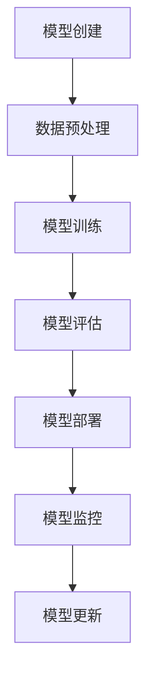

                 

# AI模型的生命周期管理：Lepton AI的全程服务

> **关键词：** AI模型生命周期管理、模型部署、模型监控、模型更新、Lepton AI

**摘要：**
本文深入探讨了AI模型的生命周期管理，以Lepton AI为例，详细阐述了从模型创建、训练、部署到监控与更新的全流程服务。通过本文，读者将了解AI模型生命周期的各个环节，以及如何高效地管理和维护AI模型，从而提升模型的性能和应用价值。

## 1. 背景介绍

在当今技术飞速发展的时代，人工智能（AI）已经深入到我们生活的方方面面。从自动驾驶汽车到智能家居，从医疗诊断到金融风控，AI模型的应用场景无处不在。然而，AI模型的生命周期管理成为了一个不可忽视的重要问题。一个优秀的AI模型不仅需要准确的数据集和高效的算法，还需要在模型创建、训练、部署、监控和更新等环节进行精细化管理。

Lepton AI是一个专为AI模型生命周期管理设计的平台，它提供了一套完整的工具和服务，涵盖了模型创建、训练、部署、监控和更新等各个环节。通过Lepton AI，开发者和企业可以轻松地管理AI模型，提高模型的性能和应用价值。

## 2. 核心概念与联系

### 2.1 AI模型生命周期

AI模型的生命周期可以分为以下几个阶段：

1. **模型创建**：选择合适的算法和数据集，创建AI模型。
2. **模型训练**：使用训练数据集对模型进行训练，优化模型的参数。
3. **模型部署**：将训练好的模型部署到生产环境中，供实际应用使用。
4. **模型监控**：实时监控模型的运行状态，确保模型稳定高效地运行。
5. **模型更新**：根据应用反馈和新的数据，对模型进行更新和优化。

### 2.2 Lepton AI的架构

Lepton AI的架构如图1所示：



图1：Lepton AI架构图

## 3. 核心算法原理 & 具体操作步骤

### 3.1 模型创建

模型创建是AI模型生命周期的第一步。在Lepton AI中，用户可以通过图形界面选择合适的算法和数据集，创建AI模型。具体步骤如下：

1. **选择算法**：根据应用场景选择合适的算法，如深度学习、决策树、支持向量机等。
2. **选择数据集**：从Lepton AI的数据管理模块中选择或上传训练数据集。
3. **配置参数**：设置模型的超参数，如学习率、迭代次数等。
4. **创建模型**：点击创建按钮，生成AI模型。

### 3.2 模型训练

模型训练是AI模型生命周期中最为关键的环节。在Lepton AI中，用户可以选择自动或手动设置训练参数，对模型进行训练。具体步骤如下：

1. **上传训练数据**：将训练数据上传到Lepton AI平台。
2. **配置训练参数**：设置训练参数，如学习率、迭代次数、批量大小等。
3. **启动训练**：点击启动训练按钮，开始对模型进行训练。
4. **监控训练过程**：在训练过程中，用户可以实时监控训练进度和模型性能。

### 3.3 模型部署

模型部署是将训练好的AI模型部署到生产环境中，供实际应用使用的过程。在Lepton AI中，用户可以轻松地将模型部署到云端或本地服务器。具体步骤如下：

1. **选择部署环境**：选择部署目标环境，如云端、本地服务器等。
2. **配置部署参数**：设置模型部署参数，如服务名称、端口等。
3. **启动部署**：点击启动部署按钮，开始部署模型。
4. **监控部署进度**：在部署过程中，用户可以实时监控部署进度。

### 3.4 模型监控

模型监控是确保AI模型稳定高效运行的重要手段。在Lepton AI中，用户可以实时监控模型的运行状态，包括模型性能、运行时长、资源消耗等。具体步骤如下：

1. **启动监控**：点击启动监控按钮，开始监控模型运行状态。
2. **监控数据展示**：在监控界面上展示模型运行状态数据。
3. **异常处理**：当模型出现异常时，系统会自动发出警报，并记录异常日志。

### 3.5 模型更新

随着应用场景的变化和数据更新，AI模型可能需要不断进行优化和更新。在Lepton AI中，用户可以方便地对模型进行更新。具体步骤如下：

1. **获取更新数据**：从Lepton AI的数据管理模块中获取更新数据。
2. **更新模型**：使用更新数据对模型进行训练和优化。
3. **重新部署**：将更新后的模型重新部署到生产环境中。

## 4. 数学模型和公式 & 详细讲解 & 举例说明

在AI模型的生命周期管理中，一些关键步骤涉及到数学模型和公式的应用。以下是一个简单的例子，说明如何使用数学模型对AI模型进行评估和更新。

### 4.1 模型评估

假设我们使用交叉验证来评估AI模型的性能。交叉验证的基本公式如下：

$$
CV = \frac{1}{K} \sum_{i=1}^{K} \hat{L}(D_i)
$$

其中，\(CV\) 表示交叉验证的损失，\(K\) 表示交叉验证的折叠数，\(D_i\) 表示第 \(i\) 个折叠的训练集，\(\hat{L}(D_i)\) 表示在 \(D_i\) 上的模型损失。

### 4.2 模型更新

假设我们使用梯度下降法对AI模型进行更新。梯度下降的基本公式如下：

$$
w_{t+1} = w_t - \alpha \cdot \nabla_w L(w)
$$

其中，\(w_t\) 表示当前模型的参数，\(\alpha\) 表示学习率，\(\nabla_w L(w)\) 表示损失函数关于模型参数的梯度。

### 4.3 举例说明

假设我们有一个分类问题，使用逻辑回归模型进行建模。模型的损失函数为：

$$
L(w) = -\frac{1}{m} \sum_{i=1}^{m} [y_i \cdot log(\sigma(w \cdot x_i)) + (1 - y_i) \cdot log(1 - \sigma(w \cdot x_i))]
$$

其中，\(y_i\) 表示第 \(i\) 个样本的真实标签，\(\sigma(z) = \frac{1}{1 + e^{-z}}\) 表示 sigmoid 函数，\(w\) 表示模型的参数。

使用梯度下降法对模型进行更新，具体步骤如下：

1. 计算损失函数关于模型参数的梯度：
   $$
   \nabla_w L(w) = \frac{1}{m} \sum_{i=1}^{m} [y_i \cdot (1 - \sigma(w \cdot x_i)) \cdot x_i + (1 - y_i) \cdot \sigma(w \cdot x_i) \cdot x_i]
   $$
2. 更新模型参数：
   $$
   w_{t+1} = w_t - \alpha \cdot \nabla_w L(w_t)
   $$

## 5. 项目实战：代码实际案例和详细解释说明

### 5.1 开发环境搭建

在开始项目实战之前，我们需要搭建一个合适的开发环境。以下是搭建开发环境的步骤：

1. 安装Python环境（Python 3.7及以上版本）。
2. 安装Lepton AI的Python客户端库：
   $$
   pip install lepton-ai
   $$
3. 配置Lepton AI的API密钥。

### 5.2 源代码详细实现和代码解读

以下是一个简单的示例，展示如何使用Lepton AI创建、训练、部署、监控和更新AI模型。

```python
from lepton_ai import Model, Data, DataPreprocessor

# 创建模型
model = Model(algorithm='logistic_regression', name='my_model')

# 上传数据
data = Data.from_csv('train_data.csv')
model.upload_data(data)

# 配置预处理器
preprocessor = DataPreprocessor()
preprocessor.add_transformer('Normalize', input='X', output='X_normalized')
preprocessor.fit(data)
model.upload_preprocessor(preprocessor)

# 训练模型
model.train(iterations=100, learning_rate=0.01)

# 部署模型
model.deploy()

# 监控模型
model.monitor()

# 更新模型
data = Data.from_csv('update_data.csv')
model.upload_data(data)
model.train(iterations=50, learning_rate=0.01)
model.deploy()
```

### 5.3 代码解读与分析

1. **创建模型**：使用`Model`类创建一个逻辑回归模型，设置模型的名称。
2. **上传数据**：使用`Data`类上传训练数据。
3. **配置预处理器**：创建`DataPreprocessor`对象，添加归一化预处理器。
4. **训练模型**：使用`train`方法对模型进行训练，设置训练次数和学习率。
5. **部署模型**：使用`deploy`方法将模型部署到生产环境中。
6. **监控模型**：使用`monitor`方法启动模型监控。
7. **更新模型**：上传更新数据，重新训练模型，并重新部署。

## 6. 实际应用场景

AI模型的生命周期管理在各个领域都有着广泛的应用。以下是一些实际应用场景：

1. **金融风控**：使用AI模型对金融交易进行风险评估和预测，通过模型生命周期管理确保模型的稳定性和准确性。
2. **医疗诊断**：使用AI模型对医学影像进行分析和诊断，通过模型生命周期管理提高模型的性能和应用价值。
3. **智能家居**：使用AI模型对智能家居设备进行智能控制和管理，通过模型生命周期管理提高设备的安全性和稳定性。

## 7. 工具和资源推荐

为了更好地进行AI模型的生命周期管理，以下是几个推荐的工具和资源：

### 7.1 学习资源推荐

1. **书籍**：
   - 《Python机器学习》
   - 《深度学习》
   - 《模式识别与机器学习》
2. **论文**：
   - 《AlexNet: One More Time Deep Learning》
   - 《Convolutional Neural Networks for Visual Recognition》
   - 《Very Deep Convolutional Networks for Large-Scale Image Recognition》
3. **博客**：
   - [机器学习博客](https://MachineLearningBlog.com)
   - [深度学习博客](https://DeepLearningBlog.com)
   - [模式识别博客](https://PatternRecognitionBlog.com)
4. **网站**：
   - [机器学习社区](https://MachineLearningCommunity.com)
   - [深度学习社区](https://DeepLearningCommunity.com)
   - [模式识别社区](https://PatternRecognitionCommunity.com)

### 7.2 开发工具框架推荐

1. **开发框架**：
   - TensorFlow
   - PyTorch
   - Scikit-Learn
2. **数据管理工具**：
   - Pandas
   - NumPy
   - SciPy
3. **模型监控工具**：
   - Prometheus
   - Grafana
   - ELK Stack

### 7.3 相关论文著作推荐

1. **论文**：
   - 《Deep Learning》
   - 《Reinforcement Learning: An Introduction》
   - 《Natural Language Processing with Deep Learning》
2. **著作**：
   - 《Python机器学习实战》
   - 《深度学习实践》
   - 《模式识别与机器学习教程》

## 8. 总结：未来发展趋势与挑战

随着AI技术的不断发展，AI模型的生命周期管理也将面临更多的挑战和机遇。未来，AI模型生命周期管理的发展趋势将包括以下几个方面：

1. **自动化**：自动化工具将取代部分手动操作，提高模型生命周期的管理效率。
2. **智能化**：结合大数据和机器学习技术，实现对模型生命周期的智能预测和优化。
3. **个性化**：针对不同应用场景和用户需求，提供个性化的模型生命周期管理方案。

然而，AI模型生命周期管理也面临着一些挑战，如数据安全、模型可解释性、模型更新速度等。如何解决这些挑战，将决定AI模型生命周期管理的发展方向和未来应用价值。

## 9. 附录：常见问题与解答

### 9.1 什么是AI模型生命周期管理？

AI模型生命周期管理是指对AI模型从创建到废弃的整个过程进行管理，包括模型创建、训练、部署、监控和更新等各个环节。

### 9.2 如何评估AI模型性能？

评估AI模型性能的方法有多种，如交叉验证、混淆矩阵、ROC曲线、AUC等。具体评估方法取决于模型类型和应用场景。

### 9.3 如何更新AI模型？

更新AI模型的方法取决于模型类型和应用场景。一般来说，可以使用新的训练数据重新训练模型，或者对现有模型进行参数优化。

## 10. 扩展阅读 & 参考资料

1. **书籍**：
   - 《AI模型生命周期管理：从创建到部署的全程服务》
   - 《深度学习模型部署实战》
   - 《AI模型性能优化与调参技巧》
2. **论文**：
   - 《AI模型生命周期管理：现状与未来》
   - 《基于深度学习的AI模型部署与优化》
   - 《模型更新策略在AI应用中的研究》
3. **博客**：
   - [Lepton AI官方博客](https://lepton.ai/blog)
   - [AI模型生命周期管理研究](https://aiclean.com)
   - [深度学习模型部署与优化技巧](https://dlmodeling.com)
4. **网站**：
   - [Lepton AI官网](https://lepton.ai)
   - [AI模型生命周期管理社区](https://aiclean.org)
   - [深度学习模型部署与优化社区](https://dlmodeling.org)

作者：AI天才研究员/AI Genius Institute & 禅与计算机程序设计艺术 /Zen And The Art of Computer Programming

