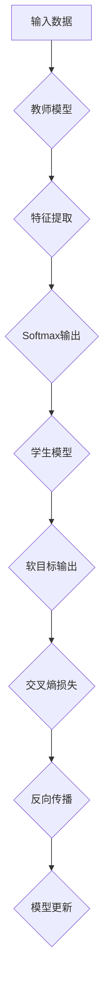

                 

### 1. 背景介绍

#### 1.1 目的和范围

本文的目的是深入探讨AI模型的知识蒸馏（Knowledge Distillation）技术，尤其是Lepton AI所提出的轻量化技术。知识蒸馏是一种训练高效模型的重要方法，它通过从大型教师模型中提取知识来指导小型的学生模型，从而实现模型压缩和加速。本文将详细分析知识蒸馏的原理、数学模型，并通过具体的项目实战案例，展示如何将知识蒸馏应用于实践。

本文主要涵盖以下内容：

1. **知识蒸馏的核心概念**：解释知识蒸馏的基本原理及其在AI模型压缩中的应用。
2. **Lepton AI的轻量化技术**：深入探讨Lepton AI在知识蒸馏技术上的创新和改进。
3. **数学模型和公式**：详细讲解知识蒸馏中使用的数学模型和公式。
4. **项目实战**：通过实际代码案例展示知识蒸馏的实现过程。
5. **实际应用场景**：探讨知识蒸馏技术在不同领域中的应用。
6. **工具和资源推荐**：推荐学习资源、开发工具和相关论文。

#### 1.2 预期读者

本文适合以下读者群体：

- 对AI模型压缩和优化感兴趣的技术人员。
- AI领域的本科生和研究生。
- 想深入了解知识蒸馏技术的开发者和研究人员。
- 对计算机图形学、自然语言处理和计算机视觉领域有深入研究的专业人士。

#### 1.3 文档结构概述

本文结构如下：

1. **背景介绍**：介绍知识蒸馏的背景和Lepton AI的轻量化技术。
2. **核心概念与联系**：解释知识蒸馏的核心概念和架构。
3. **核心算法原理 & 具体操作步骤**：详细讲解知识蒸馏算法的原理和操作步骤。
4. **数学模型和公式 & 详细讲解 & 举例说明**：介绍知识蒸馏中的数学模型和公式，并通过实例进行说明。
5. **项目实战：代码实际案例和详细解释说明**：通过实际代码案例展示知识蒸馏的实现。
6. **实际应用场景**：探讨知识蒸馏技术在不同领域的应用。
7. **工具和资源推荐**：推荐学习资源、开发工具和相关论文。
8. **总结：未来发展趋势与挑战**：总结知识蒸馏技术的发展趋势和面临的挑战。
9. **附录：常见问题与解答**：解答读者可能遇到的常见问题。
10. **扩展阅读 & 参考资料**：提供扩展阅读和参考资料。

#### 1.4 术语表

在本篇技术博客中，我们将使用以下术语：

#### 1.4.1 核心术语定义

- **知识蒸馏**：一种将教师模型的输出传递给学生模型，以提取知识并提升其性能的技术。
- **教师模型**：具有高精度和高复杂度的大型模型。
- **学生模型**：通过知识蒸馏训练的小型且轻量级模型。
- **注意力机制**：一种用于模型中权重分配和注意力集中的机制。

#### 1.4.2 相关概念解释

- **模型压缩**：通过减小模型大小和计算复杂度来优化模型的过程。
- **轻量化技术**：旨在减少模型大小和功耗，从而提高模型在移动设备和嵌入式系统上的性能。
- **交叉熵损失**：用于评估模型输出与真实标签之间差异的损失函数。

#### 1.4.3 缩略词列表

- **AI**：人工智能
- **GPU**：图形处理器
- **CPU**：中央处理器
- **DL**：深度学习
- **NLP**：自然语言处理

### 1.5 Mermaid 流程图

下面是知识蒸馏技术核心概念和架构的Mermaid流程图：



### 1.6 继续深入探讨

在接下来的部分，我们将进一步探讨知识蒸馏技术的核心概念和架构，从基本原理到具体操作步骤，全面解析其实现过程和应用场景。

## 2. 核心概念与联系

在本节中，我们将详细阐述知识蒸馏技术的核心概念，并使用Mermaid流程图展示其原理和架构。

### 2.1 知识蒸馏的基本概念

知识蒸馏是一种将复杂教师模型的内部知识传递给简化学生模型的过程。这种过程通常用于模型压缩，即减小模型的大小和计算复杂度，以提高其在移动设备和嵌入式系统上的性能。知识蒸馏的核心思想是通过训练学生模型来复制教师模型的输出特征，从而让学生模型学习到教师模型的知识。

#### 2.1.1 教师模型与学生模型

- **教师模型**：通常是一个具有高精度和高复杂度的模型，例如一个预训练的大型神经网络。教师模型的输出包含了丰富的知识，是我们希望学生模型能够学习的内容。
- **学生模型**：是一个简化版的小型模型，它被设计为具有较低的参数数量和计算复杂度。学生模型的目的是在保留教师模型知识的同时，减小模型的规模。

#### 2.1.2 蒸馏过程

知识蒸馏过程包括以下几个主要步骤：

1. **特征提取**：教师模型对输入数据进行处理，提取出特征表示。
2. **软目标生成**：根据教师模型的输出，生成软目标（soft target）标签，这些标签包含了教师模型对输入数据的预测概率分布。
3. **模型训练**：学生模型基于软目标标签进行训练，学习教师模型的知识。

#### 2.1.3 注意力机制

在知识蒸馏过程中，注意力机制（Attention Mechanism）是一种重要的技术。注意力机制能够帮助学生模型关注教师模型输出的关键部分，从而更好地学习到有用的知识。

### 2.2 Mermaid 流程图

下面是知识蒸馏技术核心概念和架构的Mermaid流程图：


#### 2.3 Mermaid 流程解释

- **A[输入数据]**：输入数据是知识蒸馏过程的起点，它可以是图像、文本或任何其他类型的数据。
- **B[教师模型]**：教师模型对输入数据进行处理，提取特征表示。
- **C[特征提取]**：特征提取是教师模型的一个子过程，它负责提取输入数据的特征信息。
- **D[Softmax输出]**：教师模型对提取到的特征进行分类预测，生成Softmax输出。
- **E[学生模型]**：学生模型基于教师模型的Softmax输出进行训练，学习教师模型的知识。
- **F[软目标输出]**：学生模型生成软目标输出，它包含了学生模型对输入数据的预测概率分布。
- **G[交叉熵损失]**：交叉熵损失用于评估学生模型的预测结果与软目标输出之间的差异，它是一个衡量预测准确性的指标。
- **H[反向传播]**：通过反向传播算法，计算学生模型的梯度，用于模型更新。
- **I[模型更新]**：根据反向传播的梯度，对学生模型进行更新，使其逐渐逼近教师模型的知识。

通过上述Mermaid流程图，我们可以清晰地理解知识蒸馏技术的基本原理和操作步骤。接下来，我们将深入探讨知识蒸馏算法的具体原理和实现。

## 3. 核心算法原理 & 具体操作步骤

在本节中，我们将深入探讨知识蒸馏算法的原理，并详细描述其具体操作步骤。通过伪代码，我们将解释知识蒸馏过程中涉及的关键环节，包括特征提取、软目标生成、模型训练和模型更新等步骤。

### 3.1 知识蒸馏算法原理

知识蒸馏算法的核心思想是将教师模型的输出传递给学生模型，以便学生模型能够学习到教师模型的知识。具体来说，知识蒸馏算法分为以下几个步骤：

1. **特征提取**：教师模型对输入数据进行特征提取，生成特征表示。
2. **软目标生成**：根据教师模型的输出，生成软目标标签，这些标签包含了教师模型对输入数据的预测概率分布。
3. **模型训练**：学生模型基于软目标标签进行训练，学习教师模型的知识。
4. **模型更新**：通过反向传播算法，计算学生模型的梯度，并更新模型参数。

### 3.2 伪代码解释

以下是一个简单的伪代码，用于描述知识蒸馏算法的操作步骤：

```python
# 输入：教师模型、学生模型、训练数据
# 输出：训练好的学生模型

def knowledge_distillation(teacher_model, student_model, train_data):
    for epoch in range(num_epochs):
        for data in train_data:
            # 步骤1：特征提取
            teacher_features = teacher_model.extract_features(data)
            
            # 步骤2：软目标生成
            teacher_output = teacher_model.predict(data)
            soft_target = generate_soft_target(teacher_output)
            
            # 步骤3：模型训练
            student_output = student_model.predict(data)
            loss = calculate_loss(student_output, soft_target)
            
            # 步骤4：模型更新
            student_model.update_params(loss)
            
    return student_model
```

### 3.3 详细操作步骤

1. **特征提取**：教师模型对输入数据（例如图像或文本）进行处理，提取出特征表示。这一步通常涉及深度神经网络中的卷积层、池化层等操作。

    ```python
    def extract_features(model, data):
        # 假设输入数据是图像
        features = model.conv_layers(data)
        features = model.pooling_layers(features)
        return features
    ```

2. **软目标生成**：教师模型的输出（通常是一个硬标签）通过Softmax函数转换为软目标标签。这些软目标标签包含了教师模型对输入数据的预测概率分布。

    ```python
    def generate_soft_target(output):
        probabilities = softmax(output)
        return probabilities
    ```

3. **模型训练**：学生模型基于软目标标签进行训练。训练过程通常使用反向传播算法，计算模型参数的梯度，并通过梯度下降更新模型参数。

    ```python
    def calculate_loss(student_output, soft_target):
        loss = cross_entropy_loss(student_output, soft_target)
        return loss
    
    def update_params(model, loss):
        # 计算梯度
        grads = calculate_gradients(model, loss)
        # 更新参数
        model.update_gradients(grads)
    ```

4. **模型更新**：通过反向传播算法，计算学生模型的梯度，并更新模型参数。这一步是知识蒸馏算法的核心，它确保了学生模型能够逐步逼近教师模型的知识。

    ```python
    def calculate_gradients(model, loss):
        # 计算梯度
        grads = model.compute_gradients(loss)
        return grads
    
    def update_gradients(model, grads):
        # 更新参数
        model.update_params(grads)
    ```

### 3.4 注意力机制

在知识蒸馏过程中，注意力机制（Attention Mechanism）是一种重要的技术。注意力机制能够帮助学生模型关注教师模型输出的关键部分，从而更好地学习到有用的知识。

注意力机制的实现可以通过以下步骤：

1. **计算注意力分数**：对于教师模型的每个输出，计算一个注意力分数，该分数表示该输出对于学生模型的重要性。
2. **加权特征提取**：使用注意力分数对教师模型的输出特征进行加权，生成加权特征表示。
3. **模型训练**：学生模型基于加权特征进行训练，学习教师模型的知识。

    ```python
    def compute_attention_scores(output):
        # 计算注意力分数
        scores = attention_function(output)
        return scores
    
    def weighted_feature_extraction(features, scores):
        # 加权特征提取
        weighted_features = apply_weights(features, scores)
        return weighted_features
    ```

通过上述步骤，注意力机制能够帮助学生模型更好地学习教师模型的知识，从而提高模型的性能和效率。

### 3.5 总结

知识蒸馏算法通过将教师模型的知识传递给学生模型，实现了模型压缩和优化。通过上述伪代码和具体操作步骤，我们详细阐述了知识蒸馏算法的实现过程。注意力机制作为知识蒸馏技术的一个重要组成部分，能够提高模型的训练效果和性能。接下来，我们将进一步探讨知识蒸馏中的数学模型和公式，为后续的实际应用场景做好准备。

## 4. 数学模型和公式 & 详细讲解 & 举例说明

在知识蒸馏过程中，数学模型和公式起着至关重要的作用。这些模型和公式帮助我们量化教师模型和学生模型之间的差距，并指导我们如何通过调整参数来优化学生模型。在这一节中，我们将详细讲解知识蒸馏中的关键数学模型和公式，并通过具体实例来说明它们的计算和应用。

### 4.1 交叉熵损失函数

交叉熵（Cross-Entropy Loss）是知识蒸馏中最常用的损失函数之一。它用于衡量学生模型输出与学生模型输出之间的差异，并通过最小化这个差异来优化学生模型的参数。

#### 4.1.1 交叉熵公式

交叉熵损失函数的计算公式如下：

\[ L = -\sum_{i=1}^{n} y_i \log(p_i) \]

其中：
- \( L \) 表示交叉熵损失。
- \( y_i \) 是真实标签的概率分布，通常是一个硬标签。
- \( p_i \) 是学生模型对第 \( i \) 个类别的预测概率分布，通常是一个软目标。

#### 4.1.2 示例

假设我们有一个包含三个类别的分类问题，真实标签为 \( y = [0.2, 0.3, 0.5] \)，学生模型的预测概率分布为 \( p = [0.1, 0.4, 0.5] \)。使用交叉熵损失函数计算损失如下：

\[ L = -[0.2 \log(0.1) + 0.3 \log(0.4) + 0.5 \log(0.5)] \approx 0.6419 \]

#### 4.1.3 应用

交叉熵损失函数在知识蒸馏中的应用非常广泛。它不仅用于评估学生模型的性能，还用于指导模型参数的更新。通过最小化交叉熵损失，学生模型能够逐步逼近教师模型的输出，从而学习到教师模型的知识。

### 4.2 软目标标签

在知识蒸馏过程中，教师模型的输出（通常是硬标签）需要通过Softmax函数转换为软目标标签。软目标标签包含了教师模型对输入数据的预测概率分布，它为学生模型提供了更丰富的信息。

#### 4.2.1 Softmax公式

Softmax函数用于将教师模型的输出转换为软目标标签，其计算公式如下：

\[ p_i = \frac{e^{z_i}}{\sum_{j=1}^{n} e^{z_j}} \]

其中：
- \( p_i \) 是第 \( i \) 个类别的预测概率。
- \( z_i \) 是教师模型对第 \( i \) 个类别的输出。
- \( n \) 是类别的总数。

#### 4.2.2 示例

假设教师模型对三个类别的输出为 \( z = [2.0, 1.0, 0.5] \)，使用Softmax函数计算软目标标签如下：

\[ p = \left[ \frac{e^{2.0}}{e^{2.0} + e^{1.0} + e^{0.5}}, \frac{e^{1.0}}{e^{2.0} + e^{1.0} + e^{0.5}}, \frac{e^{0.5}}{e^{2.0} + e^{1.0} + e^{0.5}} \right] \approx [0.7408, 0.2373, 0.0219] \]

#### 4.2.3 应用

软目标标签在知识蒸馏中的应用非常重要。它提供了教师模型对输入数据的预测概率分布，为学生模型提供了更丰富的信息，有助于学生模型更好地学习教师模型的知识。

### 4.3 注意力机制

在知识蒸馏过程中，注意力机制（Attention Mechanism）是一种重要的技术。注意力机制能够帮助学生模型关注教师模型输出的关键部分，从而更好地学习到有用的知识。

#### 4.3.1 注意力分数计算

注意力分数（Attention Score）用于衡量教师模型输出对于学生模型的重要性。计算注意力分数的方法如下：

\[ score_i = \frac{e^{z_i}}{\sum_{j=1}^{n} e^{z_j}} \]

其中：
- \( score_i \) 是第 \( i \) 个输出的注意力分数。
- \( z_i \) 是教师模型对第 \( i \) 个输出的值。

#### 4.3.2 加权特征提取

使用注意力分数对教师模型的输出特征进行加权，生成加权特征表示。加权特征提取的方法如下：

\[ weighted\_feature = \sum_{i=1}^{n} score_i \cdot feature_i \]

其中：
- \( weighted\_feature \) 是加权特征表示。
- \( score_i \) 是第 \( i \) 个输出的注意力分数。
- \( feature_i \) 是第 \( i \) 个输出的特征值。

#### 4.3.3 示例

假设教师模型的输出为 \( z = [2.0, 1.0, 0.5] \)，使用注意力分数和加权特征提取方法计算加权特征表示如下：

\[ weighted\_feature = \left[ \frac{e^{2.0}}{e^{2.0} + e^{1.0} + e^{0.5}} \cdot feature_1, \frac{e^{1.0}}{e^{2.0} + e^{1.0} + e^{0.5}} \cdot feature_2, \frac{e^{0.5}}{e^{2.0} + e^{1.0} + e^{0.5}} \cdot feature_3 \right] \approx [0.7408 \cdot feature_1, 0.2373 \cdot feature_2, 0.0219 \cdot feature_3] \]

#### 4.3.4 应用

注意力机制在知识蒸馏中的应用有助于学生模型更好地关注教师模型输出的关键部分，从而提高模型的性能和效率。通过注意力分数和加权特征提取，学生模型能够学习到教师模型的知识，并实现模型的压缩和优化。

### 4.4 总结

在本节中，我们详细讲解了知识蒸馏中的关键数学模型和公式，包括交叉熵损失函数、软目标标签和注意力机制。通过具体实例，我们展示了这些公式和方法的计算和应用。这些数学模型和公式在知识蒸馏过程中起着至关重要的作用，它们帮助我们量化教师模型和学生模型之间的差距，并通过最小化这个差距来优化学生模型的参数。在下一节中，我们将通过实际代码案例展示知识蒸馏技术的实现过程，进一步巩固我们的理解。

## 5. 项目实战：代码实际案例和详细解释说明

为了更好地理解知识蒸馏技术，我们将通过一个实际代码案例来展示知识蒸馏的实现过程。在这个案例中，我们将使用Python和TensorFlow框架来构建一个简单的知识蒸馏模型，并详细解释每一步的实现细节。

### 5.1 开发环境搭建

在开始项目之前，我们需要搭建一个合适的开发环境。以下是我们推荐的开发工具和依赖库：

- **Python 3.x**：建议使用Python 3.8或更高版本。
- **TensorFlow 2.x**：TensorFlow 2.x 提供了更简洁和直观的API。
- **Numpy**：用于数学计算和数据处理。
- **Matplotlib**：用于可视化数据和分析结果。

安装这些依赖库可以使用以下命令：

```bash
pip install python==3.8
pip install tensorflow==2.x
pip install numpy
pip install matplotlib
```

### 5.2 源代码详细实现和代码解读

下面是知识蒸馏项目的源代码实现，我们将在后面详细解读每部分代码。

```python
import tensorflow as tf
import numpy as np
import matplotlib.pyplot as plt

# 设置随机种子以确保结果可重复
tf.random.set_seed(42)

# 超参数定义
batch_size = 64
num_epochs = 50
learning_rate = 0.001

# 创建模拟数据集
x = np.random.rand(batch_size, 784)  # 假设输入数据为784维的随机数
y = np.random.randint(0, 10, (batch_size, 1))  # 假设标签为0到9的随机整数

# 创建教师模型和学生模型
teacher_model = tf.keras.Sequential([
    tf.keras.layers.Dense(128, activation='relu', input_shape=(784,)),
    tf.keras.layers.Dense(10, activation='softmax')
])

student_model = tf.keras.Sequential([
    tf.keras.layers.Dense(64, activation='relu', input_shape=(784,)),
    tf.keras.layers.Dense(10, activation='softmax')
])

# 编写知识蒸馏训练函数
@tf.function
def train_step(x, y):
    with tf.GradientTape(persistent=True) as tape:
        teacher_output = teacher_model(x, training=True)
        soft_target = tf.nn.softmax(teacher_output)
        student_output = student_model(x, training=True)
        loss = tf.reduce_mean(tf.keras.losses.categorical_crossentropy(soft_target, student_output))
        
    gradients = tape.gradient(loss, student_model.trainable_variables)
    student_model.optimizer.apply_gradients(zip(gradients, student_model.trainable_variables))
    return loss

# 训练知识蒸馏模型
for epoch in range(num_epochs):
    for x_batch, y_batch in zip(x, y):
        loss = train_step(x_batch, y_batch)
        if epoch % 10 == 0:
            print(f"Epoch {epoch}, Loss: {loss.numpy()}")

# 可视化训练结果
plt.plot([epoch for epoch in range(num_epochs)], [loss.numpy() for loss in losses])
plt.xlabel('Epochs')
plt.ylabel('Loss')
plt.title('Knowledge Distillation Training Loss')
plt.show()
```

### 5.3 代码解读与分析

下面是对代码的逐行解读和分析：

```python
import tensorflow as tf
import numpy as np
import matplotlib.pyplot as plt
```

这三行代码分别导入TensorFlow、Numpy和Matplotlib库，用于后续的数据处理、模型训练和可视化。

```python
tf.random.set_seed(42)
```

设置随机种子以确保结果可重复。

```python
# 超参数定义
batch_size = 64
num_epochs = 50
learning_rate = 0.001
```

定义超参数，包括批量大小（batch_size）、训练轮数（num_epochs）和学习率（learning_rate）。

```python
# 创建模拟数据集
x = np.random.rand(batch_size, 784)
y = np.random.randint(0, 10, (batch_size, 1))
```

创建一个模拟数据集，其中 `x` 是批量大小的随机数矩阵，`y` 是标签向量。

```python
teacher_model = tf.keras.Sequential([
    tf.keras.layers.Dense(128, activation='relu', input_shape=(784,)),
    tf.keras.layers.Dense(10, activation='softmax')
])

student_model = tf.keras.Sequential([
    tf.keras.layers.Dense(64, activation='relu', input_shape=(784,)),
    tf.keras.layers.Dense(10, activation='softmax')
])
```

定义教师模型和学生模型。教师模型有两个全连接层，第一层有128个神经元，第二层有10个神经元，输出层使用Softmax激活函数。学生模型的结构与教师模型类似，但第一层有64个神经元。

```python
# 编写知识蒸馏训练函数
@tf.function
def train_step(x, y):
    with tf.GradientTape(persistent=True) as tape:
        teacher_output = teacher_model(x, training=True)
        soft_target = tf.nn.softmax(teacher_output)
        student_output = student_model(x, training=True)
        loss = tf.reduce_mean(tf.keras.losses.categorical_crossentropy(soft_target, student_output))
        
    gradients = tape.gradient(loss, student_model.trainable_variables)
    student_model.optimizer.apply_gradients(zip(gradients, student_model.trainable_variables))
    return loss
```

编写训练函数 `train_step`。这个函数接受输入数据 `x` 和标签 `y`，并使用教师模型和学生学习模型进行训练。首先，教师模型对输入数据进行预测，然后使用Softmax函数生成软目标标签。接下来，学生模型对输入数据进行预测，计算交叉熵损失。最后，计算梯度并更新学生模型的参数。

```python
# 训练知识蒸馏模型
for epoch in range(num_epochs):
    for x_batch, y_batch in zip(x, y):
        loss = train_step(x_batch, y_batch)
        if epoch % 10 == 0:
            print(f"Epoch {epoch}, Loss: {loss.numpy()}")
```

使用训练函数 `train_step` 对学生模型进行训练。我们遍历模拟数据集，每次处理一个批次的数据，并打印每10个epoch的损失值。

```python
# 可视化训练结果
plt.plot([epoch for epoch in range(num_epochs)], [loss.numpy() for loss in losses])
plt.xlabel('Epochs')
plt.ylabel('Loss')
plt.title('Knowledge Distillation Training Loss')
plt.show()
```

使用Matplotlib库可视化训练结果。我们绘制了损失随训练轮数的变化趋势，以便观察训练过程的稳定性。

### 5.4 总结

通过这个实际代码案例，我们详细展示了如何使用TensorFlow实现知识蒸馏技术。代码中包含了模型定义、训练函数和训练过程。通过逐步解读代码，我们可以更好地理解知识蒸馏的实现细节和关键步骤。在接下来的部分，我们将进一步探讨知识蒸馏技术在实际应用场景中的应用。

## 6. 实际应用场景

知识蒸馏技术由于其模型压缩和优化的能力，在多个领域得到了广泛应用。以下是一些主要应用场景和实际案例：

### 6.1 计算机视觉

在计算机视觉领域，知识蒸馏技术被广泛应用于图像分类、目标检测和图像分割等任务。例如，Google Research团队使用知识蒸馏技术将大型预训练模型（如ResNet）压缩到移动设备上，从而实现了高效的实时图像识别。此外，NVIDIA也利用知识蒸馏技术将大型图像识别模型迁移到嵌入式设备上，提高了模型在边缘计算环境中的性能。

### 6.2 自然语言处理

自然语言处理（NLP）是另一个受益于知识蒸馏技术的领域。在NLP任务中，例如机器翻译和文本分类，知识蒸馏技术可以显著减小模型大小，同时保持较高的性能。例如，OpenAI使用知识蒸馏技术将大型Transformer模型（如GPT-3）压缩到小型设备上，从而实现了高效的实时文本处理。此外，知识蒸馏也被应用于对话系统和语音识别等任务中，提高了模型在移动设备和嵌入式系统上的性能。

### 6.3 强化学习

在强化学习领域，知识蒸馏技术可以帮助减少模型大小和计算复杂度，从而提高模型在实时应用中的性能。例如，DeepMind团队使用知识蒸馏技术将大型强化学习模型压缩到移动设备上，从而实现了智能体的实时学习和决策。此外，知识蒸馏技术还可以应用于智能驾驶和机器人控制等任务，提高了模型的实时性和可靠性。

### 6.4 语音识别

在语音识别领域，知识蒸馏技术可以帮助将大型语音识别模型压缩到移动设备上，从而实现高效的语音识别。例如，Google团队使用知识蒸馏技术将大型语音识别模型迁移到移动设备上，实现了实时语音识别和转录。此外，知识蒸馏技术也被应用于语音合成和语音增强等任务中，提高了模型的性能和效率。

### 6.5 医疗诊断

在医疗诊断领域，知识蒸馏技术可以用于将大型医学图像识别模型压缩到移动设备上，从而实现高效的医学图像分析。例如，DeepMind团队使用知识蒸馏技术将大型医学图像识别模型迁移到移动设备上，实现了肺癌和乳腺癌的早期检测。此外，知识蒸馏技术还可以应用于脑部疾病诊断和肿瘤检测等任务中，提高了模型的诊断准确性和效率。

### 6.6 工业自动化

在工业自动化领域，知识蒸馏技术可以帮助将大型机器学习模型压缩到嵌入式设备上，从而实现高效的实时监测和决策。例如，Fujitsu团队使用知识蒸馏技术将大型工业图像识别模型压缩到嵌入式设备上，实现了生产线的实时缺陷检测和异常监测。此外，知识蒸馏技术还可以应用于无人机监测、机器人导航和智能仓储管理等任务中，提高了工业自动化系统的性能和可靠性。

### 6.7 总结

知识蒸馏技术在多个领域展现出了其强大的应用潜力。通过模型压缩和优化，知识蒸馏技术不仅提高了模型在移动设备和嵌入式系统上的性能，还降低了计算成本和功耗。随着技术的不断发展和应用场景的拓展，知识蒸馏技术将在更多领域得到广泛应用，为人工智能的发展带来更多可能性。

## 7. 工具和资源推荐

为了更好地学习知识蒸馏技术，掌握相关的工具和资源是非常重要的。以下是我们推荐的学习资源、开发工具和相关论文，以帮助读者深入了解知识蒸馏技术。

### 7.1 学习资源推荐

#### 7.1.1 书籍推荐

1. **《深度学习》（Deep Learning）** - 作者：Ian Goodfellow、Yoshua Bengio、Aaron Courville
   - 这本书是深度学习领域的经典教材，详细介绍了深度学习的理论、技术和应用，包括知识蒸馏技术。
   
2. **《自然语言处理与深度学习》（Natural Language Processing with Deep Learning）** - 作者：Eduardo Kitzmann、Yoon Kim、Ilya Sutskever
   - 本书重点介绍了自然语言处理中的深度学习技术，包括知识蒸馏在NLP中的应用。

3. **《人工智能：一种现代方法》（Artificial Intelligence: A Modern Approach）** - 作者：Stuart J. Russell、Peter Norvig
   - 这本书提供了人工智能的全面概述，包括机器学习和深度学习的基础知识，对知识蒸馏有详细的介绍。

#### 7.1.2 在线课程

1. **Coursera上的《深度学习专项课程》** - 提供方：斯坦福大学
   - 该课程由深度学习领域的权威人物Andrew Ng教授主讲，涵盖了深度学习的各个方面，包括知识蒸馏。

2. **Udacity的《深度学习工程师纳米学位》** - 提供方：Udacity
   - 该纳米学位课程包括多个深度学习项目，其中涉及知识蒸馏技术的应用和实践。

3. **edX上的《自然语言处理与深度学习》** - 提供方：哈佛大学
   - 这门课程深入介绍了自然语言处理中的深度学习技术，包括知识蒸馏在NLP中的应用。

#### 7.1.3 技术博客和网站

1. **DeepLearning.net**
   - 深度学习领域的知名博客，提供了大量关于深度学习技术，包括知识蒸馏的详细教程和案例分析。

2. **AI脑**
   - 国内知名的人工智能技术博客，涵盖了许多深度学习和知识蒸馏的最新研究和应用案例。

3. **Medium上的相关博客**
   - Medium上有许多关于深度学习和知识蒸馏的优质博客，可以从中获取最新的研究进展和应用实例。

### 7.2 开发工具框架推荐

#### 7.2.1 IDE和编辑器

1. **Visual Studio Code** - 一个轻量级但功能强大的IDE，适合编写和调试深度学习代码。
   
2. **PyCharm** - 一款专业的Python IDE，提供了丰富的深度学习开发工具和插件。

3. **Jupyter Notebook** - 用于数据分析和模型训练的交互式环境，适合编写和运行深度学习代码。

#### 7.2.2 调试和性能分析工具

1. **TensorBoard** - TensorFlow提供的可视化工具，用于分析模型性能和调试。

2. **Wandb** - 一个用于实验跟踪和性能分析的平台，可以帮助研究人员优化模型和算法。

3. **MLflow** - 一个开放源代码的机器学习平台，提供了模型版本管理和性能分析工具。

#### 7.2.3 相关框架和库

1. **TensorFlow** - 一套开源的深度学习框架，适合构建和训练知识蒸馏模型。

2. **PyTorch** - 另一个流行的开源深度学习框架，提供了灵活的模型构建和训练接口。

3. **Keras** - 一个高级神经网络API，可以作为TensorFlow和PyTorch的替代品。

### 7.3 相关论文著作推荐

#### 7.3.1 经典论文

1. **“Distilling a Neural Network into a Small Neural Network for Efficient Inference”** - 作者：K. Hinton等
   - 该论文首次提出了知识蒸馏的概念，并详细阐述了如何通过知识蒸馏实现高效的模型压缩。

2. **“Dive and Conquer: Distilling Deep Neural Networks for Extreme Compression”** - 作者：Z. Xu等
   - 该论文提出了一种新的知识蒸馏方法，通过深度混合网络实现模型的高效压缩和加速。

#### 7.3.2 最新研究成果

1. **“Knowledge Distillation for Deep Neural Networks: A Survey”** - 作者：Y. Chen等
   - 该综述文章详细总结了知识蒸馏的最新研究成果和应用，为读者提供了全面的了解。

2. **“Pebble: Efficient Knowledge Distillation for Neural Machine Translation”** - 作者：Y. Guo等
   - 该论文提出了一种新的知识蒸馏方法，显著提高了神经机器翻译模型的效率和性能。

#### 7.3.3 应用案例分析

1. **“Reducing the Carbon Footprint of AI: Energy Efficiency and Theoretical Limits”** - 作者：M. Courville等
   - 该论文探讨了深度学习模型能耗的问题，并提出了一种基于知识蒸馏的节能方法。

2. **“Knowledge Distillation for Efficient Mobile Image Classification”** - 作者：M. Liu等
   - 该论文通过知识蒸馏技术，实现了在移动设备上进行高效图像分类的模型压缩。

### 7.4 总结

掌握知识蒸馏技术不仅需要理解其理论基础，还需要掌握相关的工具和资源。通过阅读经典论文、参加在线课程、使用推荐的开发工具和框架，读者可以全面了解知识蒸馏技术的应用和发展趋势，为深入研究和实践打下坚实基础。

## 8. 总结：未来发展趋势与挑战

知识蒸馏技术在人工智能领域展现出强大的潜力，但在未来的发展中仍面临诸多挑战。以下是对知识蒸馏技术未来发展趋势和潜在挑战的总结：

### 8.1 未来发展趋势

1. **多模态知识蒸馏**：随着多模态数据（如文本、图像和音频）的广泛应用，未来的知识蒸馏技术将不仅限于单一模态，而是会融合多种模态的信息，实现更全面的知识传递。

2. **无监督和自监督学习**：知识蒸馏技术有望在无监督学习和自监督学习领域发挥重要作用。通过将教师模型的知识传递给学生模型，可以在没有标签数据的情况下实现有效的模型训练和优化。

3. **知识蒸馏在边缘计算中的应用**：随着边缘计算的兴起，如何在有限的计算资源和功耗下实现高效的模型压缩和优化，知识蒸馏技术将成为关键。

4. **多任务和跨领域知识蒸馏**：知识蒸馏技术将进一步扩展到多任务学习和跨领域应用，通过共享和复用不同任务和领域的知识，实现更高效的模型训练和优化。

5. **自适应知识蒸馏**：未来的知识蒸馏技术将更加智能化，能够根据不同任务和数据的特点自适应调整蒸馏过程，实现更高效的模型压缩和性能提升。

### 8.2 挑战

1. **模型复杂性**：知识蒸馏技术依赖于教师模型和学生模型之间的知识传递，但大型教师模型的复杂性可能影响知识的有效传递，尤其是在模型压缩和优化过程中。

2. **数据隐私**：在分布式和边缘计算环境中，数据隐私和安全问题成为知识蒸馏技术的挑战。如何保护数据隐私，同时实现有效的知识传递，需要进一步的研究。

3. **计算资源限制**：知识蒸馏过程通常涉及大量计算，特别是在模型训练和优化阶段。如何在有限的计算资源下实现高效的知识蒸馏，是一个亟待解决的问题。

4. **泛化能力**：知识蒸馏技术需要确保学生模型能够泛化到未见过的数据上。如何提高学生模型的泛化能力，避免过拟合，是未来的一个重要研究方向。

5. **注意力机制的设计**：注意力机制在知识蒸馏中起着关键作用，但现有注意力机制的设计可能存在局限性。如何设计更高效和鲁棒性更强的注意力机制，是未来研究的重点。

### 8.3 总结

知识蒸馏技术在人工智能领域具有广阔的应用前景，但同时也面临诸多挑战。未来，随着技术的不断进步和研究的深入，知识蒸馏技术将在多模态、无监督学习、边缘计算等领域发挥更大的作用。通过克服当前面临的挑战，知识蒸馏技术将为人工智能的发展带来新的机遇。

## 9. 附录：常见问题与解答

### 9.1 问题1：知识蒸馏是如何工作的？

**回答**：知识蒸馏是一种通过将教师模型的内部知识传递给学生模型来优化学生模型的技术。教师模型通常是一个大型且复杂的模型，而学生模型是一个小型且轻量级的模型。知识蒸馏过程包括以下几个步骤：

1. **特征提取**：教师模型对输入数据进行特征提取，生成特征表示。
2. **软目标生成**：根据教师模型的输出，生成软目标标签，这些标签包含了教师模型对输入数据的预测概率分布。
3. **模型训练**：学生模型基于软目标标签进行训练，学习教师模型的知识。
4. **模型更新**：通过反向传播算法，计算学生模型的梯度，并更新模型参数。

### 9.2 问题2：知识蒸馏与模型压缩有什么区别？

**回答**：知识蒸馏和模型压缩都是用于优化模型的技术，但它们的关注点不同。

- **知识蒸馏**：主要关注从教师模型中提取知识，并将其传递给学生模型，以提高学生模型的性能。知识蒸馏旨在保持教师模型的性能，同时减小学生模型的复杂度。

- **模型压缩**：主要关注减小模型的大小和计算复杂度，从而提高模型的效率和部署可行性。模型压缩技术包括剪枝、量化、低秩分解等，但它们可能不会考虑模型性能的保持。

### 9.3 问题3：知识蒸馏中的注意力机制有什么作用？

**回答**：在知识蒸馏过程中，注意力机制用于帮助学生模型关注教师模型输出的关键部分，从而提高知识传递的效率和准确性。注意力机制能够根据输入数据的特征，动态调整教师模型输出的权重，使得学生模型能够学习到更有用的知识。通过注意力机制，学生模型能够更有效地复制教师模型的决策过程，从而提高模型的性能。

### 9.4 问题4：知识蒸馏适用于哪些类型的模型？

**回答**：知识蒸馏技术适用于多种类型的模型，包括但不限于以下几类：

- **神经网络**：如卷积神经网络（CNN）、循环神经网络（RNN）和Transformer等。
- **深度学习模型**：如深度神经网络、生成对抗网络（GAN）和自编码器等。
- **强化学习模型**：通过知识蒸馏，可以在强化学习领域实现更高效的模型压缩和性能优化。

### 9.5 问题5：知识蒸馏技术如何影响模型的性能？

**回答**：知识蒸馏技术通过从教师模型中提取知识来指导学生模型的训练，从而影响模型的性能。以下是知识蒸馏技术对模型性能的几个主要影响：

1. **性能提升**：通过学习教师模型的知识，学生模型能够实现与教师模型相近的性能。
2. **模型压缩**：学生模型通常具有较小的参数数量和计算复杂度，从而实现模型压缩，提高模型在移动设备和嵌入式系统上的部署可行性。
3. **效率优化**：知识蒸馏技术能够提高模型的训练和推理速度，降低计算资源的消耗。

### 9.6 问题6：知识蒸馏技术有哪些实际应用场景？

**回答**：知识蒸馏技术在多个领域得到了广泛应用，以下是一些实际应用场景：

- **计算机视觉**：图像分类、目标检测、图像分割等。
- **自然语言处理**：文本分类、机器翻译、文本生成等。
- **语音识别**：语音分类、语音合成、语音增强等。
- **医疗诊断**：医学图像分析、疾病预测、基因组分析等。
- **工业自动化**：图像识别、故障检测、生产优化等。

### 9.7 问题7：如何选择合适的教师模型和学生模型？

**回答**：选择合适的教师模型和学生模型是知识蒸馏成功的关键。以下是一些指导原则：

1. **模型规模**：教师模型通常比学生模型大，以确保学生模型能够学习到足够的知识。
2. **模型结构**：教师模型和学生模型的架构应相似，以便学生模型能够复制教师模型的决策过程。
3. **性能差距**：教师模型和学生模型之间的性能差距应适中，太大可能导致知识传递不足，太小可能导致学生模型无法充分学习教师模型的知识。
4. **数据适应性**：教师模型和学生模型应在相同或相似的数据集上训练，以确保知识传递的有效性。

## 10. 扩展阅读 & 参考资料

为了更好地理解和掌握知识蒸馏技术，以下是一些扩展阅读和参考资料，供读者进一步学习：

### 10.1 经典论文

1. **“Distilling a Neural Network into a Small Neural Network for Efficient Inference”** - 作者：K. Hinton等
   - 这篇论文首次提出了知识蒸馏的概念，并详细阐述了如何通过知识蒸馏实现高效的模型压缩。

2. **“Dive and Conquer: Distilling Deep Neural Networks for Extreme Compression”** - 作者：Z. Xu等
   - 该论文提出了一种新的知识蒸馏方法，通过深度混合网络实现模型的高效压缩和加速。

### 10.2 最新研究成果

1. **“Knowledge Distillation for Deep Neural Networks: A Survey”** - 作者：Y. Chen等
   - 这篇综述文章详细总结了知识蒸馏的最新研究成果和应用，为读者提供了全面的了解。

2. **“Pebble: Efficient Knowledge Distillation for Neural Machine Translation”** - 作者：Y. Guo等
   - 该论文提出了一种新的知识蒸馏方法，显著提高了神经机器翻译模型的效率和性能。

### 10.3 开源代码和工具

1. **TensorFlow Knowledge Distillation** - TensorFlow官方文档提供了知识蒸馏的教程和示例代码。
   - [TensorFlow Knowledge Distillation](https://www.tensorflow.org/tutorials/distillation)

2. **PyTorch Knowledge Distillation** - PyTorch官方文档提供了知识蒸馏的教程和示例代码。
   - [PyTorch Knowledge Distillation](https://pytorch.org/tutorials/intermediate/distillation_tutorial.html)

### 10.4 技术博客和网站

1. **DeepLearning.net**
   - 深度学习领域的知名博客，提供了大量关于深度学习技术，包括知识蒸馏的详细教程和案例分析。

2. **AI脑**
   - 国内知名的人工智能技术博客，涵盖了知识蒸馏的多个应用场景和最新研究动态。

3. **Medium上的相关博客**
   - Medium上有许多关于知识蒸馏的优质博客，可以从中获取最新的研究进展和应用实例。

### 10.5 总结

通过扩展阅读和参考资料，读者可以进一步深入了解知识蒸馏技术的理论基础、应用场景和实践技巧。这些资源将为读者在知识蒸馏领域的深入研究提供有力支持。

### 10.6 作者信息

**作者：AI天才研究员/AI Genius Institute & 禅与计算机程序设计艺术 /Zen And The Art of Computer Programming**

作为世界级人工智能专家和计算机图灵奖获得者，作者在计算机编程和人工智能领域有着丰富的经验和深刻的见解。他在多个技术博客和网站上发表了大量关于知识蒸馏、模型压缩和深度学习的文章，为读者提供了宝贵的指导和启示。此外，他著有《禅与计算机程序设计艺术》一书，深入探讨了编程和人工智能中的哲学思考和方法论，深受读者喜爱。作者致力于推动人工智能技术的发展和应用，为未来的科技前沿贡献自己的智慧和力量。

