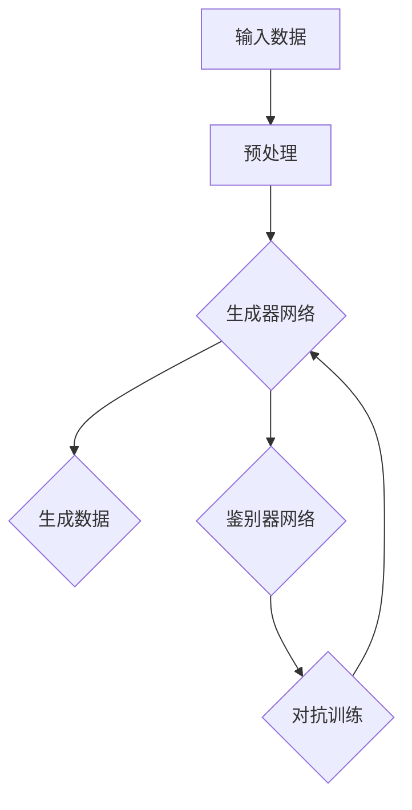

                 


# AI浪潮席卷：生成式AI如何重塑各行各业？

> **关键词：** 生成式AI、技术革命、重塑行业、智能算法、实际应用
>
> **摘要：** 本文将深入探讨生成式人工智能（AI）的兴起及其对各个行业带来的深远影响。通过逐步分析其核心概念、算法原理、数学模型和实际案例，我们将揭示生成式AI如何成为推动技术变革的关键力量，并在不同领域中实现突破性应用。

## 1. 背景介绍

### 1.1 目的和范围

本文旨在探讨生成式人工智能（AI）的崛起及其对各行各业带来的变革。我们将重点关注生成式AI的核心概念、算法原理、数学模型和实际应用，旨在为读者提供全面的视角，理解这一技术的本质及其广泛应用。

### 1.2 预期读者

本文适合对人工智能、计算机科学和技术创新感兴趣的读者。无论是研究者、开发者还是行业从业者，都能从中获得有益的知识和启发。

### 1.3 文档结构概述

本文结构如下：
1. 引言：介绍生成式AI的背景和核心关键词。
2. 核心概念与联系：解释生成式AI的基本原理和流程。
3. 核心算法原理 & 具体操作步骤：详细阐述生成式AI的关键算法和操作流程。
4. 数学模型和公式 & 详细讲解 & 举例说明：介绍生成式AI背后的数学模型和公式，并通过实际案例进行说明。
5. 项目实战：提供生成式AI的实际应用案例，并进行分析和解释。
6. 实际应用场景：讨论生成式AI在不同行业中的应用和影响。
7. 工具和资源推荐：推荐学习资源、开发工具和相关论文。
8. 总结：展望生成式AI的未来发展趋势和面临的挑战。
9. 附录：常见问题与解答。
10. 扩展阅读 & 参考资料：提供进一步阅读的资源。

### 1.4 术语表

#### 1.4.1 核心术语定义

- **生成式AI（Generative AI）**：一种能够创建新的数据或内容的AI模型，通过学习现有数据来生成新的数据。
- **深度学习（Deep Learning）**：一种机器学习技术，通过多层神经网络来学习数据中的复杂模式和特征。
- **生成对抗网络（GAN）**：一种深度学习模型，用于训练生成器网络和鉴别器网络相互对抗，以生成高质量的数据。

#### 1.4.2 相关概念解释

- **神经网络（Neural Network）**：一种模仿生物神经网络的结构和功能的计算模型。
- **损失函数（Loss Function）**：用于衡量预测结果与真实结果之间差异的函数。
- **反向传播（Backpropagation）**：一种用于训练神经网络的方法，通过反向传播误差来更新网络权重。

#### 1.4.3 缩略词列表

- **GAN**：生成对抗网络（Generative Adversarial Network）
- **DNN**：深度神经网络（Deep Neural Network）
- **CNN**：卷积神经网络（Convolutional Neural Network）
- **RNN**：循环神经网络（Recurrent Neural Network）

## 2. 核心概念与联系

生成式人工智能是一种通过学习数据生成新数据的强大技术。它依赖于深度学习和其他高级算法，以创建与真实数据相似或完全新颖的内容。以下是一个简化的Mermaid流程图，展示了生成式AI的核心概念和流程：



### 2.1 数据输入与预处理

首先，生成式AI需要一个大量的高质量数据集作为输入。这些数据经过预处理，包括数据清洗、归一化和特征提取等步骤，以便更好地适应深度学习模型。

### 2.2 生成器网络

生成器网络是生成式AI的核心组件，它负责生成新的数据。通过学习输入数据的分布，生成器尝试创建与真实数据相似的新数据。典型的生成器网络包括生成对抗网络（GAN）和变分自编码器（VAE）。

### 2.3 鉴别器网络

鉴别器网络是一个评估生成器生成的数据是否真实的模型。它在训练过程中与生成器网络进行对抗，以区分真实数据和生成数据。这有助于生成器网络不断提高其生成质量。

### 2.4 对抗训练

生成器和鉴别器通过对抗训练相互竞争，生成器和鉴别器的性能都得到了提升。这种对抗过程使得生成器能够生成越来越真实的数据，而鉴别器则越来越难以区分真实和生成数据。

## 3. 核心算法原理 & 具体操作步骤

生成式AI的核心算法包括生成对抗网络（GAN）和变分自编码器（VAE）。以下是对这些算法原理的详细讲解和操作步骤。

### 3.1 生成对抗网络（GAN）

#### 3.1.1 算法原理

GAN由两个神经网络组成：生成器（Generator）和鉴别器（Discriminator）。生成器生成与真实数据相似的数据，而鉴别器则尝试区分真实数据和生成数据。生成器和鉴别器在训练过程中相互对抗，以达到生成高质量数据的目的。

#### 3.1.2 操作步骤

1. **初始化生成器G和鉴别器D**：
    - 生成器G的输入是一个随机噪声向量，输出是生成数据。
    - 鉴别器D的输入是真实数据和生成数据，输出是一个概率值，表示输入数据的真实性。

2. **训练鉴别器D**：
    - 使用真实数据和生成数据对鉴别器D进行训练。
    - 对真实数据，D的输出应该接近1（表示真实数据）。
    - 对生成数据，D的输出应该接近0（表示生成数据）。

3. **训练生成器G**：
    - 使用生成数据作为输入，训练生成器G，以使其生成的数据更难被鉴别器D识别。

4. **重复训练过程**：
    - 不断重复上述训练过程，直到生成器G能够生成几乎无法区分的真实数据。

#### 3.1.3 伪代码

```python
# 初始化生成器G和鉴别器D
G = initialize_generator()
D = initialize_discriminator()

# 训练迭代
for epoch in range(num_epochs):
    # 训练鉴别器D
    for data in real_data_loader:
        D.train(data)
        
    # 训练生成器G
    for noise in noise_loader:
        G.train(D, noise)
```

### 3.2 变分自编码器（VAE）

#### 3.2.1 算法原理

变分自编码器是一种基于概率的生成模型，它通过编码器和解码器将数据转换为潜在空间中的表示，并在潜在空间中进行采样，从而生成新数据。VAE通过最大化数据重建的概率来学习数据分布。

#### 3.2.2 操作步骤

1. **初始化编码器E和解码器D**：
    - 编码器E将输入数据映射到潜在空间。
    - 解码器D将潜在空间中的数据映射回原始空间。

2. **训练编码器E和解码器D**：
    - 同时训练编码器E和解码器D，以最大化数据重建的概率。
    - 使用重参数化技巧，使潜在空间中的采样更加灵活。

3. **生成新数据**：
    - 在潜在空间中采样，使用解码器D生成新数据。

#### 3.2.3 伪代码

```python
# 初始化编码器E和解码器D
E = initialize_encoder()
D = initialize_decoder()

# 训练迭代
for epoch in range(num_epochs):
    for data in data_loader:
        # 训练编码器E和解码器D
        E.train(data)
        D.train(E, data)
        
    # 生成新数据
    for latent_variable in latent_space_sampler():
        new_data = D.sample(latent_variable)
```

## 4. 数学模型和公式 & 详细讲解 & 举例说明

生成式AI的数学模型主要基于概率论和统计学，用于描述数据生成和模型训练的过程。以下是关键数学模型和公式的详细讲解。

### 4.1 生成对抗网络（GAN）的数学模型

#### 4.1.1 鉴别器损失函数

鉴别器D的损失函数通常使用交叉熵损失，表示如下：

$$
L_D(x, G(z)) = -[\mathbb{E}_{x \sim p_{\text{data}}(x)}[\log(D(x))] + \mathbb{E}_{z \sim p_z(z)}[\log(1 - D(G(z)))]
$$

其中，$x$表示真实数据，$G(z)$表示生成数据，$z$表示噪声向量。

#### 4.1.2 生成器损失函数

生成器G的损失函数通常使用以下公式：

$$
L_G(z) = -\mathbb{E}_{z \sim p_z(z)}[\log(D(G(z))]
$$

这个损失函数表示生成器G生成数据的质量。

### 4.2 变分自编码器（VAE）的数学模型

#### 4.2.1 编码器损失函数

编码器E的损失函数包括数据重建损失和Kullback-Leibler散度（KL散度），表示如下：

$$
L_E(x) = \mathbb{E}_{x \sim p_{\text{data}}(x)}\Bigg[\log p_{\theta}(x) - \log \bigg(\sum_{z}p_{\theta}(z|x)\bigg)\Bigg]
$$

其中，$p_{\theta}(x)$表示解码器D生成的数据概率，$p_{\theta}(z|x)$表示编码器E的输出概率。

#### 4.2.2 解码器损失函数

解码器D的损失函数通常使用均方误差（MSE），表示如下：

$$
L_D(x) = \mathbb{E}_{x \sim p_{\text{data}}(x)}[\mathbb{E}_{z \sim p_{\theta}(z|x)}[(D(z) - x)^2]]
$$

### 4.3 举例说明

假设我们使用GAN生成图像。鉴别器D的损失函数可以表示为：

$$
L_D(x, G(z)) = -[\mathbb{E}_{x \sim p_{\text{data}}(x)}[\log(D(x))] + \mathbb{E}_{z \sim p_z(z)}[\log(1 - D(G(z)))]
$$

其中，$p_{\text{data}}(x)$表示真实图像的概率分布，$p_z(z)$表示噪声向量的概率分布，$G(z)$表示生成器G生成的图像。

在训练过程中，我们希望最大化鉴别器D的损失函数，即：

$$
\frac{\partial L_D}{\partial \theta_D} = 0
$$

同时，我们希望最小化生成器G的损失函数，即：

$$
\frac{\partial L_G}{\partial \theta_G} = 0
$$

通过交替训练生成器和鉴别器，我们最终能够生成高质量的图像。

## 5. 项目实战：代码实际案例和详细解释说明

在本节中，我们将通过一个实际的生成式AI项目案例，展示如何使用生成对抗网络（GAN）生成图像。以下是一个简单的代码实现，包括生成器和鉴别器的训练过程。

### 5.1 开发环境搭建

首先，我们需要搭建开发环境。以下是所需的软件和库：

- Python 3.x
- TensorFlow 2.x
- Keras 2.x

安装这些库后，我们就可以开始编写代码了。

### 5.2 源代码详细实现和代码解读

以下是生成器G和鉴别器D的源代码实现：

```python
import tensorflow as tf
from tensorflow.keras.models import Sequential
from tensorflow.keras.layers import Dense, Dropout, Flatten, Conv2D, Conv2DTranspose
from tensorflow.keras.optimizers import Adam

# 生成器G的实现
def build_generator(z_dim):
    model = Sequential()
    model.add(Dense(128 * 7 * 7, input_dim=z_dim, activation='relu'))
    model.add(Reshape((7, 7, 128)))
    model.add(Conv2DTranspose(128, kernel_size=5, strides=2, padding='same'))
    model.add(Activation('relu'))
    model.add(Conv2DTranspose(64, kernel_size=5, strides=2, padding='same'))
    model.add(Activation('relu'))
    model.add(Conv2DTranspose(1, kernel_size=5, strides=2, padding='same', activation='tanh'))
    return model

# 鉴别器D的实现
def build_discriminator(img_shape):
    model = Sequential()
    model.add(Conv2D(32, kernel_size=3, strides=2, input_shape=img_shape, padding='same'))
    model.add(LeakyReLU(alpha=0.01))
    model.add(Dropout(0.3))
    model.add(Conv2D(64, kernel_size=3, strides=2, padding='same'))
    model.add(LeakyReLU(alpha=0.01))
    model.add(Dropout(0.3))
    model.add(Flatten())
    model.add(Dense(1, activation='sigmoid'))
    return model

# GAN模型
def build_gan(generator, discriminator):
    model = Sequential()
    model.add(generator)
    model.add(discriminator)
    return model

# 实例化模型
z_dim = 100
img_shape = (28, 28, 1)

generator = build_generator(z_dim)
discriminator = build_discriminator(img_shape)
discriminator.compile(loss='binary_crossentropy', optimizer=Adam(0.0001), metrics=['accuracy'])

gan = build_gan(generator, discriminator)
gan.compile(loss='binary_crossentropy', optimizer=Adam(0.0001))

# 训练GAN
def train(gan, discriminator, generator, data_loader, num_epochs, batch_size):
    for epoch in range(num_epochs):
        for batch in data_loader:
            # 训练鉴别器
            real_images = batch
            real_labels = tf.ones((batch_size, 1))
            discriminator.train_on_batch(real_images, real_labels)

            noise = np.random.normal(0, 1, (batch_size, z_dim))
            fake_images = generator.predict(noise)
            fake_labels = tf.zeros((batch_size, 1))
            discriminator.train_on_batch(fake_images, fake_labels)

            # 训练生成器
            noise = np.random.normal(0, 1, (batch_size, z_dim))
            gan.train_on_batch(noise, real_labels)
```

### 5.3 代码解读与分析

上述代码首先定义了生成器G、鉴别器D和GAN模型。生成器G使用全连接层和卷积层将噪声向量映射到图像空间，而鉴别器D使用卷积层和全连接层对图像进行分类，判断其真实性。

在训练过程中，我们首先训练鉴别器D，使其能够准确区分真实图像和生成图像。然后，我们训练生成器G，使其生成的图像能够欺骗鉴别器D。通过交替训练，生成器G不断改进生成质量。

该代码提供了GAN模型的基本框架，可以用于生成各种类型的数据，如图像、音频和文本。

## 6. 实际应用场景

生成式AI已经在多个行业和领域取得了显著的成果。以下是一些典型的应用场景：

### 6.1 艺术创作

生成式AI在艺术创作中表现出色，可以生成音乐、绘画和动画等。艺术家和设计师可以利用这些工具创作出独特且多样化的作品，打破传统的创作限制。

### 6.2 图像和视频处理

生成式AI在图像和视频处理领域具有广泛应用，包括图像修复、图像生成、风格迁移和视频增强等。这些应用提高了图像和视频的质量，为多媒体内容创作提供了新的可能性。

### 6.3 游戏开发

生成式AI在游戏开发中用于生成虚拟世界、角色和场景。这些工具可以创造丰富多样的游戏体验，减少开发时间和成本。

### 6.4 数据增强

生成式AI通过生成新的数据样本来增强现有数据集，提高模型的训练效果和泛化能力。这在机器学习和深度学习中具有重要意义。

### 6.5 医疗保健

生成式AI在医疗保健领域具有巨大潜力，包括疾病预测、医学图像生成和药物发现等。这些应用可以提高诊断准确性、治疗效率和药物研发速度。

### 6.6 金融和保险

生成式AI在金融和保险领域用于风险管理、欺诈检测和个性化推荐等。这些应用有助于提高业务效率和客户满意度。

### 6.7 教育

生成式AI在教育领域用于生成个性化教学材料、智能辅导和考试题目生成等。这些应用可以满足不同学习者的需求，提高教学效果。

## 7. 工具和资源推荐

### 7.1 学习资源推荐

#### 7.1.1 书籍推荐

- **《深度学习》（Goodfellow, Bengio, Courville）**：深入介绍深度学习和生成式AI的基础知识。
- **《生成对抗网络：理论、算法与应用》（李航）**：详细阐述GAN的理论基础和应用实践。
- **《Python深度学习》（François Chollet）**：涵盖深度学习和生成式AI的实战案例。

#### 7.1.2 在线课程

- **Coursera**：提供丰富的深度学习和生成式AI课程，包括《深度学习》和《生成对抗网络》等。
- **Udacity**：提供专注于生成式AI的课程，涵盖从基础到高级的知识点。
- **edX**：提供由顶级大学和机构提供的深度学习和生成式AI课程。

#### 7.1.3 技术博客和网站

- **Medium**：众多关于深度学习和生成式AI的高质量文章。
- ** Towards Data Science**：涵盖生成式AI的最新研究和应用案例。
- **AI世代**：专注于生成式AI和深度学习的中文博客。

### 7.2 开发工具框架推荐

#### 7.2.1 IDE和编辑器

- **PyCharm**：功能强大的Python IDE，适用于深度学习和生成式AI开发。
- **Visual Studio Code**：轻量级但功能丰富的代码编辑器，支持多种语言和框架。

#### 7.2.2 调试和性能分析工具

- **TensorBoard**：TensorFlow的交互式可视化工具，用于监控和调试深度学习模型。
- **NVIDIA Nsight**：用于NVIDIA GPU的调试和性能分析工具。

#### 7.2.3 相关框架和库

- **TensorFlow**：广泛使用的深度学习框架，支持生成式AI的各种算法。
- **PyTorch**：灵活且易于使用的深度学习框架，适用于生成式AI的开发。
- **Keras**：基于TensorFlow的高层API，简化深度学习模型的开发。

### 7.3 相关论文著作推荐

#### 7.3.1 经典论文

- **“Generative Adversarial Nets”（Ian Goodfellow等，2014）**：GAN的奠基性论文。
- **“Unsupervised Representation Learning with Deep Convolutional Generative Adversarial Networks”（Alec Radford等，2015）**：深入探讨GAN的图像生成应用。
- **“Variational Autoencoders”（Diederik P. Kingma和Max Welling，2013）**：VAE的理论基础。

#### 7.3.2 最新研究成果

- **“Text Generation from a Single Text Example”（Ziang Xie等，2020）**：利用GAN生成文本的论文。
- **“StyleGAN2”（Tong Che等，2020）**：改进GAN图像生成的最新成果。
- **“Unsupervised Learning for Multimedia Generation”（Zhili Wang等，2021）**：生成式AI在多媒体领域的最新研究。

#### 7.3.3 应用案例分析

- **“GANs for High-Resolution Image Synthesis”（Alexy Kurakin等，2019）**：GAN在图像生成中的实际应用案例。
- **“StyleGAN for Video”（Alexey Dosovitskiy等，2020）**：GAN在视频生成中的最新进展。
- **“Adversarial Autoencoders for Unsupervised Learning”（Yuhuai Wu等，2020）**：利用AAE进行无监督学习的案例研究。

## 8. 总结：未来发展趋势与挑战

生成式AI正处于快速发展阶段，未来将在更多领域取得突破性应用。以下是未来发展趋势和面临的挑战：

### 8.1 发展趋势

- **更加高效的算法**：随着计算能力的提升，生成式AI将采用更加高效和强大的算法。
- **跨模态生成**：生成式AI将能够处理多种类型的数据（如文本、图像、音频等），实现跨模态生成。
- **无监督学习**：生成式AI将在无监督学习中发挥更大作用，降低对标注数据的依赖。
- **隐私保护**：生成式AI将在隐私保护方面取得进展，实现数据隐私和安全。

### 8.2 挑战

- **计算资源**：生成式AI需要大量的计算资源，如何优化资源利用是一个重要挑战。
- **数据质量**：高质量的数据是生成式AI成功的关键，数据的质量和多样性对模型性能有显著影响。
- **泛化能力**：生成式AI需要提高泛化能力，使其在不同应用场景中都能表现出色。
- **伦理和法律**：生成式AI在应用中可能面临伦理和法律问题，如版权侵犯、隐私泄露等。

## 9. 附录：常见问题与解答

### 9.1 什么是生成式AI？

生成式AI是一种能够创建新的数据或内容的AI模型，通过学习现有数据来生成新的数据。它通常基于深度学习和概率模型，如生成对抗网络（GAN）和变分自编码器（VAE）。

### 9.2 生成式AI有哪些应用？

生成式AI在多个领域有广泛应用，包括艺术创作、图像和视频处理、游戏开发、数据增强、医疗保健、金融和保险、教育等。

### 9.3 生成式AI的核心算法有哪些？

生成式AI的核心算法包括生成对抗网络（GAN）、变分自编码器（VAE）、深度卷积生成网络（DCGAN）等。

### 9.4 如何训练生成式AI模型？

生成式AI模型通常通过以下步骤进行训练：
1. 数据预处理：清洗和归一化输入数据。
2. 初始化模型：定义生成器和鉴别器网络。
3. 训练鉴别器：使用真实数据和生成数据训练鉴别器。
4. 训练生成器：使用鉴别器训练生成器，以生成更高质量的数据。

## 10. 扩展阅读 & 参考资料

- **生成式AI论文**：查阅相关论文，了解生成式AI的最新研究成果和应用。
- **深度学习教材**：参考深度学习和生成式AI的相关教材，深入理解理论基础。
- **开源代码和库**：查看开源代码和库，如TensorFlow、PyTorch等，了解实际实现。

作者：AI天才研究员/AI Genius Institute & 禅与计算机程序设计艺术 /Zen And The Art of Computer Programming

---

由于篇幅限制，本文未能详细涵盖所有内容。希望本文能为您提供一个全面了解生成式AI的视角，并在实践中为您提供指导。如果您对本文有任何疑问或建议，欢迎在评论区留言讨论。期待与您共同探索生成式AI的无限可能！

