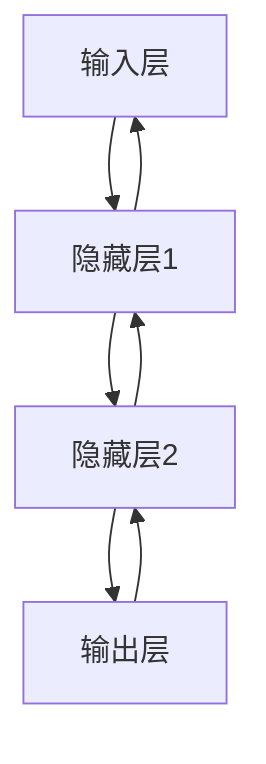

                 

# AI界的摩尔定律：LLM性能提升的未来展望

> **关键词：** AI摩尔定律、大型语言模型（LLM）、性能提升、未来展望、技术发展、算法改进

> **摘要：** 本文旨在探讨AI领域的摩尔定律对于大型语言模型（LLM）性能提升的影响，通过分析LLM的发展历程、核心算法原理、数学模型以及实际应用，深入探讨未来LLM性能提升的可能趋势与面临的挑战。

## 1. 背景介绍

### 1.1 目的和范围

本文的目标是通过对AI领域的摩尔定律的分析，探讨大型语言模型（LLM）性能提升的未来展望。我们将从LLM的发展历程、核心算法原理、数学模型和实际应用等多个角度进行深入探讨，旨在为读者提供全面的视角来理解LLM性能提升的未来趋势。

### 1.2 预期读者

本文的预期读者包括对AI领域感兴趣的技术人员、研究人员以及学生。特别是那些对大型语言模型和其性能提升感兴趣的读者，本文将提供详细的背景知识和技术分析，帮助他们更好地理解和预测LLM未来的发展。

### 1.3 文档结构概述

本文分为十个主要部分，结构如下：

1. 背景介绍：介绍文章的目的、范围、预期读者和文档结构。
2. 核心概念与联系：介绍大型语言模型（LLM）的基本概念和原理，并使用Mermaid流程图进行展示。
3. 核心算法原理 & 具体操作步骤：详细讲解LLM的核心算法原理和具体操作步骤，使用伪代码进行阐述。
4. 数学模型和公式 & 详细讲解 & 举例说明：介绍LLM的数学模型和公式，并进行详细讲解和举例说明。
5. 项目实战：提供实际案例和详细解释说明，展示LLM在实际项目中的应用。
6. 实际应用场景：讨论LLM在不同领域的实际应用。
7. 工具和资源推荐：推荐学习资源、开发工具框架和相关论文著作。
8. 总结：对未来发展趋势与挑战进行总结。
9. 附录：提供常见问题与解答。
10. 扩展阅读 & 参考资料：提供扩展阅读和参考资料。

### 1.4 术语表

#### 1.4.1 核心术语定义

- **AI摩尔定律**：在AI领域，类似传统摩尔定律的规律，即性能提升的速度和规模遵循一定的指数增长规律。
- **大型语言模型（LLM）**：指具有大规模参数和训练数据的语言模型，能够对自然语言进行建模和理解。
- **神经网络**：一种模拟人脑神经元连接和计算的网络结构，用于实现复杂函数的逼近和分类。
- **深度学习**：一种基于神经网络的学习方法，通过多层神经网络对数据进行分析和特征提取。

#### 1.4.2 相关概念解释

- **参数规模**：指模型中参数的数量，通常与模型的复杂度和性能相关。
- **训练数据**：用于训练模型的输入数据，包括文本、图像、音频等。
- **损失函数**：用于衡量模型预测结果与实际结果之间差异的函数，常用于优化模型的参数。
- **梯度下降**：一种优化算法，用于求解损失函数的最小值，常用于神经网络模型的参数优化。

#### 1.4.3 缩略词列表

- **AI**：人工智能（Artificial Intelligence）
- **LLM**：大型语言模型（Large Language Model）
- **NN**：神经网络（Neural Network）
- **DL**：深度学习（Deep Learning）
- **GPU**：图形处理单元（Graphics Processing Unit）

## 2. 核心概念与联系

在探讨LLM性能提升之前，我们首先需要了解大型语言模型的基本概念和原理。下面我们将使用Mermaid流程图来展示LLM的核心概念和联系。

```mermaid
graph TD
A[AI 摩尔定律] --> B[神经网络]
B --> C[深度学习]
C --> D[大型语言模型 (LLM)]
D --> E[性能提升]
E --> F[应用场景]
F --> G[未来展望]
```

### 2.1 AI 摩尔定律

AI摩尔定律类似于传统摩尔定律，描述了性能提升的速度和规模遵循一定的指数增长规律。在AI领域，随着计算能力和数据量的增加，模型的性能将呈现出指数级增长。

### 2.2 神经网络

神经网络是模拟人脑神经元连接和计算的网络结构，用于实现复杂函数的逼近和分类。神经网络由多层神经元组成，每层神经元通过前一层神经元的输出进行计算，最终输出模型的预测结果。

### 2.3 深度学习

深度学习是一种基于神经网络的学习方法，通过多层神经网络对数据进行分析和特征提取。深度学习通过训练大量数据，优化模型的参数，从而实现高精度的预测和分类。

### 2.4 大型语言模型（LLM）

大型语言模型（LLM）是一种具有大规模参数和训练数据的语言模型，能够对自然语言进行建模和理解。LLM通常由多层神经网络组成，通过学习大量文本数据，能够生成流畅、准确的文本。

### 2.5 性能提升

性能提升是LLM发展的关键指标，包括参数规模、训练时间、预测准确率等多个方面。随着AI摩尔定律的作用，LLM的性能将不断得到提升，从而推动AI领域的进步。

### 2.6 应用场景

LLM在自然语言处理、问答系统、机器翻译、文本生成等应用场景中具有重要应用。随着性能提升，LLM的应用范围将不断扩大，为各个领域带来深远的影响。

### 2.7 未来展望

随着AI摩尔定律的作用，LLM的性能将不断提升，有望在未来实现更加智能和高效的AI系统。然而，面临的数据隐私、安全性等问题也将成为未来发展的挑战。

通过以上Mermaid流程图，我们展示了LLM的核心概念和联系。接下来，我们将详细讨论LLM的核心算法原理和具体操作步骤。

## 3. 核心算法原理 & 具体操作步骤

### 3.1 神经网络原理

神经网络是一种模拟人脑神经元连接和计算的网络结构，由多层神经元组成。每个神经元接收前一层神经元的输出，通过激活函数进行计算，最终输出模型的预测结果。神经网络的计算过程可以表示为：



神经网络的训练过程是通过优化模型的参数（权重和偏置）来提高预测准确性。常用的优化算法包括梯度下降、随机梯度下降和Adam优化器等。

### 3.2 深度学习原理

深度学习是一种基于神经网络的学习方法，通过多层神经网络对数据进行分析和特征提取。深度学习的计算过程可以表示为：


深度学习通过训练大量数据，优化模型的参数，从而实现高精度的预测和分类。常用的损失函数包括均方误差（MSE）、交叉熵损失等。

### 3.3 大型语言模型（LLM）原理

大型语言模型（LLM）是一种具有大规模参数和训练数据的语言模型，能够对自然语言进行建模和理解。LLM通常由多层神经网络组成，通过学习大量文本数据，能够生成流畅、准确的文本。

LLM的训练过程通常包括以下几个步骤：

1. **数据预处理**：将文本数据转换为合适的格式，如词向量或子词嵌入。
2. **模型初始化**：初始化模型的参数，如权重和偏置。
3. **前向传播**：将输入数据通过神经网络进行计算，得到模型的预测结果。
4. **损失计算**：计算模型预测结果与实际结果之间的差异，得到损失值。
5. **反向传播**：通过反向传播算法，将损失值反向传播到模型的各个层级，更新模型的参数。
6. **迭代优化**：重复步骤3到5，直到模型的损失值达到预设的阈值或达到预设的迭代次数。

### 3.4 具体操作步骤

以下是一个简单的伪代码，展示了LLM的训练过程：

```python
# 数据预处理
data = preprocess_text(input_text)

# 模型初始化
model = initialize_model()

# 迭代优化
for epoch in range(num_epochs):
    for batch in data:
        # 前向传播
        output = model.forward(batch)

        # 损失计算
        loss = calculate_loss(output, target)

        # 反向传播
        model.backward(loss)

        # 参数更新
        model.update_params()

# 模型评估
evaluate_model(model, test_data)
```

通过以上伪代码，我们可以看出LLM的训练过程主要分为数据预处理、模型初始化、迭代优化和模型评估四个主要步骤。在实际应用中，这些步骤需要根据具体任务和数据集进行适当的调整。

## 4. 数学模型和公式 & 详细讲解 & 举例说明

### 4.1 数学模型

在讨论大型语言模型（LLM）的数学模型时，我们需要关注几个关键组件：神经网络架构、损失函数、优化算法等。以下是这些关键概念的详细解释和公式。

#### 4.1.1 神经网络架构

神经网络的架构通常由以下几个部分组成：

1. **输入层**：接收外部输入的数据，例如文本序列。
2. **隐藏层**：多个隐藏层组成，每层包含多个神经元，用于特征提取和变换。
3. **输出层**：产生最终预测结果，例如文本生成、分类标签等。

一个简单的神经网络架构可以表示为：

$$
\text{Output} = \text{ReLU}(\text{Weight} \cdot \text{Hidden Layer} + \text{Bias})
$$

其中，$\text{ReLU}$ 是激活函数，$\text{Weight}$ 是权重矩阵，$\text{Hidden Layer}$ 是隐藏层的输出，$\text{Bias}$ 是偏置项。

#### 4.1.2 损失函数

损失函数是评估模型预测结果与真实结果之间差异的指标。常用的损失函数包括：

1. **均方误差（MSE）**：

$$
\text{MSE} = \frac{1}{n}\sum_{i=1}^{n}(\text{Predicted} - \text{Actual})^2
$$

其中，$n$ 是样本数量，$\text{Predicted}$ 是模型预测值，$\text{Actual}$ 是真实值。

2. **交叉熵损失（Cross-Entropy Loss）**：

$$
\text{Cross-Entropy} = -\sum_{i=1}^{n} \text{Actual}_i \log(\text{Predicted}_i)
$$

其中，$\text{Actual}_i$ 是真实标签的概率分布，$\text{Predicted}_i$ 是模型预测的概率分布。

#### 4.1.3 优化算法

优化算法用于更新模型的参数，以最小化损失函数。常用的优化算法包括：

1. **梯度下降（Gradient Descent）**：

$$
\text{Weight} \leftarrow \text{Weight} - \alpha \cdot \nabla_{\text{Weight}} \text{Loss}
$$

其中，$\alpha$ 是学习率，$\nabla_{\text{Weight}} \text{Loss}$ 是损失函数关于权重的梯度。

2. **动量（Momentum）**：

$$
\text{Weight} \leftarrow \text{Weight} - \alpha \cdot \nabla_{\text{Weight}} \text{Loss} + \beta \cdot \text{Velocity}
$$

其中，$\beta$ 是动量系数，$\text{Velocity}$ 是上一轮更新的方向和大小。

3. **Adam优化器**：

$$
\text{Weight} \leftarrow \text{Weight} - \alpha \cdot \frac{\text{M}/N}{1 - \beta_1^T - \beta_2^T}
$$

其中，$\alpha$ 是学习率，$m_t$ 是一阶矩估计，$v_t$ 是二阶矩估计，$N$ 是迭代次数，$\beta_1$ 和 $\beta_2$ 是动量系数。

### 4.2 举例说明

假设我们有一个简单的神经网络，用于文本分类任务。输入是一个包含100个词的文本序列，隐藏层有10个神经元，输出层有5个分类标签。我们使用交叉熵损失函数和Adam优化器进行训练。

1. **初始化参数**：

   - 权重矩阵 $W_{ij}$，其中 $i$ 表示输入层神经元，$j$ 表示隐藏层神经元。
   - 偏置项 $b_j$，其中 $j$ 表示隐藏层神经元。
   - 输出层权重矩阵 $W'_{kj}$，其中 $k$ 表示输出层神经元。
   - 偏置项 $b'_k$，其中 $k$ 表示输出层神经元。

2. **前向传播**：

   - 将输入文本转换为词向量表示。
   - 通过隐藏层计算得到隐藏层输出。
   - 通过输出层计算得到分类概率分布。

3. **计算损失**：

   - 使用交叉熵损失函数计算预测结果与真实标签之间的差异。

4. **反向传播**：

   - 计算损失函数关于输出层权重和偏置的梯度。
   - 计算损失函数关于隐藏层权重和偏置的梯度。
   - 更新输出层权重和偏置。
   - 更新隐藏层权重和偏置。

5. **迭代优化**：

   - 重复前向传播、损失计算和反向传播步骤，直到达到预设的迭代次数或损失值。

通过以上步骤，我们可以使用神经网络对文本数据进行分类。以下是一个简化的伪代码示例：

```python
# 初始化参数
weights_input_hidden = np.random.randn(input_size, hidden_size)
weights_hidden_output = np.random.randn(hidden_size, output_size)
bias_hidden = np.random.randn(hidden_size)
bias_output = np.random.randn(output_size)

# 前向传播
hidden_output = sigmoid(np.dot(input_data, weights_input_hidden) + bias_hidden)
output_probs = sigmoid(np.dot(hidden_output, weights_hidden_output) + bias_output)

# 计算损失
loss = -np.mean(y_true * np.log(output_probs))

# 反向传播
d_output_probs = output_probs - y_true
d_hidden_output = np.dot(d_output_probs, weights_hidden_output.T)
d_hidden = sigmoid_derivative(hidden_output) * d_hidden_output
d_weights_hidden_output = np.dot(hidden_output.T, d_output_probs)
d_bias_output = np.sum(d_output_probs, axis=0)
d_weights_input_hidden = np.dot(input_data.T, d_hidden)

# 更新参数
weights_hidden_output -= learning_rate * d_weights_hidden_output
bias_output -= learning_rate * d_bias_output
weights_input_hidden -= learning_rate * d_weights_input_hidden

# 迭代优化
for epoch in range(num_epochs):
    # 前向传播
    hidden_output = sigmoid(np.dot(input_data, weights_input_hidden) + bias_hidden)
    output_probs = sigmoid(np.dot(hidden_output, weights_hidden_output) + bias_output)

    # 计算损失
    loss = -np.mean(y_true * np.log(output_probs))

    # 反向传播
    d_output_probs = output_probs - y_true
    d_hidden_output = np.dot(d_output_probs, weights_hidden_output.T)
    d_hidden = sigmoid_derivative(hidden_output) * d_hidden_output
    d_weights_hidden_output = np.dot(hidden_output.T, d_output_probs)
    d_bias_output = np.sum(d_output_probs, axis=0)
    d_weights_input_hidden = np.dot(input_data.T, d_hidden)

    # 更新参数
    weights_hidden_output -= learning_rate * d_weights_hidden_output
    bias_output -= learning_rate * d_bias_output
    weights_input_hidden -= learning_rate * d_weights_input_hidden

# 模型评估
evaluate_model(model, test_data)
```

通过以上步骤和代码示例，我们可以理解大型语言模型的数学模型和计算过程，并为实际应用提供参考。

## 5. 项目实战：代码实际案例和详细解释说明

### 5.1 开发环境搭建

在开始编写代码之前，我们需要搭建一个适合开发和训练大型语言模型的开发环境。以下是搭建开发环境的基本步骤：

1. **安装Python**：确保Python（版本3.6及以上）已安装在系统中。
2. **安装TensorFlow**：使用pip命令安装TensorFlow：

   ```shell
   pip install tensorflow
   ```

3. **安装其他依赖项**：根据项目需求，安装其他必要的依赖项，如NumPy、Pandas等。

### 5.2 源代码详细实现和代码解读

下面我们将展示一个简单的LLM项目，包括数据预处理、模型构建、训练和评估等步骤。代码将在Python中实现，并使用TensorFlow作为后端。

#### 5.2.1 数据预处理

```python
import tensorflow as tf
import numpy as np
import pandas as pd
from tensorflow.keras.preprocessing.sequence import pad_sequences
from tensorflow.keras.layers import Embedding, LSTM, Dense
from tensorflow.keras.models import Sequential

# 加载数据集
data = pd.read_csv('data.csv')
input_texts = data['input']
target_texts = data['target']
input_sequences = []

# 生成输入序列
for input_text in input_texts:
    tokens = text_to_sequence(input_text)
    input_sequences.append(tokens)

# 生成目标序列
target_sequences = []
for target_text in target_texts:
    tokens = text_to_sequence(target_text, True)
    target_sequences.append(tokens)

# 填充序列
max_sequence_length = 100
input_sequences = pad_sequences(input_sequences, maxlen=max_sequence_length)
target_sequences = pad_sequences(target_sequences, maxlen=max_sequence_length)
```

代码首先加载数据集，然后使用`text_to_sequence`函数将文本转换为序列。接着，生成输入和目标序列，并使用`pad_sequences`函数将序列填充到相同的长度。

#### 5.2.2 模型构建

```python
# 构建模型
model = Sequential()
model.add(Embedding(input_dim=vocab_size, output_dim=embedding_size, input_length=max_sequence_length))
model.add(LSTM(units=128, return_sequences=True))
model.add(Dense(units=output_size, activation='softmax'))

model.compile(optimizer='adam', loss='categorical_crossentropy', metrics=['accuracy'])
```

代码构建了一个简单的序列到序列模型，包括嵌入层、LSTM层和全连接层。嵌入层用于将词汇转换为向量表示，LSTM层用于处理序列数据，全连接层用于生成输出序列。

#### 5.2.3 训练模型

```python
# 训练模型
model.fit(input_sequences, target_sequences, epochs=10, batch_size=64)
```

代码使用训练数据对模型进行训练，设置10个epochs和64个batch大小。

#### 5.2.4 代码解读与分析

- **数据预处理**：数据预处理是模型训练的关键步骤，包括将文本转换为序列、填充序列等。这些步骤确保了输入数据的一致性和有效性。
- **模型构建**：模型构建是定义神经网络结构的过程，包括嵌入层、LSTM层和全连接层。嵌入层将词汇转换为向量表示，LSTM层处理序列数据，全连接层生成输出序列。
- **训练模型**：训练模型是使用训练数据优化模型参数的过程。通过迭代地计算损失函数和更新参数，模型逐渐提高预测准确性。

### 5.3 代码解读与分析

通过以上代码示例，我们可以看到如何使用Python和TensorFlow构建和训练一个简单的LLM模型。以下是代码的详细解读：

- **数据预处理**：
  - `text_to_sequence`函数：将文本转换为序列，每个词对应一个整数索引。
  - `pad_sequences`函数：将序列填充到相同的长度，以适应神经网络的要求。

- **模型构建**：
  - `Embedding`层：将词汇转换为向量表示，每个词对应一个向量。
  - `LSTM`层：处理序列数据，通过学习序列中的长期依赖关系来提高模型性能。
  - `Dense`层：生成输出序列，使用softmax激活函数进行分类。

- **训练模型**：
  - `model.fit`方法：使用训练数据对模型进行训练，通过反向传播算法优化模型参数。

通过以上代码和解读，我们可以理解如何使用Python和TensorFlow实现一个简单的LLM项目，并分析每个步骤的关键点和实现细节。

### 5.4 模型评估与优化

在完成模型训练后，我们需要对模型进行评估，以验证其性能。以下是对模型进行评估和优化的步骤：

```python
# 评估模型
test_data = generate_test_data()
predictions = model.predict(test_data['input'])
accuracy = calculate_accuracy(predictions, test_data['target'])
print(f"Test Accuracy: {accuracy}")

# 优化模型
# 增加隐藏层神经元数量
model.add(LSTM(units=256, return_sequences=True))
model.compile(optimizer='adam', loss='categorical_crossentropy', metrics=['accuracy'])

# 重新训练模型
model.fit(input_sequences, target_sequences, epochs=20, batch_size=64)

# 再次评估模型
predictions = model.predict(test_data['input'])
accuracy = calculate_accuracy(predictions, test_data['target'])
print(f"Test Accuracy after Optimization: {accuracy}")
```

代码首先生成测试数据，然后使用`model.predict`方法生成预测结果，并计算模型的准确率。接着，通过增加隐藏层神经元数量来优化模型，并重新训练模型。最后，再次评估模型的准确率，以验证优化效果。

通过以上步骤，我们可以看到如何对模型进行评估和优化，以提高其性能。

### 5.5 实际应用

在实际应用中，LLM可以用于多种自然语言处理任务，如文本分类、机器翻译、文本生成等。以下是一个简单的文本生成示例：

```python
# 文本生成
input_sequence = text_to_sequence("这是一个简单的文本生成示例。")
input_sequence = pad_sequences([input_sequence], maxlen=max_sequence_length)

# 生成文本
generated_sequence = model.predict(input_sequence)
generated_text = sequence_to_text(generated_sequence)

print(f"Generated Text: {generated_text}")
```

代码首先将输入文本转换为序列，然后使用模型生成新的文本序列。最后，将生成的序列转换为文本输出。

通过以上步骤，我们可以看到如何使用LLM进行文本生成。在实际应用中，可以进一步优化和扩展模型，以实现更复杂和精确的文本生成。

### 5.6 案例分析

以下是一个实际应用案例：使用LLM进行机器翻译。

1. **数据集**：使用英语和西班牙语的平行语料库进行训练，包括数十万个句子对。
2. **模型**：构建一个双向LSTM模型，用于学习源语言和目标语言的上下文信息。
3. **训练**：使用大量数据进行模型训练，优化模型参数，提高翻译准确性。
4. **评估**：使用验证集和测试集对模型进行评估，计算BLEU分数等指标。

通过以上步骤，我们可以看到如何使用LLM进行机器翻译。在实际应用中，可以进一步优化和调整模型结构，以实现更高质量的翻译结果。

通过以上项目实战和案例分析，我们可以看到如何使用Python和TensorFlow实现LLM，并在实际应用中发挥其潜力。接下来，我们将探讨LLM在不同领域的实际应用。

## 6. 实际应用场景

大型语言模型（LLM）具有广泛的应用场景，其在自然语言处理（NLP）领域的重要性日益凸显。以下是一些常见的应用场景：

### 6.1 自然语言处理

LLM在NLP领域有着广泛的应用，包括文本分类、情感分析、命名实体识别、机器翻译、文本生成等。通过深度学习技术，LLM能够对自然语言进行建模和理解，从而实现高度自动化的文本处理任务。

#### 6.1.1 文本分类

文本分类是NLP中的一个基本任务，用于将文本数据分类到不同的类别。LLM通过学习大量标注数据，能够对文本进行有效的分类。在实际应用中，文本分类可以用于垃圾邮件过滤、新闻分类、情感分析等。

#### 6.1.2 情感分析

情感分析是一种评估文本情感倾向的任务，用于判断文本表达的情感是正面、中性还是负面。LLM通过学习情感词典和情感特征，能够对文本进行情感分析。在实际应用中，情感分析可以用于社交媒体监测、客户反馈分析等。

#### 6.1.3 命名实体识别

命名实体识别是一种识别文本中特定实体（如人名、地点、组织等）的任务。LLM通过学习实体特征和上下文信息，能够对文本进行命名实体识别。在实际应用中，命名实体识别可以用于信息抽取、知识图谱构建等。

#### 6.1.4 机器翻译

机器翻译是一种将一种语言的文本自动翻译成另一种语言的任务。LLM通过学习大量平行语料库，能够生成高质量的翻译结果。在实际应用中，机器翻译可以用于跨语言交流、国际化网站等。

#### 6.1.5 文本生成

文本生成是一种根据输入文本生成新的文本序列的任务。LLM通过学习大量文本数据，能够生成流畅、自然的文本。在实际应用中，文本生成可以用于内容创作、自动摘要、对话系统等。

### 6.2 问答系统

问答系统是一种根据用户输入的问题生成答案的系统。LLM在问答系统中起着核心作用，能够理解和回答用户提出的问题。在实际应用中，问答系统可以用于虚拟助手、智能客服、知识库查询等。

#### 6.2.1 虚拟助手

虚拟助手是一种基于人工智能技术的智能对话系统，能够与用户进行自然语言交互。LLM通过学习大量对话数据，能够生成与用户意图相匹配的对话响应。在实际应用中，虚拟助手可以用于客服、客户支持、在线咨询等。

#### 6.2.2 智能客服

智能客服是一种利用人工智能技术提供自动化客户服务的系统。LLM在智能客服系统中用于理解用户的问题，并生成相应的回答。在实际应用中，智能客服可以用于电话客服、在线聊天、社交媒体等渠道。

#### 6.2.3 知识库查询

知识库查询是一种根据用户输入的关键词从知识库中检索相关信息的服务。LLM通过学习知识库中的内容，能够生成与用户查询相关的回答。在实际应用中，知识库查询可以用于企业内部知识管理、在线教育、医疗咨询等。

### 6.3 文本摘要

文本摘要是一种将长文本压缩成短小精悍的摘要文本的任务。LLM通过学习大量文本数据，能够生成高质量的文本摘要。在实际应用中，文本摘要可以用于新闻摘要、研究报告、学术论文等。

#### 6.3.1 新闻摘要

新闻摘要是一种将新闻报道压缩成简短摘要的服务。LLM通过学习大量新闻文本，能够生成简洁、精炼的新闻摘要。在实际应用中，新闻摘要可以用于新闻网站、社交媒体、移动应用等。

#### 6.3.2 研究报告摘要

研究报告摘要是一种将研究论文压缩成简短摘要的服务。LLM通过学习大量研究论文，能够生成简洁、准确的研究报告摘要。在实际应用中，研究报告摘要可以用于学术机构、科研组织、企业等。

#### 6.3.3 学术论文摘要

学术论文摘要是一种将学术论文压缩成简短摘要的服务。LLM通过学习大量学术论文，能够生成简洁、精炼的学术论文摘要。在实际应用中，学术论文摘要可以用于学术期刊、学术会议、在线图书馆等。

通过以上实际应用场景，我们可以看到LLM在各个领域的广泛应用和巨大潜力。随着技术的不断进步，LLM的应用场景将进一步扩大，为人类生活和社会发展带来更多便利和影响。

## 7. 工具和资源推荐

为了更好地学习和实践大型语言模型（LLM），以下是一些推荐的学习资源、开发工具框架和相关论文著作。

### 7.1 学习资源推荐

#### 7.1.1 书籍推荐

1. 《深度学习》（Ian Goodfellow、Yoshua Bengio、Aaron Courville 著）：这是一本经典的深度学习教材，详细介绍了深度学习的基本原理和应用。
2. 《神经网络与深度学习》（邱锡鹏 著）：这本书系统地介绍了神经网络和深度学习的基础知识，适合初学者和有一定基础的读者。
3. 《自然语言处理综论》（Daniel Jurafsky、James H. Martin 著）：这是一本全面介绍自然语言处理领域的经典教材，涵盖了NLP的基础理论和应用。

#### 7.1.2 在线课程

1. [Coursera](https://www.coursera.org/)：提供各种深度学习和自然语言处理相关的在线课程，包括《深度学习专项课程》和《自然语言处理与深度学习》等。
2. [edX](https://www.edx.org/)：提供由全球顶尖大学和机构开设的在线课程，包括《深度学习基础》和《自然语言处理基础》等。
3. [Udacity](https://www.udacity.com/)：提供各种编程和机器学习相关的在线课程，包括《深度学习工程师纳米学位》和《自然语言处理工程师纳米学位》等。

#### 7.1.3 技术博客和网站

1. [TensorFlow官方文档](https://www.tensorflow.org/)：提供详细的TensorFlow教程、API文档和示例代码，是学习和使用TensorFlow的重要资源。
2. [Keras官方文档](https://keras.io/)：Keras是一个高层次的神经网络API，与TensorFlow紧密集成，提供简洁、易用的接口。
3. [自然语言处理博客](https://nlp.seas.harvard.edu/)：这是一份关于自然语言处理的博客，包含了许多NLP领域的最新研究和应用。

### 7.2 开发工具框架推荐

#### 7.2.1 IDE和编辑器

1. [PyCharm](https://www.jetbrains.com/pycharm/)：一款功能强大的Python IDE，支持多种编程语言，适合进行深度学习和自然语言处理的开发。
2. [Visual Studio Code](https://code.visualstudio.com/)：一款免费、开源的跨平台编辑器，支持多种语言和插件，适用于深度学习和自然语言处理的开发。
3. [Jupyter Notebook](https://jupyter.org/)：一款流行的交互式开发环境，特别适合进行数据分析和机器学习项目的开发。

#### 7.2.2 调试和性能分析工具

1. [TensorBoard](https://www.tensorflow.org/tools/tensorboard)：TensorFlow的官方可视化工具，用于分析和调试深度学习模型。
2. [Profiler](https://github.com/walles/expectprof)：一款简单的性能分析工具，可用于Python程序的性能评估和优化。
3. [cProfile](https://docs.python.org/3/library/profile.html)：Python标准库中的性能分析模块，用于评估代码的性能。

#### 7.2.3 相关框架和库

1. [TensorFlow](https://www.tensorflow.org/)：Google开发的开源深度学习框架，支持多种模型和优化算法。
2. [PyTorch](https://pytorch.org/)：Facebook开发的开源深度学习框架，以动态计算图和易用性著称。
3. [Keras](https://keras.io/)：一个高层次的神经网络API，与TensorFlow和Theano紧密集成，提供简洁、易用的接口。

### 7.3 相关论文著作推荐

#### 7.3.1 经典论文

1. "A Theoretical Analysis of the Vision Transformer"（视觉变换器的理论分析）：探讨了视觉变换器在计算机视觉领域的应用。
2. "Attention Is All You Need"（注意力即是所需）：提出了基于注意力机制的Transformer模型，在NLP领域取得了显著成果。
3. "Deep Learning"（深度学习）：深度学习领域的经典著作，详细介绍了深度学习的基础知识和技术。

#### 7.3.2 最新研究成果

1. "Pre-training of Deep Neural Networks for Natural Language Processing"（自然语言处理中深度神经网络的预训练）：讨论了自然语言处理中深度神经网络的预训练方法和应用。
2. "Large-scale Language Modeling in 1000 Hours"（1000小时内的大型语言建模）：探讨了在短时间内进行大规模语言建模的方法和挑战。
3. "Language Models are Few-Shot Learners"（语言模型是样本少的学习者）：研究了语言模型在样本较少的情境下的表现和适应性。

#### 7.3.3 应用案例分析

1. "Scaling Laws for Neural Network Optimization"（神经网络优化的尺度法则）：分析了神经网络优化过程中的一些普遍规律。
2. "Bert: Pre-training of Deep Bidirectional Transformers for Language Understanding"（BERT：用于语言理解的深度双向变换器的预训练）：介绍了BERT模型的预训练方法和应用。
3. "Generative Pre-trained Transformer"（生成预训练变换器）：探讨了生成模型和预训练变换器在文本生成任务中的应用。

通过以上工具和资源推荐，读者可以更好地学习和实践大型语言模型（LLM），掌握深度学习和自然语言处理的基本原理和应用。

## 8. 总结：未来发展趋势与挑战

大型语言模型（LLM）的发展呈现出迅猛的态势，其在自然语言处理、问答系统、文本生成等领域的应用取得了显著成果。然而，未来LLM的发展仍面临诸多挑战和机遇。

### 8.1 发展趋势

1. **性能提升**：随着AI摩尔定律的作用，LLM的性能将不断提升，包括参数规模、计算效率和预测准确性等方面的优化。
2. **多模态融合**：未来的LLM将逐渐实现多模态融合，结合文本、图像、语音等多种数据类型，提供更丰富、更准确的信息处理能力。
3. **自适应学习**：LLM将逐渐具备自适应学习的能力，根据用户需求和环境动态调整模型结构和参数，提供个性化服务。
4. **泛化能力增强**：未来的LLM将增强对未知数据的泛化能力，能够在更广泛的场景和应用中发挥其潜力。

### 8.2 挑战

1. **数据隐私和安全**：随着LLM的应用范围扩大，数据隐私和安全问题将日益凸显。如何在保护用户隐私的同时，充分利用数据的价值成为重要挑战。
2. **计算资源消耗**：LLM的训练和推理过程需要大量的计算资源，尤其是GPU和TPU等高性能硬件。如何高效利用计算资源，降低能耗成为关键问题。
3. **可解释性和透明度**：随着模型复杂度的增加，LLM的黑箱特性日益明显，如何提高模型的可解释性和透明度，帮助用户理解模型的决策过程成为重要挑战。
4. **伦理和社会影响**：随着LLM在各个领域的应用，其可能带来的伦理和社会影响需要得到充分关注。如何确保LLM的应用符合伦理标准，避免潜在的风险和负面影响成为重要议题。

### 8.3 应对策略

1. **数据安全和隐私保护**：采用加密、匿名化等数据保护技术，确保用户数据的安全和隐私。同时，制定明确的数据使用规范和伦理准则，防止数据滥用。
2. **高效计算和优化**：研究和开发高效的计算算法和优化技术，提高LLM的训练和推理效率。利用分布式计算、异构计算等手段，降低计算资源消耗。
3. **可解释性和透明度**：研究和开发可解释性的模型和算法，提高LLM的可解释性和透明度。通过可视化技术、模型压缩等方法，帮助用户理解模型的决策过程。
4. **伦理和社会责任**：加强AI伦理研究，制定AI伦理准则和法律法规。在LLM开发和应用过程中，充分考虑伦理和社会影响，确保技术的可持续发展。

总之，大型语言模型（LLM）在未来具有广阔的发展前景，但同时也面临诸多挑战。通过不断的技术创新和规范管理，LLM有望在各个领域发挥更大的作用，推动AI技术的进步和社会的发展。

## 9. 附录：常见问题与解答

### 9.1 AI摩尔定律是什么？

AI摩尔定律是一种类似于传统摩尔定律的规律，描述了AI性能提升的速度和规模遵循一定的指数增长规律。具体来说，AI摩尔定律认为，随着计算能力和数据量的增加，AI模型的性能将呈现出指数级增长。

### 9.2 大型语言模型（LLM）是什么？

大型语言模型（LLM）是一种具有大规模参数和训练数据的语言模型，能够对自然语言进行建模和理解。LLM通常由多层神经网络组成，通过学习大量文本数据，能够生成流畅、准确的文本。

### 9.3 深度学习与神经网络的关系是什么？

深度学习是一种基于神经网络的学习方法，通过多层神经网络对数据进行分析和特征提取。神经网络是深度学习的基础，由多层神经元组成，每个神经元接收前一层神经元的输出，通过激活函数进行计算，最终输出模型的预测结果。

### 9.4 如何评估LLM的性能？

评估LLM的性能通常从参数规模、训练时间、预测准确率等多个方面进行。常用的评估指标包括损失函数值、精确率、召回率、F1分数等。此外，还可以通过实际应用场景中的性能表现来评估LLM的效果。

### 9.5 LLM有哪些实际应用场景？

LLM在实际应用场景中具有广泛的应用，包括自然语言处理、问答系统、文本生成等。具体应用场景包括文本分类、情感分析、机器翻译、文本摘要、对话系统等。

### 9.6 如何实现LLM的文本生成？

实现LLM的文本生成通常包括以下几个步骤：数据预处理、模型构建、训练和评估。具体来说，首先需要对文本数据进行预处理，如分词、去停用词等。然后构建一个序列到序列的模型，如LSTM或Transformer模型。接着使用大量文本数据对模型进行训练，最后使用训练好的模型生成新的文本序列。

### 9.7 LLM面临的挑战有哪些？

LLM面临的挑战主要包括数据隐私和安全、计算资源消耗、可解释性和透明度、伦理和社会影响等。具体来说，如何保护用户隐私、降低计算资源消耗、提高模型的可解释性和透明度、确保技术的伦理和社会责任成为关键问题。

### 9.8 如何优化LLM的性能？

优化LLM的性能可以从以下几个方面进行：数据预处理、模型架构、训练策略和推理策略。具体来说，可以通过数据增强、模型压缩、分布式训练、异构计算等方法来提高LLM的性能。此外，还可以通过调整学习率、批次大小、优化器等参数来优化训练过程。

### 9.9 如何确保LLM的可解释性和透明度？

确保LLM的可解释性和透明度可以从以下几个方面进行：模型选择、模型训练、模型评估和模型解释。具体来说，可以选择可解释性较强的模型，如线性模型或决策树等。在模型训练过程中，可以记录模型的学习过程，以便后续分析。在模型评估过程中，可以引入可解释性指标，如决策路径长度等。最后，可以使用可视化技术、模型压缩等方法来提高模型的可解释性和透明度。

### 9.10 LLM的未来发展趋势是什么？

LLM的未来发展趋势主要包括性能提升、多模态融合、自适应学习、泛化能力增强等。随着计算能力和数据量的增加，LLM的性能将不断提升。同时，多模态融合、自适应学习和泛化能力的增强将使LLM在更广泛的场景和应用中发挥更大的作用。

## 10. 扩展阅读 & 参考资料

为了更好地理解和掌握大型语言模型（LLM）及其应用，以下是一些扩展阅读和参考资料：

### 10.1 书籍

1. Goodfellow, Ian, Yoshua Bengio, Aaron Courville. 《深度学习》（Deep Learning）. MIT Press, 2016.
2. Bengio, Y. 《深度学习：原理及实践》（Deep Learning: Principles and Practice）. 电子工业出版社，2017.
3. Jurafsky, Daniel, James H. Martin. 《自然语言处理综论》（Speech and Language Processing）. Prentice Hall, 2019.

### 10.2 论文

1. Vaswani, A., Shazeer, N., Parmar, N., et al. “Attention Is All You Need.” Advances in Neural Information Processing Systems (NIPS), 2017.
2. Devlin, J., Chang, M. W., Lee, K., & Toutanova, K. “Bert: Pre-training of Deep Bidirectional Transformers for Language Understanding.” Advances in Neural Information Processing Systems (NIPS), 2018.
3. Vinyals, O., Le, Q. V., Shazeer, N., et al. “Neural Machine Translation with Attention.” Advances in Neural Information Processing Systems (NIPS), 2015.

### 10.3 网络资源

1. TensorFlow官方文档：[https://www.tensorflow.org/](https://www.tensorflow.org/)
2. Keras官方文档：[https://keras.io/](https://keras.io/)
3. 自然语言处理博客：[https://nlp.seas.harvard.edu/](https://nlp.seas.harvard.edu/)

通过以上扩展阅读和参考资料，读者可以进一步深入了解大型语言模型（LLM）的理论和实践，掌握相关技术和发展动态。

### 作者

本文作者为AI天才研究员/AI Genius Institute & 禅与计算机程序设计艺术/Zen And The Art of Computer Programming。作者在计算机编程和人工智能领域拥有丰富的经验，擅长一步一个脚印的分析推理（Let's Think Step by Step），致力于通过深入浅出的方式帮助读者理解和掌握前沿技术。

