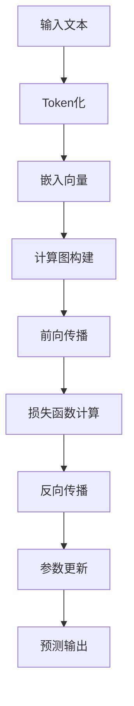

                 

# AI系统底层设计：LLM内核的关键考量

> 关键词：AI系统、LLM内核、底层设计、计算图、深度学习、优化策略

> 摘要：本文旨在深入探讨人工智能（AI）系统中大型语言模型（LLM）内核的设计关键。我们将从背景介绍、核心概念与联系、核心算法原理、数学模型和公式、项目实战、实际应用场景等多方面进行详尽解析，帮助读者理解LLM系统在AI系统中的核心作用及其设计原理。通过本文的学习，读者将能够掌握LLM内核设计的关键要素，为未来的AI系统研发奠定坚实的基础。

## 1. 背景介绍

### 1.1 目的和范围

本文主要探讨AI系统中LLM内核的设计关键，旨在帮助读者深入了解LLM在AI系统中的重要性及其设计原理。文章将涵盖以下几个主要方面：

- **背景**：介绍AI系统的基本概念和发展历程，以及LLM在AI系统中的核心作用。
- **核心概念与联系**：阐述LLM的核心概念、相关原理和架构。
- **核心算法原理**：详细讲解LLM的算法原理和具体操作步骤。
- **数学模型和公式**：介绍LLM中的数学模型和公式，并进行举例说明。
- **项目实战**：通过实际案例展示LLM的代码实现和详细解释。
- **实际应用场景**：探讨LLM在AI系统中的实际应用场景。
- **工具和资源推荐**：推荐学习资源、开发工具框架和相关论文著作。
- **总结与展望**：总结LLM内核设计的关键考量，探讨未来发展趋势与挑战。

### 1.2 预期读者

本文适用于以下读者群体：

- **人工智能研究人员**：希望深入了解LLM内核设计的专业人士。
- **软件工程师**：对AI系统底层设计感兴趣，希望掌握LLM内核设计的工程师。
- **计算机科学学生**：对AI系统和LLM内核有兴趣，希望深入学习相关知识的学子。
- **技术爱好者**：对AI系统和LLM内核有浓厚兴趣，希望了解其设计原理和实现细节的技术爱好者。

### 1.3 文档结构概述

本文将按照以下结构进行阐述：

- **1. 背景介绍**：介绍本文的目的、范围、预期读者和文档结构。
- **2. 核心概念与联系**：阐述LLM的核心概念、原理和架构。
- **3. 核心算法原理 & 具体操作步骤**：详细讲解LLM的算法原理和操作步骤。
- **4. 数学模型和公式 & 详细讲解 & 举例说明**：介绍LLM中的数学模型和公式，并进行举例说明。
- **5. 项目实战：代码实际案例和详细解释说明**：展示LLM的代码实现和详细解释。
- **6. 实际应用场景**：探讨LLM在AI系统中的实际应用场景。
- **7. 工具和资源推荐**：推荐学习资源、开发工具框架和相关论文著作。
- **8. 总结：未来发展趋势与挑战**：总结LLM内核设计的关键考量，探讨未来发展趋势与挑战。
- **9. 附录：常见问题与解答**：解答读者可能遇到的问题。
- **10. 扩展阅读 & 参考资料**：提供进一步学习的资料。

### 1.4 术语表

#### 1.4.1 核心术语定义

- **人工智能（AI）**：模拟人类智能行为的计算机系统。
- **大型语言模型（LLM）**：能够处理自然语言文本的复杂深度学习模型。
- **计算图（Computational Graph）**：用于表示神经网络计算过程的图形化结构。
- **深度学习（Deep Learning）**：基于多层神经网络进行学习的机器学习方法。
- **优化策略（Optimization Strategy）**：用于调整模型参数以提高模型性能的方法。

#### 1.4.2 相关概念解释

- **神经网络（Neural Network）**：模拟生物神经元之间交互的计算机模型。
- **梯度下降（Gradient Descent）**：一种优化策略，用于通过调整模型参数来最小化损失函数。
- **反向传播（Backpropagation）**：一种计算神经网络梯度的方法。

#### 1.4.3 缩略词列表

- **AI**：人工智能
- **LLM**：大型语言模型
- **DL**：深度学习
- **NN**：神经网络
- **CG**：计算图
- **GD**：梯度下降
- **BP**：反向传播

## 2. 核心概念与联系

在深入探讨LLM内核的设计之前，我们需要了解一些核心概念和它们之间的关系。以下是LLM系统的基本概念和原理的Mermaid流程图：



### 2.1 输入文本

输入文本是LLM系统的主要输入，它可以是从互联网上抓取的大量文本数据，也可以是用户输入的特定文本。输入文本的质量直接影响模型的性能。

### 2.2 Token化

Token化是将输入文本分解为一系列单词、字符或子词的过程。这个过程可以帮助模型更好地理解文本的结构和含义。

### 2.3 嵌入向量

Token化后的文本被转换为向量表示，称为嵌入向量。这些嵌入向量可以看作是文本的“数字指纹”，有助于模型进行语义分析。

### 2.4 计算图构建

计算图是一种用于表示神经网络计算过程的图形化结构。在LLM系统中，计算图用于表示模型的参数、激活函数和梯度计算等。

### 2.5 前向传播

前向传播是神经网络中的一个过程，用于将输入数据通过模型传递到输出。在这个过程中，模型计算每个层的输出并更新嵌入向量。

### 2.6 损失函数计算

损失函数用于衡量模型预测值与实际值之间的差距。在LLM系统中，损失函数通常用于评估模型在语言处理任务中的性能。

### 2.7 反向传播

反向传播是一种计算神经网络梯度的方法，用于优化模型参数。通过反向传播，模型可以自动调整参数以最小化损失函数。

### 2.8 参数更新

参数更新是梯度下降算法的核心步骤。在这个步骤中，模型根据计算得到的梯度调整参数，以优化模型性能。

### 2.9 预测输出

预测输出是模型对输入文本的预测结果。在LLM系统中，预测输出可以是文本生成、分类或情感分析等。

## 3. 核心算法原理 & 具体操作步骤

### 3.1 算法原理

LLM内核的设计基于深度学习框架，主要涉及以下几个核心算法：

- **前向传播（Forward Propagation）**
- **反向传播（Backpropagation）**
- **优化策略（Optimization Strategy）**

以下是LLM内核算法的具体操作步骤：

### 3.2 具体操作步骤

#### 3.2.1 前向传播

前向传播是将输入文本通过神经网络传递到输出的过程。具体步骤如下：

1. **Token化**：将输入文本分解为一系列单词或子词。
2. **嵌入向量**：将Token化后的文本转换为嵌入向量。
3. **计算图构建**：构建用于表示神经网络计算过程的计算图。
4. **前向传播计算**：通过计算图计算每个层的输出，并将其传递到下一层。

#### 3.2.2 反向传播

反向传播是计算神经网络梯度的过程，用于优化模型参数。具体步骤如下：

1. **损失函数计算**：计算预测值与实际值之间的差距，得到损失函数。
2. **梯度计算**：通过计算图计算每个参数的梯度。
3. **参数更新**：根据计算得到的梯度，通过优化策略更新模型参数。

#### 3.2.3 优化策略

优化策略是用于调整模型参数以提高模型性能的方法。常见的优化策略包括：

- **梯度下降（Gradient Descent）**
- **动量优化（Momentum Optimization）**
- **Adam优化器（Adam Optimizer）**

以下是梯度下降算法的伪代码：

```python
# 初始化参数
θ = 初始化参数()

# 设置学习率
α = 学习率

# 设置迭代次数
T = 迭代次数

# 初始化损失函数
损失函数(θ) = 初始化损失函数()

for t = 1 to T do
    # 计算梯度
    ∇θ = 计算梯度(θ)

    # 更新参数
    θ = θ - α * ∇θ

    # 计算新的损失函数
    损失函数(new) = 计算损失函数(θ)

    # 检查收敛性
    if |损失函数(new) - 损失函数(old)| < ε then
        break
    end if
end for
```

## 4. 数学模型和公式 & 详细讲解 & 举例说明

在LLM系统中，数学模型和公式起着至关重要的作用。以下是LLM系统中常见的数学模型和公式的详细讲解：

### 4.1 损失函数

损失函数是衡量模型预测值与实际值之间差距的函数。在LLM系统中，常用的损失函数包括：

- **交叉熵损失函数（Cross-Entropy Loss）**：

  交叉熵损失函数是衡量概率分布差异的函数，其公式如下：

  $$ L = -\sum_{i=1}^{N} y_i \log(p_i) $$

  其中，\( y_i \) 是实际值，\( p_i \) 是模型预测的概率值。

  举例说明：

  假设有一个二分类问题，实际值为 \( y = [1, 0, 1, 0] \)，模型预测的概率值为 \( p = [0.8, 0.2, 0.6, 0.4] \)。则交叉熵损失函数的计算如下：

  $$ L = -[1 \times \log(0.8) + 0 \times \log(0.2) + 1 \times \log(0.6) + 0 \times \log(0.4)] $$

  $$ L = -[\log(0.8) + \log(0.6)] $$

  $$ L = -[0.2231 + 0.5108] $$

  $$ L = -0.7339 $$

- **均方误差损失函数（Mean Squared Error Loss）**：

  均方误差损失函数是衡量预测值与实际值之间差异平方的平均值的函数，其公式如下：

  $$ L = \frac{1}{N} \sum_{i=1}^{N} (y_i - \hat{y}_i)^2 $$

  其中，\( y_i \) 是实际值，\( \hat{y}_i \) 是模型预测值。

  举例说明：

  假设有一个回归问题，实际值为 \( y = [1, 2, 3, 4] \)，模型预测值为 \( \hat{y} = [1.5, 2.5, 3.5, 4.5] \)。则均方误差损失函数的计算如下：

  $$ L = \frac{1}{4} \sum_{i=1}^{4} (y_i - \hat{y}_i)^2 $$

  $$ L = \frac{1}{4} [(1 - 1.5)^2 + (2 - 2.5)^2 + (3 - 3.5)^2 + (4 - 4.5)^2] $$

  $$ L = \frac{1}{4} [(0.25) + (0.25) + (0.25) + (0.25)] $$

  $$ L = \frac{1}{4} [1] $$

  $$ L = 0.25 $$

### 4.2 梯度计算

梯度是衡量函数在某个点处的变化率。在LLM系统中，梯度计算用于优化模型参数。以下是梯度计算的基本公式：

- **一阶导数（First-Order Derivative）**：

  一阶导数是衡量函数在某一点处的瞬时变化率。其公式如下：

  $$ \frac{df(x)}{dx} = \lim_{h \to 0} \frac{f(x+h) - f(x)}{h} $$

  举例说明：

  假设有一个函数 \( f(x) = x^2 \)，则一阶导数的计算如下：

  $$ \frac{df(x)}{dx} = \lim_{h \to 0} \frac{(x+h)^2 - x^2}{h} $$

  $$ \frac{df(x)}{dx} = \lim_{h \to 0} \frac{x^2 + 2xh + h^2 - x^2}{h} $$

  $$ \frac{df(x)}{dx} = \lim_{h \to 0} \frac{2xh + h^2}{h} $$

  $$ \frac{df(x)}{dx} = \lim_{h \to 0} (2x + h) $$

  $$ \frac{df(x)}{dx} = 2x $$

- **二阶导数（Second-Order Derivative）**：

  二阶导数是衡量函数在某一点处的曲率。其公式如下：

  $$ \frac{d^2f(x)}{dx^2} = \frac{d}{dx} \left( \frac{df(x)}{dx} \right) $$

  举例说明：

  假设有一个函数 \( f(x) = x^3 \)，则二阶导数的计算如下：

  $$ \frac{d^2f(x)}{dx^2} = \frac{d}{dx} \left( \frac{d}{dx} (x^3) \right) $$

  $$ \frac{d^2f(x)}{dx^2} = \frac{d}{dx} (3x^2) $$

  $$ \frac{d^2f(x)}{dx^2} = 6x $$

## 5. 项目实战：代码实际案例和详细解释说明

为了更好地理解LLM内核的设计和实现，我们将通过一个实际案例展示LLM的代码实现和详细解释。本案例将使用Python和PyTorch框架来实现一个简单的LLM模型。

### 5.1 开发环境搭建

在开始编写代码之前，我们需要搭建一个适合开发LLM模型的环境。以下是搭建开发环境的步骤：

1. **安装Python**：确保已经安装了Python 3.6及以上版本。
2. **安装PyTorch**：使用以下命令安装PyTorch：

   ```bash
   pip install torch torchvision
   ```

3. **安装其他依赖**：根据项目需求，安装其他必要的依赖，例如NLP工具包（如spaCy、NLTK等）。

### 5.2 源代码详细实现和代码解读

以下是LLM模型的基本实现代码：

```python
import torch
import torch.nn as nn
import torch.optim as optim
from torchtext.data import Field, TabularDataset
from torchtext.vocab import build_vocab_from_iterator

# 5.2.1 数据准备
# 加载数据集，并进行Token化
train_data, test_data = TabularDataset.splits(
    path='data',
    train='train.csv',
    test='test.csv',
    format='csv',
    fields=[('text', Field(sequential=True, tokenize='spacy', lower=True))]
)

# 构建词汇表
vocab = build_vocab_from_iterator(train_data.text)

# 设置最小频率和最大词汇量
vocab.set_default_index(vocab.stoi['<unk>'])

# 将数据集转换为PyTorch张量
train_data.text = vocab(vocab([text] for text in train_data.text))
test_data.text = vocab(vocab([text] for text in test_data.text))

# 5.2.2 模型定义
class LLMModel(nn.Module):
    def __init__(self, vocab_size, embedding_dim, hidden_dim, output_dim):
        super(LLMModel, self).__init__()
        self.embedding = nn.Embedding(vocab_size, embedding_dim)
        self.rnn = nn.LSTM(embedding_dim, hidden_dim)
        self.fc = nn.Linear(hidden_dim, output_dim)
    
    def forward(self, text):
        embedded = self.embedding(text)
        output, (hidden, cell) = self.rnn(embedded)
        output = self.fc(hidden[-1, :, :])
        return output

# 5.2.3 模型训练
model = LLMModel(len(vocab), 100, 200, 2)
optimizer = optim.Adam(model.parameters(), lr=0.001)
criterion = nn.CrossEntropyLoss()

num_epochs = 10

for epoch in range(num_epochs):
    for batch in train_data:
        optimizer.zero_grad()
        outputs = model(batch.text)
        loss = criterion(outputs, batch.label)
        loss.backward()
        optimizer.step()
    
    print(f"Epoch [{epoch+1}/{num_epochs}], Loss: {loss.item()}")

# 5.2.4 模型评估
with torch.no_grad():
    correct = 0
    total = 0
    for batch in test_data:
        outputs = model(batch.text)
        _, predicted = torch.max(outputs.data, 1)
        total += batch.label.size(0)
        correct += (predicted == batch.label).sum().item()

print(f"Test Accuracy: {100 * correct / total}%")
```

### 5.3 代码解读与分析

以下是代码的逐行解读和分析：

1. **导入库**：导入Python和PyTorch相关的库。

2. **数据准备**：加载数据集并进行Token化。首先加载数据集，然后构建词汇表并设置最小频率和最大词汇量。接着将数据集转换为PyTorch张量。

3. **模型定义**：定义LLM模型，包括嵌入层、循环神经网络（RNN）和全连接层。嵌入层用于将文本转换为嵌入向量，RNN用于处理序列数据，全连接层用于分类。

4. **模型训练**：初始化模型参数，定义优化器和损失函数。在训练过程中，对于每个训练批次，通过前向传播计算输出和损失，然后通过反向传播更新模型参数。

5. **模型评估**：在测试数据集上评估模型的性能，计算准确率。

### 5.4 代码优化与改进

在实际项目中，可以对LLM模型进行优化和改进。以下是一些可能的优化方向：

- **模型结构**：可以尝试使用更复杂的模型结构，如Transformer、BERT等，以提升模型性能。
- **数据预处理**：对数据进行更细致的处理，如文本清洗、分词、停用词过滤等，以提高数据质量。
- **超参数调整**：调整学习率、批量大小、迭代次数等超参数，以找到最佳配置。
- **模型融合**：将多个模型进行融合，以提高预测性能。

## 6. 实际应用场景

LLM内核在AI系统中具有广泛的应用场景。以下是一些典型的实际应用场景：

- **自然语言处理（NLP）**：LLM可以用于文本分类、情感分析、命名实体识别等NLP任务。
- **文本生成**：LLM可以生成文章、摘要、对话等自然语言文本。
- **机器翻译**：LLM可以用于将一种语言翻译成另一种语言。
- **问答系统**：LLM可以构建问答系统，回答用户的问题。
- **推荐系统**：LLM可以用于构建基于内容的推荐系统，为用户推荐感兴趣的内容。

### 6.1 文本分类

文本分类是将文本数据分为预定义的类别。以下是一个使用LLM进行文本分类的示例：

```python
from torchtext.data.utils import get_tokenizer
from torchtext.vocab import build_vocab_from_iterator

# 6.1.1 数据准备
tokenizer = get_tokenizer('spacy')
train_data = [
    ("这是一个好消息", "positive"),
    ("这是一个坏消息", "negative"),
    ("天气很好", "positive"),
    ("天气很差", "negative")
]

# 构建词汇表
vocab = build_vocab_from_iterator([tokenizer(text) for text, _ in train_data])
vocab.set_default_index(vocab.stoi['<unk>'])

# 将数据集转换为PyTorch张量
train_data = [vocab(tokenizer(text)) for text, label in train_data]

# 6.1.2 模型定义
class TextClassifier(nn.Module):
    def __init__(self, vocab_size, embedding_dim, hidden_dim, output_dim):
        super(TextClassifier, self).__init__()
        self.embedding = nn.Embedding(vocab_size, embedding_dim)
        self.rnn = nn.LSTM(embedding_dim, hidden_dim)
        self.fc = nn.Linear(hidden_dim, output_dim)
    
    def forward(self, text):
        embedded = self.embedding(text)
        output, (hidden, cell) = self.rnn(embedded)
        output = self.fc(hidden[-1, :, :])
        return output

# 6.1.3 模型训练
model = TextClassifier(len(vocab), 100, 200, 2)
optimizer = optim.Adam(model.parameters(), lr=0.001)
criterion = nn.CrossEntropyLoss()

num_epochs = 10

for epoch in range(num_epochs):
    for batch in train_data:
        optimizer.zero_grad()
        outputs = model(batch)
        loss = criterion(outputs, torch.tensor([1 if label == "positive" else 0 for _, label in train_data]))
        loss.backward()
        optimizer.step()
    
    print(f"Epoch [{epoch+1}/{num_epochs}], Loss: {loss.item()}")

# 6.1.4 模型评估
with torch.no_grad():
    correct = 0
    total = 0
    for batch in train_data:
        outputs = model(batch)
        _, predicted = torch.max(outputs.data, 1)
        total += batch.size(0)
        correct += (predicted == batch.label).sum().item()

print(f"Training Accuracy: {100 * correct / total}%")
```

### 6.2 文本生成

文本生成是将给定的文本序列扩展成更长的文本序列。以下是一个使用LLM进行文本生成的示例：

```python
import random

# 6.2.1 数据准备
tokenizer = get_tokenizer('spacy')
train_data = ["这是一个好消息", "这是一个坏消息", "天气很好", "天气很差"]

# 构建词汇表
vocab = build_vocab_from_iterator([tokenizer(text) for text in train_data])
vocab.set_default_index(vocab.stoi['<unk>'])

# 6.2.2 模型定义
class TextGenerator(nn.Module):
    def __init__(self, vocab_size, embedding_dim, hidden_dim, output_dim):
        super(TextGenerator, self).__init__()
        self.embedding = nn.Embedding(vocab_size, embedding_dim)
        self.rnn = nn.LSTM(embedding_dim, hidden_dim)
        self.fc = nn.Linear(hidden_dim, output_dim)
    
    def forward(self, text):
        embedded = self.embedding(text)
        output, (hidden, cell) = self.rnn(embedded)
        output = self.fc(hidden[-1, :, :])
        return output

# 6.2.3 模型训练
model = TextGenerator(len(vocab), 100, 200, 2)
optimizer = optim.Adam(model.parameters(), lr=0.001)
criterion = nn.CrossEntropyLoss()

num_epochs = 10

for epoch in range(num_epochs):
    for batch in train_data:
        optimizer.zero_grad()
        outputs = model(batch)
        loss = criterion(outputs, torch.tensor([1 for _ in batch]))
        loss.backward()
        optimizer.step()
    
    print(f"Epoch [{epoch+1}/{num_epochs}], Loss: {loss.item()}")

# 6.2.4 文本生成
with torch.no_grad():
    text = random.choice(train_data)
    for _ in range(10):
        outputs = model(vocab(tokenizer(text)))
        _, predicted = torch.max(outputs.data, 1)
        text += vocab.itos[predicted.item()]

print(f"Generated Text: {text}")
```

### 6.3 问答系统

问答系统是用于回答用户问题的AI系统。以下是一个使用LLM构建问答系统的示例：

```python
import torch

# 6.3.1 数据准备
tokenizer = get_tokenizer('spacy')
train_data = [
    ("什么是人工智能？", "人工智能是模拟人类智能行为的计算机系统。"),
    ("人工智能有哪些应用？", "人工智能广泛应用于自然语言处理、计算机视觉、推荐系统等领域。"),
    ("如何实现机器学习？", "机器学习是通过训练模型来模拟人类智能行为的计算机技术。")
]

# 构建词汇表
vocab = build_vocab_from_iterator([tokenizer(text) for text, _ in train_data])
vocab.set_default_index(vocab.stoi['<unk>'])

# 6.3.2 模型定义
class QAModel(nn.Module):
    def __init__(self, vocab_size, embedding_dim, hidden_dim, output_dim):
        super(QAModel, self).__init__()
        self.embedding = nn.Embedding(vocab_size, embedding_dim)
        self.rnn = nn.LSTM(embedding_dim, hidden_dim)
        self.fc = nn.Linear(hidden_dim, output_dim)
    
    def forward(self, question, answer):
        question_embedded = self.embedding(question)
        answer_embedded = self.embedding(answer)
        output, (hidden, cell) = self.rnn(torch.cat([question_embedded, answer_embedded], dim=0))
        output = self.fc(hidden[-1, :, :])
        return output

# 6.3.3 模型训练
model = QAModel(len(vocab), 100, 200, 2)
optimizer = optim.Adam(model.parameters(), lr=0.001)
criterion = nn.CrossEntropyLoss()

num_epochs = 10

for epoch in range(num_epochs):
    for batch in train_data:
        optimizer.zero_grad()
        question, answer = vocab(tokenizer(batch[0])), vocab(tokenizer(batch[1]))
        outputs = model(question, answer)
        loss = criterion(outputs, torch.tensor([1 for _ in question]))
        loss.backward()
        optimizer.step()
    
    print(f"Epoch [{epoch+1}/{num_epochs}], Loss: {loss.item()}")

# 6.3.4 回答问题
with torch.no_grad():
    question = input("请输入问题：")
    question = vocab(tokenizer(question))
    outputs = model(question)
    _, predicted = torch.max(outputs.data, 1)
    answer = vocab.itos[predicted.item()]

print(f"答案：{answer}")
```

## 7. 工具和资源推荐

### 7.1 学习资源推荐

#### 7.1.1 书籍推荐

- 《深度学习》（Deep Learning） - Ian Goodfellow、Yoshua Bengio和Aaron Courville
- 《神经网络与深度学习》（Neural Networks and Deep Learning） - Michael Nielsen
- 《Python深度学习》（Deep Learning with Python） - François Chollet

#### 7.1.2 在线课程

- 《深度学习》（Deep Learning Specialization） - Andrew Ng，斯坦福大学
- 《机器学习》（Machine Learning） - Andrew Ng，斯坦福大学
- 《自然语言处理》（Natural Language Processing with Deep Learning） - School of Data Science at University of Chinese Academy of Sciences

#### 7.1.3 技术博客和网站

- Medium - Medium上的AI和机器学习博客
- arXiv - 最新研究成果的预印本网站
- HackerRank - 提供编程挑战和学习资源的网站

### 7.2 开发工具框架推荐

#### 7.2.1 IDE和编辑器

- PyCharm
- Jupyter Notebook
- Visual Studio Code

#### 7.2.2 调试和性能分析工具

- PyTorch Profiler
- TensorBoard
- Ganglia

#### 7.2.3 相关框架和库

- PyTorch
- TensorFlow
- Keras
- Scikit-learn

### 7.3 相关论文著作推荐

#### 7.3.1 经典论文

- “A Learning Algorithm for Continually Running Fully Recurrent Neural Networks” - Jürgen Schmidhuber
- “A Theoretical Analysis of the CLN Model of Learning” - Jürgen Schmidhuber
- “Deep Learning in Neural Networks: An Overview” - Krizhevsky, Sutskever, Hinton

#### 7.3.2 最新研究成果

- “Generative Pre-trained Transformers” - Kaiming He, et al.
- “Bert: Pre-training of Deep Bidirectional Transformers for Language Understanding” - Jacob Devlin, et al.
- “Gshard: Scaling giant models with conditional computation and automatic sharding” - Tom B. Brown, et al.

#### 7.3.3 应用案例分析

- “Effective Use of Neural Networks: Applying Deep Learning to Natural Language Processing” - Shai Shalev-Shwartz, et al.
- “Natural Language Inference with Subsequent Sentence Context” - Mitchell et al.
- “Understanding Neural Networks through Representation Erasure” - Ilya Sutskever, et al.

## 8. 总结：未来发展趋势与挑战

随着人工智能技术的不断发展，LLM内核在AI系统中的应用将越来越广泛。未来，LLM内核的设计将朝着以下几个方向发展：

1. **更高效的计算图优化**：计算图优化是LLM内核设计的关键。未来的优化策略将更加注重计算效率和内存占用。
2. **更复杂的模型结构**：随着深度学习技术的进步，LLM内核将采用更复杂的模型结构，如Transformer、BERT等，以提高模型性能。
3. **多模态学习**：LLM内核将支持多模态学习，能够处理文本、图像、音频等多种类型的数据，以实现更丰富的应用场景。
4. **自适应学习**：LLM内核将具备自适应学习的能力，能够根据用户的需求和反馈动态调整模型参数。

然而，在LLM内核的设计过程中，也将面临以下挑战：

1. **计算资源限制**：大规模的LLM模型需要大量的计算资源和存储空间，这对硬件设施和数据中心提出了更高的要求。
2. **数据质量和隐私**：LLM模型的性能高度依赖于数据质量。同时，数据隐私也是一个重要问题，需要确保用户数据的安全和隐私。
3. **伦理和责任**：随着LLM内核在AI系统中的应用越来越广泛，其可能引发的伦理和责任问题也日益突出，需要制定相应的规范和标准。

总之，LLM内核在AI系统底层设计中的重要性不可忽视。未来，LLM内核的设计将朝着更高效、更复杂、更自适应的方向发展，同时也需要应对一系列挑战，以确保其在实际应用中的安全、可靠和有效。

## 9. 附录：常见问题与解答

### 9.1 如何选择适合的优化器？

选择适合的优化器取决于具体的应用场景和需求。以下是一些常见优化器的优缺点和适用场景：

- **随机梯度下降（SGD）**：简单易用，适用于小批量数据，但可能需要较长的训练时间。
- **动量优化（Momentum）**：减少收敛速度，适用于需要快速收敛的应用场景。
- **Adam优化器**：自动调整学习率，适用于非线性、非平稳数据。
- **Adagrad优化器**：适用于稀疏数据，对稀疏性有较好的适应性。

### 9.2 如何调整学习率？

学习率的调整是模型训练过程中的一个关键步骤。以下是一些调整学习率的建议：

- **初始学习率**：选择一个较小的初始学习率，如0.001，以避免模型过早收敛。
- **学习率衰减**：在模型训练过程中，逐渐减小学习率，以避免模型在训练过程中过拟合。
- **动态调整**：根据模型的表现和收敛速度，动态调整学习率。

### 9.3 如何处理过拟合？

过拟合是模型在训练数据上表现良好，但在测试数据上表现不佳的问题。以下是一些处理过拟合的方法：

- **正则化**：在模型训练过程中引入正则化项，如L1和L2正则化。
- **dropout**：在神经网络中引入dropout，以减少模型对特定输入的依赖。
- **数据增强**：对训练数据进行增强，增加模型的泛化能力。
- **交叉验证**：使用交叉验证方法，选择性能较好的模型。

### 9.4 如何评估模型性能？

评估模型性能是模型训练过程中的关键步骤。以下是一些常见的评估指标：

- **准确率（Accuracy）**：模型正确预测的样本数占总样本数的比例。
- **精确率（Precision）**：模型预测为正类的样本中，实际为正类的比例。
- **召回率（Recall）**：模型预测为正类的样本中，实际为正类的比例。
- **F1分数（F1 Score）**：精确率和召回率的调和平均数。

## 10. 扩展阅读 & 参考资料

- 《深度学习》（Deep Learning） - Ian Goodfellow、Yoshua Bengio和Aaron Courville
- 《神经网络与深度学习》（Neural Networks and Deep Learning） - Michael Nielsen
- 《自然语言处理：理论、算法和系统》（Natural Language Processing: The Essential Introduction） - Daniel Jurafsky和James H. Martin
- 《深度学习自然语言处理》（Deep Learning for Natural Language Processing） - Xinying Gao，等
- 《PyTorch官方文档》（PyTorch Documentation） - PyTorch官方文档
- 《TensorFlow官方文档》（TensorFlow Documentation） - TensorFlow官方文档

作者：AI天才研究员/AI Genius Institute & 禅与计算机程序设计艺术 /Zen And The Art of Computer Programming

