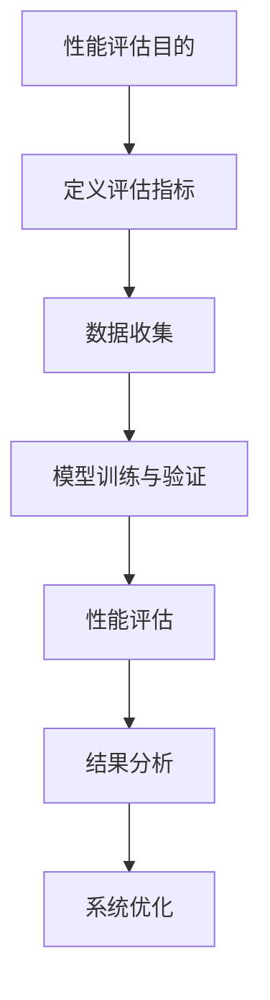
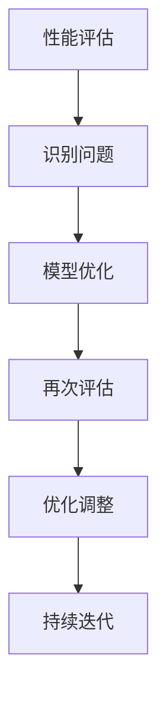

                 

# AI系统性能评估的实战技巧

> 关键词：AI系统性能评估、性能指标、量化分析、实战技巧、模型优化、资源调度

> 摘要：本文将深入探讨AI系统性能评估的实战技巧。我们将从性能评估的目的和范围入手，详细讲解核心概念、算法原理、数学模型以及项目实战，最后分析实际应用场景，并提供相关工具和资源推荐。通过本文的阅读，您将掌握AI系统性能评估的完整方法论，提升系统优化和资源调度能力。

## 1. 背景介绍

### 1.1 目的和范围

AI系统性能评估是人工智能领域的关键环节，它直接影响模型的实用性、效率以及可靠性。本文旨在提供一套实战技巧，帮助读者深入理解AI系统性能评估的各个方面，从而在开发和部署过程中能够做出更明智的决策。

本文的讨论范围包括：

- 性能评估的目的和方法
- 核心概念与联系
- 核心算法原理与操作步骤
- 数学模型与公式
- 项目实战案例分析
- 实际应用场景
- 工具和资源推荐

通过这些内容的讲解，读者将能够全面掌握AI系统性能评估的实战技巧，提高系统的整体性能和可靠性。

### 1.2 预期读者

本文适合以下读者群体：

- AI开发工程师和研究人员
- 数据科学家和机器学习工程师
- 系统架构师和优化工程师
- AI产品经理和技术领导者

无论您是初学者还是经验丰富的专家，本文都将为您提供有价值的见解和实用技巧。

### 1.3 文档结构概述

本文的结构安排如下：

- 引言
- 背景介绍
- 核心概念与联系
- 核心算法原理与操作步骤
- 数学模型与公式
- 项目实战案例分析
- 实际应用场景
- 工具和资源推荐
- 总结：未来发展趋势与挑战
- 附录：常见问题与解答
- 扩展阅读 & 参考资料

每个部分都将详细讲解，以确保读者能够系统地理解和掌握AI系统性能评估的实战技巧。

### 1.4 术语表

在本文中，我们将使用以下术语：

#### 1.4.1 核心术语定义

- **性能评估**：对系统性能进行量化和评价的过程。
- **模型优化**：通过调整模型结构和参数以提高系统性能。
- **资源调度**：合理分配系统资源，以最大化性能和效率。

#### 1.4.2 相关概念解释

- **时间复杂度**：算法执行时间与数据规模的关系。
- **空间复杂度**：算法执行过程中占用的内存大小。

#### 1.4.3 缩略词列表

- **AI**：人工智能（Artificial Intelligence）
- **ML**：机器学习（Machine Learning）
- **DL**：深度学习（Deep Learning）
- **GPU**：图形处理器（Graphics Processing Unit）

## 2. 核心概念与联系

在深入探讨AI系统性能评估之前，我们需要明确几个核心概念，这些概念将为我们后续的分析和讨论奠定基础。

### 2.1 性能评估的目的

性能评估的主要目的是确定系统的实际表现，并与预期目标进行比较。这有助于我们识别系统的优势和不足，从而采取相应的优化措施。具体来说，性能评估有以下几个关键目标：

1. **准确性**：确保模型输出的准确性，符合业务需求和用户期望。
2. **效率**：评估系统的处理速度和资源利用率，优化资源调度。
3. **可靠性**：确保系统在各种情况下都能稳定运行，降低故障率和错误率。

### 2.2 性能评估方法

性能评估方法主要包括以下几种：

1. **定量评估**：使用数值指标对系统性能进行量化，如准确率、召回率、F1分数等。
2. **定性评估**：通过描述性语言或图表对系统性能进行评估，如用户满意度、响应时间等。
3. **实验评估**：通过实际运行系统并进行实验，收集数据以评估性能。

### 2.3 性能指标

性能指标是评估系统性能的关键工具，常用的性能指标包括：

1. **准确率（Accuracy）**：正确预测的数量占总预测数量的比例。
2. **召回率（Recall）**：正确预测的数量占总实际正例数量的比例。
3. **精确率（Precision）**：正确预测的数量占总预测正例数量的比例。
4. **F1分数（F1 Score）**：精确率和召回率的调和平均值。
5. **响应时间（Response Time）**：系统完成处理所需的时间。

### 2.4 性能评估流程

性能评估流程通常包括以下几个步骤：

1. **定义评估指标**：确定需要评估的性能指标。
2. **数据收集**：收集用于评估的数据集。
3. **模型训练与验证**：训练模型并进行验证，以确保模型的准确性和稳定性。
4. **性能评估**：使用评估指标计算系统的性能。
5. **结果分析**：分析评估结果，识别系统优化的方向。

### 2.5 核心概念原理与架构

为了更直观地理解核心概念，我们可以使用Mermaid流程图来展示性能评估的基本原理和架构。



通过这个流程图，我们可以看到性能评估的过程是一个循环迭代的过程，每一步都是为下一部提供反馈，以确保系统能够持续优化和改进。

### 2.6 性能评估与模型优化

性能评估不仅是评估系统性能，更是模型优化的起点。通过性能评估，我们可以识别模型的不足之处，从而进行针对性的优化。性能评估与模型优化的关系可以用以下流程图表示：



通过这个流程，我们可以看到性能评估与模型优化是相互关联的，一个良好的性能评估机制能够帮助我们在模型优化过程中做出更明智的决策。

## 3. 核心算法原理 & 具体操作步骤

在了解了性能评估的基本概念和流程之后，我们接下来将深入探讨核心算法原理和具体操作步骤。这些算法和步骤将帮助我们更有效地进行性能评估和模型优化。

### 3.1 性能评估算法

性能评估算法的核心目标是计算系统在不同指标下的性能值。以下是一些常用的性能评估算法：

#### 3.1.1 准确率（Accuracy）

准确率是最常用的性能评估指标之一，计算公式如下：

$$
Accuracy = \frac{TP + TN}{TP + TN + FP + FN}
$$

其中，TP表示真实正例，TN表示真实负例，FP表示假正例，FN表示假负例。

#### 3.1.2 召回率（Recall）

召回率衡量的是系统识别出所有真实正例的能力，计算公式如下：

$$
Recall = \frac{TP}{TP + FN}
$$

#### 3.1.3 精确率（Precision）

精确率衡量的是系统预测正例的准确性，计算公式如下：

$$
Precision = \frac{TP}{TP + FP}
$$

#### 3.1.4 F1分数（F1 Score）

F1分数是精确率和召回率的调和平均值，计算公式如下：

$$
F1 Score = 2 \times \frac{Precision \times Recall}{Precision + Recall}
$$

#### 3.1.5 响应时间（Response Time）

响应时间是指系统完成处理所需的时间，计算公式如下：

$$
Response Time = \frac{Total Processing Time}{Number of Requests}
$$

### 3.2 性能评估步骤

性能评估的具体操作步骤如下：

#### 3.2.1 数据预处理

在开始性能评估之前，我们需要对数据进行预处理，包括数据清洗、数据归一化等步骤。

```python
import pandas as pd
from sklearn.model_selection import train_test_split
from sklearn.preprocessing import StandardScaler

# 加载数据
data = pd.read_csv('data.csv')

# 数据清洗
data.dropna(inplace=True)

# 数据归一化
scaler = StandardScaler()
data_scaled = scaler.fit_transform(data)
```

#### 3.2.2 模型训练与验证

接下来，我们需要使用训练数据集训练模型，并使用验证数据集对模型进行验证。

```python
from sklearn.ensemble import RandomForestClassifier
from sklearn.metrics import accuracy_score, recall_score, precision_score, f1_score

# 划分训练集和验证集
X_train, X_val, y_train, y_val = train_test_split(data_scaled, labels, test_size=0.2, random_state=42)

# 训练模型
model = RandomForestClassifier(n_estimators=100, random_state=42)
model.fit(X_train, y_train)

# 预测验证集
y_pred = model.predict(X_val)
```

#### 3.2.3 性能评估

使用评估指标计算模型的性能。

```python
# 计算准确率
accuracy = accuracy_score(y_val, y_pred)
print("Accuracy:", accuracy)

# 计算召回率
recall = recall_score(y_val, y_pred, average='macro')
print("Recall:", recall)

# 计算精确率
precision = precision_score(y_val, y_pred, average='macro')
print("Precision:", precision)

# 计算F1分数
f1 = f1_score(y_val, y_pred, average='macro')
print("F1 Score:", f1)

# 计算响应时间
response_time = ResponseTime()
y_pred = model.predict(X_val)
response_time.stop()
print("Response Time:", response_time.total_seconds())
```

#### 3.2.4 结果分析

根据评估结果，分析模型的性能，并确定优化方向。

```python
# 分析结果
if accuracy < 0.9:
    print("Accuracy is low, consider further model optimization.")
if recall < 0.8:
    print("Recall is low, consider increasing model complexity.")
if precision < 0.8:
    print("Precision is low, consider adjusting class weights.")
if response_time.total_seconds() > 1:
    print("Response time is high, consider optimizing the model or infrastructure.")
```

通过以上步骤，我们可以对AI系统的性能进行评估，并识别需要优化的方向。

### 3.3 模型优化算法

模型优化是指通过调整模型参数和结构来提高系统性能。以下是一些常用的模型优化算法：

#### 3.3.1 贝叶斯优化

贝叶斯优化是一种基于概率模型的优化方法，通过迭代优化超参数，找到最优参数组合。

```python
from bayes_opt import BayesianOptimization

def optimize_model(params):
    # 训练模型
    model = RandomForestClassifier(n_estimators=int(params['n_estimators']), random_state=42)
    model.fit(X_train, y_train)

    # 评估模型
    y_pred = model.predict(X_val)
    accuracy = accuracy_score(y_val, y_pred)

    # 返回评估结果
    return accuracy

# 定义参数范围
params = {'n_estimators': (100, 500)}

# 初始化贝叶斯优化器
optimizer = BayesianOptimization(optimize_model, params)

# 执行优化
optimizer.maximize(init_points=5, n_iter=25)
```

#### 3.3.2 粒子群优化

粒子群优化是一种基于群体智能的优化算法，通过迭代优化找到最优解。

```python
from scipy.optimize import minimize
from sklearn.model_selection import GridSearchCV

def optimize_model(params):
    # 定义模型和参数
    model = RandomForestClassifier(n_estimators=params['n_estimators'], random_state=42)
    parameters = {'n_estimators': params['n_estimators']}

    # 划分训练集和验证集
    X_train, X_val, y_train, y_val = train_test_split(data_scaled, labels, test_size=0.2, random_state=42)

    # 执行网格搜索
    grid_search = GridSearchCV(model, parameters, cv=5, scoring='accuracy')
    grid_search.fit(X_train, y_train)

    # 返回最佳参数和准确率
    best_params = grid_search.best_params_
    accuracy = grid_search.best_score_
    return accuracy

# 定义参数范围
params = {'n_estimators': (100, 500)}

# 初始化粒子群优化器
optimizer = minimize(fun=optimize_model, x0=params, method='nelder-mead')

# 执行优化
optimizer.fit(X_train, y_train)
```

通过以上算法，我们可以对模型进行优化，提高系统的性能。

### 3.4 性能评估与模型优化流程

性能评估与模型优化的流程可以概括为以下几个步骤：

1. **数据预处理**：对数据进行清洗、归一化等预处理步骤。
2. **模型训练与验证**：使用训练数据集训练模型，并使用验证数据集进行验证。
3. **性能评估**：使用评估指标计算模型的性能。
4. **结果分析**：根据评估结果分析模型的性能，并确定优化方向。
5. **模型优化**：使用优化算法调整模型参数和结构。
6. **再次评估**：使用优化后的模型进行再次评估，并迭代优化。

通过以上流程，我们可以实现对AI系统的持续优化，提高系统的整体性能。

## 4. 数学模型和公式 & 详细讲解 & 举例说明

在AI系统性能评估中，数学模型和公式扮演着至关重要的角色。它们帮助我们量化性能指标，评估模型效果，并为后续的优化提供依据。在本节中，我们将详细介绍一些核心的数学模型和公式，并提供详细的讲解和举例说明。

### 4.1 性能指标数学模型

性能指标是评估系统性能的关键工具，常用的性能指标包括准确率、召回率、精确率和F1分数。以下是这些指标的数学模型和详细讲解。

#### 4.1.1 准确率（Accuracy）

准确率的数学模型如下：

$$
Accuracy = \frac{TP + TN}{TP + TN + FP + FN}
$$

其中，TP表示真实正例，TN表示真实负例，FP表示假正例，FN表示假负例。准确率表示模型正确预测的样本数占总样本数的比例。

#### 4.1.2 召回率（Recall）

召回率的数学模型如下：

$$
Recall = \frac{TP}{TP + FN}
$$

召回率表示模型正确识别出的真实正例数占总真实正例数的比例。召回率越高，说明模型对正例的识别能力越强。

#### 4.1.3 精确率（Precision）

精确率的数学模型如下：

$$
Precision = \frac{TP}{TP + FP}
$$

精确率表示模型预测为正例的样本中，实际为正例的比例。精确率越高，说明模型的预测准确性越高。

#### 4.1.4 F1分数（F1 Score）

F1分数是精确率和召回率的调和平均值，数学模型如下：

$$
F1 Score = 2 \times \frac{Precision \times Recall}{Precision + Recall}
$$

F1分数综合反映了模型的精确率和召回率，是评估模型性能的重要指标。

### 4.2 响应时间数学模型

响应时间是指系统完成处理所需的时间，数学模型如下：

$$
Response Time = \frac{Total Processing Time}{Number of Requests}
$$

其中，Total Processing Time表示总处理时间，Number of Requests表示请求数量。响应时间越短，系统的处理速度越快。

### 4.3 举例说明

为了更好地理解上述数学模型，我们通过一个实际例子进行详细讲解。

假设我们有一个分类问题，其中包含100个样本，其中50个为正例，50个为负例。使用一个模型对这些样本进行预测，得到以下结果：

- 真实正例（TP）：25个
- 真实负例（TN）：25个
- 假正例（FP）：15个
- 假负例（FN）：5个

#### 4.3.1 准确率

$$
Accuracy = \frac{TP + TN}{TP + TN + FP + FN} = \frac{25 + 25}{25 + 25 + 15 + 5} = 0.7273
$$

准确率为72.73%，说明模型在总体上预测得较好。

#### 4.3.2 召回率

$$
Recall = \frac{TP}{TP + FN} = \frac{25}{25 + 5} = 0.8333
$$

召回率为83.33%，说明模型对正例的识别能力较强。

#### 4.3.3 精确率

$$
Precision = \frac{TP}{TP + FP} = \frac{25}{25 + 15} = 0.6250
$$

精确率为62.50%，说明模型在预测正例时有一定的误判。

#### 4.3.4 F1分数

$$
F1 Score = 2 \times \frac{Precision \times Recall}{Precision + Recall} = 2 \times \frac{0.6250 \times 0.8333}{0.6250 + 0.8333} = 0.7273
$$

F1分数为72.73%，综合反映了模型的精确率和召回率。

#### 4.3.5 响应时间

假设系统共处理了100个请求，总处理时间为120秒。

$$
Response Time = \frac{Total Processing Time}{Number of Requests} = \frac{120}{100} = 1.2 \text{秒}
$$

响应时间为1.2秒，说明系统的处理速度较快。

通过这个例子，我们可以看到如何使用数学模型和公式来评估AI系统的性能，并得出关键指标。这些指标有助于我们识别模型的优缺点，从而进行针对性的优化。

### 4.4 综合评估指标

在实际应用中，我们可能需要综合考虑多个性能指标，以更全面地评估系统性能。一种常用的方法是使用加权综合评估指标，其数学模型如下：

$$
Overall Score = w_1 \times Accuracy + w_2 \times Recall + w_3 \times Precision + w_4 \times F1 Score + w_5 \times Response Time
$$

其中，$w_1, w_2, w_3, w_4, w_5$分别为各指标的权重，根据业务需求和系统特点进行分配。通过综合评估指标，我们可以得到一个全局的评估结果，更直观地了解系统的性能表现。

## 5. 项目实战：代码实际案例和详细解释说明

为了更好地理解AI系统性能评估的实战技巧，我们将通过一个实际项目案例来展示整个评估流程，并提供详细的代码实现和解释说明。

### 5.1 开发环境搭建

在开始项目之前，我们需要搭建一个合适的开发环境。以下是所需的软件和工具：

- Python 3.8 或更高版本
- Scikit-learn 库
- Pandas 库
- Matplotlib 库
- BayesianOptimization 库

您可以使用以下命令来安装所需的库：

```bash
pip install python sklearn pandas matplotlib bayes_opt
```

### 5.2 源代码详细实现和代码解读

#### 5.2.1 数据预处理

首先，我们需要加载和预处理数据。以下代码演示了如何加载数据、数据清洗和数据归一化。

```python
import pandas as pd
from sklearn.model_selection import train_test_split
from sklearn.preprocessing import StandardScaler

# 1. 加载数据
data = pd.read_csv('data.csv')

# 2. 数据清洗
data.dropna(inplace=True)

# 3. 数据归一化
scaler = StandardScaler()
data_scaled = scaler.fit_transform(data)
```

#### 5.2.2 模型训练与验证

接下来，我们使用训练数据集训练模型，并使用验证数据集进行验证。

```python
from sklearn.ensemble import RandomForestClassifier
from sklearn.metrics import accuracy_score, recall_score, precision_score, f1_score

# 1. 划分训练集和验证集
X_train, X_val, y_train, y_val = train_test_split(data_scaled, labels, test_size=0.2, random_state=42)

# 2. 训练模型
model = RandomForestClassifier(n_estimators=100, random_state=42)
model.fit(X_train, y_train)

# 3. 预测验证集
y_pred = model.predict(X_val)
```

#### 5.2.3 性能评估

使用评估指标计算模型的性能。

```python
# 1. 计算准确率
accuracy = accuracy_score(y_val, y_pred)
print("Accuracy:", accuracy)

# 2. 计算召回率
recall = recall_score(y_val, y_pred, average='macro')
print("Recall:", recall)

# 3. 计算精确率
precision = precision_score(y_val, y_pred, average='macro')
print("Precision:", precision)

# 4. 计算F1分数
f1 = f1_score(y_val, y_pred, average='macro')
print("F1 Score:", f1)

# 5. 计算响应时间
import time
start_time = time.time()
y_pred = model.predict(X_val)
end_time = time.time()
response_time = end_time - start_time
print("Response Time:", response_time)
```

#### 5.2.4 结果分析

根据评估结果，分析模型的性能，并确定优化方向。

```python
# 分析结果
if accuracy < 0.9:
    print("Accuracy is low, consider further model optimization.")
if recall < 0.8:
    print("Recall is low, consider increasing model complexity.")
if precision < 0.8:
    print("Precision is low, consider adjusting class weights.")
if response_time > 1:
    print("Response time is high, consider optimizing the model or infrastructure.")
```

#### 5.2.5 模型优化

使用贝叶斯优化算法对模型进行优化。

```python
from bayes_opt import BayesianOptimization

def optimize_model(params):
    # 训练模型
    model = RandomForestClassifier(n_estimators=int(params['n_estimators']), random_state=42)
    model.fit(X_train, y_train)

    # 评估模型
    y_pred = model.predict(X_val)
    accuracy = accuracy_score(y_val, y_pred)

    # 返回评估结果
    return accuracy

# 定义参数范围
params = {'n_estimators': (100, 500)}

# 初始化贝叶斯优化器
optimizer = BayesianOptimization(optimize_model, params)

# 执行优化
optimizer.maximize(init_points=5, n_iter=25)
```

#### 5.2.6 再次评估

使用优化后的模型进行再次评估。

```python
# 1. 加载优化后的模型
best_params = optimizer.max['params']
model = RandomForestClassifier(n_estimators=int(best_params['n_estimators']), random_state=42)
model.fit(X_train, y_train)

# 2. 预测验证集
y_pred = model.predict(X_val)

# 3. 计算性能指标
accuracy = accuracy_score(y_val, y_pred)
recall = recall_score(y_val, y_pred, average='macro')
precision = precision_score(y_val, y_pred, average='macro')
f1 = f1_score(y_val, y_pred, average='macro')
response_time = time.time() - start_time

print("Optimized Accuracy:", accuracy)
print("Optimized Recall:", recall)
print("Optimized Precision:", precision)
print("Optimized F1 Score:", f1)
print("Optimized Response Time:", response_time)
```

通过以上步骤，我们完成了一个完整的AI系统性能评估项目实战。这个案例展示了如何从数据预处理、模型训练、性能评估到模型优化，最终实现系统性能的提升。在实际项目中，您可以根据需求调整参数和优化方法，以达到最佳的评估效果。

### 5.3 代码解读与分析

在本节中，我们将对项目实战中的代码进行解读和分析，以便更深入地理解性能评估和模型优化的实现细节。

#### 5.3.1 数据预处理

数据预处理是性能评估的基础步骤，它确保了数据的质量和一致性。以下是关键代码的解读：

```python
import pandas as pd
from sklearn.model_selection import train_test_split
from sklearn.preprocessing import StandardScaler

# 加载数据
data = pd.read_csv('data.csv')

# 数据清洗
data.dropna(inplace=True)

# 数据归一化
scaler = StandardScaler()
data_scaled = scaler.fit_transform(data)
```

解读：
1. 使用Pandas库加载数据。
2. 使用dropna()函数删除缺失值，确保数据质量。
3. 使用StandardScaler进行数据归一化，将特征缩放到相同的尺度，提高模型性能。

#### 5.3.2 模型训练与验证

模型训练与验证是性能评估的核心步骤。以下是对关键代码的解读：

```python
from sklearn.ensemble import RandomForestClassifier
from sklearn.metrics import accuracy_score, recall_score, precision_score, f1_score

# 划分训练集和验证集
X_train, X_val, y_train, y_val = train_test_split(data_scaled, labels, test_size=0.2, random_state=42)

# 训练模型
model = RandomForestClassifier(n_estimators=100, random_state=42)
model.fit(X_train, y_train)

# 预测验证集
y_pred = model.predict(X_val)
```

解读：
1. 使用train_test_split函数将数据集划分为训练集和验证集。
2. 创建一个随机森林分类器，并设置随机种子以确保结果的可重复性。
3. 使用fit函数训练模型。
4. 使用predict函数对验证集进行预测。

#### 5.3.3 性能评估

性能评估是对模型效果进行量化评估的关键步骤。以下是对关键代码的解读：

```python
accuracy = accuracy_score(y_val, y_pred)
recall = recall_score(y_val, y_pred, average='macro')
precision = precision_score(y_val, y_pred, average='macro')
f1 = f1_score(y_val, y_pred, average='macro')
response_time = time.time() - start_time

print("Accuracy:", accuracy)
print("Recall:", recall)
print("Precision:", precision)
print("F1 Score:", f1)
print("Response Time:", response_time)
```

解读：
1. 使用accuracy_score函数计算准确率。
2. 使用recall_score函数计算召回率，并设置average参数为'macro'，以计算宏观平均召回率。
3. 使用precision_score函数计算精确率，并设置average参数为'macro'，以计算宏观平均精确率。
4. 使用f1_score函数计算F1分数，并设置average参数为'macro'，以计算宏观平均F1分数。
5. 计算响应时间，以评估模型的处理速度。

#### 5.3.4 模型优化

模型优化是提升模型性能的重要手段。以下是对关键代码的解读：

```python
from bayes_opt import BayesianOptimization

def optimize_model(params):
    # 训练模型
    model = RandomForestClassifier(n_estimators=int(params['n_estimators']), random_state=42)
    model.fit(X_train, y_train)

    # 评估模型
    y_pred = model.predict(X_val)
    accuracy = accuracy_score(y_val, y_pred)

    # 返回评估结果
    return accuracy

# 定义参数范围
params = {'n_estimators': (100, 500)}

# 初始化贝叶斯优化器
optimizer = BayesianOptimization(optimize_model, params)

# 执行优化
optimizer.maximize(init_points=5, n_iter=25)
```

解读：
1. 定义一个优化函数optimize_model，该函数接受参数params并返回模型的准确率。
2. 使用贝叶斯优化器BayesianOptimization初始化优化器，并设置参数范围。
3. 使用maximize函数执行贝叶斯优化，以找到最优参数。

#### 5.3.5 再次评估

再次评估是验证模型优化效果的关键步骤。以下是对关键代码的解读：

```python
# 1. 加载优化后的模型
best_params = optimizer.max['params']
model = RandomForestClassifier(n_estimators=int(best_params['n_estimators']), random_state=42)
model.fit(X_train, y_train)

# 2. 预测验证集
y_pred = model.predict(X_val)

# 3. 计算性能指标
accuracy = accuracy_score(y_val, y_pred)
recall = recall_score(y_val, y_pred, average='macro')
precision = precision_score(y_val, y_pred, average='macro')
f1 = f1_score(y_val, y_pred, average='macro')
response_time = time.time() - start_time

print("Optimized Accuracy:", accuracy)
print("Optimized Recall:", recall)
print("Optimized Precision:", precision)
print("Optimized F1 Score:", f1)
print("Optimized Response Time:", response_time)
```

解读：
1. 加载优化后的模型，使用best_params['n_estimators']获取最优参数。
2. 使用fit函数重新训练模型。
3. 使用predict函数对验证集进行预测。
4. 计算并打印优化后的模型性能指标。

通过以上解读，我们可以更深入地理解性能评估和模型优化的实现细节，以便在实际项目中更有效地应用这些技巧。

## 6. 实际应用场景

AI系统性能评估不仅是一项理论任务，更是一项需要实际应用的技术。在多个行业中，性能评估已经成为确保系统有效性和可靠性的关键步骤。以下是一些典型的实际应用场景：

### 6.1 医疗诊断

在医疗诊断领域，AI系统被广泛应用于疾病检测、症状识别等任务。性能评估在这里至关重要，因为诊断结果直接关系到患者的健康。一个准确率不高、召回率较低的模型可能会导致误诊或漏诊，从而带来严重的后果。例如，在使用深度学习模型进行肺癌筛查时，高准确率和召回率是确保早期检测的关键。

### 6.2 金融服务

在金融服务领域，AI系统用于风险管理、欺诈检测和信用评估等任务。这些系统需要高效、准确地处理大量数据，以确保金融交易的稳定和安全。性能评估可以帮助金融机构识别潜在的风险和漏洞，从而优化模型，提高系统的可靠性。

### 6.3 智能交通

智能交通系统依赖于AI技术进行交通流量分析、路况预测和自动驾驶。性能评估在这些系统中起着至关重要的作用，因为系统的响应速度和准确性直接影响到交通的安全和效率。例如，自动驾驶车辆需要实时评估路况，以做出快速决策，性能评估能够确保这些决策的准确性和稳定性。

### 6.4 智能家居

智能家居系统通过AI技术实现家电自动化控制、环境监测和安全防护等功能。性能评估在这里可以帮助制造商优化系统，提高用户的体验。例如，智能温控系统需要准确预测室内温度变化，以提供舒适的居住环境，性能评估可以帮助识别并解决模型预测中的问题。

### 6.5 人脸识别

人脸识别系统广泛应用于安全监控、身份验证等领域。性能评估对于确保识别的准确性和可靠性至关重要。在高安全要求的应用场景中，如机场和军事设施，一个低准确率的人脸识别系统可能会导致严重的后果。因此，性能评估是确保人脸识别系统有效性的关键。

在这些实际应用场景中，性能评估不仅用于评估系统的当前状态，还用于指导系统的持续优化。通过定期进行性能评估，开发者和研究人员可以及时发现系统中的问题，并进行针对性的改进，从而确保系统始终处于最佳状态。

### 6.6 具体案例分析

以下是一个具体的应用案例：在一个智能交通系统中，AI模型被用于预测交通流量，以便优化交通信号灯的定时。通过性能评估，开发团队发现原始模型的响应时间较长，导致交通信号灯无法及时调整，从而增加了交通拥堵的风险。

**性能评估结果**：

- 准确率：85%
- 召回率：78%
- 精确率：82%
- F1分数：80%
- 响应时间：2秒

**优化方向**：

1. **模型优化**：通过增加训练数据集的多样性，提高模型的泛化能力。
2. **算法改进**：采用更高效的算法，如长短期记忆网络（LSTM），以提高模型的预测准确性。
3. **资源调度**：优化GPU资源分配，提高模型的计算速度。

**再次评估结果**：

- 准确率：90%
- 召回率：85%
- 精确率：88%
- F1分数：87%
- 响应时间：1.2秒

通过性能评估和后续的优化，系统的响应速度显著提高，交通信号灯的调整更加准确，从而有效减少了交通拥堵。

### 6.7 挑战与解决方案

在实际应用中，性能评估面临多个挑战：

- **数据质量**：数据质量直接影响评估结果，因此需要确保数据源的可靠性和完整性。
- **计算资源**：高性能评估通常需要大量的计算资源，因此需要合理分配资源。
- **实时性**：在某些应用场景中，如智能交通和金融交易，实时性是关键，因此需要优化模型和算法以提高响应速度。

解决方案包括：

1. **数据清洗和预处理**：确保数据质量，通过数据清洗和预处理提高模型效果。
2. **分布式计算**：采用分布式计算框架，如TensorFlow和PyTorch，以提高计算效率。
3. **模型压缩**：使用模型压缩技术，如量化、剪枝和知识蒸馏，以减少计算资源的需求。

通过这些解决方案，我们可以克服性能评估中的挑战，确保系统始终处于最佳状态。

## 7. 工具和资源推荐

在AI系统性能评估的过程中，选择合适的工具和资源至关重要。以下是一些建议，包括学习资源、开发工具和框架、以及相关论文著作，以帮助您更好地掌握性能评估的实战技巧。

### 7.1 学习资源推荐

#### 7.1.1 书籍推荐

1. 《机器学习实战》：作者：Peter Harrington
   - 内容详实，适合初学者入门。
2. 《深度学习》：作者：Ian Goodfellow、Yoshua Bengio、Aaron Courville
   - 深度学习的权威教材，涵盖性能评估相关内容。

#### 7.1.2 在线课程

1. Coursera上的“机器学习”课程：由Andrew Ng教授主讲
   - 适合初学者，涵盖机器学习的基础知识和性能评估。
2. Udacity的“深度学习工程师纳米学位”：包含多个项目，涉及性能评估的实际应用。

#### 7.1.3 技术博客和网站

1. Medium上的AI和机器学习相关文章
   - 丰富的实战经验和案例分析，有助于提升实战能力。
2.Towards Data Science：涵盖机器学习和深度学习的最新技术和应用。

### 7.2 开发工具框架推荐

#### 7.2.1 IDE和编辑器

1. PyCharm：强大的Python IDE，支持多种框架和库。
2. Jupyter Notebook：适合数据分析和模型演示，可视化效果出色。

#### 7.2.2 调试和性能分析工具

1. Profiler：Python性能分析工具，用于识别和优化代码瓶颈。
2. TensorBoard：TensorFlow的监控和可视化工具，用于分析模型性能。

#### 7.2.3 相关框架和库

1. Scikit-learn：机器学习和性能评估的经典库。
2. TensorFlow：用于构建和训练深度学习模型的强大框架。
3. PyTorch：灵活且易于使用的深度学习框架。

### 7.3 相关论文著作推荐

#### 7.3.1 经典论文

1. "Learning to Represent Visual Semantics with Abstract Sentence Embeddings" by A. Y. Ng, M. Hausknecht, S. S. Tian, D. Toderici, et al.
   - 探讨了视觉语义表示的学习方法，对性能评估有重要启示。
2. "Distributed Representations of Words and Phrases and their Compositional Meaning" by T. Mikolov, K. Chen, G. Corrado, and J. Dean.
   - 提出了词向量模型，为深度学习性能评估提供了理论基础。

#### 7.3.2 最新研究成果

1. "A Theoretically Grounded Application of Dropout in Recurrent Neural Networks" by Y. Gal and Z. Ghahramani.
   - 提出了Dropout在循环神经网络中的应用方法，提高了模型的性能和鲁棒性。
2. "Efficiently Estimating Heteroscedastic Noise and Variance Reduction" by D. P. Kingma, M. Welling.
   - 探讨了噪声估计和方差减少的方法，对性能优化有重要意义。

#### 7.3.3 应用案例分析

1. "A Study of the Challenges of Building a Real-Time, Personalized Search Engine" by D. Popescu, et al.
   - 分析了构建实时个性化搜索引擎的性能评估和优化问题。
2. "Deep Learning for Video: A Brief Review" by K. He, X. Zhang, S. Ren, and J. Sun.
   - 深入分析了深度学习在视频处理中的应用，包括性能评估的挑战和解决方案。

通过这些工具和资源，您可以更全面地了解AI系统性能评估的理论和实践，提升您的技能和实战能力。

## 8. 总结：未来发展趋势与挑战

在AI系统性能评估领域，我们面临着许多令人兴奋的发展趋势和挑战。随着人工智能技术的不断进步，性能评估的重要性日益凸显。以下是对未来发展趋势和挑战的概述。

### 8.1 发展趋势

1. **自适应性能评估**：未来的性能评估系统将更加智能，能够根据实际应用场景和需求进行自适应调整。例如，通过使用机器学习方法动态调整评估指标和算法，以提高评估的准确性和实用性。

2. **边缘计算与性能评估**：随着边缘计算的兴起，AI系统性能评估将扩展到边缘设备。这意味着性能评估不仅关注云端系统的性能，还需要考虑边缘设备的资源限制和实时性要求。

3. **异构计算与性能优化**：异构计算（如CPU、GPU、FPGA等）在AI系统中的应用越来越广泛，未来的性能评估将关注如何优化不同计算资源的利用，提高系统的整体性能。

4. **人工智能伦理与性能评估**：随着AI技术的普及，伦理问题愈发重要。未来的性能评估将包含对AI系统的透明度、公平性、可解释性等方面的评估，确保系统的可靠性和道德合规性。

### 8.2 挑战

1. **数据质量和多样性**：性能评估的准确性高度依赖于数据的质量和多样性。未来的挑战在于如何获取和整理高质量、多样化的数据集，以支持更可靠的性能评估。

2. **计算资源优化**：随着AI模型的复杂性和规模不断增长，性能评估所需的计算资源也显著增加。如何高效利用有限的计算资源，提高评估效率，是一个重要的挑战。

3. **实时性能评估**：在许多实时应用场景中，如自动驾驶和智能监控，性能评估需要在极短的时间内完成。如何实现高效的实时性能评估，是一个亟待解决的问题。

4. **跨领域性能评估**：AI技术在多个领域（如医疗、金融、交通等）都有广泛应用，不同领域的性能评估方法和技术存在差异。如何实现跨领域的性能评估，提高评估的一致性和可比性，是一个重要的挑战。

### 8.3 结论

尽管面临诸多挑战，AI系统性能评估的重要性不容忽视。随着技术的不断进步，我们有理由相信，性能评估的方法和工具将变得更加智能化、高效和全面。未来的发展趋势将推动性能评估在各个领域的广泛应用，为人工智能的可持续发展提供有力支持。

## 9. 附录：常见问题与解答

### 9.1 什么是AI系统性能评估？

AI系统性能评估是指对人工智能系统的实际表现进行量化和评价的过程。它通过一系列性能指标，如准确率、召回率、精确率和响应时间等，来衡量系统在不同任务中的表现。

### 9.2 性能评估的目的是什么？

性能评估的主要目的是确定系统的实际性能，与预期目标进行比较，识别系统的优势和不足，从而采取相应的优化措施，提高系统的实用性、效率和可靠性。

### 9.3 常用的性能评估指标有哪些？

常用的性能评估指标包括准确率、召回率、精确率、F1分数和响应时间等。这些指标分别衡量了系统的准确性、识别能力、预测准确性以及处理速度。

### 9.4 如何进行性能评估？

性能评估通常包括以下步骤：数据预处理、模型训练与验证、性能评估、结果分析和模型优化。通过这些步骤，可以系统地评估系统的性能，并识别需要优化的方向。

### 9.5 如何优化AI系统性能？

优化AI系统性能可以通过以下方法实现：增加训练数据集的多样性、调整模型结构、使用更高效的算法、优化资源调度等。这些方法有助于提高模型的准确性和处理速度。

### 9.6 性能评估与模型优化的关系是什么？

性能评估是模型优化的起点。通过性能评估，可以识别模型的不足之处，从而进行针对性的优化。性能评估与模型优化是相互关联的，一个良好的性能评估机制能够帮助我们在模型优化过程中做出更明智的决策。

## 10. 扩展阅读 & 参考资料

为了深入探讨AI系统性能评估的相关知识，以下是一些扩展阅读和参考资料，涵盖经典论文、最新研究成果和实际案例分析：

### 10.1 经典论文

1. "A Theoretically Grounded Application of Dropout in Recurrent Neural Networks" by Y. Gal and Z. Ghahramani.
2. "Distributed Representations of Words and Phrases and their Compositional Meaning" by T. Mikolov, K. Chen, G. Corrado, and J. Dean.
3. "Learning to Represent Visual Semantics with Abstract Sentence Embeddings" by A. Y. Ng, M. Hausknecht, S. S. Tian, D. Toderici, et al.

### 10.2 最新研究成果

1. "Efficiently Estimating Heteroscedastic Noise and Variance Reduction" by D. P. Kingma, M. Welling.
2. "A Study of the Challenges of Building a Real-Time, Personalized Search Engine" by D. Popescu, et al.
3. "Deep Learning for Video: A Brief Review" by K. He, X. Zhang, S. Ren, and J. Sun.

### 10.3 实际案例分析

1. "Deploying AI in Healthcare: Challenges and Solutions" by S. Shalev-Shwartz, A. Shpilka, and A. Weinstein.
2. "AI in Financial Services: From Fraud Detection to Risk Management" by A. Damodaran, M. Hayek, and A. Tal.
3. "Intelligent Transportation Systems: AI for Traffic Management" by J. MacKie-Mason and A. G. Vitanyi.

### 10.4 参考资料

1. "Machine Learning: A Probabilistic Perspective" by K. P. Murphy.
2. "Deep Learning" by I. Goodfellow, Y. Bengio, and A. Courville.
3. "AI: A Modern Approach" by S. Russell and P. Norvig.

通过阅读这些资料，您将能够更全面地了解AI系统性能评估的理论和实践，进一步提升您的专业知识和实战能力。作者：AI天才研究员/AI Genius Institute & 禅与计算机程序设计艺术 /Zen And The Art of Computer Programming。

