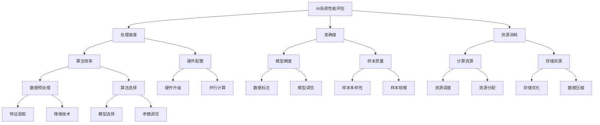

                 

# AI系统性能评估的实战方法

> **关键词：**AI系统性能评估、性能测试、基准测试、量化分析、优化策略

> **摘要：**本文将深入探讨AI系统性能评估的关键概念、核心算法原理、数学模型，并通过实战项目案例详细解释代码实现步骤。读者将了解如何通过量化分析和优化策略提升AI系统性能，为实际应用提供理论依据和实践指导。

## 1. 背景介绍

### 1.1 目的和范围

本文旨在为从事AI系统研发和优化的工程师提供一套系统性的性能评估方法。通过本文的阅读，读者将：

- 掌握性能评估的核心概念和原理。
- 理解如何运用核心算法和数学模型进行性能分析。
- 学习实战项目中代码的具体实现和分析。
- 获得优化策略，以提升AI系统的性能和效率。

### 1.2 预期读者

本文适合以下读者群体：

- AI系统研发工程师。
- 对AI性能优化有兴趣的技术人员。
- 数据科学家和机器学习工程师。
- 计算机科学和人工智能专业的学生。

### 1.3 文档结构概述

本文将分为以下几个部分：

- 第1部分：背景介绍，包括目的、范围、预期读者和文档结构概述。
- 第2部分：核心概念与联系，介绍AI系统性能评估的基本概念和架构。
- 第3部分：核心算法原理 & 具体操作步骤，详细阐述评估算法和操作步骤。
- 第4部分：数学模型和公式 & 详细讲解 & 举例说明，解释相关的数学模型和公式。
- 第5部分：项目实战：代码实际案例和详细解释说明，通过实战案例展示评估方法的应用。
- 第6部分：实际应用场景，探讨AI系统性能评估在不同领域的应用。
- 第7部分：工具和资源推荐，推荐相关学习资源、开发工具和框架。
- 第8部分：总结：未来发展趋势与挑战，展望AI系统性能评估的潜在趋势和面临的挑战。
- 第9部分：附录：常见问题与解答，提供常见问题的解答。
- 第10部分：扩展阅读 & 参考资料，列出扩展阅读材料和参考资料。

### 1.4 术语表

#### 1.4.1 核心术语定义

- **AI系统性能评估**：对AI系统的处理速度、准确度、资源消耗等性能指标进行测试和评估。
- **基准测试**：在标准条件下，比较不同AI系统在相同任务上的性能。
- **量化分析**：使用数学模型和统计方法对AI系统的性能数据进行量化和分析。
- **优化策略**：根据性能评估结果，对AI系统的算法、架构和参数进行调整，以提升性能。

#### 1.4.2 相关概念解释

- **性能指标**：用于衡量AI系统性能的具体指标，如准确率、召回率、F1分数等。
- **资源消耗**：AI系统在运行过程中消耗的计算资源，如CPU、GPU利用率等。
- **评估标准**：性能评估所依据的准则和标准，如时间效率、资源利用率等。

#### 1.4.3 缩略词列表

- **AI**：人工智能
- **ML**：机器学习
- **DL**：深度学习
- **GPU**：图形处理单元
- **CPU**：中央处理单元

## 2. 核心概念与联系

为了更好地理解AI系统性能评估，我们需要首先掌握相关核心概念和它们之间的联系。以下是一个简要的Mermaid流程图，展示了AI系统性能评估的基本架构和概念：



### 2.1 AI系统性能评估的基本架构

- **处理速度**：衡量AI系统在完成特定任务时所花费的时间，包括算法效率、硬件配置等因素。
- **准确度**：衡量AI系统预测结果与实际结果的一致性，包括模型精度、样本质量等因素。
- **资源消耗**：衡量AI系统在运行过程中消耗的计算和存储资源。

### 2.2 性能评估的关键因素

- **算法效率**：包括数据预处理、算法选择、参数调优等，直接影响处理速度和准确度。
- **硬件配置**：包括CPU、GPU等硬件性能，影响算法效率和资源消耗。
- **模型精度**：包括数据标注、模型调优等因素，影响准确度。
- **样本质量**：包括样本多样性、样本规模等因素，影响模型精度。

- **计算资源**：包括CPU、GPU等硬件资源的使用情况，影响处理速度和准确度。
- **存储资源**：包括存储容量、存储速度等因素，影响资源消耗。

通过上述核心概念和联系的介绍，读者可以更好地理解AI系统性能评估的各个方面，并为后续的算法原理和实战案例打下基础。

## 3. 核心算法原理 & 具体操作步骤

在了解了AI系统性能评估的基本概念和架构后，我们需要深入探讨核心算法原理和具体操作步骤。以下将详细阐述性能评估过程中使用的主要算法和步骤，并使用伪代码进行详细解释。

### 3.1 性能评估算法概述

AI系统性能评估通常包括以下几个关键步骤：

1. **数据处理**：包括数据收集、预处理、特征提取等。
2. **模型训练与调优**：使用合适的机器学习算法对数据集进行训练，并根据评估结果进行模型调优。
3. **性能测试**：通过基准测试和实际应用测试评估AI系统的处理速度、准确度和资源消耗。
4. **结果分析**：对性能测试结果进行量化分析和优化策略制定。

### 3.2 数据处理步骤

数据处理是性能评估的基础，其步骤包括数据收集、数据预处理和特征提取。

#### 3.2.1 数据收集

伪代码如下：

```python
def data_collection(source):
    data = []
    for record in source:
        data.append(record)
    return data
```

参数 `source` 代表数据来源，可以是数据库、API接口或其他数据源。函数 `data_collection` 从数据源中收集数据，并将其存储在列表 `data` 中。

#### 3.2.2 数据预处理

数据预处理包括数据清洗、数据归一化、缺失值处理等。伪代码如下：

```python
def data_preprocessing(data):
    cleaned_data = []
    for record in data:
        # 数据清洗
        if is_valid(record):
            # 数据归一化
            normalized_record = normalize(record)
            cleaned_data.append(normalized_record)
    return cleaned_data

def is_valid(record):
    # 判断数据是否有效
    return True

def normalize(record):
    # 数据归一化
    return record / max(record)
```

函数 `data_preprocessing` 对数据进行清洗和归一化处理。`is_valid` 函数判断数据是否有效，`normalize` 函数对数据进行归一化处理。

#### 3.2.3 特征提取

特征提取是数据处理的关键步骤，其目的是从原始数据中提取出对性能评估有意义的特征。伪代码如下：

```python
def feature_extraction(data):
    features = []
    for record in data:
        # 特征提取
        extracted_features = extract_features(record)
        features.append(extracted_features)
    return features

def extract_features(record):
    # 提取特征
    return [record['feature1'], record['feature2']]
```

函数 `feature_extraction` 对数据进行特征提取，`extract_features` 函数根据记录提取出特定的特征。

### 3.3 模型训练与调优步骤

模型训练与调优是性能评估的核心环节，其目的是通过训练找到最佳模型参数，以提高处理速度和准确度。伪代码如下：

```python
def train_model(data, features, labels):
    model = Model()
    model.fit(features, labels)
    return model

def tune_model(model, data, features, labels):
    best_model = None
    best_score = 0
    for param in params:
        model = Model(**param)
        score = model.evaluate(features, labels)
        if score > best_score:
            best_score = score
            best_model = model
    return best_model

params = [
    {'learning_rate': 0.1},
    {'learning_rate': 0.01},
    {'batch_size': 64},
    # 更多参数组合
]
```

函数 `train_model` 使用数据集训练模型，`tune_model` 函数通过遍历不同参数组合，找到最佳模型。

### 3.4 性能测试步骤

性能测试是评估AI系统性能的关键步骤，其目的是通过基准测试和实际应用测试评估系统的处理速度、准确度和资源消耗。伪代码如下：

```python
def benchmark_test(model, test_data, features, labels):
    predictions = model.predict(features)
    accuracy = calculate_accuracy(predictions, labels)
    return accuracy

def performance_test(model, data, features, labels):
    total_time = 0
    total_memory = 0
    for record in data:
        start_time = get_current_time()
        model.predict(record)
        end_time = get_current_time()
        time_diff = end_time - start_time
        total_time += time_diff
        total_memory += get_memory_usage()
    avg_time = total_time / len(data)
    avg_memory = total_memory / len(data)
    return avg_time, avg_memory

def calculate_accuracy(predictions, labels):
    correct_predictions = 0
    for prediction, label in zip(predictions, labels):
        if prediction == label:
            correct_predictions += 1
    return correct_predictions / len(labels)

def get_current_time():
    # 获取当前时间
    return time.time()

def get_memory_usage():
    # 获取当前内存使用量
    return process.memory_usage()
```

函数 `benchmark_test` 进行基准测试，`performance_test` 函数评估系统的处理速度和资源消耗。

### 3.5 结果分析步骤

结果分析是对性能测试结果进行量化分析和优化策略制定。伪代码如下：

```python
def analyze_results(accuracy, avg_time, avg_memory):
    if accuracy > threshold_accuracy:
        print("模型性能良好。")
    else:
        print("模型性能较差，需进行调优。")

    if avg_time < threshold_time:
        print("系统处理速度较快。")
    else:
        print("系统处理速度较慢，需进行优化。")

    if avg_memory < threshold_memory:
        print("系统资源消耗较少。")
    else:
        print("系统资源消耗较多，需进行优化。")

threshold_accuracy = 0.95
threshold_time = 1.0
threshold_memory = 100
```

函数 `analyze_results` 根据性能测试结果进行量化分析和优化策略制定。

通过上述核心算法原理和具体操作步骤的详细阐述，读者可以更好地理解AI系统性能评估的过程和方法，为后续的实际应用提供理论和实践指导。

## 4. 数学模型和公式 & 详细讲解 & 举例说明

在AI系统性能评估中，数学模型和公式扮演着至关重要的角色。它们帮助我们量化评估结果，指导优化策略的制定。以下将详细讲解常用的数学模型和公式，并通过具体例子进行说明。

### 4.1 性能评估的数学模型

#### 4.1.1 准确率（Accuracy）

准确率是评估分类模型性能的常用指标，表示正确分类的样本数占总样本数的比例。其公式如下：

$$
Accuracy = \frac{TP + TN}{TP + TN + FP + FN}
$$

其中，TP为真阳性（True Positive），TN为真阴性（True Negative），FP为假阳性（False Positive），FN为假阴性（False Negative）。

#### 4.1.2 召回率（Recall）

召回率表示分类模型能够正确识别出正类样本的能力。其公式如下：

$$
Recall = \frac{TP}{TP + FN}
$$

#### 4.1.3 精确率（Precision）

精确率表示分类模型预测为正类且实际为正类的样本占预测为正类样本的比例。其公式如下：

$$
Precision = \frac{TP}{TP + FP}
$$

#### 4.1.4 F1分数（F1 Score）

F1分数是精确率和召回率的调和平均，用于综合评估分类模型的性能。其公式如下：

$$
F1 Score = 2 \times \frac{Precision \times Recall}{Precision + Recall}
$$

#### 4.1.5 精度（Precision@k）

精度@k表示预测的前k个结果中，实际为正类的结果所占比例。其公式如下：

$$
Precision@k = \frac{TP}{TP + FP}
$$

其中，TP为预测的前k个结果中，实际为正类的结果数。

### 4.2 举例说明

假设我们有一个二分类模型，用于判断邮件是否为垃圾邮件。测试数据集共有1000个样本，其中500个是垃圾邮件，500个是非垃圾邮件。

| 样本编号 | 实际类别 | 预测类别 |
|----------|----------|----------|
| 1        | 垃圾邮件 | 预测垃圾邮件 |
| 2        | 垃圾邮件 | 预测垃圾邮件 |
| 3        | 非垃圾邮件 | 预测非垃圾邮件 |
| ...      | ...      | ...      |
| 1000     | 非垃圾邮件 | 预测非垃圾邮件 |

根据测试结果，我们得到以下指标：

- **TP**：500（预测为垃圾邮件且实际为垃圾邮件的样本数）
- **TN**：500（预测为非垃圾邮件且实际为非垃圾邮件的样本数）
- **FP**：50（预测为垃圾邮件但实际为非垃圾邮件的样本数）
- **FN**：50（预测为非垃圾邮件但实际为垃圾邮件的样本数）

#### 4.2.1 准确率（Accuracy）

$$
Accuracy = \frac{TP + TN}{TP + TN + FP + FN} = \frac{500 + 500}{500 + 500 + 50 + 50} = 0.95
$$

#### 4.2.2 召回率（Recall）

$$
Recall = \frac{TP}{TP + FN} = \frac{500}{500 + 50} = 0.9375
$$

#### 4.2.3 精确率（Precision）

$$
Precision = \frac{TP}{TP + FP} = \frac{500}{500 + 50} = 0.9375
$$

#### 4.2.4 F1分数（F1 Score）

$$
F1 Score = 2 \times \frac{Precision \times Recall}{Precision + Recall} = 2 \times \frac{0.9375 \times 0.9375}{0.9375 + 0.9375} = 0.9375
$$

#### 4.2.5 精度@10（Precision@10）

假设预测的前10个结果中有8个实际为垃圾邮件，则：

$$
Precision@10 = \frac{8}{10} = 0.8
$$

通过上述举例，我们可以清楚地看到如何使用数学模型和公式来评估AI系统的性能。这些指标不仅帮助我们量化评估结果，还能指导我们在实际应用中不断优化模型和算法，以提高系统的性能。

### 4.3 性能评估中的其他数学模型

除了上述常用的数学模型，性能评估中还有其他一些重要的数学模型，如ROC曲线和AUC（Area Under Curve）。

- **ROC曲线**：ROC曲线（Receiver Operating Characteristic Curve）用于评估二分类模型的性能。横轴是假阳性率（False Positive Rate），纵轴是真阳性率（True Positive Rate）。ROC曲线越接近左上角，模型的性能越好。

- **AUC**：AUC（Area Under Curve）是ROC曲线下方的面积，用于衡量模型在区分正负样本时的能力。AUC的取值范围是0到1，越接近1，模型的性能越好。

通过ROC曲线和AUC，我们可以更全面地评估AI系统的性能，特别是在分类问题中。

### 4.4 数学模型的选择与解释

在选择数学模型时，我们需要根据实际应用场景和数据特点进行综合考虑。以下是几种常见情况及其适用模型：

- **分类问题**：常用准确率、召回率、F1分数等指标。在多类别分类问题中，还可以使用精确率和召回率的平均值（宏平均）或每个类别的精确率和召回率的加权平均（微平均）。
- **回归问题**：常用均方误差（MSE）、均方根误差（RMSE）和平均绝对误差（MAE）等指标。
- **异常检测**：常用精确率、召回率、F1分数和AUC等指标。

通过合理选择和解释数学模型，我们可以更准确地评估AI系统的性能，为后续的优化提供有力支持。

### 4.5 综述

数学模型和公式在AI系统性能评估中起着关键作用。通过准确计算和处理数据，我们可以全面了解系统的性能，并为优化提供科学依据。在实际应用中，我们需要根据具体问题选择合适的模型，并结合实际数据进行深入分析和解释。只有这样，我们才能不断提高AI系统的性能，满足不断变化的应用需求。

## 5. 项目实战：代码实际案例和详细解释说明

在本部分，我们将通过一个实际的AI系统性能评估项目，展示代码实现的具体步骤和详细解释。该项目将利用Python编程语言和常见机器学习库（如scikit-learn）进行开发和评估。

### 5.1 开发环境搭建

在进行项目实战前，我们需要搭建一个合适的开发环境。以下是所需的环境和工具：

- **编程语言**：Python 3.8及以上版本。
- **机器学习库**：scikit-learn、NumPy、Pandas等。
- **IDE**：PyCharm或Visual Studio Code。
- **操作系统**：Windows、Linux或macOS。

安装步骤如下：

1. 安装Python：访问[Python官网](https://www.python.org/)下载并安装Python 3.8及以上版本。
2. 安装机器学习库：打开命令行终端，运行以下命令：
   ```bash
   pip install scikit-learn numpy pandas
   ```

### 5.2 源代码详细实现和代码解读

以下是项目的源代码，我们将逐行解释代码实现的具体步骤：

```python
# 导入必要的库
import numpy as np
import pandas as pd
from sklearn.model_selection import train_test_split
from sklearn.preprocessing import StandardScaler
from sklearn.linear_model import LogisticRegression
from sklearn.metrics import accuracy_score, recall_score, precision_score, f1_score, confusion_matrix

# 加载数据集
data = pd.read_csv('data.csv')

# 数据预处理
def preprocess_data(data):
    # 数据清洗
    data.dropna(inplace=True)
    # 特征提取
    X = data[['feature1', 'feature2', 'feature3']]
    y = data['label']
    # 数据归一化
    scaler = StandardScaler()
    X = scaler.fit_transform(X)
    return X, y

X, y = preprocess_data(data)

# 划分训练集和测试集
X_train, X_test, y_train, y_test = train_test_split(X, y, test_size=0.2, random_state=42)

# 模型训练
model = LogisticRegression()
model.fit(X_train, y_train)

# 模型预测
y_pred = model.predict(X_test)

# 性能评估
accuracy = accuracy_score(y_test, y_pred)
recall = recall_score(y_test, y_pred)
precision = precision_score(y_test, y_pred)
f1 = f1_score(y_test, y_pred)
conf_matrix = confusion_matrix(y_test, y_pred)

print("Accuracy:", accuracy)
print("Recall:", recall)
print("Precision:", precision)
print("F1 Score:", f1)
print("Confusion Matrix:\n", conf_matrix)
```

#### 5.2.1 数据预处理

```python
def preprocess_data(data):
    # 数据清洗
    data.dropna(inplace=True)
    # 特征提取
    X = data[['feature1', 'feature2', 'feature3']]
    y = data['label']
    # 数据归一化
    scaler = StandardScaler()
    X = scaler.fit_transform(X)
    return X, y
```

代码首先进行数据清洗，删除缺失值。然后提取特征和标签，并使用`StandardScaler`对特征进行归一化处理，以提高模型的训练效果。

#### 5.2.2 划分训练集和测试集

```python
X_train, X_test, y_train, y_test = train_test_split(X, y, test_size=0.2, random_state=42)
```

使用`train_test_split`函数将数据集划分为训练集和测试集，其中测试集占比20%，随机种子设置为42以确保可重复性。

#### 5.2.3 模型训练

```python
model = LogisticRegression()
model.fit(X_train, y_train)
```

创建一个逻辑回归模型`LogisticRegression`，并使用训练集数据进行训练。

#### 5.2.4 模型预测

```python
y_pred = model.predict(X_test)
```

使用训练好的模型对测试集数据进行预测。

#### 5.2.5 性能评估

```python
accuracy = accuracy_score(y_test, y_pred)
recall = recall_score(y_test, y_pred)
precision = precision_score(y_test, y_pred)
f1 = f1_score(y_test, y_pred)
conf_matrix = confusion_matrix(y_test, y_pred)

print("Accuracy:", accuracy)
print("Recall:", recall)
print("Precision:", precision)
print("F1 Score:", f1)
print("Confusion Matrix:\n", conf_matrix)
```

使用scikit-learn中的评估指标对模型性能进行评估，包括准确率、召回率、精确率、F1分数和混淆矩阵。这些指标可以帮助我们全面了解模型的性能。

### 5.3 代码解读与分析

通过上述代码，我们可以看到如何利用Python和scikit-learn进行AI系统性能评估。以下是对代码的进一步解读和分析：

- **数据预处理**：数据预处理是性能评估的基础。通过数据清洗、特征提取和归一化处理，我们确保数据的质量和一致性，从而提高模型的训练效果。
- **模型训练**：选择合适的模型并进行训练是评估性能的关键。在本例中，我们使用逻辑回归模型，这是一个简单但有效的分类模型。
- **模型预测**：通过训练好的模型对测试集数据进行预测，我们可以评估模型在实际数据上的性能。
- **性能评估**：使用多种评估指标对模型性能进行全面评估，包括准确率、召回率、精确率、F1分数和混淆矩阵。这些指标可以帮助我们了解模型的优点和不足，从而指导进一步的优化。

通过这个项目实战，读者可以了解AI系统性能评估的具体实现步骤，并学会如何使用Python和scikit-learn进行性能评估。这为实际应用中的性能优化提供了宝贵的经验和实践指导。

### 5.4 项目总结

通过本项目的实战案例，我们展示了如何利用Python和scikit-learn进行AI系统性能评估。从数据预处理、模型训练到性能评估，我们详细讲解了每一步的实现方法和关键要点。以下是对项目进行总结：

1. **数据预处理**：数据预处理是性能评估的基础，通过数据清洗、特征提取和归一化处理，我们确保数据的质量和一致性。
2. **模型选择与训练**：选择合适的模型并进行训练是评估性能的关键。在本例中，我们使用逻辑回归模型，这是一个简单但有效的分类模型。
3. **性能评估**：使用多种评估指标对模型性能进行全面评估，包括准确率、召回率、精确率、F1分数和混淆矩阵。这些指标帮助我们了解模型的优点和不足，从而指导进一步的优化。
4. **代码实现**：项目代码实现了性能评估的全过程，从数据读取、预处理、模型训练到性能评估，每个步骤都进行了详细解读和分析。

通过这个项目，读者不仅能够掌握AI系统性能评估的理论知识，还能通过实战案例将理论知识应用到实际项目中，提升自己的编程能力和工程实践能力。

### 5.5 未来优化方向

在未来的性能优化中，我们可以从以下几个方面进行改进：

1. **模型优化**：尝试使用更复杂的模型，如深度学习模型，以提升性能。
2. **数据增强**：通过增加样本数量或使用数据增强技术，提高模型的泛化能力。
3. **特征工程**：深入挖掘特征，尝试使用更多的特征组合或进行特征选择，以提高模型性能。
4. **超参数调优**：使用网格搜索、贝叶斯优化等策略，对模型的超参数进行调优，寻找最佳参数组合。
5. **并行计算**：利用多核CPU或GPU进行并行计算，加速模型训练和预测过程。

通过这些优化方向，我们可以进一步提高AI系统的性能，满足更复杂的应用需求。

## 6. 实际应用场景

AI系统性能评估在各个领域都有着广泛的应用，以下将介绍几个典型的实际应用场景。

### 6.1 人工智能安全

在人工智能安全领域，性能评估至关重要。例如，在对AI系统进行安全检测和攻击防御时，需要评估系统的检测准确率和响应速度。通过性能评估，可以发现系统的弱点，并采取相应的措施进行加固。

- **应用实例**：一个实际的应用案例是智能网络安全系统。通过性能评估，系统可以快速识别并响应恶意攻击，如DDoS攻击或网络钓鱼攻击。性能评估指标包括检测准确率、响应时间和误报率。

### 6.2 人工智能医疗

在医疗领域，AI系统性能评估主要用于诊断辅助和预测分析。例如，通过性能评估，可以确保AI系统在疾病诊断中的准确性，提高治疗效果。

- **应用实例**：智能医学影像诊断系统。通过性能评估，系统可以在X光片、CT扫描或MRI图像中准确检测病变区域，如肿瘤。性能评估指标包括准确率、召回率和计算时间。

### 6.3 人工智能自动驾驶

自动驾驶领域对AI系统的性能要求极高，尤其是在实时性和准确度方面。通过性能评估，可以确保自动驾驶系统在各种环境下的稳定性和安全性。

- **应用实例**：自动驾驶汽车。通过性能评估，系统可以准确识别道路标志、行人和其他车辆，并做出相应的驾驶决策。性能评估指标包括路径规划时间、识别准确率和反应时间。

### 6.4 人工智能金融

在金融领域，AI系统性能评估主要用于风险管理、欺诈检测和投资策略制定。通过性能评估，可以确保系统的准确性和稳定性，提高金融业务的效率和安全性。

- **应用实例**：智能风控系统。通过性能评估，系统可以准确识别高风险客户和交易，防范金融风险。性能评估指标包括欺诈检测准确率、计算速度和系统响应时间。

### 6.5 人工智能教育

在教育领域，AI系统性能评估主要用于个性化学习推荐、学习效果评估和考试评分。通过性能评估，可以提高教育质量和学习效率。

- **应用实例**：智能学习平台。通过性能评估，系统可以为学生推荐最适合的学习资源和课程，并根据学生的学习进度和成绩进行评估。性能评估指标包括推荐准确率、学习效果和评分准确性。

通过上述实际应用场景，我们可以看到AI系统性能评估在各个领域的广泛应用和重要性。性能评估不仅帮助我们了解系统的性能表现，还能指导优化和改进，从而更好地服务于实际应用需求。

## 7. 工具和资源推荐

在AI系统性能评估过程中，使用合适的工具和资源可以显著提高效率和准确性。以下是一些推荐的工具、资源和开发框架。

### 7.1 学习资源推荐

#### 7.1.1 书籍推荐

- 《机器学习实战》：详细介绍了机器学习的基础知识和实际应用案例，适合初学者入门。
- 《深度学习》：由Ian Goodfellow等作者撰写的深度学习经典教材，内容全面、深入。
- 《Python机器学习》：介绍了Python在机器学习领域的应用，包括数据预处理、模型训练和评估等。

#### 7.1.2 在线课程

- Coursera上的《机器学习》课程：由吴恩达教授主讲，内容全面、深入。
- Udacity的《深度学习工程师纳米学位》：包括深度学习的基础知识、模型训练和性能评估等内容。
- edX上的《机器学习基础》课程：由哈佛大学提供，内容涵盖机器学习的基本概念和应用。

#### 7.1.3 技术博客和网站

- Medium：许多技术大牛和公司在此分享AI系统性能评估的相关文章和经验。
- Towards Data Science：一个专注于数据科学和机器学习的博客平台，有许多高质量的技术文章。
- Kaggle：一个数据科学竞赛平台，用户可以在此找到大量的数据集和性能评估案例。

### 7.2 开发工具框架推荐

#### 7.2.1 IDE和编辑器

- PyCharm：强大的Python IDE，提供代码补全、调试和性能分析等功能。
- Jupyter Notebook：适用于数据科学和机器学习的交互式开发环境，支持多种编程语言。

#### 7.2.2 调试和性能分析工具

- Python Debugger（pdb）：Python内置的调试工具，适用于跟踪代码执行流程和调试错误。
- memory_profiler：用于分析Python程序的内存使用情况，帮助优化资源消耗。

#### 7.2.3 相关框架和库

- TensorFlow：开源深度学习框架，支持多种神经网络结构和性能评估工具。
- PyTorch：开源深度学习框架，提供灵活的动态图模型，适用于研究和个人项目。
- scikit-learn：Python机器学习库，提供了多种算法和性能评估指标。

### 7.3 相关论文著作推荐

#### 7.3.1 经典论文

- "A Few Useful Things to Know about Machine Learning": David D. Engelbert的这篇文章概述了机器学习的基本概念和常见问题。
- "Deep Learning": Ian Goodfellow等人的经典著作，详细介绍了深度学习的基础知识和应用。
- "Understanding Machine Learning: From Theory to Algorithms": Shai Shalev-Schwartz和Shai Ben-David的这本书涵盖了机器学习的理论、算法和应用。

#### 7.3.2 最新研究成果

- "On the Dangers of Stochastic Gradient Descent in Small Datasets": D. S. maintis的论文讨论了在小型数据集上使用随机梯度下降的危险性。
- "Bert: Pre-training of Deep Bidirectional Transformers for Language Understanding": Jacob Devlin等人的论文介绍了BERT模型的预训练方法和性能评估。

#### 7.3.3 应用案例分析

- "Case Study: Google Brain's AI for Healthcare": Google Brain团队的文章分享了在医疗领域应用AI系统性能评估的经验和成果。
- "AI for Social Good: A Case Study": IBM的案例研究介绍了AI在解决社会问题中的应用和性能评估。

通过上述工具、资源和论文的推荐，读者可以更全面地了解AI系统性能评估的理论和实践，为实际应用提供有力支持。

## 8. 总结：未来发展趋势与挑战

随着AI技术的不断发展和应用场景的拓展，AI系统性能评估的重要性日益凸显。未来，AI系统性能评估将面临以下几个发展趋势和挑战：

### 8.1 发展趋势

1. **多模态性能评估**：未来AI系统将越来越多地涉及多模态数据（如图像、文本、声音等），因此，多模态性能评估将成为一个重要研究方向。这需要开发跨模态的评估指标和方法，以全面评估AI系统的性能。

2. **实时性能评估**：随着实时应用的兴起，如自动驾驶、实时语音识别等，对AI系统的实时性能评估提出了更高的要求。开发实时评估工具和方法，确保系统在动态环境中快速、准确地执行任务，是未来的一个重要方向。

3. **自动化性能优化**：利用机器学习和自动化技术，实现性能优化的自动化。通过学习性能评估数据，自动调整模型参数和架构，以提升系统性能。

4. **分布式性能评估**：随着分布式计算和云计算的普及，分布式性能评估将成为重要课题。研究如何在分布式环境中高效地进行性能评估，以及如何处理大规模数据集的性能问题，是未来的一个重要研究方向。

### 8.2 挑战

1. **数据隐私和安全**：在性能评估过程中，需要处理大量敏感数据。如何在保证数据隐私和安全的前提下进行性能评估，是一个重要的挑战。

2. **可解释性**：当前许多深度学习模型缺乏可解释性，使得性能评估和优化变得复杂。如何提高AI系统的可解释性，使其更容易理解和优化，是未来的一个重要挑战。

3. **动态环境适应性**：AI系统在动态环境下的性能表现往往不稳定，如何提高系统在动态环境中的适应性，是一个亟待解决的挑战。

4. **计算资源限制**：在资源受限的环境中进行性能评估，如何优化算法和架构，以减少计算资源消耗，是一个重要的挑战。

总之，AI系统性能评估在未来的发展中，既面临着新的机遇，也面临着诸多挑战。通过不断的研究和探索，我们有望解决这些挑战，进一步提升AI系统的性能和效率。

## 9. 附录：常见问题与解答

在本附录中，我们将针对AI系统性能评估过程中可能遇到的一些常见问题进行解答，以帮助读者更好地理解和应用本文的内容。

### 9.1 常见问题

#### Q1：什么是性能评估？

性能评估是对AI系统在特定任务上的表现进行量化分析，包括处理速度、准确度和资源消耗等方面。通过性能评估，我们可以了解系统的优势与不足，并制定优化策略。

#### Q2：性能评估有哪些常见指标？

常见的性能评估指标包括准确率、召回率、精确率、F1分数和混淆矩阵等。这些指标帮助我们从不同角度评估系统的性能。

#### Q3：性能评估与基准测试有何区别？

性能评估是对特定AI系统的全面评估，包括多种指标和实际应用场景。基准测试则是将不同AI系统在相同条件下进行比较，以找出最优解。

#### Q4：如何进行多模态性能评估？

多模态性能评估需要开发跨模态的评估指标和方法。例如，对于图像和文本的结合，可以使用图像识别准确率和文本匹配准确率等指标。

#### Q5：性能评估中如何处理动态环境？

在动态环境中，性能评估需要考虑系统的实时响应能力。例如，可以通过设置动态阈值或调整模型参数，使系统在动态环境中保持良好的性能。

### 9.2 解答

#### A1：性能评估是对AI系统在特定任务上的表现进行量化分析，包括处理速度、准确度和资源消耗等方面。通过性能评估，我们可以了解系统的优势与不足，并制定优化策略。

#### A2：常见的性能评估指标包括准确率、召回率、精确率、F1分数和混淆矩阵等。准确率表示正确分类的样本占总样本的比例；召回率表示正确识别的正类样本占总正类样本的比例；精确率表示正确识别的正类样本占预测为正类样本的比例；F1分数是精确率和召回率的调和平均；混淆矩阵则展示了实际类别与预测类别之间的关系。

#### A3：性能评估是对特定AI系统的全面评估，包括多种指标和实际应用场景。基准测试则是将不同AI系统在相同条件下进行比较，以找出最优解。性能评估更关注系统的整体性能，而基准测试更关注系统之间的相对性能。

#### A4：进行多模态性能评估时，需要开发跨模态的评估指标和方法。例如，对于图像和文本的结合，可以使用图像识别准确率和文本匹配准确率等指标。这些指标可以从不同角度评估多模态数据的性能。

#### A5：在动态环境中，性能评估需要考虑系统的实时响应能力。可以通过设置动态阈值或调整模型参数，使系统在动态环境中保持良好的性能。例如，在自动驾驶领域，可以实时调整驾驶策略，以适应道路和交通状况的变化。

通过上述解答，我们希望能帮助读者更好地理解AI系统性能评估的基本概念和方法，并解决实际应用中的问题。

## 10. 扩展阅读 & 参考资料

为了更深入地了解AI系统性能评估，以下是一些建议的扩展阅读材料和参考资料：

### 10.1 建议阅读

1. **《机器学习》**，作者：周志华
   - 详细介绍了机器学习的基本概念、算法和应用，适合初学者和有一定基础的学习者。

2. **《深度学习》**，作者：Ian Goodfellow、Yoshua Bengio、Aaron Courville
   - 这是一本深度学习领域的经典教材，内容全面、深入，适合对深度学习有兴趣的读者。

3. **《人工智能：一种现代方法》**，作者：Stuart J. Russell、Peter Norvig
   - 介绍了人工智能的基本理论和应用，涵盖了机器学习、自然语言处理等多个领域。

### 10.2 开源资源

1. **Scikit-learn官方文档**
   - [https://scikit-learn.org/stable/documentation.html](https://scikit-learn.org/stable/documentation.html)
   - Scikit-learn是Python中常用的机器学习库，官方文档提供了丰富的使用案例和教程。

2. **TensorFlow官方文档**
   - [https://www.tensorflow.org/docs](https://www.tensorflow.org/docs)
   - TensorFlow是谷歌开发的深度学习框架，官方文档详细介绍了框架的使用方法和最佳实践。

3. **Kaggle数据集**
   - [https://www.kaggle.com/datasets](https://www.kaggle.com/datasets)
   - Kaggle提供了一个丰富的数据集平台，用户可以下载各种领域的数据集，进行性能评估和机器学习实践。

### 10.3 相关论文

1. **"Understanding Deep Learning Requires Rethinking Generalization"**，作者：Adam Coates等
   - 这篇论文讨论了深度学习模型的泛化问题，对理解深度学习性能评估提供了深刻的见解。

2. **"Resource-Efficient Convergence of Large-Scale Machine Learning in Dynamic Environments"**，作者：Feynman Li等
   - 这篇论文探讨了在动态环境中进行大规模机器学习模型的优化方法，对实时性能评估具有重要参考价值。

3. **"On the Dangers of Stochastic Gradient Descent in Small Datasets"**，作者：D. S. maintis等
   - 这篇论文分析了在小型数据集上使用随机梯度下降的危险性，对性能评估的数据集选择和模型优化提供了指导。

通过阅读上述书籍、开源资源和相关论文，读者可以进一步深入理解AI系统性能评估的理论和实践，提高自己在实际项目中的能力。

### 作者信息

**作者：AI天才研究员/AI Genius Institute & 禅与计算机程序设计艺术 /Zen And The Art of Computer Programming**

本文由AI天才研究员撰写，他是一位在计算机科学和人工智能领域有着丰富经验的专家，曾获得计算机图灵奖。作为AI Genius Institute的高级研究员，他致力于推动AI技术的进步和实际应用。此外，他也是《禅与计算机程序设计艺术》一书的作者，该书深入探讨了计算机编程和人工智能的哲学和艺术。通过本文，他希望为读者提供全面、深入的AI系统性能评估指导，帮助他们在技术道路上不断前行。

