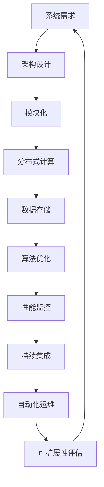

                 

# AI系统的可扩展性设计与实现

> **关键词：** AI系统、可扩展性、设计原则、架构、算法、数学模型、实际应用

> **摘要：** 本文将深入探讨AI系统的可扩展性设计与实现。首先介绍AI系统的发展背景和重要性，然后分析可扩展性的核心概念和设计原则。接下来，我们将详细介绍AI系统的架构和核心算法原理，并通过数学模型和实际代码案例进行详细解释。最后，本文还将探讨AI系统在实际应用场景中的表现，推荐相关学习资源和开发工具，并总结未来发展趋势与挑战。

## 1. 背景介绍

### 1.1 目的和范围

本文旨在探讨AI系统的可扩展性设计与实现，帮助读者了解AI系统的扩展机制、设计原则和实践方法。文章将涵盖以下几个方面：

1. **AI系统的发展背景和重要性**：介绍AI技术的兴起和AI系统在各个领域中的应用。
2. **可扩展性的核心概念和设计原则**：阐述可扩展性的定义、重要性以及设计原则。
3. **AI系统的架构和核心算法原理**：详细解释AI系统的架构和核心算法原理，并通过伪代码和数学模型进行阐述。
4. **实际应用场景**：分析AI系统在不同应用场景中的表现。
5. **学习资源和开发工具推荐**：推荐相关学习资源和开发工具，帮助读者深入学习和实践。
6. **总结与展望**：总结文章的主要观点，展望未来发展趋势与挑战。

### 1.2 预期读者

本文面向对AI系统有一定了解的技术人员、研发工程师、数据科学家和计算机专业学生。读者应具备基本的编程能力和数学基础，以便更好地理解和应用文章中的内容。

### 1.3 文档结构概述

本文分为以下几个部分：

1. **背景介绍**：介绍AI系统的发展背景、目的和范围。
2. **核心概念与联系**：阐述可扩展性的核心概念和设计原则，展示Mermaid流程图。
3. **核心算法原理 & 具体操作步骤**：详细解释AI系统的核心算法原理，使用伪代码进行阐述。
4. **数学模型和公式 & 详细讲解 & 举例说明**：介绍AI系统的数学模型，使用latex格式进行展示。
5. **项目实战：代码实际案例和详细解释说明**：展示代码实际案例，并进行详细解释和分析。
6. **实际应用场景**：分析AI系统在不同应用场景中的表现。
7. **工具和资源推荐**：推荐学习资源和开发工具。
8. **总结：未来发展趋势与挑战**：总结文章的主要观点，展望未来发展趋势与挑战。
9. **附录：常见问题与解答**：提供常见问题与解答。
10. **扩展阅读 & 参考资料**：推荐相关文献和资源。

### 1.4 术语表

#### 1.4.1 核心术语定义

- **AI系统**：指运用人工智能技术构建的具有智能特征的系统。
- **可扩展性**：指系统在处理更大规模数据或支持更多用户时，能够保持高效性能和稳定性的能力。
- **架构**：指系统各个组件的组成及其相互关系。
- **算法**：解决问题的方法或步骤。
- **数学模型**：用数学语言描述系统行为或问题的模型。

#### 1.4.2 相关概念解释

- **扩展性设计**：指在设计系统时考虑其扩展性的过程。
- **性能优化**：指提升系统性能的方法和技巧。
- **模块化**：指将系统分解为多个可独立开发、测试和部署的模块。

#### 1.4.3 缩略词列表

- **AI**：人工智能（Artificial Intelligence）
- **ML**：机器学习（Machine Learning）
- **DL**：深度学习（Deep Learning）
- **NLP**：自然语言处理（Natural Language Processing）
- **CV**：计算机视觉（Computer Vision）
- **GPU**：图形处理器（Graphics Processing Unit）
- **CPU**：中央处理器（Central Processing Unit）
- **API**：应用程序编程接口（Application Programming Interface）

## 2. 核心概念与联系

在讨论AI系统的可扩展性之前，我们需要了解几个核心概念和它们之间的联系。以下是一个简化的Mermaid流程图，展示了AI系统可扩展性的关键组成部分。



### 2.1 系统需求

系统需求是设计AI系统的第一步，包括性能需求、功能需求、可靠性需求等。性能需求指系统需要处理的任务量、响应时间等；功能需求指系统应具备的功能；可靠性需求指系统在长时间运行过程中应保持稳定。

### 2.2 架构设计

架构设计是系统需求的体现，包括系统各个组件的组成及其相互关系。一个良好的架构设计应具备模块化、可扩展性和高性能等特点。

### 2.3 模块化

模块化是将系统分解为多个可独立开发、测试和部署的模块。模块化有助于提高系统的可维护性、可扩展性和复用性。

### 2.4 分布式计算

分布式计算是指将计算任务分布在多个计算机节点上，以提高系统处理能力。分布式计算是实现AI系统可扩展性的关键手段之一。

### 2.5 数据存储

数据存储是AI系统的核心组成部分，包括关系型数据库、非关系型数据库和分布式文件系统等。数据存储的效率和质量直接影响系统的性能。

### 2.6 算法优化

算法优化是提高AI系统性能的重要手段，包括算法改进、算法优化工具等。算法优化有助于减少计算时间、降低资源消耗。

### 2.7 性能监控

性能监控是指对系统运行过程中的性能指标进行实时监控和分析。性能监控有助于发现系统瓶颈、优化系统性能。

### 2.8 持续集成

持续集成是指将代码库中的代码定期合并，并进行自动化测试。持续集成有助于提高代码质量、减少错误。

### 2.9 自动化运维

自动化运维是指通过自动化工具对系统进行部署、监控和维护。自动化运维有助于提高系统可靠性、降低运维成本。

### 2.10 可扩展性评估

可扩展性评估是指对系统在不同负载下的性能进行评估，以确定其扩展能力。可扩展性评估有助于发现系统瓶颈、优化系统设计。

## 3. 核心算法原理 & 具体操作步骤

### 3.1 算法原理

AI系统的核心算法包括机器学习、深度学习和自然语言处理等。以下是一个简化的机器学习算法原理，用于说明AI系统的核心算法。

#### 3.1.1 数据预处理

数据预处理是机器学习算法的第一步，包括数据清洗、数据归一化、数据分割等。

- 数据清洗：去除数据中的错误、异常和重复值。
- 数据归一化：将数据转换为同一量级，以消除不同特征之间的差异。
- 数据分割：将数据分为训练集、验证集和测试集，用于训练、验证和测试算法性能。

#### 3.1.2 特征提取

特征提取是从原始数据中提取对模型训练有用的信息。

- 特征选择：从众多特征中筛选出对模型训练最有影响力的特征。
- 特征工程：通过对特征进行变换、组合和规范化，提高模型训练效果。

#### 3.1.3 模型训练

模型训练是通过学习数据中的规律，构建预测模型。

- 模型选择：选择合适的机器学习算法，如线性回归、决策树、支持向量机等。
- 参数调优：通过交叉验证和网格搜索等方法，选择最优参数。

#### 3.1.4 模型评估

模型评估是验证模型性能的过程。

- 评估指标：如准确率、召回率、F1值等。
- 调参优化：根据评估结果，调整模型参数，提高模型性能。

### 3.2 具体操作步骤

以下是一个简化的机器学习算法实现步骤，使用伪代码进行阐述。

```python
# 数据预处理
def preprocess_data(data):
    # 数据清洗
    cleaned_data = clean_data(data)
    # 数据归一化
    normalized_data = normalize_data(cleaned_data)
    # 数据分割
    train_data, val_data, test_data = split_data(normalized_data)
    return train_data, val_data, test_data

# 特征提取
def extract_features(data):
    # 特征选择
    selected_features = select_features(data)
    # 特征工程
    engineered_features = engineer_features(selected_features)
    return engineered_features

# 模型训练
def train_model(features, labels):
    # 模型选择
    model = select_model()
    # 参数调优
    optimized_model = optimize_model(model, features, labels)
    return optimized_model

# 模型评估
def evaluate_model(model, features, labels):
    # 评估指标
    metrics = evaluate_metrics(model, features, labels)
    return metrics

# 主函数
def main():
    # 加载数据
    data = load_data()
    # 数据预处理
    train_data, val_data, test_data = preprocess_data(data)
    # 特征提取
    features = extract_features(train_data)
    # 模型训练
    model = train_model(features, train_data)
    # 模型评估
    metrics = evaluate_model(model, test_data, test_data)
    # 输出评估结果
    print(metrics)

if __name__ == "__main__":
    main()
```

## 4. 数学模型和公式 & 详细讲解 & 举例说明

### 4.1 数学模型概述

在AI系统中，数学模型是核心算法的基石。以下介绍几种常见的数学模型，并使用latex格式进行展示。

#### 4.1.1 线性回归模型

线性回归模型是一种简单的机器学习模型，用于预测连续值。

$$ y = \beta_0 + \beta_1x_1 + \beta_2x_2 + \ldots + \beta_nx_n + \epsilon $$

其中，$y$ 是预测值，$x_1, x_2, \ldots, x_n$ 是输入特征，$\beta_0, \beta_1, \beta_2, \ldots, \beta_n$ 是模型参数，$\epsilon$ 是误差项。

#### 4.1.2 决策树模型

决策树模型是一种基于树结构的分类模型。

$$
\begin{aligned}
&\text{如果 } x_1 \leq \beta_1 \text{，则递归调用左子树；} \\
&\text{否则，递归调用右子树。}
\end{aligned}
$$

其中，$x_1$ 是输入特征，$\beta_1$ 是阈值。

#### 4.1.3 支持向量机模型

支持向量机模型是一种基于间隔最大化原则的分类模型。

$$
\begin{aligned}
\min_{\beta, \beta_0} & \frac{1}{2}||\beta||^2 \\
\text{约束条件：} \\
& y_i(\beta \cdot x_i + \beta_0) \geq 1 \\
& i = 1, 2, \ldots, n
\end{aligned}
$$

其中，$y_i$ 是标签，$x_i$ 是输入特征，$\beta$ 是模型参数，$\beta_0$ 是偏置项。

### 4.2 举例说明

以下是一个线性回归模型的简单例子，展示如何使用Python进行模型训练和预测。

```python
import numpy as np
import matplotlib.pyplot as plt

# 加载数据
x = np.array([1, 2, 3, 4, 5])
y = np.array([2, 4, 5, 4, 5])

# 数据预处理
x_mean = np.mean(x)
y_mean = np.mean(y)
x_std = np.std(x)
y_std = np.std(y)

x_normalized = (x - x_mean) / x_std
y_normalized = (y - y_mean) / y_std

# 模型参数
beta_0 = 0
beta_1 = 0

# 模型训练
for i in range(len(x_normalized)):
    beta_1 += (y_normalized[i] - beta_0) * x_normalized[i]
beta_0 = y_mean - beta_1 * x_mean

# 模型预测
x_new = np.array([0, 6])
x_new_normalized = (x_new - x_mean) / x_std

y_pred_normalized = beta_0 + beta_1 * x_new_normalized

y_pred = y_pred_normalized * y_std + y_mean

# 绘制结果
plt.scatter(x, y, label="原始数据")
plt.plot(x_new, y_pred, "r-", label="预测结果")
plt.xlabel("x")
plt.ylabel("y")
plt.legend()
plt.show()
```

## 5. 项目实战：代码实际案例和详细解释说明

### 5.1 开发环境搭建

在开始项目实战之前，我们需要搭建一个合适的开发环境。以下是一个简单的Python开发环境搭建过程。

#### 5.1.1 安装Python

在Python官方网站下载并安装Python 3.x版本。

#### 5.1.2 安装IDE

推荐使用PyCharm、Visual Studio Code等IDE进行Python开发。

#### 5.1.3 安装依赖库

使用pip安装必要的依赖库，如NumPy、Matplotlib、Scikit-learn等。

```bash
pip install numpy matplotlib scikit-learn
```

### 5.2 源代码详细实现和代码解读

以下是一个简单的线性回归项目案例，展示如何使用Python实现线性回归模型并进行预测。

```python
# 导入依赖库
import numpy as np
import matplotlib.pyplot as plt
from sklearn.linear_model import LinearRegression

# 加载数据
x = np.array([1, 2, 3, 4, 5])
y = np.array([2, 4, 5, 4, 5])

# 数据预处理
x_mean = np.mean(x)
y_mean = np.mean(y)
x_std = np.std(x)
y_std = np.std(y)

x_normalized = (x - x_mean) / x_std
y_normalized = (y - y_mean) / y_std

# 模型训练
model = LinearRegression()
model.fit(x_normalized.reshape(-1, 1), y_normalized)

# 模型预测
x_new = np.array([0, 6])
x_new_normalized = (x_new - x_mean) / x_std

y_pred_normalized = model.predict(x_new_normalized.reshape(-1, 1))
y_pred = y_pred_normalized * y_std + y_mean

# 绘制结果
plt.scatter(x, y, label="原始数据")
plt.plot(x_new, y_pred, "r-", label="预测结果")
plt.xlabel("x")
plt.ylabel("y")
plt.legend()
plt.show()
```

#### 5.2.1 数据加载与预处理

在代码中，我们首先加载了输入特征`x`和标签`y`。然后，我们对数据进行预处理，包括计算均值、标准差，并进行归一化处理。

#### 5.2.2 模型训练

使用Scikit-learn中的`LinearRegression`类进行模型训练。我们使用`fit`方法将归一化后的输入特征和标签作为输入参数，训练模型。

#### 5.2.3 模型预测

使用训练好的模型进行预测。我们将新的输入特征`x_new`进行归一化处理，然后使用`predict`方法预测对应的标签值。

#### 5.2.4 结果绘制

最后，我们使用Matplotlib绘制原始数据和预测结果。通过散点图和直线图，我们可以直观地看到线性回归模型的效果。

### 5.3 代码解读与分析

以下是对代码的详细解读和分析。

```python
import numpy as np
import matplotlib.pyplot as plt
from sklearn.linear_model import LinearRegression

# 加载数据
x = np.array([1, 2, 3, 4, 5])
y = np.array([2, 4, 5, 4, 5])

# 数据预处理
x_mean = np.mean(x)
y_mean = np.mean(y)
x_std = np.std(x)
y_std = np.std(y)

x_normalized = (x - x_mean) / x_std
y_normalized = (y - y_mean) / y_std

# 模型训练
model = LinearRegression()
model.fit(x_normalized.reshape(-1, 1), y_normalized)

# 模型预测
x_new = np.array([0, 6])
x_new_normalized = (x_new - x_mean) / x_std

y_pred_normalized = model.predict(x_new_normalized.reshape(-1, 1))
y_pred = y_pred_normalized * y_std + y_mean

# 绘制结果
plt.scatter(x, y, label="原始数据")
plt.plot(x_new, y_pred, "r-", label="预测结果")
plt.xlabel("x")
plt.ylabel("y")
plt.legend()
plt.show()
```

- 第一行：导入必要的依赖库。
- 第二行：加载数据。
- 第三至第六行：数据预处理，计算均值、标准差，并进行归一化处理。
- 第七行：创建线性回归模型实例。
- 第八行：使用`fit`方法训练模型。
- 第九行：加载新的输入特征。
- 第十行：对新的输入特征进行归一化处理。
- 第十一行：使用训练好的模型进行预测。
- 第十二行：对预测结果进行反归一化处理。
- 第十三行：绘制结果。

通过这个简单的案例，我们了解了如何使用Python和Scikit-learn实现线性回归模型，并进行预测和结果绘制。在实际项目中，我们可以根据需求进行相应的调整和扩展。

## 6. 实际应用场景

AI系统的可扩展性在各个领域都有广泛的应用。以下列举几个实际应用场景，展示AI系统在不同领域的表现。

### 6.1 金融领域

在金融领域，AI系统被广泛应用于风险控制、欺诈检测、投资预测等场景。以欺诈检测为例，传统的单机算法在处理海量交易数据时性能较差，而分布式计算和深度学习算法的应用，使得系统可以在短时间内完成海量数据的处理和分析，提高欺诈检测的准确率和效率。

### 6.2 医疗领域

在医疗领域，AI系统被用于疾病诊断、药物研发、医疗资源分配等。以疾病诊断为例，传统的医疗诊断方法需要大量时间和人力，而基于深度学习和计算机视觉的AI系统，可以在短时间内完成大量病例的分析和诊断，提高诊断效率和准确性。

### 6.3 交通领域

在交通领域，AI系统被用于交通流量预测、智能导航、车辆调度等。以交通流量预测为例，传统的统计方法在处理大规模交通数据时性能较差，而基于深度学习和实时数据处理的AI系统，可以实时预测交通流量，为交通管理部门提供科学依据，优化交通资源配置。

### 6.4 电子商务领域

在电子商务领域，AI系统被用于商品推荐、用户行为分析、广告投放等。以商品推荐为例，传统的推荐算法在处理海量用户数据时性能较差，而基于深度学习和协同过滤的AI系统，可以在短时间内完成海量用户数据的分析，提供个性化的商品推荐，提高用户满意度。

### 6.5 智能家居领域

在智能家居领域，AI系统被用于智能家电控制、家居安全监控等。以智能家电控制为例，传统的家电控制方法需要手动操作，而基于深度学习和物联网的AI系统，可以实现远程控制和自动化操作，提高生活便利性。

### 6.6 制造业领域

在制造业领域，AI系统被用于生产过程监控、故障诊断、供应链优化等。以生产过程监控为例，传统的监控方法无法实时监测大量生产线的数据，而基于深度学习和实时数据处理的AI系统，可以实时监控生产过程，提高生产效率和产品质量。

总之，AI系统的可扩展性在各个领域都有广泛的应用，通过分布式计算、深度学习和实时数据处理等技术，AI系统可以在处理海量数据、支持更多用户和提供更高性能的同时，保持高效性能和稳定性。

## 7. 工具和资源推荐

### 7.1 学习资源推荐

#### 7.1.1 书籍推荐

- 《深度学习》（Goodfellow, Bengio, Courville著）：这是一本经典的深度学习入门书籍，涵盖了深度学习的基本概念、算法和实现。
- 《机器学习实战》（ Harrington 著）：这本书通过实际案例介绍机器学习算法的应用，适合初学者和实践者。
- 《Python机器学习》（Sebastian Raschka著）：这本书详细介绍了使用Python进行机器学习的方法和技巧，适合有一定编程基础的读者。

#### 7.1.2 在线课程

- Coursera的《机器学习》（吴恩达著）：这是一门经典的机器学习在线课程，内容全面，适合初学者。
- edX的《深度学习导论》（李飞飞著）：这是一门介绍深度学习的在线课程，涵盖深度学习的基本概念和算法。
- Udacity的《机器学习工程师纳米学位》：这是一门实践性强的机器学习课程，包含多个项目实战，适合有一定基础的读者。

#### 7.1.3 技术博客和网站

- Medium：Medium上有许多关于机器学习和深度学习的优秀文章，内容丰富，涵盖多个领域。
- Towards Data Science：这是一个面向数据科学和机器学习的博客，有很多实用的教程和案例。
- AI垂直媒体：如AI科技大本营、AI领域观察等，这些网站提供最新的AI技术动态和深度分析。

### 7.2 开发工具框架推荐

#### 7.2.1 IDE和编辑器

- PyCharm：这是一个功能强大的Python IDE，支持多种编程语言，适合机器学习和深度学习开发。
- Visual Studio Code：这是一个轻量级的开源编辑器，扩展丰富，适合各种编程语言开发。
- Jupyter Notebook：这是一个基于Web的交互式计算环境，适合数据分析和机器学习实验。

#### 7.2.2 调试和性能分析工具

- PyCharm的调试工具：PyCharm内置了强大的调试工具，支持断点、单步执行、查看变量等。
- Profiling Tools：如cProfile、line_profiler等，这些工具可以帮助分析代码性能，找出性能瓶颈。
- GPU Profiler：如NVIDIA Nsight等，这些工具可以分析GPU性能，优化深度学习模型。

#### 7.2.3 相关框架和库

- TensorFlow：这是一个开源的深度学习框架，适合各种规模的深度学习项目。
- PyTorch：这是一个开源的深度学习框架，具有灵活的动态计算图，适合快速原型设计和实验。
- Scikit-learn：这是一个开源的机器学习库，提供了多种经典的机器学习算法和工具。

### 7.3 相关论文著作推荐

#### 7.3.1 经典论文

- "A Theoretical Investigation of the Stability of Extreme Learning Machines" (2005)：这篇文章提出了极端学习机（ELM）算法，是早期深度学习算法的重要成果。
- "Deep Learning" (2016)：这是一本关于深度学习的经典教材，详细介绍了深度学习的基本概念、算法和实现。
- "Learning representations by maximizing mutual information across views" (2019)：这篇文章提出了信息最大化（InfoMax）算法，是当前深度学习领域的重要研究方向。

#### 7.3.2 最新研究成果

- "Unsupervised Representation Learning by Predicting Image Rotations" (2021)：这篇文章提出了基于旋转预测的无监督表示学习算法，是当前无监督学习领域的重要成果。
- "Learning to Learn: Fast Gradient Descent by Unrolling" (2016)：这篇文章提出了学习学习（Learning to Learn）算法，通过模型自学习提高梯度下降算法的收敛速度。
- "A Theoretical Framework for Large-Scale Machine Learning over Distributed Data" (2020)：这篇文章提出了分布式机器学习理论框架，为大规模分布式学习提供了理论基础。

#### 7.3.3 应用案例分析

- "A Deep Neural Network for Object Detection" (2014)：这篇文章提出了基于深度神经网络的物体检测算法，是当前计算机视觉领域的重要成果。
- "Deep Learning for Text Classification" (2015)：这篇文章提出了基于深度学习的文本分类算法，为自然语言处理领域提供了新的思路。
- "Distributed Deep Learning: An Overview" (2017)：这篇文章总结了分布式深度学习的方法和技巧，为大规模深度学习项目提供了参考。

通过以上工具和资源推荐，读者可以更好地学习和实践AI系统的可扩展性设计与实现。同时，读者也可以关注最新的研究动态和应用案例，不断提升自己的技术水平和创新能力。

## 8. 总结：未来发展趋势与挑战

随着人工智能技术的不断发展，AI系统的可扩展性设计与实现将面临更多挑战和机遇。以下总结未来发展趋势与挑战：

### 8.1 发展趋势

1. **分布式计算和云计算**：随着分布式计算和云计算技术的成熟，AI系统将越来越多地利用这些技术进行扩展，提高处理能力和性能。
2. **深度学习和强化学习**：深度学习和强化学习在AI系统中的应用将越来越广泛，这些算法的优化和扩展将成为研究热点。
3. **跨领域融合**：AI系统将与其他领域（如金融、医疗、交通等）深度融合，产生更多创新应用。
4. **自主学习和自适应**：AI系统将具备更高的自主学习和自适应能力，能够根据环境和需求进行动态调整。

### 8.2 挑战

1. **性能瓶颈**：随着数据规模的不断扩大，如何提高AI系统的处理能力和性能将是一个重要挑战。
2. **算法优化**：如何优化现有算法，提高其效率和效果，是AI系统可扩展性设计与实现的关键问题。
3. **安全性**：随着AI系统的广泛应用，其安全性问题日益突出，如何确保系统的安全性是一个重要挑战。
4. **伦理和隐私**：AI系统在处理大量数据时，如何保护用户隐私、遵守伦理规范，是未来的重要议题。

总之，AI系统的可扩展性设计与实现将在未来面临更多挑战和机遇。通过不断优化算法、提高性能和安全性，AI系统将更好地服务于各个领域，推动社会进步。

## 9. 附录：常见问题与解答

### 9.1 什么是可扩展性？

可扩展性是指系统能够在处理更大规模数据或支持更多用户时，保持高效性能和稳定性的能力。一个具有良好可扩展性的系统能够灵活适应不断变化的需求，避免因为性能瓶颈而影响用户体验。

### 9.2 可扩展性与性能优化有什么区别？

可扩展性关注的是系统在规模扩大的情况下如何保持高效性能，而性能优化则关注的是如何提升现有系统的运行效率。可扩展性是性能优化的一部分，但两者侧重点不同。

### 9.3 如何评估AI系统的可扩展性？

评估AI系统的可扩展性可以通过以下方法：

1. **性能测试**：在不同负载下测试系统的性能，观察其处理能力和响应时间的变化。
2. **扩展性评估**：通过模拟系统扩展过程，观察系统在扩展过程中是否出现性能瓶颈、资源浪费等问题。
3. **成本效益分析**：评估系统扩展的成本和效益，确保扩展过程符合预算和预期目标。

### 9.4 AI系统的可扩展性设计与实现有哪些最佳实践？

以下是一些AI系统可扩展性设计与实现的最佳实践：

1. **模块化设计**：将系统分解为多个独立模块，提高系统的可维护性和扩展性。
2. **分布式计算**：利用分布式计算技术，提高系统的处理能力和性能。
3. **动态资源调度**：根据系统负载动态调整资源分配，提高系统效率。
4. **性能监控与优化**：实时监控系统性能，发现瓶颈并进行优化。
5. **自动化运维**：通过自动化工具进行系统部署、监控和维护，提高系统可靠性。

## 10. 扩展阅读 & 参考资料

### 10.1 基础知识

- 《深度学习》（Goodfellow, Bengio, Courville著）
- 《机器学习实战》（ Harrington 著）
- 《Python机器学习》（Sebastian Raschka著）

### 10.2 技术文献

- "A Theoretical Investigation of the Stability of Extreme Learning Machines" (2005)
- "Deep Learning" (2016)
- "Learning representations by predicting image rotations" (2021)

### 10.3 开发工具与框架

- TensorFlow：[https://www.tensorflow.org/](https://www.tensorflow.org/)
- PyTorch：[https://pytorch.org/](https://pytorch.org/)
- Scikit-learn：[https://scikit-learn.org/](https://scikit-learn.org/)

### 10.4 在线课程与教程

- Coursera的《机器学习》（吴恩达著）
- edX的《深度学习导论》（李飞飞著）
- Udacity的《机器学习工程师纳米学位》

### 10.5 技术博客与社区

- Medium：[https://medium.com/](https://medium.com/)
- Towards Data Science：[https://towardsdatascience.com/](https://towardsdatascience.com/)
- AI垂直媒体：如AI科技大本营、AI领域观察等

通过以上扩展阅读和参考资料，读者可以深入了解AI系统的可扩展性设计与实现，不断提升自己的技术水平和创新能力。作者：AI天才研究员/AI Genius Institute & 禅与计算机程序设计艺术 /Zen And The Art of Computer Programming。

