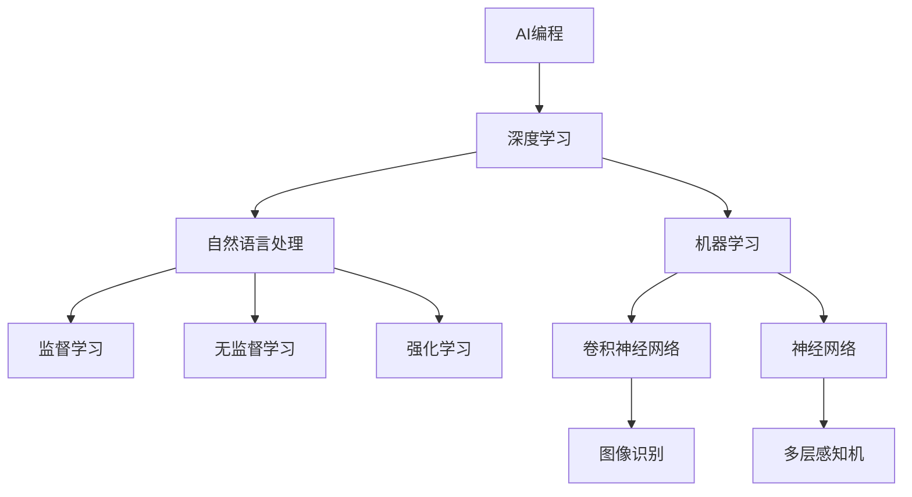
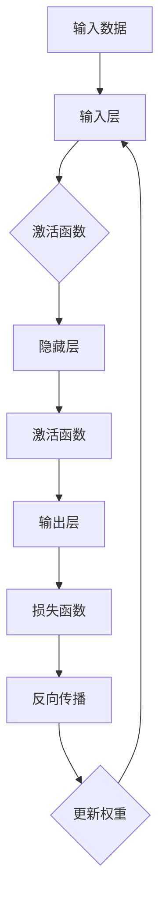
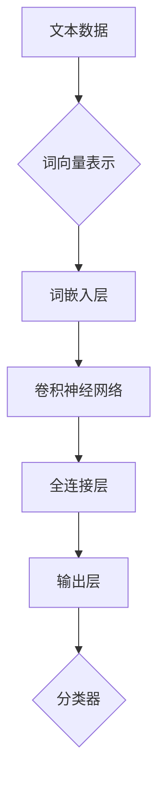
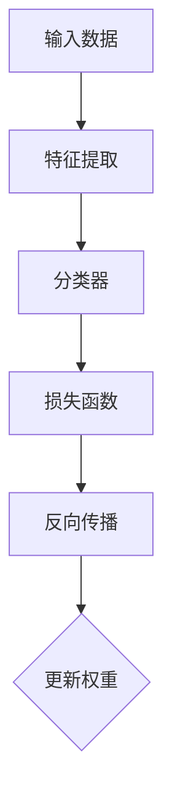
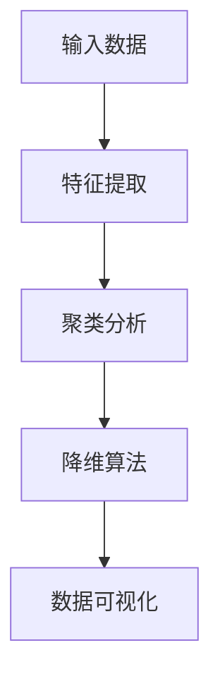
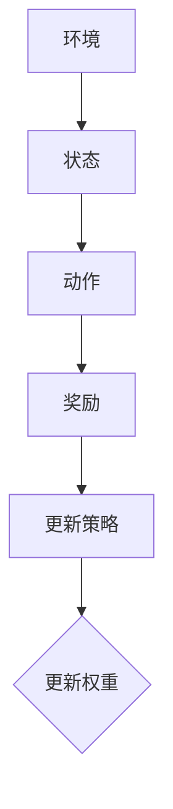

                 

# AI编程2.0的技能图谱与课程设计

> 关键词：AI编程，技能图谱，课程设计，深度学习，自然语言处理，机器学习，算法原理

> 摘要：本文将深入探讨AI编程2.0时代所需的技能图谱与课程设计。通过分析核心概念、算法原理、数学模型以及实际应用场景，本文旨在为AI编程的学习者提供一条清晰的学习路径，助力他们在人工智能领域取得突破性进展。

## 1. 背景介绍

### 1.1 目的和范围

本文的目的是为AI编程2.0时代的学习者提供一套全面且系统的技能图谱与课程设计。我们将从核心概念、算法原理、数学模型和实际应用场景等多个角度，对AI编程进行深入剖析。本文的读者对象主要包括对人工智能感兴趣的程序员、数据科学家、AI研发工程师以及计算机相关专业的大学生。

### 1.2 预期读者

本文适合具备一定编程基础，希望深入了解人工智能技术的读者。通过本文的学习，读者将能够：

1. 熟悉AI编程的核心概念与基本原理。
2. 掌握常用的机器学习算法与数学模型。
3. 具备实际应用AI编程技术解决现实问题的能力。
4. 设计并实现自己的AI项目。

### 1.3 文档结构概述

本文分为十个部分，结构如下：

1. 背景介绍
2. 核心概念与联系
3. 核心算法原理 & 具体操作步骤
4. 数学模型和公式 & 详细讲解 & 举例说明
5. 项目实战：代码实际案例和详细解释说明
6. 实际应用场景
7. 工具和资源推荐
8. 总结：未来发展趋势与挑战
9. 附录：常见问题与解答
10. 扩展阅读 & 参考资料

### 1.4 术语表

#### 1.4.1 核心术语定义

- **AI编程**：利用人工智能技术进行编程，实现自动化决策、智能推理和自适应行为。
- **深度学习**：一种基于人工神经网络的机器学习技术，通过多层神经网络进行特征提取和分类。
- **自然语言处理（NLP）**：研究计算机如何理解、生成和处理人类语言的技术。
- **机器学习**：使计算机通过数据学习并做出决策或预测的学科。
- **算法**：解决问题的步骤和方法，可以用于编程和优化系统性能。

#### 1.4.2 相关概念解释

- **监督学习**：通过已知输入输出数据训练模型，使其能够对未知数据进行预测。
- **无监督学习**：仅利用输入数据训练模型，不提供输出数据，用于数据降维或聚类分析。
- **强化学习**：通过奖励机制训练模型，使其在特定环境中做出最优决策。
- **卷积神经网络（CNN）**：一种专门用于图像识别和处理的人工神经网络。

#### 1.4.3 缩略词列表

- **NLP**：自然语言处理
- **ML**：机器学习
- **DL**：深度学习
- **AI**：人工智能
- **IDE**：集成开发环境

## 2. 核心概念与联系

在AI编程2.0时代，理解核心概念与联系至关重要。以下是几个关键概念及其相互关系：



### 2.1. 深度学习与自然语言处理

深度学习是自然语言处理（NLP）领域的重要工具，通过多层神经网络进行文本数据的特征提取和建模。在NLP中，深度学习技术可以用于文本分类、情感分析、机器翻译等任务。

### 2.2. 机器学习与深度学习

机器学习是AI编程的基础，而深度学习是机器学习的一种特殊形式。深度学习通过多层神经网络模拟人类大脑的学习过程，具有更强的特征提取能力和泛化能力。

### 2.3. 监督学习、无监督学习和强化学习

监督学习、无监督学习和强化学习是机器学习的三大类别。监督学习利用已知输入输出数据训练模型，无监督学习通过输入数据学习数据分布，强化学习通过奖励机制训练模型。

### 2.4. 卷积神经网络与图像识别

卷积神经网络（CNN）是图像识别领域的重要工具，通过卷积层、池化层和全连接层等结构，实现图像的特征提取和分类。

## 3. 核心算法原理 & 具体操作步骤

在AI编程2.0时代，掌握核心算法原理和具体操作步骤至关重要。以下是几个关键算法及其操作步骤：

### 3.1. 深度学习算法原理

深度学习算法基于多层神经网络，包括输入层、隐藏层和输出层。以下是深度学习算法的原理和具体操作步骤：



### 3.2. 自然语言处理算法原理

自然语言处理（NLP）算法主要包括词向量表示、文本分类、情感分析等。以下是NLP算法的原理和具体操作步骤：



### 3.3. 机器学习算法原理

机器学习算法主要包括监督学习、无监督学习和强化学习。以下是机器学习算法的原理和具体操作步骤：

#### 3.3.1. 监督学习



#### 3.3.2. 无监督学习



#### 3.3.3. 强化学习



## 4. 数学模型和公式 & 详细讲解 & 举例说明

在AI编程2.0时代，掌握数学模型和公式是理解核心算法的关键。以下是几个关键数学模型和公式的详细讲解与举例说明。

### 4.1. 激活函数

激活函数是神经网络中的关键组成部分，用于引入非线性因素。以下是几种常见的激活函数：

$$
f(x) = \text{sigmoid}(x) = \frac{1}{1 + e^{-x}}
$$

$$
f(x) = \text{ReLU}(x) = \max(0, x)
$$

$$
f(x) = \text{tanh}(x) = \frac{e^x - e^{-x}}{e^x + e^{-x}}
$$

#### 4.1.1. 示例

假设我们有一个简单的神经网络，输入层有一个神经元，隐藏层有两个神经元，输出层有一个神经元。激活函数使用ReLU。

输入：[2, -1, 3]

隐藏层1：\[ \text{ReLU}(2) = 2, \text{ReLU}(-1) = 0, \text{ReLU}(3) = 3 \]

隐藏层2：\[ \text{ReLU}(2+0) = 2, \text{ReLU}(0+3) = 3 \]

输出层：\[ \text{ReLU}(2+3) = 5 \]

### 4.2. 损失函数

损失函数用于衡量模型预测值与真实值之间的差距。以下是几种常见的损失函数：

$$
\text{Mean Squared Error (MSE)} = \frac{1}{n}\sum_{i=1}^{n}(y_i - \hat{y}_i)^2
$$

$$
\text{Cross-Entropy Loss} = -\frac{1}{n}\sum_{i=1}^{n}y_i\log(\hat{y}_i)
$$

#### 4.2.1. 示例

假设我们有一个二分类问题，真实标签为\[1, 0\]，模型预测为\[0.7, 0.3\]。

MSE：\[ \text{MSE} = \frac{1}{2}((1-0.7)^2 + (0-0.3)^2) = 0.2 \]

Cross-Entropy Loss：\[ \text{Cross-Entropy Loss} = -\frac{1}{2}((1\log(0.7) + 0\log(0.3)) = 0.35 \]

### 4.3. 反向传播算法

反向传播算法是训练神经网络的关键步骤，用于更新权重和偏置。以下是反向传播算法的基本步骤：

1. 前向传播：计算输出值和损失函数。
2. 反向传播：计算梯度。
3. 更新权重和偏置。

#### 4.3.1. 示例

假设我们有一个简单的神经网络，输入层有一个神经元，隐藏层有两个神经元，输出层有一个神经元。

输入：\[2\]

隐藏层1：\[ \text{ReLU}(2w_1 + b_1) = a_1 \]

隐藏层2：\[ \text{ReLU}(2w_2 + b_2) = a_2 \]

输出层：\[ y = \text{ReLU}(a_1w_3 + a_2w_4 + b_3) \]

损失函数：\[ J = \text{MSE}(y, t) \]

梯度计算：

\[ \frac{\partial J}{\partial w_1} = \frac{\partial J}{\partial y}\frac{\partial y}{\partial a_1}\frac{\partial a_1}{\partial w_1} \]

\[ \frac{\partial J}{\partial b_1} = \frac{\partial J}{\partial y}\frac{\partial y}{\partial a_1}\frac{\partial a_1}{\partial b_1} \]

权重和偏置更新：

\[ w_1 = w_1 - \alpha \frac{\partial J}{\partial w_1} \]

\[ b_1 = b_1 - \alpha \frac{\partial J}{\partial b_1} \]

## 5. 项目实战：代码实际案例和详细解释说明

在本节中，我们将通过一个实际案例来展示如何实现AI编程2.0的相关技术。我们将使用Python语言，实现一个基于深度学习的文本分类模型，用于判断一篇新闻文章是否属于政治类。

### 5.1 开发环境搭建

在开始项目之前，我们需要搭建一个合适的开发环境。以下是所需的环境和工具：

- Python 3.7+
- Jupyter Notebook
- TensorFlow 2.4+
- scikit-learn 0.22+
- pandas 1.0+

你可以使用以下命令安装所需的库：

```bash
pip install tensorflow scikit-learn pandas
```

### 5.2 源代码详细实现和代码解读

以下是文本分类模型的主要代码实现：

```python
import tensorflow as tf
from tensorflow.keras.preprocessing.text import Tokenizer
from tensorflow.keras.preprocessing.sequence import pad_sequences
from tensorflow.keras.models import Sequential
from tensorflow.keras.layers import Embedding, LSTM, Dense, Dropout
from tensorflow.keras.callbacks import EarlyStopping
from sklearn.model_selection import train_test_split

# 加载数据集
data = ...
labels = ...

# 数据预处理
tokenizer = Tokenizer(num_words=10000)
tokenizer.fit_on_texts(data)
sequences = tokenizer.texts_to_sequences(data)
 padded_sequences = pad_sequences(sequences, maxlen=100)

# 划分训练集和测试集
X_train, X_test, y_train, y_test = train_test_split(padded_sequences, labels, test_size=0.2, random_state=42)

# 构建模型
model = Sequential([
    Embedding(10000, 16),
    LSTM(64, dropout=0.2, recurrent_dropout=0.2),
    Dense(1, activation='sigmoid')
])

# 编译模型
model.compile(loss='binary_crossentropy', optimizer='adam', metrics=['accuracy'])

# 添加回调函数
early_stopping = EarlyStopping(monitor='val_loss', patience=5)

# 训练模型
model.fit(X_train, y_train, epochs=10, batch_size=128, validation_data=(X_test, y_test), callbacks=[early_stopping])
```

代码解读：

1. 导入所需的库和模块。
2. 加载数据集，包括文本和标签。
3. 数据预处理：分词、序列化和填充。
4. 划分训练集和测试集。
5. 构建模型：嵌入层、LSTM层和输出层。
6. 编译模型：指定损失函数、优化器和评估指标。
7. 添加回调函数：早停法。
8. 训练模型：指定训练参数。

### 5.3 代码解读与分析

以下是代码的详细解读和分析：

1. **导入模块**：导入所需的库和模块，包括TensorFlow、scikit-learn和pandas。
2. **加载数据集**：从本地文件或API加载数据集，包括文本和标签。
3. **数据预处理**：使用Tokenizer进行分词，并将文本转换为序列。使用pad_sequences对序列进行填充，使其具有相同长度。
4. **划分训练集和测试集**：使用train_test_split函数将数据集划分为训练集和测试集，比例为80%训练集，20%测试集。
5. **构建模型**：使用Sequential模型堆叠嵌入层、LSTM层和输出层。嵌入层用于将词汇转换为向量，LSTM层用于特征提取，输出层用于分类。
6. **编译模型**：指定损失函数（binary_crossentropy）、优化器（adam）和评估指标（accuracy）。
7. **添加回调函数**：使用EarlyStopping回调函数，在验证集损失不再下降时提前停止训练。
8. **训练模型**：使用fit方法训练模型，指定训练参数，如epochs（训练轮数）、batch_size（批量大小）和validation_data（验证集）。

### 5.4 模型评估与改进

在完成训练后，我们需要评估模型的性能，并尝试对其进行改进。

```python
# 评估模型
loss, accuracy = model.evaluate(X_test, y_test)
print("Test Accuracy: {:.2f}%".format(accuracy * 100))

# 改进模型
# 可以尝试以下方法：
# 1. 增加训练时间或轮数
# 2. 调整超参数，如学习率、批量大小、隐藏层大小等
# 3. 使用更复杂的模型结构，如增加层数、增加神经元等
# 4. 使用正则化技术，如L1、L2正则化等
```

模型评估：

- **准确率**：用于评估模型在测试集上的分类能力。
- **召回率**：用于评估模型在测试集上的分类召回率。
- **F1值**：综合考虑准确率和召回率，用于评估模型在测试集上的综合性能。

## 6. 实际应用场景

AI编程2.0在实际应用场景中具有广泛的应用前景。以下是一些典型的应用场景：

- **自然语言处理（NLP）**：用于自动翻译、智能客服、文本分类、情感分析等。
- **计算机视觉**：用于图像识别、目标检测、图像分割等。
- **推荐系统**：用于个性化推荐、商品推荐、新闻推荐等。
- **金融领域**：用于风险评估、信用评分、欺诈检测等。
- **医疗领域**：用于疾病预测、医学影像诊断、基因组分析等。

### 6.1 自然语言处理应用

在自然语言处理领域，AI编程2.0可以应用于以下场景：

- **机器翻译**：使用深度学习模型进行自动翻译，如Google翻译。
- **文本分类**：将文本数据分类为不同的主题，如新闻分类、邮件分类等。
- **情感分析**：分析文本数据中的情感倾向，如产品评论、社交媒体等。
- **问答系统**：构建基于深度学习的问答系统，如Siri、Alexa等。

### 6.2 计算机视觉应用

在计算机视觉领域，AI编程2.0可以应用于以下场景：

- **图像识别**：识别图像中的物体、场景和动作，如人脸识别、车辆识别等。
- **目标检测**：检测图像中的多个目标，如车辆检测、行人检测等。
- **图像分割**：将图像分割为不同的区域，如医学影像分割、卫星图像分割等。

### 6.3 金融领域应用

在金融领域，AI编程2.0可以应用于以下场景：

- **风险评估**：使用深度学习模型进行风险评估，如信用评分、市场预测等。
- **欺诈检测**：使用深度学习模型检测金融交易中的欺诈行为。
- **投资策略**：使用机器学习算法构建投资组合和交易策略。

### 6.4 医疗领域应用

在医疗领域，AI编程2.0可以应用于以下场景：

- **疾病预测**：使用机器学习算法预测疾病的发生和发展趋势。
- **医学影像诊断**：使用深度学习模型进行医学影像诊断，如肿瘤检测、骨折检测等。
- **基因组分析**：使用机器学习算法分析基因组数据，如疾病风险预测、药物反应预测等。

## 7. 工具和资源推荐

### 7.1 学习资源推荐

#### 7.1.1 书籍推荐

- 《深度学习》（Goodfellow, Bengio, Courville）
- 《Python机器学习》（Sebastian Raschka）
- 《人工智能：一种现代方法》（Stuart Russell, Peter Norvig）
- 《模式识别与机器学习》（Christopher M. Bishop）

#### 7.1.2 在线课程

- Coursera的《深度学习》课程（由Andrew Ng教授）
- edX的《机器学习》课程（由Andrew Ng教授）
- Udacity的《深度学习纳米学位》
-网易云课堂的《人工智能基础》课程

#### 7.1.3 技术博客和网站

- Medium上的AI和机器学习相关文章
- Towards Data Science上的数据科学和机器学习文章
- AI博客（AI Blog）上的AI和机器学习文章

### 7.2 开发工具框架推荐

#### 7.2.1 IDE和编辑器

- Jupyter Notebook
- PyCharm
- Visual Studio Code

#### 7.2.2 调试和性能分析工具

- TensorFlow Debugger（TFDB）
- NVIDIA Nsight Compute
- PyTorch Profiler

#### 7.2.3 相关框架和库

- TensorFlow
- PyTorch
- Keras
- scikit-learn

### 7.3 相关论文著作推荐

#### 7.3.1 经典论文

- “A Learning Algorithm for Continually Running Fully Recurrent Neural Networks” （1990）
- “Improving Neural Networks by Preventing Co-adaptation of Feature Detectors” （2012）
- “Distributed Representations of Words and Phrases and their Compositionality” （2013）

#### 7.3.2 最新研究成果

- “Bert: Pre-training of Deep Bidirectional Transformers for Language Understanding” （2018）
- “Gpt-2: Language Models for Conversational Speech” （2019）
- “Advances in Neural Text Generation: A Survey” （2020）

#### 7.3.3 应用案例分析

- “Deep Learning in Healthcare” （2020）
- “AI in Finance: Applications and Challenges” （2019）
- “AI in Retail: A Comprehensive Overview” （2021）

## 8. 总结：未来发展趋势与挑战

AI编程2.0正处于快速发展阶段，未来发展趋势如下：

1. **算法优化**：随着计算能力的提升，深度学习算法将得到进一步优化，使得模型训练速度更快、效果更优。
2. **跨领域融合**：AI编程2.0将与其他领域（如生物学、物理学、社会学等）相结合，推动跨学科研究。
3. **无人驾驶技术**：自动驾驶、无人零售等领域的应用将越来越广泛，AI编程2.0将为这些领域提供核心技术支持。
4. **隐私保护**：随着数据隐私问题日益突出，AI编程2.0将更加注重隐私保护和数据安全。

然而，AI编程2.0也面临一些挑战：

1. **数据质量**：高质量的数据是AI模型训练的基础，如何获取和处理大量高质量数据成为关键挑战。
2. **模型可解释性**：深度学习模型往往缺乏可解释性，如何提高模型的可解释性，使其更容易被用户理解和使用。
3. **伦理问题**：AI编程2.0的应用涉及伦理问题，如何确保AI系统的公正性和透明度，避免歧视和偏见。

## 9. 附录：常见问题与解答

### 9.1. Q：如何选择合适的机器学习算法？

A：选择合适的机器学习算法取决于具体问题和数据特性。以下是一些建议：

1. **问题类型**：针对分类、回归、聚类等不同类型的问题，选择相应的算法。
2. **数据量**：对于小数据集，可以选择简单的算法，如决策树、线性回归等。对于大数据集，可以选择更复杂的算法，如神经网络、支持向量机等。
3. **数据特性**：分析数据特征，如是否线性、非线性，是否稀疏等，以选择适合的数据处理方法。

### 9.2. Q：如何提高深度学习模型的性能？

A：以下是一些提高深度学习模型性能的方法：

1. **数据增强**：通过旋转、缩放、翻转等操作，增加数据的多样性。
2. **调整超参数**：尝试调整学习率、批量大小、隐藏层大小等超参数，以达到更好的模型效果。
3. **正则化**：使用L1、L2正则化、dropout等方法，防止过拟合。
4. **集成学习**：将多个模型组合起来，提高整体模型的性能。

### 9.3. Q：如何进行模型评估？

A：以下是一些常见的模型评估方法：

1. **准确率**：模型在测试集上的预测正确率。
2. **召回率**：模型在测试集上预测为正类的实际正类样本比例。
3. **F1值**：综合考虑准确率和召回率，用于评估模型的综合性能。
4. **ROC曲线**：用于评估模型在分类任务中的表现，曲线下的面积（AUC）越大，表示模型性能越好。

## 10. 扩展阅读 & 参考资料

本文仅对AI编程2.0的技能图谱与课程设计进行了简要介绍。以下是一些扩展阅读和参考资料，供读者进一步学习：

- 《深度学习》（Goodfellow, Bengio, Courville）
- 《Python机器学习》（Sebastian Raschka）
- 《模式识别与机器学习》（Christopher M. Bishop）
- 《自然语言处理综论》（Daniel Jurafsky, James H. Martin）
- 《计算机视觉：算法与应用》（David S.

