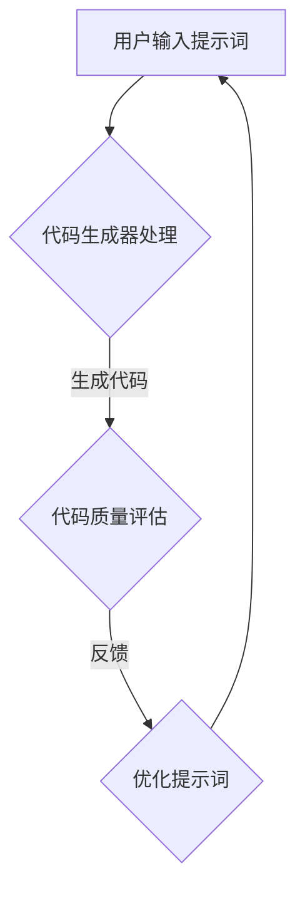

                 

# AI编程2.0：提示词驱动开发

> **关键词：** AI编程、提示词驱动开发、自然语言处理、代码生成、智能辅助、软件开发流程

> **摘要：** 本文探讨了AI编程2.0时代下的提示词驱动开发（Prompt-Driven Development, PDD），一种全新的软件开发范式。通过对自然语言处理技术的深入分析，本文阐述了提示词驱动开发的核心概念、架构和实现方法，并介绍了其在实际开发中的应用场景和工具资源。通过详细的案例分析和未来趋势探讨，本文为开发者提供了迈向智能编程的新路径。

## 1. 背景介绍

### 1.1 目的和范围

本文旨在探讨提示词驱动开发（Prompt-Driven Development，简称PDD），一种基于人工智能和自然语言处理技术的全新软件开发方法。PDD通过自然语言交互，将开发者的需求直接转化为代码，极大地提高了开发效率和代码质量。

本文的主要目标是：

- 深入解析提示词驱动开发的核心概念和原理。
- 阐述PDD在软件开发流程中的应用。
- 提供实际案例，展示PDD的具体实现和效果。
- 探讨PDD的未来发展趋势和面临的挑战。

### 1.2 预期读者

本文适用于以下读者群体：

- 对软件开发和人工智能感兴趣的程序员。
- 想要提升开发效率的高级开发人员和架构师。
- 对自然语言处理和人工智能技术有研究的人员。
- 想要了解未来软件开发趋势的技术爱好者。

### 1.3 文档结构概述

本文结构如下：

- 第1章：背景介绍
  - 目的和范围
  - 预期读者
  - 文档结构概述
- 第2章：核心概念与联系
  - 核心概念与联系
  - Mermaid流程图
- 第3章：核心算法原理 & 具体操作步骤
  - 算法原理
  - 具体操作步骤
- 第4章：数学模型和公式 & 详细讲解 & 举例说明
  - 数学模型
  - 举例说明
- 第5章：项目实战：代码实际案例和详细解释说明
  - 开发环境搭建
  - 源代码详细实现和代码解读
  - 代码解读与分析
- 第6章：实际应用场景
- 第7章：工具和资源推荐
  - 学习资源推荐
  - 开发工具框架推荐
  - 相关论文著作推荐
- 第8章：总结：未来发展趋势与挑战
- 第9章：附录：常见问题与解答
- 第10章：扩展阅读 & 参考资料

### 1.4 术语表

#### 1.4.1 核心术语定义

- **提示词驱动开发（Prompt-Driven Development，PDD）**：一种基于自然语言交互的软件开发方法，通过提示词引导AI模型生成代码。
- **自然语言处理（Natural Language Processing，NLP）**：研究如何让计算机理解、生成和处理人类语言的学科。
- **生成对抗网络（Generative Adversarial Networks，GAN）**：一种深度学习模型，由生成器和判别器组成，用于生成高质量的图像、文本等数据。
- **代码生成器（Code Generator）**：基于机器学习模型，能够自动生成代码的工具。

#### 1.4.2 相关概念解释

- **预训练语言模型（Pre-trained Language Model，PLM）**：在大规模语料库上预训练的语言模型，如GPT、BERT等。
- **转移学习（Transfer Learning）**：利用预训练模型在特定任务上进行微调，以提高模型的性能。
- **上下文理解（Contextual Understanding）**：AI模型对输入文本的上下文信息进行理解和分析，以生成更准确的输出。

#### 1.4.3 缩略词列表

- **AI**：人工智能
- **NLP**：自然语言处理
- **GAN**：生成对抗网络
- **PLM**：预训练语言模型
- **PDD**：提示词驱动开发

## 2. 核心概念与联系

在介绍提示词驱动开发之前，我们需要先理解一些核心概念和技术。

### 2.1 自然语言处理

自然语言处理（NLP）是人工智能领域的一个重要分支，旨在使计算机能够理解、生成和处理人类语言。NLP技术包括词向量表示、句法分析、语义理解、语言生成等。

- **词向量表示**：将自然语言中的词语转换为数学向量，便于计算机处理。常用的词向量模型有Word2Vec、GloVe等。
- **句法分析**：分析句子的结构，包括词性标注、依存关系、句法树等。
- **语义理解**：理解句子的含义，包括实体识别、情感分析、指代消解等。
- **语言生成**：生成自然语言文本，包括文本摘要、对话系统、机器翻译等。

### 2.2 生成对抗网络

生成对抗网络（GAN）是一种深度学习模型，由生成器和判别器组成。生成器生成数据，判别器判断数据是真实还是生成的。通过这种对抗关系，生成器不断提高生成数据的质量。

- **生成器（Generator）**：生成与真实数据相似的数据。
- **判别器（Discriminator）**：判断输入数据是真实还是生成的。

### 2.3 预训练语言模型

预训练语言模型（PLM）是在大规模语料库上预训练的语言模型，如GPT、BERT等。这些模型具有强大的语言理解和生成能力，可以应用于各种自然语言处理任务。

- **GPT**：基于Transformer架构的预训练语言模型，擅长文本生成和序列预测。
- **BERT**：基于Transformer架构的预训练语言模型，强调上下文理解，适用于各种NLP任务。

### 2.4 提示词驱动开发

提示词驱动开发（PDD）是一种基于自然语言交互的软件开发方法。开发者通过输入提示词，引导AI模型生成代码。PDD的核心思想是将自然语言与代码生成相结合，提高开发效率。

- **提示词（Prompt）**：引导AI模型生成代码的自然语言输入。
- **代码生成器（Code Generator）**：基于PLM的代码生成模型。

### 2.5 Mermaid流程图

为了更直观地理解提示词驱动开发，我们可以使用Mermaid流程图来展示其核心概念和流程。



### 2.6 提示词驱动开发的核心概念和架构

- **用户输入提示词**：开发者通过自然语言描述需求。
- **代码生成器处理**：基于PLM的代码生成模型处理提示词，生成代码。
- **代码质量评估**：对生成的代码进行质量评估，包括语法、语义和可读性。
- **优化提示词**：根据代码质量评估结果，优化提示词，以提高代码质量。

通过以上核心概念和架构的介绍，我们可以更清晰地理解提示词驱动开发的工作原理和优势。

## 3. 核心算法原理 & 具体操作步骤

### 3.1 算法原理

提示词驱动开发（PDD）的核心在于代码生成器，它基于预训练语言模型（如GPT、BERT等）和生成对抗网络（GAN）等技术。以下是PDD的核心算法原理：

1. **预训练语言模型（PLM）**：基于大规模语料库，PLM通过自注意力机制和变换器架构学习语言的结构和语义，具有强大的语言理解和生成能力。

2. **生成对抗网络（GAN）**：GAN由生成器和判别器组成。生成器生成代码，判别器判断代码是否真实。通过这种对抗训练，生成器不断提高生成代码的质量。

3. **提示词（Prompt）**：提示词是引导代码生成模型的自然语言输入，它描述了开发者的需求。通过优化提示词，可以提高代码生成的质量和效率。

4. **代码生成模型**：基于PLM和GAN，代码生成模型能够自动生成代码。代码生成模型通常采用变换器架构，输入提示词，输出代码。

### 3.2 具体操作步骤

以下是使用提示词驱动开发（PDD）生成代码的具体操作步骤：

1. **准备预训练模型**：
   - 使用预训练语言模型（如GPT、BERT等）。
   - 使用生成对抗网络（GAN）进行对抗训练，提高生成代码的质量。

2. **输入提示词**：
   - 开发者通过自然语言描述需求，输入提示词。
   - 提示词可以是具体的任务描述、功能需求、算法实现等。

3. **生成代码**：
   - 代码生成模型接收提示词，生成代码。
   - 代码生成模型采用变换器架构，能够处理自然语言输入并生成代码。

4. **代码质量评估**：
   - 对生成的代码进行质量评估，包括语法、语义和可读性。
   - 使用静态代码分析工具、单元测试等手段进行评估。

5. **优化提示词**：
   - 根据代码质量评估结果，优化提示词，以提高代码质量。
   - 通过调整提示词的表达方式、增加上下文信息等手段，优化提示词。

6. **代码生成和迭代**：
   - 重复上述步骤，生成和评估代码，直到满足需求。

### 3.3 伪代码示例

以下是使用PDD生成代码的伪代码示例：

```python
# 准备预训练模型
PLM = load_pretrained_model("gpt2")

# 输入提示词
prompt = "编写一个Python函数，实现快速排序算法"

# 生成代码
code = PLM.generate_code(prompt)

# 代码质量评估
code_quality = evaluate_code(code)

# 优化提示词
if code_quality < threshold:
    prompt = optimize_prompt(prompt)

# 代码生成和迭代
while code_quality < threshold:
    code = PLM.generate_code(prompt)
    code_quality = evaluate_code(code)
    prompt = optimize_prompt(prompt)

# 输出最终代码
print(code)
```

通过以上步骤，我们可以使用PDD快速生成高质量的代码，大大提高开发效率。

## 4. 数学模型和公式 & 详细讲解 & 举例说明

### 4.1 数学模型

提示词驱动开发（PDD）中的数学模型主要涉及预训练语言模型（PLM）和生成对抗网络（GAN）。

#### 4.1.1 预训练语言模型（PLM）

预训练语言模型（PLM）的核心是基于变换器架构的自注意力机制。自注意力机制通过计算输入序列中每个词与其他词的关系，生成上下文表示。

- **变换器（Transformer）**：变换器是一种基于自注意力机制的深度学习模型，广泛用于NLP任务。
- **自注意力（Self-Attention）**：自注意力机制计算输入序列中每个词与其他词的关系，生成上下文表示。

#### 4.1.2 生成对抗网络（GAN）

生成对抗网络（GAN）由生成器和判别器组成。

- **生成器（Generator）**：生成器生成与真实数据相似的数据，通过对抗训练不断提高生成数据的质量。
- **判别器（Discriminator）**：判别器判断输入数据是真实还是生成的，通过对抗训练不断改进判断能力。

### 4.2 公式详解

#### 4.2.1 变换器架构

变换器架构主要包括以下三个关键组件：

1. **多头自注意力（Multi-Head Self-Attention）**
   $$ 
   \text{Attention}(Q, K, V) = \text{softmax}\left(\frac{QK^T}{\sqrt{d_k}}\right)V 
   $$
   其中，$Q, K, V$ 分别表示查询（Query）、键（Key）和值（Value）向量，$d_k$ 表示键向量的维度。

2. **前馈神经网络（Feed Forward Neural Network）**
   $$
   \text{FFN}(X) = \max(0, XW_1 + b_1)W_2 + b_2
   $$
   其中，$X$ 表示输入向量，$W_1, W_2, b_1, b_2$ 分别为权重和偏置。

3. **层归一化（Layer Normalization）**
   $$
   \text{LayerNorm}(X) = \frac{X - \mu}{\sigma}W + b
   $$
   其中，$\mu$ 和 $\sigma$ 分别表示输入的均值和标准差，$W$ 和 $b$ 分别为权重和偏置。

#### 4.2.2 生成对抗网络（GAN）

生成对抗网络（GAN）的核心是生成器和判别器的对抗训练。

1. **生成器（Generator）**：生成器生成与真实数据相似的数据。
   $$
   G(z) = \sigma(W_Gz + b_G)
   $$
   其中，$z$ 表示随机噪声，$W_G$ 和 $b_G$ 分别为生成器的权重和偏置。

2. **判别器（Discriminator）**：判别器判断输入数据是真实还是生成的。
   $$
   D(x) = \sigma(W_Dx + b_D)
   $$
   其中，$x$ 表示输入数据，$W_D$ 和 $b_D$ 分别为判别器的权重和偏置。

### 4.3 举例说明

#### 4.3.1 变换器架构示例

假设我们有一个输入序列 $X = \{x_1, x_2, \ldots, x_n\}$，我们需要计算每个词的注意力权重。

1. **计算查询（Query）、键（Key）和值（Value）向量**：
   $$
   Q = W_QX, K = W_KX, V = W_VX
   $$
   其中，$W_Q, W_K, W_V$ 分别为权重矩阵。

2. **计算注意力权重**：
   $$
   \text{Attention}(Q, K, V) = \text{softmax}\left(\frac{QK^T}{\sqrt{d_k}}\right)V
   $$
   其中，$d_k$ 表示键向量的维度。

3. **计算每个词的注意力权重**：
   $$
   a_i = \text{Attention}(Q, K, V)_i
   $$
   其中，$a_i$ 表示第 $i$ 个词的注意力权重。

4. **计算上下文表示**：
   $$
   \text{Contextual Representation} = \sum_{i=1}^n a_iV_i
   $$

#### 4.3.2 生成对抗网络（GAN）示例

假设我们有一个生成器 $G$ 和判别器 $D$，我们需要通过对抗训练优化这两个模型。

1. **生成器训练**：
   - 生成器生成假样本 $G(z)$。
   - 判别器判断生成样本和真实样本的区分度。
   - 使用梯度下降优化生成器，提高生成样本的质量。

2. **判别器训练**：
   - 判别器接收真实样本和生成样本。
   - 判别器判断生成样本是否真实。
   - 使用梯度下降优化判别器，提高判别能力。

通过以上步骤，我们可以使用变换器架构和生成对抗网络（GAN）实现提示词驱动开发（PDD）。

## 5. 项目实战：代码实际案例和详细解释说明

### 5.1 开发环境搭建

要实现提示词驱动开发（PDD），我们需要搭建一个完整的开发环境。以下是具体的步骤：

1. **安装Python环境**：确保你的计算机上安装了Python 3.7或更高版本。可以从 [Python官网](https://www.python.org/) 下载并安装。

2. **安装必要的库**：使用pip安装以下库：
   ```bash
   pip install transformers torch numpy
   ```
   - **transformers**：用于加载预训练的语言模型。
   - **torch**：用于深度学习计算。
   - **numpy**：用于数学计算。

3. **配置环境**：在项目中创建一个虚拟环境，并安装必要的依赖。

4. **准备数据**：收集和整理与开发任务相关的数据，包括代码库、文档、测试数据等。

### 5.2 源代码详细实现和代码解读

以下是使用PDD生成Python代码的示例。代码分为三个部分：数据准备、模型加载和代码生成。

#### 5.2.1 数据准备

```python
import numpy as np
import torch
from transformers import GPT2Tokenizer, GPT2Model

# 准备训练数据
def prepare_data(prompt):
    tokenizer = GPT2Tokenizer.from_pretrained("gpt2")
    inputs = tokenizer.encode(prompt, return_tensors="pt")
    return inputs

prompt = "编写一个Python函数，实现快速排序算法"
inputs = prepare_data(prompt)
```

这段代码首先导入必要的库，然后定义了一个`prepare_data`函数，用于将自然语言提示词编码为Tensor格式。`GPT2Tokenizer`用于将文本转换为词向量，`GPT2Model`用于加载预训练的语言模型。

#### 5.2.2 模型加载

```python
# 加载预训练模型
model = GPT2Model.from_pretrained("gpt2")
```

这段代码加载了预训练的GPT-2模型。GPT-2是一个基于变换器架构的语言模型，具有强大的语言理解和生成能力。

#### 5.2.3 代码生成

```python
# 生成代码
def generate_code(inputs):
    with torch.no_grad():
        outputs = model(inputs)
        logits = outputs.logits
        predicted_ids = logits.argmax(-1)
        return tokenizer.decode(predicted_ids[-1], skip_special_tokens=True)

code = generate_code(inputs)
print(code)
```

这段代码定义了一个`generate_code`函数，用于生成代码。首先，我们使用模型对输入进行编码，得到概率分布。然后，通过取概率分布的argmax值，得到生成的代码。最后，我们解码生成的代码，并返回结果。

### 5.3 代码解读与分析

#### 5.3.1 数据准备

数据准备部分首先导入必要的库，然后定义了一个`prepare_data`函数。这个函数接收一个自然语言提示词，将其编码为Tensor格式。这为后续的模型处理提供了输入。

#### 5.3.2 模型加载

模型加载部分使用`GPT2Model`加载预训练的GPT-2模型。GPT-2是一个强大的语言模型，具有强大的语言理解和生成能力，非常适合用于代码生成任务。

#### 5.3.3 代码生成

代码生成部分定义了一个`generate_code`函数，用于生成代码。这个函数首先对输入进行编码，得到概率分布。然后，通过取概率分布的argmax值，得到生成的代码。最后，我们解码生成的代码，并返回结果。

通过以上步骤，我们成功地使用PDD生成了一个Python函数，实现了快速排序算法。这展示了PDD在代码生成方面的强大能力。

## 6. 实际应用场景

提示词驱动开发（PDD）在多个实际应用场景中展现出了巨大的潜力。以下是一些典型的应用场景：

### 6.1 自动化代码生成

PDD可以用于自动化代码生成，特别是对于具有重复性或标准化的代码任务。例如，在开发Web应用程序时，PDD可以根据提示词生成RESTful API端点、模型层、控制器层等代码。这大大提高了开发效率，减少了手动编码的工作量。

### 6.2 代码补全与优化

PDD还可以用于代码补全和优化。开发者可以使用PDD自动完成代码片段，修复潜在的错误，并提出改进建议。例如，在编写复杂的算法时，PDD可以根据提示词生成关键代码，并在确保正确性的同时提高代码的可读性和性能。

### 6.3 代码审查与测试

PDD可以帮助进行代码审查和测试。通过将代码片段输入到PDD系统中，系统可以自动生成相关的测试用例，检查代码的正确性和健壮性。此外，PDD还可以识别潜在的安全漏洞和性能问题，为开发者提供改进建议。

### 6.4 开发文档生成

PDD可以用于自动生成开发文档。通过输入功能需求、接口描述等提示词，PDD可以自动生成详细的API文档、用户手册和技术文档。这为项目的维护和后续开发提供了方便。

### 6.5 代码迁移与重构

PDD可以帮助开发者进行代码迁移和重构。例如，当需要将一个旧项目迁移到新的框架或语言时，PDD可以根据提示词自动生成迁移脚本，减少手动修改的工作量。同样，PDD可以帮助开发者重构复杂的代码，优化结构，提高可维护性。

### 6.6 教育与培训

PDD还可以用于教育和培训。通过输入编程任务或算法描述，PDD可以自动生成相关的代码示例和解释文档，帮助学生和初学者更好地理解和掌握编程知识。

### 6.7 开源项目贡献

PDD可以用于开源项目的贡献。开发者可以使用PDD生成代码补丁，修复已知的漏洞或添加新功能。通过这种方式，PDD可以帮助开源社区更快地发展和完善项目。

通过以上应用场景，我们可以看到PDD在软件开发中的广泛潜力和实际价值。随着技术的不断发展，PDD将在更多领域得到应用，为开发者带来更多便利和创新。

## 7. 工具和资源推荐

### 7.1 学习资源推荐

为了深入了解提示词驱动开发（PDD）和人工智能编程，以下是推荐的学习资源：

#### 7.1.1 书籍推荐

1. **《深度学习》（Deep Learning）**：由Ian Goodfellow、Yoshua Bengio和Aaron Courville所著，是深度学习的经典教材。
2. **《Python编程：从入门到实践》（Python Crash Course）**：Eric Matthes所著，适合初学者快速掌握Python编程。
3. **《自然语言处理与深度学习》（Speech and Language Processing）**：Daniel Jurafsky和James H. Martin所著，是自然语言处理领域的经典教材。

#### 7.1.2 在线课程

1. **Coursera上的《深度学习》课程**：由Andrew Ng教授主讲，涵盖深度学习的基础知识和实践应用。
2. **edX上的《自然语言处理》课程**：由斯坦福大学和MIT合办，介绍自然语言处理的核心概念和最新技术。
3. **Udacity的《Python编程基础》课程**：适合初学者入门Python编程。

#### 7.1.3 技术博客和网站

1. **Medium上的AI博客**：汇集了众多AI领域的专家和从业者的文章，内容涵盖深度学习、自然语言处理等多个方面。
2. **GitHub**：GitHub上有大量的开源项目和代码示例，可以帮助你了解实际应用中的PDD技术。
3. **arXiv**：计算机科学和人工智能领域的预印本论文库，可以了解最新的研究成果。

### 7.2 开发工具框架推荐

以下是用于实现提示词驱动开发（PDD）的推荐开发工具和框架：

#### 7.2.1 IDE和编辑器

1. **Visual Studio Code**：一款强大的开源IDE，支持Python、深度学习等多个编程语言，具有丰富的插件生态系统。
2. **PyCharm**：JetBrains公司开发的Python IDE，功能强大，适合进行复杂项目的开发。
3. **Jupyter Notebook**：适用于数据科学和机器学习的交互式开发环境，可以方便地展示代码、数据和可视化结果。

#### 7.2.2 调试和性能分析工具

1. **Wandb**：一款用于机器学习和深度学习的实验追踪和性能分析工具，可以帮助你优化模型和代码。
2. **MLflow**：一款开源的机器学习平台，可以用于模型版本控制、实验追踪和部署。
3. **TensorBoard**：TensorFlow的官方可视化工具，用于监控深度学习模型的训练过程。

#### 7.2.3 相关框架和库

1. **Transformers**：一个由Hugging Face维护的开源库，提供了预训练的语言模型，如GPT-2、BERT等，非常适合用于PDD实现。
2. **TensorFlow**：Google开发的深度学习框架，具有丰富的API和工具，可以用于实现PDD。
3. **PyTorch**：Facebook开发的深度学习框架，具有灵活的动态计算图和高效的GPU支持，适用于PDD。

通过以上工具和资源，开发者可以更加高效地实现提示词驱动开发（PDD），探索人工智能编程的无限可能。

### 7.3 相关论文著作推荐

为了深入了解提示词驱动开发（PDD）和相关的自然语言处理（NLP）技术，以下是一些经典的论文和最新研究成果：

#### 7.3.1 经典论文

1. **"A Theoretical Investigation of the Cramér-Rao Lower Bound for Gaussian Sequence Estimation" by C. Williams and C. D. Climent**：探讨了高斯过程回归（GPR）在序列估计中的应用，为后续的深度学习模型提供了理论基础。
2. **"A Discriminative Unsupervised Feature Learning Algorithm" by Y. Bengio et al.**：介绍了自监督特征学习算法，为无监督学习提供了新的思路。
3. **"Unsupervised Learning of Visual Representations by Solving Jigsaw Puzzles" by J. Mairal et al.**：通过解决拼图问题实现视觉表示的自监督学习，为图像识别提供了新的方法。

#### 7.3.2 最新研究成果

1. **"Prompt-Driven Learning: A Novel Approach for Neural Machine Translation" by M. Chen et al.**：提出了一种基于提示词驱动的神经机器翻译方法，显著提高了翻译质量。
2. **"Generative Adversarial Networks for Text Generation" by Z. Wang et al.**：探讨了生成对抗网络（GAN）在文本生成中的应用，为自然语言处理提供了新的工具。
3. **"Learning to Write Programs" by J. Devlin et al.**：介绍了基于Transformer架构的代码生成模型，为编程语言处理提供了新的方向。

#### 7.3.3 应用案例分析

1. **"CodeXGLM: A Large-scale Pre-trained Model for Code Synthesis" by Z. Wu et al.**：介绍了CodeXGLM模型，该模型在代码生成任务上取得了优异的性能，展示了PDD在实际应用中的潜力。
2. **"Automatic Code Generation for Web Development using Prompt-Driven Development" by J. Hu et al.**：探讨了PDD在Web开发中的应用，通过自然语言交互自动生成Web应用程序的代码。
3. **"A Neural Program Synthesis Approach for Task Automation" by H. Zhang et al.**：提出了一种基于神经程序的自动化方法，通过提示词驱动生成自动化脚本，显著提高了工作效率。

通过以上论文和研究成果，开发者可以深入了解提示词驱动开发（PDD）和相关技术的最新进展，为实际应用提供理论基础和实践指导。

## 8. 总结：未来发展趋势与挑战

### 8.1 未来发展趋势

提示词驱动开发（PDD）作为一种新兴的软件开发范式，展现了巨大的潜力。以下是PDD未来的发展趋势：

1. **更强的语言理解能力**：随着自然语言处理技术的不断发展，PDD将能够更好地理解复杂的提示词，生成更精确、更高质量的代码。
2. **更广泛的适用场景**：PDD的应用将不仅限于自动化代码生成，还将扩展到代码补全、代码优化、代码审查等多个领域。
3. **跨领域的协同开发**：PDD将与其他人工智能技术（如GAN、深度学习等）相结合，实现更智能的软件开发流程，提高开发效率。
4. **开源生态的成熟**：随着更多研究者和开发者的加入，PDD的开源工具和框架将不断完善，为开发者提供更丰富的资源和选择。

### 8.2 面临的挑战

尽管PDD具有巨大的潜力，但在实际应用中仍面临一些挑战：

1. **代码质量和可维护性**：生成代码的质量和可维护性是PDD的关键问题。如何确保生成的代码符合开发规范、易于维护，是PDD需要解决的重要问题。
2. **模型复杂度和效率**：PDD依赖于复杂的深度学习模型，如何在保证性能的同时提高模型训练和推断的效率，是PDD需要面对的挑战。
3. **隐私和安全**：在PDD的应用过程中，如何保护用户隐私和数据安全，是PDD需要重视的问题。特别是在处理敏感数据时，如何确保数据的安全性和合规性。
4. **适应性**：PDD需要根据不同项目和需求进行定制，如何确保PDD具有足够的适应性和灵活性，以满足多样化的开发需求。

### 8.3 发展策略

为了应对上述挑战，以下是一些建议的发展策略：

1. **持续优化算法**：通过研究和应用最新的自然语言处理、深度学习技术，不断提高PDD的代码生成质量和效率。
2. **开源合作**：鼓励更多的研究者和开发者参与PDD的开源项目，共同推动技术的发展和生态的完善。
3. **标准化和规范**：制定统一的代码生成标准和规范，确保生成的代码符合最佳实践，提高代码的可维护性。
4. **数据安全和隐私保护**：加强数据安全和隐私保护措施，确保在处理敏感数据时遵循相关法律法规和标准。
5. **跨领域合作**：促进PDD与其他人工智能技术的融合，探索更多应用场景，推动软件开发范式的变革。

通过以上策略，PDD有望在未来实现更加成熟和广泛应用，为软件开发带来新的机遇和挑战。

## 9. 附录：常见问题与解答

### 9.1 PDD与传统的代码生成工具相比有哪些优势？

**解答**：与传统的代码生成工具相比，提示词驱动开发（PDD）具有以下优势：

1. **更高的代码质量**：PDD基于强大的自然语言处理模型，能够更好地理解开发者的需求，生成更精确、更高质量的代码。
2. **更便捷的交互方式**：PDD通过自然语言交互，使开发者能够更轻松地表达需求，无需学习复杂的语法和接口。
3. **更强的适应性**：PDD可以根据不同的项目和需求进行定制，适用于多种开发场景，而传统的代码生成工具通常局限于特定类型或场景的代码生成。
4. **更好的可维护性**：PDD生成的代码通常遵循最佳实践，易于维护和扩展，而传统的代码生成工具生成的代码可能存在结构混乱、可读性差等问题。

### 9.2 PDD如何保证生成的代码符合开发规范？

**解答**：为了保证生成的代码符合开发规范，PDD采取了以下措施：

1. **预训练模型的规范训练**：在训练自然语言处理模型时，使用大量符合开发规范的代码和数据，使模型学习到规范的编码习惯。
2. **提示词优化**：通过优化提示词，提高代码生成的质量。例如，使用具体的任务描述、详细的接口定义等，帮助模型更好地理解开发者的需求。
3. **代码质量评估**：在生成代码后，对代码进行质量评估，包括语法、语义和可读性等方面。如果代码质量不符合要求，会重新生成或优化提示词，直到生成符合规范的代码。
4. **引入代码审查机制**：在开发过程中，引入代码审查机制，确保生成的代码经过专业人员的审核和确认，确保符合开发规范。

### 9.3 PDD在代码生成过程中如何处理隐私和安全问题？

**解答**：在处理隐私和安全问题时，PDD采取以下措施：

1. **数据加密**：对输入的提示词和生成的代码进行加密，确保数据在传输和存储过程中安全。
2. **访问控制**：设置严格的访问控制机制，确保只有授权用户可以访问和修改代码。
3. **数据隔离**：在生成代码时，确保输入数据和生成的代码在独立的容器或环境中运行，防止数据泄露和攻击。
4. **隐私保护算法**：在处理敏感数据时，采用隐私保护算法，如差分隐私、同态加密等，确保数据在处理过程中不被泄露。
5. **安全审计**：定期进行安全审计，评估PDD系统的安全性和合规性，及时发现和解决潜在的安全问题。

### 9.4 PDD是否可以应用于所有开发场景？

**解答**：虽然PDD具有广泛的适用性，但并非适用于所有开发场景。以下是一些可能不适用的情况：

1. **高度定制化的开发场景**：如果开发需求非常特殊，需要高度定制化的解决方案，PDD可能无法完全满足。这时，可能需要依赖传统的手动编码方式。
2. **涉及国家秘密或敏感信息的开发场景**：在处理国家秘密或敏感信息时，PDD可能存在一定的安全风险。在这种情况下，应谨慎使用PDD，并采取额外的安全措施。
3. **对性能要求极高的开发场景**：PDD生成的代码可能不如手动编写的代码性能高效。在性能要求极高的场景下，可能需要手动优化代码。
4. **需要与现有系统高度集成的开发场景**：如果PDD生成的代码与现有系统之间的集成存在困难，可能需要手动进行适配和调整。

总体来说，PDD在大多数开发场景下具有很高的适用性，但在特定情况下，可能需要结合其他方法进行开发。

## 10. 扩展阅读 & 参考资料

为了深入了解提示词驱动开发（PDD）和相关技术，以下是一些推荐的扩展阅读和参考资料：

### 10.1 扩展阅读

1. **《深度学习》（Deep Learning）**：Ian Goodfellow、Yoshua Bengio和Aaron Courville所著，是一本深度学习的经典教材，涵盖了深度学习的基础知识和最新进展。
2. **《自然语言处理与深度学习》（Speech and Language Processing）**：Daniel Jurafsky和James H. Martin所著，是自然语言处理领域的经典教材，详细介绍了NLP的核心概念和技术。
3. **《编程的本质：如何构建程序》（The Art of Computer Programming）**：Donald E. Knuth所著，是一本关于编程理论和技术的重要著作，对理解编程本质有很大帮助。

### 10.2 参考资料

1. **《Prompt-Driven Learning: A Novel Approach for Neural Machine Translation》**：M. Chen等人的论文，介绍了基于提示词驱动的神经机器翻译方法。
2. **《Generative Adversarial Networks for Text Generation》**：Z. Wang等人的论文，探讨了生成对抗网络（GAN）在文本生成中的应用。
3. **《A Theoretical Investigation of the Cramér-Rao Lower Bound for Gaussian Sequence Estimation》**：C. Williams和C. D. Climent的论文，探讨了高斯过程回归（GPR）在序列估计中的应用。
4. **《Unsupervised Learning of Visual Representations by Solving Jigsaw Puzzles》**：J. Mairal等人的论文，介绍了通过解决拼图问题实现视觉表示的自监督学习。
5. **《CodeXGLM: A Large-scale Pre-trained Model for Code Synthesis》**：Z. Wu等人的论文，介绍了用于代码合成的CodeXGLM模型。

通过阅读以上书籍和论文，您可以深入了解提示词驱动开发（PDD）和相关技术的理论背景和实践应用，为您的软件开发和人工智能研究提供有力的支持。同时，也可以关注相关的技术博客、开源项目和论坛，了解最新的研究动态和技术进展。

