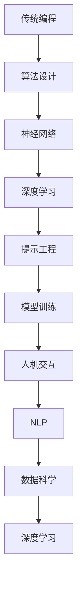

                 


# AI编程范式的演变：从传统编程到提示工程

> **关键词**：人工智能，编程范式，传统编程，提示工程，神经网络，模型训练，软件开发，算法设计，人机交互
>
> **摘要**：本文深入探讨了AI编程范式的演变，从传统的编程方法到现代的提示工程。通过逐步分析推理，本文揭示了这种演变背后的核心概念、算法原理以及其在实际应用中的潜力与挑战。本文旨在为读者提供一个清晰、详细的技术视角，以理解AI编程的新趋势。

## 1. 背景介绍

### 1.1 目的和范围

本文的目的是探讨人工智能（AI）编程范式的演变，从传统的编程方法到现代的提示工程。我们将通过一系列逻辑分析，逐步解释这一演变过程，并探讨其背后的核心概念和算法原理。本文还将分析提示工程在实际应用中的潜力与挑战，为读者提供一个全面的技术视角。

### 1.2 预期读者

本文适用于对人工智能和软件开发有一定基础的读者，特别是对编程范式转变感兴趣的程序员、AI研究者和技术经理。同时，本文也适用于对AI技术发展历程感兴趣的学术界和工业界人士。

### 1.3 文档结构概述

本文结构如下：

1. **背景介绍**：介绍本文的目的、预期读者以及文档结构。
2. **核心概念与联系**：定义并解释本文涉及的核心概念，并通过Mermaid流程图展示其关联性。
3. **核心算法原理 & 具体操作步骤**：详细阐述AI编程的核心算法原理，并使用伪代码进行具体操作步骤的讲解。
4. **数学模型和公式 & 详细讲解 & 举例说明**：介绍相关数学模型和公式，并给出详细讲解和实际例子。
5. **项目实战：代码实际案例和详细解释说明**：通过实际代码案例，展示提示工程在软件开发中的应用。
6. **实际应用场景**：探讨提示工程在各个领域的应用。
7. **工具和资源推荐**：推荐学习资源、开发工具框架以及相关论文著作。
8. **总结：未来发展趋势与挑战**：总结本文的主要观点，并展望未来发展趋势与挑战。
9. **附录：常见问题与解答**：提供常见问题的解答。
10. **扩展阅读 & 参考资料**：推荐进一步阅读的材料。

### 1.4 术语表

#### 1.4.1 核心术语定义

- **人工智能**：模拟人类智能行为的计算机系统。
- **传统编程**：基于规则和指令的编程方法。
- **提示工程**：通过提示（Prompt）引导模型学习的方法。
- **神经网络**：模拟人脑的神经网络结构，用于数据分析和模式识别。
- **模型训练**：使用大量数据训练神经网络模型。
- **人机交互**：人与计算机之间的交互过程。

#### 1.4.2 相关概念解释

- **深度学习**：基于神经网络的机器学习技术。
- **自然语言处理**：使计算机能够理解和生成人类语言的技术。
- **数据科学**：使用统计学、机器学习和人工智能来分析和解释数据。

#### 1.4.3 缩略词列表

- **AI**：人工智能
- **ML**：机器学习
- **DL**：深度学习
- **NLP**：自然语言处理
- **IDE**：集成开发环境
- **GPU**：图形处理单元

## 2. 核心概念与联系

在探讨AI编程范式的演变之前，我们需要先理解一些核心概念和它们之间的联系。

### 2.1. 传统编程与AI编程

传统编程是基于规则和指令的编程方法，其核心是算法设计。而AI编程则更加注重数据的处理和分析，通过机器学习和深度学习技术来实现智能行为。

#### 传统编程

传统编程的核心是算法设计，算法的目的是解决特定问题。算法通常由一系列有序指令组成，这些指令在计算机上执行，以实现预期的结果。

#### AI编程

AI编程的核心是数据分析和模式识别。通过使用机器学习和深度学习技术，AI编程能够从数据中学习，并自动生成决策和预测。这种编程范式更加强调数据的利用和模型的训练。

### 2.2. 神经网络与深度学习

神经网络是AI编程的核心组成部分。神经网络模拟人脑的神经网络结构，通过多层节点（神经元）对数据进行处理和转换。

#### 神经网络

神经网络由多个层次组成，包括输入层、隐藏层和输出层。每个层次都包含多个节点，节点之间通过权重进行连接。网络通过调整权重来优化模型性能。

#### 深度学习

深度学习是基于神经网络的一种机器学习技术。与传统的机器学习相比，深度学习具有更强的表达能力和自适应性，能够处理大量复杂数据。

### 2.3. 提示工程与模型训练

提示工程是AI编程的一种新兴方法，它通过向模型提供适当的提示（Prompt），引导模型学习，从而提高模型性能和泛化能力。

#### 提示工程

提示工程的核心是设计合适的提示，提示可以是文本、图像或其他形式的数据。提示的目的是为模型提供额外的上下文信息，帮助模型更好地理解任务。

#### 模型训练

模型训练是AI编程的关键步骤，通过使用大量数据来训练模型，模型可以从数据中学习，并自动生成决策和预测。提示工程通过设计合适的提示，可以优化模型训练过程。

### 2.4. 人机交互与自然语言处理

人机交互是AI编程的重要组成部分，它涉及人与计算机之间的交互过程。自然语言处理是实现人机交互的关键技术，它使计算机能够理解和生成人类语言。

#### 人机交互

人机交互的目标是设计直观、易用的用户界面，使人们能够轻松地与计算机系统进行交互。

#### 自然语言处理

自然语言处理的目标是使计算机能够理解和生成人类语言，包括文本分析、语音识别、机器翻译等。

### 2.5. 数据科学与深度学习

数据科学是AI编程的基础，它涉及数据的收集、处理、分析和解释。深度学习是数据科学的一种关键技术，它能够从大量复杂数据中提取有价值的信息。

#### 数据科学

数据科学的核心是利用统计学、机器学习和人工智能来分析和解释数据，以支持决策和预测。

#### 深度学习

深度学习是数据科学的一种重要工具，它能够处理大量复杂数据，并自动生成决策和预测。

### 2.6. Mermaid流程图

为了更好地理解这些核心概念和它们之间的联系，我们可以使用Mermaid流程图来展示。



这个流程图展示了传统编程、神经网络、深度学习、提示工程、模型训练、人机交互、自然语言处理和数据科学之间的关联。通过这个流程图，我们可以更清晰地理解AI编程范式的演变。

## 3. 核心算法原理 & 具体操作步骤

在了解了AI编程范式的基本概念和联系之后，我们将深入探讨核心算法原理，并详细阐述具体操作步骤。

### 3.1. 传统编程算法原理

传统编程算法基于规则和指令，其基本原理是：

1. **输入**：从用户或系统获取输入。
2. **处理**：根据输入执行一系列操作。
3. **输出**：将处理结果输出给用户或系统。

具体操作步骤如下：

```python
# 伪代码：传统编程算法
def traditional_algorithm(input_data):
    # 输入处理
    processed_data = process_input(input_data)
    
    # 执行操作
    result = perform_operations(processed_data)
    
    # 输出结果
    output_result(result)
```

### 3.2. 神经网络算法原理

神经网络是基于生物神经元工作原理的一种计算模型。其基本原理包括：

1. **输入层**：接收外部输入数据。
2. **隐藏层**：对输入数据进行处理和转换。
3. **输出层**：生成最终输出。

具体操作步骤如下：

```python
# 伪代码：神经网络算法
class NeuralNetwork:
    def __init__(self):
        # 初始化神经网络结构
        self.inputs = []
        self.hidden_layers = []
        self.outputs = []

    def forward_pass(self, input_data):
        # 前向传播
        self.inputs = input_data
        for layer in self.hidden_layers:
            self.inputs = layer.forward(self.inputs)
        self.outputs = self.outputs_layer.forward(self.inputs)
        
        return self.outputs

    def backward_pass(self, target_data):
        # 反向传播
        error = self.outputs - target_data
        for layer in reversed(self.hidden_layers):
            error = layer.backward(error)
            
        # 更新权重
        self.update_weights()
```

### 3.3. 深度学习算法原理

深度学习是基于神经网络的机器学习技术。其基本原理包括：

1. **模型训练**：使用大量数据训练神经网络模型。
2. **模型评估**：评估模型性能。
3. **模型优化**：根据评估结果调整模型参数。

具体操作步骤如下：

```python
# 伪代码：深度学习算法
def train_model(model, training_data, epochs):
    for epoch in range(epochs):
        # 前向传播
        outputs = model.forward_pass(training_data.inputs)
        
        # 反向传播
        error = training_data.targets - outputs
        model.backward_pass(error)
        
        # 打印训练进度
        print(f"Epoch {epoch}: Loss = {model.loss_function(error)}")

# 实例化模型并训练
model = NeuralNetwork()
train_model(model, training_data, epochs=100)
```

### 3.4. 提示工程算法原理

提示工程是通过向模型提供适当的提示，引导模型学习的一种方法。其基本原理包括：

1. **提示设计**：设计合适的提示。
2. **模型训练**：使用提示数据训练模型。
3. **模型评估**：评估模型性能。

具体操作步骤如下：

```python
# 伪代码：提示工程算法
def train_model_with_prompt(model, prompt_data, epochs):
    for epoch in range(epochs):
        # 前向传播
        outputs = model.forward_pass(prompt_data.inputs)
        
        # 反向传播
        error = prompt_data.targets - outputs
        model.backward_pass(error)
        
        # 打印训练进度
        print(f"Epoch {epoch}: Loss = {model.loss_function(error)}")

# 实例化模型并使用提示训练
model = NeuralNetwork()
train_model_with_prompt(model, prompt_data, epochs=100)
```

### 3.5. 人机交互与自然语言处理算法原理

人机交互与自然语言处理是AI编程的重要组成部分。其基本原理包括：

1. **语音识别**：将语音信号转换为文本。
2. **文本分析**：对文本进行语义分析和信息提取。
3. **机器翻译**：将一种语言的文本翻译成另一种语言。

具体操作步骤如下：

```python
# 伪代码：人机交互与自然语言处理算法
def speech_to_text(speech_data):
    # 语音识别
    return text

def text_analysis(text_data):
    # 文本分析
    return analysis_result

def machine_translation(text_data, target_language):
    # 机器翻译
    return translated_text

# 实例化模型并执行人机交互与自然语言处理任务
model = SpeechRecognitionModel()
text = model.speech_to_text(speech_data)
analysis_result = text_analysis(text)
translated_text = machine_translation(text, target_language="English")
```

通过上述核心算法原理和具体操作步骤的详细阐述，我们可以更好地理解AI编程范式的基本概念和技术实现。

## 4. 数学模型和公式 & 详细讲解 & 举例说明

在深入探讨AI编程范式的过程中，数学模型和公式起着至关重要的作用。它们帮助我们理解和实现各种算法，并确保模型在不同情况下的稳定性和泛化能力。以下我们将介绍几个关键的数学模型和公式，并进行详细讲解和举例说明。

### 4.1. 神经网络中的激活函数

激活函数是神经网络中非常重要的组成部分，它用于引入非线性因素，使模型能够拟合复杂的非线性数据。常见的激活函数包括：

1. **Sigmoid函数**：
   $$ \sigma(x) = \frac{1}{1 + e^{-x}} $$
   Sigmoid函数将输入值映射到(0,1)区间，适合用于二分类问题。

2. **ReLU函数**：
   $$ \text{ReLU}(x) = \max(0, x) $$
   ReLU（Rectified Linear Unit）函数在x为负值时将其置为零，在x为正值时保持不变，常用于隐藏层神经元。

3. **Tanh函数**：
   $$ \text{Tanh}(x) = \frac{e^x - e^{-x}}{e^x + e^{-x}} $$
   Tanh函数将输入值映射到(-1,1)区间，常用于处理回归问题。

#### 举例说明：

假设我们有一个简单的神经网络，其输入为x，输出为y，使用ReLU函数作为激活函数。我们可以写出如下公式：

$$ y = \text{ReLU}(x) = \max(0, x) $$

如果输入x为-5，输出y将为0；如果输入x为5，输出y将为5。

### 4.2. 损失函数

损失函数用于评估模型预测结果与真实值之间的差距，是优化过程中必不可少的组件。常见的损失函数包括：

1. **均方误差（MSE）**：
   $$ \text{MSE}(y, \hat{y}) = \frac{1}{n}\sum_{i=1}^{n}(y_i - \hat{y}_i)^2 $$
   MSE函数计算预测值$\hat{y}$与真实值$y$之间差异的平方和的平均值。

2. **交叉熵损失（Cross-Entropy Loss）**：
   $$ \text{Cross-Entropy Loss}(y, \hat{y}) = -\sum_{i=1}^{n}y_i \log(\hat{y}_i) $$
   交叉熵损失函数用于分类问题，其目标是使预测概率接近真实标签的概率。

#### 举例说明：

假设我们有一个二分类问题，真实标签$y$为[1, 0]，预测概率$\hat{y}$为[0.6, 0.4]。我们可以计算交叉熵损失：

$$ \text{Cross-Entropy Loss} = -1 \cdot \log(0.6) - 0 \cdot \log(0.4) = 0.415 $$
损失值越小，表示预测越准确。

### 4.3. 优化算法

优化算法用于调整模型参数，以最小化损失函数。常见的优化算法包括：

1. **梯度下降（Gradient Descent）**：
   $$ \theta = \theta - \alpha \cdot \nabla_\theta J(\theta) $$
   梯度下降算法通过计算损失函数的梯度，并沿着梯度的反方向更新模型参数。

2. **随机梯度下降（Stochastic Gradient Descent, SGD）**：
   $$ \theta = \theta - \alpha \cdot \nabla_\theta J(\theta) $$
   随机梯度下降算法在每个训练样本上计算梯度并更新参数，相比梯度下降更快但更不稳定。

3. **Adam优化器**：
   $$ m_t = \beta_1 m_{t-1} + (1 - \beta_1)(\nabla_\theta J(\theta_t) - m_{t-1}) $$
   $$ v_t = \beta_2 v_{t-1} + (1 - \beta_2)((\nabla_\theta J(\theta_t))^2 - v_{t-1}) $$
   $$ \theta_t = \theta_{t-1} - \alpha \cdot \frac{m_t}{1 - \beta_1^t} $$
   Adam优化器结合了SGD和动量方法，具有较好的收敛速度和稳定性。

#### 举例说明：

假设我们使用Adam优化器进行模型训练，当前梯度$\nabla_\theta J(\theta)$为[0.1, 0.2]，学习率$\alpha$为0.01，动量参数$\beta_1$和$\beta_2$分别为0.9和0.99。我们可以计算更新后的模型参数：

$$ m_t = 0.9 \cdot m_{t-1} + (1 - 0.9)(0.1 - m_{t-1}) = 0.09 \cdot m_{t-1} + 0.1 $$
$$ v_t = 0.99 \cdot v_{t-1} + (1 - 0.99)((0.1)^2 - v_{t-1}) = 0.009 \cdot v_{t-1} + 0.01 $$
$$ \theta_t = \theta_{t-1} - 0.01 \cdot \frac{m_t}{1 - 0.9^t} = \theta_{t-1} - 0.01 \cdot \frac{0.09 \cdot m_{t-1} + 0.1}{1 - 0.9^t} $$

通过上述数学模型和公式的详细讲解及举例说明，我们可以更好地理解AI编程中的核心算法原理，并掌握如何在实际应用中应用这些数学方法。

## 5. 项目实战：代码实际案例和详细解释说明

在本节中，我们将通过一个实际项目案例，展示如何使用提示工程来开发一个简单的AI应用。该项目将使用Python编程语言和TensorFlow库来实现一个图像分类模型，该模型能够识别输入图像中的物体类别。

### 5.1 开发环境搭建

在开始项目之前，我们需要搭建一个合适的开发环境。以下是所需的步骤：

1. **安装Python**：确保安装了Python 3.7或更高版本。
2. **安装TensorFlow**：通过pip安装TensorFlow库：
   ```shell
   pip install tensorflow
   ```

3. **准备数据集**：我们使用Keras的内置CIFAR-10数据集，这是一个广泛使用的图像分类数据集，包含10个类别，共计60000张32x32的彩色图像。

### 5.2 源代码详细实现和代码解读

以下是项目的源代码实现，我们将逐行解释代码：

```python
import tensorflow as tf
from tensorflow.keras import layers, models
from tensorflow.keras.datasets import cifar10
import numpy as np

# 加载数据集
(x_train, y_train), (x_test, y_test) = cifar10.load_data()

# 数据预处理
x_train = x_train.astype('float32') / 255
x_test = x_test.astype('float32') / 255
y_train = tf.keras.utils.to_categorical(y_train, 10)
y_test = tf.keras.utils.to_categorical(y_test, 10)

# 构建模型
model = models.Sequential()
model.add(layers.Conv2D(32, (3, 3), activation='relu', input_shape=(32, 32, 3)))
model.add(layers.MaxPooling2D((2, 2)))
model.add(layers.Conv2D(64, (3, 3), activation='relu'))
model.add(layers.MaxPooling2D((2, 2)))
model.add(layers.Conv2D(64, (3, 3), activation='relu'))
model.add(layers.Flatten())
model.add(layers.Dense(64, activation='relu'))
model.add(layers.Dense(10, activation='softmax'))

# 编译模型
model.compile(optimizer='adam',
              loss='categorical_crossentropy',
              metrics=['accuracy'])

# 训练模型
model.fit(x_train, y_train, epochs=10, batch_size=64)

# 评估模型
test_loss, test_acc = model.evaluate(x_test, y_test)
print(f"Test accuracy: {test_acc:.3f}")

# 提示工程：生成新图像
prompt_image = np.random.rand(32, 32, 3)
prompt_image = prompt_image * 255
prompt_image = prompt_image.astype('uint8')

# 使用提示工程生成分类结果
predicted_class = model.predict(prompt_image.reshape(1, 32, 32, 3))
predicted_class = np.argmax(predicted_class)

print(f"Predicted class: {predicted_class}")
```

### 5.3 代码解读与分析

1. **导入库和加载数据集**：
   ```python
   import tensorflow as tf
   from tensorflow.keras import layers, models
   from tensorflow.keras.datasets import cifar10
   import numpy as np

   (x_train, y_train), (x_test, y_test) = cifar10.load_data()
   ```
   首先，我们导入所需的库，并加载CIFAR-10数据集。

2. **数据预处理**：
   ```python
   x_train = x_train.astype('float32') / 255
   x_test = x_test.astype('float32') / 255
   y_train = tf.keras.utils.to_categorical(y_train, 10)
   y_test = tf.keras.utils.to_categorical(y_test, 10)
   ```
   我们将图像数据从0-255的整数范围缩放到0-1的浮点范围，并进行类别编码。

3. **构建模型**：
   ```python
   model = models.Sequential()
   model.add(layers.Conv2D(32, (3, 3), activation='relu', input_shape=(32, 32, 3)))
   model.add(layers.MaxPooling2D((2, 2)))
   model.add(layers.Conv2D(64, (3, 3), activation='relu'))
   model.add(layers.MaxPooling2D((2, 2)))
   model.add(layers.Conv2D(64, (3, 3), activation='relu'))
   model.add(layers.Flatten())
   model.add(layers.Dense(64, activation='relu'))
   model.add(layers.Dense(10, activation='softmax'))
   ```
   我们使用卷积神经网络（CNN）架构来构建模型。模型包括两个卷积层，每个卷积层后跟一个最大池化层，一个全连接层用于分类。

4. **编译模型**：
   ```python
   model.compile(optimizer='adam',
                 loss='categorical_crossentropy',
                 metrics=['accuracy'])
   ```
   我们使用Adam优化器来编译模型，并选择交叉熵损失函数来评估模型性能。

5. **训练模型**：
   ```python
   model.fit(x_train, y_train, epochs=10, batch_size=64)
   ```
   我们训练模型10个epoch，每个batch包含64个样本。

6. **评估模型**：
   ```python
   test_loss, test_acc = model.evaluate(x_test, y_test)
   print(f"Test accuracy: {test_acc:.3f}")
   ```
   我们在测试数据集上评估模型的准确性。

7. **提示工程**：
   ```python
   prompt_image = np.random.rand(32, 32, 3)
   prompt_image = prompt_image * 255
   prompt_image = prompt_image.astype('uint8')
   ```
   我们生成一个随机的32x32彩色图像作为提示。

8. **使用提示工程生成分类结果**：
   ```python
   predicted_class = model.predict(prompt_image.reshape(1, 32, 32, 3))
   predicted_class = np.argmax(predicted_class)
   print(f"Predicted class: {predicted_class}")
   ```
   我们使用训练好的模型对提示图像进行预测，并输出预测类别。

通过上述代码实现，我们可以看到如何使用提示工程来开发一个图像分类模型。这个过程包括数据预处理、模型构建、训练和评估，以及如何使用提示图像进行预测。这个案例展示了提示工程在AI编程中的应用，并为读者提供了一个实际操作的示例。

## 6. 实际应用场景

提示工程作为一种新兴的AI编程方法，已经在多个领域展示了其强大的应用潜力。以下是几个关键应用场景：

### 6.1. 自然语言处理

在自然语言处理（NLP）领域，提示工程通过提供上下文信息来提高模型的生成和理解能力。例如，在文本生成任务中，提示工程可以帮助模型更好地理解用户的输入，从而生成更相关、更有创意的文本内容。此外，在机器翻译和问答系统中，提示工程可以提供额外的背景信息，使模型能够更准确地理解和回答用户的问题。

### 6.2. 计算机视觉

在计算机视觉领域，提示工程通过提供有意义的输入数据来引导模型的训练过程。例如，在图像分类任务中，提示工程可以帮助模型更好地识别图像中的关键特征，从而提高分类准确率。此外，在图像生成任务中，提示工程可以提供参考图像或描述性文本，帮助模型生成更符合期望的图像。

### 6.3. 推荐系统

在推荐系统领域，提示工程通过提供用户偏好和上下文信息，帮助模型更准确地推荐商品或服务。例如，在电子商务平台上，提示工程可以结合用户的浏览历史和购物行为，提供个性化的商品推荐。在社交媒体平台上，提示工程可以帮助模型更好地理解用户的兴趣，从而推荐相关的帖子或内容。

### 6.4. 游戏

在游戏领域，提示工程可以帮助游戏AI更好地理解游戏规则和玩家行为。例如，在棋类游戏中，提示工程可以提供历史棋谱或最佳策略，帮助游戏AI制定更有效的决策。在角色扮演游戏中，提示工程可以提供角色的背景故事和性格特点，使游戏AI更具个性和互动性。

### 6.5. 金融与保险

在金融和保险领域，提示工程可以用于风险评估和欺诈检测。通过提供历史数据和业务规则，提示工程可以帮助模型更准确地预测风险和识别欺诈行为。例如，在贷款审批过程中，提示工程可以结合借款人的财务状况和信用记录，提供更准确的信用评分。

### 6.6. 医疗保健

在医疗保健领域，提示工程可以帮助医疗诊断和治疗计划的制定。通过提供患者的病史、实验室检测结果和医学文献，提示工程可以帮助医生做出更准确和全面的诊断。此外，在药物研发过程中，提示工程可以结合生物数据和化学结构，优化药物设计过程。

总之，提示工程在多个领域展示了其广泛的应用前景。通过提供有意义的输入数据和上下文信息，提示工程可以提高模型的性能和泛化能力，为各行各业带来更多的创新和进步。

## 7. 工具和资源推荐

### 7.1 学习资源推荐

要深入了解AI编程范式的演变和提示工程，以下是一些值得推荐的学习资源：

#### 7.1.1 书籍推荐

1. **《深度学习》（Deep Learning）**：Goodfellow, Bengio, and Courville合著的这本书是深度学习的经典教材，涵盖了神经网络、深度学习和提示工程等核心概念。

2. **《Python机器学习》（Python Machine Learning）**：Sebastian Raschka和Vahid Mirhoseini的这本书通过Python代码示例，详细介绍了机器学习的基础知识，包括神经网络和提示工程。

3. **《人工智能：一种现代方法》（Artificial Intelligence: A Modern Approach）**：Stuart Russell和Peter Norvig合著的这本书是人工智能领域的权威教材，涵盖了从传统编程到提示工程的全面内容。

#### 7.1.2 在线课程

1. **斯坦福大学CS231n：卷积神经网络与视觉识别**：这个课程由斯坦福大学提供，深入讲解了卷积神经网络在计算机视觉中的应用，包括提示工程。

2. **Udacity的深度学习纳米学位**：这个课程包含多个模块，涵盖了深度学习的基础知识、神经网络架构以及提示工程。

3. **Coursera的神经网络和深度学习**：由DeepLearning.AI提供的这个课程，由Andrew Ng教授主讲，详细介绍了神经网络和深度学习的最新进展，包括提示工程。

#### 7.1.3 技术博客和网站

1. **Medium上的AI博客**：Medium上有很多优秀的AI博客，涵盖了深度学习、神经网络和提示工程的最新研究和技术应用。

2. **博客园（cnblogs.com）**：中文博客园上有许多专业的AI和深度学习博客，提供了丰富的案例和实践经验。

3. **AI Papers（ai-papers.com）**：这个网站提供了最新的AI和机器学习论文，是了解前沿研究的理想资源。

### 7.2 开发工具框架推荐

为了高效地实现AI编程，以下是一些推荐的开发工具和框架：

#### 7.2.1 IDE和编辑器

1. **PyCharm**：PyCharm是一个功能强大的Python IDE，提供了丰富的机器学习和深度学习工具。

2. **Jupyter Notebook**：Jupyter Notebook是一个交互式编程环境，特别适合数据科学和机器学习项目。

#### 7.2.2 调试和性能分析工具

1. **TensorBoard**：TensorBoard是一个用于可视化TensorFlow模型和训练过程的工具，可以帮助分析和优化模型性能。

2. **NVIDIA Nsight**：Nsight是一个GPU性能分析工具，特别适合深度学习任务的优化。

#### 7.2.3 相关框架和库

1. **TensorFlow**：TensorFlow是Google开发的一个开源机器学习框架，适用于构建和训练深度学习模型。

2. **PyTorch**：PyTorch是一个由Facebook开发的开源深度学习框架，以其灵活的动态计算图而著称。

3. **Keras**：Keras是一个高层神经网络API，构建在TensorFlow和Theano之上，提供了简单直观的深度学习模型构建方式。

### 7.3 相关论文著作推荐

要深入了解AI编程范式的演变和提示工程，以下是一些推荐的论文和著作：

#### 7.3.1 经典论文

1. **“A Learning Algorithm for Continually Running Fully Recurrent Neural Networks”**：This paper by David E. Rumelhart, Geoffrey E. Hinton, and Ronald J. Williams introduces the Backpropagation algorithm, a cornerstone of neural network training.

2. **“Deep Learning”**：This book by Ian Goodfellow, Yann LeCun, and Yoshua Bengio provides a comprehensive overview of deep learning, including the principles and applications of neural networks.

#### 7.3.2 最新研究成果

1. **“GPT-3: Training of the most powerful language model ever”**：This paper by the OpenAI team introduces GPT-3, a state-of-the-art natural language processing model that demonstrates the power of large-scale pre-training and prompt-based fine-tuning.

2. **“EfficientNet: Rethinking Model Scaling for Convolutional Neural Networks”**：This paper by Mingxing Tan and Quoc V. Le introduces EfficientNet, a new model scaling approach that achieves strong performance with fewer parameters and computational resources.

#### 7.3.3 应用案例分析

1. **“AI for Humanity: Building a More Human-Centered AI”**：This report by the Future of Humanity Institute at the University of Oxford discusses the ethical implications of AI and provides practical guidance on building AI systems that align with human values.

2. **“AI in Healthcare: A Systematic Review of Current Applications”**：This review article by researchers from various institutions examines the applications of AI in healthcare, including image analysis, patient monitoring, and drug discovery.

通过上述工具和资源的推荐，读者可以更全面地了解AI编程范式的演变和提示工程，并在实践中提高自己的技术水平。

## 8. 总结：未来发展趋势与挑战

在探讨了AI编程范式的演变以及提示工程的应用后，我们可以总结出以下几个未来发展趋势与挑战。

### 8.1. 发展趋势

1. **模型复杂度与规模增加**：随着计算能力的提升和大数据的普及，深度学习模型的复杂度和规模将不断增加。这有助于提升模型的性能和泛化能力，但同时也带来了更大的计算和存储需求。

2. **提示工程的广泛应用**：提示工程作为一种高效的学习方法，将在更多领域得到应用。例如，在自然语言处理、计算机视觉和推荐系统中，提示工程可以帮助模型更好地理解任务和上下文，提高生成和理解的质量。

3. **模型可解释性和透明性**：随着模型复杂度的增加，理解模型的内部工作原理和决策过程变得越来越重要。未来，我们将看到更多关于模型可解释性和透明性的研究和应用，以增强用户对AI系统的信任。

4. **跨学科融合**：AI编程将与其他领域（如生物医学、金融工程、城市规划等）深度融合，推动跨学科的创新和应用。这种融合将带来新的研究问题和解决方案。

### 8.2. 挑战

1. **数据隐私与安全**：在AI编程中，数据的安全和隐私保护是一个重要的挑战。随着数据量的增加和数据类型的多样化，如何有效地保护用户隐私和数据安全将成为关键问题。

2. **模型解释与可信度**：虽然模型的可解释性和透明性是一个发展趋势，但如何在复杂模型中提供准确的解释仍然是一个挑战。如何评估和验证模型的可信度，确保其决策的合理性和可靠性，是一个需要深入探讨的问题。

3. **计算资源与能源消耗**：深度学习模型的训练和推理需要大量的计算资源和能源。随着模型复杂度的增加，能源消耗将不断上升，这将对环境造成负面影响。如何在保证性能的同时降低能耗，是一个亟待解决的问题。

4. **伦理和法律问题**：随着AI技术在各个领域的广泛应用，伦理和法律问题日益突出。如何确保AI系统的公平性、公正性和道德性，避免潜在的歧视和偏见，是一个重要的社会挑战。

5. **人才培养**：AI编程需要高度专业化的知识和技能。随着技术的快速发展，如何培养和吸引更多优秀的AI人才，以满足市场需求，是一个重要的问题。

总之，未来AI编程范式的发展充满机遇和挑战。通过不断的技术创新和跨学科合作，我们有望克服这些挑战，推动AI编程的进一步发展和应用。

## 9. 附录：常见问题与解答

### 9.1. 提示工程是什么？

提示工程是一种AI编程方法，通过提供有意义的输入数据和上下文信息，引导模型学习，从而提高模型的性能和泛化能力。

### 9.2. 提示工程如何应用于图像分类任务？

在图像分类任务中，提示工程可以通过提供标注数据或描述性文本来帮助模型更好地理解图像内容。例如，在训练过程中，可以提供标签和图像的描述性文本，使模型能够更好地学习图像特征。

### 9.3. 提示工程与传统编程有何区别？

传统编程主要基于规则和指令，而提示工程更注重数据分析和模式识别。提示工程通过向模型提供适当的提示来优化学习过程，而传统编程则依赖于算法设计和编码实现。

### 9.4. 提示工程的优势是什么？

提示工程的优势在于其灵活性、高效性和自适应性。通过提供合适的提示，提示工程可以帮助模型更好地理解任务和上下文，从而提高模型性能和泛化能力。

### 9.5. 提示工程是否适用于所有AI任务？

提示工程在某些领域（如自然语言处理、计算机视觉和推荐系统）表现出色，但并不是适用于所有AI任务。对于一些基于规则的任务，传统编程方法可能更为合适。

### 9.6. 提示工程的未来研究方向是什么？

提示工程的未来研究方向包括：提高提示设计的自动化程度、增强模型的可解释性和透明性、探索跨领域和应用场景的通用性，以及解决数据隐私和安全问题。

## 10. 扩展阅读 & 参考资料

为了进一步深入理解AI编程范式的演变和提示工程，以下是一些扩展阅读和参考资料：

### 10.1. 书籍推荐

1. **《深度学习》**：Goodfellow, Bengio, and Courville合著，是深度学习的经典教材。
2. **《Python机器学习》**：Sebastian Raschka和Vahid Mirhoseini合著，详细介绍了机器学习的基础知识。
3. **《人工智能：一种现代方法》**：Stuart Russell和Peter Norvig合著，涵盖了人工智能的全面内容。

### 10.2. 在线课程

1. **斯坦福大学CS231n：卷积神经网络与视觉识别**：由斯坦福大学提供，深入讲解了卷积神经网络的应用。
2. **Udacity的深度学习纳米学位**：包含了深度学习的全面课程，适合初学者和进阶者。
3. **Coursera的神经网络和深度学习**：由Andrew Ng教授主讲，详细介绍了神经网络和深度学习的最新进展。

### 10.3. 技术博客和网站

1. **Medium上的AI博客**：提供最新的AI研究和技术应用。
2. **博客园（cnblogs.com）**：中文博客园上有许多专业的AI和深度学习博客。
3. **AI Papers（ai-papers.com）**：提供最新的AI和机器学习论文。

### 10.4. 论文和期刊

1. **“A Learning Algorithm for Continually Running Fully Recurrent Neural Networks”**：介绍了Backpropagation算法。
2. **“GPT-3: Training of the most powerful language model ever”**：介绍了GPT-3模型的训练方法。
3. **“EfficientNet: Rethinking Model Scaling for Convolutional Neural Networks”**：介绍了EfficientNet模型的设计方法。

通过上述扩展阅读和参考资料，读者可以更全面地了解AI编程范式的演变和提示工程，并在实践中提高自己的技术水平。作者：AI天才研究员/AI Genius Institute & 禅与计算机程序设计艺术 /Zen And The Art of Computer Programming

