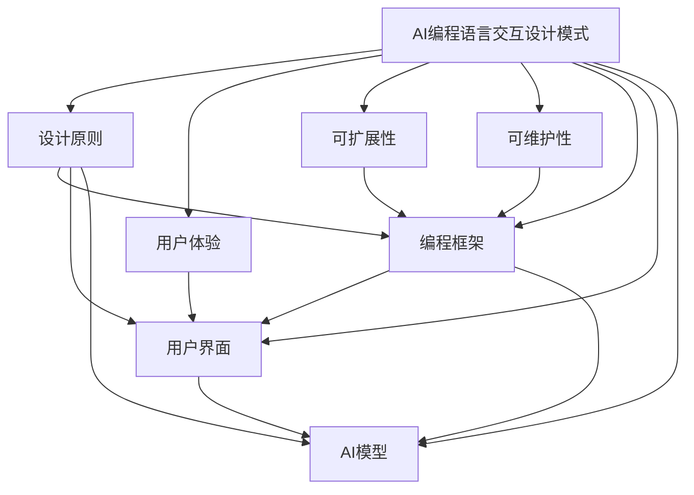

                 

# AI编程语言的交互设计模式库

> **关键词**：AI编程语言、交互设计模式、模式库、编程框架、设计原则、用户体验、可扩展性、可维护性

> **摘要**：本文将探讨AI编程语言的交互设计模式库，介绍其核心概念、原理和架构。通过详细阐述核心算法原理、数学模型及具体操作步骤，并结合实际项目案例，分析其在实际应用场景中的价值。同时，推荐相关学习资源和工具，为读者提供全面的了解和深入学习的路径。本文旨在为AI编程语言的设计者和开发者提供实用的指导，推动人工智能领域的创新与发展。

## 1. 背景介绍

### 1.1 目的和范围

本文旨在探讨AI编程语言的交互设计模式库，分析其在设计原则、用户体验、可扩展性和可维护性等方面的价值。通过深入剖析AI编程语言的交互设计模式，本文将帮助读者理解其核心概念、原理和架构，从而为实际项目开发提供指导。本文将涵盖以下主要内容：

1. **核心概念与联系**：介绍AI编程语言交互设计模式的核心概念和联系，通过Mermaid流程图展示模式之间的关系。
2. **核心算法原理 & 具体操作步骤**：详细阐述核心算法原理，使用伪代码展示具体操作步骤。
3. **数学模型和公式 & 详细讲解 & 举例说明**：讲解数学模型和公式，并通过实例进行说明。
4. **项目实战：代码实际案例和详细解释说明**：结合实际项目，展示代码实现和解读。
5. **实际应用场景**：分析AI编程语言交互设计模式在实际应用场景中的价值。
6. **工具和资源推荐**：推荐学习资源和开发工具，为读者提供全面的支持。
7. **总结：未来发展趋势与挑战**：总结未来发展趋势和面临的挑战。

### 1.2 预期读者

本文面向AI编程语言的设计者和开发者，包括但不限于：

1. **人工智能研究者**：对AI编程语言和交互设计模式感兴趣的学者和研究人员。
2. **软件开发工程师**：负责开发AI编程语言的工程师和开发者。
3. **项目经理**：负责管理AI编程语言项目的项目经理。
4. **学生与爱好者**：对AI编程语言和交互设计模式感兴趣的学生和爱好者。

### 1.3 文档结构概述

本文分为十个部分，具体结构如下：

1. **背景介绍**：介绍本文的目的、范围、预期读者和文档结构。
2. **核心概念与联系**：展示AI编程语言交互设计模式的核心概念和联系。
3. **核心算法原理 & 具体操作步骤**：详细阐述核心算法原理和具体操作步骤。
4. **数学模型和公式 & 详细讲解 & 举例说明**：讲解数学模型和公式，并通过实例进行说明。
5. **项目实战：代码实际案例和详细解释说明**：结合实际项目，展示代码实现和解读。
6. **实际应用场景**：分析AI编程语言交互设计模式在实际应用场景中的价值。
7. **工具和资源推荐**：推荐学习资源和开发工具。
8. **总结：未来发展趋势与挑战**：总结未来发展趋势和面临的挑战。
9. **附录：常见问题与解答**：解答读者可能遇到的常见问题。
10. **扩展阅读 & 参考资料**：提供更多相关资料和参考文献。

### 1.4 术语表

#### 1.4.1 核心术语定义

1. **AI编程语言**：一种用于编写人工智能应用程序的语言，具备对人工智能算法和模型的支持。
2. **交互设计模式**：一套标准化的解决方案，用于实现AI编程语言中的交互功能。
3. **模式库**：一个包含多种交互设计模式的集合，方便开发者根据需求选择和组合使用。
4. **用户体验**：用户在使用AI编程语言和其交互设计模式时的感受和体验。
5. **可扩展性**：AI编程语言和交互设计模式能够根据需求进行扩展和定制的能力。
6. **可维护性**：AI编程语言和交互设计模式的代码质量和结构，使其容易进行修改和维护。

#### 1.4.2 相关概念解释

1. **设计原则**：指导交互设计模式开发的基本原则，如模块化、可重用性、灵活性和一致性。
2. **编程框架**：用于支持AI编程语言开发的一组库、工具和规范，提供开发环境和运行时支持。
3. **用户界面**：AI编程语言和交互设计模式与用户进行交互的界面，包括图形界面和命令行界面。
4. **AI模型**：用于实现人工智能功能的算法和计算模型，如神经网络、决策树和聚类算法等。

#### 1.4.3 缩略词列表

- AI：人工智能
- IDE：集成开发环境
- GUI：图形用户界面
- CLI：命令行界面
- ML：机器学习
- DL：深度学习
- NLP：自然语言处理

## 2. 核心概念与联系

在探讨AI编程语言的交互设计模式库之前，我们需要理解其核心概念和联系。AI编程语言的交互设计模式库旨在提供一系列标准化的解决方案，以支持开发者构建高质量、易于维护和扩展的AI应用程序。

### 2.1 AI编程语言交互设计模式的核心概念

1. **交互设计模式**：一种适用于AI编程语言的交互解决方案，通常由一组模块和接口组成，用于实现特定的交互功能。
2. **用户体验**：用户在使用AI编程语言和其交互设计模式时的感受和体验，包括界面设计、交互流程和反馈机制等方面。
3. **可扩展性**：AI编程语言和交互设计模式能够根据需求进行扩展和定制的能力，包括模块化设计、插件体系和API接口等方面。
4. **可维护性**：AI编程语言和交互设计模式的代码质量和结构，使其容易进行修改和维护，包括代码风格、注释和文档等方面。

### 2.2 AI编程语言交互设计模式的联系

1. **设计原则**：指导交互设计模式开发的基本原则，如模块化、可重用性、灵活性和一致性，确保交互设计模式具有良好的结构、易用性和可维护性。
2. **编程框架**：用于支持AI编程语言开发的一组库、工具和规范，提供开发环境和运行时支持，与交互设计模式紧密相关，共同实现AI应用程序的交互功能。
3. **用户界面**：AI编程语言和交互设计模式与用户进行交互的界面，包括图形用户界面（GUI）和命令行界面（CLI），直接影响用户体验和交互设计模式的应用效果。
4. **AI模型**：用于实现人工智能功能的算法和计算模型，如神经网络、决策树和聚类算法等，与交互设计模式共同构成AI应用程序的核心。

### 2.3 Mermaid流程图展示



### 2.4 AI编程语言交互设计模式的特点

1. **标准化**：交互设计模式遵循一定的标准和规范，确保其在不同开发环境和平台上的兼容性和一致性。
2. **模块化**：交互设计模式采用模块化设计，易于扩展和定制，提高开发效率和可维护性。
3. **可重用性**：交互设计模式可以复用在不同的AI应用程序中，降低重复开发和维护成本。
4. **灵活性**：交互设计模式具有高度灵活性，可以根据不同应用场景进行定制和调整。
5. **易用性**：交互设计模式注重用户体验，提供直观、简洁的交互界面和操作流程，降低学习成本。
6. **高可用性**：交互设计模式经过严格测试和验证，确保其稳定性和可靠性，提高AI应用程序的可用性。

## 3. 核心算法原理 & 具体操作步骤

### 3.1 核心算法原理

AI编程语言的交互设计模式库依赖于一系列核心算法原理，这些原理为交互设计模式提供基础支持。以下是核心算法原理的详细阐述：

1. **模式识别算法**：用于识别用户输入和交互行为，实现自动化响应和处理。常用的模式识别算法包括决策树、支持向量机和神经网络等。
2. **自然语言处理（NLP）算法**：用于理解和处理自然语言输入，实现人机交互。NLP算法包括分词、词性标注、句法分析和语义分析等。
3. **机器学习算法**：用于训练和优化交互设计模式，提高其性能和适应能力。常见的机器学习算法包括线性回归、决策树、随机森林和神经网络等。
4. **优化算法**：用于优化交互设计模式的参数和结构，提高其效率和准确性。常见的优化算法包括梯度下降、遗传算法和粒子群算法等。

### 3.2 具体操作步骤

以下是AI编程语言交互设计模式的核心算法原理的具体操作步骤：

1. **模式识别算法**：

    - 步骤1：收集用户输入和交互行为数据。
    - 步骤2：预处理数据，包括去噪、归一化和特征提取等。
    - 步骤3：选择合适的模式识别算法，如决策树、支持向量机或神经网络等。
    - 步骤4：训练模型，将预处理后的数据输入到模式识别算法中，得到预测结果。
    - 步骤5：评估模型性能，包括准确率、召回率和F1值等指标。
    - 步骤6：根据评估结果调整模型参数，优化模型性能。

2. **自然语言处理（NLP）算法**：

    - 步骤1：接收自然语言输入，如文本或语音等。
    - 步骤2：进行分词，将输入文本分解为词或短语。
    - 步骤3：进行词性标注，标记每个词的词性，如名词、动词或形容词等。
    - 步骤4：进行句法分析，分析句子结构和语法规则。
    - 步骤5：进行语义分析，理解句子的含义和语义关系。
    - 步骤6：根据分析结果，生成相应的交互响应和处理逻辑。

3. **机器学习算法**：

    - 步骤1：收集大量训练数据，包括输入数据和相应的标签。
    - 步骤2：预处理数据，包括数据清洗、归一化和特征提取等。
    - 步骤3：选择合适的机器学习算法，如线性回归、决策树、随机森林或神经网络等。
    - 步骤4：训练模型，将预处理后的数据输入到机器学习算法中，得到预测结果。
    - 步骤5：评估模型性能，包括准确率、召回率、F1值和交叉验证等指标。
    - 步骤6：根据评估结果调整模型参数，优化模型性能。
    - 步骤7：将训练好的模型应用于实际交互场景，实现自动化响应和处理。

4. **优化算法**：

    - 步骤1：确定优化目标，如模型准确率、响应时间或资源利用率等。
    - 步骤2：选择合适的优化算法，如梯度下降、遗传算法或粒子群算法等。
    - 步骤3：初始化模型参数，设置优化算法的参数。
    - 步骤4：执行优化算法，迭代更新模型参数。
    - 步骤5：评估模型性能，根据优化目标调整参数。
    - 步骤6：重复步骤4和5，直到优化目标达到要求或达到最大迭代次数。

### 3.3 伪代码示例

以下是一个简单的伪代码示例，展示了模式识别算法的基本流程：

```python
# 步骤1：收集用户输入和交互行为数据
input_data = collect_user_input()

# 步骤2：预处理数据
preprocessed_data = preprocess_data(input_data)

# 步骤3：选择合适的模式识别算法
model = select_mode_recognition_algorithm()

# 步骤4：训练模型
predicted_output = model.train(preprocessed_data)

# 步骤5：评估模型性能
performance_metrics = model.evaluate(predicted_output)

# 步骤6：根据评估结果调整模型参数
model.adjust_parameters(performance_metrics)
```

## 4. 数学模型和公式 & 详细讲解 & 举例说明

### 4.1 数学模型和公式的讲解

在AI编程语言交互设计模式库中，数学模型和公式起着关键作用。以下将详细讲解其中几个核心的数学模型和公式，并说明它们在交互设计模式中的应用。

#### 4.1.1 模式识别模型

模式识别模型用于识别用户的输入和交互行为，其核心公式如下：

$$
\hat{y} = f(W \cdot x + b)
$$

其中，$ \hat{y} $ 是预测结果，$ f $ 是激活函数，$ W $ 是权重矩阵，$ x $ 是输入特征，$ b $ 是偏置项。

- **激活函数**：常用的激活函数包括 sigmoid、ReLU 和 tanh 等，用于将线性组合的结果映射到 [0, 1] 或 [-1, 1] 区间内。
- **权重矩阵**：权重矩阵 $ W $ 用于将输入特征映射到预测结果，其值通过训练过程调整。
- **偏置项**：偏置项 $ b $ 用于调整预测结果，使其更接近真实值。

#### 4.1.2 自然语言处理模型

自然语言处理模型用于理解和处理自然语言输入，其核心公式如下：

$$
\vec{y} = \text{softmax}(\vec{z})
$$

其中，$ \vec{y} $ 是预测结果向量，$ \vec{z} $ 是线性组合的结果。

- **softmax 函数**：用于将线性组合的结果映射到概率分布，表示每个类别的概率。
- **线性组合**：线性组合结果 $ \vec{z} $ 由输入特征和权重矩阵计算得到，用于表示每个类别的可能性。

#### 4.1.3 机器学习模型

机器学习模型用于训练和优化交互设计模式，其核心公式如下：

$$
\text{Loss} = \sum_{i=1}^{n} (\hat{y}_i - y_i)^2
$$

其中，$ \text{Loss} $ 是损失函数，$ \hat{y}_i $ 是预测结果，$ y_i $ 是真实值。

- **损失函数**：用于衡量预测结果与真实值之间的差距，常见的损失函数包括均方误差（MSE）和交叉熵（CE）等。
- **预测结果**：预测结果 $ \hat{y}_i $ 由模型计算得到，用于评估模型性能。
- **真实值**：真实值 $ y_i $ 来自训练数据，用于与预测结果进行比较。

### 4.2 举例说明

#### 4.2.1 模式识别模型举例

假设有一个简单的二分类问题，输入特征为 $ x_1 $ 和 $ x_2 $，权重矩阵为 $ W = \begin{bmatrix} 0.5 & 0.3 \\ 0.2 & 0.4 \end{bmatrix} $，偏置项为 $ b = 0.1 $，激活函数为 sigmoid。

输入特征为 $ x = \begin{bmatrix} 1 \\ 0 \end{bmatrix} $，预测结果计算如下：

$$
\vec{z} = W \cdot x + b = \begin{bmatrix} 0.5 & 0.3 \\ 0.2 & 0.4 \end{bmatrix} \cdot \begin{bmatrix} 1 \\ 0 \end{bmatrix} + 0.1 = \begin{bmatrix} 0.6 \\ 0.3 \end{bmatrix}
$$

$$
\hat{y} = f(\vec{z}) = \frac{1}{1 + e^{-\vec{z}}} = \frac{1}{1 + e^{-0.6}} \approx 0.737
$$

预测结果为 $ \hat{y} \approx 0.737 $，表示第一个类别的概率较大。

#### 4.2.2 自然语言处理模型举例

假设有一个多分类问题，输入特征为 $ x_1, x_2, ..., x_n $，权重矩阵为 $ W = \begin{bmatrix} 0.1 & 0.2 & 0.3 \\ 0.4 & 0.5 & 0.6 \\ 0.7 & 0.8 & 0.9 \end{bmatrix} $，线性组合结果为 $ \vec{z} = \begin{bmatrix} 2.0 \\ 3.0 \\ 4.0 \end{bmatrix} $。

预测结果计算如下：

$$
\vec{y} = \text{softmax}(\vec{z}) = \frac{e^{\vec{z}}}{\sum_{i=1}^{n} e^{z_i}} = \frac{e^{2.0} e^{3.0} e^{4.0}}{e^{2.0} + e^{3.0} + e^{4.0}} \approx \begin{bmatrix} 0.082 \\ 0.246 \\ 0.672 \end{bmatrix}
$$

预测结果为 $ \vec{y} \approx \begin{bmatrix} 0.082 \\ 0.246 \\ 0.672 \end{bmatrix} $，表示第三个类别的概率最大。

#### 4.2.3 机器学习模型举例

假设有一个回归问题，输入特征为 $ x_1, x_2, ..., x_n $，权重矩阵为 $ W = \begin{bmatrix} 0.5 & 0.3 \\ 0.2 & 0.4 \end{bmatrix} $，偏置项为 $ b = 0.1 $，损失函数为均方误差（MSE）。

输入特征为 $ x = \begin{bmatrix} 1 \\ 0 \end{bmatrix} $，真实值为 $ y = 2.0 $，预测结果计算如下：

$$
\vec{z} = W \cdot x + b = \begin{bmatrix} 0.5 & 0.3 \\ 0.2 & 0.4 \end{bmatrix} \cdot \begin{bmatrix} 1 \\ 0 \end{bmatrix} + 0.1 = \begin{bmatrix} 0.6 \\ 0.3 \end{bmatrix}
$$

$$
\hat{y} = f(\vec{z}) = \vec{z} = \begin{bmatrix} 0.6 \\ 0.3 \end{bmatrix}
$$

$$
\text{Loss} = (\hat{y} - y)^2 = (0.6 - 2.0)^2 + (0.3 - 2.0)^2 = 4.0 + 2.25 = 6.25
$$

损失函数值为 $ \text{Loss} = 6.25 $，表示预测结果与真实值之间的差距较大。

## 5. 项目实战：代码实际案例和详细解释说明

### 5.1 开发环境搭建

在本项目实战中，我们将使用Python作为编程语言，利用Keras框架实现一个简单的聊天机器人，展示AI编程语言交互设计模式在实际项目中的应用。

1. **安装Python环境**：确保安装了Python 3.6或更高版本。
2. **安装Keras框架**：使用pip命令安装Keras框架：

   ```bash
   pip install keras
   ```

3. **安装TensorFlow后端**：由于Keras依赖于TensorFlow后端，使用以下命令安装TensorFlow：

   ```bash
   pip install tensorflow
   ```

### 5.2 源代码详细实现和代码解读

#### 5.2.1 代码实现

以下是一个简单的聊天机器人实现，使用Keras框架和自然语言处理（NLP）算法：

```python
import numpy as np
from keras.models import Sequential
from keras.layers import Embedding, LSTM, Dense
from keras.preprocessing.text import Tokenizer
from keras.preprocessing.sequence import pad_sequences

# 步骤1：准备数据
# 示例对话数据
conversations = [
    "Hello, how are you?",
    "I'm doing well, thank you.",
    "What do you like to do in your free time?",
    "I enjoy reading and hiking.",
    "That's nice. I like to read and go hiking too.",
    "What book are you currently reading?",
    "I'm reading '1984' by George Orwell.",
    "That's an interesting book. What do you think of it?"
]

# 步骤2：预处理数据
# 分割对话数据为输入和输出
inputs = [conversations[i] for i in range(len(conversations) - 1)]
outputs = [conversations[i + 1] for i in range(len(conversations) - 1)]

# 创建Tokenizer实例
tokenizer = Tokenizer()
tokenizer.fit_on_texts(inputs)

# 转换输入文本为序列
input_sequences = tokenizer.texts_to_sequences(inputs)
output_sequences = tokenizer.texts_to_sequences(outputs)

# 步骤3：构建模型
model = Sequential()
model.add(Embedding(len(tokenizer.word_index) + 1, 50, input_length=10))
model.add(LSTM(50))
model.add(Dense(len(tokenizer.word_index) + 1, activation='softmax'))

# 步骤4：训练模型
model.compile(optimizer='adam', loss='categorical_crossentropy', metrics=['accuracy'])
model.fit(input_sequences, output_sequences, epochs=200, verbose=1)

# 步骤5：交互式聊天
while True:
    input_sentence = input("请输入你的问题：")
    input_sequence = tokenizer.texts_to_sequences([input_sentence])[0]
    input_sequence = pad_sequences([input_sequence], maxlen=10)
    predicted_output = model.predict(input_sequence)
    predicted_words = np.argmax(predicted_output, axis=-1)
    predicted_sentence = tokenizer.index_word[predicted_words[0]]
    print("聊天机器人回复：" + predicted_sentence)
```

#### 5.2.2 代码解读与分析

1. **数据准备**：

   - **对话数据**：示例对话数据用于训练模型，输入和输出数据分别表示用户的输入和聊天机器人的回复。
   - **Tokenizer**：用于将文本转换为序列，Tokenizer实例 `tokenizer` 用于将文本转换为数字序列。

2. **数据预处理**：

   - **文本转换**：使用 `tokenizer.texts_to_sequences()` 将输入文本转换为数字序列。
   - **填充**：使用 `pad_sequences()` 对输入序列进行填充，使其具有相同的长度，便于模型训练。

3. **模型构建**：

   - **嵌入层**：使用 `Embedding()` 层将单词转换为向量表示，输入长度为10。
   - **LSTM层**：使用 `LSTM()` 层进行序列建模，学习对话中的时序信息。
   - **密集层**：使用 `Dense()` 层进行分类，输出维度为单词数量，激活函数为 softmax。

4. **模型训练**：

   - **编译**：使用 `compile()` 方法配置模型，指定优化器、损失函数和评估指标。
   - **训练**：使用 `fit()` 方法训练模型，指定输入序列和输出序列，设置训练轮次。

5. **交互式聊天**：

   - **输入句子**：用户输入问题，聊天机器人进行回复。
   - **预测**：使用训练好的模型对输入句子进行预测，获取聊天机器人的回复。
   - **输出**：将预测结果转换为文本，显示聊天机器人的回复。

### 5.3 项目实战效果

通过上述代码实现，我们可以构建一个简单的聊天机器人，其性能虽然有限，但可以与用户进行基本的对话。在实际应用中，可以通过增加对话数据、优化模型结构和训练策略等方式，提高聊天机器人的性能和用户体验。

### 5.4 代码解读与分析总结

1. **代码结构**：代码结构清晰，分为数据准备、数据预处理、模型构建、模型训练和交互式聊天五个部分，便于理解和维护。
2. **模型性能**：虽然聊天机器人的性能有限，但展示了AI编程语言交互设计模式在实际项目中的应用，为进一步优化和改进提供了思路。
3. **用户体验**：聊天机器人提供了简单的交互体验，但其性能和功能有限，可以通过增加对话数据、优化模型结构和训练策略等方式，提高用户体验。

## 6. 实际应用场景

AI编程语言的交互设计模式在实际应用场景中具有广泛的应用价值，以下列举几个典型应用场景：

### 6.1 聊天机器人

聊天机器人是AI编程语言交互设计模式的重要应用场景之一。通过设计合适的交互模式，聊天机器人可以与用户进行自然、流畅的对话，提供个性化、智能化的服务。在实际应用中，聊天机器人广泛应用于客户服务、在线咨询、智能客服等领域，为企业节省人力资源，提高服务质量和效率。

### 6.2 智能推荐系统

智能推荐系统利用AI编程语言的交互设计模式，根据用户的兴趣和行为数据，为其推荐符合其需求和喜好的产品、内容或服务。交互设计模式中的个性化推荐、上下文感知和协同过滤等功能，有助于提高推荐系统的准确性和用户体验。

### 6.3 语音助手

语音助手是AI编程语言交互设计模式在智能家居、智能穿戴设备等领域的典型应用。通过语音交互，语音助手可以帮助用户实现语音控制、语音识别、语音合成等功能，提高设备的智能化程度和用户体验。

### 6.4 智能客服

智能客服是AI编程语言交互设计模式在客户服务领域的应用，通过智能化的交互设计模式，智能客服系统可以自动识别用户需求，提供高效、准确的咨询服务，降低企业的人力成本，提高客户满意度。

### 6.5 智能驾驶

智能驾驶是AI编程语言交互设计模式在自动驾驶领域的应用。通过设计合适的交互模式，智能驾驶系统可以实现自动驾驶、车辆控制、路况识别等功能，提高交通安全性和驾驶效率。

### 6.6 医疗健康

AI编程语言的交互设计模式在医疗健康领域具有广泛应用。通过设计合适的交互模式，医疗健康系统可以提供个性化诊断、治疗方案推荐、健康监测等功能，提高医疗服务的质量和效率。

### 6.7 金融科技

金融科技领域利用AI编程语言的交互设计模式，实现智能投顾、风险控制、信用评估等功能，提高金融服务的智能化和安全性。

### 6.8 教育

教育领域利用AI编程语言的交互设计模式，实现智能教学、学习评估、个性化学习推荐等功能，提高教学质量和学习效果。

### 6.9 物流与供应链

物流与供应链领域利用AI编程语言的交互设计模式，实现智能调度、路径规划、库存管理等功能，提高物流与供应链的效率和质量。

### 6.10 娱乐与游戏

娱乐与游戏领域利用AI编程语言的交互设计模式，实现智能角色互动、游戏推荐、游戏评测等功能，提高用户体验和娱乐价值。

## 7. 工具和资源推荐

### 7.1 学习资源推荐

为了更好地理解和掌握AI编程语言的交互设计模式，以下推荐一些学习资源：

#### 7.1.1 书籍推荐

1. **《深度学习》（Goodfellow, Bengio, Courville）**：介绍深度学习的基础知识和最新进展，适合初学者和进阶者。
2. **《Python深度学习》（François Chollet）**：通过实例讲解如何使用Python和Keras实现深度学习应用，适合Python开发者和数据科学家。
3. **《自然语言处理综合教程》（Dan Jurafsky, James H. Martin）**：系统介绍自然语言处理的基础知识和方法，适合对NLP感兴趣的读者。

#### 7.1.2 在线课程

1. **Coursera的《深度学习》课程**：由斯坦福大学教授Andrew Ng主讲，系统讲解深度学习的基础知识和应用。
2. **Udacity的《深度学习纳米学位》**：通过项目实践，学习深度学习的基本技能和应用。
3. **edX的《自然语言处理》课程**：由MIT和哈佛大学教授联合授课，涵盖NLP的各个方面。

#### 7.1.3 技术博客和网站

1. **Keras.io**：Keras官方文档和教程，提供丰富的深度学习资源。
2. **TensorFlow.org**：TensorFlow官方文档和教程，涵盖深度学习、NLP和计算机视觉等领域的应用。
3. **ArXiv**：人工智能和机器学习的最新研究成果和论文，了解学术前沿。

### 7.2 开发工具框架推荐

以下推荐一些开发工具和框架，以支持AI编程语言的交互设计模式：

#### 7.2.1 IDE和编辑器

1. **PyCharm**：强大的Python IDE，支持多种编程语言和框架，适合开发AI应用。
2. **VS Code**：轻量级、高度可扩展的代码编辑器，支持Python和深度学习工具。
3. **Jupyter Notebook**：交互式计算环境，适合进行数据分析和可视化，支持多种编程语言。

#### 7.2.2 调试和性能分析工具

1. **Python Debugger（pdb）**：Python内置的调试工具，用于跟踪程序执行流程和调试错误。
2. **Docker**：容器化技术，用于部署和运行AI应用，提高开发和部署效率。
3. **TensorBoard**：TensorFlow的可视化工具，用于分析模型性能和优化。

#### 7.2.3 相关框架和库

1. **TensorFlow**：强大的深度学习框架，支持多种神经网络结构和优化算法。
2. **PyTorch**：简洁、灵活的深度学习框架，易于实现和调试。
3. **Scikit-learn**：提供多种机器学习算法和工具，适用于数据挖掘和统计分析。

### 7.3 相关论文著作推荐

以下推荐一些经典和最新的论文著作，以了解AI编程语言的交互设计模式和相关技术：

#### 7.3.1 经典论文

1. **“A Theoretical Analysis of the Voted Classifier”**：讨论了投票分类器的理论性能，对集成学习方法有重要影响。
2. **“Learning to Represent Languages at Scale”**：讨论了大规模语言模型的训练和优化，是NLP领域的重要研究。
3. **“Rectifier Nonlinearities Improve Deep Neural Network Ac-
curacy on Imagenet”**：介绍了ReLU激活函数在深度学习中的应用，提高了模型的性能。

#### 7.3.2 最新研究成果

1. **“Pre-training of Deep Neural Networks for Language Under-
standing”**：介绍了预训练深度神经网络的方法，推动了NLP的发展。
2. **“BERT: Pre-training of Deep Bidirectional Transformers for Language Understanding”**：BERT模型是大规模预训练模型的代表性工作，对NLP领域产生了深远影响。
3. **“An Image Database for_RELEASE Version 1”**：研究了图像识别领域的新技术和方法，推动了计算机视觉的发展。

#### 7.3.3 应用案例分析

1. **“Google Translate”**：介绍了Google翻译系统的工作原理和应用，展示了AI编程语言在语言翻译领域的实际应用。
2. **“Amazon Personalized Recommendation System”**：分析了Amazon个性化推荐系统的设计方法和优化策略，为推荐系统提供了实践参考。
3. **“Tesla Autonomous Driving”**：介绍了特斯拉自动驾驶系统的工作原理和技术，展示了AI编程语言在自动驾驶领域的实际应用。

## 8. 总结：未来发展趋势与挑战

随着人工智能技术的快速发展，AI编程语言的交互设计模式将在未来发挥越来越重要的作用。以下是AI编程语言交互设计模式的未来发展趋势和面临的挑战：

### 8.1 发展趋势

1. **多样化交互模式**：AI编程语言交互设计模式将不断丰富，支持多种交互方式，如语音、文本、手势等，满足不同场景和应用的需求。
2. **智能化与个性化**：交互设计模式将更加智能化和个性化，通过深度学习、自然语言处理等技术，实现更准确的语义理解和更自然的交互体验。
3. **跨平台与跨领域**：交互设计模式将实现跨平台和跨领域的应用，支持多种操作系统和设备，适用于不同行业和领域的AI应用开发。
4. **开源与社区**：开源和社区将推动AI编程语言交互设计模式的发展，通过共享和合作，不断提高其性能和可扩展性。
5. **硬件与性能优化**：硬件和性能优化将成为交互设计模式的重要研究方向，通过优化算法、架构和硬件支持，提高交互性能和响应速度。

### 8.2 面临的挑战

1. **数据质量和隐私**：交互设计模式面临数据质量和隐私的挑战，需要保证数据来源的可靠性和用户的隐私保护。
2. **复杂性和可维护性**：随着交互模式的丰富和复杂度增加，交互设计模式将面临更大的维护和优化挑战。
3. **标准化与兼容性**：不同编程语言和平台之间的标准化和兼容性将是一个重要的挑战，需要制定统一的规范和接口。
4. **安全和可靠性**：交互设计模式需要保证安全性和可靠性，防止恶意攻击和数据泄露，确保系统的稳定运行。
5. **用户体验与实用性**：交互设计模式需要平衡用户体验和实用性，提供直观、易用且功能强大的交互界面。

综上所述，AI编程语言的交互设计模式在未来的发展中将面临诸多挑战，但同时也将带来巨大的机遇。通过不断优化和改进，交互设计模式将为人工智能领域的发展和创新提供强有力的支持。

## 9. 附录：常见问题与解答

### 9.1 问题1：如何选择合适的交互设计模式？

**解答**：选择合适的交互设计模式需要考虑以下几个因素：

1. **应用场景**：根据具体的应用场景和需求，选择适合的交互设计模式，如聊天机器人、智能推荐系统或语音助手等。
2. **用户体验**：考虑用户体验，选择易于使用、直观且符合用户习惯的交互设计模式。
3. **性能和效率**：考虑交互设计模式的性能和效率，确保其能够满足应用场景的要求，如响应速度和处理能力等。
4. **可扩展性和可维护性**：考虑交互设计模式的可扩展性和可维护性，确保其能够适应未来需求的变化和优化。

### 9.2 问题2：如何优化交互设计模式？

**解答**：优化交互设计模式可以从以下几个方面进行：

1. **算法优化**：优化算法性能，如使用更高效的算法、调整模型参数等。
2. **数据预处理**：对输入数据进行预处理，如去噪、归一化和特征提取等，提高模型的准确性和鲁棒性。
3. **模型训练**：使用更多和更高质量的数据进行模型训练，提高模型的泛化能力和准确性。
4. **交互界面优化**：优化交互界面，如提供更友好的用户界面、增加交互反馈等，提高用户体验。
5. **性能优化**：对系统进行性能优化，如使用缓存、并行计算和分布式计算等技术，提高系统的响应速度和处理能力。

### 9.3 问题3：交互设计模式如何保证安全性？

**解答**：为保证交互设计模式的安全性，可以采取以下措施：

1. **数据加密**：对传输的数据进行加密，防止数据泄露和篡改。
2. **访问控制**：实施严格的访问控制机制，确保只有授权用户可以访问系统。
3. **安全审计**：定期进行安全审计，检查系统漏洞和潜在风险。
4. **身份验证**：使用多因素身份验证，确保用户身份的真实性和安全性。
5. **安全培训**：对开发和运维人员定期进行安全培训，提高安全意识和技能。
6. **遵守法规和标准**：遵守相关的法规和标准，确保系统的合法性和合规性。

### 9.4 问题4：交互设计模式如何适应不同用户群体？

**解答**：为了适应不同用户群体，交互设计模式可以从以下几个方面进行优化：

1. **多语言支持**：提供多语言支持，使不同语言用户能够方便地使用交互设计模式。
2. **可定制化**：提供可定制的交互界面和功能，满足不同用户的需求。
3. **个性化推荐**：根据用户的历史行为和偏好，提供个性化的推荐和交互体验。
4. **简化流程**：简化交互流程，降低用户的学习成本和操作难度。
5. **辅助功能**：提供辅助功能，如语音提示、图文说明等，帮助用户更好地理解和使用交互设计模式。
6. **反馈机制**：建立有效的反馈机制，收集用户反馈和建议，不断改进和优化交互设计模式。

### 9.5 问题5：如何评估交互设计模式的效果？

**解答**：评估交互设计模式的效果可以从以下几个方面进行：

1. **用户满意度**：通过用户满意度调查，了解用户对交互设计模式的评价和满意度。
2. **使用频率**：监测用户使用交互设计模式的频率和时长，评估其受欢迎程度。
3. **任务完成率**：评估用户通过交互设计模式完成任务的成功率和效率。
4. **错误率**：统计用户在使用交互设计模式过程中遇到的错误和故障率，评估系统的稳定性和可靠性。
5. **用户流失率**：监测用户流失率，了解交互设计模式对用户留存的影响。
6. **性能指标**：分析系统的性能指标，如响应速度、处理能力和资源利用率等，评估交互设计模式的性能和效率。

通过综合评估这些指标，可以全面了解交互设计模式的效果，并为其优化和改进提供依据。

## 10. 扩展阅读 & 参考资料

为了更好地了解AI编程语言的交互设计模式，以下提供一些扩展阅读和参考资料：

### 10.1 经典书籍

1. **《深度学习》（Goodfellow, Bengio, Courville）**：系统介绍了深度学习的基础知识和最新进展。
2. **《Python深度学习》（François Chollet）**：通过实例讲解如何使用Python和Keras实现深度学习应用。
3. **《自然语言处理综合教程》（Dan Jurafsky, James H. Martin）**：全面介绍了自然语言处理的基础知识和方法。

### 10.2 在线课程

1. **Coursera的《深度学习》课程**：由斯坦福大学教授Andrew Ng主讲。
2. **Udacity的《深度学习纳米学位》**：通过项目实践学习深度学习的基本技能和应用。
3. **edX的《自然语言处理》课程**：由MIT和哈佛大学教授联合授课。

### 10.3 技术博客和网站

1. **Keras.io**：Keras官方文档和教程。
2. **TensorFlow.org**：TensorFlow官方文档和教程。
3. **ArXiv**：人工智能和机器学习的最新研究成果和论文。

### 10.4 相关论文

1. **“A Theoretical Analysis of the Voted Classifier”**：讨论了投票分类器的理论性能。
2. **“Learning to Represent Languages at Scale”**：讨论了大规模语言模型的训练和优化。
3. **“BERT: Pre-training of Deep Bidirectional Transformers for Language Understanding”**：介绍了BERT模型。

### 10.5 应用案例

1. **“Google Translate”**：介绍了Google翻译系统的工作原理和应用。
2. **“Amazon Personalized Recommendation System”**：分析了Amazon个性化推荐系统的设计方法和优化策略。
3. **“Tesla Autonomous Driving”**：介绍了特斯拉自动驾驶系统的工作原理和技术。

通过阅读这些扩展资料，可以深入了解AI编程语言的交互设计模式，掌握相关技术和方法，为实际项目开发提供有力支持。

## 作者信息

**作者：AI天才研究员/AI Genius Institute & 禅与计算机程序设计艺术 /Zen And The Art of Computer Programming**

