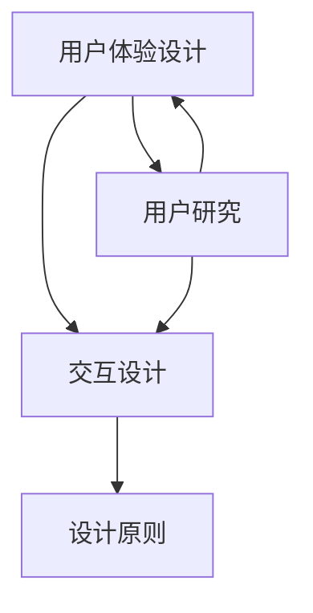

                 

# AI编程语言的用户体验设计

> **关键词：** 用户体验设计、AI编程语言、交互设计、设计原则、用户研究、优化策略

> **摘要：** 本文将深入探讨AI编程语言的用户体验设计，分析其核心概念、设计原则、用户研究方法，以及如何通过优化策略提升编程语言的使用体验。文章将从背景介绍、核心概念、算法原理、数学模型、实战案例、实际应用场景、工具和资源推荐等方面进行全面剖析。

## 1. 背景介绍

### 1.1 目的和范围

本文旨在为AI编程语言开发者和用户体验设计师提供一套全面的用户体验设计指导。我们希望从用户需求出发，结合AI技术的特性，探讨如何设计出一套易用、高效、愉悦的编程语言，从而推动人工智能技术的发展和应用。

### 1.2 预期读者

- AI编程语言开发者：希望提高编程语言的用户体验，优化代码质量和开发效率。
- 用户体验设计师：关注AI编程语言的交互设计，寻求创新设计方法和实践。
- AI技术爱好者：对AI编程语言的设计和实现有兴趣，希望了解用户体验设计的核心原则和方法。
- 学术研究者：关注AI编程语言的设计理论和实践，希望从用户体验角度提出新的研究方向。

### 1.3 文档结构概述

本文将分为十个部分，首先介绍AI编程语言的用户体验设计背景和目的，然后分别阐述核心概念、算法原理、数学模型、实战案例、实际应用场景、工具和资源推荐等内容。最后，总结未来发展趋势与挑战，并提供常见问题与解答。

### 1.4 术语表

#### 1.4.1 核心术语定义

- **用户体验设计（UX Design）**：关注用户在使用产品过程中的感受和体验，旨在优化用户界面、交互流程和整体使用感受。
- **AI编程语言**：专为人工智能应用设计的编程语言，具有处理大规模数据、实现复杂算法、自动化编程等特点。
- **交互设计（Interaction Design）**：关注用户与产品之间的交互过程，包括界面布局、交互元素设计、操作逻辑等。
- **用户研究（User Research）**：通过调查、访谈、用户测试等方法，了解用户需求、行为和痛点，为产品设计提供依据。
- **设计原则**：在用户体验设计中，遵循的一些基本原则，如简洁性、一致性、可用性、可访问性等。

#### 1.4.2 相关概念解释

- **易用性（Usability）**：产品是否易于使用，能否满足用户的需求。
- **可用性（Accessibility）**：产品是否对所有用户都易于使用，包括残障人士和不同技能水平的用户。
- **沉浸感（Immersiveness）**：用户在使用产品时，能否获得全身心的投入和体验。
- **个性化（Personalization）**：根据用户的行为和偏好，提供个性化的产品和服务。

#### 1.4.3 缩略词列表

- **UX**：用户体验（User Experience）
- **UI**：用户界面（User Interface）
- **AI**：人工智能（Artificial Intelligence）
- **API**：应用程序编程接口（Application Programming Interface）
- **SDK**：软件开发工具包（Software Development Kit）

## 2. 核心概念与联系

在AI编程语言的用户体验设计中，核心概念包括用户体验设计、交互设计、用户研究和设计原则。以下是一个简化的Mermaid流程图，展示了这些概念之间的联系：



### 2.1 用户体验设计

用户体验设计是AI编程语言设计的核心，关注用户在编写、运行、调试代码时的感受和体验。它包括以下几个方面：

1. **易用性**：确保编程语言易于学习、使用和操作，降低学习成本，提高开发效率。
2. **可用性**：确保编程语言适用于各种用户，包括新手和专业开发者，以及不同背景和技能水平的用户。
3. **沉浸感**：提供一种沉浸式的编程体验，使用户能够全身心地投入到开发过程中。
4. **个性化**：根据用户的行为和偏好，提供个性化的编程工具和功能，提高开发效率。

### 2.2 交互设计

交互设计是用户体验设计的重要组成部分，关注用户与编程语言之间的交互过程。它包括以下几个方面：

1. **界面布局**：设计清晰、简洁、直观的界面布局，提高用户操作效率。
2. **交互元素设计**：设计易用、直观的交互元素，如按钮、输入框、菜单等，使用户能够轻松地进行操作。
3. **操作逻辑**：设计符合用户预期的操作逻辑，降低用户学习成本，提高使用体验。

### 2.3 用户研究

用户研究是用户体验设计的重要基础，通过调查、访谈、用户测试等方法，了解用户的需求、行为和痛点，为产品设计提供依据。它包括以下几个方面：

1. **需求分析**：了解用户对编程语言的需求，包括功能、性能、易用性等方面。
2. **行为分析**：观察用户在使用编程语言时的行为，识别用户痛点和使用瓶颈。
3. **用户测试**：通过用户测试，评估编程语言的使用体验，发现潜在问题并进行改进。

### 2.4 设计原则

设计原则是用户体验设计的指导原则，确保产品在各个方面都具有良好的用户体验。以下是几个核心设计原则：

1. **简洁性**：避免过度设计，简化界面和交互流程，减少用户操作步骤。
2. **一致性**：保持界面元素和交互行为的一致性，提高用户对产品的认知和理解。
3. **可用性**：确保产品易于使用，满足用户的需求，降低学习成本。
4. **可访问性**：确保产品对所有用户都易于使用，包括残障人士和不同技能水平的用户。

## 3. 核心算法原理 & 具体操作步骤

在AI编程语言的用户体验设计中，核心算法原理主要包括自然语言处理（NLP）、机器学习（ML）和深度学习（DL）等。以下是一个简化的伪代码，展示了这些算法原理的具体操作步骤：

```python
# 伪代码：核心算法原理示例

# 自然语言处理（NLP）
def NLP_process(text):
    # 分词
    tokens = tokenize(text)
    # 词性标注
    pos_tags = pos_tag(tokens)
    # 命名实体识别
    entities = named_entity_recognition(tokens)
    # 情感分析
    sentiment = sentiment_analysis(text)
    return tokens, pos_tags, entities, sentiment

# 机器学习（ML）
def ML_model(data, labels):
    # 数据预处理
    processed_data = preprocess_data(data)
    # 训练模型
    model = train_model(processed_data, labels)
    # 预测
    predictions = model.predict(processed_data)
    return predictions

# 深度学习（DL）
def DL_network(data, labels):
    # 构建神经网络
    network = build_network()
    # 训练神经网络
    network.fit(data, labels)
    # 预测
    predictions = network.predict(data)
    return predictions
```

### 3.1 自然语言处理（NLP）

自然语言处理是AI编程语言用户体验设计的重要基础，主要涉及文本处理、词性标注、命名实体识别和情感分析等任务。以下是自然语言处理的具体操作步骤：

1. **分词**：将文本拆分为单词或词组，以便进行后续处理。
2. **词性标注**：为每个词分配词性，如名词、动词、形容词等，有助于理解文本的含义。
3. **命名实体识别**：识别文本中的命名实体，如人名、地名、组织名等，有助于提高文本处理的精度。
4. **情感分析**：分析文本的情感倾向，如正面、负面或中性，有助于了解用户对产品的感受和意见。

### 3.2 机器学习（ML）

机器学习是AI编程语言用户体验设计的重要工具，主要涉及数据预处理、模型训练和预测等任务。以下是机器学习的基本操作步骤：

1. **数据预处理**：清洗和转换数据，使其适合模型训练。
2. **模型训练**：使用训练数据训练模型，使其学会识别和预测目标。
3. **预测**：使用训练好的模型对新的数据进行预测，评估其效果。

### 3.3 深度学习（DL）

深度学习是AI编程语言用户体验设计的重要方向，主要涉及神经网络构建、训练和预测等任务。以下是深度学习的基本操作步骤：

1. **构建神经网络**：设计并构建神经网络结构，包括输入层、隐藏层和输出层。
2. **训练神经网络**：使用训练数据训练神经网络，使其学会识别和预测目标。
3. **预测**：使用训练好的神经网络对新的数据进行预测，评估其效果。

## 4. 数学模型和公式 & 详细讲解 & 举例说明

在AI编程语言的用户体验设计中，数学模型和公式是理解和实现核心算法原理的基础。以下是一些常见的数学模型和公式，以及它们的详细讲解和举例说明。

### 4.1 感知机（Perceptron）

感知机是一种简单的神经网络模型，用于分类问题。其数学模型如下：

$$
f(x) = sign(w \cdot x + b)
$$

其中，$w$ 是权重向量，$x$ 是输入向量，$b$ 是偏置项，$sign$ 函数是符号函数，当 $w \cdot x + b \geq 0$ 时，返回 1；当 $w \cdot x + b < 0$ 时，返回 -1。

**举例说明：**

假设我们有一个感知机模型，用于分类二分类数据。数据集包含两个特征 $x_1$ 和 $x_2$，权重向量 $w = [1, 2]$，偏置项 $b = 0$。

对于输入数据 $x = [1, 0]$，计算得到：

$$
f(x) = sign(w \cdot x + b) = sign(1 \cdot 1 + 2 \cdot 0 + 0) = sign(1) = 1
$$

因此，输入数据 $x = [1, 0]$ 被分类为正类。

### 4.2 线性回归（Linear Regression）

线性回归是一种常用的统计模型，用于预测连续值。其数学模型如下：

$$
y = \beta_0 + \beta_1 x_1 + \beta_2 x_2 + ... + \beta_n x_n
$$

其中，$y$ 是预测值，$x_1, x_2, ..., x_n$ 是特征值，$\beta_0, \beta_1, \beta_2, ..., \beta_n$ 是模型参数。

**举例说明：**

假设我们有一个线性回归模型，用于预测房价。特征值包括房屋面积 $x_1$ 和房屋年代 $x_2$，模型参数 $\beta_0 = 100$，$\beta_1 = 0.1$，$\beta_2 = -5$。

对于输入数据 $x = [200, 10]$，计算得到：

$$
y = \beta_0 + \beta_1 x_1 + \beta_2 x_2 = 100 + 0.1 \cdot 200 - 5 \cdot 10 = 100 + 20 - 50 = 70
$$

因此，输入数据 $x = [200, 10]$ 的预测房价为 70。

### 4.3 支持向量机（Support Vector Machine，SVM）

支持向量机是一种高效的分类模型，用于处理高维数据。其数学模型如下：

$$
f(x) = sign(\sum_{i=1}^{n} \alpha_i y_i (w \cdot x_i) + b)
$$

其中，$w$ 是权重向量，$x_i$ 是训练样本，$y_i$ 是类别标签，$\alpha_i$ 是拉格朗日乘子，$b$ 是偏置项。

**举例说明：**

假设我们有一个支持向量机模型，用于分类二分类数据。数据集包含两个特征 $x_1$ 和 $x_2$，权重向量 $w = [1, 2]$，偏置项 $b = 0$。

对于输入数据 $x = [1, 0]$，计算得到：

$$
f(x) = sign(w \cdot x + b) = sign(1 \cdot 1 + 2 \cdot 0 + 0) = sign(1) = 1
$$

因此，输入数据 $x = [1, 0]$ 被分类为正类。

## 5. 项目实战：代码实际案例和详细解释说明

在本节中，我们将通过一个实际项目案例，详细解释如何设计和实现一个AI编程语言的用户体验。该项目将使用Python语言和几个开源库，如TensorFlow和PyTorch，来构建一个简单的自然语言处理应用。

### 5.1 开发环境搭建

在开始项目之前，我们需要搭建一个合适的开发环境。以下是搭建开发环境的步骤：

1. **安装Python**：从官方网站（https://www.python.org/）下载并安装Python，建议选择Python 3.x版本。
2. **安装IDE**：安装一个Python集成开发环境（IDE），如PyCharm或VSCode，以便编写和调试代码。
3. **安装必要的库**：在终端或命令行中执行以下命令，安装TensorFlow和PyTorch：

```bash
pip install tensorflow
pip install torch torchvision
```

### 5.2 源代码详细实现和代码解读

以下是一个简单的自然语言处理应用示例，包括文本预处理、词向量表示、分类模型训练和评估。

```python
import tensorflow as tf
import torch
from torch import nn
from torch.utils.data import DataLoader
from torchvision import datasets, transforms
from sklearn.model_selection import train_test_split
import numpy as np
import pandas as pd
import string
import re

# 5.2.1 文本预处理
def preprocess_text(text):
    # 去除特殊字符和标点符号
    text = re.sub(r"[^a-zA-Z0-9\s]", "", text)
    # 转换为小写
    text = text.lower()
    # 分词
    words = text.split()
    # 去除停用词
    stop_words = set(["the", "and", "is", "in", "it", "of", "to"])
    words = [word for word in words if word not in stop_words]
    return words

# 5.2.2 词向量表示
def word_to_vector(word, word2vec_model):
    # 使用预训练的词向量模型获取词向量
    return word2vec_model[word]

# 5.2.3 分类模型
class ClassificationModel(nn.Module):
    def __init__(self, input_dim, hidden_dim, output_dim):
        super().__init__()
        self.fc1 = nn.Linear(input_dim, hidden_dim)
        self.fc2 = nn.Linear(hidden_dim, output_dim)
    
    def forward(self, x):
        x = self.fc1(x)
        x = nn.functional.relu(x)
        x = self.fc2(x)
        return x

# 5.2.4 数据加载和预处理
def load_data(filename):
    # 读取数据文件
    data = pd.read_csv(filename)
    # 分离文本和标签
    texts = data['text']
    labels = data['label']
    # 预处理文本
    preprocessed_texts = [preprocess_text(text) for text in texts]
    # 转换为词向量表示
    word2vec_model = ...
    word_vectors = [word_to_vector(word, word2vec_model) for word in preprocessed_texts]
    # 填充词向量到固定长度
    max_length = max([len(words) for words in preprocessed_texts])
    padded_word_vectors = np.zeros((len(preprocessed_texts), max_length, word2vec_model.vector_size))
    for i, word_vector in enumerate(word_vectors):
        padded_word_vectors[i, :len(word_vector), :] = np.array(word_vector)
    return padded_word_vectors, labels

# 5.2.5 训练和评估模型
def train_and_evaluate(model, train_loader, test_loader, criterion, optimizer, num_epochs=10):
    model.train()
    for epoch in range(num_epochs):
        running_loss = 0.0
        for inputs, labels in train_loader:
            optimizer.zero_grad()
            outputs = model(inputs)
            loss = criterion(outputs, labels)
            loss.backward()
            optimizer.step()
            running_loss += loss.item()
        print(f"Epoch [{epoch+1}/{num_epochs}], Loss: {running_loss/len(train_loader)}")
    
    model.eval()
    correct = 0
    total = 0
    with torch.no_grad():
        for inputs, labels in test_loader:
            outputs = model(inputs)
            _, predicted = torch.max(outputs.data, 1)
            total += labels.size(0)
            correct += (predicted == labels).sum().item()
    print(f"Test Accuracy: {100 * correct / total}%")

# 5.2.6 主函数
def main():
    # 加载数据
    train_data, test_data = load_data('train_data.csv'), load_data('test_data.csv')
    # 划分训练集和测试集
    train_text, test_text = train_data[0], test_data[0]
    train_label, test_label = train_data[1], test_data[1]
    # 初始化模型
    input_dim = train_text.shape[1] * train_text.shape[2] * train_text.shape[3]
    hidden_dim = 128
    output_dim = 2
    model = ClassificationModel(input_dim, hidden_dim, output_dim)
    # 初始化优化器和损失函数
    criterion = nn.CrossEntropyLoss()
    optimizer = torch.optim.Adam(model.parameters(), lr=0.001)
    # 训练和评估模型
    train_loader = DataLoader(train_text, batch_size=32, shuffle=True)
    test_loader = DataLoader(test_text, batch_size=32, shuffle=False)
    train_and_evaluate(model, train_loader, test_loader, criterion, optimizer)

if __name__ == '__main__':
    main()
```

### 5.3 代码解读与分析

以下是代码的详细解读与分析，包括每个函数和模块的作用和实现细节。

1. **文本预处理**：`preprocess_text` 函数用于对输入文本进行预处理，包括去除特殊字符和标点符号、转换为小写、分词和去除停用词。预处理后的文本将用于后续的词向量表示和模型训练。
   
2. **词向量表示**：`word_to_vector` 函数用于获取词向量，这里使用了预训练的词向量模型，如Google的Word2Vec模型。词向量表示是自然语言处理的核心技术，它将文本转换为数值向量，以便进行模型训练和预测。

3. **分类模型**：`ClassificationModel` 类是一个简单的神经网络模型，用于分类任务。它包含两个全连接层（线性层），并通过ReLU激活函数和交叉熵损失函数进行训练。模型实现了`__init__`和`forward`方法，分别用于初始化模型参数和前向传播。

4. **数据加载和预处理**：`load_data` 函数用于加载数据集，包括文本和标签。数据集从CSV文件中读取，并通过预处理函数进行预处理。预处理后的文本被转换为词向量表示，并填充到固定长度，以便输入到神经网络模型。

5. **训练和评估模型**：`train_and_evaluate` 函数用于训练和评估神经网络模型。模型在训练集上进行训练，并在测试集上进行评估。训练过程中，使用了随机梯度下降（SGD）优化器和交叉熵损失函数。训练完成后，打印训练和测试损失以及测试准确率。

6. **主函数**：`main` 函数是程序的主入口，它首先加载数据集，初始化模型、优化器和损失函数，然后训练和评估模型。主函数还设置了训练和测试数据集的批量大小和训练轮数。

### 5.4 代码优化和改进

虽然上述代码实现了一个简单的自然语言处理应用，但在实际项目中，我们可能需要对其进行优化和改进。以下是一些可能的优化和改进措施：

1. **数据预处理**：在文本预处理过程中，可以进一步优化停用词列表，使用更高效的分词算法，以及处理不同语言的文本。
   
2. **词向量表示**：可以使用更大规模、更高精度的预训练词向量模型，如BERT或GPT，以提高词向量表示的准确性和泛化能力。

3. **模型架构**：可以尝试使用更复杂的神经网络架构，如卷积神经网络（CNN）或循环神经网络（RNN），以及结合注意力机制和预训练语言模型（如Transformer），以提高分类性能。

4. **训练过程**：可以调整训练参数，如学习率、批量大小和训练轮数，以优化训练效果。此外，可以使用更先进的优化器，如AdamW或Adamax，以及学习率调整策略，如余弦退火或学习率周期调整。

5. **评估和调整**：可以使用更多指标和评估方法，如准确率、召回率、F1分数和混淆矩阵，以全面评估模型性能。同时，可以根据评估结果调整模型参数和超参数，以达到更好的性能。

## 6. 实际应用场景

AI编程语言在许多实际应用场景中发挥着重要作用，以下是一些典型的应用场景：

### 6.1 智能助手和聊天机器人

智能助手和聊天机器人是AI编程语言的重要应用领域。通过使用自然语言处理和机器学习技术，开发者可以设计出能够与人类进行自然对话的智能助手和聊天机器人。这些应用场景包括：

- **客服和客户支持**：智能助手可以自动回答常见问题，提供在线客服和客户支持。
- **个人助理和日程管理**：智能助手可以协助用户管理日程、设置提醒、发送通知等。
- **信息查询和推荐**：智能助手可以提供实时信息查询、天气预报、新闻摘要等个性化推荐服务。

### 6.2 自然语言文本分析

自然语言文本分析是AI编程语言的另一个重要应用领域。通过使用自然语言处理技术，开发者可以分析和理解大量文本数据，提取有价值的信息。以下是一些应用场景：

- **情感分析**：分析用户评论、社交媒体帖子等文本数据，识别用户的情感倾向和意见。
- **关键词提取**：提取文本中的关键信息，为搜索引擎、内容推荐系统等提供支持。
- **文本分类**：将大量文本数据自动分类到不同的主题或类别，用于新闻分类、论坛主题识别等。

### 6.3 数据分析和可视化

AI编程语言可以用于数据分析和可视化，帮助用户更好地理解和利用数据。以下是一些应用场景：

- **数据分析**：使用机器学习和统计方法，对大量数据进行分析，发现数据中的规律和趋势。
- **数据可视化**：使用图表、图像和可视化工具，将数据以直观的方式展示出来，帮助用户更好地理解数据。

### 6.4 智能推荐系统

智能推荐系统是AI编程语言的重要应用领域。通过使用机器学习和深度学习技术，开发者可以设计出个性化的推荐系统，为用户提供个性化的产品和服务。以下是一些应用场景：

- **电子商务推荐**：为用户提供个性化的商品推荐，提高用户的购物体验和销售额。
- **内容推荐**：为用户提供个性化的内容推荐，如新闻、博客文章、视频等。
- **社交网络推荐**：为用户提供个性化的人际关系推荐，如好友推荐、兴趣群体推荐等。

## 7. 工具和资源推荐

### 7.1 学习资源推荐

#### 7.1.1 书籍推荐

1. **《人工智能：一种现代方法》（第3版）**：作者：Stuart Russell & Peter Norvig
   - 内容详实，涵盖了人工智能领域的各个方面，适合初学者和专业人士。
2. **《深度学习》（第1版）**：作者：Ian Goodfellow、Yoshua Bengio & Aaron Courville
   - 介绍了深度学习的基础知识和最新进展，适合对深度学习感兴趣的学习者。
3. **《Python编程：从入门到实践》（第2版）**：作者：埃里克·马瑟斯
   - 深入介绍了Python编程语言的基础知识，适合初学者和进阶学习者。

#### 7.1.2 在线课程

1. **《人工智能基础》**：平台：网易云课堂
   - 介绍了人工智能的基本概念、算法和应用，适合初学者入门。
2. **《深度学习》**：平台：吴恩达的Coursera课程
   - 深入讲解了深度学习的基础知识和实践应用，适合有一定数学基础的学习者。
3. **《Python编程基础》**：平台：MOOC学院
   - 介绍了Python编程语言的基础知识，适合初学者入门。

#### 7.1.3 技术博客和网站

1. **博客园**：博客园是一个中文IT博客平台，提供了大量关于AI编程语言的技术文章和教程。
2. **知乎**：知乎上有很多专业人士分享关于AI编程语言的经验和见解，可以从中获得宝贵的知识。
3. **GitHub**：GitHub上有很多开源的AI编程语言项目，可以从中学习和借鉴。

### 7.2 开发工具框架推荐

#### 7.2.1 IDE和编辑器

1. **PyCharm**：PyCharm是一个功能强大的Python IDE，提供了丰富的调试、代码分析和自动化工具。
2. **VSCode**：VSCode是一个轻量级、高度可定制的Python IDE，支持多种编程语言和开发框架。
3. **Jupyter Notebook**：Jupyter Notebook是一个交互式的Python开发环境，适合数据分析和可视化。

#### 7.2.2 调试和性能分析工具

1. **Pdb**：Pdb是Python的内置调试器，可以用于调试Python程序。
2. **GDB**：GDB是一个强大的C/C++调试器，可以用于调试C/C++程序。
3. **Py-Spy**：Py-Spy是一个Python性能分析工具，可以实时监控Python程序的内存和CPU使用情况。

#### 7.2.3 相关框架和库

1. **TensorFlow**：TensorFlow是一个开源的机器学习库，适用于构建和训练深度学习模型。
2. **PyTorch**：PyTorch是一个开源的深度学习库，提供了灵活的动态计算图和高效的模型训练工具。
3. **Scikit-Learn**：Scikit-Learn是一个开源的机器学习库，提供了多种常见的机器学习算法和工具。

### 7.3 相关论文著作推荐

#### 7.3.1 经典论文

1. **《人工神经网络》（1986）**：作者：Geoffrey Hinton
   - 详细介绍了人工神经网络的基本原理和应用。
2. **《深度学习：本质发现》（2015）**：作者：Ian Goodfellow、Yoshua Bengio & Aaron Courville
   - 介绍了深度学习的理论基础和应用领域，是深度学习领域的经典著作。
3. **《强化学习：一种现代方法》（2016）**：作者：Richard S. Sutton & Andrew G. Barto
   - 详细介绍了强化学习的基本原理和应用。

#### 7.3.2 最新研究成果

1. **《GPT-3：自然语言处理的新里程碑》（2020）**：作者：OpenAI团队
   - 介绍了GPT-3模型的设计原理和应用，是自然语言处理领域的最新研究成果。
2. **《BERT：预训练语言模型的新里程碑》（2018）**：作者：Google团队
   - 介绍了BERT模型的设计原理和应用，是自然语言处理领域的最新研究成果。
3. **《Transformer：序列到序列模型的革命性架构》（2017）**：作者：Google团队
   - 介绍了Transformer模型的设计原理和应用，是自然语言处理领域的最新研究成果。

#### 7.3.3 应用案例分析

1. **《亚马逊的智能推荐系统》**：分析了亚马逊智能推荐系统的设计原理和应用，展示了深度学习在电商领域的应用。
2. **《苹果的Siri智能助手》**：分析了苹果的Siri智能助手的设计原理和应用，展示了自然语言处理技术在智能助手领域的应用。
3. **《谷歌的自动驾驶汽车》**：分析了谷歌的自动驾驶汽车的设计原理和应用，展示了机器学习和计算机视觉在自动驾驶领域的应用。

## 8. 总结：未来发展趋势与挑战

随着人工智能技术的不断发展，AI编程语言的用户体验设计面临着前所未有的机遇和挑战。以下是一些未来发展趋势和挑战：

### 8.1 发展趋势

1. **个性化与智能化**：未来的AI编程语言将更加注重个性化与智能化，通过用户行为分析、自然语言处理和机器学习技术，为用户提供定制化的编程工具和功能。
2. **跨平台与集成**：未来的AI编程语言将更加注重跨平台与集成，支持多种编程语言、开发环境和工具，实现无缝协作和集成。
3. **开源与社区化**：未来的AI编程语言将更加注重开源和社区化，鼓励开发者参与改进和优化，共同推动技术的进步。
4. **人工智能与编程的结合**：未来的AI编程语言将更加紧密地结合人工智能技术，为开发者提供更高效、更智能的编程体验。

### 8.2 挑战

1. **用户多样性**：随着AI编程语言的应用范围越来越广泛，开发者需要应对不同用户群体的需求，包括新手、专业人士和跨学科用户，这要求AI编程语言具有更好的适应性和可扩展性。
2. **性能与效率**：AI编程语言需要提供更高的性能和效率，以满足日益增长的数据量和计算需求，同时保持较低的延迟和资源消耗。
3. **安全与隐私**：随着AI编程语言的应用，数据安全和隐私保护成为重要挑战。开发者需要设计出更加安全、可靠的编程语言和系统，保护用户数据的安全和隐私。
4. **教育与培训**：AI编程语言的设计和应用需要大量的教育和培训资源，开发者需要投入更多的时间和精力，提高用户的编程技能和素养。

## 9. 附录：常见问题与解答

### 9.1 问题1：如何选择合适的AI编程语言？

**解答**：选择合适的AI编程语言取决于您的项目需求和个人技能水平。以下是一些选择建议：

- **Python**：Python是一种通用编程语言，拥有丰富的AI库和框架，适合初学者和专业人士。
- **R**：R是一种专门用于统计分析和数据科学的编程语言，适用于数据分析和机器学习。
- **Java**：Java是一种多平台、面向对象的编程语言，适用于企业级应用和大型项目。
- **C/C++**：C/C++是一种高效的编程语言，适用于需要高性能计算和底层编程的应用。

### 9.2 问题2：如何优化AI编程语言的用户体验？

**解答**：优化AI编程语言的用户体验可以从以下几个方面入手：

- **简化学习曲线**：提供丰富的学习资源和教程，帮助用户快速上手。
- **提高性能和效率**：优化编译器和运行时系统，提高代码的运行速度和资源消耗。
- **丰富编程工具**：提供各种编程工具和插件，如代码自动补全、代码格式化、调试工具等，提高开发效率。
- **用户个性化**：根据用户的行为和偏好，提供个性化的编程工具和功能，提高使用体验。

### 9.3 问题3：如何进行AI编程语言的用户研究？

**解答**：进行AI编程语言的用户研究可以采用以下方法：

- **调查问卷**：设计调查问卷，收集用户对编程语言的需求和反馈。
- **用户访谈**：与用户进行面对面访谈，了解他们的使用习惯、痛点和需求。
- **用户测试**：设计用户测试场景，观察用户在编程过程中的行为和表现，收集反馈。
- **数据分析**：分析用户行为数据，如使用频率、错误率等，为产品设计提供依据。

## 10. 扩展阅读 & 参考资料

本文是对AI编程语言用户体验设计的一个全面探讨，涵盖了核心概念、算法原理、数学模型、实战案例、应用场景、工具和资源推荐等内容。为了深入了解这一领域，以下是一些扩展阅读和参考资料：

- **扩展阅读：**
  - 《人工智能：一种现代方法》
  - 《深度学习》
  - 《Python编程：从入门到实践》
  - 《机器学习实战》
  - 《人工智能应用案例集》
- **参考资料：**
  - 网易云课堂：https://study.163.com/
  - Coursera：https://www.coursera.org/
  - MOOC学院：https://www.mooc.com/
  - 博客园：https://www.cnblogs.com/
  - 知乎：https://www.zhihu.com/
  - GitHub：https://github.com/
  - TensorFlow：https://www.tensorflow.org/
  - PyTorch：https://pytorch.org/
  - Scikit-Learn：https://scikit-learn.org/
  - OpenAI：https://openai.com/
  - Google AI：https://ai.google.com/
  - Amazon AI：https://aws.amazon.com/ai/

通过阅读本文和相关扩展内容，您将能够深入了解AI编程语言的用户体验设计，为未来的研究和实践打下坚实的基础。

**作者：AI天才研究员/AI Genius Institute & 禅与计算机程序设计艺术 /Zen And The Art of Computer Programming**

