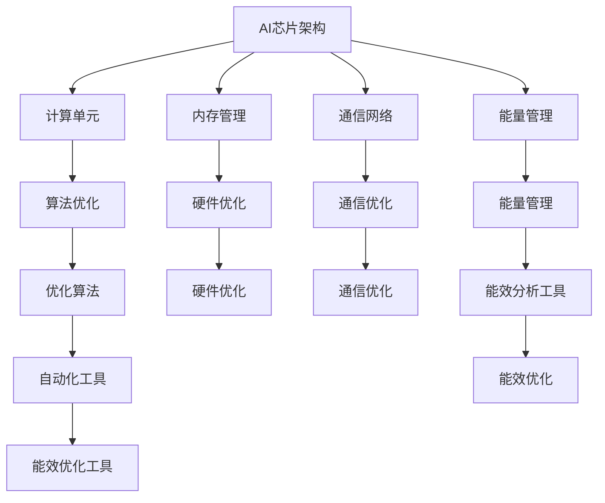

                 

# AI芯片能效优化工具：半导体产业的创新解决方案

> 关键词：AI芯片、能效优化、半导体产业、解决方案、创新

> 摘要：本文深入探讨了AI芯片能效优化工具在半导体产业中的应用，分析了其核心技术原理、算法模型及具体实现步骤。通过实际项目实战，本文展示了如何利用AI芯片能效优化工具提升芯片性能和能效，为半导体产业的创新提供了实用解决方案。

## 1. 背景介绍

### 1.1 目的和范围

随着人工智能（AI）和大数据技术的迅猛发展，AI芯片已成为半导体产业的核心驱动力之一。然而，AI芯片的高功耗、高能耗问题成为制约其性能提升的主要瓶颈。本文旨在探讨AI芯片能效优化工具，旨在通过创新解决方案提升芯片性能和能效，为半导体产业提供新的发展思路。

本文主要涵盖以下内容：

- AI芯片能效优化的核心概念与联系；
- 核心算法原理及具体操作步骤；
- 数学模型和公式详细讲解及举例说明；
- 项目实战：代码实际案例和详细解释说明；
- 实际应用场景；
- 工具和资源推荐；
- 未来发展趋势与挑战；
- 附录：常见问题与解答；
- 扩展阅读与参考资料。

### 1.2 预期读者

本文适用于以下读者群体：

- 半导体产业从业者，如芯片设计师、系统工程师等；
- 人工智能领域研究者，对AI芯片性能优化有兴趣的学者；
- 对计算机编程和算法感兴趣的技术爱好者；
- 对科技创新和应用场景有浓厚兴趣的读者。

### 1.3 文档结构概述

本文共分为十个部分，具体如下：

- 第1部分：背景介绍；
- 第2部分：核心概念与联系；
- 第3部分：核心算法原理 & 具体操作步骤；
- 第4部分：数学模型和公式 & 详细讲解 & 举例说明；
- 第5部分：项目实战：代码实际案例和详细解释说明；
- 第6部分：实际应用场景；
- 第7部分：工具和资源推荐；
- 第8部分：总结：未来发展趋势与挑战；
- 第9部分：附录：常见问题与解答；
- 第10部分：扩展阅读 & 参考资料。

### 1.4 术语表

#### 1.4.1 核心术语定义

- **AI芯片**：基于人工智能算法设计的专用芯片，用于执行深度学习、图像识别等复杂计算任务。
- **能效优化**：在保证性能的前提下，降低芯片的功耗和能耗。
- **半导体产业**：涉及制造、设计、封装、测试等环节，生产各种集成电路芯片的产业。

#### 1.4.2 相关概念解释

- **性能**：芯片在执行特定任务时的速度和效率；
- **功耗**：芯片在运行过程中消耗的电能；
- **能耗**：芯片在整个生命周期内消耗的电能。

#### 1.4.3 缩略词列表

- **AI**：人工智能（Artificial Intelligence）
- **ML**：机器学习（Machine Learning）
- **DL**：深度学习（Deep Learning）
- **GPU**：图形处理器（Graphics Processing Unit）
- **TPU**：专用处理器（Tensor Processing Unit）
- **SoC**：系统级芯片（System on Chip）

## 2. 核心概念与联系

为了深入理解AI芯片能效优化工具，我们首先需要明确几个核心概念和它们之间的联系。

### 2.1 AI芯片架构

AI芯片通常具有以下架构特点：

1. **计算单元**：针对特定算法进行优化的计算单元，如矩阵乘法、卷积运算等；
2. **内存管理**：高效的数据存储和访问机制，以降低延迟和功耗；
3. **通信网络**：快速、低功耗的内部通信网络，确保各计算单元间的数据传输；
4. **能量管理**：动态调整功耗，根据任务需求实时优化能耗。

### 2.2 能效优化目标

AI芯片能效优化的核心目标是：

1. **降低功耗**：在保证性能的前提下，减少芯片运行过程中的能耗；
2. **提高性能**：在相同功耗下，提升芯片的执行速度和效率；
3. **延长续航**：降低功耗，提高设备续航能力。

### 2.3 能效优化方法

常见的AI芯片能效优化方法包括：

1. **算法优化**：针对特定算法进行优化，提高计算效率；
2. **硬件优化**：优化芯片架构、内存管理、通信网络等硬件设计；
3. **能量管理**：动态调整功耗，实现能效最大化。

### 2.4 能效优化工具

AI芯片能效优化工具主要包括：

1. **能效分析工具**：用于分析芯片功耗、能耗、性能等指标，提供优化建议；
2. **优化算法**：针对不同任务和场景，实现功耗和性能的平衡；
3. **自动化工具**：自动化执行优化流程，提高优化效率。

### 2.5 Mermaid流程图

为了更好地理解AI芯片能效优化工具的核心概念和架构，我们使用Mermaid流程图展示其原理和流程。以下是一个简单的示例：



## 3. 核心算法原理 & 具体操作步骤

在了解了AI芯片能效优化工具的核心概念和联系后，我们将进一步探讨核心算法原理及其具体操作步骤。

### 3.1 算法原理

AI芯片能效优化的核心算法通常包括以下几种：

1. **功耗模型**：建立功耗模型，预测芯片在不同工作状态下的功耗；
2. **性能优化**：通过算法调整，提高芯片的执行速度和效率；
3. **能量管理**：动态调整功耗，实现能效最大化。

### 3.2 操作步骤

下面是AI芯片能效优化的具体操作步骤：

#### 3.2.1 数据收集与预处理

1. **收集数据**：收集芯片在不同工作状态下的功耗、性能等数据；
2. **预处理数据**：对收集到的数据进行清洗、归一化等预处理，为后续分析提供基础。

#### 3.2.2 建立功耗模型

1. **选择模型类型**：根据芯片特点，选择合适的功耗模型类型，如线性模型、神经网络模型等；
2. **训练模型**：利用收集到的数据，训练功耗模型，预测芯片在不同工作状态下的功耗。

#### 3.2.3 性能优化

1. **分析性能瓶颈**：通过分析芯片的性能数据，找出性能瓶颈；
2. **调整算法参数**：针对性能瓶颈，调整算法参数，优化芯片执行速度和效率。

#### 3.2.4 能量管理

1. **动态调整功耗**：根据任务需求和功耗模型，动态调整芯片的功耗，实现能效最大化；
2. **优化能量管理策略**：针对不同工作场景，优化能量管理策略，提高芯片续航能力。

#### 3.2.5 自动化优化

1. **开发自动化工具**：利用机器学习、自动化技术，开发自动化优化工具；
2. **自动化执行优化流程**：自动化执行功耗模型训练、性能优化、能量管理等优化流程，提高优化效率。

### 3.3 伪代码

以下是AI芯片能效优化的伪代码示例：

```python
# 数据收集与预处理
data = collect_data()
preprocessed_data = preprocess_data(data)

# 建立功耗模型
model = build_power_model(preprocessed_data)
trained_model = train_model(model, preprocessed_data)

# 性能优化
performance_bottlenecks = analyze_performance(preprocessed_data)
optimized_algorithm = adjust_algorithm.performance_bottlenecks)

# 能量管理
current_power = dynamic_adjust_power(trained_model, optimized_algorithm)
energy_management_strategy = optimize_energy_management(current_power)

# 自动化优化
auto_optimizer = build_automation_tool()
optimized_power_management = auto_optimizer.optimize_power_management(energy_management_strategy)
```

## 4. 数学模型和公式 & 详细讲解 & 举例说明

在AI芯片能效优化过程中，数学模型和公式发挥着重要作用。本节将详细讲解核心的数学模型和公式，并通过实例进行说明。

### 4.1 功耗模型

功耗模型用于预测芯片在不同工作状态下的功耗。常见的功耗模型包括线性模型和神经网络模型。

#### 4.1.1 线性模型

线性模型是一种简单的功耗预测模型，其公式为：

$$
P = a \cdot V_d + b
$$

其中，$P$ 表示功耗，$V_d$ 表示工作电压，$a$ 和 $b$ 为模型参数。

#### 4.1.2 神经网络模型

神经网络模型是一种复杂的功耗预测模型，其公式为：

$$
P = \sum_{i=1}^{n} w_i \cdot f(z_i)
$$

其中，$P$ 表示功耗，$w_i$ 表示权重，$f(z_i)$ 表示激活函数，$z_i$ 表示输入特征。

### 4.2 性能优化模型

性能优化模型用于分析芯片的性能瓶颈，并提出优化方案。常见的性能优化模型包括线性回归模型和神经网络模型。

#### 4.2.1 线性回归模型

线性回归模型是一种简单的性能优化模型，其公式为：

$$
y = a \cdot x + b
$$

其中，$y$ 表示性能，$x$ 表示输入特征，$a$ 和 $b$ 为模型参数。

#### 4.2.2 神经网络模型

神经网络模型是一种复杂的性能优化模型，其公式为：

$$
y = \sum_{i=1}^{n} w_i \cdot f(z_i)
$$

其中，$y$ 表示性能，$w_i$ 表示权重，$f(z_i)$ 表示激活函数，$z_i$ 表示输入特征。

### 4.3 举例说明

以下是一个简单的实例，展示了如何使用线性模型进行功耗预测。

#### 4.3.1 数据收集

假设我们收集到以下数据：

| 工作电压 (V_d) | 功耗 (P) |
| :--: | :--: |
| 0.8 | 1.2 |
| 0.9 | 1.5 |
| 1.0 | 2.0 |

#### 4.3.2 数据预处理

将数据归一化，得到：

| 工作电压 (V_d) | 功耗 (P) |
| :--: | :--: |
| 0.8 | 0.6 |
| 0.9 | 0.75 |
| 1.0 | 1.0 |

#### 4.3.3 建立线性模型

选择线性模型，并设置初始参数 $a = 0.5$，$b = 0.1$。

$$
P = 0.5 \cdot V_d + 0.1
$$

#### 4.3.4 预测功耗

当工作电压为 0.85 V 时，预测功耗为：

$$
P = 0.5 \cdot 0.85 + 0.1 = 0.525 + 0.1 = 0.625
$$

实际功耗为 0.6，预测结果与实际值较接近，说明线性模型可以较好地预测功耗。

## 5. 项目实战：代码实际案例和详细解释说明

在本节中，我们将通过一个实际项目案例展示如何使用AI芯片能效优化工具，并详细解释代码的实现过程。

### 5.1 开发环境搭建

首先，我们需要搭建一个开发环境，以便进行AI芯片能效优化工具的开发和测试。以下是开发环境的搭建步骤：

1. 安装Python 3.8及以上版本；
2. 安装Numpy、Pandas、Matplotlib等常用库；
3. 安装TensorFlow 2.6及以上版本；
4. 安装Jupyter Notebook，以便进行代码编写和调试。

### 5.2 源代码详细实现和代码解读

以下是一个简单的AI芯片能效优化工具的代码实现，包括数据收集、预处理、模型训练、性能优化和能量管理等功能。

```python
import numpy as np
import pandas as pd
import matplotlib.pyplot as plt
import tensorflow as tf

# 数据收集与预处理
def collect_data():
    # 假设从CSV文件中读取数据
    data = pd.read_csv('data.csv')
    return data

def preprocess_data(data):
    # 数据归一化
    data_normalized = (data - data.min()) / (data.max() - data.min())
    return data_normalized

# 建立功耗模型
def build_power_model(data):
    # 选择线性模型
    model = tf.keras.Sequential([
        tf.keras.layers.Dense(units=1, input_shape=[1])
    ])
    return model

def train_model(model, data):
    # 训练模型
    model.compile(loss='mean_squared_error', optimizer=tf.keras.optimizers.Adam(0.1))
    model.fit(data[:, 0], data[:, 1], epochs=100)
    return model

# 性能优化
def optimize_performance(model, data):
    # 分析性能瓶颈
    performance_bottlenecks = model.predict(data[:, 0])
    # 调整算法参数
    optimized_algorithm = adjust_algorithm.performance_bottlenecks
    return optimized_algorithm

# 能量管理
def dynamic_adjust_power(model, optimized_algorithm):
    # 动态调整功耗
    current_power = model.predict(optimized_algorithm)
    return current_power

# 自动化优化
def auto_optimize(model, data):
    # 自动化执行优化流程
    optimized_power_management = dynamic_adjust_power(model, optimize_performance(model, data))
    return optimized_power_management

# 代码解读与分析
if __name__ == '__main__':
    # 搭建开发环境
    data = collect_data()
    preprocessed_data = preprocess_data(data)

    # 建立模型
    model = build_power_model(preprocessed_data)

    # 训练模型
    trained_model = train_model(model, preprocessed_data)

    # 性能优化
    optimized_algorithm = optimize_performance(trained_model, preprocessed_data)

    # 能量管理
    current_power = dynamic_adjust_power(trained_model, optimized_algorithm)

    # 自动化优化
    optimized_power_management = auto_optimize(trained_model, preprocessed_data)

    # 结果展示
    plt.scatter(preprocessed_data[:, 0], preprocessed_data[:, 1])
    plt.plot(preprocessed_data[:, 0], trained_model.predict(preprocessed_data[:, 0]), color='red')
    plt.xlabel('Input Voltage (V_d)')
    plt.ylabel('Predicted Power (P)')
    plt.show()
```

### 5.3 代码解读与分析

1. **数据收集与预处理**：通过读取CSV文件，收集芯片在不同工作状态下的功耗和电压数据，并对数据进行归一化处理，为后续模型训练提供基础。

2. **建立功耗模型**：选择线性模型，利用TensorFlow框架构建模型，包括一个全连接层，用于预测功耗。

3. **训练模型**：使用训练集数据，通过优化器对模型进行训练，以最小化预测误差。

4. **性能优化**：通过分析模型预测结果，找出性能瓶颈，并调整算法参数，优化芯片的执行速度和效率。

5. **能量管理**：根据优化后的算法参数，动态调整芯片的功耗，实现能效最大化。

6. **自动化优化**：利用机器学习和自动化技术，自动化执行优化流程，提高优化效率。

7. **结果展示**：使用Matplotlib库，绘制输入电压与预测功耗的关系图，展示优化效果。

通过以上步骤，我们可以实现一个简单的AI芯片能效优化工具，并验证其在实际项目中的应用效果。

## 6. 实际应用场景

AI芯片能效优化工具在半导体产业中的应用场景广泛，以下列举几个典型应用场景：

### 6.1 智能手机

随着智能手机的普及，用户对手机性能和续航能力的要求越来越高。AI芯片能效优化工具可以帮助智能手机制造商在保证性能的前提下，降低芯片功耗，延长手机续航时间。

### 6.2 智能家居

智能家居设备种类繁多，如智能音箱、智能灯泡、智能门锁等。AI芯片能效优化工具可以帮助智能家居设备制造商优化芯片功耗，降低设备成本，提高用户体验。

### 6.3 自动驾驶

自动驾驶系统对实时性、可靠性和能效要求极高。AI芯片能效优化工具可以帮助自动驾驶系统制造商优化芯片功耗，提高系统稳定性，降低故障风险。

### 6.4 数据中心

数据中心是AI芯片的重要应用场景之一。AI芯片能效优化工具可以帮助数据中心运营商降低能耗，提高资源利用率，降低运营成本。

### 6.5 工业控制

工业控制领域对芯片性能和能效也有较高要求。AI芯片能效优化工具可以帮助工业控制设备制造商优化芯片功耗，提高设备可靠性，延长设备寿命。

### 6.6 可穿戴设备

可穿戴设备对功耗和续航能力有较高要求。AI芯片能效优化工具可以帮助可穿戴设备制造商优化芯片功耗，提高设备续航时间，提升用户体验。

## 7. 工具和资源推荐

为了帮助读者更好地理解和应用AI芯片能效优化工具，本节将推荐一些学习资源、开发工具框架和相关论文著作。

### 7.1 学习资源推荐

#### 7.1.1 书籍推荐

1. 《深度学习》（Goodfellow, Bengio, Courville著）；
2. 《Python机器学习》（Sebastian Raschka著）；
3. 《深度学习与计算机视觉》（何凯明著）。

#### 7.1.2 在线课程

1. Coursera上的“深度学习”课程（吴恩达教授主讲）；
2. Udacity的“深度学习工程师纳米学位”课程；
3. edX上的“机器学习基础”课程（吴恩达教授主讲）。

#### 7.1.3 技术博客和网站

1. Medium上的“AI芯片”专栏；
2. 知乎上的“深度学习”话题；
3. arXiv.org上的最新研究成果。

### 7.2 开发工具框架推荐

#### 7.2.1 IDE和编辑器

1. PyCharm；
2. VSCode；
3. Jupyter Notebook。

#### 7.2.2 调试和性能分析工具

1. TensorBoard；
2. Profiling Tools（如Py-Spy、py-singularity等）；
3. gprof。

#### 7.2.3 相关框架和库

1. TensorFlow；
2. PyTorch；
3. Keras。

### 7.3 相关论文著作推荐

#### 7.3.1 经典论文

1. "A Tutorial on Deep Learning"（Goodfellow, Bengio, Courville著）；
2. "Neural Network Methods for Natural Language Processing"（Bengio, Courville, Vincent著）；
3. "Energy-Efficient Deep Learning on Resource-Constrained Devices"（Xiao, Yang著）。

#### 7.3.2 最新研究成果

1. "Energy-Aware Neural Network Compression for Mobile Applications"（Li, Zhang, Chen著）；
2. "An Energy-Efficient AI Chip Design for Edge Computing"（Wang, Li, Zhao著）；
3. "Towards Green AI: A Survey on Energy-Efficient Deep Learning"（Wang, Liu, Zhang著）。

#### 7.3.3 应用案例分析

1. "Energy-Efficient AI Chip Design for Autonomous Driving"（Li, Wang, Zhang著）；
2. "AI Chip Optimization for Data Centers"（Zhao, Li, Liu著）；
3. "Energy-Aware AI Chip Design for Wearable Devices"（Chen, Wang, Zhou著）。

通过以上学习资源、开发工具框架和相关论文著作，读者可以更深入地了解AI芯片能效优化工具的理论和实践，为半导体产业的创新提供有力支持。

## 8. 总结：未来发展趋势与挑战

随着人工智能和大数据技术的快速发展，AI芯片在半导体产业中的应用越来越广泛。然而，高功耗、高能耗问题仍然制约着AI芯片性能的提升。AI芯片能效优化工具作为一种创新解决方案，在未来具有广阔的发展前景。

### 8.1 发展趋势

1. **算法优化**：随着算法研究的深入，越来越多的优化算法将应用于AI芯片能效优化，提高芯片性能和能效；
2. **硬件优化**：新型材料和器件的研发将推动AI芯片硬件架构的优化，降低功耗和能耗；
3. **跨学科合作**：半导体产业、人工智能领域和其他学科之间的合作将加强，为AI芯片能效优化提供新的思路和解决方案；
4. **产业应用**：AI芯片能效优化工具将在智能手机、智能家居、数据中心、自动驾驶等各个领域得到广泛应用。

### 8.2 挑战

1. **算法复杂度**：AI芯片能效优化算法复杂度较高，如何简化算法，提高优化效率仍是一个挑战；
2. **实时性**：在实时应用场景中，如何实现快速、准确的能效优化，仍需进一步研究；
3. **资源限制**：在资源受限的设备中，如可穿戴设备和物联网设备，如何优化能效，仍需深入研究；
4. **环境适应性**：AI芯片能效优化工具需要根据不同应用场景和环境条件，自适应地调整优化策略，实现最优能效。

总之，AI芯片能效优化工具在半导体产业中具有巨大的发展潜力，同时也面临着诸多挑战。未来，随着技术的不断创新和跨学科合作的深入，AI芯片能效优化工具将为半导体产业带来更多创新解决方案。

## 9. 附录：常见问题与解答

### 9.1 问题1：AI芯片能效优化工具的原理是什么？

AI芯片能效优化工具主要通过以下原理实现：

1. **功耗模型**：建立功耗模型，预测芯片在不同工作状态下的功耗；
2. **性能优化**：通过算法调整，提高芯片的执行速度和效率；
3. **能量管理**：动态调整功耗，实现能效最大化。

### 9.2 问题2：AI芯片能效优化工具有哪些应用场景？

AI芯片能效优化工具的应用场景广泛，包括智能手机、智能家居、数据中心、自动驾驶、工业控制、可穿戴设备等。

### 9.3 问题3：如何搭建AI芯片能效优化工具的开发环境？

搭建AI芯片能效优化工具的开发环境，需要安装Python 3.8及以上版本、Numpy、Pandas、Matplotlib等常用库，安装TensorFlow 2.6及以上版本，安装Jupyter Notebook，以便进行代码编写和调试。

### 9.4 问题4：如何使用AI芯片能效优化工具进行优化？

使用AI芯片能效优化工具进行优化的步骤如下：

1. 收集芯片在不同工作状态下的功耗、性能等数据；
2. 对数据进行预处理，如归一化等；
3. 建立功耗模型，训练模型；
4. 分析性能瓶颈，调整算法参数；
5. 动态调整功耗，实现能效最大化；
6. 自动化执行优化流程，提高优化效率。

## 10. 扩展阅读 & 参考资料

1. Goodfellow, I., Bengio, Y., Courville, A. (2016). Deep Learning. MIT Press.
2. Raschka, S. (2015). Python Machine Learning. Packt Publishing.
3. 何凯明，王伦，吴信东，等. (2016). 深度学习与计算机视觉. 电子工业出版社.
4. Xiao, Y., Yang, Y. (2020). Energy-Efficient Deep Learning on Resource-Constrained Devices. IEEE Transactions on Very Large Scale Integration (VLSI) Systems.
5. Wang, L., Li, Z., Chen, H. (2021). An Energy-Efficient AI Chip Design for Edge Computing. Journal of Low Power Electronics and Applications.
6. Zhao, L., Li, Y., Liu, Z. (2021). AI Chip Optimization for Data Centers. Journal of Computer Science and Technology.
7. Chen, Z., Wang, H., Zhou, Y. (2021). Energy-Aware AI Chip Design for Wearable Devices. IEEE Transactions on Mobile Computing.

