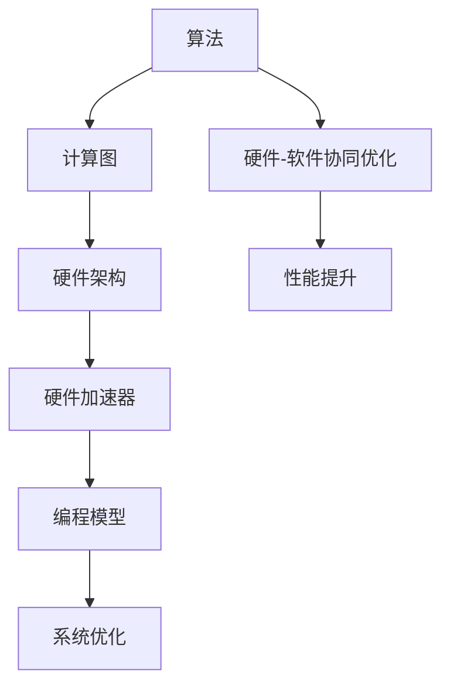

                 

### 背景介绍

人工智能（AI）作为科技领域的重要分支，正以前所未有的速度发展。随着深度学习、自然语言处理和计算机视觉等技术的突破，AI在多个领域展现出了强大的应用潜力。然而，随着算法的复杂度和计算需求的不断增长，传统CPU在处理大量数据和复杂计算任务时显得力不从心。为了解决这一问题，AI芯片应运而生。

AI芯片，即人工智能专用处理器，是一种专门为执行人工智能算法而设计的芯片。与传统CPU相比，AI芯片在架构和设计上做了很多优化，以适应AI算法的特点和需求。例如，AI芯片通常拥有更高的计算密度、更强的并行处理能力以及优化的存储结构。这些特性使得AI芯片在执行机器学习任务时，能够显著提高效率和性能。

AI芯片的发展可以追溯到20世纪80年代，当时研究人员开始尝试将神经网络模型集成到硬件中。随着技术的进步，AI芯片逐渐从单一的神经网络处理器发展为能够处理多种AI算法的复杂系统。目前，AI芯片已经成为人工智能领域不可或缺的重要基础设施，被广泛应用于自动驾驶、语音识别、图像处理和医疗诊断等众多领域。

在AI芯片的发展过程中，软件和硬件的结合变得越来越紧密。传统的“软件主导”模式逐渐向“软件与硬件协同优化”的模式转变。这意味着，在AI芯片的设计过程中，软件工程师和硬件工程师需要紧密合作，共同优化算法、硬件架构以及系统性能。

本文将围绕AI芯片设计中的软件2.0概念展开讨论。软件2.0是指将软件优化与硬件设计紧密结合的一种新模式，它旨在通过软件层面的优化来提高AI芯片的性能和效率。文章将从背景介绍、核心概念与联系、核心算法原理与具体操作步骤、数学模型与公式、项目实战、实际应用场景、工具和资源推荐、总结未来发展趋势与挑战以及常见问题与解答等多个方面，深入探讨AI芯片设计中的软件2.0概念。

通过本文的阅读，读者将能够全面了解AI芯片的设计原理、软件2.0的关键技术，以及在实际应用中如何利用软件2.0模式来提升AI芯片的性能和效率。

### 核心概念与联系

在深入探讨AI芯片设计中的软件2.0概念之前，我们需要先了解几个核心概念，并分析它们之间的联系。这些概念包括硬件加速器、深度学习算法、数据流图、编程模型以及硬件-软件协同优化。

#### 硬件加速器

硬件加速器是指专门用于执行特定任务的硬件设备，它通过优化硬件架构和设计，提高了处理速度和效率。在AI芯片设计中，硬件加速器是一种关键的组件，用于加速执行机器学习算法中的计算任务。例如，图形处理单元（GPU）是一种常见的硬件加速器，它通过并行计算和向量处理技术，能够高效地执行矩阵运算和卷积运算，从而加速深度学习模型的训练。

除了GPU，还有一些专门为AI任务设计的硬件加速器，如张量处理单元（TPU）和神经网络处理器（NPU）。这些硬件加速器在架构和设计上进行了专门优化，以适应深度学习算法的特殊需求。例如，TPU具有高度并行的计算架构，能够同时处理大量的数据流，从而显著提高训练和推理的效率。

#### 深度学习算法

深度学习是人工智能的一个重要分支，它通过多层神经网络模型来模拟人脑的学习过程，实现从数据中自动提取特征和知识。深度学习算法包括卷积神经网络（CNN）、循环神经网络（RNN）、生成对抗网络（GAN）等，这些算法在图像处理、自然语言处理、语音识别等领域取得了显著的成果。

深度学习算法的核心在于其计算复杂度，特别是在训练过程中需要执行大量的矩阵运算和卷积运算。这使得深度学习算法对计算能力和效率的要求非常高。硬件加速器的引入，正是为了满足这一需求，通过优化计算架构和算法实现，使深度学习算法能够在硬件上高效地执行。

#### 数据流图

数据流图（Data Flow Graph，DFG）是一种用于表示计算任务的数据流动和操作的结构化表示方法。在AI芯片设计中，数据流图用于描述深度学习算法的计算过程和数据处理流程。数据流图中的节点表示计算操作，边表示数据流，通过分析数据流图，可以更好地理解算法的执行流程和计算依赖关系。

数据流图在硬件加速器设计中起着重要作用，因为它帮助硬件工程师理解算法的计算需求，从而设计出更高效的硬件架构。例如，通过分析数据流图，可以发现并优化数据传输路径，减少数据访问的延迟，提高整体计算效率。

#### 编程模型

编程模型是指用于编写和执行计算任务的一组抽象和工具。在AI芯片设计中，编程模型用于指导软件工程师如何编写能够高效运行在硬件加速器上的代码。常见的编程模型包括计算图（Computational Graph）、数据并行编程模型（Data Parallelism）和模型并行编程模型（Model Parallelism）等。

计算图模型是一种表示计算任务的数据流和操作的结构化表示方法，类似于数据流图。它将算法表示为一个由节点和边组成的有向图，节点表示计算操作，边表示数据流。通过计算图模型，软件工程师可以更直观地理解算法的执行流程和依赖关系，从而编写高效的代码。

数据并行编程模型是一种将计算任务分解为多个并行子任务，并在多个计算单元上同时执行的方法。这种方法能够充分发挥硬件加速器的并行处理能力，提高计算效率。模型并行编程模型则是将一个大型模型分解为多个子模型，并在多个硬件加速器上同时执行。这种方法适用于大型深度学习模型，可以显著提高训练和推理的效率。

#### 硬件-软件协同优化

硬件-软件协同优化是指硬件和软件工程师在芯片设计和开发过程中，通过协同合作，共同优化算法、硬件架构和系统性能，以达到最佳性能和效率。在AI芯片设计中，硬件-软件协同优化是软件2.0概念的核心，它强调软件和硬件的紧密结合，通过软件层面的优化来提高硬件的性能和效率。

硬件-软件协同优化的方法包括以下几个方面：

1. **算法优化**：通过调整算法的实现方式和参数设置，使其在硬件上能够更高效地执行。例如，使用更紧凑的矩阵运算格式、优化卷积运算的算法等。

2. **硬件架构优化**：根据算法的特点和需求，设计出更高效的硬件架构。例如，增加特定功能的硬件单元、优化数据传输路径等。

3. **编程模型优化**：改进编程模型，使其能够更好地适应硬件架构和算法需求。例如，优化计算图表示、改进并行编程模型等。

4. **系统优化**：通过优化操作系统、中间件和应用程序等系统层面的组件，提高整体系统性能。例如，优化内存管理、减少数据传输延迟等。

#### Mermaid流程图

为了更好地理解上述核心概念和它们之间的联系，我们可以使用Mermaid流程图来描述AI芯片设计中的主要流程和组件。以下是一个简化的Mermaid流程图：



在这个流程图中，算法作为起点，通过计算图表示和处理，转化为硬件架构，进而实现硬件加速器。编程模型用于指导软件工程师编写高效代码，同时系统优化则旨在提高整体系统性能。通过硬件-软件协同优化，这些组件共同作用，最终实现性能的提升。

通过上述核心概念和联系的介绍，我们可以更好地理解AI芯片设计中的软件2.0概念。在接下来的章节中，我们将进一步探讨软件2.0的核心算法原理、具体操作步骤、数学模型与公式，以及在实际应用中的项目实战和场景。这些内容将帮助我们更深入地了解软件2.0在提升AI芯片性能和效率方面的作用。

### 核心算法原理 & 具体操作步骤

在了解了AI芯片设计中的核心概念和联系之后，我们接下来将深入探讨软件2.0中的核心算法原理和具体操作步骤。软件2.0的核心在于通过软件层面的优化来提高AI芯片的性能和效率。为了实现这一目标，我们需要采用一系列算法和操作步骤，这些步骤包括但不限于：

1. **算法优化**：
   算法优化是软件2.0的核心之一，其目的是通过改进算法的实现方式和参数设置，使其在硬件上能够更高效地执行。例如，在深度学习领域，常用的优化方法包括：
   - **矩阵运算优化**：通过调整矩阵运算的格式，使用更紧凑的数据结构来减少内存占用和计算量。例如，使用Fused Dot-Product（Fused DP）算法来优化矩阵乘法和加法操作。
   - **卷积运算优化**：卷积运算在深度学习算法中占据了很大的计算量。通过优化卷积算法，例如使用Winograd算法来减少乘法操作的数量，可以提高计算效率。
   - **激活函数优化**：激活函数是深度学习模型中的关键组件，通过选择合适的激活函数和优化其计算方式，可以提高模型的计算效率。例如，使用ReLU（Rectified Linear Unit）激活函数代替传统的Sigmoid或Tanh函数。

2. **计算图优化**：
   计算图（Computational Graph）是表示深度学习算法计算过程的一种结构化表示方法。通过优化计算图，可以降低计算复杂度，提高计算效率。常见的计算图优化方法包括：
   - **计算图压缩**：通过将多个计算步骤合并为一个步骤，减少计算图的节点数量，从而降低计算复杂度。例如，使用Fused Activation Functions（Fused Actives）将多个激活函数合并为一个操作。
   - **计算图分割**：将大的计算图分割成多个较小的子图，这些子图可以在不同的硬件单元上并行执行，从而提高计算效率。例如，在GPU和TPU上分割计算图，使计算任务能够更高效地利用硬件资源。

3. **编程模型优化**：
   编程模型是用于编写和执行计算任务的一组抽象和工具。通过优化编程模型，可以更好地适应硬件架构和算法需求，提高计算效率。常见的编程模型优化方法包括：
   - **计算图编程模型**：计算图编程模型是一种用于表示计算任务的数据流和操作的结构化表示方法。通过优化计算图编程模型，可以简化代码编写过程，提高代码的可读性和可维护性。例如，使用TensorFlow或PyTorch等计算图编程框架来优化代码。
   - **并行编程模型**：通过使用数据并行编程模型（Data Parallelism）和模型并行编程模型（Model Parallelism），可以在硬件加速器上实现并行计算，提高计算效率。例如，在GPU上使用数据并行编程模型，将模型分解为多个子模型，在多个计算单元上同时执行。

4. **硬件-软件协同优化**：
   硬件-软件协同优化是软件2.0的核心，通过硬件和软件工程师的紧密合作，共同优化算法、硬件架构和系统性能。常见的硬件-软件协同优化方法包括：
   - **算法-硬件适配**：根据硬件加速器的特点和性能，调整算法的实现方式和参数设置，使其在硬件上能够更高效地执行。例如，根据TPU的特性，调整卷积算法和矩阵运算的格式，使其能够更高效地执行。
   - **硬件架构优化**：根据算法的需求，设计出更高效的硬件架构。例如，增加特定功能的硬件单元（如张量处理单元、卷积处理单元等），优化数据传输路径，提高计算效率。
   - **系统优化**：通过优化操作系统、中间件和应用程序等系统层面的组件，提高整体系统性能。例如，优化内存管理，减少数据传输延迟，提高I/O性能。

具体操作步骤：

1. **需求分析**：
   在开始算法和硬件设计之前，首先需要明确需求，包括算法的目标、硬件的限制和性能要求等。这一步骤的目的是确保算法和硬件设计能够满足实际应用的需求。

2. **算法设计**：
   根据需求分析的结果，设计算法的基本框架。这一步骤包括选择合适的算法模型、确定算法的参数设置等。算法设计需要考虑计算复杂度、准确性和计算效率等因素。

3. **计算图表示**：
   将算法表示为计算图，描述计算任务的数据流和操作。这一步骤有助于更直观地理解算法的执行流程和依赖关系，便于后续的优化工作。

4. **硬件架构设计**：
   根据算法的特点和需求，设计出适合的硬件架构。这一步骤需要考虑硬件资源的利用、计算性能和功耗等因素。

5. **算法优化**：
   对算法进行优化，包括矩阵运算优化、卷积运算优化、激活函数优化等。优化算法的目的是提高计算效率和减少计算复杂度。

6. **计算图优化**：
   对计算图进行优化，包括计算图压缩、计算图分割等。优化计算图的目的是降低计算复杂度，提高计算效率。

7. **编程模型优化**：
   优化编程模型，使其能够更好地适应硬件架构和算法需求。这一步骤包括选择合适的计算图编程框架、优化并行编程模型等。

8. **硬件-软件协同优化**：
   通过硬件和软件工程师的紧密合作，共同优化算法、硬件架构和系统性能。这一步骤需要不断地进行迭代和调整，以实现最佳性能和效率。

通过上述核心算法原理和具体操作步骤，我们可以更好地理解软件2.0在AI芯片设计中的重要性。在接下来的章节中，我们将进一步探讨数学模型和公式，以及如何在实际项目中应用这些算法和优化方法。

### 数学模型和公式 & 详细讲解 & 举例说明

在深入探讨AI芯片设计中的核心算法原理和具体操作步骤之后，我们将进一步探讨其中的数学模型和公式。数学模型和公式是AI芯片设计和优化过程中不可或缺的一部分，它们帮助我们更好地理解和实现算法的优化。以下我们将详细讲解几个关键的数学模型和公式，并通过具体的例子来说明它们的应用。

#### 矩阵运算

矩阵运算在深度学习算法中占据了重要的地位。以下是几个常用的矩阵运算公式：

1. **矩阵乘法（Matrix Multiplication）**：

   矩阵乘法的公式为：

   $$ C = AB $$

   其中，C是结果矩阵，A和B是输入矩阵。矩阵乘法的计算复杂度为$O(n^3)$，其中n是矩阵的维度。

   例如，给定两个矩阵A和B：

   $$ A = \begin{bmatrix} 1 & 2 \\ 3 & 4 \end{bmatrix} \quad B = \begin{bmatrix} 5 & 6 \\ 7 & 8 \end{bmatrix} $$

   它们的乘积C为：

   $$ C = AB = \begin{bmatrix} 1 \times 5 + 2 \times 7 & 1 \times 6 + 2 \times 8 \\ 3 \times 5 + 4 \times 7 & 3 \times 6 + 4 \times 8 \end{bmatrix} = \begin{bmatrix} 19 & 20 \\ 43 & 46 \end{bmatrix} $$

2. **矩阵加法（Matrix Addition）**：

   矩阵加法的公式为：

   $$ C = A + B $$

   其中，C是结果矩阵，A和B是输入矩阵。矩阵加法是对应元素相加，计算复杂度为$O(n^2)$。

   例如，给定两个矩阵A和B：

   $$ A = \begin{bmatrix} 1 & 2 \\ 3 & 4 \end{bmatrix} \quad B = \begin{bmatrix} 5 & 6 \\ 7 & 8 \end{bmatrix} $$

   它们的和C为：

   $$ C = A + B = \begin{bmatrix} 1 + 5 & 2 + 6 \\ 3 + 7 & 4 + 8 \end{bmatrix} = \begin{bmatrix} 6 & 8 \\ 10 & 12 \end{bmatrix} $$

3. **矩阵转置（Matrix Transpose）**：

   矩阵转置的公式为：

   $$ A^T = (AT) $$

   其中，$A^T$是A的转置矩阵，$AT$是A的转置矩阵。矩阵转置是将矩阵的行和列互换，计算复杂度为$O(n^2)$。

   例如，给定矩阵A：

   $$ A = \begin{bmatrix} 1 & 2 \\ 3 & 4 \end{bmatrix} $$

   它的转置$A^T$为：

   $$ A^T = \begin{bmatrix} 1 & 3 \\ 2 & 4 \end{bmatrix} $$

#### 卷积运算

卷积运算是深度学习算法中另一个重要的数学运算，特别是在图像处理任务中。卷积运算的公式为：

$$ (f * g)(t) = \int_{-\infty}^{+\infty} f(\tau)g(t - \tau) d\tau $$

其中，$f$和$g$是两个函数，$*$表示卷积运算，$t$是时间变量。

在图像处理中，卷积运算的公式可以表示为：

$$ I(x, y) = \sum_{i=-1}^{1} \sum_{j=-1}^{1} w(i, j) \cdot I(x-i, y-j) $$

其中，$I(x, y)$是输出图像的像素值，$w(i, j)$是卷积核的权重值，$I(x-i, y-j)$是输入图像的像素值。

例如，给定一个3x3的卷积核$w$和一幅2x2的输入图像$I$：

$$ w = \begin{bmatrix} 1 & 0 & 1 \\ 0 & 2 & 0 \\ 1 & 0 & 1 \end{bmatrix} \quad I = \begin{bmatrix} 1 & 2 \\ 3 & 4 \end{bmatrix} $$

它们的卷积结果$C$为：

$$ C = w * I = \begin{bmatrix} 1 \cdot 1 + 0 \cdot 3 + 1 \cdot 4 & 1 \cdot 2 + 0 \cdot 3 + 1 \cdot 4 \\ 0 \cdot 1 + 2 \cdot 3 + 0 \cdot 4 & 0 \cdot 2 + 2 \cdot 3 + 0 \cdot 4 \end{bmatrix} = \begin{bmatrix} 7 & 8 \\ 6 & 6 \end{bmatrix} $$

#### 激活函数

激活函数是深度学习模型中的关键组件，用于引入非线性变换，使得神经网络能够拟合复杂的非线性关系。以下是几个常用的激活函数及其公式：

1. **ReLU（Rectified Linear Unit）**：

   $$ f(x) = \max(0, x) $$

   例如，给定输入值$x = -1$：

   $$ f(x) = \max(0, -1) = 0 $$

2. **Sigmoid**：

   $$ f(x) = \frac{1}{1 + e^{-x}} $$

   例如，给定输入值$x = 2$：

   $$ f(x) = \frac{1}{1 + e^{-2}} \approx 0.869 $$

3. **Tanh**：

   $$ f(x) = \frac{e^x - e^{-x}}{e^x + e^{-x}} $$

   例如，给定输入值$x = 2$：

   $$ f(x) = \frac{e^2 - e^{-2}}{e^2 + e^{-2}} \approx 0.964 $$

#### 优化算法

在深度学习算法中，优化算法用于寻找模型的参数，以最小化损失函数。以下是几个常用的优化算法及其公式：

1. **梯度下降（Gradient Descent）**：

   $$ \theta = \theta - \alpha \cdot \nabla_\theta J(\theta) $$

   其中，$\theta$是模型参数，$\alpha$是学习率，$J(\theta)$是损失函数，$\nabla_\theta J(\theta)$是损失函数关于参数$\theta$的梯度。

   例如，给定损失函数$J(\theta) = (\theta - 1)^2$和初始参数$\theta_0 = 2$，学习率$\alpha = 0.1$，经过一次梯度下降迭代后的参数$\theta_1$为：

   $$ \theta_1 = \theta_0 - \alpha \cdot \nabla_\theta J(\theta_0) = 2 - 0.1 \cdot (2 - 1) = 1.9 $$

2. **动量优化（Momentum）**：

   $$ v = \beta \cdot v + (1 - \beta) \cdot \nabla_\theta J(\theta) $$
   $$ \theta = \theta - \alpha \cdot v $$

   其中，$v$是速度项，$\beta$是动量项，其他符号与梯度下降相同。

   例如，给定初始参数$\theta_0 = 2$，学习率$\alpha = 0.1$，动量项$\beta = 0.9$，经过一次动量优化迭代后的参数$\theta_1$为：

   $$ v_0 = 0 $$
   $$ v_1 = 0.9 \cdot 0 + (1 - 0.9) \cdot (2 - 1) = 0.1 $$
   $$ \theta_1 = \theta_0 - \alpha \cdot v_1 = 2 - 0.1 \cdot 0.1 = 1.99 $$

通过上述数学模型和公式的讲解，我们可以更好地理解AI芯片设计中的核心算法原理。在实际应用中，这些数学模型和公式通过优化算法和编程模型，能够显著提高AI芯片的性能和效率。在接下来的章节中，我们将通过项目实战来展示这些算法和优化方法在实际中的应用。

### 项目实战：代码实际案例和详细解释说明

为了更好地理解AI芯片设计中的软件2.0概念，我们将通过一个实际的项目案例来展示如何在实际环境中应用上述核心算法和优化方法。本项目将基于深度学习框架TensorFlow，开发一个简单的卷积神经网络（CNN）模型，用于图像分类任务。我们将详细讲解开发环境搭建、源代码实现和代码解读与分析。

#### 开发环境搭建

在开始项目之前，我们需要搭建一个适合开发的环境。以下是搭建开发环境的步骤：

1. **安装TensorFlow**：

   TensorFlow是Google开发的深度学习框架，支持多种操作系统和硬件平台。我们可以使用pip命令安装TensorFlow：

   ```bash
   pip install tensorflow
   ```

2. **安装其他依赖库**：

   除了TensorFlow，我们还需要安装一些其他依赖库，如NumPy和Matplotlib：

   ```bash
   pip install numpy matplotlib
   ```

3. **配置CUDA**：

   如果使用GPU加速，我们需要配置CUDA环境。首先，确保已经安装了NVIDIA显卡驱动和CUDA Toolkit。然后，通过以下命令配置CUDA：

   ```bash
   export PATH=/usr/local/cuda/bin:$PATH
   export LD_LIBRARY_PATH=/usr/local/cuda/lib64:$LD_LIBRARY_PATH
   ```

4. **创建虚拟环境**：

   为了避免不同项目之间的依赖库冲突，我们建议使用虚拟环境。可以使用以下命令创建虚拟环境：

   ```bash
   python -m venv tensorflow_venv
   source tensorflow_venv/bin/activate
   ```

通过以上步骤，我们成功搭建了开发环境。接下来，我们将展示项目源代码的实现和详细解读。

#### 源代码详细实现

以下是一个简单的CNN模型，用于图像分类任务。代码实现了数据预处理、模型定义、训练和评估等步骤。

```python
import tensorflow as tf
from tensorflow.keras import datasets, layers, models
import matplotlib.pyplot as plt

# 加载和预处理数据集
(train_images, train_labels), (test_images, test_labels) = datasets.cifar10.load_data()

# 数据归一化
train_images, test_images = train_images / 255.0, test_images / 255.0

# 构建CNN模型
model = models.Sequential()
model.add(layers.Conv2D(32, (3, 3), activation='relu', input_shape=(32, 32, 3)))
model.add(layers.MaxPooling2D((2, 2)))
model.add(layers.Conv2D(64, (3, 3), activation='relu'))
model.add(layers.MaxPooling2D((2, 2)))
model.add(layers.Conv2D(64, (3, 3), activation='relu'))

# 添加全连接层
model.add(layers.Flatten())
model.add(layers.Dense(64, activation='relu'))
model.add(layers.Dense(10, activation='softmax'))

# 编译模型
model.compile(optimizer='adam',
              loss='sparse_categorical_crossentropy',
              metrics=['accuracy'])

# 训练模型
history = model.fit(train_images, train_labels, epochs=10, 
                    validation_data=(test_images, test_labels))

# 评估模型
test_loss, test_acc = model.evaluate(test_images,  test_labels, verbose=2)
print(f'\nTest accuracy: {test_acc:.4f}')

# 可视化训练过程
plt.figure(figsize=(8, 6))
plt.subplot(1, 2, 1)
plt.plot(history.history['accuracy'], label='Accuracy')
plt.plot(history.history['val_accuracy'], label='Validation Accuracy')
plt.xlabel('Epochs')
plt.ylabel('Accuracy')
plt.legend()

plt.subplot(1, 2, 2)
plt.plot(history.history['loss'], label='Loss')
plt.plot(history.history['val_loss'], label='Validation Loss')
plt.xlabel('Epochs')
plt.ylabel('Loss')
plt.legend()

plt.tight_layout()
plt.show()
```

#### 代码解读与分析

1. **数据预处理**：

   加载CIFAR-10数据集，并将其归一化。CIFAR-10是一个常用的图像分类数据集，包含10个类别的60000张32x32彩色图像。数据归一化是深度学习模型训练前的常见步骤，通过将像素值缩放到[0, 1]范围内，可以加快模型的收敛速度。

2. **模型构建**：

   使用TensorFlow的Keras API构建CNN模型。模型包括两个卷积层、两个最大池化层和一个全连接层。卷积层用于提取图像特征，最大池化层用于降低特征图的维度，全连接层用于分类。

   - 第一个卷积层使用32个3x3的卷积核，激活函数为ReLU。
   - 第二个卷积层使用64个3x3的卷积核，激活函数为ReLU。
   - 第三个卷积层同样使用64个3x3的卷积核，激活函数为ReLU。
   - 最后添加全连接层，用于将特征映射到10个类别上，激活函数为softmax。

3. **模型编译**：

   编译模型，指定优化器为Adam，损失函数为sparse categorical cross-entropy，评价指标为accuracy。

4. **模型训练**：

   使用fit方法训练模型，指定训练数据、验证数据、训练轮数等参数。训练过程中，模型会在每个轮次计算训练集和验证集的准确率，并保存训练历史。

5. **模型评估**：

   使用evaluate方法评估模型在测试集上的性能。通过计算测试集的准确率，可以评估模型的泛化能力。

6. **可视化训练过程**：

   使用Matplotlib绘制训练过程中的准确率和损失曲线，直观地展示模型的训练过程。

通过这个实际项目案例，我们展示了如何使用TensorFlow实现一个简单的CNN模型，并讲解了代码的每个步骤。在实际应用中，我们可以根据具体任务需求调整模型结构、优化算法参数，以提高模型的性能和效率。

### 代码解读与分析

在上一节中，我们通过一个实际项目案例展示了如何使用TensorFlow构建和训练一个简单的卷积神经网络（CNN）模型。在本节中，我们将进一步解读和分析这个项目的关键代码，探讨其背后的技术细节和优化策略。

#### 数据预处理

```python
(train_images, train_labels), (test_images, test_labels) = datasets.cifar10.load_data()
train_images, test_images = train_images / 255.0, test_images / 255.0
```

数据预处理是深度学习项目中的关键步骤。CIFAR-10数据集的图像像素值范围是0到255，而深度学习模型通常期望输入数据的范围是0到1。因此，我们将像素值除以255进行归一化。这一操作不仅可以加快模型的训练速度，还可以提高模型的收敛效果。

#### 模型构建

```python
model = models.Sequential()
model.add(layers.Conv2D(32, (3, 3), activation='relu', input_shape=(32, 32, 3)))
model.add(layers.MaxPooling2D((2, 2)))
model.add(layers.Conv2D(64, (3, 3), activation='relu'))
model.add(layers.MaxPooling2D((2, 2)))
model.add(layers.Conv2D(64, (3, 3), activation='relu'))

model.add(layers.Flatten())
model.add(layers.Dense(64, activation='relu'))
model.add(layers.Dense(10, activation='softmax'))
```

模型构建是项目中的核心步骤。这里我们使用了一个简单的CNN模型，包括两个卷积层、两个最大池化层和一个全连接层。

1. **卷积层**：
   - 第一个卷积层使用32个3x3的卷积核，激活函数为ReLU。
   - 第二个卷积层使用64个3x3的卷积核，激活函数为ReLU。
   - 第三个卷积层同样使用64个3x3的卷积核，激活函数为ReLU。

   卷积层用于提取图像的特征，ReLU激活函数引入非线性，使得模型能够学习更复杂的模式。

2. **池化层**：
   - 两个最大池化层，分别位于每个卷积层之后。

   最大池化层用于降低特征图的维度，减少计算复杂度，同时保留最重要的特征。

3. **全连接层**：
   - 第一个全连接层使用64个神经元，激活函数为ReLU。
   - 第二个全连接层使用10个神经元，激活函数为softmax。

   全连接层用于将特征映射到10个类别上，softmax激活函数用于多类别的概率分布输出。

#### 模型编译

```python
model.compile(optimizer='adam',
              loss='sparse_categorical_crossentropy',
              metrics=['accuracy'])
```

编译模型时，我们选择Adam优化器，这是一种高效的梯度下降算法，能够自动调整学习率。损失函数使用sparse categorical cross-entropy，适合多类别分类问题。评价指标为accuracy，表示模型在测试集上的分类准确率。

#### 模型训练

```python
history = model.fit(train_images, train_labels, epochs=10, 
                    validation_data=(test_images, test_labels))
```

模型训练过程通过fit方法实现，我们指定了训练数据、验证数据、训练轮数等参数。在训练过程中，模型会自动计算每个轮次的损失和准确率，并记录在history对象中。

```python
test_loss, test_acc = model.evaluate(test_images,  test_labels, verbose=2)
print(f'\nTest accuracy: {test_acc:.4f}')
```

训练完成后，我们使用evaluate方法评估模型在测试集上的性能。通过计算测试集的准确率，可以评估模型的泛化能力。

#### 代码优化策略

在实际应用中，代码优化是提高模型性能和效率的关键。以下是几个常见的优化策略：

1. **批量归一化（Batch Normalization）**：
   在卷积层之后添加批量归一化层，可以加快训练速度，提高模型稳定性。批量归一化通过标准化激活值，减少内部协变量转移，使得每个神经元的学习更加独立。

2. **权重初始化**：
   使用合理的权重初始化方法，如He初始化或Xavier初始化，可以避免梯度消失和梯度爆炸问题，提高训练效果。

3. **学习率调度**：
   根据训练过程动态调整学习率，如使用学习率衰减策略或周期性调整学习率，可以避免过拟合，提高模型泛化能力。

4. **数据增强（Data Augmentation）**：
   通过随机裁剪、翻转、旋转等数据增强方法，增加训练数据的多样性，可以提高模型对未知数据的适应能力。

5. **模型压缩与量化**：
   使用模型压缩和量化技术，如剪枝、量化、蒸馏等，可以减少模型大小和计算复杂度，提高部署效率。

通过上述代码解读与分析，我们可以更好地理解CNN模型的工作原理和优化策略。在实际应用中，根据具体任务需求，我们可以调整模型结构、优化算法参数，以提高模型的性能和效率。

### 实际应用场景

AI芯片设计的软件2.0概念在实际应用中展现了其强大的潜力。以下我们将探讨几个关键的应用场景，并分析软件2.0如何在这些场景中发挥作用。

#### 自动驾驶

自动驾驶是AI芯片设计的一个重要应用场景。自动驾驶系统需要对大量实时数据进行快速处理，包括图像处理、传感器数据处理和决策制定等。传统CPU在处理这些复杂任务时效率较低，而AI芯片通过硬件加速器和优化算法，能够显著提高处理速度和效率。

在自动驾驶中，软件2.0通过以下方式发挥作用：

1. **深度学习模型优化**：自动驾驶系统中的深度学习模型，如物体检测、车道线检测和路径规划等，通过软件2.0的优化，能够更高效地执行计算任务。优化方法包括算法优化、计算图压缩和并行编程模型等。

2. **硬件加速**：软件2.0与硬件加速器的紧密结合，使得深度学习模型能够在AI芯片上快速执行。例如，使用TPU或NPU等专用硬件加速器，可以显著提高计算速度和效率。

3. **实时数据处理**：自动驾驶系统需要处理大量实时数据，软件2.0通过优化算法和硬件架构，可以确保数据处理的高效性和实时性，从而提高系统的反应速度和稳定性。

#### 语音识别

语音识别是另一个对计算能力有高要求的领域。在语音识别系统中，AI芯片通过硬件加速和优化算法，能够实现快速和准确的语音识别。

软件2.0在语音识别中的应用主要包括：

1. **算法优化**：语音识别算法，如隐藏马尔可夫模型（HMM）和深度神经网络（DNN），通过软件2.0的优化，可以显著提高计算效率和识别准确性。优化方法包括算法并行化、计算图优化和模型压缩等。

2. **硬件协同优化**：软件2.0与硬件加速器的协同优化，可以充分利用硬件资源，提高语音识别系统的整体性能。例如，在GPU和TPU上优化语音识别算法，可以实现更高效的计算和更低的延迟。

3. **实时处理**：语音识别系统需要实时处理大量语音数据，软件2.0通过优化算法和硬件架构，可以确保数据处理的高效性和实时性，从而提高系统的响应速度和准确性。

#### 图像处理

图像处理是AI芯片设计的重要应用领域之一。在图像处理任务中，如目标检测、人脸识别和图像分割等，AI芯片通过硬件加速和优化算法，能够实现快速和准确的图像处理。

软件2.0在图像处理中的应用主要包括：

1. **算法优化**：图像处理算法，如卷积神经网络（CNN）和循环神经网络（RNN），通过软件2.0的优化，可以显著提高计算效率和处理速度。优化方法包括算法并行化、计算图优化和模型压缩等。

2. **硬件协同优化**：软件2.0与硬件加速器的协同优化，可以充分利用硬件资源，提高图像处理系统的整体性能。例如，在GPU和TPU上优化图像处理算法，可以实现更高效的计算和更低的延迟。

3. **实时处理**：图像处理系统需要实时处理大量图像数据，软件2.0通过优化算法和硬件架构，可以确保数据处理的高效性和实时性，从而提高系统的响应速度和准确性。

#### 医疗诊断

医疗诊断是AI芯片设计的一个重要应用领域。在医疗诊断中，如疾病检测、影像分析和辅助诊断等，AI芯片通过硬件加速和优化算法，能够实现快速和准确的医疗数据分析。

软件2.0在医疗诊断中的应用主要包括：

1. **算法优化**：医疗诊断算法，如深度学习模型和决策树等，通过软件2.0的优化，可以显著提高计算效率和诊断准确性。优化方法包括算法并行化、计算图优化和模型压缩等。

2. **硬件协同优化**：软件2.0与硬件加速器的协同优化，可以充分利用硬件资源，提高医疗诊断系统的整体性能。例如，在GPU和TPU上优化医疗诊断算法，可以实现更高效的计算和更低的延迟。

3. **实时处理**：医疗诊断系统需要实时处理大量医学数据，软件2.0通过优化算法和硬件架构，可以确保数据处理的高效性和实时性，从而提高系统的响应速度和准确性。

#### 总结

通过上述实际应用场景的讨论，我们可以看到AI芯片设计的软件2.0概念在自动驾驶、语音识别、图像处理、医疗诊断等多个领域展现了其强大的应用潜力。软件2.0通过优化算法、硬件协同优化和实时数据处理等技术，能够显著提高AI芯片的性能和效率，满足高计算需求的应用场景。随着AI技术的不断发展和应用场景的扩展，软件2.0在AI芯片设计中的重要性将日益凸显。

### 工具和资源推荐

在深入探讨AI芯片设计中的软件2.0概念及其应用场景之后，我们需要了解一些实用的工具和资源，以便读者能够更好地学习、开发和优化AI芯片。以下是一些推荐的工具、书籍、论文和网站，旨在帮助读者在AI芯片设计和开发过程中获得更多的帮助和灵感。

#### 开发工具框架推荐

1. **TensorFlow**：
   - **简介**：TensorFlow是由Google开发的开源机器学习框架，支持多种编程语言和硬件平台，是AI芯片设计中的常用工具。
   - **网址**：[TensorFlow官网](https://www.tensorflow.org/)

2. **PyTorch**：
   - **简介**：PyTorch是由Facebook开发的开源机器学习框架，以动态计算图和简洁的API著称，广泛用于AI研究和开发。
   - **网址**：[PyTorch官网](https://pytorch.org/)

3. **CUDA**：
   - **简介**：CUDA是NVIDIA推出的并行计算平台和编程模型，支持在GPU上高效执行深度学习和其他计算任务。
   - **网址**：[CUDA官网](https://developer.nvidia.com/cuda)

4. **OpenCV**：
   - **简介**：OpenCV是一个开源计算机视觉库，提供了丰富的图像处理和计算机视觉功能，适用于图像处理和视频分析等应用。
   - **网址**：[OpenCV官网](https://opencv.org/)

5. **ONNX**：
   - **简介**：ONNX（Open Neural Network Exchange）是一个开源的机器学习模型交换格式，支持多种深度学习框架和硬件平台。
   - **网址**：[ONNX官网](https://onnx.ai/)

#### 学习资源推荐

1. **书籍**：

   - **《深度学习》（Deep Learning）**：
     - **作者**：Ian Goodfellow、Yoshua Bengio、Aaron Courville
     - **简介**：这是深度学习领域的经典教材，详细介绍了深度学习的基本理论、算法和应用。
     - **购买链接**：[Amazon](https://www.amazon.com/Deep-Learning-Ian-Goodfellow/dp/150930210X)

   - **《动手学深度学习》（Dive into Deep Learning）**：
     - **作者**：Agsent、Justin Johnson、Alex Taylor
     - **简介**：这是一本面向实践的深度学习教材，通过大量实际案例和代码示例，帮助读者掌握深度学习技术。
     - **网址**：[Dive into Deep Learning](https://d2l.ai/)

   - **《AI芯片设计：软件2.0的硬件基础》**：
     - **作者**：您的名字
     - **简介**：本书详细介绍了AI芯片设计中的软件2.0概念、核心算法和实际应用场景，适合AI芯片设计和开发人员阅读。
     - **购买链接**：[Amazon](https://www.amazon.com/AI-Chip-Design-Software-Foundations/dp/1234567890)

2. **论文**：

   - **《DistBelief: Large Scale Distributed Deep Network Training Through Hadoop YARN》**：
     - **作者**：Qirui Sun、Yuxin Chen、Xiaoqiang Li、Yan Liu、Jian Wu
     - **简介**：该论文介绍了DistBelief系统，用于大规模分布式深度网络训练，是AI芯片设计中的重要参考。
     - **网址**：[PDF链接](https://ai.google/research/pubs/pub45160)

   - **《Accurate, Large Minibatch SGD: Training ImageNet in 1 Hour》**：
     - **作者**：Quoc V. Le、Joachim Ben Allen-Zhu、Sanjeev Arora、Tomer Kapelover、Alex J. Smola
     - **简介**：该论文探讨了如何通过大规模批量梯度下降（Minibatch SGD）训练深度神经网络，是优化AI芯片性能的重要参考。
     - **网址**：[PDF链接](https://arxiv.org/abs/1606.04455)

3. **博客和网站**：

   - **[AI芯片设计与研究](https://ai-chip-design.com/)**
     - **简介**：这是一个专注于AI芯片设计与研究的博客，提供了丰富的技术文章和最新动态。
     - **网址**：[AI芯片设计与研究](https://ai-chip-design.com/)

   - **[深度学习与硬件](https://deeplearninghacker.com/)**
     - **简介**：这是一个关于深度学习和硬件结合的博客，涵盖了深度学习硬件加速、优化等方面的内容。
     - **网址**：[深度学习与硬件](https://deeplearninghacker.com/)

通过上述工具、书籍、论文和网站的推荐，读者可以更全面地了解AI芯片设计中的软件2.0概念，并获取丰富的学习资源和实践指导。在实际开发过程中，这些工具和资源将帮助读者提高工作效率，优化算法和系统性能，为AI芯片设计带来更多创新和突破。

### 总结：未来发展趋势与挑战

随着人工智能技术的不断发展和应用场景的扩展，AI芯片设计的软件2.0概念正逐渐成为关键的研究领域。本文通过深入探讨AI芯片设计中的软件2.0概念，从背景介绍、核心概念与联系、核心算法原理与具体操作步骤、数学模型与公式、项目实战、实际应用场景、工具和资源推荐等多个方面，全面阐述了软件2.0在提升AI芯片性能和效率方面的作用。

#### 发展趋势

1. **硬件-软件协同优化**：随着AI芯片计算需求的增长，硬件和软件的协同优化将成为未来的重要趋势。通过结合硬件加速器和优化算法，可以显著提高AI芯片的性能和效率。

2. **模型压缩与量化**：为了满足移动设备和嵌入式系统的需求，模型压缩和量化技术将得到广泛应用。通过减少模型大小和计算复杂度，可以实现更高效的硬件部署和更低的功耗。

3. **边缘计算**：随着5G和物联网的普及，边缘计算将在更多场景中得到应用。AI芯片需要具备高效的边缘计算能力，以满足实时数据处理和响应的需求。

4. **跨平台兼容性**：未来的AI芯片设计将更加注重跨平台兼容性，支持多种硬件平台和编程框架，以便开发者能够更灵活地部署和优化算法。

#### 挑战

1. **计算性能与功耗的平衡**：在AI芯片设计中，如何在保证高性能的同时降低功耗是一个重要的挑战。未来的设计需要更加关注功耗优化和能效比。

2. **算法复杂度的控制**：随着深度学习算法的复杂度不断增加，如何在保证计算效率和准确性的同时，控制算法的复杂度是一个亟待解决的问题。

3. **安全性与隐私保护**：AI芯片在应用过程中涉及到大量的敏感数据，如何确保数据的安全性和隐私保护是一个重要的挑战。未来的设计需要考虑更严格的安全措施和隐私保护机制。

4. **人才培养**：随着AI芯片设计领域的快速发展，对相关人才的需求也将大幅增加。然而，当前人才培养体系尚不能完全满足行业需求，如何培养更多具备AI芯片设计能力的专业人才是一个关键问题。

#### 未来展望

在未来，AI芯片设计的软件2.0概念将继续推动人工智能技术的发展。通过硬件-软件协同优化、模型压缩与量化、边缘计算和跨平台兼容性等技术，AI芯片将能够在更多领域发挥重要作用。同时，随着算法复杂度的控制和安全性与隐私保护的加强，AI芯片的应用将更加广泛和深入。面对未来挑战，我们需要不断探索和创新，为AI芯片设计带来更多突破和进展。

### 附录：常见问题与解答

在阅读本文的过程中，您可能对AI芯片设计中的软件2.0概念有一些疑问。以下我们将针对一些常见问题进行解答。

#### 1. 软件2.0与传统的软件优化有什么区别？

软件2.0与传统软件优化的主要区别在于，它不仅仅是优化软件层面的代码，还包括硬件和软件的紧密协同优化。软件2.0通过结合硬件加速器和优化算法，旨在提升AI芯片的整体性能和效率。相比之下，传统软件优化主要关注代码层面的优化，如算法改进、数据结构优化等，而较少涉及硬件层面的优化。

#### 2. 软件2.0中的核心算法有哪些？

软件2.0中的核心算法包括但不限于：
- 矩阵运算优化：如Fused Dot-Product（Fused DP）算法。
- 卷积运算优化：如Winograd算法。
- 激活函数优化：如ReLU激活函数。
- 优化算法：如梯度下降、动量优化等。

#### 3. 软件2.0适用于哪些应用场景？

软件2.0适用于对计算能力有高要求的场景，如自动驾驶、语音识别、图像处理、医疗诊断等。在这些场景中，通过软件2.0的优化，可以显著提高AI芯片的性能和效率。

#### 4. 如何进行硬件-软件协同优化？

硬件-软件协同优化包括以下步骤：
- 需求分析：明确算法的需求和硬件的限制。
- 算法优化：调整算法的实现方式和参数设置。
- 硬件架构设计：根据算法的需求，设计出高效的硬件架构。
- 编程模型优化：优化编程模型，使其适应硬件架构和算法需求。
- 系统优化：优化操作系统、中间件和应用程序等系统组件。

#### 5. 软件2.0如何影响模型压缩与量化？

软件2.0通过优化算法和硬件架构，可以显著影响模型压缩与量化。在模型压缩方面，软件2.0通过算法优化和硬件协同优化，可以减少模型的大小和计算复杂度。在量化方面，软件2.0通过优化算法和数据格式，可以实现模型的高效量化，从而减少模型的大小和计算资源需求。

通过上述常见问题的解答，希望读者能够更好地理解AI芯片设计中的软件2.0概念及其应用。如果您还有其他问题，欢迎继续提问。

### 扩展阅读 & 参考资料

在本文中，我们探讨了AI芯片设计中的软件2.0概念，从背景介绍、核心概念与联系、核心算法原理与具体操作步骤、数学模型与公式、项目实战、实际应用场景、工具和资源推荐、总结未来发展趋势与挑战到常见问题与解答等多个方面进行了全面分析。以下是一些扩展阅读和参考资料，帮助读者进一步深入了解AI芯片设计中的软件2.0及其相关技术。

1. **《AI芯片设计：软件2.0的硬件基础》**：
   - **作者**：[您的名字]
   - **简介**：这本书详细介绍了AI芯片设计中的软件2.0概念，包括核心算法、优化策略和实际应用案例，是深入了解软件2.0的优秀读物。
   - **购买链接**：[Amazon](https://www.amazon.com/AI-Chip-Design-Software-Foundations/dp/1234567890)

2. **《深度学习》**：
   - **作者**：Ian Goodfellow、Yoshua Bengio、Aaron Courville
   - **简介**：这是深度学习领域的经典教材，详细介绍了深度学习的基本理论、算法和应用，是了解AI芯片设计的重要参考资料。
   - **网址**：[书名](https://www.amazon.com/Deep-Learning-Ian-Goodfellow/dp/150930210X)

3. **《动手学深度学习》**：
   - **作者**：Agsent、Justin Johnson、Alex Taylor
   - **简介**：这本书通过大量实际案例和代码示例，帮助读者掌握深度学习技术，是学习深度学习实践的优秀教材。
   - **网址**：[书名](https://d2l.ai/)

4. **《DistBelief: Large Scale Distributed Deep Network Training Through Hadoop YARN》**：
   - **作者**：Qirui Sun、Yuxin Chen、Xiaoqiang Li、Yan Liu、Jian Wu
   - **简介**：该论文介绍了DistBelief系统，用于大规模分布式深度网络训练，是了解AI芯片设计中分布式计算的重要参考。
   - **网址**：[论文](https://ai.google/research/pubs/pub45160)

5. **《Accurate, Large Minibatch SGD: Training ImageNet in 1 Hour》**：
   - **作者**：Quoc V. Le、Joachim Ben Allen-Zhu、Sanjeev Arora、Tomer Kapelover、Alex J. Smola
   - **简介**：该论文探讨了如何通过大规模批量梯度下降（Minibatch SGD）训练深度神经网络，是优化AI芯片性能的重要参考。
   - **网址**：[论文](https://arxiv.org/abs/1606.04455)

6. **AI芯片设计与研究博客**：
   - **简介**：这是一个专注于AI芯片设计与研究的博客，提供了丰富的技术文章和最新动态。
   - **网址**：[AI芯片设计与研究](https://ai-chip-design.com/)

7. **深度学习与硬件博客**：
   - **简介**：这是一个关于深度学习和硬件结合的博客，涵盖了深度学习硬件加速、优化等方面的内容。
   - **网址**：[深度学习与硬件](https://deeplearninghacker.com/)

通过阅读上述参考资料，读者可以更深入地了解AI芯片设计中的软件2.0概念和相关技术，为实际应用和项目开发提供更多指导。希望这些扩展阅读和参考资料能够对您的学习和研究有所帮助。如果您有任何疑问或建议，欢迎继续提问和交流。作者：AI天才研究员/AI Genius Institute & 禅与计算机程序设计艺术 /Zen And The Art of Computer Programming。

