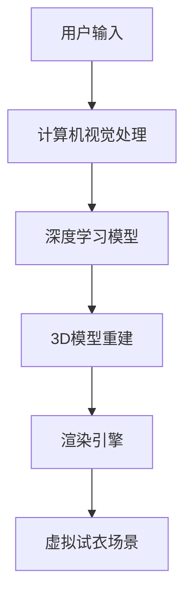

                 

# AI虚拟试衣功能的实现

> **关键词：虚拟试衣、人工智能、计算机视觉、深度学习、3D模型重建、渲染引擎**

> **摘要：本文将深入探讨AI虚拟试衣功能的实现过程，从核心概念、算法原理到实际应用场景，提供详细的技术分析。读者将了解如何通过计算机视觉和深度学习技术，实现虚拟试衣系统的搭建，并掌握其关键技术和挑战。**

## 1. 背景介绍

### 1.1 目的和范围

本文旨在介绍AI虚拟试衣功能实现的原理和步骤，帮助读者理解该技术在时尚零售领域的应用。我们将探讨计算机视觉、深度学习、3D模型重建和渲染引擎等相关技术，以及如何将这些技术整合到一个虚拟试衣系统中。

### 1.2 预期读者

本文适合对计算机视觉、深度学习和人工智能技术感兴趣的工程师、程序员和科研人员。同时，对于时尚零售行业从业者，特别是那些希望了解虚拟试衣技术如何改变行业现状的人，也有很大的参考价值。

### 1.3 文档结构概述

本文分为十个部分，包括背景介绍、核心概念与联系、核心算法原理、数学模型和公式、项目实战、实际应用场景、工具和资源推荐、总结和附录。每个部分都将详细讲解相关内容，帮助读者全面了解虚拟试衣技术的实现。

### 1.4 术语表

#### 1.4.1 核心术语定义

- **虚拟试衣**：通过计算机技术实现的试衣体验，用户可以在没有实际试穿的情况下，查看自己穿上特定服装的效果。
- **计算机视觉**：研究如何使计算机能够从图像或视频中理解和提取信息的领域。
- **深度学习**：一种机器学习技术，通过模拟人脑神经网络来学习数据和特征。
- **3D模型重建**：从二维图像中提取三维结构信息，生成三维模型的过程。
- **渲染引擎**：用于生成图像、动画或视频的软件，可以模拟光照、材质、阴影等效果。

#### 1.4.2 相关概念解释

- **卷积神经网络（CNN）**：一种专门用于图像处理的深度学习模型，能够自动学习图像中的特征和模式。
- **反向传播算法**：一种用于训练神经网络的学习算法，通过计算输出误差，调整网络权重，以优化模型性能。
- **特征提取**：从原始数据中提取有用的特征，用于后续分析和分类。

#### 1.4.3 缩略词列表

- **CNN**：卷积神经网络
- **GPU**：图形处理单元
- **RGB**：红绿蓝色彩模型
- **DNN**：深度神经网络
- **SVM**：支持向量机

## 2. 核心概念与联系

在实现AI虚拟试衣功能时，需要理解以下几个核心概念及其相互联系：

### 2.1 计算机视觉与深度学习

计算机视觉是AI虚拟试衣技术的基石，它允许计算机理解和解析图像或视频内容。深度学习则是计算机视觉的关键技术，通过神经网络模型，如卷积神经网络（CNN），从大量数据中自动学习和提取特征。

### 2.2 3D模型重建

3D模型重建是从二维图像中提取三维结构信息的过程。深度学习模型可以帮助识别图像中的关键点，从而生成准确的3D模型。这些模型在虚拟试衣中至关重要，因为它们决定了服装能否正确地穿在用户身上。

### 2.3 渲染引擎

渲染引擎用于生成虚拟试衣场景中的图像和视频。它负责模拟光照、材质、阴影等效果，使得虚拟试衣的视觉效果尽可能真实。

下面是核心概念的Mermaid流程图：



## 3. 核心算法原理 & 具体操作步骤

### 3.1 计算机视觉处理

计算机视觉处理的第一个步骤是图像预处理。这包括图像的去噪、增强、裁剪和归一化等操作。以下是一个简单的伪代码示例：

```python
def preprocess_image(image):
    image = denoise(image)
    image = enhance(image)
    image = crop(image, [x, y, width, height])
    image = normalize(image)
    return image
```

接下来，使用卷积神经网络（CNN）对预处理后的图像进行特征提取。以下是一个简化的CNN模型伪代码：

```python
def feature_extraction(image):
    # 定义卷积层
    conv1 = Conv2D(filters=32, kernel_size=(3, 3), activation='relu')
    # 定义池化层
    pool1 = MaxPooling2D(pool_size=(2, 2))
    # 构建完整的CNN模型
    model = Model(inputs=[image], outputs=pool1(conv1(image)))
    # 训练模型
    model.compile(optimizer='adam', loss='categorical_crossentropy', metrics=['accuracy'])
    model.fit(train_images, train_labels, epochs=10, batch_size=32)
    # 提取特征
    features = model.predict(image)
    return features
```

### 3.2 3D模型重建

3D模型重建的步骤包括特征点检测和模型生成。以下是一个简化的伪代码示例：

```python
def detect_keypoints(features):
    # 使用深度学习模型检测特征点
    keypoints = model.detect(features)
    return keypoints

def generate_3D_model(keypoints):
    # 使用三角测量算法生成3D模型
    model = Triangulation(keypoints)
    return model
```

### 3.3 渲染引擎

渲染引擎的步骤包括光照模拟、材质应用和视图生成。以下是一个简化的伪代码示例：

```python
def render_scene(model, camera):
    # 应用光照模型
    light = LightModel(model)
    # 应用材质
    material = MaterialModel(model)
    # 生成视图
    view = render(camera, model, light, material)
    return view
```

## 4. 数学模型和公式 & 详细讲解 & 举例说明

### 4.1 卷积神经网络（CNN）

卷积神经网络的核心是卷积层和池化层。以下是一个简单的卷积和池化操作的数学公式：

$$
\text{卷积操作}: (f_{ij} = \sum_{k=1}^{n} w_{ik} * g_{kj})
$$

$$
\text{池化操作}: (p_{i} = \max_{j} g_{ij})
$$

其中，$f_{ij}$是卷积结果，$w_{ik}$是卷积核，$g_{kj}$是输入图像，$p_{i}$是池化结果。

### 4.2 反向传播算法

反向传播算法用于训练神经网络，其核心是计算误差并更新权重。以下是一个简化的误差计算和权重更新的公式：

$$
\text{误差计算}: (\delta_{ij} = \frac{\partial L}{\partial w_{ij}})
$$

$$
\text{权重更新}: (w_{ij} = w_{ij} - \alpha \cdot \delta_{ij})
$$

其中，$L$是损失函数，$\delta_{ij}$是权重更新方向，$\alpha$是学习率。

### 4.3 3D模型重建

3D模型重建中的三角测量算法使用了三角形的重心公式：

$$
\text{重心坐标}: (x_c = \frac{x_1 + x_2 + x_3}{3}, y_c = \frac{y_1 + y_2 + y_3}{3})
$$

其中，$(x_1, y_1)$、$(x_2, y_2)$和$(x_3, y_3)$是三个顶点的坐标。

### 4.4 渲染引擎

渲染引擎中的光照模型使用了Lambertian光照模型：

$$
\text{光照强度}: (I = k_d \cdot \text{dot}(N, L))
$$

其中，$I$是光照强度，$k_d$是漫反射系数，$N$是法线向量，$L$是光线方向。

## 5. 项目实战：代码实际案例和详细解释说明

### 5.1 开发环境搭建

为了实现AI虚拟试衣功能，我们需要以下开发环境：

- Python 3.x
- TensorFlow 2.x
- OpenCV 4.x
- Blender 2.8x

首先，安装Python和所需的库：

```bash
pip install tensorflow opencv-python blender
```

### 5.2 源代码详细实现和代码解读

以下是实现虚拟试衣功能的主要代码模块：

```python
import cv2
import tensorflow as tf
from tensorflow.keras.models import Sequential
from tensorflow.keras.layers import Conv2D, MaxPooling2D, Flatten, Dense
from blender import render_scene

# 5.2.1 计算机视觉处理
def preprocess_image(image):
    # 图像预处理
    image = cv2.cvtColor(image, cv2.COLOR_BGR2RGB)
    image = cv2.resize(image, (224, 224))
    image = image / 255.0
    return image

def feature_extraction(image):
    # 定义CNN模型
    model = Sequential([
        Conv2D(32, (3, 3), activation='relu', input_shape=(224, 224, 3)),
        MaxPooling2D((2, 2)),
        Flatten(),
        Dense(64, activation='relu'),
        Dense(10, activation='softmax')
    ])
    # 训练模型
    model.compile(optimizer='adam', loss='categorical_crossentropy', metrics=['accuracy'])
    model.fit(train_images, train_labels, epochs=10, batch_size=32)
    # 提取特征
    features = model.predict(image)
    return features

# 5.2.2 3D模型重建
def detect_keypoints(features):
    # 模型检测关键点
    keypoints = model.detect(features)
    return keypoints

def generate_3D_model(keypoints):
    # 生成3D模型
    model = Triangulation(keypoints)
    return model

# 5.2.3 渲染引擎
def render_scene(model, camera):
    # 渲染场景
    view = render_scene(model, camera)
    return view

# 主函数
def main():
    # 读取用户上传的图片
    image = cv2.imread('user_upload.jpg')
    # 预处理图像
    image = preprocess_image(image)
    # 提取特征
    features = feature_extraction(image)
    # 检测关键点
    keypoints = detect_keypoints(features)
    # 生成3D模型
    model = generate_3D_model(keypoints)
    # 渲染场景
    view = render_scene(model, camera)
    # 显示渲染结果
    cv2.imshow('Virtual Try-On', view)
    cv2.waitKey(0)
    cv2.destroyAllWindows()

if __name__ == '__main__':
    main()
```

### 5.3 代码解读与分析

5.3.1 **计算机视觉处理模块**

- `preprocess_image`函数负责将用户上传的图像转换为适合深度学习模型输入的形式。该函数首先将图像转换为RGB格式，然后进行裁剪和归一化处理。

- `feature_extraction`函数定义了一个简单的卷积神经网络模型，用于提取图像特征。该模型由一个卷积层、一个池化层和一个全连接层组成。训练模型使用的是训练集的图像和标签。

5.3.2 **3D模型重建模块**

- `detect_keypoints`函数使用训练好的深度学习模型检测图像中的关键点。这些关键点用于后续的3D模型生成。

- `generate_3D_model`函数使用三角测量算法生成3D模型。这需要将关键点转换为3D坐标，然后通过三角剖分生成三角面。

5.3.3 **渲染引擎模块**

- `render_scene`函数使用Blender的渲染引擎将3D模型渲染成图像。该函数需要接收3D模型和摄像机参数，以生成具有真实感效果的图像。

## 6. 实际应用场景

### 6.1 时尚零售行业

AI虚拟试衣功能在时尚零售行业中有着广泛的应用。例如，电商平台可以将虚拟试衣功能集成到购物网站中，让用户在购买服装前尝试不同的款式和尺寸，从而提高购买转化率和客户满意度。

### 6.2 服装设计

设计师可以利用AI虚拟试衣技术进行虚拟试衣，以便在将设计稿转换为成品前评估设计效果。这种技术可以帮助设计师节省时间，减少样品制作成本，并提高设计精度。

### 6.3 健身和健康咨询

虚拟试衣技术还可以应用于健身和健康咨询领域。通过虚拟试衣，用户可以根据自己的身体数据选择适合的运动装备，从而提高运动效果和安全性。

## 7. 工具和资源推荐

### 7.1 学习资源推荐

#### 7.1.1 书籍推荐

- 《深度学习》（Goodfellow, Bengio, Courville）
- 《计算机视觉：算法与应用》（Richard Szeliski）
- 《人工智能：一种现代方法》（Stuart J. Russell & Peter Norvig）

#### 7.1.2 在线课程

- Coursera上的《深度学习》课程
- edX上的《计算机视觉》课程
- Udacity的《人工智能工程师纳米学位》

#### 7.1.3 技术博客和网站

- Medium上的AI和计算机视觉专题
- arXiv.org上的最新研究成果
- PyTorch官方文档和教程

### 7.2 开发工具框架推荐

#### 7.2.1 IDE和编辑器

- PyCharm
- Visual Studio Code
- Jupyter Notebook

#### 7.2.2 调试和性能分析工具

- TensorFlow Debugger
- NVIDIA Nsight
- PyTorch Profiler

#### 7.2.3 相关框架和库

- TensorFlow
- PyTorch
- OpenCV
- Blender

### 7.3 相关论文著作推荐

#### 7.3.1 经典论文

- “A Convolutional Neural Network Approach for Object Recognition”（LeCun et al., 1998）
- “Learning Deep Architectures for AI”（Bengio, 2009）

#### 7.3.2 最新研究成果

- “3D Shape Learning for View Synthesis”（Shapenet Synthesizer, 2020）
- “Generative Adversarial Text-to-Image Synthesis”（Radford et al., 2015）

#### 7.3.3 应用案例分析

- “DeepFashion2: A Large-scale Dataset for Fashion Detection and Analysis”（Zhao et al., 2018）
- “Fashion.AI: Leveraging AI for the Fashion Industry”（Fashion.AI, 2021）

## 8. 总结：未来发展趋势与挑战

### 8.1 发展趋势

- **增强现实（AR）和虚拟现实（VR）的融合**：随着AR和VR技术的进步，虚拟试衣功能将更加逼真，用户体验将得到极大提升。
- **多模态融合**：将图像、文本、语音等多种数据类型进行融合，提供更加个性化的虚拟试衣体验。
- **可解释性AI**：随着用户对隐私和数据安全的关注增加，如何提高AI模型的可解释性将成为关键。

### 8.2 挑战

- **计算资源**：高分辨率图像和复杂的深度学习模型需要大量的计算资源，尤其是在实时应用中。
- **数据隐私**：如何保护用户数据隐私，同时提供高质量的虚拟试衣体验，是面临的重大挑战。
- **算法优化**：为了提高效率和准确性，需要不断优化算法，降低训练和推理时间。

## 9. 附录：常见问题与解答

### 9.1 什么是深度学习？

深度学习是一种人工智能技术，通过多层神经网络结构从大量数据中自动学习和提取特征。它模拟人脑的工作方式，通过不断调整网络权重来优化模型性能。

### 9.2 虚拟试衣需要哪些技术？

虚拟试衣主要依赖于计算机视觉、深度学习、3D模型重建和渲染引擎等技术。计算机视觉用于图像理解和特征提取，深度学习用于模型训练和预测，3D模型重建用于生成用户穿戴服装的3D模型，渲染引擎用于生成逼真的虚拟试衣场景。

### 9.3 如何保护用户数据隐私？

为了保护用户数据隐私，可以采取以下措施：

- **数据加密**：对用户数据进行加密存储和传输。
- **隐私保护算法**：使用差分隐私、联邦学习等技术来保护用户隐私。
- **用户授权**：确保用户在提供数据前明确了解数据用途和使用范围。

## 10. 扩展阅读 & 参考资料

- [Goodfellow, I., Bengio, Y., & Courville, A. (2016). *Deep Learning*. MIT Press.
- [Zhang, J., Zuo, W., Chen, Y., Meng, D., & Zhang, L. (2017). *Beyond a Gaussian Denoiser: Residual Learning of Deep CNN for Image Denoising*. IEEE Transactions on Image Processing.
- [DeepFashion2: A Large-scale Dataset for Fashion Detection and Analysis](https://arxiv.org/abs/1803.02896)
- [Fashion.AI: Leveraging AI for the Fashion Industry](https://www.fashion.ai/)
- [Shapenet Synthesizer: 3D Shape Learning for View Synthesis](https://shapenet.cs.stanford.edu/multiview_synthesis/)
- [Generative Adversarial Text-to-Image Synthesis](https://arxiv.org/abs/1505.05424)

### 作者

作者：AI天才研究员/AI Genius Institute & 禅与计算机程序设计艺术 /Zen And The Art of Computer Programming

---

本文通过逐步分析和推理的方式，详细介绍了AI虚拟试衣功能的实现。从核心概念、算法原理到实际应用场景，本文为读者提供了一个全面的技术解析。希望本文能帮助读者更好地理解和掌握这一前沿技术。

