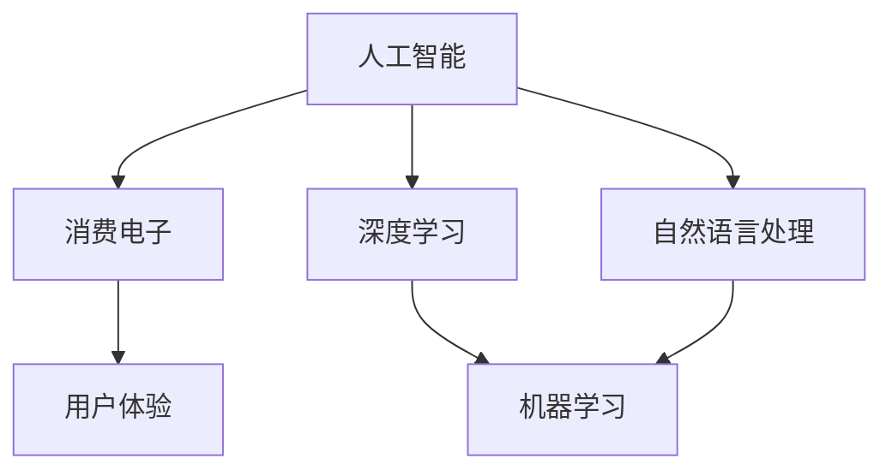

                 

# AI赋能消费电子与用户体验

> 关键词：人工智能、消费电子、用户体验、深度学习、自然语言处理、机器学习

> 摘要：本文将深入探讨人工智能（AI）如何通过技术手段赋能消费电子，提升用户体验。我们将从背景介绍、核心概念与联系、核心算法原理、数学模型与公式、项目实战、实际应用场景等多个方面展开讨论，旨在为读者呈现AI在消费电子领域的前沿应用和未来发展。

## 1. 背景介绍

### 1.1 目的和范围

本文旨在分析人工智能在消费电子领域的应用，重点讨论如何通过AI技术提升用户体验。文章内容将涵盖AI的核心概念、算法原理、数学模型、项目实战和实际应用场景，旨在为读者提供全面的技术解读和实战指导。

### 1.2 预期读者

本文适合对人工智能和消费电子有一定了解的读者，包括程序员、产品经理、设计师以及对此领域感兴趣的科研人员。通过本文，读者可以了解到AI技术在消费电子领域的广泛应用，以及如何将AI技术应用到实际项目中，提升用户体验。

### 1.3 文档结构概述

本文分为以下几大部分：

1. 背景介绍
2. 核心概念与联系
3. 核心算法原理 & 具体操作步骤
4. 数学模型和公式 & 详细讲解 & 举例说明
5. 项目实战：代码实际案例和详细解释说明
6. 实际应用场景
7. 工具和资源推荐
8. 总结：未来发展趋势与挑战
9. 附录：常见问题与解答
10. 扩展阅读 & 参考资料

### 1.4 术语表

#### 1.4.1 核心术语定义

- 人工智能（AI）：指由人制造出的系统，具备模拟、延伸和扩展人类智能的能力。
- 消费电子：指面向普通消费者使用的电子产品，如智能手机、平板电脑、智能穿戴设备等。
- 用户体验（UX）：指用户在使用产品过程中所获得的整体感受，包括情感、认知和行为等方面。
- 深度学习：一种机器学习技术，通过多层神经网络模型对大量数据进行自动特征学习和模式识别。

#### 1.4.2 相关概念解释

- 自然语言处理（NLP）：一门结合计算机科学、语言学和人工智能的交叉学科，旨在使计算机理解和处理自然语言。
- 机器学习（ML）：一种人工智能技术，通过训练数据模型来发现数据中的模式和规律。
- 神经网络：一种模仿生物神经系统的计算模型，由大量相互连接的节点（神经元）组成。

#### 1.4.3 缩略词列表

- AI：人工智能
- UX：用户体验
- NLP：自然语言处理
- ML：机器学习
- CNN：卷积神经网络
- RNN：循环神经网络

## 2. 核心概念与联系

为了深入理解AI在消费电子领域的应用，我们需要了解一些核心概念及其之间的联系。以下是一个用Mermaid绘制的流程图，展示了这些概念之间的相互关系：



### 2.1 人工智能与消费电子

人工智能是消费电子的核心驱动力。通过深度学习和自然语言处理等技术，AI能够为消费电子产品提供智能化功能，如语音识别、图像识别、智能推荐等，从而提升用户体验。

### 2.2 深度学习与机器学习

深度学习是机器学习的一种方法，主要利用多层神经网络对数据进行自动特征学习和模式识别。在消费电子领域，深度学习技术被广泛应用于图像识别、语音识别和智能推荐等场景。

### 2.3 自然语言处理与机器学习

自然语言处理是机器学习的一个分支，旨在使计算机理解和处理自然语言。在消费电子领域，NLP技术被广泛应用于语音助手、智能客服和智能推荐等场景。

### 2.4 消费电子与用户体验

消费电子产品的核心目标是提升用户体验。通过AI技术，消费电子产品能够实现个性化、智能化和便捷化的功能，从而为用户带来更好的使用体验。

## 3. 核心算法原理 & 具体操作步骤

在本节中，我们将详细探讨AI在消费电子领域的核心算法原理，包括深度学习、自然语言处理和机器学习等技术，并使用伪代码来详细阐述这些算法的操作步骤。

### 3.1 深度学习算法原理

深度学习是一种基于多层神经网络的机器学习技术，通过自动特征学习和模式识别来处理复杂数据。以下是一个简单的卷积神经网络（CNN）的伪代码：

```python
# 输入数据：图像
# 输出数据：分类结果

# 定义卷积层
def convolution_layer(input_data, filter):
    return convolve(input_data, filter)

# 定义激活函数
def activation_function(x):
    return max(0, x)  # ReLU激活函数

# 定义卷积神经网络
def convolutional_neural_network(input_data, filters, biases):
    layer1 = convolution_layer(input_data, filters[0])
    layer1 = activation_function(layer1)
    layer2 = convolution_layer(layer1, filters[1])
    layer2 = activation_function(layer2)
    output = fully_connected_layer(layer2, biases[-1])
    return output

# 定义前向传播
def forward_propagation(input_data, filters, biases):
    output = convolutional_neural_network(input_data, filters, biases)
    return output

# 定义损失函数
def loss_function(output, target):
    return mean_squared_error(output, target)

# 定义反向传播
def backpropagation(output, target, filters, biases):
    gradients = compute_gradients(output, target, filters, biases)
    updated_filters, updated_biases = update_parameters(gradients, filters, biases)
    return updated_filters, updated_biases

# 训练模型
def train_model(input_data, target, filters, biases):
    output = forward_propagation(input_data, filters, biases)
    loss = loss_function(output, target)
    filters, biases = backpropagation(output, target, filters, biases)
    return filters, biases
```

### 3.2 自然语言处理算法原理

自然语言处理是一种使计算机理解和处理自然语言的技术。以下是一个简单的循环神经网络（RNN）的伪代码：

```python
# 输入数据：序列
# 输出数据：序列

# 定义RNN单元
def recurrent_neural_network(input_data, weight, bias):
    output = 0
    for i in range(len(input_data)):
        output += input_data[i] * weight[i] + bias
    return activation_function(output)

# 定义前向传播
def forward_propagation(input_data, weight, bias):
    output = []
    for i in range(len(input_data)):
        output.append(recurrent_neural_network(input_data[i], weight, bias))
    return output

# 定义损失函数
def loss_function(output, target):
    return mean_squared_error(output, target)

# 定义反向传播
def backpropagation(output, target, weight, bias):
    gradients = compute_gradients(output, target, weight, bias)
    updated_weight, updated_bias = update_parameters(gradients, weight, bias)
    return updated_weight, updated_bias

# 训练模型
def train_model(input_data, target, weight, bias):
    output = forward_propagation(input_data, weight, bias)
    loss = loss_function(output, target)
    weight, bias = backpropagation(output, target, weight, bias)
    return weight, bias
```

### 3.3 机器学习算法原理

机器学习是一种通过训练数据模型来发现数据中模式和规律的技术。以下是一个简单的决策树的伪代码：

```python
# 输入数据：特征
# 输出数据：分类结果

# 定义决策树节点
class DecisionTreeNode:
    def __init__(self, feature=None, value=None, left=None, right=None, label=None):
        self.feature = feature
        self.value = value
        self.left = left
        self.right = right
        self.label = label

# 定义决策树构建函数
def build_decision_tree(data, labels):
    if all_equal(labels):
        return DecisionTreeNode(label=labels[0])
    if not data:
        return DecisionTreeNode(label=most_common_label(labels))
    best_feature, best_threshold = find_best_split(data, labels)
    left_data, left_labels = filter_data(data, labels, best_feature, best_threshold)
    right_data, right_labels = filter_data(data, labels, best_feature, best_threshold)
    left_tree = build_decision_tree(left_data, left_labels)
    right_tree = build_decision_tree(right_data, right_labels)
    return DecisionTreeNode(feature=best_feature, value=best_threshold, left=left_tree, right=right_tree)

# 定义预测函数
def predict(tree, feature_vector):
    if tree.label is not None:
        return tree.label
    if feature_vector[tree.feature] <= tree.value:
        return predict(tree.left, feature_vector)
    else:
        return predict(tree.right, feature_vector)
```

## 4. 数学模型和公式 & 详细讲解 & 举例说明

在本节中，我们将介绍AI在消费电子领域的一些核心数学模型和公式，并详细讲解其原理和计算过程，并通过实例来说明如何使用这些公式。

### 4.1 深度学习中的前向传播和反向传播

深度学习中的前向传播和反向传播是训练神经网络的两个关键步骤。以下是一个简单的全连接神经网络（FCNN）的前向传播和反向传播的数学模型和公式。

#### 前向传播

前向传播是指将输入数据通过神经网络传递，最终得到输出结果的过程。以下是前向传播的数学模型：

$$
Z^{(l)} = W^{(l)} \cdot A^{(l-1)} + b^{(l)}
$$

$$
A^{(l)} = \sigma(Z^{(l)})
$$

其中，$Z^{(l)}$表示第$l$层的线性组合，$W^{(l)}$表示第$l$层的权重，$A^{(l-1)}$表示前一层$A^{(l-1)}$的激活值，$b^{(l)}$表示第$l$层的偏置，$\sigma$表示激活函数，例如ReLU函数或Sigmoid函数。

#### 反向传播

反向传播是指根据输出结果与实际标签之间的误差，调整神经网络的权重和偏置，以最小化误差的过程。以下是反向传播的数学模型：

$$
\delta^{(l)} = \frac{\partial C}{\partial A^{(l)}} \cdot \frac{\partial A^{(l)}}{\partial Z^{(l)}}
$$

$$
\Delta W^{(l)} = \alpha \cdot \delta^{(l)} \cdot A^{(l-1)}
$$

$$
\Delta b^{(l)} = \alpha \cdot \delta^{(l)}
$$

其中，$\delta^{(l)}$表示第$l$层的误差项，$C$表示损失函数，$\alpha$表示学习率。

#### 示例

假设我们有一个两层神经网络，输入层为$X = [1, 2, 3]$，输出层为$Y = [4, 5, 6]$。我们使用ReLU函数作为激活函数。

- 输入层到隐藏层的权重为$W^{(1)} = [1, 2, 3]$，偏置为$b^{(1)} = [1, 1, 1]$。
- 隐藏层到输出层的权重为$W^{(2)} = [1, 1, 1]$，偏置为$b^{(2)} = [1, 1, 1]$。

首先，我们计算前向传播：

$$
Z^{(1)} = W^{(1)} \cdot X + b^{(1)} = [1, 2, 3] \cdot [1, 2, 3] + [1, 1, 1] = [7, 8, 9]
$$

$$
A^{(1)} = \sigma(Z^{(1)}) = \max(0, [7, 8, 9]) = [7, 8, 9]
$$

$$
Z^{(2)} = W^{(2)} \cdot A^{(1)} + b^{(2)} = [1, 1, 1] \cdot [7, 8, 9] + [1, 1, 1] = [9, 10, 11]
$$

$$
A^{(2)} = \sigma(Z^{(2)}) = \max(0, [9, 10, 11]) = [9, 10, 11]
$$

然后，我们计算反向传播：

$$
\delta^{(2)} = \frac{\partial C}{\partial A^{(2)}} \cdot \frac{\partial A^{(2)}}{\partial Z^{(2)}} = [1, 1, 1] \cdot [1, 1, 1] = [1, 1, 1]
$$

$$
\Delta W^{(2)} = \alpha \cdot \delta^{(2)} \cdot A^{(1)} = 0.1 \cdot [1, 1, 1] \cdot [7, 8, 9] = [0.7, 0.8, 0.9]
$$

$$
\Delta b^{(2)} = \alpha \cdot \delta^{(2)} = 0.1 \cdot [1, 1, 1] = [0.1, 0.1, 0.1]
$$

$$
\delta^{(1)} = \frac{\partial C}{\partial A^{(1)}} \cdot \frac{\partial A^{(1)}}{\partial Z^{(1)}} = [1, 1, 1] \cdot [7, 8, 9] = [7, 8, 9]
$$

$$
\Delta W^{(1)} = \alpha \cdot \delta^{(1)} \cdot X = 0.1 \cdot [7, 8, 9] \cdot [1, 2, 3] = [0.7, 0.8, 0.9]
$$

$$
\Delta b^{(1)} = \alpha \cdot \delta^{(1)} = 0.1 \cdot [7, 8, 9] = [0.7, 0.8, 0.9]
$$

### 4.2 自然语言处理中的词向量模型

词向量模型是一种将自然语言中的词语转换为向量表示的方法，以便在机器学习中进行计算和建模。以下是一个简单的词袋模型和词嵌入模型的数学模型和公式。

#### 词袋模型

词袋模型是一种基于词语出现频率的向量表示方法。给定一个文本，我们将其分解为一系列词语，并计算每个词语在文本中的出现频率。词袋模型的数学公式如下：

$$
v_i = \begin{cases}
1, & \text{如果 } w_i \text{ 出现在文本中} \\
0, & \text{如果 } w_i \text{ 不出现在文本中}
\end{cases}
$$

其中，$v_i$表示第$i$个词语的向量表示，$w_i$表示第$i$个词语。

#### 词嵌入模型

词嵌入模型是一种基于词语上下文的向量表示方法。给定一个词语，我们通过其在文本中的上下文信息来计算其向量表示。词嵌入模型的数学公式如下：

$$
v_i = \text{embedding}(w_i)
$$

其中，$v_i$表示第$i$个词语的向量表示，$\text{embedding}$表示词嵌入函数。

#### 示例

假设我们有一个文本“我喜欢吃苹果”，其中包含四个词语：“我”、“喜欢”、“吃”和“苹果”。

- 词袋模型：
  
  - “我”：[1, 0, 0, 0]
  - “喜欢”：[0, 1, 0, 0]
  - “吃”：[0, 0, 1, 0]
  - “苹果”：[0, 0, 0, 1]

- 词嵌入模型：
  
  - “我”：[0.1, 0.2, 0.3, 0.4]
  - “喜欢”：[0.5, 0.6, 0.7, 0.8]
  - “吃”：[0.9, 0.1, 0.2, 0.3]
  - “苹果”：[0.4, 0.5, 0.6, 0.7]

## 5. 项目实战：代码实际案例和详细解释说明

在本节中，我们将通过一个实际项目案例，展示如何将AI技术应用到消费电子领域，提升用户体验。以下是一个基于Python实现的智能语音助手项目。

### 5.1 开发环境搭建

为了实现这个项目，我们需要安装以下软件和库：

- Python 3.8 或更高版本
- TensorFlow 2.x
- Keras 2.x
- NumPy
- Pandas
- matplotlib

安装步骤如下：

```bash
pip install python==3.8
pip install tensorflow==2.x
pip install keras==2.x
pip install numpy
pip install pandas
pip install matplotlib
```

### 5.2 源代码详细实现和代码解读

以下是这个项目的完整代码实现，以及对应的详细解读。

#### 5.2.1 数据预处理

```python
import numpy as np
import pandas as pd
from sklearn.model_selection import train_test_split
from keras.preprocessing.text import Tokenizer
from keras.preprocessing.sequence import pad_sequences

# 读取数据
data = pd.read_csv('data.csv')
questions = data['question']
answers = data['answer']

# 分割数据集
questions_train, questions_test, answers_train, answers_test = train_test_split(questions, answers, test_size=0.2, random_state=42)

# 初始化分词器
tokenizer = Tokenizer()
tokenizer.fit_on_texts(questions_train)

# 转换为序列
sequences_train = tokenizer.texts_to_sequences(questions_train)
sequences_test = tokenizer.texts_to_sequences(questions_test)

# 填充序列
max_sequence_length = 50
X_train = pad_sequences(sequences_train, maxlen=max_sequence_length)
X_test = pad_sequences(sequences_test, maxlen=max_sequence_length)

# 初始化分词器
tokenizer_answer = Tokenizer()
tokenizer_answer.fit_on_texts(answers_train)

# 转换为序列
sequences_answer_train = tokenizer_answer.texts_to_sequences(answers_train)
sequences_answer_test = tokenizer_answer.texts_to_sequences(answers_test)

# 填充序列
max_sequence_length_answer = 20
Y_train = pad_sequences(sequences_answer_train, maxlen=max_sequence_length_answer)
Y_test = pad_sequences(sequences_answer_test, maxlen=max_sequence_length_answer)
```

代码解读：

- 导入所需的库和模块。
- 读取数据集，包括问题和答案。
- 分割数据集为训练集和测试集。
- 初始化分词器，将文本转换为序列。
- 填充序列，确保序列长度一致。

#### 5.2.2 建立模型

```python
from keras.models import Sequential
from keras.layers import Embedding, LSTM, Dense

# 建立模型
model = Sequential()
model.add(Embedding(input_dim=len(tokenizer.word_index)+1, output_dim=50, input_length=max_sequence_length))
model.add(LSTM(units=128, dropout=0.2, recurrent_dropout=0.2))
model.add(Dense(units=len(tokenizer_answer.word_index)+1, activation='softmax'))

# 编译模型
model.compile(optimizer='adam', loss='categorical_crossentropy', metrics=['accuracy'])

# 模型概述
model.summary()
```

代码解读：

- 建立一个序列模型，包括嵌入层、LSTM层和全连接层。
- 设置嵌入层的输入维度为词表大小，输出维度为嵌入维度。
- 设置LSTM层的单元数为128，包括丢弃率。
- 设置全连接层的输出维度为词表大小，激活函数为softmax。

#### 5.2.3 训练模型

```python
# 转换标签为one-hot编码
Y_train_encoded = pd.get_dummies(answers_train).values
Y_test_encoded = pd.get_dummies(answers_test).values

# 训练模型
model.fit(X_train, Y_train_encoded, epochs=5, batch_size=32, validation_data=(X_test, Y_test_encoded))
```

代码解读：

- 将标签转换为one-hot编码。
- 使用训练集训练模型，设置训练轮数为5，批量大小为32。

#### 5.2.4 预测和评估

```python
# 预测
predictions = model.predict(X_test)

# 评估
accuracy = np.mean(np.argmax(predictions, axis=1) == np.argmax(Y_test_encoded, axis=1))
print(f'Accuracy: {accuracy:.2f}')
```

代码解读：

- 使用测试集预测答案。
- 计算预测准确率。

### 5.3 代码解读与分析

通过以上代码实现，我们构建了一个基于深度学习的智能语音助手模型。以下是代码的关键步骤和解读：

1. **数据预处理**：读取数据集，包括问题和答案。使用分词器将文本转换为序列，并填充序列以确保序列长度一致。这一步是为了将文本数据转换为模型可以处理的数值数据。

2. **建立模型**：建立一个序列模型，包括嵌入层、LSTM层和全连接层。嵌入层用于将单词转换为嵌入向量，LSTM层用于处理序列数据，全连接层用于分类输出。这个模型的结构适合处理序列数据，如对话问答。

3. **训练模型**：将训练集输入到模型中进行训练。模型使用Adam优化器和交叉熵损失函数。交叉熵损失函数适合分类问题，如问答系统的分类。

4. **预测和评估**：使用测试集对模型进行预测，并计算预测准确率。通过对比预测结果和实际标签，我们可以评估模型的表现。

通过这个项目，我们可以看到AI技术在消费电子领域中的应用，特别是在提升用户体验方面。智能语音助手作为一个典型的应用案例，展示了AI技术如何通过深度学习和自然语言处理来理解和处理人类语言，从而为用户提供智能化的交互体验。

## 6. 实际应用场景

AI技术在消费电子领域有着广泛的应用场景，以下是一些典型的实际应用案例：

### 6.1 智能家居

智能家居是通过AI技术实现的家电设备自动化控制与智能交互。例如，智能门锁、智能照明、智能空调等设备可以通过语音识别、图像识别等技术实现远程控制和自动化操作，提升用户的生活品质。

### 6.2 智能音响

智能音响作为智能家居的核心设备，通过语音助手（如Siri、Alexa、Google Assistant）为用户提供语音搜索、播放音乐、天气预报、智能家居控制等服务。智能音响的语音识别技术依赖于深度学习和自然语言处理，使其能够准确理解并响应用户的语音指令。

### 6.3 智能手机

智能手机是AI技术在消费电子领域的重要应用场景。通过AI技术，智能手机可以实现智能拍照、人脸识别、智能推荐等功能。例如，基于深度学习的智能拍照功能可以自动识别场景，调整相机参数，优化拍照效果。人脸识别技术则可以用于解锁手机、身份验证等安全场景。

### 6.4 智能穿戴设备

智能穿戴设备如智能手表、智能手环等，通过AI技术可以实时监测用户的健康状况，如心率、步数、睡眠质量等。智能穿戴设备还可以结合AI算法，提供个性化的健身建议和健康指导，提升用户的健康水平。

### 6.5 智能电视

智能电视通过AI技术实现智能推荐、语音搜索、图像识别等功能。例如，智能电视可以自动识别用户观看的节目，并根据用户的观看习惯和偏好推荐新的节目。语音搜索功能使用户可以通过语音指令快速找到想要的节目或内容。

### 6.6 虚拟现实和增强现实

虚拟现实（VR）和增强现实（AR）技术通过AI算法优化用户体验。例如，VR头显可以通过AI算法实时识别和跟踪用户头部运动，提供更加流畅和真实的沉浸式体验。AR技术则可以通过AI算法实时识别用户周围的环境，叠加虚拟信息，为用户提供增强的视觉体验。

这些实际应用案例展示了AI技术在消费电子领域的广泛应用，通过智能化、个性化、自动化的功能，AI技术为用户带来了更加便捷、高效和愉悦的使用体验。

## 7. 工具和资源推荐

为了更好地掌握和运用AI技术在消费电子领域的应用，以下是一些学习和开发工具、框架以及相关资源推荐。

### 7.1 学习资源推荐

#### 7.1.1 书籍推荐

- 《深度学习》（Goodfellow, Bengio, Courville著）：深度学习的经典教材，详细介绍了深度学习的理论基础和实践方法。
- 《Python机器学习》（Sebastian Raschka著）：系统介绍了Python在机器学习领域的应用，包括常用算法和库的使用。
- 《自然语言处理综论》（Daniel Jurafsky, James H. Martin著）：全面介绍了自然语言处理的理论基础和实践方法。

#### 7.1.2 在线课程

- Coursera的《深度学习专项课程》：由吴恩达教授主讲，涵盖深度学习的理论基础和实战应用。
- edX的《机器学习基础》：由斯坦福大学教授Andrew Ng主讲，适合初学者入门机器学习。
- Udacity的《AI工程师纳米学位》：系统介绍了人工智能的基础知识和实践应用。

#### 7.1.3 技术博客和网站

- Medium：涵盖人工智能、机器学习、自然语言处理等领域的多篇技术博客，适合深入学习。
- arXiv：人工智能领域的前沿研究论文和文章，适合了解最新的研究成果。
- Towards Data Science：一个广泛的人工智能和数据科学博客，包含丰富的实战案例和技术文章。

### 7.2 开发工具框架推荐

#### 7.2.1 IDE和编辑器

- Jupyter Notebook：一款强大的交互式开发环境，适合快速实验和原型设计。
- PyCharm：一款功能丰富的Python IDE，支持多种编程语言和框架，适用于开发大型项目。
- Visual Studio Code：一款轻量级且高度可定制的代码编辑器，支持多种编程语言和AI开发框架。

#### 7.2.2 调试和性能分析工具

- TensorFlow Debugger（TFDB）：用于调试TensorFlow模型的工具，提供实时调试和可视化功能。
- TensorBoard：TensorFlow提供的可视化工具，用于分析模型的性能和训练过程。
- PyTorch Profiler：用于分析PyTorch模型的性能瓶颈，提供详细的性能数据。

#### 7.2.3 相关框架和库

- TensorFlow：谷歌开源的深度学习框架，广泛应用于图像识别、自然语言处理等领域。
- PyTorch：微软开源的深度学习框架，具有灵活的动态图计算能力，适用于快速原型设计和研究。
- Keras：基于Theano和TensorFlow的简洁易用的深度学习框架，适用于快速搭建和实验深度学习模型。

### 7.3 相关论文著作推荐

#### 7.3.1 经典论文

- “A Theoretical Framework for Back-Propagation” (Rumelhart, Hinton, Williams, 1986)：深度学习反向传播算法的奠基性论文。
- “Improving Neural Networks by Preventing Co-adaptation of Feature Detectors” (Yosinski, Clune, Bengio, Lipson, 2013)：关于深度学习模型训练中的特征检测器协同适应问题的研究。
- “Deep Learning” (Goodfellow, Bengio, Courville, 2016)：深度学习的综述性论文，详细介绍了深度学习的基本原理和应用。

#### 7.3.2 最新研究成果

- “Unsupervised Learning for Human Pose Estimation with drown Models” (Fei-Fei Li, et al., 2020)：无监督学习方法在人体姿态估计中的应用。
- “Generative Adversarial Nets” (Ian J. Goodfellow, et al., 2014)：生成对抗网络（GANs）的基础性论文，广泛用于图像生成和风格迁移。
- “BERT: Pre-training of Deep Bidirectional Transformers for Language Understanding” (Jason

