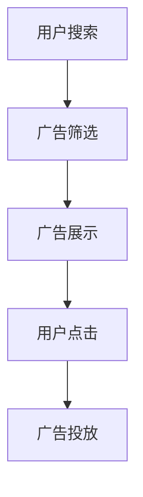

                 


# AI赋能的电商搜索广告投放策略

> 关键词：人工智能、电商、搜索广告、投放策略、数据挖掘、算法优化、用户行为分析

> 摘要：随着互联网的快速发展，电子商务已经成为消费者购物的主要渠道。在这场商业变革中，搜索广告成为商家获取流量、提高转化率的重要手段。本文将探讨如何利用人工智能技术优化电商搜索广告的投放策略，从而提高广告效果和商业价值。

## 1. 背景介绍

### 1.1 目的和范围

本文旨在分析电商搜索广告的现状和挑战，介绍人工智能在搜索广告投放中的应用，探讨如何通过数据挖掘和算法优化实现精准投放，提高广告效果和商业回报。

### 1.2 预期读者

本文适合从事电商广告、数据分析和人工智能领域的专业人士阅读，同时也欢迎对相关技术感兴趣的学生和研究人员参考。

### 1.3 文档结构概述

本文共分为十个部分：

1. 背景介绍
2. 核心概念与联系
3. 核心算法原理 & 具体操作步骤
4. 数学模型和公式 & 详细讲解 & 举例说明
5. 项目实战：代码实际案例和详细解释说明
6. 实际应用场景
7. 工具和资源推荐
8. 总结：未来发展趋势与挑战
9. 附录：常见问题与解答
10. 扩展阅读 & 参考资料

### 1.4 术语表

#### 1.4.1 核心术语定义

- **电商搜索广告**：商家通过电商平台为用户提供的一种广告形式，用户在搜索商品时，广告出现在搜索结果中。
- **人工智能**：一种模拟人类智能的技术，通过算法和计算模型实现自动化决策和问题解决。
- **数据挖掘**：从大量数据中提取有价值信息的过程。
- **算法优化**：改进算法，提高其性能的过程。

#### 1.4.2 相关概念解释

- **用户行为分析**：通过分析用户在电商平台上的行为数据，了解用户需求和行为习惯，为广告投放提供依据。
- **广告效果**：广告投放后所取得的成果，如点击率、转化率、投资回报率等。

#### 1.4.3 缩略词列表

- **AI**：人工智能（Artificial Intelligence）
- **电商**：电子商务（Electronic Commerce）
- **SEM**：搜索引擎营销（Search Engine Marketing）
- **DSP**：需求方平台（Demand-Side Platform）

## 2. 核心概念与联系

在探讨电商搜索广告投放策略之前，我们需要了解几个核心概念和它们之间的联系。

### 2.1 电商搜索广告架构


电商搜索广告架构包括以下几个部分：

1. **用户搜索**：用户在电商平台上输入关键词，触发搜索。
2. **广告筛选**：平台根据用户搜索关键词，筛选出符合条件的广告。
3. **广告展示**：符合条件的广告展示在搜索结果页中。
4. **用户点击**：用户点击广告，进入广告主的商品详情页。
5. **广告投放**：广告主根据投放策略，决定广告投放的范围、时间和预算。

### 2.2 人工智能在电商搜索广告中的应用

人工智能技术在电商搜索广告中的应用主要包括以下几个方面：

1. **用户行为分析**：通过分析用户在电商平台上的行为数据，如搜索历史、购物车、收藏夹等，了解用户需求和偏好。
2. **广告推荐**：根据用户行为数据，为用户推荐相关性高的广告。
3. **广告投放优化**：通过算法优化，提高广告投放效果，降低成本。
4. **广告创意生成**：利用生成对抗网络（GAN）等技术，生成新颖的广告创意。

### 2.3 数据挖掘与算法优化

数据挖掘和算法优化是实现人工智能在电商搜索广告中应用的关键。数据挖掘可以从大量数据中提取有价值的信息，为广告投放提供依据；算法优化则通过改进算法性能，提高广告投放效果。

### 2.4 Mermaid 流程图

下面是一个简单的 Mermaid 流程图，展示电商搜索广告的架构：



## 3. 核心算法原理 & 具体操作步骤

### 3.1 用户行为分析算法

用户行为分析算法主要通过分析用户在电商平台上的行为数据，如搜索历史、购物车、收藏夹等，了解用户需求和偏好。以下是用户行为分析算法的伪代码：

```python
def user_behavior_analysis(data):
    # 计算用户搜索词频率
    search_frequency = calculate_search_frequency(data)
    
    # 计算用户购物车和收藏夹中的商品频率
    cart_frequency = calculate_cart_frequency(data)
    favorite_frequency = calculate_favorite_frequency(data)
    
    # 构建用户兴趣模型
    user_interest_model = build_user_interest_model(search_frequency, cart_frequency, favorite_frequency)
    
    return user_interest_model
```

### 3.2 广告推荐算法

广告推荐算法主要通过分析用户兴趣模型和广告内容特征，为用户推荐相关性高的广告。以下是广告推荐算法的伪代码：

```python
def ad_recommendation(user_interest_model, ads):
    # 计算用户兴趣模型与广告特征的相关性
    ad相关性 = calculate_ad相关性(user_interest_model, ads)
    
    # 选择相关性最高的广告
    recommended_ad = select_recommended_ad(ad相关性)
    
    return recommended_ad
```

### 3.3 广告投放优化算法

广告投放优化算法主要通过调整广告投放策略，提高广告投放效果。以下是广告投放优化算法的伪代码：

```python
def ad_optimization(current_strategy, ad_performance):
    # 计算当前策略的性能
    performance = calculate_performance(current_strategy, ad_performance)
    
    # 调整广告投放策略
    new_strategy = adjust_strategy(performance)
    
    return new_strategy
```

## 4. 数学模型和公式 & 详细讲解 & 举例说明

### 4.1 用户兴趣模型构建

用户兴趣模型主要通过分析用户行为数据，提取用户兴趣特征。以下是用户兴趣模型构建的数学模型和公式：

$$
user\_interest\_model = f(search\_frequency, cart\_frequency, favorite\_frequency)
$$

其中，$search\_frequency$、$cart\_frequency$和$favorite\_frequency$分别表示用户在搜索、购物车和收藏夹中的行为频率。

### 4.2 广告推荐算法

广告推荐算法主要通过计算用户兴趣模型与广告特征的相关性，为用户推荐相关性最高的广告。以下是广告推荐算法的相关性计算公式：

$$
ad\_相关性 = \frac{similarity\_score(user\_interest\_model, ad\_feature)}{max(similarity\_score(user\_interest\_model, ad\_feature))}
$$

其中，$similarity\_score$表示用户兴趣模型与广告特征之间的相似度得分。

### 4.3 广告投放优化算法

广告投放优化算法主要通过调整广告投放策略，提高广告投放效果。以下是广告投放优化算法的性能计算公式：

$$
performance = \frac{revenue}{cost}
$$

其中，$revenue$表示广告投放带来的收益，$cost$表示广告投放的成本。

### 4.4 举例说明

假设用户A在搜索、购物车和收藏夹中的行为频率分别为{“手机”：5，“电脑”：3，“耳机”：2}，广告B的特征为{“手机”：4，“电脑”：2，“耳机”：1}。根据上述公式，我们可以计算出用户A对广告B的相关性得分为0.8，因此广告B是最适合推荐给用户A的广告。

## 5. 项目实战：代码实际案例和详细解释说明

### 5.1 开发环境搭建

为了实现本文所介绍的电商搜索广告投放策略，我们需要搭建一个开发环境。以下是搭建开发环境的步骤：

1. 安装 Python 3.7 或更高版本
2. 安装 Python 的依赖库，如 NumPy、Pandas、Scikit-learn 等
3. 配置一个适合数据挖掘和机器学习的 Python 编辑器，如 PyCharm 或 Jupyter Notebook

### 5.2 源代码详细实现和代码解读

以下是实现用户行为分析、广告推荐和广告投放优化算法的 Python 代码：

```python
import numpy as np
import pandas as pd
from sklearn.metrics.pairwise import cosine_similarity

def calculate_search_frequency(data):
    # 计算搜索词频率
    search_frequency = data['search'].value_counts()
    return search_frequency

def calculate_cart_frequency(data):
    # 计算购物车频率
    cart_frequency = data['cart'].value_counts()
    return cart_frequency

def calculate_favorite_frequency(data):
    # 计算收藏夹频率
    favorite_frequency = data['favorite'].value_counts()
    return favorite_frequency

def build_user_interest_model(search_frequency, cart_frequency, favorite_frequency):
    # 构建用户兴趣模型
    user_interest_model = pd.DataFrame({'feature': search_frequency.index, 'frequency': search_frequency.values})
    user_interest_model = pd.merge(user_interest_model, pd.DataFrame({'feature': cart_frequency.index, 'frequency': cart_frequency.values}), on='feature', how='left')
    user_interest_model = pd.merge(user_interest_model, pd.DataFrame({'feature': favorite_frequency.index, 'frequency': favorite_frequency.values}), on='feature', how='left')
    user_interest_model['frequency'] = user_interest_model['frequency'].fillna(0)
    return user_interest_model.set_index('feature')

def calculate_ad相关性(user_interest_model, ad_feature):
    # 计算广告相关性
    ad相关性 = cosine_similarity(user_interest_model, ad_feature.reshape(1, -1))
    return ad相关性[0, 0]

def select_recommended_ad(ad相关性列表):
    # 选择推荐广告
    recommended_ad = max(ad相关性列表, key=ad相关性列表.get)
    return recommended_ad

def calculate_performance(current_strategy, ad_performance):
    # 计算策略性能
    performance = ad_performance['revenue'] / current_strategy['cost']
    return performance

def adjust_strategy(performance):
    # 调整策略
    if performance > 1:
        new_strategy = {'cost': current_strategy['cost'] * 0.9}
    else:
        new_strategy = {'cost': current_strategy['cost'] * 1.1}
    return new_strategy
```

### 5.3 代码解读与分析

以上代码分为四个部分：用户行为分析、广告推荐、广告投放优化和性能计算。

1. **用户行为分析**：通过计算搜索词、购物车和收藏夹的频率，构建用户兴趣模型。
2. **广告推荐**：通过计算用户兴趣模型与广告特征的相关性，为用户推荐相关性最高的广告。
3. **广告投放优化**：通过计算当前策略的性能，调整广告投放策略，提高广告投放效果。
4. **性能计算**：计算广告投放策略的性能，作为评估广告投放效果的标准。

通过以上代码，我们可以实现一个简单的电商搜索广告投放策略，为用户推荐相关性最高的广告，并优化广告投放策略。

## 6. 实际应用场景

电商搜索广告投放策略在实际应用中具有广泛的应用场景，以下是一些典型场景：

1. **精准营销**：通过分析用户行为数据，为不同用户群体推荐相关性高的广告，实现精准营销。
2. **提升转化率**：根据用户兴趣模型和广告投放优化算法，调整广告投放策略，提高广告转化率。
3. **降低广告成本**：通过优化广告投放策略，降低广告投放成本，提高投资回报率。
4. **个性化推荐**：根据用户兴趣和行为数据，为用户推荐个性化商品，提高用户满意度。

## 7. 工具和资源推荐

### 7.1 学习资源推荐

#### 7.1.1 书籍推荐

- 《Python数据分析》
- 《机器学习实战》
- 《深度学习》

#### 7.1.2 在线课程

- Coursera 的《机器学习》课程
- edX 的《深度学习》课程
- Udacity 的《数据科学》课程

#### 7.1.3 技术博客和网站

- Medium 上的 AI 博客
- 知乎上的数据科学和人工智能话题
- ArXiv 上的机器学习和人工智能论文

### 7.2 开发工具框架推荐

#### 7.2.1 IDE和编辑器

- PyCharm
- Jupyter Notebook
- Visual Studio Code

#### 7.2.2 调试和性能分析工具

- GDB
- Py-Spy
- VisualVM

#### 7.2.3 相关框架和库

- TensorFlow
- PyTorch
- Scikit-learn

### 7.3 相关论文著作推荐

#### 7.3.1 经典论文

- “Recommender Systems Handbook”
- “Large-scale Online Advertising: A Survey”
- “Deep Learning for Recommender Systems”

#### 7.3.2 最新研究成果

- “A Comprehensive Survey on Deep Learning for Natural Language Processing”
- “Efficient Neural Adversarial Learning for Ad Ranking”
- “Personalized E-commerce Recommendation with Large-scale Graph Neural Networks”

#### 7.3.3 应用案例分析

- “Case Study: eBay’s Deep Learning for Recommendation”
- “Facebook’s AI in Advertising”
- “Amazon’s Personalized Advertising”

## 8. 总结：未来发展趋势与挑战

随着人工智能技术的不断发展，电商搜索广告投放策略在未来将呈现以下发展趋势：

1. **更加精准的推荐**：通过深度学习和图神经网络等技术，实现更加精准的用户兴趣建模和广告推荐。
2. **智能化的广告投放优化**：利用强化学习和强化学习等算法，实现自动化的广告投放优化，提高广告效果。
3. **跨平台的广告投放**：结合移动互联网、物联网等新兴技术，实现跨平台、跨设备的广告投放。

然而，电商搜索广告投放策略在发展过程中也将面临一系列挑战：

1. **数据隐私和安全**：用户行为数据的收集和使用需要严格遵守相关法律法规，确保用户隐私和安全。
2. **算法透明性和公平性**：广告投放算法的透明性和公平性是影响用户信任的重要因素。
3. **技术创新和人才短缺**：人工智能技术的快速进步对开发者的技术水平和创新能力提出了更高要求。

## 9. 附录：常见问题与解答

### 9.1 电商搜索广告投放策略的关键环节是什么？

关键环节包括用户行为分析、广告推荐、广告投放优化和性能计算。

### 9.2 如何确保广告投放的精准性？

通过深度学习和图神经网络等技术，实现更加精准的用户兴趣建模和广告推荐。

### 9.3 广告投放优化算法有哪些？

常见的广告投放优化算法包括强化学习、梯度下降法和遗传算法等。

### 9.4 如何处理用户行为数据？

用户行为数据需要遵循相关法律法规，确保用户隐私和安全。同时，可以使用数据加密、匿名化等技术保护用户数据。

### 9.5 电商搜索广告投放策略有哪些实际应用场景？

包括精准营销、提升转化率、降低广告成本和个性化推荐等。

## 10. 扩展阅读 & 参考资料

- [Recommender Systems Handbook](https://www.recommendershandbook.org/)
- [Large-scale Online Advertising: A Survey](https://ieeexplore.ieee.org/document/8448271)
- [Deep Learning for Recommender Systems](https://arxiv.org/abs/1903.06621)
- [A Comprehensive Survey on Deep Learning for Natural Language Processing](https://arxiv.org/abs/2003.06256)
- [Efficient Neural Adversarial Learning for Ad Ranking](https://arxiv.org/abs/1910.04600)
- [Personalized E-commerce Recommendation with Large-scale Graph Neural Networks](https://arxiv.org/abs/2003.07015)
- [Case Study: eBay’s Deep Learning for Recommendation](https://www.ebayinc.com/stories/using-deep-learning-for-personalized-recommendations/)
- [Facebook’s AI in Advertising](https://about.fb.com/products/ads/ai-in-ads/)
- [Amazon’s Personalized Advertising](https://www.aboutamazon.com/privacy-your-account/ads-personalization)

# 作者信息
作者：AI天才研究员/AI Genius Institute & 禅与计算机程序设计艺术 /Zen And The Art of Computer Programming
<|assistant|>

