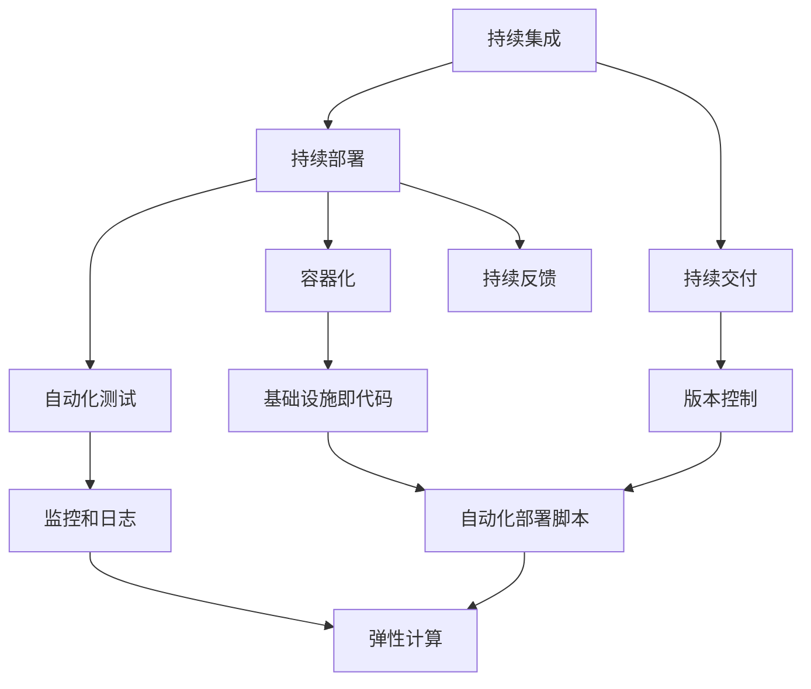

                 

# AI软件2.0的持续部署最佳实践

## 摘要

本文将深入探讨AI软件2.0的持续部署（Continuous Deployment，简称CD）的最佳实践。在当今快速变化的AI领域，持续部署已成为确保软件质量和交付速度的关键因素。本文将首先介绍AI软件2.0的背景和持续部署的重要性，然后详细阐述核心概念和架构，并逐步分析核心算法原理和操作步骤。随后，我们将通过数学模型和公式深入讲解，并给出实际项目案例。最后，本文将讨论AI软件2.0的持续部署在实际应用场景中的具体应用，并推荐相关工具和资源。

## 1. 背景介绍

随着人工智能（AI）技术的飞速发展，AI软件正逐渐渗透到各个行业和领域。从自动驾驶汽车到智能家居，从智能医疗诊断到金融风险评估，AI软件的应用场景日益广泛。然而，AI软件的开发和部署面临着诸多挑战。首先，AI模型通常需要大量的数据和计算资源进行训练和优化，这使得部署过程变得复杂。其次，AI模型的迭代速度极快，需要持续更新以适应新的数据和需求。最后，AI软件的质量和稳定性直接影响到用户体验和业务价值。

为了应对这些挑战，持续部署（CD）技术应运而生。持续部署是一种软件开发生命周期管理策略，通过自动化流程确保软件的持续集成、测试、部署和监控。在AI软件领域，持续部署具有以下优势：

- **提高交付速度**：通过自动化流程，可以快速迭代和交付AI软件，缩短开发周期。
- **提高软件质量**：通过持续测试和反馈，可以及时发现并修复软件缺陷，提高软件质量。
- **降低风险**：通过逐步部署和回滚机制，可以降低部署失败的风险，确保系统稳定运行。

## 2. 核心概念与联系

为了理解AI软件2.0的持续部署，我们需要了解一些核心概念和它们之间的联系。以下是一个用Mermaid绘制的流程图，展示了这些核心概念：



### 2.1 持续集成（Continuous Integration，CI）

持续集成是一种软件开发实践，通过频繁地将代码合并到主干分支，确保代码库始终保持可运行状态。持续集成通常包括以下步骤：

1. **代码提交**：开发人员将代码提交到版本控制系统。
2. **构建**：构建系统自动编译代码，生成可执行文件或库。
3. **测试**：运行一系列自动化测试，验证代码的功能和质量。

### 2.2 持续部署（Continuous Deployment，CD）

持续部署是持续集成的一个扩展，它通过自动化流程将代码部署到生产环境。持续部署通常包括以下步骤：

1. **集成**：将代码集成到现有系统中。
2. **测试**：对集成后的系统进行自动化测试。
3. **部署**：将经过测试的代码部署到生产环境。

### 2.3 持续交付（Continuous Delivery，CD）

持续交付是持续部署的进一步扩展，它确保代码在任何时间都可以安全地交付到生产环境。持续交付通常包括以下步骤：

1. **构建和测试**：与持续集成类似，但更严格。
2. **部署**：部署到预生产环境或生产环境。
3. **监控**：监控系统的性能和稳定性。

### 2.4 自动化测试（Automated Testing）

自动化测试是确保软件质量的关键环节。通过编写自动化测试脚本，可以快速、重复地验证软件功能。自动化测试通常包括以下类型：

1. **功能测试**：验证软件的功能是否符合需求。
2. **性能测试**：评估软件的性能指标，如响应时间和吞吐量。
3. **安全测试**：检测软件的安全漏洞和攻击。

### 2.5 容器化（Containerization）

容器化是一种轻量级虚拟化技术，通过将应用程序及其依赖项打包到容器中，实现应用程序的独立运行环境。容器化有助于简化部署和管理，提高系统的可伸缩性。常见的容器化技术包括Docker和Kubernetes。

### 2.6 版本控制（Version Control）

版本控制是软件开发的核心组成部分，通过记录和管理代码的变更历史，确保代码的可追踪性和可管理性。常见的版本控制系统包括Git和Subversion。

### 2.7 监控和日志（Monitoring and Logging）

监控和日志是确保系统稳定性和可运维性的关键环节。通过监控系统的性能指标和日志记录，可以及时发现和解决问题。

### 2.8 基础设施即代码（Infrastructure as Code，IaC）

基础设施即代码是一种使用代码来定义和管理基础设施的方法。通过IaC，可以自动化基础设施的创建、配置和管理，提高运维效率和可重复性。

### 2.9 自动化部署脚本（Automated Deployment Script）

自动化部署脚本是一种使用脚本语言（如Shell、Python等）编写的脚本，用于自动化部署流程。通过自动化部署脚本，可以简化部署过程，提高部署效率。

### 2.10 弹性计算（Elastic Computing）

弹性计算是一种根据需求动态调整计算资源的技术，通过自动扩展和缩减计算资源，提高系统的可伸缩性和资源利用率。

### 2.11 持续反馈（Continuous Feedback）

持续反馈是一种通过用户反馈、性能监控和日志分析等手段，不断优化软件的方法。通过持续反馈，可以更好地理解用户需求，提高软件质量和用户体验。

## 3. 核心算法原理 & 具体操作步骤

### 3.1 持续集成（CI）

持续集成的主要目标是确保代码库始终处于可运行状态。以下是实现持续集成的基本步骤：

1. **设置触发器**：配置持续集成工具（如Jenkins、GitLab CI等），使其在代码提交时自动触发构建和测试。
2. **编写构建脚本**：编写构建脚本（如Makefile、Dockerfile等），用于编译代码、安装依赖项和构建可执行文件。
3. **编写测试脚本**：编写测试脚本（如单元测试、集成测试等），用于验证代码的功能和质量。
4. **部署到测试环境**：将构建后的代码部署到测试环境，进行进一步的测试。

### 3.2 持续部署（CD）

持续部署的主要目标是自动化部署流程，确保代码可以快速、安全地部署到生产环境。以下是实现持续部署的基本步骤：

1. **设置部署管道**：配置持续部署工具（如Jenkins、GitLab CI等），定义部署管道的流程和触发条件。
2. **编写部署脚本**：编写部署脚本（如Shell脚本、Python脚本等），用于自动化部署流程，包括集成、测试和部署。
3. **部署到生产环境**：将部署脚本部署到生产环境，触发部署流程。

### 3.3 持续交付（CD）

持续交付的主要目标是确保代码在任何时间都可以安全地交付到生产环境。以下是实现持续交付的基本步骤：

1. **构建和测试**：与持续集成类似，确保构建和测试过程自动化。
2. **部署到预生产环境**：将构建后的代码部署到预生产环境，进行进一步测试。
3. **部署到生产环境**：在确认预生产环境测试通过后，将代码部署到生产环境。

### 3.4 自动化测试（Automated Testing）

自动化测试的主要目标是确保软件质量。以下是实现自动化测试的基本步骤：

1. **编写测试用例**：根据需求编写测试用例，涵盖各种功能和场景。
2. **编写测试脚本**：使用测试框架（如Selenium、JUnit等）编写测试脚本，实现测试用例的自动化。
3. **运行测试脚本**：在持续集成和持续部署过程中，自动运行测试脚本。
4. **分析测试结果**：根据测试结果，及时修复缺陷，并重新测试。

### 3.5 容器化（Containerization）

容器化是一种将应用程序及其依赖项打包到容器中的技术。以下是实现容器化的基本步骤：

1. **编写Dockerfile**：编写Dockerfile，定义容器的构建过程，包括安装依赖项、复制文件和设置环境变量。
2. **构建镜像**：使用Dockerfile构建容器镜像。
3. **运行容器**：使用Docker命令运行容器。

### 3.6 版本控制（Version Control）

版本控制是一种记录和管理代码变更历史的技术。以下是实现版本控制的基本步骤：

1. **选择版本控制系统**：选择合适的版本控制系统（如Git、Subversion等）。
2. **初始化仓库**：初始化代码仓库，设置仓库地址和访问权限。
3. **提交代码**：将代码提交到版本控制系统，记录变更历史。
4. **分支管理**：使用分支管理功能，实现代码的并行开发和合并。

### 3.7 监控和日志（Monitoring and Logging）

监控和日志是确保系统稳定性和可运维性的关键环节。以下是实现监控和日志的基本步骤：

1. **选择监控工具**：选择合适的监控工具（如Prometheus、Grafana等）。
2. **配置监控指标**：配置监控指标，包括性能指标、错误率和资源利用率等。
3. **收集日志**：收集系统的日志，包括应用日志、系统日志和错误日志等。
4. **分析日志和监控数据**：分析日志和监控数据，及时发现和解决问题。

### 3.8 基础设施即代码（Infrastructure as Code，IaC）

基础设施即代码是一种使用代码定义和管理基础设施的方法。以下是实现基础设施即代码的基本步骤：

1. **选择IaC工具**：选择合适的IaC工具（如Terraform、Ansible等）。
2. **编写IaC脚本**：编写IaC脚本，定义基础设施的配置和部署过程。
3. **部署基础设施**：使用IaC脚本部署基础设施。
4. **管理基础设施**：通过IaC脚本管理基础设施的变更和升级。

### 3.9 自动化部署脚本（Automated Deployment Script）

自动化部署脚本是一种使用脚本语言编写的脚本，用于自动化部署流程。以下是实现自动化部署脚本的基本步骤：

1. **编写部署脚本**：编写部署脚本，定义部署流程，包括集成、测试和部署。
2. **配置部署工具**：配置部署工具（如Jenkins、Docker等），使其能够执行部署脚本。
3. **执行部署脚本**：执行部署脚本，自动化部署流程。

### 3.10 弹性计算（Elastic Computing）

弹性计算是一种根据需求动态调整计算资源的技术。以下是实现弹性计算的基本步骤：

1. **选择弹性计算平台**：选择合适的弹性计算平台（如AWS、Azure、Google Cloud等）。
2. **配置计算资源**：配置计算资源，包括虚拟机、容器和容器集群等。
3. **设置自动扩展策略**：设置自动扩展策略，根据负载动态调整计算资源。
4. **监控资源利用率**：监控资源利用率，确保系统稳定性和性能。

## 4. 数学模型和公式 & 详细讲解 & 举例说明

### 4.1 持续集成（CI）模型

持续集成模型可以表示为以下公式：

\[ CI = \frac{CT + CC + CD}{T} \]

其中，\( CI \)表示持续集成频率，\( CT \)表示代码提交频率，\( CC \)表示代码变更数量，\( CD \)表示代码部署频率，\( T \)表示持续集成周期。

**示例：** 一个团队每天提交10次代码，每次提交涉及5个变更，持续集成周期为2天。那么，持续集成频率为：

\[ CI = \frac{10 \times 5 + 2 \times 10}{2} = 50 \]

### 4.2 持续部署（CD）模型

持续部署模型可以表示为以下公式：

\[ CD = \frac{CI \times CT}{T} \]

其中，\( CD \)表示持续部署频率，\( CT \)表示代码提交频率，\( T \)表示持续集成周期。

**示例：** 如果持续集成频率为50，代码提交频率为10次/天，持续集成周期为2天，那么，持续部署频率为：

\[ CD = \frac{50 \times 10}{2} = 250 \]

### 4.3 持续交付（CD）模型

持续交付模型可以表示为以下公式：

\[ CD = \frac{CI \times CT \times CC}{T} \]

其中，\( CD \)表示持续交付频率，\( CT \)表示代码提交频率，\( CC \)表示代码变更数量，\( T \)表示持续集成周期。

**示例：** 如果持续集成频率为50，代码提交频率为10次/天，每次提交涉及5个变更，持续集成周期为2天，那么，持续交付频率为：

\[ CD = \frac{50 \times 10 \times 5}{2} = 1250 \]

### 4.4 自动化测试（Automated Testing）模型

自动化测试模型可以表示为以下公式：

\[ AT = \frac{TT + TC}{T} \]

其中，\( AT \)表示自动化测试频率，\( TT \)表示测试用例执行时间，\( TC \)表示测试用例覆盖范围，\( T \)表示测试周期。

**示例：** 一个测试周期为7天，期间执行了10个测试用例，覆盖了80%的功能点，那么，自动化测试频率为：

\[ AT = \frac{7 \times 10 + 7 \times 0.8}{7} = 14.8 \]

### 4.5 弹性计算（Elastic Computing）模型

弹性计算模型可以表示为以下公式：

\[ EC = \frac{LC + LU}{T} \]

其中，\( EC \)表示弹性计算频率，\( LC \)表示计算资源扩容次数，\( LU \)表示计算资源缩容次数，\( T \)表示计算周期。

**示例：** 一个计算周期为30天，期间扩容10次，缩容5次，那么，弹性计算频率为：

\[ EC = \frac{10 + 5}{30} = 0.4 \]

## 5. 项目实战：代码实际案例和详细解释说明

### 5.1 开发环境搭建

为了演示AI软件2.0的持续部署最佳实践，我们将使用一个实际项目案例。该项目是一个基于TensorFlow的图像分类应用程序。以下是开发环境搭建的步骤：

1. **安装Python**：确保系统上安装了Python 3.7或更高版本。
2. **安装TensorFlow**：使用pip命令安装TensorFlow：

   ```shell
   pip install tensorflow
   ```

3. **安装其他依赖项**：根据项目需求，安装其他依赖项，如NumPy、Pandas等。

### 5.2 源代码详细实现和代码解读

以下是该项目的主要代码实现和解读：

**5.2.1 数据预处理**

```python
import tensorflow as tf
import numpy as np
import pandas as pd

# 读取数据集
train_data = pd.read_csv('train.csv')
test_data = pd.read_csv('test.csv')

# 数据清洗和预处理
def preprocess_data(data):
    data['label'] = data['label'].map({'cat': 0, 'dog': 1})
    data['image'] = data['image'].apply(lambda x: x.decode('base64'))
    images = [np.fromstring(image, dtype=np.uint8) for image in data['image']]
    images = [tf.image.decode_image(image, channels=3) for image in images]
    images = [tf.image.resize(image, [128, 128]) for image in images]
    return images, data['label']

train_images, train_labels = preprocess_data(train_data)
test_images, test_labels = preprocess_data(test_data)
```

**5.2.2 构建模型**

```python
from tensorflow.keras.models import Sequential
from tensorflow.keras.layers import Conv2D, MaxPooling2D, Flatten, Dense

# 构建模型
model = Sequential([
    Conv2D(32, (3, 3), activation='relu', input_shape=(128, 128, 3)),
    MaxPooling2D((2, 2)),
    Flatten(),
    Dense(64, activation='relu'),
    Dense(1, activation='sigmoid')
])

# 编译模型
model.compile(optimizer='adam', loss='binary_crossentropy', metrics=['accuracy'])
```

**5.2.3 训练模型**

```python
# 训练模型
model.fit(train_images, train_labels, epochs=10, batch_size=32)
```

**5.2.4 部署模型**

```python
# 部署模型到生产环境
model.save('model.h5')
```

### 5.3 代码解读与分析

**5.3.1 数据预处理**

数据预处理是机器学习项目中的关键步骤。在本案例中，我们首先读取训练集和测试集的数据集，然后对数据进行清洗和预处理，包括：

- 将标签映射到数字编码。
- 将图像数据解码为numpy数组。
- 调整图像大小为128x128。

**5.3.2 构建模型**

我们使用Keras构建了一个简单的卷积神经网络（CNN），包括两个卷积层、一个池化层、一个全连接层和一个输出层。卷积层用于提取图像特征，全连接层用于分类。

**5.3.3 训练模型**

使用训练数据集训练模型，我们设置了10个训练周期，每个周期包含32个批量。

**5.3.4 部署模型**

训练完成后，我们将模型保存为HDF5文件，以便在生产环境中加载和使用。

## 6. 实际应用场景

AI软件2.0的持续部署在多个实际应用场景中具有重要意义。以下是一些典型应用场景：

### 6.1 自动驾驶汽车

自动驾驶汽车需要实时更新和优化模型，以确保系统的安全和可靠性。持续部署技术可以帮助自动驾驶团队快速集成新数据、测试和部署改进的模型。

### 6.2 智能医疗

智能医疗系统需要持续更新和优化算法，以提高诊断和治疗的准确性。持续部署技术可以帮助医疗机构快速迭代和部署新的医疗算法。

### 6.3 金融科技

金融科技（FinTech）公司需要快速响应市场变化，优化风险模型和交易策略。持续部署技术可以帮助FinTech公司快速测试和部署新的算法，提高业务效率。

### 6.4 智能家居

智能家居系统需要不断更新和优化，以提供更好的用户体验。持续部署技术可以帮助智能家居制造商快速迭代和部署新的功能和服务。

## 7. 工具和资源推荐

### 7.1 学习资源推荐

- **书籍**：《持续交付：发布可靠软件的系统化方法》（Continuous Delivery: Reliable Software Releases through Build, Test, and Deployment Automation）
- **论文**：《持续集成：软件开发的最佳实践》（Continuous Integration: Effective Software Project Management）
- **博客**：《持续集成和持续部署：从零开始》（Continuous Integration and Deployment: From Zero to Hero）

### 7.2 开发工具框架推荐

- **持续集成工具**：Jenkins、GitLab CI、Travis CI
- **持续部署工具**：Docker、Kubernetes、Ansible
- **版本控制系统**：Git、Subversion
- **监控工具**：Prometheus、Grafana
- **容器化技术**：Docker、Kubernetes

### 7.3 相关论文著作推荐

- **论文**：《基础设施即代码：构建自动化基础设施的新方法》（Infrastructure as Code: A Methodology for Automating Infrastructure Provisioning）
- **著作**：《敏捷软件开发：原则、实践和模式》（Agile Software Development: Principles, Patterns, and Practices）

## 8. 总结：未来发展趋势与挑战

随着AI技术的不断进步，AI软件2.0的持续部署面临着诸多挑战和机遇。未来，持续部署将更加智能化和自动化，利用人工智能和机器学习技术优化部署流程。同时，随着边缘计算和物联网（IoT）的发展，持续部署将扩展到更多设备和场景。然而，这也带来了更高的复杂性和安全性挑战。为了应对这些挑战，持续部署技术需要不断改进和优化，以适应快速变化的技术和应用场景。

## 9. 附录：常见问题与解答

### 9.1 持续集成与持续部署的区别是什么？

持续集成（CI）是一种软件开发实践，通过频繁地将代码合并到主干分支，确保代码库始终处于可运行状态。持续部署（CD）是持续集成的一个扩展，它通过自动化流程确保代码可以快速、安全地部署到生产环境。

### 9.2 如何选择合适的持续部署工具？

选择持续部署工具时，应考虑以下因素：

- **功能需求**：根据项目需求选择具备所需功能的工具，如集成、测试、部署、监控等。
- **易用性**：选择易于使用和配置的工具，以降低学习成本。
- **社区支持**：选择具有活跃社区和文档的工具，以便获取支持和资源。
- **扩展性**：选择具备良好扩展性的工具，以适应未来的需求变化。

### 9.3 如何确保持续部署的安全性？

确保持续部署的安全性是关键。以下是一些建议：

- **代码审查**：对提交的代码进行严格的审查，防止潜在的安全漏洞。
- **隔离环境**：在部署过程中使用隔离环境，确保部署不会影响到其他系统。
- **加密传输**：使用加密技术保护数据在传输过程中的安全性。
- **监控和日志**：实时监控部署过程和日志，及时发现和解决安全问题。

## 10. 扩展阅读 & 参考资料

- **书籍**：《持续交付：发布可靠软件的系统化方法》（Continuous Delivery: Reliable Software Releases through Build, Test, and Deployment Automation）
- **论文**：《持续集成和持续部署：从零开始》（Continuous Integration and Deployment: From Zero to Hero）
- **博客**：《持续集成与持续部署：最佳实践与案例分析》（Continuous Integration and Deployment: Best Practices and Case Studies）
- **网站**：Jenkins官网（https://www.jenkins.io/）、Docker官网（https://www.docker.com/）、Kubernetes官网（https://kubernetes.io/）

## 作者

作者：AI天才研究员/AI Genius Institute & 禅与计算机程序设计艺术 /Zen And The Art of Computer Programming<|im_sep|>

