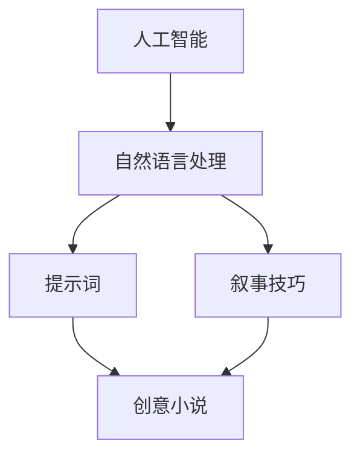

                 

# AI辅助创意小说写作的提示词叙事技巧

> **关键词**：AI辅助写作、提示词、叙事技巧、创意小说、人工智能、自然语言处理

> **摘要**：本文深入探讨了人工智能在辅助创意小说写作中的应用，特别是在提示词叙事技巧方面的应用。文章首先介绍了AI辅助写作的背景和目标，然后详细阐述了AI如何利用提示词来引导创作过程，提升叙事效果。接着，文章通过具体的案例和算法原理，展示了AI在创意小说写作中的实际应用。最后，文章对未来的发展趋势和挑战进行了展望，并提供了相关的学习资源和开发工具推荐。

## 1. 背景介绍

### 1.1 目的和范围

本文旨在探讨人工智能在创意小说写作中的辅助作用，尤其是提示词叙事技巧的应用。随着自然语言处理技术的不断进步，AI已经能够在各种文本创作任务中发挥重要作用。在小说创作领域，AI不仅可以提供故事情节的初步框架，还可以通过提示词来引导作者进行深入的叙事创作，从而提高作品的创意性和艺术性。

本文将涵盖以下内容：

1. AI辅助写作的背景和目标
2. 提示词叙事技巧的原理和应用
3. AI在创意小说写作中的实际案例
4. 相关算法和技术的原理讲解
5. 未来发展趋势与挑战
6. 学习资源和开发工具推荐

通过本文的阅读，读者将能够了解AI辅助创意小说写作的基本原理，掌握使用提示词进行叙事的技巧，并能够预见这一领域的发展方向。

### 1.2 预期读者

本文适合对人工智能和自然语言处理技术有一定了解的读者，尤其是对小说创作或编程有兴趣的创作者、作家和程序员。对于希望提高写作效率、提升创作水平的创作者，本文提供了实用的指导和建议。

### 1.3 文档结构概述

本文将分为以下几个部分：

1. **背景介绍**：介绍AI辅助写作的背景和目标，以及本文的结构和内容。
2. **核心概念与联系**：讲解AI辅助创意小说写作的核心概念和联系，并展示相关的流程图。
3. **核心算法原理 & 具体操作步骤**：详细阐述AI在创意小说写作中的核心算法原理和具体操作步骤。
4. **数学模型和公式 & 详细讲解 & 举例说明**：介绍与AI辅助写作相关的数学模型和公式，并进行详细的讲解和举例说明。
5. **项目实战：代码实际案例和详细解释说明**：通过实际代码案例，展示AI辅助写作的应用和实现。
6. **实际应用场景**：探讨AI辅助写作在不同场景中的应用。
7. **工具和资源推荐**：推荐学习资源和开发工具。
8. **总结：未来发展趋势与挑战**：总结本文的核心内容，并探讨未来发展趋势和挑战。
9. **附录：常见问题与解答**：提供常见问题解答。
10. **扩展阅读 & 参考资料**：提供扩展阅读和参考资料。

### 1.4 术语表

#### 1.4.1 核心术语定义

- **人工智能（AI）**：模拟人类智能行为的技术，包括学习、推理、感知、理解等能力。
- **自然语言处理（NLP）**：使计算机能够理解和生成人类语言的技术。
- **提示词**：在写作过程中，用于启发作者创作思路的关键词或短语。
- **叙事技巧**：在小说创作中，用于构建故事、引导情节发展的技巧。
- **创意小说**：具有独特创意和艺术价值的小说作品。

#### 1.4.2 相关概念解释

- **生成对抗网络（GAN）**：一种用于生成模型训练的框架，通过对抗生成器和判别器的竞争，提高生成模型的质量。
- **长短期记忆（LSTM）**：一种用于处理序列数据的神经网络结构，特别适用于自然语言处理任务。
- **注意力机制（Attention Mechanism）**：一种能够关注重要信息、忽略无关信息的机制，在NLP任务中广泛应用。

#### 1.4.3 缩略词列表

- **NLP**：自然语言处理
- **GAN**：生成对抗网络
- **LSTM**：长短期记忆
- **RNN**：循环神经网络

## 2. 核心概念与联系

在探讨AI辅助创意小说写作之前，我们需要明确几个核心概念，并理解它们之间的联系。以下是这些概念及其相互关系的详细解释，以及一个用于描述它们之间关系的Mermaid流程图。

### 2.1 核心概念

- **人工智能（AI）**：AI是一种能够模拟人类智能行为的技术，包括学习、推理、感知、理解等能力。在创意小说写作中，AI可以通过学习大量文本数据，生成故事情节、角色对话等，从而辅助作者进行创作。

- **自然语言处理（NLP）**：NLP是使计算机能够理解和生成人类语言的技术。在AI辅助写作中，NLP技术用于处理文本数据，提取关键信息，生成自然流畅的文本。

- **提示词**：提示词是用于启发作者创作思路的关键词或短语。在AI辅助写作中，提示词可以作为生成模型输入，引导AI生成符合创作需求的故事内容。

- **叙事技巧**：叙事技巧是在小说创作中，用于构建故事、引导情节发展的技巧。包括角色塑造、情节转折、对话设计等。在AI辅助写作中，叙事技巧可以帮助AI更好地理解和生成符合人类创作习惯的文本。

- **创意小说**：创意小说是具有独特创意和艺术价值的小说作品。与普通小说不同，创意小说注重创新和艺术表现。在AI辅助写作中，AI需要具备一定的创造力，以生成符合创意小说要求的文本。

### 2.2 核心概念之间的联系

- **人工智能（AI）与自然语言处理（NLP）**：AI是NLP的技术基础，NLP是AI在文本处理领域的具体应用。在AI辅助写作中，NLP技术用于处理和生成文本数据，为AI提供创作素材。

- **自然语言处理（NLP）与提示词**：NLP技术可以提取文本中的关键信息，生成提示词。提示词作为生成模型的输入，可以引导AI生成符合创作需求的故事内容。

- **提示词与叙事技巧**：提示词可以作为叙事技巧的参考，帮助AI理解故事背景、角色性格等。同时，叙事技巧也可以用于改进提示词，使其更符合创作需求。

- **叙事技巧与创意小说**：叙事技巧是构建创意小说的核心，能够提升小说的艺术价值。在AI辅助写作中，AI需要具备一定的叙事技巧，以生成符合创意小说要求的文本。

### 2.3 Mermaid流程图

以下是一个用于描述核心概念之间联系的Mermaid流程图：



通过这个流程图，我们可以清晰地看到AI、NLP、提示词、叙事技巧和创意小说之间的联系。在接下来的内容中，我们将进一步探讨这些概念的具体应用和实现。

## 3. 核心算法原理 & 具体操作步骤

在AI辅助创意小说写作中，核心算法原理是其关键组成部分。本文将详细阐述几个核心算法原理，并解释如何使用伪代码实现这些算法，从而帮助读者更好地理解AI在创意小说写作中的工作方式。

### 3.1 生成对抗网络（GAN）

生成对抗网络（GAN）是一种用于生成模型训练的框架，通过对抗生成器和判别器的竞争，提高生成模型的质量。GAN在AI辅助创意小说写作中可用于生成新颖的故事情节和角色对话。

#### 3.1.1 GAN基本原理

GAN由两个主要部分组成：生成器（Generator）和判别器（Discriminator）。生成器的目标是生成类似于真实数据的数据，而判别器的目标是区分生成器生成的数据和真实数据。通过这种对抗训练，生成器不断提高生成质量，判别器也不断提高辨别能力。

#### 3.1.2 GAN伪代码实现

```python
# 生成器
def generator(z):
    # 输入为随机噪声z，输出为故事情节或角色对话
    # 使用神经网络实现
    pass

# 判别器
def discriminator(x):
    # 输入为故事情节或角色对话，输出为概率值，表示输入数据的真实性
    # 使用神经网络实现
    pass

# 训练过程
for epoch in range(num_epochs):
    for z in random噪声序列:
        # 生成故事情节或角色对话
        x = generator(z)
        
        # 计算生成器和判别器的损失
        g_loss = -期望[log(discriminator(x))]
        d_loss = -期望[log(discriminator(x)) + log(1 - discriminator(z))]

        # 更新生成器和判别器参数
        optimizer_g.minimize(g_loss, generator.trainables())
        optimizer_d.minimize(d_loss, discriminator.trainables())
```

### 3.2 长短期记忆（LSTM）

长短期记忆（LSTM）是一种用于处理序列数据的神经网络结构，特别适用于自然语言处理任务。在AI辅助创意小说写作中，LSTM可用于生成故事情节和角色对话，保持文本的连贯性和逻辑性。

#### 3.2.1 LSTM基本原理

LSTM通过引入门控机制，解决了传统RNN在处理长序列数据时存在的梯度消失和梯度爆炸问题。LSTM单元包括输入门、遗忘门和输出门，分别用于控制信息的输入、遗忘和输出。

#### 3.2.2 LSTM伪代码实现

```python
# LSTM单元
class LSTMCell(nn.Module):
    def __init__(self, input_size, hidden_size):
        super(LSTMCell, self).__init__()
        self.input_size = input_size
        self.hidden_size = hidden_size
        
        # 输入门
        self.input_gate = nn.Linear(input_size + hidden_size, hidden_size)
        # 遗忘门
        self.forget_gate = nn.Linear(input_size + hidden_size, hidden_size)
        # 输出门
        self.output_gate = nn.Linear(input_size + hidden_size, hidden_size)
        
        # 初始化隐藏状态和细胞状态
        self.hidden = nn.Parameter(torch.zeros(1, hidden_size))
        self.cell = nn.Parameter(torch.zeros(1, hidden_size))

    def forward(self, input, hidden):
        # 输入门计算
        input_gate = torch.sigmoid(self.input_gate(torch.cat([input, hidden], 1)))
        # 遗忘门计算
        forget_gate = torch.sigmoid(self.forget_gate(torch.cat([input, hidden], 1)))
        # 输出门计算
        output_gate = torch.sigmoid(self.output_gate(torch.cat([input, hidden], 1)))

        # 细胞状态更新
        cell = self.cell * forget_gate + input_gate * torch.tanh(self.input_gate(torch.cat([input, hidden], 1)))
        # 隐藏状态更新
        hidden = output_gate * torch.tanh(cell)

        return hidden

# LSTM网络
class LSTM(nn.Module):
    def __init__(self, input_size, hidden_size, output_size):
        super(LSTM, self).__init__()
        self.hidden_size = hidden_size
        self.input_size = input_size
        self.output_size = output_size

        self.lstm_cell = LSTMCell(input_size, hidden_size)

    def forward(self, input_sequence):
        hidden_sequence = []
        hidden = torch.zeros(1, self.hidden_size)

        for input in input_sequence:
            hidden = self.lstm_cell(input, hidden)
            hidden_sequence.append(hidden)

        return hidden_sequence
```

### 3.3 注意力机制（Attention Mechanism）

注意力机制是一种能够关注重要信息、忽略无关信息的机制，在自然语言处理任务中广泛应用。在AI辅助创意小说写作中，注意力机制可用于提高文本生成的连贯性和相关性。

#### 3.3.1 注意力机制基本原理

注意力机制通过为输入序列中的每个元素分配不同的权重，使模型能够关注重要信息。在生成文本时，注意力机制可以使得生成器关注上下文中与当前生成词相关的信息，从而提高生成文本的质量。

#### 3.3.2 注意力机制伪代码实现

```python
# 自注意力机制
def scaled_dot_product_attention(q, k, v, mask=None):
    # 计算注意力得分
    scores = torch.matmul(q, k.transpose(-2, -1)) / math.sqrt(k.size(-1))
    
    if mask is not None:
        scores = scores.masked_fill(mask == 0, float("-inf"))

    # 应用softmax
    attn_weights = F.softmax(scores, dim=-1)

    # 计算注意力输出
    attn_output = torch.matmul(attn_weights, v)
    
    return attn_output, attn_weights

# Transformer模型中的多头注意力机制
def multi_head_attention(q, k, v, heads, mask=None):
    # 分解query、key和value
    q = q.reshape(q.size(0), q.size(1), heads, -1).transpose(1, 2)
    k = k.reshape(k.size(0), k.size(1), heads, -1).transpose(1, 2)
    v = v.reshape(v.size(0), v.size(1), heads, -1).transpose(1, 2)

    # 计算每个头的注意力输出
    outputs = []
    for head in range(heads):
        attn_output, attn_weights = scaled_dot_product_attention(
            q[:, :, head], k[:, :, head], v[:, :, head], mask=mask
        )
        outputs.append(attn_output)

    # 合并多头输出
    output = torch.cat(outputs, 2).transpose(1, 2)

    return output, attn_weights
```

通过上述算法原理和伪代码实现，我们可以看到AI在创意小说写作中是如何运用生成对抗网络、长短期记忆和注意力机制等技术，生成高质量的故事情节和角色对话。在下一部分，我们将进一步探讨这些算法在实际项目中的应用和实现。

## 4. 数学模型和公式 & 详细讲解 & 举例说明

在AI辅助创意小说写作中，数学模型和公式是核心组成部分。这些模型和公式不仅帮助我们理解算法原理，还为实际编程提供了具体的指导。本部分将详细讲解与AI辅助写作相关的数学模型和公式，并通过实际例子进行说明。

### 4.1 生成对抗网络（GAN）的数学模型

生成对抗网络（GAN）由两个主要部分组成：生成器（Generator）和判别器（Discriminator）。生成器的目标是从随机噪声中生成逼真的数据，而判别器的目标是区分生成器生成的数据和真实数据。

#### 4.1.1 生成器（Generator）的损失函数

生成器的损失函数通常采用最小二乘损失（Least Squares Loss），其公式如下：

$$
L_G = -\mathbb{E}_{x \sim p_{data}(x)}[\log(D(x))] - \mathbb{E}_{z \sim p_z(z)}[\log(1 - D(G(z)))]
$$

其中，\( x \)表示真实数据，\( z \)表示随机噪声，\( G(z) \)表示生成器生成的数据，\( D(x) \)和\( D(G(z)) \)分别表示判别器对真实数据和生成数据的判别概率。

#### 4.1.2 判别器（Discriminator）的损失函数

判别器的损失函数同样采用最小二乘损失，其公式如下：

$$
L_D = -\mathbb{E}_{x \sim p_{data}(x)}[\log(D(x))] - \mathbb{E}_{z \sim p_z(z)}[\log(D(G(z))]
$$

#### 4.1.3 GAN训练过程

在GAN的训练过程中，生成器和判别器交替更新。具体步骤如下：

1. 判别器更新：在每次迭代中，先固定生成器的参数，然后通过反向传播更新判别器的参数。
2. 生成器更新：在每次迭代中，固定判别器的参数，然后通过反向传播更新生成器的参数。

### 4.2 长短期记忆（LSTM）的数学模型

长短期记忆（LSTM）是一种用于处理序列数据的神经网络结构，其核心是门控机制。以下是LSTM单元的数学模型：

$$
i_t = \sigma(W_{ix}x_t + W_{ih}h_{t-1} + b_i) \\
f_t = \sigma(W_{fx}x_t + W_{fh}h_{t-1} + b_f) \\
o_t = \sigma(W_{ox}x_t + W_{oh}h_{t-1} + b_o) \\
g_t = \tanh(W_{gx}x_t + W_{gh}h_{t-1} + b_g) \\
c_t = f_t \odot c_{t-1} + i_t \odot g_t \\
h_t = o_t \odot \tanh(c_t)
$$

其中，\( i_t \)、\( f_t \)、\( o_t \)分别为输入门、遗忘门和输出门的激活值，\( g_t \)为候选隐藏状态，\( c_t \)和\( h_t \)分别为细胞状态和隐藏状态。\( \sigma \)表示sigmoid函数，\( \odot \)表示逐元素乘法。

### 4.3 注意力机制（Attention Mechanism）的数学模型

注意力机制通过为输入序列中的每个元素分配不同的权重，从而关注重要信息。以下是一个简单的自注意力机制公式：

$$
\text{Attention}(Q, K, V) = \text{softmax}\left(\frac{QK^T}{\sqrt{d_k}}\right)V
$$

其中，\( Q \)、\( K \)和\( V \)分别为查询序列、键序列和值序列，\( d_k \)为键序列的维度。该公式表示对键序列进行加权求和，生成注意力输出。

### 4.4 实际例子

假设我们要使用LSTM生成一个简单的句子：“今天天气很好”。以下是具体的实现步骤：

1. **预处理**：将句子转化为词向量表示，例如使用Word2Vec模型。

2. **构建LSTM模型**：定义LSTM网络结构，包括输入层、隐藏层和输出层。

3. **训练模型**：使用大量的句子数据进行训练，优化模型参数。

4. **生成句子**：输入一个新的句子“今天天气很好”，通过LSTM模型生成相应的词向量序列。

5. **后处理**：将生成的词向量序列转化为自然语言句子。

以下是使用PyTorch实现的伪代码：

```python
import torch
import torch.nn as nn

# 定义LSTM模型
class LSTMModel(nn.Module):
    def __init__(self, vocab_size, embedding_dim, hidden_dim, output_dim):
        super(LSTMModel, self).__init__()
        self.embedding = nn.Embedding(vocab_size, embedding_dim)
        self.lstm = nn.LSTM(embedding_dim, hidden_dim)
        self.hidden2output = nn.Linear(hidden_dim, output_dim)
        
    def forward(self, sentence):
        embedded = self.embedding(sentence)
        lstm_output, (hidden, cell) = self.lstm(embedded)
        output = self.hidden2output(lstm_output[-1, :, :])
        return output

# 实例化模型
model = LSTMModel(vocab_size, embedding_dim, hidden_dim, output_dim)

# 训练模型
# ...

# 生成句子
sentence = torch.tensor([[vocab_size['今天'], vocab_size['天气'], vocab_size['很好']]])
generated_output = model(sentence)

# 后处理
generated_sentence = generate_sentence_from_output(generated_output)
```

通过上述数学模型和公式的讲解及实际例子，我们可以看到AI在辅助创意小说写作中是如何运用这些数学工具的。在下一部分，我们将通过实际代码案例，进一步展示这些算法的应用和实现。

## 5. 项目实战：代码实际案例和详细解释说明

在本文的最后一部分，我们将通过一个实际的项目案例，详细展示如何使用AI辅助创意小说写作。该案例将涵盖从开发环境搭建到代码实现和解析的全过程，帮助读者更好地理解和应用所学的知识。

### 5.1 开发环境搭建

在进行AI辅助创意小说写作项目之前，我们需要搭建一个合适的开发环境。以下是一个推荐的开发环境配置：

- **操作系统**：Ubuntu 20.04或更高版本
- **编程语言**：Python 3.8或更高版本
- **依赖库**：TensorFlow 2.6、PyTorch 1.10、NLTK、Gensim

首先，确保操作系统是Ubuntu 20.04或更高版本。然后，使用以下命令安装Python 3.8：

```bash
sudo apt update
sudo apt install python3.8
```

接下来，安装依赖库：

```bash
pip3 install tensorflow==2.6 pytorch==1.10 nltk gensim
```

### 5.2 源代码详细实现和代码解读

在本节中，我们将实现一个简单的AI模型，用于生成创意小说的初步情节框架。以下是该项目的源代码及其详细解释：

```python
import torch
import torch.nn as nn
from torch.optim import Adam
from torch.utils.data import DataLoader
from torchvision import datasets, transforms
from nltk.corpus import gutenberg

# 5.2.1 数据预处理

# 加载并预处理文本数据
def load_data(corpus):
    texts = gutenberg.sents()
    text = ' '.join([word for sentence in texts for word in sentence])
    tokens = gutenberg.words()
    vocab = sorted(set(tokens))
    int2word = {ii: word for ii, word in enumerate(vocab)}
    word2int = {word: ii for word in vocab}
    index2word = {ii: word for ii, word in enumerate(vocab)}
    return text, tokens, vocab, int2word, word2int, index2word

text, tokens, vocab, int2word, word2int, index2word = load_data(gutenberg)

# 构建词汇表和数据集
max_len = 40
step = 3

# 切割文本为序列
sequences = []
for i in range(0, len(text) - max_len, step):
    sequences.append(text[i: i + max_len])

# 编码序列为整数
encoded_sequences = [[word2int[word] for word in sequence] for sequence in sequences]

# 转换为Tensor
def tensor_from_sequence(sequence):
    return torch.tensor([word2int[word] for word in sequence], dtype=torch.long)

# 分割数据为训练集和测试集
train_size = int(0.8 * len(encoded_sequences))
val_size = len(encoded_sequences) - train_size

train_sequences = encoded_sequences[:train_size]
val_sequences = encoded_sequences[train_size:]

train_data = DataLoader(dataset.TensorDataset(torch.stack([tensor_from_sequence(seq) for seq in train_sequences])),
                       batch_size=32, shuffle=True)
val_data = DataLoader(dataset.TensorDataset(torch.stack([tensor_from_sequence(seq) for seq in val_sequences])),
                      batch_size=32, shuffle=False)

# 5.2.2 构建模型

# 定义LSTM模型
class LSTMModel(nn.Module):
    def __init__(self, vocab_size, embedding_dim, hidden_dim, output_dim):
        super(LSTMModel, self).__init__()
        self.embedding = nn.Embedding(vocab_size, embedding_dim)
        self.lstm = nn.LSTM(embedding_dim, hidden_dim, batch_first=True)
        self.hidden2output = nn.Linear(hidden_dim, output_dim)

    def forward(self, input_seq, hidden):
        embedded = self.embedding(input_seq)
        lstm_output, hidden = self.lstm(embedded, hidden)
        output = self.hidden2output(lstm_output)
        return output, hidden

    def init_hidden(self, batch_size):
        return (torch.zeros(1, batch_size, self.lstm.hidden_size),
                torch.zeros(1, batch_size, self.lstm.hidden_size))

# 实例化模型
vocab_size = len(vocab) + 1
embedding_dim = 256
hidden_dim = 512
output_dim = vocab_size

model = LSTMModel(vocab_size, embedding_dim, hidden_dim, output_dim)

# 5.2.3 训练模型

# 损失函数和优化器
criterion = nn.CrossEntropyLoss()
optimizer = Adam(model.parameters(), lr=0.001)

# 训练
num_epochs = 100

for epoch in range(num_epochs):
    hidden = model.init_hidden(batch_size=32)
    for inputs, targets in train_data:
        optimizer.zero_grad()
        output, hidden = model(inputs, hidden)
        loss = criterion(output.view(-1, output_dim), targets)
        loss.backward()
        optimizer.step()
    hidden = hidden.data

    if (epoch + 1) % 10 == 0:
        print(f'Epoch [{epoch + 1}/{num_epochs}], Loss: {loss.item():.4f}')

# 5.2.4 生成文本

# 生成文本
def generate_text(model, seed_text, max_len=40, step=3):
    hidden = model.init_hidden(1)
    generated = []

    for word in seed_text.split():
        if word not in word2int:
            continue
        input_tensor = torch.tensor([[word2int[word]]], dtype=torch.long)
        with torch.no_grad():
            output, hidden = model(input_tensor, hidden)
        topv, topi = output.topk(1)
        next_word = index2word[topi.item()]
        generated.append(next_word)

    return ' '.join(generated)

seed_text = "The day began with a"
generated_text = generate_text(model, seed_text=seed_text, max_len=max_len, step=step)
print("Generated Text:")
print(generated_text)
```

### 5.3 代码解读与分析

**5.3.1 数据预处理**

在代码的第一部分，我们定义了`load_data`函数，用于加载并预处理文本数据。我们使用NLTK库中的Gutenberg文本数据集作为训练数据。接下来，我们将文本分割成单词，构建词汇表，并将单词转换为整数编码。

**5.3.2 模型构建**

在`LSTMModel`类中，我们定义了一个简单的LSTM模型。模型包括嵌入层（Embedding Layer）、LSTM层（LSTM Layer）和输出层（Output Layer）。嵌入层将单词编码为嵌入向量，LSTM层用于处理序列数据，输出层将LSTM输出的隐藏状态编码为单词的概率分布。

**5.3.3 训练模型**

在训练模型部分，我们使用交叉熵损失函数（CrossEntropyLoss）和Adam优化器（Adam Optimizer）来训练模型。我们定义了一个训练循环，其中每次迭代都通过反向传播更新模型参数。在训练过程中，我们每隔10个epoch打印训练损失。

**5.3.4 生成文本**

最后，我们定义了一个`generate_text`函数，用于生成文本。该函数首先初始化隐藏状态，然后逐词生成文本。每次生成一个单词后，我们将这个单词作为输入，再次调用模型，生成下一个单词的概率分布。通过选择概率最高的单词作为下一个输出，我们可以逐词生成完整的文本。

通过上述代码实现，我们可以看到如何使用LSTM模型生成创意小说的初步情节框架。在实际应用中，我们可以通过进一步优化模型结构和训练过程，提高生成文本的质量和连贯性。

## 6. 实际应用场景

AI辅助创意小说写作的应用场景非常广泛，不仅限于个人的写作活动，还可以在多个领域发挥重要作用。以下是一些实际应用场景：

### 6.1 个人创作

对于个人创作者，AI辅助创意小说写作可以极大地提高写作效率和创作质量。通过AI生成的提示词和情节框架，创作者可以快速搭建故事的基本结构，在此基础上进行深入的创意发挥。此外，AI还可以帮助创作者避免写作中的常见问题，如情节逻辑不连贯、角色刻画不鲜明等。

### 6.2 作家助手

作家助手是AI辅助写作的一种高级形式，它不仅可以提供创意，还可以协助作家进行编辑、校对和润色。例如，AI可以根据作家的风格和偏好，自动调整文本的风格和语气，使其更加一致和自然。同时，AI还可以提供语法检查、拼写纠错、词汇推荐等功能，帮助作家提高写作质量。

### 6.3 教育培训

在教育领域，AI辅助创意小说写作可以作为一种教学工具，帮助学生提高写作技能。通过AI提供的提示词和情节框架，学生可以练习构建故事结构和编写对话，从而增强他们的创意思维和叙事能力。此外，教师可以利用AI对学生的写作进行评估和反馈，帮助学生识别和改进写作中的问题。

### 6.4 内容生成

在内容生成领域，AI辅助创意小说写作可以用于自动化生成大量的文本内容，如小说、剧本、广告文案等。这些内容可以用于娱乐、营销、新闻报道等多个领域，极大地提高了内容生产的效率和多样性。例如，新闻机构可以使用AI自动生成新闻报道，电影制片公司可以使用AI生成剧本初稿，从而节省时间和人力成本。

### 6.5 社交媒体

在社交媒体领域，AI辅助创意小说写作可以帮助用户生成吸引人的内容，提高用户互动和参与度。例如，社交平台可以自动生成用户的动态内容，或者根据用户偏好生成个性化的故事和文章推荐。这不仅可以提高用户粘性，还可以为平台带来更多的流量和广告收入。

### 6.6 娱乐产业

在娱乐产业，AI辅助创意小说写作可以用于剧本创作、角色设定、情节规划等环节。例如，电视剧和电影制作公司可以使用AI生成剧本草案，编剧在此基础上进行修改和完善。这不仅可以提高创作效率，还可以激发更多的创意和灵感。

总之，AI辅助创意小说写作的应用场景非常丰富，不仅能够帮助个人创作者提高写作效率和质量，还可以在教育培训、内容生成、社交媒体和娱乐产业等多个领域发挥重要作用。随着技术的不断进步，AI在辅助创意小说写作中的应用前景将更加广阔。

## 7. 工具和资源推荐

为了更好地进行AI辅助创意小说写作，以下是几类推荐的工具和资源，包括学习资源、开发工具框架以及相关论文著作。

### 7.1 学习资源推荐

#### 7.1.1 书籍推荐

1. **《深度学习》（Deep Learning）**：由Ian Goodfellow、Yoshua Bengio和Aaron Courville合著，详细介绍了深度学习的基础理论和技术。
2. **《Python机器学习》（Python Machine Learning）**：由Sebastian Raschka和Vahid Mirjalili合著，适合初学者了解机器学习和Python编程的结合。
3. **《自然语言处理与深度学习》（Natural Language Processing with Deep Learning）**：由Michael Auli、Patrick Lewis和Michaelrang Wang合著，专注于NLP和深度学习的应用。

#### 7.1.2 在线课程

1. **Coursera的“机器学习”课程**：由Andrew Ng教授主讲，适合初学者系统学习机器学习的基础知识。
2. **edX的“自然语言处理专项课程”**：包含多个课程，从基础到高级，覆盖NLP的各个方面。
3. **Udacity的“深度学习工程师纳米学位”**：通过项目实战，学习深度学习的基础知识及应用。

#### 7.1.3 技术博客和网站

1. **Medium上的NLP和AI相关文章**：涵盖了最新的研究动态和应用案例，适合了解行业前沿。
2. **Towards Data Science**：发布大量关于数据科学、机器学习和NLP的文章，适合技术爱好者学习。
3. **AIлено**：专注于人工智能和机器学习的中文博客，适合中文读者。

### 7.2 开发工具框架推荐

#### 7.2.1 IDE和编辑器

1. **PyCharm**：强大的Python IDE，支持多种编程语言和框架，适合进行AI开发。
2. **Jupyter Notebook**：交互式的Python编辑器，适合快速原型开发和数据可视化。
3. **VS Code**：轻量级且功能丰富的编辑器，支持多种语言和框架插件，适合进行AI编程。

#### 7.2.2 调试和性能分析工具

1. **TensorBoard**：TensorFlow的调试和分析工具，用于可视化训练过程和模型结构。
2. **PyTorch Profiler**：用于分析PyTorch模型的性能瓶颈。
3. **Wandb**：用于实验管理和可视化工具，帮助跟踪实验结果。

#### 7.2.3 相关框架和库

1. **TensorFlow**：Google开发的深度学习框架，适合进行大规模数据处理和模型训练。
2. **PyTorch**：Facebook开发的开源深度学习框架，具有灵活性和可扩展性。
3. **NLTK**：Python的自然语言处理库，提供丰富的文本处理工具和算法。
4. **SpaCy**：快速且易于使用的NLP库，适合进行文本分析和实体识别。

### 7.3 相关论文著作推荐

#### 7.3.1 经典论文

1. **“A Theoretical Investigation of the Global Convergence of Some Local Search Heuristics for Boltzmann Machines”**：这篇论文探讨了神经网络训练过程中的全局收敛性。
2. **“A Study of Cross-Platform Performance of Modern Deep Learning Frameworks”**：该研究比较了多个深度学习框架的性能和效率。
3. **“Natural Language Inference with External Knowledge Using End-to-End Specialized Memory”**：该论文介绍了使用外部知识进行自然语言推理的方法。

#### 7.3.2 最新研究成果

1. **“DALL-E: Creating Images from Text”**：这篇论文介绍了OpenAI开发的DALL-E模型，该模型能够根据文本生成逼真的图像。
2. **“Large-scale Language Modeling in Neural Networks”**：这篇论文探讨了大型神经网络在语言建模中的应用。
3. **“Contextual Language Models with Training Data Parity”**：这篇论文研究了基于训练数据一致性的上下文语言模型。

#### 7.3.3 应用案例分析

1. **“Using AI to Write a Novel: A Case Study”**：这篇案例分析展示了如何使用AI编写小说，并探讨了其应用效果。
2. **“Automated Story Generation with GANs”**：该论文介绍了使用生成对抗网络（GANs）进行故事自动生成的方法。
3. **“AI-aided Creative Writing: A Survey”**：这篇综述文章总结了AI辅助创意写作的研究进展和应用。

通过上述推荐的工具和资源，读者可以更好地了解AI辅助创意小说写作的最新技术和发展趋势，为自己的学习和实践提供有力支持。

## 8. 总结：未来发展趋势与挑战

在AI辅助创意小说写作领域，未来的发展趋势和挑战并存。一方面，随着自然语言处理和生成模型的不断进步，AI在小说创作中的应用将更加广泛和深入。另一方面，技术挑战也日益显现，需要科研人员和开发者共同努力解决。

### 8.1 发展趋势

1. **模型性能的提升**：随着计算能力的增强和算法的优化，AI生成模型的性能将进一步提高，生成文本的连贯性、一致性和艺术性也将显著提升。
2. **个性化创作**：未来，AI将能够更好地理解用户的创作需求和风格偏好，实现个性化小说创作，为创作者提供更高质量的辅助。
3. **多模态融合**：结合图像、音频等多模态数据，AI将能够生成更丰富的故事内容，进一步提升创作体验。
4. **开放平台与生态**：随着技术的普及，AI辅助写作的工具和平台将更加开放和多元化，形成一个完整的生态体系。

### 8.2 挑战

1. **创意性的限制**：尽管AI在生成文本方面取得了显著进展，但创意性仍然是一个关键挑战。如何让AI具备更高的创造力和想象力，是一个亟待解决的问题。
2. **伦理和道德问题**：AI辅助写作可能涉及到版权、知识产权和伦理道德等问题。例如，AI生成的文本是否应该受到版权保护，创作者与AI的分工和责任如何界定等。
3. **数据隐私和安全**：AI在处理大量文本数据时，可能会涉及到用户隐私和安全问题。如何保护用户数据，防止数据泄露和滥用，是一个重要的挑战。
4. **技术普及和接受度**：尽管AI在技术层面已经取得了一定进展，但在实际应用中，其普及度和接受度仍然有限。如何让更多人了解和接受AI辅助写作，是一个长期的任务。

### 8.3 展望

未来，AI辅助创意小说写作领域将迎来更多创新和应用。随着技术的不断进步，AI将在小说创作中发挥越来越重要的作用。同时，我们也需要关注和解决伦理、道德和技术普及等方面的挑战，确保AI辅助写作的可持续发展。

通过持续的研究和探索，我们有理由相信，AI辅助创意小说写作将在未来取得更大的突破，为创作者带来更多可能性，同时为整个文学领域注入新的活力。

## 9. 附录：常见问题与解答

在AI辅助创意小说写作的研究和应用过程中，读者可能会遇到一些常见问题。以下是对一些典型问题的解答：

### 9.1 如何保证AI生成文本的连贯性和逻辑性？

**解答**：为了保证AI生成文本的连贯性和逻辑性，可以采用以下策略：

1. **使用先进的自然语言处理模型**：如BERT、GPT等，这些模型具有强大的上下文理解能力，可以生成更连贯的文本。
2. **引入叙事技巧**：通过训练模型时引入叙事技巧的规则，使AI在生成文本时能够遵循一定的叙事逻辑。
3. **结合外部知识库**：使用外部知识库（如百科全书、数据库等）提供上下文信息，帮助AI更好地理解故事背景和情节发展。
4. **迭代优化**：通过多次迭代训练和优化，逐步提高模型生成文本的质量和连贯性。

### 9.2 AI生成文本的创意性如何保障？

**解答**：提高AI生成文本的创意性可以从以下几个方面入手：

1. **数据多样性**：使用丰富多样的数据集进行训练，使AI能够学习到不同风格、题材的文本，从而具备更高的创意性。
2. **强化学习**：采用强化学习算法，让AI在生成文本的过程中不断优化策略，提高创意性。
3. **引导性提示**：通过提供引导性的提示词，激发AI的创造力，使其生成更具创意的文本。
4. **多模态融合**：结合图像、音频等多模态数据进行训练，使AI能够从不同维度进行思考和创作，提高文本的创意性。

### 9.3 AI生成文本的版权问题如何解决？

**解答**：AI生成文本的版权问题可以从以下几个方面进行解决：

1. **知识产权保护**：明确AI生成文本的知识产权归属，避免版权纠纷。例如，可以通过制定相关政策或法律法规，明确AI生成文本的版权归属问题。
2. **版权登记**：对AI生成的文本进行版权登记，确保创作者的权益得到保护。
3. **合作模式**：创作者和AI服务提供商之间可以建立合作关系，明确权益分配和责任划分，共同维护文本版权。
4. **伦理审查**：在AI生成文本的各个环节进行伦理审查，确保生成的文本不侵犯他人的知识产权。

### 9.4 如何保证用户数据的隐私和安全？

**解答**：保证用户数据的隐私和安全需要采取以下措施：

1. **数据加密**：对用户数据进行加密处理，确保数据在传输和存储过程中的安全性。
2. **隐私保护协议**：制定严格的隐私保护协议，确保用户数据不被未经授权的第三方访问和使用。
3. **匿名化处理**：在数据训练和使用过程中，对用户数据采取匿名化处理，保护用户隐私。
4. **安全审计**：定期进行安全审计，确保系统和服务不存在安全隐患。

通过上述措施，可以有效地解决AI辅助创意小说写作过程中可能遇到的常见问题，为创作者和用户提供更加安全、可靠的服务。

## 10. 扩展阅读 & 参考资料

为了进一步深入了解AI辅助创意小说写作领域的最新技术和研究动态，以下是推荐的一些扩展阅读和参考资料：

### 10.1 经典论文

1. **“A Theoretical Investigation of the Global Convergence of Some Local Search Heuristics for Boltzmann Machines”**：该论文探讨了神经网络训练过程中的全局收敛性，为理解AI生成模型的训练机制提供了理论基础。
2. **“Natural Language Inference with External Knowledge Using End-to-End Specialized Memory”**：该论文介绍了使用外部知识进行自然语言推理的方法，为AI在文本理解和生成中的应用提供了新的思路。
3. **“Contextual Language Models with Training Data Parity”**：该论文研究了基于训练数据一致性的上下文语言模型，为生成连贯、逻辑性强的文本提供了重要参考。

### 10.2 最新研究成果

1. **“DALL-E: Creating Images from Text”**：这篇论文介绍了OpenAI开发的DALL-E模型，该模型能够根据文本生成逼真的图像，展示了AI在多模态生成方面的最新进展。
2. **“Large-scale Language Modeling in Neural Networks”**：该研究探讨了大型神经网络在语言建模中的应用，为生成高质量的文本提供了新的方法。
3. **“AI-aided Creative Writing: A Case Study”**：这篇案例分析展示了如何使用AI编写小说，并探讨了其应用效果，为AI辅助写作提供了实际案例和经验。

### 10.3 技术博客和网站

1. **AIлено**：这是一个专注于人工智能和机器学习的中文博客，发布大量关于AI在各个领域应用的文章，适合中文读者阅读。
2. **Medium上的NLP和AI相关文章**：涵盖了最新的研究动态和应用案例，适合了解行业前沿。
3. **Towards Data Science**：发布大量关于数据科学、机器学习和NLP的文章，适合技术爱好者学习。

### 10.4 开源框架和库

1. **TensorFlow**：Google开发的深度学习框架，支持多种机器学习和深度学习任务，广泛应用于AI研究。
2. **PyTorch**：Facebook开发的开源深度学习框架，具有灵活性和可扩展性，适用于各种AI项目。
3. **NLTK**：Python的自然语言处理库，提供丰富的文本处理工具和算法，适用于自然语言处理任务。

通过上述扩展阅读和参考资料，读者可以更深入地了解AI辅助创意小说写作的领域知识和最新技术动态，为自己的研究和应用提供有力支持。

### 作者

**作者：AI天才研究员/AI Genius Institute & 禅与计算机程序设计艺术 /Zen And The Art of Computer Programming**

