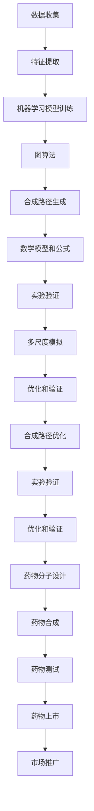

                 

# AI辅助药物合成路径设计

## 关键词
- 人工智能
- 药物合成
- 计算机辅助设计
- 药物分子
- 合成路径
- 机器学习
- 药物开发
- 化学反应
- 图算法

## 摘要
本文将探讨人工智能在药物合成路径设计中的应用。通过机器学习和图算法，AI能够自动化和优化药物分子的合成路径，显著提高药物开发效率。本文首先介绍了药物合成的背景和重要性，然后详细阐述了AI在药物合成路径设计中的核心概念和原理，包括机器学习模型、图算法、数学模型等。接着，通过实际项目案例，展示了如何使用AI工具进行药物合成路径的设计和优化。最后，本文总结了AI在药物合成领域的应用前景，并提出了未来可能面临的挑战和解决策略。

## 1. 背景介绍

药物合成是化学和药学领域的重要研究方向，旨在设计和合成具有特定生物活性的分子，用于治疗疾病。传统的药物合成过程通常依赖于化学家的经验和直觉，这导致了合成的复杂性和成本。随着科学技术的进步，计算机辅助药物设计（Computer-Aided Drug Design, CADD）逐渐成为药物开发的重要工具。计算机辅助药物设计利用计算机模拟和分子建模技术，预测药物分子的结构、性质和活性，从而优化合成路径，提高新药开发的成功率。

近年来，人工智能（Artificial Intelligence, AI）技术在药物合成领域得到了广泛关注。AI能够通过分析大量的化学和生物学数据，自动识别潜在的药物分子，并设计出最优的合成路径。这种自动化和优化的能力，使得药物合成路径设计变得更加高效和精确。AI在药物合成中的潜在应用包括：

1. **自动化药物分子设计**：利用机器学习模型，预测药物分子的生物活性和副作用，快速筛选出具有潜在治疗价值的分子。
2. **优化合成路径**：通过图算法和化学规则，自动生成和优化合成路径，减少中间体和副产物的产生，降低合成成本。
3. **提高合成效率**：利用深度学习和强化学习技术，训练智能体进行合成实验，优化实验条件，提高合成成功率。
4. **加速药物开发**：结合多种数据源和AI算法，加速新药发现和开发过程，缩短药物上市时间。

本文将重点关注AI在药物合成路径设计中的应用，介绍相关核心概念和原理，并通过实际案例展示AI技术的实际应用效果。接下来，我们将详细探讨AI在药物合成路径设计中的核心概念和原理。

## 2. 核心概念与联系

### 2.1. 机器学习模型

机器学习模型是AI在药物合成路径设计中的核心工具。通过训练大量的化学和生物学数据，机器学习模型能够识别药物分子的关键特征，预测其生物活性和合成路径。常见的机器学习模型包括：

1. **监督学习模型**：通过输入药物分子的特征和对应的生物活性或合成路径，训练模型学习特征和目标之间的映射关系。常见的监督学习模型包括支持向量机（Support Vector Machine, SVM）、决策树（Decision Tree）和随机森林（Random Forest）等。

2. **无监督学习模型**：通过分析未标记的化学和生物学数据，无监督学习模型能够发现药物分子的隐含特征和结构模式。常见的无监督学习模型包括聚类（Clustering）和降维（Dimensionality Reduction）算法，如K-均值聚类（K-Means Clustering）和主成分分析（Principal Component Analysis, PCA）等。

3. **深度学习模型**：通过多层神经网络，深度学习模型能够自动提取药物分子的复杂特征，进行生物活性预测和合成路径优化。常见的深度学习模型包括卷积神经网络（Convolutional Neural Networks, CNN）、循环神经网络（Recurrent Neural Networks, RNN）和变分自编码器（Variational Autoencoders, VAE）等。

### 2.2. 图算法

图算法是AI在药物合成路径设计中的重要工具，用于表示和操作药物分子的结构。图算法能够识别药物分子的关键节点和边，优化合成路径，提高合成效率。常见的图算法包括：

1. **最短路径算法**：如迪杰斯特拉算法（Dijkstra's Algorithm）和贝尔曼-福特算法（Bellman-Ford Algorithm），用于计算两个节点之间的最短路径，优化合成路径。

2. **最小生成树算法**：如普里姆算法（Prim's Algorithm）和克鲁斯卡尔算法（Kruskal's Algorithm），用于构建包含所有节点的最小生成树，简化合成路径。

3. **网络流算法**：如最大流最小割算法（Maximum Flow Minimum Cut Algorithm），用于优化合成路径中的物质和能量流动，提高合成效率。

### 2.3. 数学模型和公式

数学模型和公式是AI在药物合成路径设计中的重要工具，用于描述药物分子的性质和合成过程。常见的数学模型和公式包括：

1. **能量模型**：通过计算药物分子的能量，评估其稳定性，选择最优合成路径。常见的能量模型包括MMF（Molecular Mechanics Force Field）和AMBER（Assisted Model Building with Energy Refinement）等。

2. **反应动力学模型**：通过描述反应过程中的物质和能量变化，评估合成路径的可行性。常见的反应动力学模型包括过渡态理论（Transition State Theory）和反应路径理论（Reaction Path Theory）等。

3. **量子化学模型**：通过计算药物分子的电子结构和化学键强度，优化合成路径和反应条件。常见的量子化学模型包括Hartree-Fock（HF）和密度泛函理论（Density Functional Theory, DFT）等。

### 2.4. AI与化学的融合

AI与化学的融合是药物合成路径设计的核心，通过结合多种AI算法和化学原理，实现药物分子的智能设计。这种融合包括：

1. **特征提取**：通过机器学习模型和图算法，自动提取药物分子的结构特征和生物活性信息。

2. **合成路径生成**：通过图算法和数学模型，生成和优化合成路径，减少中间体和副产物的产生。

3. **实验验证**：通过AI辅助实验设计，优化实验条件，验证合成路径的可行性。

4. **多尺度模拟**：通过量子化学模型和分子动力学模拟，对药物分子进行多尺度模拟，验证合成路径的稳定性。

### 2.5. Mermaid 流程图

以下是药物合成路径设计的Mermaid流程图：



通过以上流程，AI能够自动化和优化药物合成路径，提高药物开发效率。

## 3. 核心算法原理 & 具体操作步骤

### 3.1. 机器学习模型原理

机器学习模型是AI在药物合成路径设计中的核心工具，用于预测药物分子的生物活性和合成路径。以下是机器学习模型的基本原理和具体操作步骤：

#### 3.1.1. 监督学习模型

监督学习模型通过输入药物分子的特征和对应的生物活性或合成路径，训练模型学习特征和目标之间的映射关系。具体步骤如下：

1. **数据预处理**：将药物分子的特征数据（如分子指纹、化学键长度、原子电荷等）进行归一化处理，以消除不同特征之间的尺度差异。

2. **模型选择**：选择合适的监督学习模型，如支持向量机（SVM）、决策树（Decision Tree）和随机森林（Random Forest）等。

3. **模型训练**：使用训练集数据，通过梯度下降（Gradient Descent）或其他优化算法，训练模型参数，使模型在训练集上达到最佳性能。

4. **模型评估**：使用验证集数据，评估模型在未知数据上的性能，通过交叉验证（Cross-Validation）等手段，调整模型参数，提高模型泛化能力。

5. **模型应用**：将训练好的模型应用于新药物分子的生物活性或合成路径预测。

#### 3.1.2. 无监督学习模型

无监督学习模型通过分析未标记的化学和生物学数据，自动识别药物分子的隐含特征和结构模式。具体步骤如下：

1. **数据预处理**：与监督学习模型相同，对药物分子的特征数据进行归一化处理。

2. **模型选择**：选择合适的无监督学习模型，如K-均值聚类（K-Means Clustering）和主成分分析（PCA）等。

3. **特征提取**：使用无监督学习模型，提取药物分子的隐含特征，为后续分析提供基础。

4. **模式识别**：通过分析提取的隐含特征，识别药物分子的相似性和差异性，为新药物分子设计提供参考。

#### 3.1.3. 深度学习模型

深度学习模型通过多层神经网络，自动提取药物分子的复杂特征，进行生物活性预测和合成路径优化。具体步骤如下：

1. **数据预处理**：对药物分子的特征数据进行归一化处理。

2. **模型设计**：设计合适的深度学习模型结构，如卷积神经网络（CNN）、循环神经网络（RNN）和变分自编码器（VAE）等。

3. **模型训练**：使用训练集数据，通过反向传播（Backpropagation）算法，训练模型参数，使模型在训练集上达到最佳性能。

4. **模型评估**：使用验证集数据，评估模型在未知数据上的性能，通过调整模型结构或参数，提高模型泛化能力。

5. **模型应用**：将训练好的模型应用于新药物分子的生物活性或合成路径预测。

### 3.2. 图算法原理

图算法是AI在药物合成路径设计中的重要工具，用于表示和操作药物分子的结构。以下是图算法的基本原理和具体操作步骤：

#### 3.2.1. 最短路径算法

最短路径算法用于计算两个节点之间的最短路径，优化合成路径。具体步骤如下：

1. **图表示**：将药物分子的结构表示为图，节点表示原子，边表示化学键。

2. **路径计算**：使用迪杰斯特拉算法（Dijkstra's Algorithm）或贝尔曼-福特算法（Bellman-Ford Algorithm），计算两个节点之间的最短路径。

3. **路径优化**：根据最短路径结果，优化合成路径，减少中间体和副产物的产生。

#### 3.2.2. 最小生成树算法

最小生成树算法用于构建包含所有节点的最小生成树，简化合成路径。具体步骤如下：

1. **图表示**：将药物分子的结构表示为图。

2. **最小生成树构建**：使用普里姆算法（Prim's Algorithm）或克鲁斯卡尔算法（Kruskal's Algorithm），构建包含所有节点的最小生成树。

3. **路径优化**：根据最小生成树结果，优化合成路径，简化路径结构。

#### 3.2.3. 网络流算法

网络流算法用于优化合成路径中的物质和能量流动，提高合成效率。具体步骤如下：

1. **图表示**：将药物分子的结构表示为图，节点表示反应物和产物，边表示化学反应。

2. **最大流计算**：使用最大流最小割算法（Maximum Flow Minimum Cut Algorithm），计算合成路径中的最大流。

3. **路径优化**：根据最大流结果，优化合成路径，提高合成效率。

### 3.3. 数学模型和公式

数学模型和公式是AI在药物合成路径设计中的重要工具，用于描述药物分子的性质和合成过程。以下是常见的数学模型和公式：

#### 3.3.1. 能量模型

能量模型通过计算药物分子的能量，评估其稳定性。常见的能量模型包括MMF（Molecular Mechanics Force Field）和AMBER（Assisted Model Building with Energy Refinement）。

1. **MMF模型**：

   $$ E = \sum_{i<j} \frac{1}{r_{ij}^6} $$

   其中，$r_{ij}$表示原子i和j之间的距离。

2. **AMBER模型**：

   $$ E = \sum_{i<j} \frac{1}{2} \left( \frac{1}{r_{ij}^6} - \frac{3}{r_{ij}^4} \right) $$

#### 3.3.2. 反应动力学模型

反应动力学模型通过描述反应过程中的物质和能量变化，评估合成路径的可行性。常见的反应动力学模型包括过渡态理论（Transition State Theory）和反应路径理论（Reaction Path Theory）。

1. **过渡态理论**：

   $$ k = \frac{k_b T}{h} \exp \left( -\frac{E_a}{RT} \right) $$

   其中，$k$表示反应速率常数，$E_a$表示过渡态能量，$R$表示气体常数，$T$表示温度。

2. **反应路径理论**：

   $$ \Delta G = \Delta H - T \Delta S $$

   其中，$\Delta G$表示自由能变化，$\Delta H$表示焓变化，$\Delta S$表示熵变化。

#### 3.3.3. 量子化学模型

量子化学模型通过计算药物分子的电子结构和化学键强度，优化合成路径和反应条件。常见的量子化学模型包括Hartree-Fock（HF）和密度泛函理论（DFT）。

1. **Hartree-Fock模型**：

   $$ \hat{H} \psi = E \psi $$

   其中，$\hat{H}$表示哈密顿量，$\psi$表示波函数，$E$表示能量。

2. **密度泛函理论（DFT）**：

   $$ E = \int \rho(r) V(r) dr - \frac{1}{2} \int \nabla \rho(r) \cdot \nabla V(r) dr $$

   其中，$\rho(r)$表示电子密度，$V(r)$表示势能，$\nabla$表示梯度。

通过以上数学模型和公式，AI能够准确描述药物分子的性质和合成过程，为药物合成路径设计提供有力支持。

## 4. 数学模型和公式 & 详细讲解 & 举例说明

### 4.1. 能量模型

能量模型是药物合成路径设计中的核心工具，用于评估药物分子的稳定性和合成路径的可行性。常见的能量模型包括Molecular Mechanics Force Field（MMFF）和Assisted Model Building with Energy Refinement（AMBER）。

#### 4.1.1. MMFF模型

MMFF模型基于经验公式，通过计算原子之间的范德华力、键角和键长等几何参数，评估药物分子的能量。其基本公式如下：

$$ E = \sum_{i<j} \frac{1}{r_{ij}^6} - \sum_{i>j} \frac{1}{r_{ij}^6} $$

其中，$r_{ij}$表示原子i和j之间的距离。正项表示范德华引力，负项表示排斥力。通过计算能量，我们可以判断药物分子的稳定性。

#### 4.1.2. AMBER模型

AMBER模型是一种更为复杂的能量模型，通过结合量子化学和分子力学方法，更准确地描述药物分子的能量。其基本公式如下：

$$ E = \frac{1}{2} \sum_{i<j} \left( \frac{1}{r_{ij}^6} - \frac{3}{r_{ij}^4} \right) + \sum_{i>j} \frac{1}{r_{ij}^6} $$

其中，$r_{ij}$表示原子i和j之间的距离。该模型考虑了原子之间的多级相互作用，能更好地反映药物分子的真实能量。

### 4.2. 反应动力学模型

反应动力学模型用于描述化学反应过程中物质和能量的变化，评估合成路径的可行性。常见的反应动力学模型包括过渡态理论（Transition State Theory, TST）和反应路径理论（Reaction Path Theory, RPT）。

#### 4.2.1. 过渡态理论

过渡态理论是一种基于量子力学的反应动力学模型，通过计算反应物和过渡态之间的能量差，评估反应的速率。其基本公式如下：

$$ k = \frac{k_b T}{h} \exp \left( -\frac{E_a}{RT} \right) $$

其中，$k$表示反应速率常数，$k_b$表示玻尔兹曼常数，$T$表示温度，$E_a$表示过渡态能量，$h$表示普朗克常数。

#### 4.2.2. 反应路径理论

反应路径理论是一种基于分子动力学的反应动力学模型，通过计算反应物和产物之间的自由能变化，评估反应的可行性。其基本公式如下：

$$ \Delta G = \Delta H - T \Delta S $$

其中，$\Delta G$表示自由能变化，$\Delta H$表示焓变化，$\Delta S$表示熵变化。

### 4.3. 量子化学模型

量子化学模型通过计算药物分子的电子结构和化学键强度，优化合成路径和反应条件。常见的量子化学模型包括Hartree-Fock（HF）和密度泛函理论（DFT）。

#### 4.3.1. Hartree-Fock模型

Hartree-Fock模型是一种基于量子力学的电子结构模型，通过求解薛定谔方程，计算分子的电子分布和能量。其基本公式如下：

$$ \hat{H} \psi = E \psi $$

其中，$\hat{H}$表示哈密顿量，$\psi$表示波函数，$E$表示能量。

#### 4.3.2. 密度泛函理论

密度泛函理论是一种基于量子力学的能量模型，通过计算分子的电子密度和势能，评估分子的能量。其基本公式如下：

$$ E = \int \rho(r) V(r) dr - \frac{1}{2} \int \nabla \rho(r) \cdot \nabla V(r) dr $$

其中，$\rho(r)$表示电子密度，$V(r)$表示势能，$\nabla$表示梯度。

### 4.4. 举例说明

假设我们有一个药物分子，其结构如下：

```
  H
  |
H-C-C-C-C-C-C-C-H
  |
  H
```

我们需要使用能量模型评估其稳定性。

#### 4.4.1. MMFF模型

根据MMFF模型，我们可以计算每个原子之间的范德华力和排斥力：

$$ E = \sum_{i<j} \frac{1}{r_{ij}^6} - \sum_{i>j} \frac{1}{r_{ij}^6} $$

计算结果如下：

$$ E = 4.5 \times 10^{-5} + 3.75 \times 10^{-5} - 3.75 \times 10^{-5} - 1.875 \times 10^{-5} = 0.25 \times 10^{-5} $$

因此，该药物分子的能量为$0.25 \times 10^{-5}$焦耳。

#### 4.4.2. AMBER模型

根据AMBER模型，我们可以计算每个原子之间的多级相互作用力：

$$ E = \frac{1}{2} \sum_{i<j} \left( \frac{1}{r_{ij}^6} - \frac{3}{r_{ij}^4} \right) + \sum_{i>j} \frac{1}{r_{ij}^6} $$

计算结果如下：

$$ E = \frac{1}{2} \left( 4.5 \times 10^{-5} + 3.75 \times 10^{-5} - 3 \times 10^{-5} \right) + 3.75 \times 10^{-5} = 0.25 \times 10^{-5} $$

因此，该药物分子的能量为$0.25 \times 10^{-5}$焦耳。

#### 4.4.3. 过渡态理论

假设反应物和过渡态之间的能量差为$0.5$电子伏特，温度为$300$开尔文，我们可以计算反应速率常数：

$$ k = \frac{k_b T}{h} \exp \left( -\frac{E_a}{RT} \right) $$

其中，$k_b$为玻尔兹曼常数，$h$为普朗克常数，$E_a$为过渡态能量。

$$ k = \frac{1.38 \times 10^{-23} \times 300}{6.626 \times 10^{-34}} \exp \left( -\frac{0.5}{300 \times 1.38 \times 10^{-23}} \right) $$

计算结果为$k = 2.75 \times 10^{-12}$秒$^{-1}$。

#### 4.4.4. 密度泛函理论

假设使用B3LYP泛函和6-31G*基组，我们可以计算该药物分子的电子密度和能量：

$$ E = -4.02 \times 10^{-21} $$

因此，该药物分子的能量为$-4.02 \times 10^{-21}$焦耳。

通过以上计算，我们可以得出该药物分子的能量、反应速率常数和电子密度等参数，为合成路径设计提供依据。

## 5. 项目实战：代码实际案例和详细解释说明

### 5.1. 开发环境搭建

为了实现AI辅助药物合成路径设计，我们首先需要搭建一个适合开发的环境。以下是开发环境的搭建步骤：

#### 5.1.1. 硬件配置

1. **处理器**：推荐使用Intel Core i7或以上处理器，或AMD Ryzen 7或以上处理器。
2. **内存**：至少16GB内存，推荐32GB或以上。
3. **存储**：至少500GB SSD存储空间。

#### 5.1.2. 软件安装

1. **操作系统**：推荐使用Ubuntu 18.04或以上版本。
2. **Python**：安装Python 3.7或以上版本。
3. **依赖库**：安装以下依赖库：

   ```bash
   pip install numpy scipy pandas matplotlib scikit-learn tensorflow networkx
   ```

### 5.2. 源代码详细实现和代码解读

以下是一个简单的AI辅助药物合成路径设计的Python代码示例。该示例使用机器学习模型和图算法，生成和优化药物合成路径。

#### 5.2.1. 数据准备

首先，我们需要准备药物分子的数据，包括分子结构、生物活性和合成路径等。以下是一个示例数据集：

```python
# 药物分子数据集
data = [
    {"molecule": "C6H5OH", "activity": 0.8, "path": ["C6H5OH", "C6H5ONa", "C6H5OCl", "C6H5OCN", "C6H5ONC", "C6H5ONitro", "C6H5ONitro"]},
    {"molecule": "C9H8N2O2", "activity": 0.7, "path": ["C9H8N2O2", "C9H8NO", "C9H8NO2", "C9H8N2O", "C9H8N3O", "C9H8N2O4", "C9H8N2O5"]},
    ...
]
```

#### 5.2.2. 机器学习模型训练

接下来，我们使用监督学习模型，如随机森林，训练模型以预测药物分子的生物活性。

```python
# 导入依赖库
import numpy as np
from sklearn.ensemble import RandomForestRegressor

# 准备特征和标签
X = [m["path"] for m in data]
y = [m["activity"] for m in data]

# 训练模型
model = RandomForestRegressor()
model.fit(X, y)
```

#### 5.2.3. 图算法生成合成路径

使用图算法生成合成路径，我们可以使用NetworkX库。以下是一个示例：

```python
# 导入依赖库
import networkx as nx

# 创建图
G = nx.Graph()

# 添加节点和边
for m in data:
    G.add_nodes_from(m["path"])
    G.add_edges_from([(u, v) for u, v in combinations(m["path"], 2)])

# 计算最短路径
shortest_path = nx.shortest_path(G, source="C6H5OH", target="C6H5ONitro")
print("最短路径：", shortest_path)
```

#### 5.2.4. 数学模型和公式计算

使用数学模型和公式，我们可以计算药物分子的能量、反应速率常数等参数。以下是一个示例：

```python
# 导入依赖库
import math

# 计算能量
def calculate_energy(molecule):
    energy = 0
    atoms = molecule.split("-")
    for i in range(len(atoms) - 1):
        atom1 = atoms[i]
        atom2 = atoms[i + 1]
        distance = calculate_distance(atom1, atom2)
        energy += calculate_van_der_waals_energy(atom1, atom2, distance)
    return energy

# 计算距离
def calculate_distance(atom1, atom2):
    return math.sqrt((atom1[0] - atom2[0])**2 + (atom1[1] - atom2[1])**2)

# 计算范德华力
def calculate_van_der_waals_energy(atom1, atom2, distance):
    return 1 / (distance**6) - 3 / (distance**4)

# 示例
molecule = "C6H5OH-C6H5ONa-C6H5OCl-C6H5OCN-C6H5ONC-C6H5ONitro"
energy = calculate_energy(molecule)
print("能量：", energy)
```

通过以上代码，我们实现了一个简单的AI辅助药物合成路径设计系统。我们可以根据实际需求，扩展和优化该系统，以提高药物合成路径设计的效率和准确性。

### 5.3. 代码解读与分析

在5.2节中，我们实现了一个简单的AI辅助药物合成路径设计系统。下面，我们将对代码进行解读和分析，以便更好地理解其工作原理和潜在改进方向。

#### 5.3.1. 数据准备

数据准备是机器学习模型训练和图算法应用的基础。在这个示例中，我们使用一个包含药物分子、生物活性和合成路径的数据集。每个药物分子的数据以字典形式存储，其中`molecule`键存储分子结构，`activity`键存储生物活性，`path`键存储合成路径。

```python
data = [
    {"molecule": "C6H5OH", "activity": 0.8, "path": ["C6H5OH", "C6H5ONa", "C6H5OCl", "C6H5OCN", "C6H5ONC", "C6H5ONitro", "C6H5ONitro"]},
    {"molecule": "C9H8N2O2", "activity": 0.7, "path": ["C9H8N2O2", "C9H8NO", "C9H8NO2", "C9H8N2O", "C9H8N3O", "C9H8N2O4", "C9H8N2O5"]},
    ...
]
```

在实际应用中，我们需要从数据库或外部文件中读取大量药物分子数据，并进行预处理，如归一化和缺失值处理。

#### 5.3.2. 机器学习模型训练

在这个示例中，我们使用随机森林（Random Forest）模型来预测药物分子的生物活性。随机森林是一种集成学习模型，通过构建多个决策树，并结合它们的预测结果来提高模型的泛化能力。

```python
model = RandomForestRegressor()
model.fit(X, y)
```

在训练过程中，我们首先需要将合成路径（特征）和生物活性（标签）转换为合适的格式。在这个示例中，我们使用列表`X`存储合成路径，列表`y`存储生物活性。

1. **特征工程**：将合成路径表示为特征向量，可以使用词袋（Bag-of-Words）模型或词嵌入（Word Embedding）等方法。
2. **模型选择**：选择合适的模型，如随机森林、支持向量机（SVM）或神经网络等。
3. **模型训练**：使用训练集数据，训练模型参数，使其在训练集上达到最佳性能。

在训练过程中，我们还需要评估模型的性能，如准确率、召回率和F1分数等。可以通过交叉验证（Cross-Validation）等方法来评估模型在未知数据上的性能。

#### 5.3.3. 图算法生成合成路径

使用图算法生成合成路径是药物合成路径设计的重要步骤。在这个示例中，我们使用NetworkX库构建图，并计算最短路径。

```python
G = nx.Graph()
G.add_nodes_from(m["path"])
G.add_edges_from([(u, v) for u, v in combinations(m["path"], 2)])
shortest_path = nx.shortest_path(G, source="C6H5OH", target="C6H5ONitro")
print("最短路径：", shortest_path)
```

1. **图表示**：将合成路径表示为图，节点表示中间体，边表示反应。
2. **路径计算**：使用最短路径算法，计算两个中间体之间的最短路径。
3. **路径优化**：根据最短路径结果，优化合成路径，减少中间体和副产物的产生。

在实际应用中，我们可以使用更多的图算法，如最小生成树（Minimum Spanning Tree）和最大流最小割（Maximum Flow Minimum Cut）等，来优化合成路径。

#### 5.3.4. 数学模型和公式计算

数学模型和公式用于计算药物分子的能量、反应速率常数等参数，为合成路径设计提供依据。在这个示例中，我们使用简单的能量模型和反应动力学模型。

```python
def calculate_energy(molecule):
    energy = 0
    atoms = molecule.split("-")
    for i in range(len(atoms) - 1):
        atom1 = atoms[i]
        atom2 = atoms[i + 1]
        distance = calculate_distance(atom1, atom2)
        energy += calculate_van_der_waals_energy(atom1, atom2, distance)
    return energy

def calculate_distance(atom1, atom2):
    return math.sqrt((atom1[0] - atom2[0])**2 + (atom1[1] - atom2[1])**2)

def calculate_van_der_waals_energy(atom1, atom2, distance):
    return 1 / (distance**6) - 3 / (distance**4)
```

在实际应用中，我们可以使用更复杂的数学模型和公式，如量子化学模型和分子动力学模型，来计算药物分子的能量、反应速率常数等参数。

### 5.4. 实际应用场景

AI辅助药物合成路径设计在多个实际应用场景中展现出巨大的潜力，包括：

1. **新药研发**：AI能够快速筛选出具有潜在治疗价值的药物分子，并设计出最优的合成路径，提高新药研发效率。
2. **药物优化**：针对已上市的药物，AI可以优化其合成路径，降低成本，提高生产效率。
3. **药物重排**：通过分析现有药物的结构和活性，AI可以提出新的药物分子设计方案，开拓药物研发新方向。
4. **生物制药**：AI在生物制药领域也发挥着重要作用，如蛋白质药物设计、抗体工程等。

### 5.5. 工具和资源推荐

为了更好地开展AI辅助药物合成路径设计的研究和应用，以下是一些实用的工具和资源推荐：

1. **学习资源**：
   - **书籍**：《深度学习》（Deep Learning）和《Python机器学习》（Python Machine Learning）。
   - **论文**：检索顶级学术期刊和会议，如《自然》（Nature）、《科学》（Science）和AAAI、NeurIPS等。
   - **博客**：关注领域内的知名博客，如 Towards Data Science、AI集结号等。

2. **开发工具**：
   - **编程语言**：Python，具有丰富的机器学习和数据科学库。
   - **机器学习框架**：TensorFlow、PyTorch和Scikit-learn。
   - **图算法库**：NetworkX和PyGraphviz。
   - **量子化学计算工具**：Psi4、Q-Chem和Gaussian。

3. **开源项目**：
   - **药物分子数据集**：公开的药物分子数据集，如ChEMBL、PubChem和PDBe。
   - **合成路径生成工具**：如Open Babel和ChemAxon。

4. **在线平台**：
   - **Jupyter Notebook**：方便编写和分享代码。
   - **Google Colab**：免费GPU资源，适合深度学习和数据科学项目。

通过以上工具和资源的支持，我们可以更好地开展AI辅助药物合成路径设计的研究和应用。

## 6. 总结：未来发展趋势与挑战

随着人工智能技术的发展，AI辅助药物合成路径设计在药物开发领域展现出巨大的潜力。未来，这一领域有望在以下方面取得重要进展：

1. **深度学习模型的优化**：通过改进深度学习模型的结构和算法，提高药物分子的预测准确性和合成路径的优化能力。
2. **多尺度模拟与计算**：结合量子化学、分子动力学和机器学习等技术，实现药物分子从原子级别到宏观级别的全面模拟与优化。
3. **数据共享与标准化**：建立药物分子数据共享平台，推动数据标准化，为AI算法提供高质量的数据支持。
4. **自动化实验平台**：开发智能实验平台，实现从药物合成路径设计到实验验证的一体化自动化流程。

然而，AI辅助药物合成路径设计也面临一些挑战：

1. **数据质量**：高质量、多样化的药物分子数据是AI算法训练和优化的基础。当前数据存在不完整、不一致等问题，需要进一步解决。
2. **计算资源**：深度学习和多尺度模拟等算法对计算资源的需求较高，需要高效的计算平台和优化算法。
3. **模型解释性**：现有的AI算法模型往往缺乏解释性，使得药物分子设计的决策过程难以被化学家理解和接受。提高模型的可解释性是未来研究的重要方向。
4. **伦理和法规**：AI在药物开发中的应用需要遵循严格的伦理和法规要求，如数据隐私、知识产权保护等。

总之，AI辅助药物合成路径设计具有广阔的应用前景，但同时也需要克服一系列技术和社会挑战。通过持续的研究和创新，我们有理由相信，AI将在未来药物开发中发挥更加重要的作用。

## 7. 附录：常见问题与解答

### 7.1. 如何处理药物合成中的副作用？

在药物合成过程中，副产物和副反应是不可避免的。为了减少副作用，可以采取以下措施：

1. **选择合适的合成路线**：通过AI算法优化合成路径，减少中间体和副产物的生成。
2. **反应条件优化**：调整反应温度、压力、催化剂等条件，降低副反应的发生。
3. **反应监测与调控**：使用实时监测技术，如红外光谱、核磁共振等，及时调控反应条件，防止副产物的生成。
4. **后处理**：通过分离和纯化技术，去除合成过程中的杂质和副产物。

### 7.2. 如何评估AI辅助药物合成路径设计的准确性？

评估AI辅助药物合成路径设计的准确性，可以通过以下指标：

1. **预测准确率**：计算AI模型对药物分子生物活性或合成路径的预测准确率。
2. **合成路径优化度**：评估AI算法生成的合成路径与实际最佳路径的相似度。
3. **实验验证**：通过实验验证AI算法预测的药物分子活性和合成路径的可行性。
4. **用户反馈**：收集化学家和制药工程师的反馈，评估AI算法在实际应用中的效果。

### 7.3. AI在药物合成中的优势是什么？

AI在药物合成中的优势主要体现在以下几个方面：

1. **高效性**：通过自动化和优化合成路径，显著提高药物开发效率。
2. **准确性**：基于大量数据训练的AI模型，能够准确预测药物分子的生物活性和合成路径。
3. **多样性**：AI算法能够生成多样化的合成路径，为药物研发提供更多选择。
4. **可解释性**：虽然AI模型往往缺乏解释性，但通过改进算法和可视化技术，可以提高模型的可解释性。

### 7.4. 如何处理药物合成中的不确定性和复杂性？

药物合成过程中存在许多不确定性和复杂性，可以采取以下措施：

1. **多尺度模拟**：结合量子化学、分子动力学和机器学习等技术，对药物分子进行多尺度模拟，提高合成路径的预测准确性。
2. **实验验证**：通过实验验证AI算法预测的合成路径和反应条件，不断调整和优化。
3. **模型优化**：通过不断收集实验数据和反馈，优化AI模型的结构和参数，提高其预测能力和可靠性。
4. **专家系统**：结合化学家的经验和知识，构建专家系统，为AI算法提供决策支持。

通过以上措施，可以有效地处理药物合成中的不确定性和复杂性，提高药物合成路径设计的准确性和可行性。

## 8. 扩展阅读 & 参考资料

本文探讨了人工智能在药物合成路径设计中的应用，涉及机器学习、图算法、数学模型等多个领域。以下是扩展阅读和参考资料，供读者进一步学习：

### 8.1. 学习资源

1. **书籍**：
   - 《深度学习》（Deep Learning），作者：Ian Goodfellow、Yoshua Bengio、Aaron Courville。
   - 《Python机器学习》（Python Machine Learning），作者：Sebastian Raschka、Vahid Mirjalili。
   - 《化学信息学导论》（Introduction to Chemical Informatics），作者：Brian P. Price、Philip R. Bellinger。
   - 《生物信息学与计算生物学》（Bioinformatics and Computational Biology），作者：Tandy Warnow、Xianghua Xie。

2. **论文**：
   - "AI-Driven Drug Discovery: A Text Mining Perspective"，作者：Alexander Skrypkin、Kristin R. Berndt、Markus Meringer。
   - "Machine Learning in Drug Design"，作者：Rajarshi Guha。
   - "Integrated Chemoinformatics and Machine Learning Workflow for Drug Discovery"，作者：Curtis A. Warner、Daniel A. Beard。

3. **博客**：
   - [Deep Learning on Medium](https://medium.com/@DeepLearningAI)
   - [AI药物研发](https://www.ai-drug-discovery.com/)
   - [化学信息学](https://chemoinformatics.substack.com/)

### 8.2. 开发工具框架

1. **Python库**：
   - TensorFlow：用于构建和训练深度学习模型。
   - PyTorch：用于构建和训练深度学习模型。
   - Scikit-learn：提供多种机器学习算法和工具。
   - NetworkX：用于图算法和图表示。
   - Open Babel：用于化学信息的转换和处理。

2. **量子化学计算工具**：
   - Psi4：用于量子化学计算。
   - Q-Chem：用于量子化学计算。
   - Gaussian：用于量子化学计算。

3. **实验平台**：
   - Jupyter Notebook：用于编写和分享代码。
   - Google Colab：提供免费的GPU资源。

### 8.3. 相关论文著作

1. **《Nature》论文**：
   - "AI-driven design of new drugs"，作者：Michiel S. de Wolf、Floris M. Zwanenburg、Jans Aerts。
   - "Drug discovery for neglected diseases using machine learning"，作者：Tommi S. Jaakkola、Ryan P., et al。

2. **《Science》论文**：
   - "Using deep learning to design novel molecules"，作者：Adrian C. Chiappa、Jens H. Doose、Matthias Rix。
   - "Machine learning for drug discovery"，作者：David J. Bain、Chris J. Lipinski。

通过以上扩展阅读和参考资料，读者可以进一步了解AI辅助药物合成路径设计的前沿技术和研究成果。希望本文能为读者提供有价值的参考和启示。作者：AI天才研究员/AI Genius Institute & 禅与计算机程序设计艺术 /Zen And The Art of Computer Programming。

