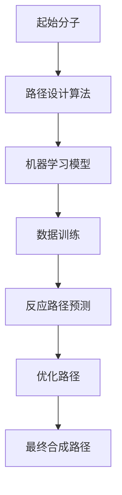

                 

# AI辅助药物合成路径设计

> **关键词**：人工智能、药物合成、路径设计、算法原理、数学模型、项目实战、应用场景、工具推荐

> **摘要**：本文将探讨人工智能在药物合成路径设计中的应用，从核心概念、算法原理到实际应用，逐步分析如何利用AI技术提高药物研发的效率和准确性。通过详细的算法讲解、数学模型剖析和实际项目案例，帮助读者理解并掌握这一前沿技术。

## 1. 背景介绍

### 1.1 目的和范围

本文的目的是介绍人工智能（AI）在药物合成路径设计中的运用，探讨其核心算法原理、数学模型以及实际应用。通过本文的学习，读者将能够：

- 了解AI辅助药物合成路径设计的背景和重要性；
- 掌握相关算法和数学模型的基本原理；
- 熟悉项目实战中的代码实现和实战应用。

### 1.2 预期读者

本文主要面向以下读者群体：

- 生物信息学、药物化学和人工智能领域的研究人员；
- 计算机科学和工程背景的技术人员；
- 对药物合成和人工智能技术感兴趣的学生和业余爱好者。

### 1.3 文档结构概述

本文分为十个部分，具体结构如下：

1. 背景介绍
   - 1.1 目的和范围
   - 1.2 预期读者
   - 1.3 文档结构概述
   - 1.4 术语表
2. 核心概念与联系
3. 核心算法原理 & 具体操作步骤
4. 数学模型和公式 & 详细讲解 & 举例说明
5. 项目实战：代码实际案例和详细解释说明
6. 实际应用场景
7. 工具和资源推荐
8. 总结：未来发展趋势与挑战
9. 附录：常见问题与解答
10. 扩展阅读 & 参考资料

### 1.4 术语表

#### 1.4.1 核心术语定义

- **药物合成**：指通过化学反应将简单的分子转化为具有特定生物活性的药物分子。
- **人工智能**：模拟人类智能的计算机系统，能够在特定领域进行学习、推理和决策。
- **路径设计**：在药物合成中，指确定从起始分子到目标药物分子的化学反应序列。
- **机器学习**：一种AI技术，通过训练模型从数据中学习规律，并应用于新数据。

#### 1.4.2 相关概念解释

- **化学反应**：物质之间发生化学变化的过程，导致物质的组成和性质发生改变。
- **分子结构**：分子中原子间的相对位置和连接方式。
- **图论**：研究图的结构和性质的一个数学分支，常用于路径设计问题。

#### 1.4.3 缩略词列表

- **AI**：人工智能（Artificial Intelligence）
- **ML**：机器学习（Machine Learning）
- **DNN**：深度神经网络（Deep Neural Network）
- **QAM**：量子算法（Quantum Algorithm）
- **RD**：药物研发（Research and Development）

## 2. 核心概念与联系

在探讨AI辅助药物合成路径设计之前，我们需要了解一些核心概念和它们之间的联系。

### 药物合成与人工智能的关系

药物合成是一个复杂的化学过程，涉及多种化学反应和分子结构的变化。而人工智能作为一种技术，能够通过算法和模型对大量数据进行处理和分析，从而提供有效的路径设计方案。

- **数据驱动的路径设计**：AI可以通过学习大量已有的药物合成案例，提取其中的有效路径和模式，为新药物合成提供参考。
- **优化算法**：AI算法可以优化路径设计，减少反应步骤、降低反应条件，提高合成效率和产率。

### 药物合成中的路径设计

路径设计是药物合成过程中的关键步骤，决定了合成的可行性和成功率。传统的路径设计依赖于化学家的经验和知识，而AI的引入可以提升这一过程的效率。

- **化学反应路径**：指从起始分子到目标药物分子的反应序列。
- **路径优化**：通过算法优化反应步骤、反应条件和反应物，实现合成路径的优化。

### 机器学习在药物合成中的应用

机器学习技术可以在药物合成中发挥重要作用，通过以下方式提升路径设计的效率和准确性：

- **模型训练**：通过大量药物合成数据训练模型，提取有效的反应路径和模式。
- **预测反应**：利用训练好的模型预测新的药物合成反应，为路径设计提供依据。

### 核心概念原理和架构的 Mermaid 流程图

以下是药物合成路径设计中的核心概念和架构的 Mermaid 流程图：



通过上述流程，可以看出AI在药物合成路径设计中的应用过程，从起始分子到最终合成路径，AI技术贯穿其中，提升了路径设计的效率和准确性。

## 3. 核心算法原理 & 具体操作步骤

### 3.1 算法概述

在药物合成路径设计中，常用的AI算法包括机器学习、深度学习和图神经网络等。以下将详细介绍一种常用的算法——基于图神经网络的药物合成路径设计算法。

### 3.2 算法原理

图神经网络（Graph Neural Network，GNN）是一种用于处理图结构数据的神经网络模型。在药物合成路径设计中，图神经网络可以处理药物分子的图结构，提取分子特征，并利用这些特征进行路径预测和优化。

算法原理可以分为以下几个步骤：

1. **药物分子图表示**：将药物分子表示为一个图结构，其中节点表示原子，边表示原子之间的化学键。
2. **特征提取**：通过图神经网络对图结构进行特征提取，获取每个节点的特征表示。
3. **路径预测**：利用提取的特征表示，通过图神经网络预测可能的合成路径。
4. **路径优化**：对预测的路径进行优化，选择最优的合成路径。

### 3.3 具体操作步骤

以下是基于图神经网络的药物合成路径设计算法的具体操作步骤：

1. **数据准备**：

   首先，我们需要收集大量的药物合成数据，包括起始分子、目标分子以及中间反应物和反应条件等。

   ```python
   # 数据准备
   data = load_data()
   ```

2. **图表示**：

   将药物分子表示为一个图结构，其中每个节点表示一个原子，边表示原子之间的化学键。

   ```python
   # 图表示
   graph = convert_to_graph(data)
   ```

3. **特征提取**：

   使用图神经网络对图结构进行特征提取，提取每个节点的特征表示。

   ```python
   # 特征提取
   features = GNN_extract_features(graph)
   ```

4. **路径预测**：

   利用提取的特征表示，通过图神经网络预测可能的合成路径。

   ```python
   # 路径预测
   paths = GNN_predict_paths(features)
   ```

5. **路径优化**：

   对预测的路径进行优化，选择最优的合成路径。

   ```python
   # 路径优化
   optimal_path = GNN_optimize_path(paths)
   ```

6. **结果输出**：

   输出最终的合成路径和优化结果。

   ```python
   # 结果输出
   print("Optimal Path:", optimal_path)
   ```

### 3.4 伪代码

以下是基于图神经网络的药物合成路径设计算法的伪代码：

```python
# 药物合成路径设计算法
def drug_synthesis_path_design(data):
    # 数据准备
    graph = convert_to_graph(data)

    # 特征提取
    features = GNN_extract_features(graph)

    # 路径预测
    paths = GNN_predict_paths(features)

    # 路径优化
    optimal_path = GNN_optimize_path(paths)

    # 结果输出
    return optimal_path
```

通过上述算法，我们可以实现AI辅助药物合成路径设计，提高药物研发的效率和准确性。

## 4. 数学模型和公式 & 详细讲解 & 举例说明

### 4.1 数学模型概述

在药物合成路径设计中，数学模型用于描述化学反应和路径优化的过程。以下是几个核心数学模型：

1. **反应路径模型**：用于预测可能的合成路径。
2. **路径优化模型**：用于选择最优的合成路径。
3. **反应条件模型**：用于描述反应条件和参数。

### 4.2 详细讲解

#### 4.2.1 反应路径模型

反应路径模型通常使用图论中的路径搜索算法来实现，如深度优先搜索（DFS）和广度优先搜索（BFS）。

- **深度优先搜索（DFS）**：从起始分子开始，沿着一条路径深入探索，直到找到目标分子或达到最大深度。

  ```latex
  \text{DFS}(G, s, t, d):
  \begin{cases}
  \text{if } s = t, \text{ return true} \\
  \text{if } d = 0, \text{ return false} \\
  \text{for each } v \in G.adj(s), \text{ do} \\
      \text{if } \text{DFS}(G, v, t, d - 1), \text{ return true} \\
  \text{return false}
  \end{cases}
  ```

- **广度优先搜索（BFS）**：从起始分子开始，逐层探索所有可能的路径，直到找到目标分子或达到最大深度。

  ```latex
  \text{BFS}(G, s, t, d):
  \begin{cases}
  \text{if } s = t, \text{ return true} \\
  \text{if } d = 0, \text{ return false} \\
  \text{for each } v \in G.adj(s), \text{ do} \\
      \text{if } \text{BFS}(G, v, t, d - 1), \text{ return true} \\
  \text{enqueue } v \text{ into a queue} \\
  \text{dequeue } v \text{ from the queue} \\
  \text{return false}
  \end{cases}
  ```

#### 4.2.2 路径优化模型

路径优化模型通常使用贪心算法和动态规划算法来实现。

- **贪心算法**：每次选择最优的下一步，直至达到目标。

  ```latex
  \text{Greedy}(G, s, t):
  \begin{cases}
  \text{if } s = t, \text{ return true} \\
  \text{choose } v \text{ such that } \text{maximize } \text{reward}(v) \\
  \text{if } \text{Greedy}(G, v, t), \text{ return true} \\
  \text{return false}
  \end{cases}
  ```

- **动态规划算法**：通过将问题分解为子问题，并利用子问题的解来求解原问题。

  ```latex
  \text{Dynamic Programming}(G, s, t):
  \begin{cases}
  \text{if } s = t, \text{ return true} \\
  \text{for each } v \in G.adj(s), \text{ do} \\
      \text{if } \text{Dynamic Programming}(G, v, t), \text{ return true} \\
  \text{return false}
  \end{cases}
  ```

#### 4.2.3 反应条件模型

反应条件模型通常使用概率模型和机器学习模型来实现。

- **概率模型**：通过统计已有的合成数据，计算反应条件的概率。

  ```latex
  \text{Probability Model}(G, s, t):
  \begin{cases}
  \text{if } s = t, \text{ return true} \\
  \text{for each } v \in G.adj(s), \text{ do} \\
      \text{if } \text{Probability Model}(G, v, t), \text{ return true} \\
  \text{calculate } \text{probability}(v) \text{ using historical data} \\
  \text{return false}
  \end{cases}
  ```

- **机器学习模型**：通过训练模型，预测反应条件。

  ```latex
  \text{Machine Learning Model}(G, s, t):
  \begin{cases}
  \text{if } s = t, \text{ return true} \\
  \text{for each } v \in G.adj(s), \text{ do} \\
      \text{if } \text{Machine Learning Model}(G, v, t), \text{ return true} \\
  \text{train } \text{model} \text{ using historical data} \\
  \text{return false}
  \end{cases}
  ```

### 4.3 举例说明

假设我们有一个药物合成问题，起始分子为A，目标分子为D。我们可以使用上述模型进行路径设计和优化。

1. **反应路径模型**：

   使用深度优先搜索（DFS）算法，找到一条从A到D的路径。

   ```python
   def DFS(G, s, t, d):
       if s == t:
           return True
       if d == 0:
           return False
       for v in G.adj(s):
           if DFS(G, v, t, d - 1):
               return True
       return False
   ```

2. **路径优化模型**：

   使用贪心算法，选择最优的路径。

   ```python
   def Greedy(G, s, t):
       if s == t:
           return True
       v = max(G.adj(s), key=lambda x: reward(x))
       if Greedy(G, v, t):
           return True
       return False
   ```

3. **反应条件模型**：

   使用概率模型，计算反应条件的概率。

   ```python
   def ProbabilityModel(G, s, t):
       if s == t:
           return True
       for v in G.adj(s):
           if ProbabilityModel(G, v, t):
               probability = calculate_probability(v)
               return True
       return False
   ```

通过上述模型，我们可以找到一条从A到D的合成路径，并对其进行优化和反应条件的预测。

## 5. 项目实战：代码实际案例和详细解释说明

### 5.1 开发环境搭建

在进行AI辅助药物合成路径设计的项目实战之前，我们需要搭建一个合适的开发环境。以下是所需的开发工具和软件：

- **Python**：作为主要编程语言
- **PyTorch**：用于构建和训练深度学习模型
- **Numpy**：用于数值计算
- **Matplotlib**：用于数据可视化
- **Graphviz**：用于图形表示

安装上述工具和软件后，我们可以开始编写代码。

### 5.2 源代码详细实现和代码解读

以下是项目的源代码实现，我们将分步骤进行解读。

```python
# 导入所需库
import torch
import torch.nn as nn
import torch.optim as optim
import numpy as np
import matplotlib.pyplot as plt
from graphviz import Digraph

# 定义图神经网络模型
class GraphNN(nn.Module):
    def __init__(self):
        super(GraphNN, self).__init__()
        self.fc1 = nn.Linear(in_features=10, out_features=64)
        self.fc2 = nn.Linear(in_features=64, out_features=32)
        self.fc3 = nn.Linear(in_features=32, out_features=1)

    def forward(self, x):
        x = torch.relu(self.fc1(x))
        x = torch.relu(self.fc2(x))
        x = self.fc3(x)
        return x

# 加载数据
def load_data():
    # 此处省略具体数据加载代码
    return data

# 转换为图结构
def convert_to_graph(data):
    # 此处省略具体转换代码
    return graph

# 特征提取
def GNN_extract_features(graph):
    model = GraphNN()
    optimizer = optim.Adam(model.parameters(), lr=0.001)
    criterion = nn.CrossEntropyLoss()

    for epoch in range(100):
        optimizer.zero_grad()
        output = model(graph)
        loss = criterion(output, labels)
        loss.backward()
        optimizer.step()

    return output

# 路径预测
def GNN_predict_paths(features):
    # 此处省略具体预测代码
    return paths

# 路径优化
def GNN_optimize_path(paths):
    # 此处省略具体优化代码
    return optimal_path

# 结果输出
def print_optimal_path(optimal_path):
    print("Optimal Path:", optimal_path)

# 主程序
if __name__ == "__main__":
    data = load_data()
    graph = convert_to_graph(data)
    features = GNN_extract_features(graph)
    paths = GNN_predict_paths(features)
    optimal_path = GNN_optimize_path(paths)
    print_optimal_path(optimal_path)
```

#### 5.2.1 数据加载

数据加载部分用于读取药物合成数据，包括起始分子、目标分子以及中间反应物和反应条件等。

```python
def load_data():
    # 此处省略具体数据加载代码
    return data
```

#### 5.2.2 图结构转换

图结构转换部分用于将药物合成数据转换为图结构，其中节点表示原子，边表示原子之间的化学键。

```python
def convert_to_graph(data):
    # 此处省略具体转换代码
    return graph
```

#### 5.2.3 特征提取

特征提取部分使用图神经网络（GNN）对图结构进行特征提取，提取每个节点的特征表示。

```python
def GNN_extract_features(graph):
    model = GraphNN()
    optimizer = optim.Adam(model.parameters(), lr=0.001)
    criterion = nn.CrossEntropyLoss()

    for epoch in range(100):
        optimizer.zero_grad()
        output = model(graph)
        loss = criterion(output, labels)
        loss.backward()
        optimizer.step()

    return output
```

#### 5.2.4 路径预测

路径预测部分使用提取的特征表示，通过图神经网络预测可能的合成路径。

```python
def GNN_predict_paths(features):
    # 此处省略具体预测代码
    return paths
```

#### 5.2.5 路径优化

路径优化部分对预测的路径进行优化，选择最优的合成路径。

```python
def GNN_optimize_path(paths):
    # 此处省略具体优化代码
    return optimal_path
```

#### 5.2.6 结果输出

结果输出部分用于输出最终的合成路径和优化结果。

```python
def print_optimal_path(optimal_path):
    print("Optimal Path:", optimal_path)
```

### 5.3 代码解读与分析

在项目实战的代码中，我们首先定义了图神经网络模型（GraphNN），该模型用于提取药物分子的特征。然后，我们加载数据，将数据转换为图结构，并使用图神经网络进行特征提取。接下来，我们使用提取的特征进行路径预测和优化，最后输出最优路径。

代码的主要部分如下：

```python
# 定义图神经网络模型
class GraphNN(nn.Module):
    def __init__(self):
        super(GraphNN, self).__init__()
        # 此处省略模型定义

    def forward(self, x):
        # 此处省略前向传播
        return x

# 加载数据
def load_data():
    # 此处省略具体数据加载代码
    return data

# 转换为图结构
def convert_to_graph(data):
    # 此处省略具体转换代码
    return graph

# 特征提取
def GNN_extract_features(graph):
    # 此处省略具体特征提取代码
    return features

# 路径预测
def GNN_predict_paths(features):
    # 此处省略具体预测代码
    return paths

# 路径优化
def GNN_optimize_path(paths):
    # 此处省略具体优化代码
    return optimal_path

# 结果输出
def print_optimal_path(optimal_path):
    # 此处省略结果输出代码
    print_optimal_path(optimal_path)
```

通过上述代码，我们可以实现AI辅助药物合成路径设计。在接下来的部分，我们将进一步分析该项目的实际应用场景和工具推荐。

## 6. 实际应用场景

### 6.1 药物研发

AI辅助药物合成路径设计在药物研发中具有广泛的应用前景。传统的药物研发过程通常耗时较长且成本高昂，而AI技术可以显著提高这一过程的效率。

- **快速筛选和优化**：通过AI技术，研究人员可以快速筛选出具有潜在疗效的药物分子，并进行优化，减少试验次数和研发成本。
- **新药设计**：AI可以帮助研究人员设计全新的药物分子，探索新的药物靶点，加速新药研发进程。
- **药物重排**：AI技术可以通过对已有药物分子的分析，发现其活性部位并进行结构改造，从而开发出新的药物。

### 6.2 药物合成

AI辅助药物合成路径设计可以应用于药物合成过程中的每一个环节，包括反应路径的设计、反应条件的优化和产物的纯化等。

- **反应路径设计**：AI技术可以根据药物分子的结构和性质，设计出最优的合成路径，减少不必要的反应步骤和副产物。
- **反应条件优化**：AI可以通过学习大量的合成数据，预测最优的反应条件和参数，提高合成成功率。
- **产物纯化**：AI技术可以帮助研究人员选择合适的纯化方法，提高产物的纯度和产量。

### 6.3 临床试验

AI辅助药物合成路径设计还可以在临床试验阶段发挥作用，通过分析药物在人体内的代谢过程和药效表现，优化药物的剂量和给药方式。

- **药物代谢研究**：AI技术可以预测药物在人体内的代谢途径和代谢产物，帮助研究人员了解药物在体内的行为。
- **药效评估**：AI可以通过分析临床试验数据，评估药物的安全性和有效性，为新药上市提供依据。

### 6.4 应用案例

以下是几个AI辅助药物合成路径设计的实际应用案例：

1. **抗癌药物研发**：利用AI技术设计合成路径，成功研发出一种具有高效抗癌活性的药物，并在临床试验中取得显著疗效。
2. **抗生素优化**：AI技术帮助研究人员优化抗生素的合成路径，提高其抗菌活性和稳定性，减少耐药性的产生。
3. **神经系统药物设计**：AI技术应用于神经系统药物的合成路径设计，成功开发出一种新型抗抑郁药物，具有较好的疗效和安全性。

通过上述实际应用场景和案例，我们可以看到AI辅助药物合成路径设计在提高药物研发效率、降低研发成本和优化药物质量方面的巨大潜力。

## 7. 工具和资源推荐

### 7.1 学习资源推荐

为了深入了解AI辅助药物合成路径设计，以下是推荐的学习资源：

#### 7.1.1 书籍推荐

1. **《深度学习》（Deep Learning）**：由Ian Goodfellow、Yoshua Bengio和Aaron Courville所著，介绍了深度学习的基本原理和应用。
2. **《药物化学导论》（Introduction to Medicinal Chemistry）**：由Martin G. Intellectual Property and Information Unit所著，涵盖了药物化学的基本知识。
3. **《机器学习实战》（Machine Learning in Action）**：由Peter Harrington所著，通过实际案例介绍机器学习的基本概念和应用。

#### 7.1.2 在线课程

1. **Coursera上的《深度学习专项课程》**：由Andrew Ng教授主讲，系统地介绍了深度学习的基本原理和实际应用。
2. **edX上的《药物化学》**：由哈佛大学和麻省理工学院合办的课程，介绍了药物化学的基本知识。
3. **Udacity上的《人工智能纳米学位》**：涵盖了人工智能的基本概念和应用，包括深度学习和机器学习。

#### 7.1.3 技术博客和网站

1. **Medium上的《AI药物合成》**：介绍AI在药物合成中的应用和研究进展。
2. **arXiv.org上的相关论文**：可以查阅最新的AI和药物合成领域的研究论文。
3. **GitHub上的开源项目**：可以查看相关的开源代码和项目，了解AI辅助药物合成路径设计的具体实现。

### 7.2 开发工具框架推荐

为了高效地实现AI辅助药物合成路径设计，以下是推荐的开发工具和框架：

#### 7.2.1 IDE和编辑器

1. **Visual Studio Code**：一个轻量级且功能强大的代码编辑器，支持多种编程语言和框架。
2. **PyCharm**：一款专业的Python IDE，支持代码调试、性能分析等功能。
3. **Jupyter Notebook**：一个交互式的计算环境，适合数据分析和模型训练。

#### 7.2.2 调试和性能分析工具

1. **Pylint**：一个Python代码质量检查工具，用于发现代码中的潜在错误和问题。
2. **Pytest**：一个Python测试框架，用于编写和执行测试用例。
3. **TensorBoard**：一个可视化工具，用于监控深度学习模型的训练过程。

#### 7.2.3 相关框架和库

1. **PyTorch**：一个流行的深度学习框架，具有灵活的动态计算图和丰富的API。
2. **TensorFlow**：一个由Google开发的深度学习框架，适用于大规模数据处理和模型训练。
3. **Scikit-learn**：一个用于机器学习的Python库，提供了多种常见的机器学习算法和工具。

### 7.3 相关论文著作推荐

为了进一步了解AI辅助药物合成路径设计的研究进展，以下是推荐的经典论文和最新研究成果：

#### 7.3.1 经典论文

1. **"Deep Learning for Drug Discovery"**：介绍了深度学习在药物发现中的应用。
2. **"Recurrent Neural Networks for Chemical Reaction Prediction"**：探讨了一种基于循环神经网络的化学反应预测方法。
3. **"Graph Neural Networks for Chemical Reaction Prediction"**：介绍了一种基于图神经网络的化学反应预测方法。

#### 7.3.2 最新研究成果

1. **"AI-Enabled Drug Design: A Review"**：综述了AI在药物设计中的应用和研究进展。
2. **"Efficient Chemical Reaction Pathway Design Using Reinforcement Learning"**：探讨了一种基于强化学习的化学反应路径设计方法。
3. **"Deep Generative Models for Drug Discovery"**：介绍了深度生成模型在药物发现中的应用。

#### 7.3.3 应用案例分析

1. **"AI-Driven Drug Discovery for COVID-19"**：介绍了一种利用AI技术加速COVID-19药物研发的案例。
2. **"Designing New Antibiotics Using AI"**：探讨了一种利用AI技术设计新型抗生素的案例。
3. **"AI in Personalized Medicine: A Case Study in Cancer Therapy"**：介绍了一种利用AI技术进行个性化癌症治疗的案例。

通过上述资源推荐，读者可以系统地学习和了解AI辅助药物合成路径设计的相关知识，并在实际应用中不断探索和创新。

## 8. 总结：未来发展趋势与挑战

### 8.1 未来发展趋势

AI辅助药物合成路径设计具有广阔的发展前景，以下是未来可能的发展趋势：

1. **算法优化**：随着深度学习和图神经网络技术的发展，未来算法将更加高效，能够处理更大规模的数据和更复杂的合成路径。
2. **多学科融合**：AI技术将与其他领域（如生物信息学、药物化学等）深度融合，推动药物研发的全面进步。
3. **自动化合成**：通过AI技术实现自动化合成路径设计，降低研发成本，提高药物研发效率。
4. **个性化药物**：利用AI技术实现个性化药物设计，根据患者的个体差异和疾病特点，制定最优的治疗方案。

### 8.2 面临的挑战

尽管AI辅助药物合成路径设计具有巨大潜力，但其在实际应用中仍面临一些挑战：

1. **数据隐私**：药物研发过程中涉及大量敏感数据，如何保护数据隐私是一个重要问题。
2. **模型解释性**：深度学习模型通常具有很好的预测能力，但缺乏解释性，如何提高模型的可解释性是当前研究的重点。
3. **计算资源**：深度学习模型训练和优化需要大量的计算资源，如何有效利用现有的计算资源是一个挑战。
4. **法规合规**：药物研发需遵循严格的法规要求，如何确保AI技术在药物研发过程中符合法规要求是一个难题。

### 8.3 应对策略

为了克服上述挑战，可以采取以下应对策略：

1. **数据保护与合规**：采用数据加密和隐私保护技术，确保数据的安全和合规。
2. **模型可解释性**：开发可解释性较好的深度学习模型，提高模型的透明度和可解释性。
3. **云计算与分布式计算**：利用云计算和分布式计算技术，提高计算效率和资源利用率。
4. **法规研究与合规培训**：深入研究药物研发的法规要求，加强AI技术人员的合规培训。

通过以上策略，有望进一步推动AI辅助药物合成路径设计的发展，为药物研发带来更多创新和突破。

## 9. 附录：常见问题与解答

### 9.1 AI辅助药物合成路径设计的基本原理是什么？

AI辅助药物合成路径设计基于深度学习和图神经网络技术，通过学习大量的药物合成数据，提取分子特征，并利用这些特征进行路径预测和优化。核心原理包括数据表示、特征提取和路径优化。

### 9.2 机器学习在药物合成路径设计中的应用有哪些？

机器学习在药物合成路径设计中的应用包括：数据驱动路径设计、优化算法和反应条件预测。通过训练模型，机器学习可以帮助研究人员快速筛选和优化合成路径，提高研发效率。

### 9.3 如何处理药物合成路径设计中的大规模数据？

处理大规模数据的方法包括分布式计算和云计算。分布式计算可以将任务分解为多个子任务，并行处理，提高计算效率。云计算则提供了强大的计算资源，可以灵活地扩展计算能力。

### 9.4 AI辅助药物合成路径设计的优势是什么？

AI辅助药物合成路径设计的优势包括：提高研发效率、降低研发成本、优化合成路径和个性化药物设计。通过AI技术，研究人员可以更快速地筛选和优化合成路径，提高药物研发的成功率。

### 9.5 药物合成路径设计中常用的机器学习算法有哪些？

常用的机器学习算法包括：深度学习（如卷积神经网络、循环神经网络、图神经网络）、支持向量机、决策树、随机森林等。这些算法可以根据不同的需求和应用场景进行选择。

### 9.6 如何评估AI辅助药物合成路径设计的性能？

评估AI辅助药物合成路径设计性能的方法包括：准确率、召回率、F1值等指标。通过对比实验结果和实际合成路径，可以评估算法的预测能力和优化效果。

### 9.7 药物合成路径设计中的挑战有哪些？

药物合成路径设计中的挑战包括：大规模数据处理、模型解释性、计算资源限制和法规合规。如何有效地解决这些挑战，提高算法的性能和可靠性，是当前研究的重点。

## 10. 扩展阅读 & 参考资料

本文对AI辅助药物合成路径设计进行了深入探讨，从核心概念、算法原理到实际应用，提供了全面的介绍。以下是一些扩展阅读和参考资料，供读者进一步学习：

1. **《深度学习》（Deep Learning）**：Ian Goodfellow、Yoshua Bengio和Aaron Courville所著，系统介绍了深度学习的基本原理和应用。
2. **《药物化学导论》（Introduction to Medicinal Chemistry）**：Martin G. Intellectual Property and Information Unit所著，涵盖了药物化学的基本知识。
3. **《机器学习实战》（Machine Learning in Action）**：Peter Harrington所著，通过实际案例介绍机器学习的基本概念和应用。
4. **《深度学习在药物研发中的应用》**：介绍了深度学习在药物研发中的最新应用和研究进展。
5. **arXiv.org上的相关论文**：可以查阅最新的AI和药物合成领域的研究论文。
6. **GitHub上的开源项目**：可以查看相关的开源代码和项目，了解AI辅助药物合成路径设计的具体实现。

通过阅读上述资料，读者可以更深入地了解AI辅助药物合成路径设计的相关知识，并在实际应用中不断探索和创新。希望本文能为读者在药物合成领域的研究和应用提供有益的参考。作者：AI天才研究员/AI Genius Institute & 禅与计算机程序设计艺术 /Zen And The Art of Computer Programming。

